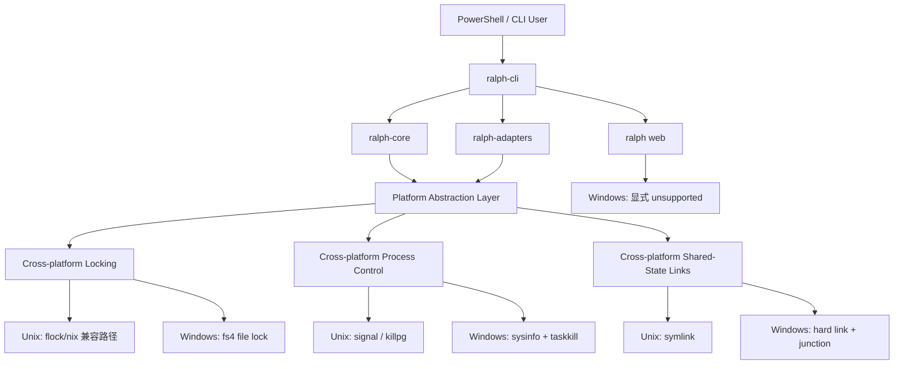

# Dev Plan: Windows 原生支持适配

## 输入前置条件表

| 类别 | 内容 | 是否已提供 | 备注 |
|------|------|------------|------|
| 仓库/模块 | `crates/ralph-core`、`crates/ralph-cli`、`crates/ralph-adapters`、`.github/workflows`、`README.md`、`docs/reference/*` | 是 | 已完成代码与工作流扫描 |
|
目标接口 | `ralph run`、`ralph loops list/stop`、backend 执行层（PTY / CLI / ACP）、发布构建、PowerShell 完成脚本 | 是 | `ralph web` 明确不做原生支持 |
| 运行环境 | Rust/Cargo、Git worktree、GitHub Actions、PowerShell 7、`x86_64-pc-windows-msvc` | 是 | 本地 macOS 环境当前未安装 `pwsh`，需补充 |
| 约束条件 | 原生 Windows + PowerShell；`web launcher` 不纳入；发布只做二进制；后段补 Windows CI | 是 | 来源于本轮对话确认 |
| 已有测试 | `cargo test`、`cargo test -p ralph-core smoke_runner`、大量 Unix-only 单测/集成测试 | 是 | 当前无常规 Windows CI 门禁 |
| 需求来源 | 口头需求 + 本轮仓库盘点结果 | 是 | 需求时间窗口为 2026-04-02 至 2026-04-03 |

### 输入信息处理结论

- 已知信息：
  - 当前主线存在大量 `#[cfg(unix)]`、`nix::`、`symlink`、`sh`、`/tmp` 假设。
  - `Cargo.toml` 当前发布目标未包含 Windows。
  - 远端存在 `fix-windows-pty-hang` 分支，说明 Windows 问题已有局部历史修复，但未进入完整主线支持。
- 缺失信息：
  - 用户真实 Windows 机器的 backend 安装情况与版本。
  - 本地 macOS 上 `pwsh` 的安装路径与版本。
  - 是否需要后续扩展到 `aarch64-pc-windows-msvc`。
- 当前假设：
  - 本期仅支持 `x86_64-pc-windows-msvc`。
  - Windows 开发/验收默认基于 PowerShell 7 与 Git for Windows。
  - `.worktrees` 与主仓库位于同一卷，满足 hard link / junction 使用前提。
  - 若上游 backend 官方 CLI 本身不支持 Windows，Ralph 只保证快速失败与清晰报错。

## 1. 概览（Overview）

- 一句话目标：将 Ralph 核心 CLI 适配为原生 Windows + PowerShell 可用，并补齐 Windows CI 与二进制发布能力。
- 优先级：`[P0]`
- 预计时间：`8-10 人日`
- 当前状态：`[PLANNING]`
- 需求来源：本轮口头需求、仓库扫描结果、现有 CI / 发布配置、Unix-only 代码路径盘点
- 最终交付物：
  - 原生 Windows 可运行的 `ralph run` / `ralph loops`
  - Windows 下可用的并行 worktree 共享状态能力
  - Windows CI 门禁
  - Windows 二进制发布目标
  - PowerShell 验证脚本
  - 与本计划对应的 `.ralph/specs/windows-native-support/` 规格文档集

## 2. 背景与目标（Background & Goals）

### 2.1 为什么要做（Why）

当前 Ralph 的核心实现仍以 Unix 为默认前提：文件锁依赖 `flock()`，并行 loop 共享状态依赖 symlink，进程控制依赖 `SIGTERM` / `killpg` / `tokio::signal::unix`，部分测试与运行路径直接写死 `sh`、`/tmp`、Unix 权限位。发布配置也明确排除了 Windows target。

这导致两个直接痛点：

1. Ralph 无法作为“原生 Windows + PowerShell 工具”稳定使用，只能退回 WSL 或不可用状态。
2. 当前没有 Windows CI 门禁，任何平台回归只能在用户侧暴露。

触发原因是本轮需求明确要求做 Windows 适配，并希望用 macOS + PowerShell 先行实验，但最终目标仍是原生 Windows 支持。预期收益包括：扩大可用平台、减少 WSL 依赖、降低平台回归风险、让发布物覆盖 Windows 用户。

### 2.2 具体目标（What）

1. 让 `ralph-cli`、`ralph-core`、`ralph-adapters` 在 `x86_64-pc-windows-msvc` 上可编译、可测试。
2. 让 `ralph run` 在 Windows PowerShell 下支持 primary loop、parallel worktree loop、共享 memories/specs/tasks。
3. 让 `ralph loops list/stop --force` 在 Windows 下具备可验证的进程探测与清理行为。
4. 让 PTY / ACP / 普通 CLI 三类 backend 执行层在 Windows 下不出现“立即退出后挂死”或“子进程泄漏”。
5. 在 GitHub Actions 中增加 `windows-latest` 验收门禁，并将其纳入 PR 质量控制。
6. 将 Windows 二进制目标纳入发布矩阵，至少生成 `x86_64-pc-windows-msvc` 发布物。
7. 更新 README / FAQ / Troubleshooting，明确“核心 CLI 原生支持 Windows，`ralph web` 不在本次支持范围”。

### 2.3 范围边界、依赖与风险（Out of Scope / Dependencies / Risks）

| 类型 | 内容 | 说明 |
|------|------|------|
| Out of Scope | `ralph web` Windows 原生启动支持 | 本期仅改为显式 unsupported，不实现 launcher |
| Out of Scope | `aarch64-pc-windows-msvc` | 本期只做 `x86_64-pc-windows-msvc` |
| Out of Scope | MSI / winget / scoop | 本期只交付二进制构建与发布目标 |
| Out of Scope | 全量 Bash 脚本迁移为 PowerShell | 仅新增必要 Windows smoke 脚本，不重写全部现有脚本 |
| Dependencies | Git for Windows `worktree` 能力 | 并行 loop 仍基于 git worktree |
| Dependencies | PowerShell 7 | 本地预检查与 Windows 用户入口统一采用 PowerShell |
| Dependencies | GitHub Actions `windows-latest` | 作为正式验收环境 |
| Dependencies | 上游 backend 官方 CLI | 仅对官方支持 Windows 的 backend 提供正式运行保障 |
| Risks | hard link / junction 跨卷失败 | 影响 worktree 共享状态创建 |
| Risks | PTY 在 Windows 上行为与 Unix 不一致 | 影响 Claude 等 PTY backend 稳定性 |
| Risks | `taskkill` 的树状终止行为与 Unix 信号语义不同 | 影响 stop / cleanup 一致性 |
| Risks | macOS + `pwsh` 只能验证 shell 层，不等价于原生 Windows | 不能替代最终验收 |
| Risks | 现有 Unix-only 测试较多 | 测试拆分与改造工作量较大 |
| Assumptions | 使用 `fs4` 统一文件锁 | 避免继续维护 `flock` 专用实现 |
| Assumptions | Windows 进程存活检查使用 `sysinfo` | 避免平台特化 syscall 分散在业务代码中 |
| Assumptions | Windows 进程树强制终止使用 `taskkill /T /F` | 优先保证可靠清理，而非完全模拟 Unix 信号 |
| Assumptions | memories 使用 hard link，specs/tasks 使用 junction | 避免依赖 Windows Developer Mode symlink 权限 |

### 2.4 成功标准与验收映射（Success Criteria & Verification）

| 目标 | 验证方式 | 类型 | 通过判定 |
|------|----------|------|----------|
| Rust 核心模块可在 Windows 编译 | `cargo check --workspace --target x86_64-pc-windows-msvc` | 自动 | 命令退出码为 0 |
| 单 loop 与并行 worktree loop 可运行 | `cargo test -p ralph-cli --test integration_windows_loops -- --nocapture` | 自动 | Windows 专项集成测试全部通过 |
| 共享 memories/specs/tasks 生效 | `cargo test -p ralph-core --test platform_cross_platform -- --nocapture` | 自动 | 共享状态链接测试全部通过 |
| PTY / ACP / CLI backend 无挂死、无残留子进程 | `cargo test -p ralph-adapters --test windows_backend_cleanup -- --nocapture` | 自动 | backend 清理与快速失败测试全部通过 |
| Windows CI 正式落地 | 查看 PR / workflow 中 `windows-latest` 任务 | 人工 | Windows Job 绿色且为必经门禁 |
| Windows 发布目标纳入构建 | `cargo dist build --target x86_64-pc-windows-msvc --artifacts local` | 自动 | 生成 Windows 可执行发布物 |
| 文档与支持边界一致 | `rg -n 'Windows|PowerShell|WSL|web.*不支持' README.md docs/reference/faq.md docs/reference/troubleshooting.md` | 自动/人工 | 文档不再将核心 CLI 描述为 WSL-only，且明确 `web` 不支持 |

## 3. 技术方案（Technical Design）

### 3.1 高层架构



### 3.2 核心流程

1. 用户在 PowerShell 中执行 `ralph run`。
2. `ralph-cli` 调用跨平台锁抽象尝试获取 primary loop lock。
3. 若 lock 空闲，则作为 primary loop 运行；若 lock 已被占用且 `features.parallel = true`，则创建 worktree。
4. worktree 创建后，平台链接抽象负责共享 `.ralph/agent/memories.md`、`.ralph/specs/`、`.ralph/tasks/`。
5. backend 执行进入 PTY / CLI / ACP 三类执行层之一。
6. 运行过程中的停止、超时、清理统一经过平台进程控制层，而不是直接散落在业务代码里。
7. loop registry、merge queue、memory/task 文件访问统一经过跨平台文件锁。
8. 在 Windows 调用 `ralph web` 时，立即返回明确错误，提示当前不在支持范围。

### 3.3 技术栈与运行依赖

- 语言 / 框架：
  - Rust
  - Cargo
  - GitHub Actions
  - PowerShell 7
- 数据库：
  - 无新增数据库
- 缓存 / 队列 / 中间件：
  - 无新增中间件
  - 继续使用 `.ralph/merge-queue.jsonl` 等文件型状态
- 第三方服务 / 工具：
  - Git / git worktree
  - backend 官方 CLI（claude / codex / gemini / kiro / kiro-acp / roo / custom）
- 新增依赖决策：
  - `fs4`：统一跨平台文件锁
  - `sysinfo`：统一进程存活探测
- 构建 / 测试 / 部署：
  - `x86_64-pc-windows-msvc`
  - `cargo dist`
  - `windows-latest` GitHub Actions job

### 3.4 关键技术点

- `[CORE]` 用 `fs4` 替换当前 `flock()` 专用实现，统一 `FileLock`、`LoopLock`、`LoopRegistry`、`MergeQueue`。
- `[CORE]` 引入平台进程控制层，统一“进程是否存活”“如何强制清理”“如何处理 orphan loop”。
- `[CORE]` 用 hard link + junction 替代 Windows 上的 symlink 依赖，保证并行 loop 共享状态。
- `[NOTE]` `macOS + pwsh` 只用于 shell 层和命令契约预检查，正式验收仍以原生 Windows CI 为准。
- `[NOTE]` `ralph web` 不做 Windows 支持，但必须返回清晰、稳定、可测试的错误提示。
- `[OPT]` 后续可评估用 Windows Job Object 替代 `taskkill`，进一步增强子进程树清理可靠性。
- `[COMPAT]` 不允许破坏现有 Unix 行为；macOS / Linux 主线测试必须继续通过。
- `[COMPAT]` PowerShell completion 生成必须继续可用。
- `[ROLLBACK]` 若 Windows CI 新增后稳定性不足，不回退核心平台抽象，只允许临时隔离新增测试或发布目标。
- `[ROLLBACK]` 任何超出范围的广泛脚本重写都视为风险扩散，必须回滚到最近验证通过点。

### 3.5 模块与文件改动设计

#### 模块级设计

- `ralph-core`
  - 增加平台抽象层，承接文件锁、进程探测、共享状态链接策略。
  - 将当前 `UnsupportedPlatform` 路径替换为真实 Windows 实现。
- `ralph-cli`
  - 将 loop 入口、list/stop、interrupt、worktree 初始化改为调用平台抽象。
  - `ralph web` 在 Windows 上改为显式 unsupported。
- `ralph-adapters`
  - 清理无条件 `nix` 依赖与未加平台门的进程清理代码。
  - 确保 PTY / ACP / CLI 三类执行层在 Windows 编译和清理路径上闭环。
- CI / 发布
  - 新增 Windows 验证 job。
  - 将 Windows target 纳入 cargo-dist 发布矩阵。
- 文档
  - 更新安装、支持平台、故障排查、PowerShell 说明。

#### 文件级改动清单

| 类型 | 路径 | 说明 |
|------|------|------|
| 新增 | `crates/ralph-core/src/platform/mod.rs` | 平台抽象入口 |
| 新增 | `crates/ralph-core/src/platform/locks.rs` | 跨平台文件锁封装 |
| 新增 | `crates/ralph-core/src/platform/process.rs` | 进程存活探测与树状终止 |
| 新增 | `crates/ralph-core/src/platform/fs_links.rs` | symlink / hard link / junction 统一策略 |
| 新增 | `crates/ralph-core/tests/platform_cross_platform.rs` | 平台层回归测试 |
| 新增 | `crates/ralph-cli/tests/integration_windows_loops.rs` | Windows loop 集成测试 |
| 新增 | `crates/ralph-adapters/tests/windows_backend_cleanup.rs` | Windows backend 清理测试 |
| 新增 | `scripts/windows-smoke.ps1` | PowerShell 验证脚本 |
| 修改 | `Cargo.toml` | 新增 Windows 发布 target 与依赖声明 |
| 修改 | `.github/workflows/ci.yml` | 新增 `windows-latest` 验收 job |
| 修改 | `.github/workflows/release.yml` | Windows 发布矩阵与校验步骤 |
| 修改 | `crates/ralph-core/src/file_lock.rs` | 切换到跨平台锁实现 |
| 修改 | `crates/ralph-core/src/loop_lock.rs` | Windows loop lock 支持 |
| 修改 | `crates/ralph-core/src/loop_registry.rs` | Windows PID 存活检查与 registry 锁 |
| 修改 | `crates/ralph-core/src/merge_queue.rs` | Windows 文件锁与 merge 持久化 |
| 修改 | `crates/ralph-core/src/loop_context.rs` | Windows 共享状态链接创建 |
| 修改 | `crates/ralph-core/src/worktree.rs` | Windows 工作树同步与链接复制策略 |
| 修改 | `crates/ralph-core/src/lib.rs` | 导出平台模块 |
| 修改 | `crates/ralph-cli/src/main.rs` | loop lock / worktree 入口适配 |
| 修改 | `crates/ralph-cli/src/loops.rs` | list/stop/orphan cleanup Windows 支持 |
| 修改 | `crates/ralph-cli/src/loop_runner.rs` | interrupt / cleanup / worker 终止适配 |
| 修改 | `crates/ralph-cli/src/web.rs` | Windows 显式 unsupported |
| 修改 | `crates/ralph-adapters/Cargo.toml` | `nix` 平台门与新依赖整理 |
| 修改 | `crates/ralph-adapters/src/cli_executor.rs` | Windows 终止路径统一 |
| 修改 | `crates/ralph-adapters/src/pty_executor.rs` | Windows PTY 快速失败与清理 |
| 修改 | `crates/ralph-adapters/src/acp_executor.rs` | Windows ACP 子进程树清理 |
| 修改 | `README.md` | Windows / PowerShell 支持说明 |
| 修改 | `docs/reference/faq.md` | 去除 WSL-only 口径 |
| 修改 | `docs/reference/troubleshooting.md` | 增加 PowerShell / Windows 故障排查 |
| 删除 | 无 | 本期不计划删除核心文件 |

### 3.6 边界情况与异常处理

- `pwsh` 未安装：
  - 本地预检查任务标记失败，但不影响代码实现；记录为环境 blocker。
- backend 命令不在 PATH：
  - Windows 下必须快速失败并给出“未安装或未在 PATH”提示，不允许 PTY/ACP 挂死。
- `.worktrees` 与主仓库不在同一卷：
  - Windows 共享状态链接创建失败时立即报错并阻断进入 worktree loop，不使用静默 copy fallback。
- worktree 已被外部删除：
  - registry 中保留 orphan 可见性，`loops stop` 支持清理。
- `taskkill` 执行失败：
  - 记录命令与 PID，标记为 `[BLOCKED]`，禁止继续推进后续 stop/cleanup 相关任务。
- 旧 Unix-only 测试不适用于 Windows：
  - 拆成跨平台测试与 Unix 专项测试；禁止直接删除断言。
- `ralph web` 在 Windows 被调用：
  - 立即返回固定错误消息与非 0 退出码。
- PowerShell completion 生成：
  - 必须保持输出正常，不能因为 Windows 适配回归。
- 发布目标增加后 CI 时长上升：
  - 允许新建 Windows 专项 job，但不能弱化现有 Linux / macOS 质量门禁。

### 3.7 测试策略

- 单元测试：
  - 新增平台层测试，覆盖文件锁、进程存活检查、Windows 链接策略。
- 集成测试：
  - 新增 `integration_windows_loops.rs`，覆盖 `run`、`loops list`、`loops stop`、worktree 共享状态、web unsupported。
  - 新增 `windows_backend_cleanup.rs`，覆盖 PTY / ACP / CLI 失败与清理路径。
- 回归测试：
  - 保持 `cargo test`
  - 保持 `cargo test -p ralph-core smoke_runner`
  - 保持现有 Unix 行为不回归
- lint / build / typecheck：
  - `cargo fmt --check`
  - `cargo clippy --workspace -- -D warnings`
  - `cargo check --workspace --target x86_64-pc-windows-msvc`
- 人工验证：
  - Windows CI 绿色
  - Windows 发布物可启动基础命令
  - 本地 `pwsh` smoke 输出契约正确
- 需要新增的测试：
  - `crates/ralph-core/tests/platform_cross_platform.rs`
  - `crates/ralph-cli/tests/integration_windows_loops.rs`
  - `crates/ralph-adapters/tests/windows_backend_cleanup.rs`
- 需要修改的测试：
  - 将现有仅适用于 Unix 的 lock / worktree / backend 测试拆分平台门
- 必须保持通过的现有测试：
  - `cargo test`
  - `cargo test -p ralph-core smoke_runner`

## 4. 实施计划（Implementation Plan）

### 4.1 执行基本原则（强制）

1. 所有任务必须可客观验证。
2. 任务必须单一目的、可回滚、影响面可控。
3. Task N 未验证通过，禁止进入 Task N+1。
4. 失败必须记录原因和处理路径，禁止死循环。
5. 禁止通过弱化断言、硬编码结果、跳过校验来“伪完成”。

### 4.2 分阶段实施

#### 阶段 1：准备与基线确认
- 阶段目标：锁定 Windows 支持边界、验证矩阵与本地/CI smoke 入口。
- 预计时间：`1.5 人日`
- 交付物：规格文档骨架、Windows smoke 脚本、验证矩阵
- 进入条件：当前计划已确认范围、支持级别、backend 范围、发布范围
- 完成条件：spec 骨架存在；PowerShell smoke 脚本存在；后续实现有稳定门禁入口
- 当前状态：`[TODO]`

#### 阶段 2：核心实现
- 阶段目标：完成锁、进程、共享链接、CLI/backend 主路径的跨平台改造。
- 预计时间：`4 人日`
- 交付物：跨平台平台层、Windows 主运行路径、显式 unsupported 的 web 行为
- 进入条件：阶段 1 完成并验证通过
- 完成条件：核心模块可在 Windows 编译，专项测试初步通过
- 当前状态：`[TODO]`

#### 阶段 3：测试与验证
- 阶段目标：补齐自动化测试、Windows CI、发布构建验证。
- 预计时间：`2.5 人日`
- 交付物：Windows 测试集、`windows-latest` CI、Windows 发布 target
- 进入条件：阶段 2 完成并验证通过
- 完成条件：Windows CI 绿色，Windows target 可构建
- 当前状态：`[TODO]`

#### 阶段 4：收尾与完成确认
- 阶段目标：完成文档、总验收、状态同步与交付确认。
- 预计时间：`1 人日`
- 交付物：更新后的 README / FAQ / Troubleshooting、完成状态记录
- 进入条件：阶段 3 完成并验证通过
- 完成条件：Definition of Done 全部满足
- 当前状态：`[TODO]`

### 4.3 Task 列表（必须使用统一模板）

#### Task 01: 建立 Windows 规格骨架与支持矩阵

| 项目 | 内容 |
|------|------|
| 目标 | 在 `.ralph/specs/windows-native-support/` 建立 requirements / design / implementation 规格骨架，并记录范围、假设、验收矩阵 |
| 代码范围 | `.ralph/specs/windows-native-support/` |
| 预期改动 | 新增规格文件，固化支持边界、目标 backend、验证命令、Out of Scope |
| 前置条件 | 当前 Dev Plan 已确认 |
| 输出产物 | `requirements.md`、`design.md`、`implementation/plan.md` |
| 当前状态 | `[TODO]` |

**验证命令 / 检查方式**：

```bash
test -f .ralph/specs/windows-native-support/requirements.md
test -f .ralph/specs/windows-native-support/design.md
test -f .ralph/specs/windows-native-support/implementation/plan.md
rg -n 'Windows|PowerShell|x86_64-pc-windows-msvc|web.*不支持' .ralph/specs/windows-native-support
```

**通过判定**：

- [PASS] 规格目录与 3 个关键文件存在
- [PASS] 规格中明确记录支持范围、Out of Scope、验证矩阵
- [PASS] 文档内容与本 Dev Plan 不冲突

**失败处理**：

- 失败后先核对 spec 目录位置是否符合仓库约定
- 最多允许 2 次修复重试
- 第 3 次仍失败则标记为 `[BLOCKED]`，停止后续任务并记录目录约定 blocker

**门禁规则**：

- [BLOCK] 规格骨架未通过前，禁止进入 Task 02

#### Task 02: 建立 PowerShell smoke 入口与本地预检查基线

| 项目 | 内容 |
|------|------|
| 目标 | 新增 `scripts/windows-smoke.ps1`，统一本地 `pwsh` 与 Windows CI 的基础验证入口 |
| 代码范围 | `scripts/windows-smoke.ps1`、`.ralph/specs/windows-native-support/*` |
| 预期改动 | 新增 PowerShell smoke 脚本，覆盖 compile / loop / cleanup / docs 四类检查 |
| 前置条件 | Task 01 已完成 |
| 输出产物 | `scripts/windows-smoke.ps1`、脚本使用说明 |
| 当前状态 | `[TODO]` |

**验证命令 / 检查方式**：

```bash
pwsh -NoLogo -NoProfile -File scripts/windows-smoke.ps1 -Mode Baseline
# 人工检查：确认脚本输出包含 compile / loop / cleanup / docs 四类检查项
```

**通过判定**：

- [PASS] 脚本可被 `pwsh` 执行
- [PASS] 脚本输出检查项完整且退出码与失败状态一致
- [PASS] 脚本可被后续 CI 直接复用

**失败处理**：

- 失败后先区分“本机未安装 pwsh”与“脚本自身错误”
- 最多允许 2 次修复重试
- 第 3 次仍失败则标记为 `[BLOCKED]`，并记录为环境 blocker 或脚本 blocker

**门禁规则**：

- [BLOCK] smoke 入口未验证通过前，禁止进入核心实现任务

#### Task 03: 实现跨平台文件锁抽象并替换核心锁路径

| 项目 | 内容 |
|------|------|
| 目标 | 用统一锁抽象替换 `flock()`-only 路径，覆盖 `FileLock`、`LoopLock`、`LoopRegistry`、`MergeQueue` |
| 代码范围 | `crates/ralph-core/src/platform/locks.rs`、`crates/ralph-core/src/file_lock.rs`、`crates/ralph-core/src/loop_lock.rs`、`crates/ralph-core/src/loop_registry.rs`、`crates/ralph-core/src/merge_queue.rs` |
| 预期改动 | 引入 `fs4` 并移除核心路径上的 `UnsupportedPlatform` 行为 |
| 前置条件 | Task 02 已完成 |
| 输出产物 | 跨平台文件锁实现与对应测试 |
| 当前状态 | `[TODO]` |

**验证命令 / 检查方式**：

```bash
cargo test -p ralph-core --test platform_cross_platform -- --nocapture
cargo check -p ralph-core --target x86_64-pc-windows-msvc
```

**通过判定**：

- [PASS] `ralph-core` 锁相关测试通过
- [PASS] Windows target 下 `ralph-core` 编译通过
- [PASS] 锁相关核心路径不再走 `UnsupportedPlatform` 退化逻辑

**失败处理**：

- 失败后先核对锁语义是否与原实现一致，再检查 Windows 编译错误
- 最多允许 2 次修复重试
- 第 3 次仍失败则标记为 `[BLOCKED]`，暂停所有依赖锁的任务

**门禁规则**：

- [BLOCK] 锁抽象未通过前，禁止进入 Task 04、Task 05

#### Task 04: 实现跨平台进程探测与清理

| 项目 | 内容 |
|------|------|
| 目标 | 用统一进程控制层替换散落的 `kill` / `killpg` / `signal 0` / `start_kill` 逻辑 |
| 代码范围 | `crates/ralph-core/src/platform/process.rs`、`crates/ralph-core/src/loop_registry.rs`、`crates/ralph-cli/src/loops.rs`、`crates/ralph-cli/src/loop_runner.rs` |
| 预期改动 | 使用 `sysinfo` 做存活检查，Windows 下使用 `taskkill /T /F` 做树状强制终止 |
| 前置条件 | Task 03 已完成 |
| 输出产物 | 统一进程控制 API 与 orphan cleanup 支持 |
| 当前状态 | `[TODO]` |

**验证命令 / 检查方式**：

```bash
cargo test -p ralph-core --test platform_cross_platform process_control -- --nocapture
cargo test -p ralph-cli --test integration_windows_loops stop_and_orphan_cleanup -- --nocapture
```

**通过判定**：

- [PASS] Windows / Unix 都能正确判断 PID 存活
- [PASS] `loops stop` 与 orphan cleanup 行为在测试中可重复验证
- [PASS] 进程清理路径不再依赖未加平台门的 `nix::` 调用

**失败处理**：

- 失败后先核对“协作式停止”和“强制终止”是否被混淆
- 最多允许 2 次修复重试
- 第 3 次仍失败则标记为 `[BLOCKED]`，记录具体 PID / cleanup blocker

**门禁规则**：

- [BLOCK] 进程控制未通过前，禁止进入 Task 06、Task 07

#### Task 05: 实现 Windows worktree 共享状态链接策略

| 项目 | 内容 |
|------|------|
| 目标 | 让 Windows worktree loop 可共享 memories/specs/tasks，替代当前 Unix symlink-only 路径 |
| 代码范围 | `crates/ralph-core/src/platform/fs_links.rs`、`crates/ralph-core/src/loop_context.rs`、`crates/ralph-core/src/worktree.rs` |
| 预期改动 | memories 使用 hard link，specs/tasks 使用 junction；失败时给出明确报错 |
| 前置条件 | Task 03 已完成 |
| 输出产物 | 跨平台共享状态链接实现与回归测试 |
| 当前状态 | `[TODO]` |

**验证命令 / 检查方式**：

```bash
cargo test -p ralph-core --test platform_cross_platform worktree_link_strategy -- --nocapture
cargo test -p ralph-cli --test integration_windows_loops worktree_shared_state -- --nocapture
```

**通过判定**：

- [PASS] Windows worktree 可创建共享 memories/specs/tasks
- [PASS] 同卷前提不满足时返回明确错误，而不是静默退化
- [PASS] Unix 现有 symlink 行为不回归

**失败处理**：

- 失败后先核对目标路径类型与卷信息
- 最多允许 2 次修复重试
- 第 3 次仍失败则标记为 `[BLOCKED]`，并记录 link strategy blocker

**门禁规则**：

- [BLOCK] 共享状态链接未通过前，禁止进入 Windows 并行 loop 相关后续任务

#### Task 06: 清理 adapters 编译阻塞并统一 backend 清理路径

| 项目 | 内容 |
|------|------|
| 目标 | 让 `ralph-adapters` 在 Windows 可编译，并消除 PTY / ACP / CLI backend 清理路径中的平台漏洞 |
| 代码范围 | `crates/ralph-adapters/Cargo.toml`、`crates/ralph-adapters/src/cli_executor.rs`、`crates/ralph-adapters/src/pty_executor.rs`、`crates/ralph-adapters/src/acp_executor.rs` |
| 预期改动 | 收口 `nix` 依赖到 Unix；Windows 下统一快速失败与子进程清理行为 |
| 前置条件 | Task 04 已完成 |
| 输出产物 | 可在 Windows 编译的 adapters 与专项测试 |
| 当前状态 | `[TODO]` |

**验证命令 / 检查方式**：

```bash
cargo check -p ralph-adapters --target x86_64-pc-windows-msvc
cargo test -p ralph-adapters --test windows_backend_cleanup -- --nocapture
```

**通过判定**：

- [PASS] `ralph-adapters` Windows target 编译通过
- [PASS] backend 缺失场景快速失败，不再挂死
- [PASS] ACP / PTY / CLI 清理路径测试通过

**失败处理**：

- 失败后先区分编译错误、挂死错误、清理泄漏错误
- 最多允许 2 次修复重试
- 第 3 次仍失败则标记为 `[BLOCKED]`，暂停所有依赖 backend 执行层的任务

**门禁规则**：

- [BLOCK] adapters 未通过前，禁止进入 Task 07、Task 08

#### Task 07: 适配 CLI 主路径与 Windows 行为边界

| 项目 | 内容 |
|------|------|
| 目标 | 完成 `ralph run` / `ralph loops` / PowerShell completion / `ralph web` Windows 行为边界适配 |
| 代码范围 | `crates/ralph-cli/src/main.rs`、`crates/ralph-cli/src/loops.rs`、`crates/ralph-cli/src/loop_runner.rs`、`crates/ralph-cli/src/web.rs`、`crates/ralph-cli/src/completions.rs` |
| 预期改动 | 让 CLI 核心路径在 Windows 工作，并让 `ralph web` 显式 unsupported |
| 前置条件 | Task 04、Task 05、Task 06 已完成 |
| 输出产物 | Windows CLI 主路径适配与对应测试 |
| 当前状态 | `[TODO]` |

**验证命令 / 检查方式**：

```bash
cargo test -p ralph-cli --test integration_windows_loops run_list_stop -- --nocapture
cargo test -p ralph-cli --test integration_windows_loops web_unsupported_on_windows -- --nocapture
cargo run -p ralph-cli -- completions powershell > /tmp/ralph-completion.ps1
```

**通过判定**：

- [PASS] `run/list/stop` 的 Windows 专项集成测试通过
- [PASS] `ralph web` 在 Windows 返回明确 unsupported 错误
- [PASS] PowerShell completion 正常生成

**失败处理**：

- 失败后先定位是入口逻辑、stop 逻辑还是 web 边界错误
- 最多允许 2 次修复重试
- 第 3 次仍失败则标记为 `[BLOCKED]`

**门禁规则**：

- [BLOCK] CLI 主路径未通过前，禁止进入阶段 3

#### Task 08: 补齐平台专项测试并收敛 Unix-only 测试拆分

| 项目 | 内容 |
|------|------|
| 目标 | 建立稳定的 Windows 专项测试集，并重构不适合跨平台的旧测试门 |
| 代码范围 | `crates/ralph-core/tests/platform_cross_platform.rs`、`crates/ralph-cli/tests/integration_windows_loops.rs`、`crates/ralph-adapters/tests/windows_backend_cleanup.rs`、相关旧测试文件 |
| 预期改动 | 新增/重构测试，保留 Unix 行为断言，不允许靠删断言过关 |
| 前置条件 | Task 07 已完成 |
| 输出产物 | 稳定可复用的 Windows 回归测试集 |
| 当前状态 | `[TODO]` |

**验证命令 / 检查方式**：

```bash
cargo test -p ralph-core --test platform_cross_platform -- --nocapture
cargo test -p ralph-cli --test integration_windows_loops -- --nocapture
cargo test -p ralph-adapters --test windows_backend_cleanup -- --nocapture
cargo test -p ralph-core smoke_runner
```

**通过判定**：

- [PASS] 三个 Windows 专项测试入口全部通过
- [PASS] `smoke_runner` 继续通过
- [PASS] 没有通过删断言或跳过测试来“伪完成”

**失败处理**：

- 失败后先确认是测试设计问题还是实现回归
- 最多允许 2 次修复重试
- 第 3 次仍失败则标记为 `[BLOCKED]`，禁止引入更多新行为

**门禁规则**：

- [BLOCK] Windows 测试集未稳定前，禁止进入 CI / 发布任务

#### Task 09: 将 Windows 验收纳入 GitHub Actions CI

| 项目 | 内容 |
|------|------|
| 目标 | 在 `.github/workflows/ci.yml` 中增加 `windows-latest` 验收 job，并复用 `scripts/windows-smoke.ps1` |
| 代码范围 | `.github/workflows/ci.yml`、`scripts/windows-smoke.ps1` |
| 预期改动 | 新增 Windows job，执行编译、专项测试、smoke 脚本 |
| 前置条件 | Task 08 已完成 |
| 输出产物 | CI 中稳定的 Windows 质量门禁 |
| 当前状态 | `[TODO]` |

**验证命令 / 检查方式**：

```bash
rg -n 'windows-latest|pwsh|windows-smoke.ps1|x86_64-pc-windows-msvc' .github/workflows/ci.yml
# 人工检查：在 GitHub Actions 中确认 Windows Job 绿色
```

**通过判定**：

- [PASS] CI 文件中存在独立 Windows job
- [PASS] Windows job 执行 smoke 与专项测试
- [PASS] GitHub Actions 中该 job 为绿色

**失败处理**：

- 失败后先区分 workflow 配置错误、runner 环境错误、代码行为错误
- 最多允许 2 次修复重试
- 第 3 次仍失败则标记为 `[BLOCKED]`，暂停发布目标接入

**门禁规则**：

- [BLOCK] Windows CI 未通过前，禁止进入 Task 10

#### Task 10: 将 Windows 二进制目标纳入发布矩阵

| 项目 | 内容 |
|------|------|
| 目标 | 将 `x86_64-pc-windows-msvc` 纳入 cargo-dist / release 构建矩阵 |
| 代码范围 | `Cargo.toml`、`.github/workflows/release.yml` |
| 预期改动 | 更新 dist targets、发布矩阵与必要的 Windows 构建校验 |
| 前置条件 | Task 09 已完成 |
| 输出产物 | Windows 发布构建目标与本地验证命令 |
| 当前状态 | `[TODO]` |

**验证命令 / 检查方式**：

```bash
rg -n 'x86_64-pc-windows-msvc' Cargo.toml .github/workflows/release.yml
cargo dist build --target x86_64-pc-windows-msvc --artifacts local
```

**通过判定**：

- [PASS] 发布配置明确包含 Windows target
- [PASS] 本地 `cargo dist build` 能生成 Windows 发布物
- [PASS] 不需要引入 MSI / winget / scoop 也能完成本期目标

**失败处理**：

- 失败后先核对 cargo-dist 配置与 release workflow 一致性
- 最多允许 2 次修复重试
- 第 3 次仍失败则标记为 `[BLOCKED]`，记录发布 blocker

**门禁规则**：

- [BLOCK] Windows 发布目标未通过前，禁止进入文档收尾与最终完成确认

#### Task 11: 更新文档并明确支持边界

| 项目 | 内容 |
|------|------|
| 目标 | 更新 README / FAQ / Troubleshooting，统一 Windows 与 PowerShell 口径，并明确 `ralph web` 不支持 |
| 代码范围 | `README.md`、`docs/reference/faq.md`、`docs/reference/troubleshooting.md` |
| 预期改动 | 修正文档中 WSL-only 表述，增加 PowerShell 使用与故障排查 |
| 前置条件 | Task 10 已完成 |
| 输出产物 | 完整一致的用户文档 |
| 当前状态 | `[TODO]` |

**验证命令 / 检查方式**：

```bash
rg -n 'Windows|PowerShell|WSL|web.*不支持' README.md docs/reference/faq.md docs/reference/troubleshooting.md
```

**通过判定**：

- [PASS] 文档与当前支持范围一致
- [PASS] 核心 CLI 不再被描述为“仅限 WSL”
- [PASS] `ralph web` 的 Windows 边界被明确记录

**失败处理**：

- 失败后先核对文档是否仍沿用旧支持描述
- 最多允许 2 次修复重试
- 第 3 次仍失败则标记为 `[BLOCKED]`

**门禁规则**：

- [BLOCK] 文档未通过前，禁止标记整个计划完成

#### Task 12: 执行全量验收并完成状态同步

| 项目 | 内容 |
|------|------|
| 目标 | 运行最终验收命令、收集人工结果、更新阶段和任务状态 |
| 代码范围 | 全仓库、CI 结果、发布物记录、规格状态同步 |
| 预期改动 | 无新增功能；仅完成验收、记录与状态更新 |
| 前置条件 | Task 11 已完成 |
| 输出产物 | 完整的验收记录、阶段状态更新、完成确认 |
| 当前状态 | `[TODO]` |

**验证命令 / 检查方式**：

```bash
cargo test
cargo test -p ralph-core smoke_runner
cargo check --workspace --target x86_64-pc-windows-msvc
pwsh -NoLogo -NoProfile -File scripts/windows-smoke.ps1 -Mode Full
# 人工检查：Windows CI 绿色；Windows 发布物可执行最小 smoke
```

**通过判定**：

- [PASS] 所有自动命令退出码为 0
- [PASS] Windows CI 与发布物人工检查完成
- [PASS] 所有 Task 与阶段状态已同步更新

**失败处理**：

- 失败后先定位具体失败项，不允许“一把重构”扩大修改面
- 最多允许 2 次修复重试
- 第 3 次仍失败则标记为 `[BLOCKED]`，停止继续宣称完成

**门禁规则**：

- [BLOCK] Task 12 未通过前，禁止标记整个计划为 `[DONE]`

## 5. 失败处理协议（Error-Handling Protocol）

| 级别 | 触发条件 | 处理策略 |
|------|----------|----------|
| Level 1 | 单次验证失败 | 原地修复，禁止扩大重构 |
| Level 2 | 连续 3 次失败 | 回到假设和接口定义，重新核对输入输出 |
| Level 3 | 仍无法通过 | 停止执行，记录 Blocker，等待人工确认 |

### 重试规则

- 每次修复必须记录变更范围。
- 每次重试前必须更新状态。
- 同一类失败不得无限重复。
- 达到阈值必须升级，不得原地空转。

## 6. 状态同步机制（Stateful Plan）

### 状态标记规范

| 标记 | 含义 |
|------|------|
| [TODO] | 未开始 |
| [DOING] | 进行中 |
| [DONE] | 已完成且验证通过 |
| [BLOCKED] | 阻塞 |
| [PASS] | 当前验证通过 |
| [FAIL] | 当前验证失败 |

### 强制要求

- 每一轮执行必须更新状态。
- 未验证通过前禁止标记 `[DONE]`。
- 遇到问题必须记录失败原因和阻塞点。
- 若阶段完成，必须同步更新阶段状态。

## 7. Anti-Patterns（禁止行为）

- `[FORBIDDEN]` 禁止删除或弱化现有断言
- `[FORBIDDEN]` 禁止为了通过测试而硬编码返回值
- `[FORBIDDEN]` 禁止跳过验证步骤
- `[FORBIDDEN]` 禁止引入未声明依赖
- `[FORBIDDEN]` 禁止关闭 lint / typecheck / 类型检查以规避问题
- `[FORBIDDEN]` 禁止修改超出范围的模块
- `[FORBIDDEN]` 禁止在未记录原因的情况下扩大重构范围

违反后的动作：

- Task 立即标记为 `[BLOCKED]`
- 必须回滚到最近一个验证通过点
- 必须记录触发原因

## 8. 最终完成条件（Definition of Done）

- 所有计划内 Task 已完成。
- 所有关键验证已通过。
- 没有未记录的 blocker。
- 约束条件仍被满足。
- 交付物已齐备。
- 成功标准与验收映射表中的项目全部完成。
- `.ralph/specs/windows-native-support/` 已建立并与实现一致。
- `windows-latest` CI 已成为正式验收路径。
- `x86_64-pc-windows-msvc` 发布目标已纳入构建。
- README / FAQ / Troubleshooting 已与支持边界对齐。

## 9. 质量检查清单

- [ ] 所有目标都有验证方式
- [ ] 所有 Task 都有验证方式
- [ ] 所有 Task 都具备原子性和可回滚性
- [ ] 已明确 Out of Scope
- [ ] 已明确依赖与风险
- [ ] 已明确文件级改动范围
- [ ] 已定义失败处理协议
- [ ] 已定义 Anti-Patterns
- [ ] 已定义最终完成条件
- [ ] 当前 Plan 可被 Agent 连续执行
- [ ] 当前结构可转换为 Ralph Spec
