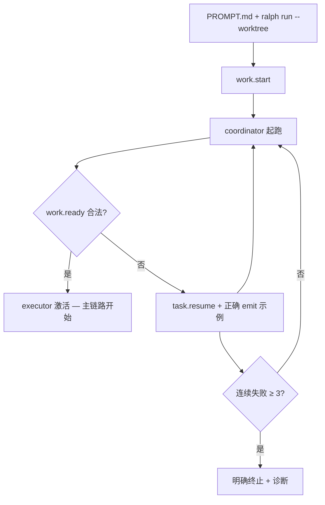

# ce-executor-isolated 起跑恢复 — 需求文档

## Problem Frame

### 谁在受影响

使用 `ce-executor-isolated` preset、通过 `PROMPT.md` 指向 dev plan 并执行：

```text
ralph -H builtin:ce-executor-isolated run --worktree --reuse-worktree
```

的 operator。典型 `PROMPT.md` 内容为单行 plan 引用，例如：

```text
Implement dev plan:docs/plans/2026-06-10-003-refactor-event-loop-and-loop-runner-tests-split-plan.md
```

### 发生了什么

Loop 经常在 **iteration 1（coordinator 起跑）** 卡死，主执行链路（executor → review → shipper）从未启动。

现场模式（见 `docs/report/2026-06-16-loop-diagnostic-report.md`）：

| 症状 | 后果 |
|------|------|
| coordinator 以纯字符串（非 JSON）发布 `work.ready` | `payload_contract_violation` |
| coordinator 发布 `build.done`、`debug.step` 等越权 topic | `isolated_scope_violation` + `task.resume` 循环 |
| Human guidance（如「Focus on error handling」）在起跑阶段注入 prompt | agent 偏离 plan 解析，转而发调试类事件 |
| 上述错误触发 `not_retriable` 或长时间空转 | loop STALLED，`work.ready` 从未成功，executor 不激活 |

### 为什么现在还没稳

6/14–6/15 已投入 **拦截**（B+C schema-aware emit、`RALPH_HATS_SOURCE` precheck、isolated scope 熔断、skill 文档修正），目标是 **减少 agent 犯错**。但当 agent 仍犯错时，**bootstrap 阶段的致命终止策略** 和 **起跑期输入噪声** 尚未处理——第一枪打歪等于整局报废。

### 用户工作流约束

- **不改变** operator 的启动命令与 `PROMPT.md` 一行指 plan 的写法。
- **不要求** operator 手动拆小 plan 或改 preset 拓扑。
- 稳定性应来自 runtime **犯错后的恢复** 与 **起跑期输入隔离**，而非再加一层编排补丁。

### 期望变化（概念流）



---

## Requirements

### 起跑期错误可恢复

- **R1.** 定义 **bootstrap 阶段**：从 loop 发出 `work.start` 起，到 **第一次** 合法 `work.ready` 被 event loop 接受为止。
- **R2.** 在 bootstrap 阶段，当 **coordinator** 因以下原因发布的事件被拒绝时，**不得** 立即将 loop 标记为 `not_retriable` 或等价的一枪毙命终止：
  - `work.ready` 的 payload 不符合 schema（含「非 JSON 字符串」类 `PayloadTypeMismatch`）
  - coordinator 发布未在 `publishes` 中声明的 topic（`isolated_scope_violation`，如 `build.done`、`debug.step`）
- **R3.** 上述拒绝必须升级为 **可操作的恢复**：向 **coordinator** 注入 `task.resume`，payload 须包含：
  - 拒绝原因（人类可读）
  - 该 hat 对该 topic **允许** 的 `--json` 示例（仅 coordinator 自己的 `work.ready` / `work.failed`，不得泄露其他 hat 的 topic 示例）
  - 明确指令：修正后重新发布，勿发布调试类或已废弃 topic（如 `build.done`）
- **R4.** 对同一 `(hat, reason_class)` 的 bootstrap 恢复实行 **有界重试**：最多 **3 次** 恢复轮次；第 4 次仍失败则终止 loop，并写入清晰诊断（hat、topic、允许列表、连续次数）到 `recovery.jsonl` 与 loop 终止摘要。
- **R5.** bootstrap 阶段结束后（首次合法 `work.ready` 已被接受），**恢复** `payload_contract_violation` 的现有语义：非 bootstrap 阶段的严重 payload 违规仍可 `not_retriable`，本需求不削弱主执行期的契约硬度。

### 起跑期输入隔离

- **R6.** 在 bootstrap 阶段，构建 **coordinator** 的 agent prompt 时：
  - **不得** 注入 `human.guidance` 事件内容
  - **不得** 注入 scratchpad 中 `### HUMAN GUIDANCE` 块
- **R7.** bootstrap 阶段 coordinator prompt 的 **必要** 上下文仍须保留：`work.start` payload（含 plan 路径提示）、plan 解析与 task 创建指令、本 hat 的 schema-aware emit 示例（已有 B 层能力）。
- **R8.** bootstrap 结束后，human guidance 的现有注入行为 **不变**（非 bootstrap hat 与阶段不受影响）。

### 起跑期越权 emit 硬拒（preset）

- **R9.** 在 `presets/en/ce-executor-isolated.yml`（及 `presets/zh/ce-executor-isolated-zh.yml` 对齐）的 `topic_deny_rules` 中，为 **coordinator** 显式拒绝：
  - `build.done`（遗留 topic，已由 `work.done` 取代）
  - `debug.*`（通配，拒绝一切调试类自造 topic）
- **R10.** 上述 deny 须在 CLI pre-publish check（已有 C 层）与 loop 读盘 gate **双重** 生效；拒绝行为与 R2–R4 的恢复路径一致，而非仅静默丢弃。

---

## Success Criteria

- **SC1（起跑 — M1）**：使用当前 operator 工作流（`PROMPT.md` 单行 plan 引用 + `ralph -H builtin:ce-executor-isolated run --worktree --reuse-worktree`），在 **3 次 coordinator 激活以内** 出现被 loop 接受的合法 JSON `work.ready`，且 executor hat 在后续 iteration 被激活。
- **SC2（自愈 — M2）**：在 bootstrap 阶段 **故意** 让 coordinator 以非 JSON 字符串发布 `work.ready` 时，loop **不** 因 `not_retriable` 立即终止；`recovery.jsonl` 可见恢复 envelope；最终在 R4 上限内自愈到 SC1，或第 4 次失败时给出可定位的终止诊断。
- **SC3（越权 — M2 变体）**：coordinator 尝试 `build.done` 或 `debug.step` 时，不进入 10+ 分钟空转；在 R4 上限内要么自愈发布合法 `work.ready`，要么明确终止。
- **SC4（隔离）**：bootstrap 期间 scratchpad 存在 `### HUMAN GUIDANCE` 或 bus 上有 `human.guidance` 时，coordinator 首轮 prompt **不包含** 这些文本；bootstrap 结束后其他 hat 仍可收到 guidance。
- **SC5（回归）**：`cargo nextest run --workspace --exclude ralph-e2e` 通过；既有 B+C precheck、isolated scope 熔断、非 bootstrap 的 `PayloadContractViolation` 终止语义不被破坏。

---

## Scope Boundaries

### 本次覆盖

- `ce-executor-isolated` preset 下 coordinator **bootstrap** 的恢复语义与输入隔离。
- preset `topic_deny_rules` 对 coordinator 的 `build.done` / `debug.*` 补充。
- 与上述行为相关的集成/单元测试。

### 本次不覆盖

- 修改 operator 启动命令或强制拆分 `PROMPT.md` / plan 文件。
- 重写 9-hat 拓扑、新增 hat、或扩大 coordinator `publishes` 以「包容」`build.done`。
- 非 bootstrap 阶段的全局 payload 违规降级（R5 明确保留现状）。
- 全量 skill 文档误导示例审计（仅依赖已有 `ralph-tools-emit.md` 修正 + 本需求 R9）。
- `echo >> events.jsonl` 旁路的内核级拦截（继续依赖 loop 读盘 gate + 本需求恢复路径）。
- 其他 preset（`ce-executor-lite`、`ce-executor-wave` 等）的深度优化；仅需保证无回归。

---

## Key Decisions

- **犯错可恢复，而非继续堆拦截**：在已有 B+C 前提下，bootstrap 的 `work.ready` 格式错误和 coordinator 越权 emit 应从「一枪毙命」改为「有界重试 + 可抄示例」。
- **用户工作流零变更**：稳定性由 runtime 承担；operator 继续一行 `PROMPT.md` + `--worktree --reuse-worktree`。
- **恢复范围仅限 bootstrap**：避免削弱主执行期 payload 契约；「坐稳」先解决 iteration 1，再谈全流程。
- **Human guidance 延迟到 bootstrap 之后**：起跑期噪声是 6/16 报告的触发因素之一；用 phase lock 而非要求 operator 永远不发 guidance。
- **小改动原则**：复用现有 `task.resume`、`fix_hint_for_hat_topic`、RecoveryResponder、rejection 熔断计数；不新造子系统。

---

## Dependencies / Assumptions

- `docs/achieved/plan/2026-06-15-001` 的 B+C（`emit_schema_hint`、`RALPH_HATS_SOURCE`）已在目标分支可用；若 worktree 在旧 commit 上跑，SC1–SC3 可能因 precheck 未闭合而失败——验收须在含 B+C 的构建上进行。
- `docs/achieved/plan/2026-06-14-004` 的 isolated-scope 连续同因熔断已存在；本需求与之 **叠加**，bootstrap 恢复上限与之 **对齐为 3 次**（第 4 次终止）。
- coordinator 的 `publishes` 仍为 `work.ready` / `work.failed`；不通过扩权修复越权。

---

## Outstanding Questions

### Resolve Before Planning

（无）

### Deferred to Planning

- [Affects R2][Technical] bootstrap 阶段如何精确定界「第一次合法 `work.ready` 已被接受」——以 event loop 内部状态标志还是 events 扫描为准。
- [Affects R2][Technical] `isolated_scope_violation` 与 `payload_contract_violation` 在 bootstrap 是否合并为同一 `reason_class` 计数，还是分开计数各 3 次。
- [Affects R6][Technical] scratchpad 中 HUMAN GUIDANCE 过滤是否与 `event_loop` 现有 prompt 拼装钩子同一位置实现。
- [Affects R9][Needs research] `topic_deny_rules` 的 `debug.*` 通配是否已被现有 policy 引擎支持；若不支持，改为显式列举常见调试 topic 或 planning 阶段补最小通配支持。

---

## Next Steps

-> `/ce:plan` 生成就绪的实施计划（建议 plan_id：`2026-06-16-001-feat-ce-executor-bootstrap-recovery-plan`）
