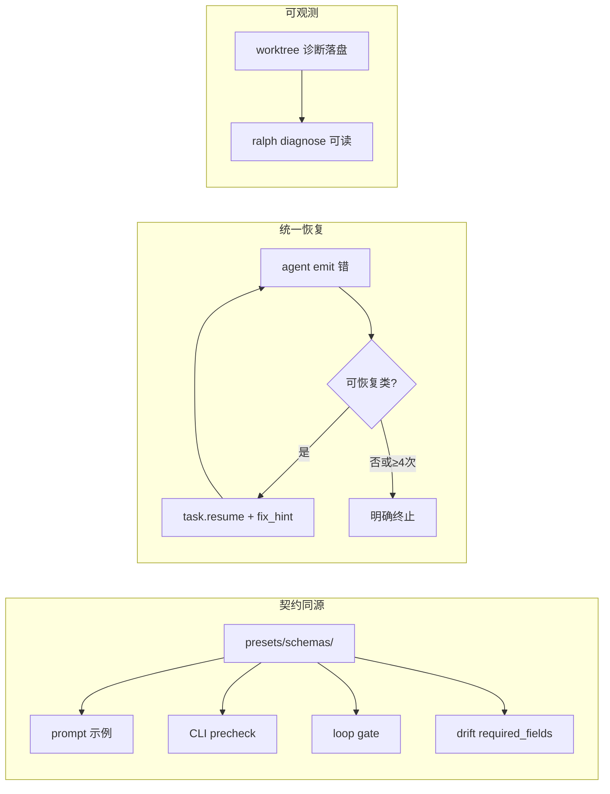

# ce-executor-isolated Loop 稳定性 — 统一需求文档

## Problem Frame

### 谁在受影响

Operator 使用固定工作流跑 `ce-executor-isolated`：

```text
PROMPT.md  →  Implement dev plan:docs/plans/<plan>.md
ralph -H builtin:ce-executor-isolated run --worktree --reuse-worktree
```

`ralph.yml` 已开启 `telemetry.runtime_diagnosis`（含 drift 阈值与 prompt 注入）。operator 期望 **schemas 契约、drift 诊断、恢复机制** 共同约束 agent，但 loop 仍在 iteration 1 或中后期 **乱飘、卡死、一枪毙命**。

### 根因（讨论结论，非猜测）

系统里其实有四层能力，但 **没有闭合成一条链**：

| 层 | 现状 | 为何「起了名字却没起作用」 |
|----|------|--------------------------|
| **Schema 契约** | `presets/schemas/` 有完整定义；preset 内联一份副本 | 运行时 **不读** `presets/schemas/`；双份维护易漂移；agent 不一定照 prompt 示例发 |
| **B+C 拦截** | precheck + schema-aware prompt | loop 子进程历史上有 Skip 洞（B+C 计划已补）；`echo >> jsonl` 可绕过 |
| **恢复** | `task.resume`、U2 熔断、drift Responder | **payload 违规** 路径：`RejectWithResume` 后仍 `capture_violation` → runner **立刻 `not_retriable` 终止**（resume 写了也没用） |
| **Drift** | `ralph.yml` 已 `enabled: true` | 统计型指标需多样本；iteration 1 致命错误抢在 drift 前；worktree 诊断落在子仓，`ralph diagnose --session latest` 常指到 **空的主仓 session** |

**一句话**：不是缺功能，是 **契约不同源、payload 错了必死、诊断看错地方**。

### 用户约束（不变）

- 不改 `PROMPT.md` 写法、不改启动命令、不强制拆 plan。
- 不大改 9-hat 拓扑、不加新 hat。
- `ralph.yml` telemetry **保持开启**（已配置，无需重复开关）。

### 目标形态



---

## Requirements

### A. Schema 契约同源（`presets/schemas/` 真正起作用）

- **R-A1.** `presets/schemas/<preset>.yml` 升格为 **authoring 单一事实源（SSOT）**；operator 改 schema 只改此目录（对 `ce-executor-isolated` 即 `presets/schemas/ce-executor-isolated.yml`）。
- **R-A2.** builtin preset 编译/加载时，将 SSOT schemas **自动合并** 进有效 `event_policy.schemas`（不再依赖人手同步内联大块 YAML）。
- **R-A3.** 以下四条消费链 **必须读取同一份合并结果**：agent prompt 的 `--json` 示例（B 层）、`ralph emit` / `ralph wave emit` precheck（C 层）、loop `event_policy` 校验、drift `required_fields` 来源。
- **R-A4.** CI / `ralph preset check` 继续校验 SSOT 与嵌入 preset 一致；文件头 **去掉「DEPRECATED 仅供参考」** 表述，改为「SSOT，build 注入」。

### B. 统一 Payload 可恢复契约（全 hat，非仅 bootstrap）

- **R-B1.** 定义 **可恢复违规类**（默认包含）：
  - `PayloadTypeMismatch`（含非 JSON 字符串）
  - `MissingRequiredField`（schema 声明的必填字段缺失）
  - `TopicDenied` / isolated scope 越权（已有 U2 路径，对齐行为）
- **R-B2.** 定义 **不可恢复违规类**（保持 fail-closed）：
  - 业务语义类（如 `plan_name` 不一致、终态重复、completion guard 等）
  - 重试预算用尽（第 4 次同 `(hat, reason_class)`）
- **R-B3.** 对 **可恢复类**：event loop 注入 `task.resume`（路由回 **源 hat**），payload 含 `fix_hint_for_hat_topic` 生成的 **该 hat 自有 publishes** 的 `--json` 示例；**不得** 在同一次违规上设置 `payload_contract_violation` 导致 runner 立即终止。
- **R-B4.** 重试上限 **3 次**（与 `U2_REJECTION_RETRY_LIMIT` 对齐）；第 4 次终止并写清诊断（hat、topic、允许列表、次数）到 `recovery.jsonl` / 终止摘要。
- **R-B5.** **Bootstrap** 是统一契约的首个高优先级场景（coordinator + `work.ready`），但不是唯一场景；executor `work.done`、review 链 terminal emit 等 **同样适用** R-B1–R-B4。

### C. Bootstrap 输入隔离（治「南辕北辙」）

- **R-C1.** **Bootstrap 阶段**：`work.start` 起至首次合法 `work.ready` 被接受；此阶段 coordinator prompt **不注入** `human.guidance` 与 scratchpad `### HUMAN GUIDANCE`。
- **R-C2.** Bootstrap 结束后，guidance 行为与现网一致。
- **R-C3.** Preset 为 coordinator 增加 `topic_deny_rules`：`build.done`、`debug.*`（deny 规则支持 topic 通配，与 `ralph-proto` `Topic::matches_str` 语义一致）。

### D. 诊断与 Drift 可观测（已开启 telemetry 的闭环）

- **R-D1.** worktree 模式下，loop 运行时诊断（`recovery.jsonl`、`drift.jsonl`）须写入 **loop 实际 workspace**（worktree 根），并在 loop 结束或 TUI 退出时 **回写 session 指针** 到主仓，使 `ralph diagnose --session latest` 默认可找到 **非空** session。
- **R-D2.** `ralph diagnose` 在 `loops.json` 指向已删除 worktree 时，须 **明确警告** 并回退到最近 **非空** diagnostics session（或 session pointer），避免「无 drift findings」误读为 drift 未启用。
- **R-D3.** drift 保持 **中后期** 职责（field completeness / coord join / emit cadence）；不替代 R-B 的即时 payload 恢复。critical drift finding 在 `prompt_injection_enabled: true` 时须进入 agent prompt（`ralph.yml` 已开启）。

---

## Success Criteria

- **SC1（起跑）**：当前工作流下，3 次 coordinator 激活内出现合法 JSON `work.ready`，executor 被激活。
- **SC2（payload 自愈）**：任意 hat 故意以非 JSON 发其 **自有** terminal topic 时，loop 不因 `not_retriable` 立即死；3 次内 `task.resume` + fix_hint 可见；第 4 次明确终止。
- **SC3（schema 同源）**：仅修改 `presets/schemas/ce-executor-isolated.yml` 并重建后，prompt 示例、precheck、loop 校验、drift 字段集 **同步变化**（无需再改内联手写块）。
- **SC4（诊断）**：worktree run 结束后，`ralph diagnose --session latest` 能展示该次的 recovery/drift 条目（非空 shell）。
- **SC5（回归）**：`cargo nextest run --workspace --exclude ralph-e2e` 通过；语义级不可恢复违规仍 fail-closed。

---

## Scope Boundaries

### 本次覆盖

- `ce-executor-isolated` 为主验证 preset；schema SSOT 机制可复用到其他有 `presets/schemas/<name>.yml` 的 builtin preset。
- 统一 payload 恢复、bootstrap 隔离、coordinator deny、worktree 诊断指针。

### 本次不覆盖

- 修改 operator 启动命令或 `PROMPT.md` 格式。
- 9-hat 拓扑重写、新 hat、扩大 `publishes` 包容 `build.done`。
- `echo >> events.jsonl` 内核级禁止（仍靠 precheck + loop gate + R-B 恢复）。
- 全量 skill 文档审计。
- 用 drift 统计替代 R-B 即时恢复。

---

## Key Decisions

| 决策 | 理由 |
|------|------|
| **SSOT 在 `presets/schemas/`，build 注入** | 满足「副本要起作用」；消灭双份漂移 |
| **统一可恢复契约，bootstrap 是子集** | 回答「其他 hat 错了怎么办」 |
| **拆开「记录违规」与「终止 loop」** | 现有 recovery 半套：有 resume 仍被 U6 枪毙 |
| **drift 管中后期，R-B 管即时格式错** | telemetry 已开；分工清晰 |
| **用户工作流零变更** | 稳定性在 runtime，不在 operator 手册 |
| **小改、复用 U2 / fix_hint / DriftEngine** | 不新造平台 |

---

## Dependencies / Assumptions

- `docs/achieved/plan/2026-06-15-001` B+C 已在分支上；验收用含该改动的 build。
- `ralph.yml` `telemetry.runtime_diagnosis.enabled: true` 已满足；本需求补 **诊断路径**，不重复开关。
- `presets/manifest.yml` 禁止恢复 `schema_file` 相对路径；SSOT 通过 **build 注入** 解决，而非 runtime 读磁盘。

---

## Outstanding Questions

### Resolve Before Planning

（无 — 讨论已闭合）

### Deferred to Planning

- SSOT 注入点：`build.rs` merge vs 代码生成脚本（实现选更简单者）。
- 不可恢复类完整枚举与 `finding_to_payload_contract_violation` 映射表。
- worktree session pointer 文件格式与 `diagnose` 回退优先级。

---

## Next Steps

1. **更新** `docs/plans/2026-06-16-001-feat-ce-executor-bootstrap-recovery-plan.md` → 扩 scope 为本文（或新建 `2026-06-16-002` 并 supersede）。
2. **`/ce-plan`** 细化实施单元与测试。
3. **`/ce-work`** 按 Phase 顺序落地：**A（SSOT）→ B（统一恢复）→ C（bootstrap 隔离）→ D（诊断指针）**。
