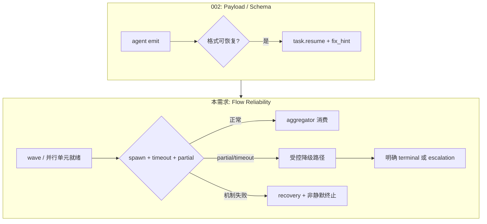

---

# ce-executor Flow Reliability — 并行流程可靠性机制

## Problem Frame

### 谁在受影响

Operator 用 `ce-executor-isolated` 跑多步 plan（当前 review wave 并行；未来可能 **多 U / 多 step 并行**）。`2026-06-16-002` 计划解决 **契约同源 + payload 恢复 + bootstrap 隔离 + 诊断闭环**，但不覆盖 **并行子流程（wave / 未来 plan 并行）在运行时的可靠性**。

### archive 反复出现的失败模式（机制缺口，非单点 YAML）

| 症状 | archive 来源 | 根因类型 |
|------|--------------|----------|
| 写了 N 个 `review.wave.ready`，worker 0 spawn | `2026-06-13-review-wave-no-spawn` | wave 派发与 isolated 状态不同步 |
| `aggregate.timeout: 300` 实际等 ~24min | `2026-06-15-review-passed-aggregate-timeout` | timeout 传播 / 执行路径未闭环 |
| 67 维只回 24 维 → **整批丢弃** | `2026-06-09-mechanism-vs-orchestration` | 全有或全无，无 partial 降级 |
| `missing_event_gate` 在 wave 已写入后仍触发 | `2026-06-13-review-wave-no-spawn` | gate 不懂「已 emit 但派生未完成」 |
| synthesizer `handoff_dispatch_timeout` 堆积 | `2026-06-15` | 聚合 hat 激活 SLA 无机制保证 |
| agent 在 timeout 压力下 bypass 发非法 terminal | `2026-06-15` | 无 **受控降级路径**，只能靠违规 |

### 设计立场（回答「修点还是建机制」）

**本需求交付的是机制，不是第三次改 instructions。**

- ❌ 单点：把 dimension-reviewer timeout 从 300 调到 900
- ✅ 机制：**Wave Lifecycle Contract** — 派发、等待、partial、聚合、降级、升级，全链路可观测、可测试、preset 无关（`ce-executor-isolated` 为验收夹具）

与 `2026-06-16-002` **可并行**：002 管「emit 错了怎么救」；本需求管「emit 对了但并行子流程怎么不挂」。

---
---

## Requirements

### A. Wave Lifecycle Contract（运行时）

- **R-A1.** 每个 `DetectedWave` 必须有 **可验证的生命周期状态**：`detected → spawning → workers_active → aggregating → closed | partial_closed | failed`。状态转换写入 `recovery.jsonl`（或等价 orchestration 诊断），operator 可读。
- **R-A2.** **Spawn 保证**：当 N 个同 `wave_id` 事件通过 policy 校验且 target hat `concurrency > 1` 时，dispatcher **必须在同一 loop 迭代或下一迭代** 内创建对应 worker 任务；若 spawn 失败，不得静默跳过——须写 `wave.spawn_failed` 诊断并进入 R-A5 降级路径。
- **R-A3.** **Timeout 同源**：wave 级 deadline 必须来自 preset 的 `aggregate.timeout`（aggregator hat）与 worker `timeout`，经 `wave_detection` / dispatcher 统一计算；**禁止**出现「配置 300s、实际 1464s」而无诊断解释的情况。超时触发时须 emit 可路由的 **受控信号**（见 R-A5），不得仅靠 agent 自觉 bypass。
- **R-A4.** **Partial wave 机制化**：当 `PartialWavePolicy::AllowPartial` 生效（staleness 达阈值或配置显式允许）时：
  - 已返回的 worker 结果 **必须被 aggregator 消费**，不得整批 skip；
  - aggregator prompt / wave context 须标明 `missing_dimensions`；
  - terminal 输出须带合法 `skip_reason`（如 `aggregate_timeout`），且 **仅允许 aggregator hat** 发布（与 isolated scope 一致）。
- **R-A5.** **受控降级路径（Degraded Completion）**：parallel 子流程无法在 SLA 内完成时，机制必须提供 **唯一合法出口**（例如 `review.failed` / `review.complete` with `skip_reason=aggregate_timeout`），替代 agent 伪造 `review.passed` 或非法 topic。降级出口在 preset schema 与 `publishes` 中显式声明；机制负责路由到正确 hat，不靠 ralph hat 注入 null payload。
- **R-A6.** **`missing_event_gate` 与 wave 互斥**：若 hat 在窗口内已写入该 obligation 对应 topic（含 wave batch），且 wave 生命周期未 `closed/failed`，**不得**因「本轮无新 emit」触发 `missing_event_gate`。gate 须感知 wave pending 状态（archive `2026-06-13` P0-B）。

### B. Handoff / Aggregator SLA（与 step 交接交叉的最小面）

- **R-B1.** 消费 wave 输出的 aggregator hat（如 `review-synthesizer`）在 worker 全部 report 或 partial 截止后，须在 **可配置 SLA（默认 30s，上限 120s）** 内被 dispatch；超时写 `handoff_dispatch_timeout` recovery，并触发 R-A5 降级或 Hard escalation（非无限 `pending`）。
- **R-B2.** 本组需求 **不** 定义 `queue.advance → executor` 桥接（见姊妹文档 step-handoff）；仅保证 **wave 链末端 → 下一编排阶段** 的 aggregator 不被静默饿死。

### C. Stall / Recovery 升级（并行流程专用）

- **R-C1.** 对 wave 相关 hat，`stall_recovery` outcome 连续 `pending`/`repeated` 达 N 次（默认 3，对齐 `U2_REJECTION_RETRY_LIMIT`）后，必须 **escalate**：Hard（targeted `task.resume`）或 Final（受控降级 / 明确 `TerminationReason`），不得无限循环。
- **R-C2.** recovery envelope 须带 **flow 上下文**：`wave_id`、`wave_total`、`received_count`、`missing_dimensions`、`flow_phase`（review / future parallel plan），供 `ralph diagnose` 与下游 agent 消费。

### D. 面向「未来并行执行 plan」的扩展性

- **R-D1.** Wave Lifecycle Contract 的 API / 状态机 **不得写死 review topic 名**；`review.wave.ready` / `review.dimension.done` 为首个验收拓扑，机制须支持「任意 trigger batch + worker hat + aggregator hat」三元组（与现有 `wave_detection` + `HatConfig.concurrency/aggregate` 对齐）。
- **R-D2.** 当 plan 引入 **多 step 并行**（多 executor / 多 work stream）时，每个并行单元须可映射为独立 `wave_id` 或等价 `flow_unit_id`；禁止多单元共用一个无分区的 obligation 计数器导致误触发 gate。
- **R-D3.** preset 作者通过 **声明**（concurrency、aggregate、partial policy、degraded terminal topics）启用行为；runner **不**根据 plan 内容硬编码分支。

### E. 验收与回归

- **R-E1.** BDD scenario 覆盖：complete wave、partial wave、spawn 失败、aggregate timeout、gate 互斥（至少 5 条，可扩展现有 `tests/scenarios/four-p0-guards/`）。
- **R-E2.** Replay fixture：基于 `2026-06-13-review-wave-no-spawn` 与 `2026-06-15-aggregate-timeout` 事件片段，回归后 **不得** 再出现「0 worker + missing_event_gate 死循环」与「1464s 无降级」。
- **R-E3.** `cargo nextest run --workspace --exclude ralph-e2e` 通过。

---
---

## Success Criteria

- **SC1**：7 维 review wave 在 preset 默认 timeout 下，spawn 数 = `wave_total`（或在 partial 策略下显式 `partial=true` + missing 列表），无 0-worker 静默失败。
- **SC2**：aggregate 超时后 **24h 内**（测试用压缩时钟）出现 **合法** degraded terminal（含 `skip_reason`），主事件流 **0 条** 非法 hat 冒充 / null payload bypass。
- **SC3**：`missing_event_gate` 与 wave pending 互斥——wave 已写入且未 closed 时，review-coordinator 不因 gate 无限重激活。
- **SC4**：`ralph diagnose` 对 wave 失败 session 能展示 `wave_id`、spawn 状态、timeout 配置值 vs 实际等待时长。
- **SC5**：机制验收不依赖改 operator 命令或 `PROMPT.md` 格式。

---
---

## Scope Boundaries

### 本次覆盖

- Wave 派发、timeout、partial、aggregator SLA、gate 互斥、stall 升级、degraded completion 机制。
- `ce-executor-isolated` review 链为验收夹具；API 层面对未来 plan 并行可扩展。

### 本次不覆盖

- Schema SSOT、全 hat payload 恢复、bootstrap guidance 隔离（`2026-06-16-002`）。
- Step 级 `queue.advance → work.ready` 桥接与 progress/tasks 同步（姊妹文档 step-handoff）。
- 静态 Workflow Activation Contract 全量（见 `2026-06-12-workflow-activation-contract`；step-handoff 文档承接静态部分中与 handoff 相关的条目）。
- Web dashboard UI、前端展示（仅要求诊断数据可被 `ralph diagnose` / JSON 消费）。
- Saga 补偿、schema 版本化、全量 Promptfoo 回归。

### Outside product identity

- 用更长 instructions 替代 timeout 机制。
- 允许 ralph hat 发 business terminal 作为常规降级手段。
- 为单次 incident 硬编码 topic 白名单而不走 preset 声明。

---
---

## Key Decisions

| 决策 | 理由 |
|------|------|
| **机制优先于 preset 补丁** | archive 证明 instructions 挡不住 timeout 压力下的 bypass |
| **受控降级 > 一枪毙命 > 无限 stall** | 三者必须互斥且可观测 |
| **与 002 并行交付** | 起跑契约与中段并行可靠性正交 |
| **review 为夹具，非终点** | 用户明确未来有 plan 并行；状态机 topic-agnostic |
| **不恢复「整批 skip partial 结果」** | `2026-06-09` 36% 找回率但全丢是机制 bug |

---
---

## Dependencies / Assumptions

- 假设 `2026-06-16-002` 或等价改动 eventually 落地；本需求 **不阻塞** 于 002，但集成测试宜在含 002 的分支上全绿。
- 假设 `PartialWavePolicy`、`consumer_aggregate_timeout`、`is_dual_publish_step_handoff` 等代码路径存在且可扩展（已见于 `wave_detection.rs`、`event_loop/mod.rs`）。
- 假设 isolated 模式与 U4 fair scheduling 保持；aggregator SLA 为 **窄例外**（单消费者 handoff），与 WAC R9 一致。
- U3 `publishes` 终态 authority 不变；degraded terminal 须在 aggregator hat `publishes` 中声明。

---
---

## Outstanding Questions

### Resolve Before Planning

- （无）并行于 002、机制优先、两文档拆分已确认。

### Deferred to Planning

- **Q1** [Technical] degraded completion 默认出口：`review.failed` vs `review.complete` vs 双轨——实现时按 preset schema 最小扰动选择。
- **Q2** [Technical] partial 阈值：80% staleness vs 绝对时间 vs `wave_total` 比例——对齐现有 `wave_detection` 默认并写测试锁定。
- **Q3** [Needs research] 未来「多 step 并行」首个 preset 拓扑是否复用 wave 还是新 `flow_unit` 抽象——本机制预留 `flow_unit_id`，具体拓扑在 plan 并行需求明确后再定。

---
---

## Next Steps

→ `/ce-plan` 生成 `docs/plans/2026-06-17-001-feat-ce-executor-flow-reliability-plan.md`（或与 step-handoff 计划编号协调）

→ 可与 `2026-06-16-002` **并行开发**；集成验收在两者均 merge 后做 end-to-end multi-step plan run。
