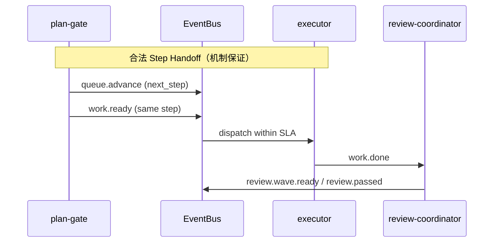

---

# ce-executor Step Handoff — 阶段交接机制

## Problem Frame

### 谁在受影响

多步 plan 的核心节奏是：**一个阶段完成 → 交接信号 → 下一阶段启动**。`ce-executor-isolated` 上 U1→U2→…→U8 的交接在 archive 中多次断裂，表现为「事件发了、下一个 hat 没起来、loop stall 10–28 分钟后 `loop.cancel`」。

### 与 Flow Reliability 的分工

| 维度 | Flow Reliability（姊妹文档） | Step Handoff（本文档） |
|------|------------------------------|------------------------|
| 单位 | 单阶段 **内部并行**（wave、未来 plan 并行单元） | **阶段之间** 的串行推进 |
| 典型 topic | `review.wave.ready` → `review.dimension.done` → synthesizer | `work.done` → review 链 → `queue.advance` → `work.ready` → executor |
| 失败画像 | worker 不 spawn、aggregate 超时 | executor 10min 未 dispatch、re-emit trap |

### 设计立场（机制，非单点 preset 补丁）

`docs/achieved/brainstorms/2026-06-12-workflow-activation-contract-requirements.md`（WAC）已定义静态 contract + 运行时 handoff dispatch 的方向，但 **未完全落地** 或 **被后续 incident 击穿**（如 dual-publish isolated budget、`plan-gate` triggers 不全）。

本需求 = **把 WAC 的 handoff 子集机制化并验收**，加上 archive 新教训：

- `queue.advance`  alone 不够，须 **成对 handoff**（`queue.advance` + `work.ready`）+ orchestrator **双发预算** carve-out（`2026-06-15-003`）
- `progress.md` 与 `tasks.jsonl` 漂移会误导 plan-gate（`2026-06-12-multi-run`）
- `plan-gate.triggers` 缺 `fix.exhausted` / `debug.exhausted` 导致终态路径到不了 gate（`2026-06-09`）

---
---

## Requirements

### A. 静态 Step Handoff Contract（启动前硬门）

- **R-A1.** 继承并 **落地** WAC R2–R6：`ralph preset check` / preflight 对 builtin `ce-executor-isolated` **strict error**；违规禁止启动。
- **R-A2.** **Handoff pairing（步骤推进）**：对每个 plan step 边界，必须存在静态可证的链路：`plan-gate`（或等价推进 hat）publish 的 handoff 集合能 **唯一确定** 下一执行 hat（executor）的 activation，且 executor 存在合法 egress（`work.done` / `work.failed`）。
- **R-A3.** **Re-emit trap 清零**：`executor.triggers` 含 `queue.advance` 且 `executor.publishes` 不含 `queue.advance` 的配置 **不得** 通过 strict check（archive dispatch-gap）。
- **R-A4.** **Trigger 闭包**：`plan-gate.triggers` 必须覆盖所有应推进队列的终态路径，至少包括：`review.passed`、`review.complete`、`work.failed`、`fix.exhausted`、`debug.exhausted`、`loop.cancel`（与 `2026-06-09` 机制诊断对齐）。
- **R-A5.** **Coordinator hats 闭包**：`tasks.coordinator_hats` 包含所有需要 task lifecycle 权限的 workflow hat（plan-gate、fixer、debug-resolver、shipper、reporter 等），避免 agent 走 `unset RALPH_CURRENT_HAT` 旁路。

### B. 运行时 Handoff Dispatch 保证

- **R-B1.** Handoff topic 种子集至少包含：`queue.advance`、`work.ready`、`fix.plan.ready`、`work.failed`；实现可扩展，但不得少于此。
- **R-B2.** 当 handoff topic T 在 isolated 模式下 publish，且静态图显示 **唯一消费者** hat B，则 B 须在 **默认 30s**（可配置，上限 120s）内 activation；超时写 recovery（`handoff_dispatch_timeout`），并 escalate（非静默等待 round-robin）。
- **R-B3.** **成对 handoff 原子语义**：当 preset 声明 step 边界须同时 emit `queue.advance` + `work.ready` 时，orchestrator 的 isolated 单轮 business-event 预算 **必须** 允许该 **有序二元组**（已有 `is_dual_publish_step_handoff` 方向）；第三个 business event 仍须拒绝。机制须有 BDD 回归（`plan_gate_dual_publish_handoff`）。
- **R-B4.** 多消费者 topic **不** 走优先 dispatch，保持 U4 round-robin（WAC R9）。

### C. 交接态与磁盘状态一致性

- **R-C1.** **Progress–Task 硬门**：plan-gate（或 dedicated preflight hook）在推进 `queue.advance` 前，校验 `progress.md` 的 Current Step 与 `tasks.jsonl` 中对应 `task_id` 状态 **一致**；不一致时 emit `plan.blocked`（可恢复），不得静默推进。
- **R-C2.** **Synth terminal gate**：`review.passed` / `review.complete` 须 full payload 才设置 synthesizer terminal 状态；null payload **拒收**（WAC R10），防止 `queue.advance` 被假阳性阻塞 5 分钟（dispatch-gap #17–19）。
- **R-C3.** **Verdict 闭包**：reporter 在 `REVIEW_COMPLETE.pass_or_fail=fail` 时不得发布成功终态（`report.done` / `LOOP_COMPLETE`）；机制层 verdict_gate 覆盖 **report.done** 与 LOOP_COMPLETE（`2026-06-09` §3.3）。

### D. Payload 与 schema（handoff 专用硬门）

- **R-D1.** 对 handoff / step-boundary topic（`queue.advance`、`work.ready`、`work.done`、`review.passed` 等），`payload: null` **Reject**，不进入主事件流。
- **R-D2.** `json_object` schema topic 允许 string→object normalize（WAC R11）；无法解析则 Reject 并走 002 统一恢复（若已落地）或 handoff 专用 `task.resume`。
- **R-D3.** Handoff payload 校验与 **Schema SSOT** 同源（002 R-A3）；本需求不重复 SSOT 实现，但验收必须证明 handoff topic 在四消费链一致。

### E. Preset 同步（机制通过后的必要编排修正）

- **R-E1.** `presets/en/ce-executor-isolated.yml`（及 zh 变体）通过 R-A1 strict contract；含 plan-gate `publishes` 含 `work.ready`、triggers 闭包、coordinator_hats 闭包。
- **R-E2.** plan-gate instructions 保留 **显式** 成对 emit 规则；机制不替代 preset 声明，但机制保证「声明了成对 emit 就能在同一轮落地」。

### F. 验收

- **R-F1.** `2026-06-10-003` 类 8-step plan：U1 `queue.advance` 后 U2 executor activation **< 30s**；无 dispatch-gap 型 `loop.cancel`。
- **R-F2.** 注入 `fix.exhausted` / `debug.exhausted` fixture 时 plan-gate 必须激活并发 `queue.advance` 或 `plan.complete`。
- **R-F3.** progress/tasks 故意不一致时，`plan.blocked` 可恢复，loop 不悬挂。
- **R-F4.** BDD：`plan_gate_dual_publish_handoff` + `isolated_boundary_violation` 同时绿；`cargo nextest run --workspace --exclude ralph-e2e` 通过。

---
---

## Success Criteria

- **SC1**：multi-step plan 从 U1 推进到 U2+ 无需人工改 events.jsonl；`queue.advance` 与 executor 首次 activation 间隔 p95 < 30s。
- **SC2**：builtin preset strict check 对已知 P0 编排洞（re-emit trap、handoff pairing、trigger 闭包）**零 finding**。
- **SC3**：主事件流 handoff / terminal topic 的 null payload 计数为 0。
- **SC4**：`fix.exhausted` / `debug.exhausted` 路径到达 plan-gate 的集成测试通过。
- **SC5**：operator 工作流不变（`PROMPT.md` + `ralph run --worktree --reuse-worktree`）。

---
---

## Scope Boundaries

### 本次覆盖

- Step 边界静态 contract、运行时 handoff dispatch SLA、dual-publish carve-out、progress/tasks 门、verdict 闭包、preset 同步。

### 本次不覆盖

- Wave 内部 spawn / partial / aggregate（姊妹文档 flow-reliability）。
- 全量 WAC payload 规则中与 wave emit 相关的 R12（flow-reliability 承接）。
- Schema SSOT 实现细节（002）。
- Bootstrap coordinator deny / guidance 隔离（002）。
- `RALPH_CONTROL_TOPICS` 扩展、runner 隐式 `queue.advance→work.ready` 自动转换（anti-pattern，见 dispatch-gap solution）。

### Outside product identity

- 仅靠 plan-gate instructions 加长而不跑 strict contract。
- 为通过验收临时禁用 `review_step_state` gate。
- 让 ralph hat 常规发布 `work.ready` 推进 plan。

---
---

## Key Decisions

| 决策 | 理由 |
|------|------|
| **承接 WAC，不另起炉灶** | 12 日 brainstorm 已做产品决策；缺的是落地与 15 日教训 |
| **成对 handoff = preset 声明 + orchestrator carve-out** | 仅改 preset 会被 isolated budget 击穿 |
| **静态 + 运行时双轨** | 只静态 → 运行仍卡；只运行时 → 坏 preset 仍能启动 |
| **与 002 / flow-reliability 并行** | 正交能力，可分给不同 agent |
| **拒绝隐式桥接** | 编排语义必须在 preset 可见；机制只保证与校验 |

---
---

## Dependencies / Assumptions

- 依赖 `is_dual_publish_step_handoff` 或等价逻辑已存在或与本需求同批实现（`event_loop/mod.rs`）。
- 假设 002 的 Schema SSOT  eventual 一致；R-D3 验收在 002 合并后执行，但不阻塞 R-A/R-B 开发与单测。
- 假设 `preset_lint` / `preset_validator` 可扩展 WAC 规则族，无需新 crate。
- flow-reliability 负责 synthesizer handoff **之后** 的 wave 链；本文档负责 **step 计数推进** 链，二者在 `review.passed → plan-gate` 处交汇。

---
---

## Outstanding Questions

### Resolve Before Planning

- （无）

### Deferred to Planning

- **Q1** [Technical] progress/tasks 硬门实现点：plan-gate agent 内自检 vs `preflight_extensions` hook vs event_loop pre-handoff——选最小侵入且可单测的方案。
- **Q2** [Technical] handoff SLA 超时后的 escalation：直接 `plan.blocked` vs targeted `task.resume` to plan-gate vs Final terminate——按 Responder 三档对齐。
- **Q3** [User decision] 是否在首版即对 **用户自定义 preset** 开启 strict handoff contract，或仅 builtin strict（WAC 原决策为 builtin strict / 用户 warn，建议维持）。

---
---

## Next Steps

→ `/ce-plan` 生成 `docs/plans/2026-06-17-002-feat-ce-executor-step-handoff-plan.md`

→ 与 `2026-06-17-001`（flow-reliability）及 `2026-06-16-002` **并行**；三者 merge 后跑 `2026-06-10-003` 全 plan E2E。
