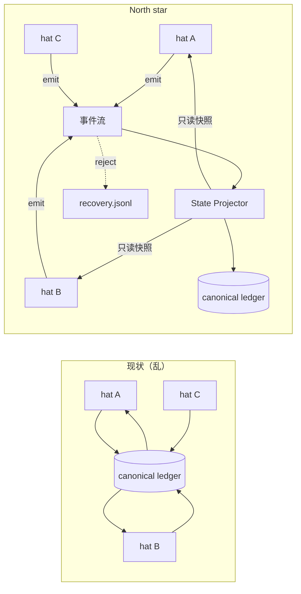

# Hat 编排器状态投影 — 需求文档

## Summary

多 hat preset（尤其 `ce-executor-isolated`、`ce-executor-serial`）中，**多个 hat 读写同一批 canonical 磁盘产物**（`tasks.jsonl`、`progress.md`、plan frontmatter、主 `events.jsonl` 等），导致状态漂移、recovery 堆积、流程反复卡死。近 2 周大量 gate / recovery 机制是在**共享可变状态**上打补丁，未消除根因。

**North star（已确认）**：**事件为源、磁盘为投影、prompt 为只读视图** — hat 只通过 `ralph emit` 表达意图；**canonical 运行态由 Ralph runtime 投影生成**；hat 通过注入的**只读快照**理解当前状态，不再自行 tail / 改写共享 ledger。

**交付策略**：分阶段到达 north star，**不在 Phase 1 停在中途 ACL 方案**；Phase 1 聚焦漂移最高的 **tasks + progress**，读路径注入同步推进。

### 编号约定

| 前缀 | 含义 |
|------|------|
| **SP-R*** | 本需求（State Projection） |
| **GOV-R*** | Agent Output Governance（`2026-06-14-ce-executor-isolated-agent-output-governance`） |
| **AOG-R*** | Agent Operation Guard（`docs/achieved/brainstorms/2026-05-31-agent-operation-guard-requirements.md`） |
| **FR-*** | Harness Extensions（`docs/guide/harness-extensions.md`） |

**术语**：**State projection（本需求）** = 从 emit 派生 tasks/progress/plan status。**FR-2 Event Projection** = 事件复制到 sidecar JSONL，语义不同，不混用。

---

## Problem Frame

### 两条独立问题线（勿混为一谈）

| 线 | 症状 | 典型根因 | 本需求覆盖 |
|----|------|----------|------------|
| **A — 账本漂移** | progress / tasks / plan status 三套说法；gate 反复拒 | 多 hat 直写同一 ledger | **是（主战场）** |
| **B — 流程可靠性** | review chain deadlock、wave spawn 不同步、handoff 堆积 | gate 时序、provenance、recovery 上下文 | **否（flow-reliability 计划）** |

noble-peacock / merry-lotus 等 run **同时出现 A 与 B**；plan 004 已针对 B 的 provenance / activation clock / trigger replay 修复。**本需求解决 A**，并降低 A 与 B 叠加时的调试噪音；**不能替代** flow-reliability 工作。

### 谁在受影响

- **Operator**：跑 ce-executor preset 时 ledger 不一致导致 gate 拒收、recovery 难读。
- **Preset 维护者**：instructions 要求各 hat 手改 progress/tasks，越写越长仍漂移。
- **机制层开发者**：每加一个 gate 都在擦共享状态屁股，carrying cost 上升。

### 已验证证据（线 A）

| 症状 | 来源 |
|------|------|
| progress / tasks / plan frontmatter 漂移 | noble-peacock、systematic review |
| executor 越权 probe 污染 events | merry-lotus（线 B 为主，线 A 加剧可读性） |
| synthesizer 自己 tail events 数 wave | calm-oak（读路径问题 → GOV-R1 + 本需求注入） |
| task 跨 hat 无授权 | AOG 脑暴 |

### 已有、可复用能力

- Per-hat **event channel**（写隔离，merge 后仍共享 — Phase 2 收归）
- **GOV-R1** wave context、**GOV-R3** ephemeral isolation、**progress_task_gate**
- Harness **FR-1** event filter、**FR-3** state file injection
- `ralph doctor plan-sync`

### 产品身份说明

Ralph 定位是**薄协调层**；本需求是在 **handoff ledger** 上收归写入权，不是把 plan 业务逻辑编进 orchestrator。投影引擎 generic；**step/U → progress 字段** 的映射由 preset 配置声明，非 Rust 硬编码 plan 正文。

---

## Key Decisions

- **North star**：编排器为 canonical ledger **唯一 writer**；hat 只 emit + 读注入快照。
- **Phase 1 范围**：**tasks.jsonl + progress.md** 投影 + **统一 RUNTIME STATE 注入** + preset instruction 删改；**不含** events 单写者、bash 写防护、plan frontmatter 自动写、per-hat 视图裁剪、preset lint。
- **Canonical progress 路径（Phase 1 定死）**：**仅** `.ralph/agent/progress.md`；废弃 preset 中 `.agents/scratchpad/ce-executor/{plan_name}/progress.md` 写入义务（最干净：单一路径，gate / projector / 注入同源）。
- **Enforcement 与 opt-in**：语义上仅 orchestrator 可写 canonical；**Phase 1 enforcement**（投影 + 注入 + instruction）仅在 `ce-executor-isolated` / `ce-executor-serial` 启用；其他 preset 保持现状直至 opt-in。
- **Memories**：本需求**不触碰** `memories.md` 写路径；memory guard 另立 AOG 项。
- **分阶段终态不变**：Phase 2+ 收 events 读模型、plan status 投影、bash fail-closed、diagnose 对账、task CLI 与 emit 完全同源。

---

## Requirements

### 核心原则

- **SP-R1.** **Phase 1 Canonical Artifacts**：`.ralph/agent/tasks.jsonl`、`.ralph/agent/progress.md`。**Phase 2+** 扩展：`events*.jsonl` 写路径收归、plan frontmatter `status`、recovery 合并索引视图（见 SP-R16–SP-R17）。
- **SP-R2.** Phase 1 内，上述 canonical artifacts **仅有 orchestrator state projector 一个写入者**；hat 与 agent bash 不得直写。
- **SP-R3.** Hat 变更运行态的唯一合法方式是 **emit 已声明 topic**；projector 订阅并 deterministic 更新 ledger。

### Phase 1 — 编排器投影（写路径）

- **SP-R4.** **Task 投影（Phase 1）**：`work.ready` / `work.done` 及 loop 内已有 gate 合法 terminal 驱动 `tasks.jsonl` 变更。**Phase 1 允许** `ralph tools task *` 仍直写，但 preset instructions **禁止 agent 调用** task 变更命令（只读 `list`/`show` 可选）；**Phase 2** 要求 CLI 与 emit 投影同源（AOG 对齐）。
- **SP-R5.** **Progress 投影（Phase 1）**：`work.done`、`queue.advance`、`plan.complete`、review terminal 等事件，按 preset 声明的 step/U **映射配置**更新 canonical `progress.md`（Current Step、Completed Steps、Active Wave/Sequence）；**删除** preset 中「请手动更新 progress.md」义务。
- **SP-R6.** **Plan status 投影**：**Deferred Phase 2** — frontmatter `status` 由 projector 维护；Phase 1 仍靠 `ralph doctor plan-sync` + coordinator 义务，或单次 emit 触发 hook。
- **SP-R7.** 投影 **fail-closed**：payload 不足以更新 ledger 时，拒收或走现有 recovery，**不得** silent partial write。
- **SP-R8.** **Phase 1 gate 顺序**：投影 **先于** `progress_task_gate` 执行，使 gate 校验投影后 ledger；与 `apply_step_handoff_gate` / `flow_lifecycle` 的全链同序 **Deferred Phase 2**（planning spike）。

### Phase 1 — 只读快照（读路径）

- **SP-R9.** Hat 激活时注入 **`## ORCHESTRATOR CONTEXT`** 块（子段：`runtime` / `wave` / `ephemeral`），至少含 plan/step/U、open tasks 摘要、progress 摘要；**wave 子段与 GOV-R1 合并**，不重复计数逻辑。
- **SP-R10.** **Per-hat 义务裁剪视图**：**Deferred Phase 2**；Phase 1 所有 hat 同一快照。
- **SP-R11.** Preset instructions **不得**要求 agent 读取运行态 ledger（`events.jsonl` tail、`tasks.jsonl`、`progress.md` 推导下一步）；**允许**读 plan 规格正文 / `context.md`（非 ledger）。
- **SP-R12.** 实现载体：Harness **FR-1** + **FR-3**；注入源为 projector 生成的 snapshot，**非** agent 可写 canonical 路径。不复用 **FR-2** 语义。

### Phase 2+ — 写防护与诊断

- **SP-R13.** Agent 上下文对 canonical 路径的 bash 写操作 **fail-closed**（**Phase 2**；planning 先 spike 各 backend 可行性）。
- **SP-R14.** `ralph emit` 路径限制（`--file` / `RALPH_EVENTS_FILE` allowlist）— 延续 **AOG** 意图，Phase 2 与 events 收归一并交付。
- **SP-R15.** **GOV-R3** ephemeral isolation 与 canonical 写防护正交；relocated 文件不得写回 ledger。

- **SP-R16.** `ralph diagnose` 增加 **投影 vs 事件** 对账（cursor、三元组一致）— **Phase 2**。
- **SP-R17.** Recovery **operator 单一索引入口**（合并 workspace/session 视图）— 与 plan 004 U4 一致并扩展；**Phase 2**。

### Preset 与验收

- **SP-R18.** Phase 1 验收 preset：`ce-executor-isolated`、`ce-executor-serial`；投影 **引擎 preset-agnostic**，仅 mapping 表不同。
- **SP-R19.** 两 preset instructions **删改**：移除 ledger 手维护 HARD RULE；新增「以 ## ORCHESTRATOR CONTEXT 为准」。
- **SP-R20.** Preset lint 检测禁止 instruction 模式 — **Phase 2**；Phase 1 靠 R19 + review。

### 迁移

- **SP-R21.** Resume 时 **一次性 import** 现有 canonical 文件 bootstrap projector 状态，之后 **仅 emit 驱动**；无持续双写期。
- **SP-R22.** 不追求旧 preset 行为向后兼容；单测 / BDD / smoke 按新语义更新。

---

## Phased Delivery

| Phase | 交付 | 不在此 phase |
|-------|------|--------------|
| **1** | SP-R4/5/7/8/9/11/12/18/19/21；tasks+progress 投影；统一注入；instruction 删改 | events 单写、bash guard、plan status 投影、per-hat 视图、lint、diagnose 对账 |
| **2** | SP-R6/13/14/16/17/20；events 收归；task CLI 同源；bash fail-closed | — |
| **3（可选）** | review 中间草稿私有 workspace（非 canonical） | 默认不做，planning 评估 |

---

## Success Criteria

### Phase 1

- **SC1.** Dogfood run 结束后，`progress_task_gate` / operator 目视：`progress.md` ↔ `tasks.jsonl` **一致**（无 task closed 但 progress 未更新）。
- **SC2.** Review 链 run 中，synthesizer **不**依赖 tail `events.jsonl`；GOV-R1 + SP-R9 wave 子段足够 emit terminal（replay/BDD）。
- **SC3.** noble-peacock 类 **progress/tasks 漂移** 在 fixture 中不可复现或可被投影明确修复。
- **SC4.** 全 workspace nextest（exclude ralph-e2e）绿；两 preset 能 `ralph run` 启动。

### Phase 2（追加）

- **SC5.** Agent 上下文 bash 直写 canonical ledger 被拒（SP-R13）。
- **SC6.** `ralph doctor plan-sync`、progress、tasks、plan status 四者一致；`ralph diagnose` 展示投影对账视图。

### 产品 outcome（跨 phase 跟踪，非 blocking）

- **SC-O1.** ce-executor 多步 plan **stall 率 / cancel 率** 相对 baseline 下降（与 flow-reliability 正交，一并观测）。

---

## Scope Boundaries

**In scope**：State projection north star；Phase 1 上表交付。

**Deferred**：Memories owner（AOG）；plan 正文 orchestrator 写入；全 preset opt-in；recovery 物理文件搬迁。

**Outside scope**：更长 prompt 替代机制；纯 ACL 多 writer 终态；用本需求替代 flow-reliability。

**Parallel work（不争带宽，但需协调验收 preset）**：`docs/brainstorms/2026-06-17-ce-executor-flow-reliability-requirements.md`。

---

## Dependencies / Assumptions

- Projector hook 可挂在 emit 处理链，Phase 1 至少领先 `progress_task_gate`（planning 验证调用点）。
- `progress_task_gate` 今日读 `.ralph/agent/progress.md` — Phase 1 canonical 与此对齐。
- 依赖：hat_channel、GOV-R1/R3、progress_task_gate、doctor plan-sync。

---

## Outstanding Questions

### Resolve Before Planning

（无 — 产品方向与 Phase 1 canonical 路径已确认。）

### Deferred to Planning

- **[Affects SP-R4][Technical]** Phase 2 task CLI → emit 代理的具体命令面。
- **[Affects SP-R8][Technical]** 全 gate 链与 projector 的原子事务边界。
- **[Affects SP-R13][Needs research]** Bash 写防护在各 backend 的可行落点。
- **[Affects SP-R9][Technical]** `## ORCHESTRATOR CONTEXT` token 预算与字段优先级。

---

## Alternatives Considered

| 方向 | 简述 | 结论 |
|------|------|------|
| **A — Orchestrator projection** | 事件为源；orchestrator 唯一写 ledger；注入只读视图 | **North star（已选）** |
| B — ACL + 注入 | 多 writer + 权限矩阵 + 注入 | 止血子集已在做（plan 004、GOV-R1）；**不作终态** |
| C — Hat 分区 | 私有目录再 merge | 仅 Phase 3 可选评估 |
| D — 混合分阶段 | 先读路径 / 选择性写，再全量 A | **采纳为交付策略（Phased Delivery 表）** |

---

## Next Steps

-> `/ce:plan`（建议 Phase 1 独立 plan）
