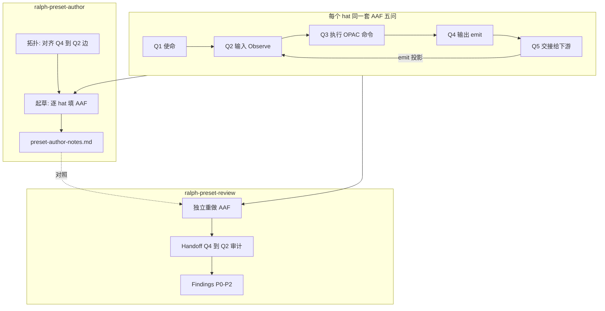
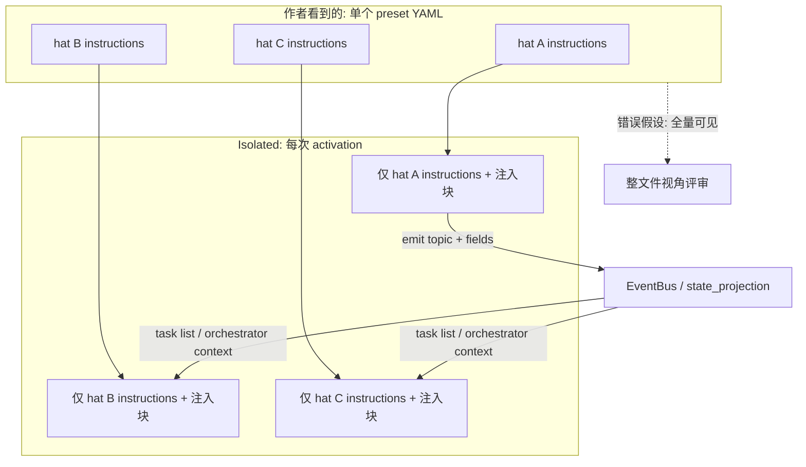
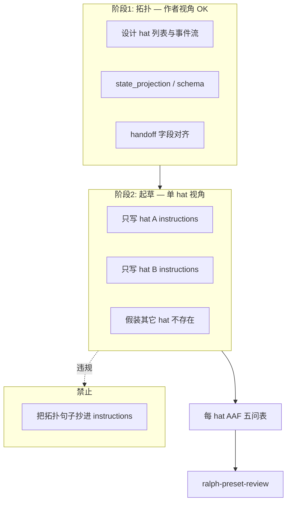
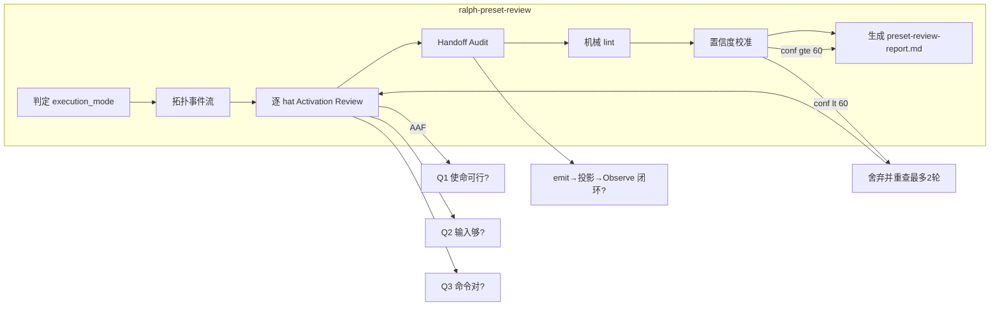

# Ralph Preset Author & Review Skills（Agent 视角可行性修订版）

## Problem Frame

Preset YAML 是**作者视角的单文件**，但 Ralph **运行时从不把整份 preset 喂给一个 agent**。

在 `execution_mode: isolated`（当前主流、4+ hat 强制）下，每个 hat activation 是**进程级隔离单元**：

- Prompt 只含**该 hat 自己的** `instructions:`（不含其它 hat 的 instructions，不含 `## HATS` 段）——见 `crates/ralph-core/src/event_loop/tests/payload_types.rs::test_isolated_prompt_contains_only_target_hat_instructions`
- Hat 之间**不共享进程、history、彼此指令**；协作仅靠 **runtime API**（`ralph tools task`、`ralph emit`、`ralph wave emit`、`ralph inspect loop`）与 **事件总线投影**
- 状态传递本质是 **emit → state_projection → task/progress 视图 → 下一 hat Observe**，不是「读整份 preset 猜上下游」

**核心痛点**：preset 作者（和通用 LLM 评审）常犯 **整文件视角谬误**——假设 agent 知道拓扑、其它 hat 职责、内部 ledger 路径。这直接导致 instructions 写错（读 `events.jsonl`、描述「reviewer 会帮你…」、复述框架术语），运行时 silent drop 或 misroute。

现有资产无法解决此问题：

| 资产 | 缺口 |
|---|---|
| `ralph-hats` skill | 不管 builtin；未强调 per-hat 可见性模型 |
| `ralph preset check` / `preset_lint` | 机械规则；不模拟「该 hat 此刻看见什么」 |
| `instructions_opac` lint | 覆盖部分反模式，不审计状态传递链完整性 |
| `docs/guide/preset-authoring.md` | 人类文档，非 agent-native 评审协议 |

**目标**：两个 skill 全生命周期覆盖。**最高优先级原则：Agent 视角可行性（AAF）**——无论写 preset 还是审 preset，都必须站在「**此刻被唤醒的这个 hat 的 agent**」身上问：这事能不能做成？缺什么？交给下一个 hat 要传什么？该跑哪些 Ralph 命令？R0–R2 是 AAF 的约束底座；author 用 AAF **设计可执行的 instructions**，review 用 AAF **证伪不可执行的 instructions**。

## Agent 视角可行性（AAF）— 两 skill 的共同脊柱

> **编排 preset 不是写文档，是给无数个「只活一轮 activation」的 agent 下工单。** 每个 hat 的 agent 只有：自己的 instructions、runtime 注入块、OPAC 允许的 CLI。它不知道其它 hat 写过什么，也不知道你脑子里那条流水线。

对 **每一个 hat**（author 起草时、review 验收时），**必须逐条回答 AAF 五问**。任一问答不出来或答案为「缺」→ 该 hat 的编排**不可执行**，author 必须补全，review 标 finding（通常 P0/P1）。

| # | 问题（站在该 hat 的 agent 身上） | Author 要产出什么 | Review 要验证什么 |
|---|---|---|---|
| **Q1 使命** | 这一轮我要完成什么？完成标准是什么？ | `instructions` 里单一、可判定的一句职责 + 终态 emit | 是否可判定；是否夹带其它 hat 的职责 |
| **Q2 输入** | 我**此刻**能 Observe 到什么？够不够开工？ | 明确 Observe 命令（`ralph inspect loop`、`ralph tools task list`、`ralph events --events-source hat-channel` 等） | 列出的输入是否 **hat 可见**；是否缺上游已 emit 但未投影的字段 |
| **Q3 执行** | 我要跑哪些 **Ralph 机制允许的** 命令？顺序是什么？ | OPAC 四阶段写清：Observe → Precheck（`--policy-check` / `task verify`）→ Apply → Confirm | 命令是否在 hat 权限内；是否跳过 P/C；是否引用 `ralph-tools*.md` 而非复述 |
| **Q4 输出** | 做完后我向 runtime **交什么**？ | `publishes` 内 topic + payload 字段（对齐 `ralph emit --schema` / schema SSOT） | topic 是否在 `publishes`；`required_fields` 是否可填；单事件预算 |
| **Q5 交接** | 下一个 hat 需要我传什么？它怎么 Observe 到？ | 拓扑层设计 `state_projection`；instructions 只写「我 emit 的字段」不写「下游怎么用」 | Handoff 边是否闭合：emit 字段 → projection → 下游 Q2 |

**AAF 与 Ralph 机制的硬绑定（禁止空想）**

- 状态只经 **emit → state_projection → task/progress 视图 → 下一 hat 的 Observe** 传递；禁止「agent 自己猜上游做了什么」。
- 共享事实只经 **`ralph tools task`**、**`ralph emit` / `ralph wave emit`**、**`ralph inspect loop`**、hat-channel **`ralph events`**；禁止读 `.ralph/events.jsonl` 全文等内部 ledger（HARD RULE 4）。
- 写 commands 时必须对齐 **当前 Ralph 已实现的 CLI**（`references/commands.md` + `crates/ralph-core/data/ralph-tools*.md`），不许写不存在的子命令或参数。

**Author 与 Review 对 AAF 的分工**

| 阶段 | AAF 用法 |
|---|---|
| **Author · 拓扑** | 用作者视角画事件流，保证每条 handoff 边在 Q4↔Q2 之间字段对齐 |
| **Author · 起草** | **逐 hat 只答 Q1–Q5**，假装其它 hat 不存在 |
| **Author · 自检** | 每 hat 填一张 **AAF 五问表**（R12），有空格则禁止交 review |
| **Review** | 独立重做每 hat 的 AAF 五问；与 author notes 不一致时以 review 为准；缺口 → finding + confidence |

## Requirements

### 核心理念（两 skill 共享，author 与 review 均强制执行）

> **Author 写、Review 查，同一套 AAF 五问。** 不是「写完再让人挑刺」，而是写的时候就要证明：**这个 agent 在这一轮里做得成**。

**Agent-Native 评审公理**

- R0. **禁止整文件视角评审**。评审不得基于「agent 读过全部 hats」做任何通过/失败判断。
- R1. **Per-Hat Activation 模拟（= AAF 的 Q2/Q3/Q5 底座）**：对 preset 中每个 hat，须独立回答：
  1. 该 activation 的 prompt 栈里有什么？（`## HAT IDENTITY` → 可选 `## WAVE CONTEXT` → `## ORCHESTRATOR CONTEXT` → 本 hat `instructions` → auto-inject skills → scratchpad/state files/tasks）
  2. 该 hat **能直接看到**什么？（AAF **Q2**）
  3. 该 hat **能直接调用**什么？（AAF **Q3**）
  4. 该 hat **绝不能假设**什么？（其它 hat 的 instructions、拓扑位置、内部 ledger）
- R2. **状态传递审计（= AAF Q4↔Q5 的苛刻版）**：对每个跨 hat handoff：
  - **Emit 契约**：上游 `publishes` topic、`required_fields`、`state_projection.actions` 是否与下游 hat instructions 中「我要读什么」一致
  - **OPAC 闭环**：下游是否被引导走 Observe → Precheck → Apply → Confirm（见 `crates/ralph-core/data/ralph-tools-opac.md`）
  - **三字段约束**：`task_id` / `task_key` / `step` 是否仅通过 `ralph tools task list` 取得、禁止手写
  - **单事件预算**：同一 activation 内仅第一个业务事件保留；终态前不得夹带其它业务事件
  - **投影对账**：instructions 要求的「完成态」是否可由 `ralph tools task list` / orchestrator context 观测到，而非要求 grep ledger

### Skill 拆分

- R3. **`ralph-preset-author`**：拓扑 + **逐 hat AAF 五问** 起草 `instructions:`；交 review 前每 hat 填 AAF 表。
- R4. **`ralph-preset-review`**：逐 hat **独立重做 AAF 五问** + 机械 lint + `preset-review-report.md`（P0/P1/P2 + confidence）。
- R5. Handoff：author 完成 YAML + **每 hat AAF 五问表（R12，全填且无「缺」）** → `ralph-preset-review`；review 产出报告；拓扑/handoff 级缺口回指 author。

### 范围与上下文切换

- R6. 两 skill 支持 **本地 preset**（`.ralph/hats/*.yml`）与 **builtin preset**（`presets/en/` + `presets/schemas/`），按路径自动分支。
- R7. 与 `ralph-hats` 不重叠：后者继续管用户 hats 文件；新 skill 管 preset 全链（含 builtin 协议 SSOT）。

### Author Skill（AAF 起草协议）

Author 与 Review **共享 AAF + R0–R2**。Author 的职责：让每个 hat 的 AAF 五问都有**可执行答案**。

- R8. **双阶段大脑（强制）**：
  1. **拓扑阶段（作者视角）**：设计 hat 列表、事件流、`state_projection`、schema；**专门对齐 Q4↔Q2 handoff 字段**（「A emit 什么 → B 用哪条命令 Observe 到什么」）。
  2. **起草阶段（Agent 视角）**：写 hat X 的 `instructions:` 时 **只扮演 hat X 的 agent**，逐条填 Q1–Q5；禁止拓扑句式（「reviewer 会…」「上一步已…」）。
- R9. 起草前说明 **执行模式**（用户主用 isolated）：isolated 下 Q2/Q3 答案**不得依赖**其它 hat 的 prompt；coordinator（≤3 hat）须在 AAF 表标注模式例外。
- R10. **AAF 五问表（每个 hat 必填，起草 SSOT）**：

  ```markdown
  ## Hat: <id>
  - Q1 使命: …
  - Q2 输入 (Observe 命令 + 期望字段): …
  - Q3 执行 (OPAC 命令序列): …
  - Q4 输出 (topic + payload 字段): …
  - Q5 交接 (emit 字段 → 下游 Observe 路径): …
  ```

  任一为空或含「待定 / 同上 / 上游会处理」→ **该 hat 不可交付**。
- R11. **状态传递起草（Q4↔Q5 落地）**：
  - 改 topic ⇒ 同步 `required_fields` + `state_projection` + 下游 Q2
  - Emitter：instructions 必须含 `--policy-check`；终态前单事件预算
  - `task_id` / `task_key` / `step` 只来自 `ralph tools task list`（引用 `ralph-tools-tasks`）
- R12. **交 review 前门禁**：每 hat AAF 表齐全；author 自问「若我只收到这份 instructions + Ralph 注入，能否做完 Q1？」— 否则继续改。
- R13. **Author 产出物**：**YAML + `preset-author-notes.md`（每 hat 一张 AAF 五问表）**；notes 供 review 对照，**review 仍独立重做 AAF**。
- R14. Builtin：`presets/schemas/` SSOT + 7 点同步清单。

### Review Skill（AAF 验收协议）

Review 与 Author **共享 AAF + R0–R2**。Review **不信任** author notes，对每个 hat **从零重做 AAF 五问**；notes 仅用于发现 author/review 答案不一致时的额外 finding。

- R15. **快速机械门禁（默认）**：
  ```bash
  ralph preset check -H <path|builtin:name> --strict
  cargo nextest run -p ralph-cli --bin ralph -- preset_lint
  cargo nextest run -p ralph-core -- preset_lint
  ```
- R16. **评审流程（强制顺序）**：
  1. 判定 `execution_mode` + hat 数
  2. 拓扑简图（事件流）
  3. **对每个 hat：独立填 AAF 五问表**（显式声明「模拟 hat X 的 agent」）→ 与 instructions 对照 → 缺口为 finding 候选
  4. **Handoff Audit**：每条边核对 Q4(A) ↔ Q2(B)
  5. 机械 lint + confidence 校准 + 报告
- R17. **P0/P1 分级（AAF 缺口优先）**：
  - **P0**：
    - **AAF Q2 缺输入**：instructions 要求的信息无法经 Observe 取得
    - **AAF Q3 不可执行**：命令不存在、无权限、跳过 precheck、读不可见 ledger
    - **AAF Q4 不可交付**：topic 不在 `publishes`、payload 填不出、违反单事件预算
    - **AAF Q5  handoff 断裂**：下游 Q2 依赖的字段上游 Q4 未 emit / 未投影
    - isolated 下 Q1/Q2 假设其它 hat 行为
    - 4+ hat 非 isolated；机械 lint Error
  - **P1**：
    - Q3 缺 Confirm 或 OPAC skill 引用；Q1 不可判定
    - Q5 弱对齐（能跑但易漂移）；`state_projection` 与 Q4 不一致
    - 框架术语；机械 lint Warn
  - **P2**：命名、冗余 hat、Q1 过长
- R18. **Review 产出物（固定 deliverable）**：每次 review 必须生成一份 **`preset-review-report.md`**（默认写在 preset 同目录或 `.ralph/reviews/<preset-basename>-<date>.md`），不得只在聊天里口头总结。报告是 author 修 preset 的唯一问题清单 SSOT。
- R19. **Finding 记录 schema（每条问题必填）**：

  | 字段 | 说明 |
  |---|---|
  | `id` | 稳定编号，如 `F-001` |
  | `severity` | `P0` / `P1` / `P2` |
  | `confidence` | `0–100` 整数，表示该 finding 可信程度 |
  | `category` | `feasibility` / `visibility` / `handoff` / `state` / `opac` / `topology` / `lint` / `style` |
  | `aaf_question` | 关联 Q1–Q5（可行性类 finding 必填） |
  | `hat` | 关联 hat id；handoff 类可写 `A→B` |
  | `location` | YAML 路径或 lint `finding_id` |
  | `evidence` | 依据：命令输出摘录 / 源码或测试引用 / schema 字段追踪 |
  | `problem` | 一句话问题陈述（agent-native 视角） |
  | `fix` | 可执行修改建议 |

  **仅 `confidence ≥ 60` 的 finding 可进入报告正文**。低于 60 舍弃并重查（R20）。

- R20. **置信度校准与低置信度舍弃**：
  - **高置信（85–100）**：可直接入报告。典型来源：机械 lint Error/Warn（附命令输出）、可引用的测试/源码行号、YAML 中可逐字段追踪的 handoff 断裂。
  - **中置信（60–84）**：入报告前须 **一次验证动作**（重跑相关 lint、 `ralph emit --schema <topic>`、重读 `state_projection` 段、重做单 hat activation 模拟）；验证后仍 < 60 则舍弃。
  - **低置信（< 60）**：**舍弃**，不得作为 P0/P1/P2 呈现；必须 **回到对应 hat 或 handoff 边重新调查**（换证据来源：跑命令 > 读 schema > 推断），最多 **2 轮**重查；仍无法升到 ≥ 60 则记入报告末尾 `## Unverified Suspicions`（标注「未证实，请人工确认」），**不计入** P0/P1/P2 计数与修清单。
  - **Severity 与 confidence 解耦**：P0 也可以低置信——此时不能当 P0 报出，必须先验证升到 ≥ 60；避免「吓人但猜的」误报。
  - **机械 lint 映射**：`ralph preset check` / `preset_lint` 的 Error → 默认 confidence **95**（有命令输出）；Warn → 默认 **85**。软性评审无命令佐证时起点 confidence **≤ 50**，必须验证后才能上调。

- R21. **Review 报告结构（固定章节）**：
  1. **Executive Summary** — 模式、hat 数、**已证实** P0/P1/P2 计数、机械 lint 通过/失败
  2. **Findings Table（核心）** — 全部 `confidence ≥ 60` 的 finding，按 P0 → P1 → P2 排序，列含 severity + confidence + category + hat + 一句话 problem
  3. **Topology** — 事件流图（非 prompt 流）
  4. **Per-Hat AAF Reviews** — 每 hat 一张完整五问表 + 与 instructions 的差异；finding 引用
  5. **Handoff Audit Table** — A 的 Q4 ↔ B 的 Q2 | 字段 | projection | finding id
  6. **Mechanical Lint Results** — 原始命令与输出摘要
  7. **Remediation Plan** — P0 先修，附 fix 摘要
  8. **Unverified Suspicions**（可选）— 重查 2 轮仍 < 60 的疑点，**不驱动修改**

- R22. Review skill **自身**必须遵守 agent-native 纪律：评审时显式声明「我正在模拟 hat X 的 activation，而非阅读整份 preset」；写 finding 时 `evidence` 必须写清是 **hat-X 视角** 还是 **作者拓扑视角**（后者不能作为 isolated 下 P0 依据，除非证明 runtime 会注入给该 hat）。

### 共享知识（references）

- R23. `references/agent-native-model.md`（**AAF 理论 + Ralph 机制**，author/review 共用）：
  - AAF 五问详解与 isolated prompt 栈
  - Q3 允许的 CLI 白名单（对齐 `ralph-tools*.md`）
  - Q4↔Q5 与 `state_projection` / OPAC
- R24. `references/commands.md`：preset check、`emit --schema`、nextest 子集（**Q3 验证**）
- R25. `references/patterns.md`：builtin 拓扑范例（**仅拓扑阶段参考**）
- R26. `references/finding-rubric.md`：AAF 缺口 → P0/P1 映射 + confidence（**review 主用**）
- R27. `references/author-checklist.md`：**AAF 五问表模板** + 双阶段大脑（**author 主用**）
- R28. Skill 路径：`.claude/skills/ralph-preset-author/`、`.claude/skills/ralph-preset-review/`，共享 `ralph-preset-common/` references（plan 阶段定 symlink 结构）。

### 非目标

- R29. 默认不跑 `./scripts/run-tests.sh` 全量 / BDD（用户要求「合入前」可升级）。
- R30. 不替代 Rust `preset_lint` 新规则。
- R31. 不做 live loop UX 评估。

## Success Criteria

- 某 hat instructions 写「等 reviewer 通过」但 isolated 下 Q2 无法 Observe reviewer 状态 → author AAF 表 Q2 应填不出；review **P0 / feasibility / Q2**。
- 3-hat preset：author notes + review 报告各含 **3 张独立 AAF 五问表**；handoff 边在 Handoff Audit 中 Q4↔Q2 闭合或标 P0。
- Q3 写了不存在的 CLI → review **P0 / feasibility / Q3**，confidence ≥ 85（可对照 `ralph-tools`）。
- 凡 P0 均映射到具体 AAF 问（Q1–Q5）+ confidence ≥ 60。
- 用户仅凭 **Findings Table + 每 hat AAF Review** 可改 preset，无需读 CLAUDE.md。

## Scope Boundaries

- 不实现新 Rust lint（U13 per-hat instructions 可后续下沉）。
- 不在 skill 内嵌完整 preset 库。
- Coordinator 模式评审深度可低于 isolated（用户主用 isolated），但须标注模式差异。

## Key Decisions

- **AAF 五问是两 skill 的最高优先级脊柱**；R0–R2 为其约束实现。
- Author：拓扑对齐 Q4↔Q2；起草逐 hat 填 AAF；交 review 前每 hat 必须「做得成」。
- Review：独立重做 AAF；缺口 → finding（`aaf_question` + confidence ≥ 60）。
- confidence 入表门槛 **60**（已锁定）。

## Dependencies / Assumptions

- 用户主用 **isolated** 模式；skill 默认按 isolated 建模，coordinator 作为显式分支。
- `instructions_opac` 等 lint 持续演进；P0/P1 映射表与 `finding_id.rs` 在 plan 阶段建对照。
- 评审 skill 的「模拟 activation」是 LLM 推理协议，非运行时真跑 prompt（可选增强：调用 `ralph hats show` / 未来 debug API 抽样真 prompt）。

## Outstanding Questions

### Resolve Before Planning

（无 — confidence 入表门槛 **60** 已确认锁定）

### Deferred to Planning

- [Affects R12][Technical] 是否在 review 中增加可选步骤：对单个 hat 调用运行时 API 导出 sample prompt（作为 confidence 提升到 ≥ 85 的验证动作）。
- [Affects R23][Technical] 共享 references 用 symlink 还是 duplicate + drift check。
- [Affects R15/R22][Needs research] `finding_id` → 默认 severity + 默认 confidence 的机器可读 JSON（`references/finding-rubric.md` 的数据源）。
- [Affects R14][Technical] `preset-review-report.md` 是否纳入 git（建议 `.ralph/reviews/` gitignore，本地产物）。

## AAF 工作流（Author + Review）



## Agent-Native 评审模型（概念图）



## Author 双阶段大脑（概念图）



## Per-Hat Review 工作流



## Finding 示例（报告正文一行）

```markdown
| F-003 | P0 | 92 | feasibility | Q2 | executor | hats.executor.instructions | Q2 要求 plan 路径但无 Observe 命令；lint INSTRUCTIONS_READ_INTERNAL_LEDGER | 加 `ralph tools task list`；删 read events.jsonl |
```

## Next Steps

-> `/ce:plan` for structured implementation planning
