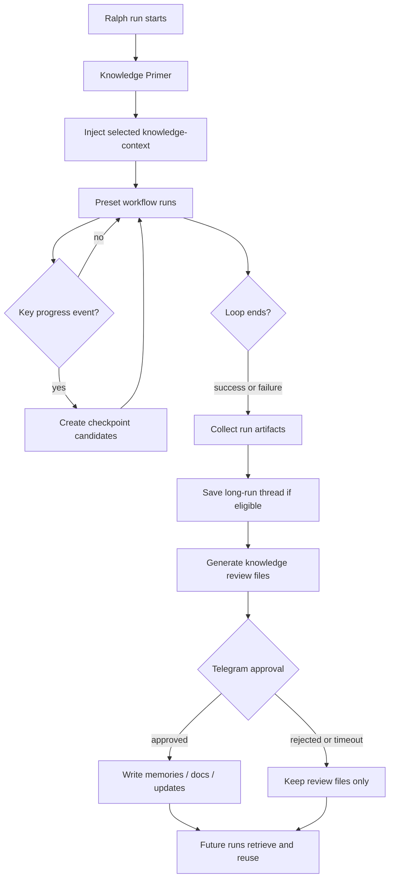

# Ralph 多 Preset 知识沉淀与复用

## Problem Frame

Ralph 已经能通过不同 preset 编排长任务，例如 `presets/code-assist.yml`、
`presets/autoresearch.yml`、`presets/debug.yml`、`presets/research.yml` 和
`presets/review.yml`。这些 preset 会在一次运行中产生大量有价值的中间材料：
事件、任务、实验结果、修复过程、评审发现、研究结论、summary、handoff 和 git
记录。

当前问题不是“能不能记录”，而是记录后能不能形成闭环：

1. 长任务结束或阶段性推进后，自动识别值得沉淀的知识。
2. 区分完整过程、长期记忆和结构化方案文档。
3. 写入前让用户确认，避免长期知识库被普通进度噪音污染。
4. 下一轮 Ralph 执行时自动检索并精选注入，让保存的知识真正被复用。

目标是把 Ralph 编排、Nowledge Mem 和 Compound Engineering 的知识文档习惯连接起来，
但不把 Ralph 变成重型知识平台。Ralph 仍然负责协调，Nowledge Mem 负责跨工具知识层，
`docs/solutions/` 负责项目内可审计的解决方案文档。

## Requirements

**Preset 配置与兼容**

- R1. Ralph 必须支持“默认推断 + preset 可覆盖”的知识策略。没有 `knowledge:` 配置的
  preset 仍应可用默认规则。
- R2. 内置重点 preset 可以显式添加 `knowledge:` 块，以声明关键事件、输入文件、沉淀频率
  和目标输出。
- R3. 不能要求所有旧 preset 立刻修改 YML；YML 修改只能用于提升准确度，不应成为功能可用的
  前提。
- R4. 修改内置 preset 后，必须遵守现有 embedded preset 同步规则，运行
  `scripts/sync-embedded-files.sh` 同步镜像文件。

**Thread、Memory、Solution Doc 分工**

- R5. Ralph 必须把 Nowledge Mem thread 视为“过程档案”：保存一次长任务的完整或压缩过程，
  便于追溯和后续 distill。
- R6. Ralph 必须把 Nowledge Mem memory 视为“长期原子知识”：只保存未来跨工具、跨会话仍有
  复用价值的结论。
- R7. Ralph 必须把 `docs/solutions/` 视为 Compound Engineering 风格的项目知识库：只记录
  完整问题、根因、解决方案、验证和预防建议，不记录普通进度摘要。
- R8. 一次运行可以同时产生 thread、memory 和 solution doc 候选，但三者不能混用语义。

**长期 Memory 标准**

- R9. 只有满足长期复用标准的信息才能成为 memory 候选：架构决策、项目模式、可复现修复、
  稳定约束、用户长期偏好、反复出现的失败路径。
- R10. 普通任务进度、临时日志、一次性 checklist、没有明确复用场景的总结不得进入 memory。
- R11. 每条 memory 必须足够原子，一条只表达一个决策、模式、坑、修复或偏好。
- R12. 每条 memory 必须包含“为什么”或适用条件，不能只有“做了什么”。
- R13. 写入 Nowledge Mem memory 前必须先搜索相似 memory；能更新或跳过时不得重复新增。

**写入时机与审批**

- R14. 阶段性进展只生成候选，不默认写入长期知识库。
- R15. 长任务结束后必须生成最终知识审阅文件：
  `.ralph/agent/knowledge-review.md` 和 `.ralph/agent/knowledge-review.json`。
- R16. 默认只有长任务保存 Nowledge thread。长任务判断至少包括：达到关键事件阈值、运行时间
  阈值、失败但已有实质调查材料，或用户显式要求保存。
- R17. 默认通过 Telegram/RObot 请求用户审批。审批通过后才写入 Nowledge Mem、Ralph memories
  或 `docs/solutions/`。
- R18. 如果 Telegram/RObot 不可用或超时，Ralph 只能保留 review 文件，不得静默写入长期知识。

**下一轮复用**

- R19. Ralph 下一轮执行前必须有 Knowledge Primer 阶段，用当前 prompt、preset 类型、仓库上下文
  和关键文件线索检索历史知识。
- R20. Knowledge Primer 必须检索 Nowledge Working Memory、Nowledge memories、必要时检索
  Nowledge threads、Ralph 项目 memories 和 `docs/solutions/`。
- R21. Knowledge Primer 必须精选高相关结果注入 `<knowledge-context>`，附来源和简短理由，不得把
  大量历史全文直接塞入 prompt。
- R22. 不同 preset 必须在不同阶段消费 `<knowledge-context>`：
  `code-assist` 在 Planner 分解前，`debug` 在 Investigator 形成假设前，
  `autoresearch` 在 Strategist 选实验前，`research` 在 Researcher 开始前，
  `review` 在 Reviewer 开始前。

**nmem 集成**

- R23. Ralph 必须使用 `nmem wm read` 或等价接口读取 Working Memory。
- R24. Ralph 必须使用 `nmem m search/add/update` 或等价接口处理 Nowledge memories。
- R25. Ralph 必须使用 `nmem t search/create/import/distill/triage` 中合适的能力处理 threads。
- R26. `nmem` 不可用、Nowledge Mem server 不可用、版本不匹配或命令失败时，Ralph 必须降级为
  本地 review 文件，不影响主 loop 的完成结果。

## Proposed Flow



## Preset Strategy

默认推断规则从事件拓扑中识别关键进展：

| Preset | 关键进展事件 | 最终事件 | 主要输入材料 |
| --- | --- | --- | --- |
| `code-assist` | `review.passed`, `queue.advance` | `LOOP_COMPLETE` | `context.md`, `plan.md`, `progress.md`, tasks, review payload |
| `autoresearch` | `experiment.evaluated` | `LOOP_COMPLETE` | `autoresearch.md`, `autoresearch.jsonl`, artifacts, git commits |
| `debug` | `hypothesis.confirmed`, `fix.verified` | `DEBUG_COMPLETE` | hypothesis payload, repro evidence, fix notes, tests |
| `research` | `research.finding` | `RESEARCH_COMPLETE` | research plan, summary, findings payload |
| `review` | `analysis.complete` | `REVIEW_COMPLETE` | review findings, deep analysis payload |
| `pdd-to-code-assist` | `design.approved`, `plan.ready`, `validation.passed` | `LOOP_COMPLETE` | requirements, design, plan, task docs, validation evidence |

示例覆盖配置：

```yaml
knowledge:
  enabled: true
  approval: telegram
  checkpoint:
    every_key_events: 5
    on_topics: ["review.passed", "queue.advance"]
  final:
    include_failures: true
    save_thread: long_runs
  retrieval:
    mode: curated_inject
  targets:
    nowledge_mem: true
    ralph_memories: true
    solution_docs: true
```

## Success Criteria

- Ralph 能在不修改旧 preset 的情况下，为长任务生成知识审阅文件。
- 重点 preset 添加 `knowledge:` 后，阶段性沉淀点和输入文件更准确。
- 长任务能保存 thread，短任务默认不污染 Nowledge thread 列表。
- 只有经过审批的候选才会写入 Nowledge memories、Ralph memories 或 `docs/solutions/`。
- 下一轮 Ralph 能把相关历史知识精选注入 `<knowledge-context>`，并被当前 preset 的早期 hat 使用。
- 普通进度不会进入长期 memory；真正的决策、修复、模式和约束能被稳定提炼。
- `nmem` 或 Telegram 失败不会改变主任务的完成/失败结果。

## Scope Boundaries

- v1 不做静默全自动写入。
- v1 不要求所有用户自定义 preset 都增加 `knowledge:` 配置。
- v1 不把沉淀 hat 插入主任务完成路径，避免改变原 preset 的完成判定。
- v1 不自动 commit `docs/solutions/`。
- v1 不把 Nowledge Mem 当作 Ralph 的唯一记忆来源；Ralph 项目 memories 仍继续存在。

## Key Decisions

- 默认推断 + preset 覆盖：兼容旧 preset，同时允许重点 preset 精准声明知识策略。
- thread 先于 memory：长任务过程先保存为可追溯 thread，再从中提炼原子 memories。
- 审批优先：长期知识的质量比自动写入数量更重要。
- 保存与复用一起交付：只做沉淀不做下一轮检索，会让知识系统失去实际价值。
- 三层知识并存：Nowledge Mem 解决跨工具复用，Ralph memories 解决项目内注入，
  `docs/solutions/` 解决可审计、可搜索的结构化方案。

## Dependencies / Assumptions

- Nowledge Mem CLI `nmem` 可用时，使用 CLI 作为 v1 集成接口。
- Telegram/RObot 已配置时，作为默认审批通道。
- Compound Engineering 的 `docs/solutions/` 约定可作为项目知识文档格式。
- Ralph 现有 `.ralph/agent/memories.md` 自动注入机制继续保留。
- 对 `nmem t distill` 的使用应作为增强，不替代 Ralph 自己的候选审阅规则。

## Outstanding Questions

### Deferred to Planning

- [Affects R16][Technical] 长任务阈值的默认数值应如何落地：关键事件数、运行时长、token/cost、还是组合规则？
- [Affects R20][Technical] `docs/solutions/` 检索应先做内置 grep/frontmatter 搜索，还是复用 Compound Engineering 的 learnings-researcher 逻辑？
- [Affects R25][Technical] 保存 Ralph run thread 时，v1 应使用 `nmem t create`、`nmem t import`，还是为 Ralph 增加专用 source？
- [Affects R17][Technical] Telegram 审批 payload 的编辑能力 v1 是否只支持 approve/reject，还是支持单条候选修改？

## Next Steps

-> `/ce:plan` for structured implementation planning.
