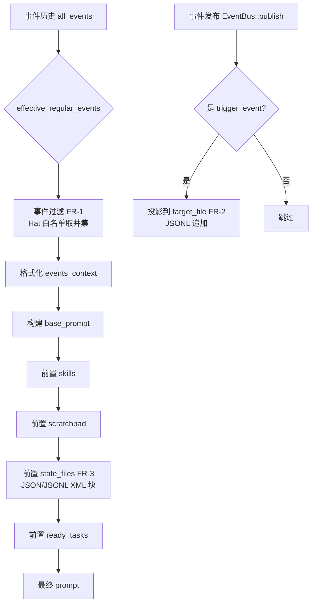
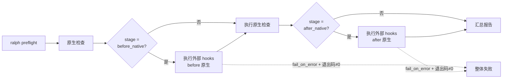

# Ralph Harness 扩展计划

## 概述

**一句话：给 Ralph 加装 4 个"可开关的插件"，让 Universal AutoResearch 的核心方法论（红队独立、决策账本、贝叶斯状态、预检审查）从"靠 Hat 自觉"变成"Harness 强制保障"。**

当前问题：Universal AutoResearch 的 P1 审计发现，**4 项关键机制全靠 Hat 的提示词自觉执行**——红队可能因为看到 reviewer 的评分而产生锚定效应；实验账本可能漏写导致长期学习断档；贝叶斯状态散落在 scratchpad 文本里被截断丢失；Phase 1.5 审查可能被不同 Agent 平台跳过。

本计划要解决的就是：**把这些"软约束"变成"硬机制"**，但保证：
- 默认全关，不开时不影响任何现有代码路径
- 纯增量配置，已有 `autoresearch.yml` 无需改动
- 失败不阻断主循环，只打 warning

---

## 问题框架

### 我们面对的 4 个痛点

```
┌─────────────────────────────────────────────────────────────────────┐
│  痛点 1: 红队不独立                                                  │
│  ─────────────────                                                   │
│  所有 Hat 共享完整事件历史。红队即使被提示"忽略评分"，信息已进入上下文    │
│  造成锚定效应。方法论上红队应该对实验信息"半盲"。                        │
├─────────────────────────────────────────────────────────────────────┤
│  痛点 2: 决策账本靠自觉                                               │
│  ────────────────────                                                │
│  autoresearch.jsonl 实验账本由 evaluator Hat 根据提示词自觉追加。漏写时 │
│  Ralph 不会自动补录，长期学习的证据链断档。                             │
├─────────────────────────────────────────────────────────────────────┤
│  痛点 3: 贝叶斯状态不可靠                                              │
│  ─────────────────────                                               │
│  策略师的贝叶斯信念、UCB 数值等状态散落在 scratchpad 文本中。LLM context │
│  rot 和截断会导致数值状态不可靠——这是"机读数据当成人读笔记"在用。         │
├─────────────────────────────────────────────────────────────────────┤
│  痛点 4: Phase 1.5 审查被跳过                                         │
│  ────────────────────────                                            │
│  validate/audit 步骤写在 Skill 文档里，不同 Agent/平台调用时可能直接跳过。│
│  需要把它变成 Ralph 原生 preflight 的一部分。                           │
└─────────────────────────────────────────────────────────────────────┘
```

### 为什么现在解决？

Universal AutoResearch 已从"方法论文档"升级为"有脚本门槛的长期 Agent harness"。如果这 4 个机制不能由 harness 强制保障，方法论就是"建议"而非"架构"——无法在不同 Agent 平台间保持一致性。

---

## 需求追溯

| ID | 需求 | 来源 |
|----|------|------|
| R1 | Hat 级事件白名单过滤 | FR-1 |
| R2 | 事件自动投影到 JSONL 文件 | FR-2 |
| R3 | 外部结构化状态文件注入 prompt | FR-3 |
| R4 | Preflight 支持外部命令扩展钩子 | FR-4 |
| R5 | 所有功能默认关闭、零回归 | 非功能需求 NFR-1/2 |
| R6 | 失败不阻断主循环 | 非功能需求 NFR-3 |

---

## 范围边界

- **范围内**：4 个扩展的配置解析、prompt 注入、事件投影、preflight 钩子
- **范围外**：
  - Universal 生成器本身的修改（`generate_autoresearch.py`）——Universal 侧单独跟进
  - 状态文件的维护脚本（如 `strategy_state.json` 的更新脚本）——由 Universal 生成器产出
  - 新的事件总线或消息队列架构——复用现有 EventBus
  - 除 `allowlist` 外的过滤模式（如 `denylist`）——预留扩展点，本次不实现

---

## 上下文与研究

### 现有架构速览

Ralph 的核心循环已经支持我们需要的扩展点——我们是在已有的"插座"上"插新电器"，不是重新布线。

```
┌─────────────┐     ┌──────────────┐     ┌─────────────────┐
│ autoresearch│────▶│  RalphConfig │────▶│   EventLoop     │
│    .yml     │     │  (config.rs) │     │ (event_loop/)   │
└─────────────┘     └──────────────┘     └─────────────────┘
                                                │
                   ┌────────────────────────────┼────────────────────────────┐
                   ▼                            ▼                            ▼
            ┌─────────────┐            ┌─────────────────┐           ┌──────────────┐
            │  EventBus   │            │  build_prompt() │           │ PreflightRunner
            │ (publish/   │            │  - prepend_*    │           │ (default_checks)
            │  subscribe) │            │  - events_context│          └──────────────┘
            └─────────────┘            └─────────────────┘                   │
                                                                             ▼
                                                                   ┌─────────────────┐
                                                                   │  ralph preflight │
                                                                   └─────────────────┘
```

### 关键现有模式

| 模式 | 文件 | 我们怎么复用 |
|------|------|-------------|
| `Option<T>` 新配置字段 | `config.rs` 各处 | FR-1/2/3/4 全部沿用，`serde(default)` 保证兼容 |
| `prepend_scratchpad()` | `event_loop/mod.rs:1388` | FR-3 新增 `prepend_state_files()`，模式完全一致 |
| `prepend_ready_tasks()` | `event_loop/mod.rs:1473` | 同上 |
| `effective_regular_events()` | `event_loop/mod.rs:1631` | FR-1 在此处之后、生成 `events_context` 之前插入过滤 |
| Preflight check trait | `preflight.rs:66` | FR-4 新增 `ExternalCommandCheck` 实现该 trait |
| 事件持久化 | `event_logger.rs` | FR-2 在 `EventBus::publish()` 后异步触发投影 |

---

## 关键决策

| 决策 | 选择 | 理由 |
|------|------|------|
| **过滤注入点** | 在 `effective_regular_events()` 之后、`events_context` 格式化之前 | 不影响事件持久化和其他 Hat 的可见性，只影响 prompt |
| **多 Hat 过滤规则** | 取并集 | 确保 Ralph 至少看到所有 active hat 都需要的信息，避免信息缺失导致死锁 |
| **投影触发时机** | `EventBus::publish()` 成功后 | 与事件持久化同生命周期，保证"事件存在才投影" |
| **状态文件格式** | JSON / JSONL 用 XML block 包裹注入 | 与现有 scratchpad/tasks 的 XML 注入风格一致 |
| **字符预算策略** | 保留尾部（最新内容） | 与 scratchpad 截断策略一致，数值状态通常新 > 旧 |
| **preflight hook 执行** | `std::process::Command` 同步执行（在 async preflight 中 spawn_blocking） | 简单、可控、无需引入新依赖 |
| **模板变量替换** | 预定义最小集（`{{config_path}}`、`{{config_dir}}`、`{{project_root}}`） | 够用、安全、不易被注入攻击 |

---

## 高阶设计

### FR-1/2/3 Prompt 构建数据流



### FR-4 Preflight 扩展钩子流程



---

## 实现单元

- [ ] U1. **扩展配置 Schema（所有 FR 的基础）**

**Goal:** 在 `config.rs` 中定义 4 个新增配置结构体，确保 serde 反序列化兼容、默认关闭。

**Requirements:** R5

**Dependencies:** 无

**Files:**
- Modify: `crates/ralph-core/src/config.rs`

**Approach:**
- 为 FR-1 添加 `EventFilterConfig`（`Option`，放在 `HatConfig` 下）
- 为 FR-2 添加 `EventProjectionConfig` + `ProjectionRule`（`Option`，放在 `CoreConfig` 下）
- 为 FR-3 添加 `StateFilesConfig` + `StateFileEntry`（`Option`，放在 `CoreConfig` 下）
- 为 FR-4 添加 `PreflightExtensionsConfig` + `PreflightHook`（`Option`，放在 `CoreConfig` 下）
- 所有结构体字段使用 `serde(default)`，`enabled: bool` 默认 `false`

**Patterns to follow:**
- 现有 `ScratchpadConfig`、`MemoriesConfig` 的 `Option<T>` 模式

**Test scenarios:**
- Happy path: 旧配置（无新字段）反序列化成功，所有新功能字段为 `None`
- Happy path: 完整新配置反序列化成功，各字段值正确
- Edge case: `enabled: false` 时其他子字段被忽略（serde 不报错）
- Error path: 无效的事件名字符串在 preflight 阶段被捕获（见 U6）

**Verification:**
- `cargo test -p ralph-core` 通过
- 旧配置 YAML 无需修改即可加载

---

- [ ] U2. **FR-1：Hat 级事件白名单过滤**

**Goal:** 让特定 Hat 只能看到白名单内的事件，根治红队锚定效应。

**Requirements:** R1, R6

**Dependencies:** U1

**Files:**
- Modify: `crates/ralph-core/src/event_loop/mod.rs`
- Modify: `crates/ralph-core/src/config.rs`（已完成于 U1）
- Test: `crates/ralph-core/src/event_loop/tests.rs`

**Approach:**
- 在 `build_prompt()` 中，当 `effective_regular_events` 计算完成后、生成 `events_context` 之前，插入过滤逻辑
- 收集当前 `active_hats` 的所有 `event_filter.events` 并集
- 如果某个 Hat 没有 `event_filter` 或其 `enabled == false`，视为"不过滤"
- **边界处理**：Hat 的 trigger 事件自动加入白名单（确保 Hat 知道自己为什么被激活）
- 过滤只影响 `events_context` 的生成，不影响 `EventBus` 的 `seen_topics`、事件持久化、`required_events` 校验

**Technical design:**
```rust
// 伪代码 — 仅用于理解注入位置
let active_hats = self.determine_active_hats(&all_events);
let union_allowlist = compute_union_allowlist(&active_hats);
let effective_regular_events = self.effective_regular_events(&regular_events);
let filtered_events = if union_allowlist.is_empty() {
    effective_regular_events  // 无人过滤 = 不过滤
} else {
    effective_regular_events.filter(|e| union_allowlist.contains(&e.event_type))
};
let events_context = format_events(filtered_events);
```

**Patterns to follow:**
- `effective_regular_events()` 的现有切片逻辑
- `prepend_scratchpad()` 的条件注入模式

**Test scenarios:**
- Happy path: 未声明 `event_filter` → Hat 看到完整历史（回归保护）
- Happy path: `enabled: true` + `mode: allowlist` → prompt 中仅含白名单事件
- Edge case: trigger 事件不在白名单中 → 仍被注入（否则 Hat 无法解释激活原因）
- Edge case: 多个 active hats，白名单不同 → 取并集
- Integration: 事件过滤不影响其他 Hat 的事件可见性（同一事件循环中另一 Hat 看到全部）

**Verification:**
- 单元测试验证过滤后的 `events_context` 内容
- smoke test 确认未启用过滤的旧配置行为不变

---

- [ ] U3. **FR-2：事件自动投影到 JSONL**

**Goal:** 当指定事件发生时，自动将其投影到 JSONL 文件，根治账本漏写问题。

**Requirements:** R2, R6

**Dependencies:** U1

**Files:**
- Create: `crates/ralph-core/src/event_projection.rs`（新模块）
- Modify: `crates/ralph-core/src/event_loop/mod.rs`（在事件发布后调用投影）
- Modify: `crates/ralph-core/src/lib.rs`（模块导出）
- Test: `crates/ralph-core/src/event_projection.rs` 或 `crates/ralph-core/tests/...`

**Approach:**
- 新建 `event_projection.rs` 模块，核心函数 `project_event(event, &ProjectionRule) -> Option<String>`
- 在 `EventLoop` 的事件处理流程中，事件成功发布到 `EventBus` 后，遍历所有启用的 projection rules
- 匹配 `trigger_events` 时，按 `fields` 提取字段，生成 JSON 行
- `mode: append` → 追加到 `target_file`；如需要可预留 `overwrite`
- 字段缺失 → 值为 `null`，不跳过整行
- 文件/目录不存在时自动创建
- 写入失败 → stderr warning，不 panic、不阻断事件循环

**Technical design:**
```rust
// 伪代码
fn apply_projection(event: &Event, rules: &[ProjectionRule]) {
    for rule in rules {
        if rule.trigger_events.contains(&event.event_type) {
            let projected = extract_fields(event, &rule.fields);
            if let Err(e) = append_jsonl(&rule.target_file, &projected) {
                eprintln!("[event_projection] warning: {}", e);
            }
        }
    }
}
```

**Patterns to follow:**
- `event_logger.rs` 的 JSONL 追加写入模式
- `loop_context.rs` 的文件路径解析（相对项目根目录）

**Test scenarios:**
- Happy path: `trigger_events` 匹配 → 目标文件出现对应 JSONL 行
- Happy path: `mode: append` → 多次触发不覆盖已有内容
- Edge case: 字段在事件中不存在 → 投影 JSON 中该字段为 `null`
- Edge case: 目标文件父目录不存在 → 自动创建
- Error path: 写入失败 → stderr 输出 warning，事件循环继续运行

**Verification:**
- 临时目录中运行事件循环，验证投影文件内容
- 测试写入权限错误时的 graceful degradation

---

- [ ] U4. **FR-3：外部状态文件注入 Prompt**

**Goal:** 让结构化状态文件（JSON/JSONL）像 scratchpad 一样被自动注入 prompt，根治贝叶斯状态不可靠问题。

**Requirements:** R3, R6

**Dependencies:** U1

**Files:**
- Create: `crates/ralph-core/src/state_file_injector.rs`（新模块）
- Modify: `crates/ralph-core/src/event_loop/mod.rs`（在 `prepend_scratchpad` 后插入）
- Modify: `crates/ralph-core/src/lib.rs`（模块导出）
- Test: `crates/ralph-core/src/state_file_injector.rs`

**Approach:**
- 新建 `state_file_injector.rs` 模块，核心函数 `inject_state_files(prompt, &StateFilesConfig) -> String`
- 在 `build_prompt()` 中，于 `prepend_scratchpad()` 之后、`prepend_ready_tasks()` 之前插入调用
- JSON 文件：格式化后包裹在 `<state-file name="..." format="json">` XML block 中
- JSONL 文件：按 `tail_lines` 截取最近 N 行，包裹在 `<state-file name="..." format="jsonl">` 中
- `inject_preamble` 存在时，作为 XML block 前的 markdown 文本注入
- 字符预算超限 → 保留尾部（与 scratchpad 策略一致）
- 文件不存在 → 注入空 XML block + stderr warning，不阻塞

**Technical design:**
```rust
// 伪代码
fn prepend_state_files(&self, prompt: String) -> String {
    let config = match &self.config.core.state_files {
        Some(c) if c.enabled => c,
        _ => return prompt,
    };
    let mut blocks = Vec::new();
    for file in &config.files {
        match read_and_truncate(&file.path, file.char_budget, file.tail_lines) {
            Ok(content) => {
                blocks.push(format_state_file_block(file, &content));
            }
            Err(e) => {
                eprintln!("[state_files] warning: {}: {}", file.path, e);
                blocks.push(format_empty_block(file));
            }
        }
    }
    format!("{}\n{}\n{}", prompt, blocks.join("\n"), "")
}
```

**Patterns to follow:**
- `prepend_scratchpad()` 的字符预算和截断逻辑
- `loop_context.rs` 的文件读取模式

**Test scenarios:**
- Happy path: JSON 文件存在且未超预算 → prompt 中包含完整 XML block
- Happy path: JSONL 文件 + `tail_lines: 20` → 仅注入最近 20 行
- Edge case: 文件内容超过 `char_budget` → 保留尾部
- Edge case: 文件不存在 → 注入空 block + stderr warning，prompt 构建不失败
- Integration: 与 `prepend_scratchpad()` 的注入顺序正确（scratchpad → state_files → ready_tasks）

**Verification:**
- 单元测试验证生成的 prompt 字符串包含正确的 XML block
- 测试大文件截断逻辑

---

- [ ] U5. **FR-4：Preflight 扩展钩子**

**Goal:** 在 Ralph 现有 `PreflightRunner` 中加载并执行外部命令，把 Phase 1.5 审查变成 harness 级强制步骤。

**Requirements:** R4, R6

**Dependencies:** U1

**Files:**
- Modify: `crates/ralph-core/src/preflight.rs`
- Test: `crates/ralph-core/src/preflight.rs` 已有测试模块

**Approach:**
- 在 `preflight.rs` 中新增 `ExternalCommandCheck` 结构体，实现 `PreflightCheck` trait
- 在 `PreflightRunner::default_checks()` 或构建时，将启用的 hooks 转换为 `ExternalCommandCheck` 实例加入检查列表
- 按 `stage` 排序：`before_native` 在前，`after_native` 在后
- 模板变量替换：`{{config_path}}`、`{{config_dir}}`、`{{project_root}}`
- 命令执行：当前工作目录，继承 Ralph 环境变量
- `fail_on_error: true` + 退出码非 0 → preflight 整体失败
- `fail_on_error: false` + 退出码非 0 → warning，继续

**Technical design:**
```rust
// 伪代码
struct ExternalCommandCheck {
    name: String,
    command: String,
    fail_on_error: bool,
}

#[async_trait]
impl PreflightCheck for ExternalCommandCheck {
    async fn run(&self, config: &RalphConfig) -> CheckResult {
        let cmd = substitute_vars(&self.command, config);
        match std::process::Command::new("sh").arg("-c").arg(&cmd).output() {
            Ok(output) if output.status.success() => CheckResult::Pass,
            Ok(output) => {
                let msg = String::from_utf8_lossy(&output.stderr);
                if self.fail_on_error {
                    CheckResult::Fail(format!("{} failed: {}", self.name, msg))
                } else {
                    CheckResult::Warning(format!("{} warning: {}", self.name, msg))
                }
            }
            Err(e) => {
                if self.fail_on_error {
                    CheckResult::Fail(format!("{} could not run: {}", self.name, e))
                } else {
                    CheckResult::Warning(format!("{} could not run: {}", self.name, e))
                }
            }
        }
    }
}
```

**Patterns to follow:**
- 现有 `PreflightCheck` trait 实现（如 `ConfigSyntaxCheck`、`GitCheck` 等）
- `default_checks()` 的构建模式

**Test scenarios:**
- Happy path: `enabled: false` → 只运行原生检查（回归保护）
- Happy path: `enabled: true` + `stage: after_native` + 命令退出码 0 → preflight 通过
- Happy path: `fail_on_error: false` + 命令退出码 1 → preflight 通过但带 warning
- Error path: `fail_on_error: true` + 命令退出码 1 → preflight 失败
- Edge case: 模板变量 `{{config_path}}` 被正确替换为绝对路径
- Edge case: 命令不存在 → 按 `fail_on_error` 处理，不 panic

**Verification:**
- 单元测试使用 mock command 或临时脚本验证退出码处理
- 确认未启用扩展时 `default_checks()` 列表不变

---

- [ ] U6. **集成测试与回归验证**

**Goal:** 确保 4 个扩展独立工作、组合工作、且不影响现有行为。

**Requirements:** R5, R6

**Dependencies:** U1, U2, U3, U4, U5

**Files:**
- Create: `crates/ralph-core/tests/harness_extension_smoke.rs`（新 smoke test）
- Modify: 可能需要的 fixtures

**Approach:**
- 新增一个 smoke test fixture（JSONL 场景），覆盖：
  - 全部关闭时的基准行为
  - FR-1 事件过滤后的 prompt 内容验证
  - FR-2 事件触发后的投影文件验证
  - FR-3 状态文件注入后的 prompt 内容验证
  - FR-4 preflight hook 的退出码处理验证
- 运行现有 `cargo test -p ralph-core` 确保无回归
- 验证旧 `autoresearch.yml`（无新字段）加载和运行正常

**Test scenarios:**
- Integration: 4 个扩展同时启用，事件循环完整跑完一轮无 panic
- Integration: FR-2 投影 + FR-3 注入形成闭环（投影文件被注入到下一轮的 prompt）
- Regression: 现有 `ralph-core` 全部测试通过
- Regression: 现有 smoke test fixtures 无需修改即可通过

**Verification:**
- `cargo test -p ralph-core` 全部通过
- `cargo test -p ralph-core smoke_runner` 通过
- 旧配置 YAML 在 `ralph preflight` 和 `ralph run` 中行为一致

---

## 系统级影响

| 维度 | 影响 |
|------|------|
| **Prompt 长度** | FR-3 注入状态文件会增加 prompt 长度，但受 `char_budget` 控制 |
| **I/O 开销** | FR-2 每次事件发布后多一次小文件追加；FR-3 每次 prompt 构建时读取文件。均为本地文件 I/O，开销可忽略 |
| **错误传播** | 所有新增 I/O 均采用"失败不阻断"策略，错误不向上传播到事件循环或 preflight（除非 FR-4 的 `fail_on_error: true`） |
| **API 表面** | 仅新增配置字段，无 CLI 参数变化、无公开 API 变化 |
| **并发安全** | FR-2 的 JSONL 追加需考虑多 loop 并发写入同文件的情况。如果多个 worktree loop 投影到同一文件，建议使用文件锁或按 loop 分文件。本次实现使用标准文件追加，由用户通过配置规避冲突 |

---

## 风险与依赖

| 风险 | 缓解措施 |
|------|----------|
| 配置字段命名与 Ralph 未来版本冲突 | 使用领域特定前缀（`event_projection`、`preflight_extensions`），降低冲突概率 |
| FR-2 投影文件无限增长 | 由用户配置 `fields` 精简内容；长期可引入轮转，本次不实现 |
| FR-4 外部命令执行安全风险 | 仅执行配置中显式声明的命令，不接收动态输入；模板变量替换为白名单模式 |
| 多 Hat 白名单并集导致信息泄露 | 这是设计权衡——并集确保功能正确，严格隔离需配合单 Hat active 模式使用 |
| 旧配置 YAML 因 serde unknown field 报错 | 所有新字段均为 `Option<T>` 且不在根级别平铺，不存在此风险 |

---

## 开发顺序建议

```
Week 1 ────────────────────────────────────────────
  U1 ──▶ U2 ──▶ U3
  (Schema) (事件过滤) (事件投影)

Week 2 ────────────────────────────────────────────
  U4 ──▶ U5 ──▶ U6
  (状态注入) (Preflight钩子) (集成测试)
```

**为什么是这个顺序？**
- U1 必须先做，它是所有后续单元的基础
- U2（FR-1）和 U3（FR-2）是 P0 需求，优先实现
- U4（FR-3）依赖 FR-2 的投影文件产出，逻辑上紧随其后
- U5（FR-4）相对独立，可以在任何时候做
- U6 必须最后，验证全部功能

---

## 验收标准

### FR-1
- [ ] 未声明 `event_filter` → 完整事件历史
- [ ] `enabled: false` → 完整事件历史
- [ ] `enabled: true` + `allowlist` → prompt 仅含白名单事件
- [ ] 不影响其他 Hat 的可见性
- [ ] `ralph preflight` 能校验事件名

### FR-2
- [ ] 未声明 `event_projection` → 不写文件
- [ ] `enabled: true` → 触发后目标文件出现 JSONL 行
- [ ] 写入失败 → 循环继续 + warning
- [ ] `append` 模式不覆盖已有内容

### FR-3
- [ ] 未声明 `state_files` → prompt 无外部状态
- [ ] `enabled: true` → prompt 包含文件内容
- [ ] `tail_lines` 限制有效
- [ ] 文件不存在 → 空内容 + warning，不阻塞

### FR-4
- [ ] 未声明 `preflight_extensions` → 只运行原生检查
- [ ] `enabled: true` → 外部命令在指定 stage 执行
- [ ] `fail_on_error: true` + 退出码≠0 → preflight 失败
- [ ] 模板变量正确替换

### 回归
- [ ] `cargo test -p ralph-core` 全部通过
- [ ] 旧 `autoresearch.yml` 无需修改即可运行
