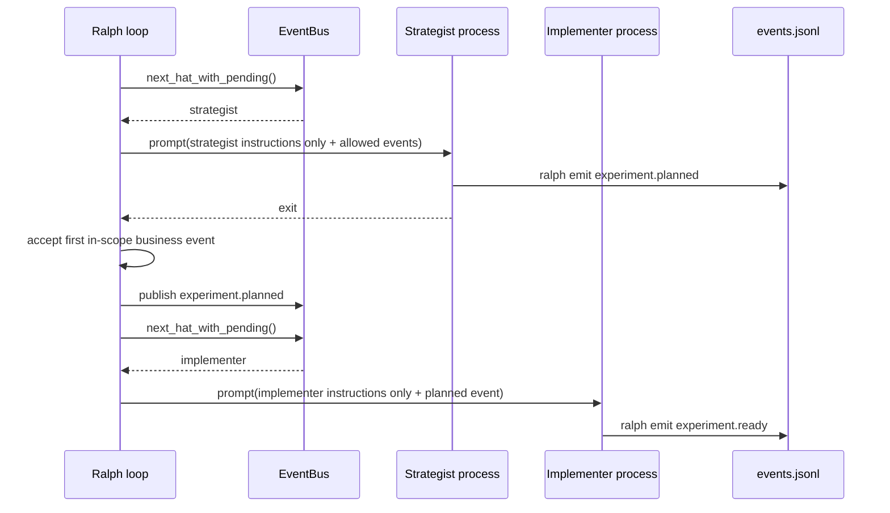

# feat: 为 Ralph 增加隔离式 Hat 执行模式

## Summary

本计划为 Ralph **增加一个显式 opt-in 的扩展功能**——`isolated` Hat 执行模式。这是一个**纯增量特性**：默认的 Hatless coordinator 行为完全保持不变；只有当用户显式在配置中启用隔离模式时，Ralph 才会切换到每次只调度一个真实 Hat、启动独立 backend 进程、只注入该 Hat 的指令和允许的事件上下文，并在事件读取阶段强制单 Hat 发布边界。本计划的核心约束是**零回归**：任何未启用隔离模式的现有配置、测试、预设、CLI/TUI/Web 行为，必须与引入本功能之前保持 100% 一致。

---

## Problem Frame

AutoResearch 暴露了 Ralph 当前多 Hat 模式的一个结构性错位：`next_hat()` 在 custom hats 存在时固定路由到 `ralph`，`build_prompt("ralph")` 会将 active hats 的指令交给同一个 Claude Code 进程。这个设计对一般协调任务高效，但不满足红队、评审、评估等需要真正独立上下文的工作流。

本计划不是把现有 Hatless 模式判定为错误，而是新增一个明确高成本、高隔离的执行选项，供 AutoResearch 这类需要避免自证自评的场景使用。

---

## Requirements

- R1. Ralph 必须保留现有默认 Hatless coordinator 行为，已有配置不应改变语义。
- R2. Ralph 必须支持配置级 opt-in 的隔离式 Hat 执行模式。
- R3. 隔离模式下，每个 backend 进程只能看到当前被调度 Hat 的 `instructions`，不能看到其他 Hat 的完整指令。
- R4. 隔离模式下，`next_hat()` 必须返回 EventBus 中实际有 pending event 的 Hat，而不是固定返回 `ralph`。
- R5. 隔离模式下，事件上下文必须只包含当前 Hat 的 pending events 和允许可见的历史/状态，不再收集所有 Hat 的 pending events。
- R6. 隔离模式下，Ralph 必须强制当前 Hat 的发布边界：非当前 Hat `publishes` 允许的事件不得进入 EventBus。
- R7. 隔离模式下，单次 Hat 执行默认只能接受一个有效业务事件，避免一个进程串完多个下游 Hat。
- R8. 隔离模式必须继续兼容 `workflow_guards`、`required_events`、`event_filter`、`event_projection`、`state_files`、`default_publishes` 和 wave 系统。
- R9. 隔离模式的诊断输出必须让用户区分 Ralph iteration、Hat execution 和业务 workflow cycle。
- R10. **零回归兼容性**：隔离模式必须是纯 opt-in 扩展。所有未显式启用隔离模式的现有配置、场景、测试、CLI 调用、TUI 行为、Web API 和预设模板，其语义和行为必须与引入本功能前保持 100% 一致。禁止以任何方式修改默认 coordinator 模式的内部逻辑或输出格式。

---

## Scope Boundaries

- 本计划不删除或弱化现有 Hatless Ralph coordinator 模式。
- 本计划不把所有 Ralph 工作流默认切到隔离模式。
- 本计划不实现文件系统安全沙箱；v1 的“硬隔离”指进程、prompt、Hat 指令、事件上下文和发布边界隔离，不承诺防止 Agent 主动读取仓库文件中的公开配置。
- 本计划不重写 EventBus 或 backend adapter 架构。
- 本计划不改变 wave worker 的并发模型；wave 已经使用 per-worker focused prompt，隔离模式只需避免回归。

### Deferred to Follow-Up Work

- 文件系统级沙箱或 per-Hat worktree：可作为更强安全隔离的后续设计，不进入本轮。
- Web/TUI 中的隔离模式可视化增强：本轮只要求基础诊断清晰。
- 跨机器成本估算器：隔离模式会显著增加调用次数，但成本预测不是本轮核心功能。

---

## Context & Research

### Relevant Code and Patterns

- `crates/ralph-core/src/event_loop/mod.rs`
  - `next_hat()` 当前在 `registry` 非空时固定返回 `ralph`。
  - `build_prompt("ralph")` 当前会收集所有 Hat 的 pending events，再通过 `determine_active_hats()` 注入 active hats。
  - `build_prompt(non_ralph_hat)` 已存在兼容路径，但目前只调用 `instruction_builder.build_custom_hat()`，没有完整接入 scratchpad、state files、auto-inject skills 和 isolation diagnostics。
  - `process_parse_result()` 是 JSONL 事件进入 EventBus 前的集中验证点，现有 `enforce_hat_scope`、`workflow_guards`、event projection 都在这条路径附近。
- `crates/ralph-core/src/config.rs`
  - `EventLoopConfig` 已包含 `starting_event`、`required_events`、`enforce_hat_scope`、`workflow_guards`。
  - `HatConfig` 已包含 `event_filter`、`scratchpad`、`backend`、`backend_args`、`timeout`、`concurrency`、`aggregate`。
- `crates/ralph-proto/src/event_bus.rs`
  - `publish()`、`take_pending()`、`next_hat_with_pending()` 已能按具体 Hat 路由和消费事件。
- `crates/ralph-cli/src/loop_runner.rs`
  - 主 loop 每轮调用 `event_loop.next_hat()`、`build_prompt()`、backend execute、`process_output()`、`process_events_from_jsonl_with_waves()`。
  - wave worker 已展示了如何为子进程构建 focused prompt 和独立 events file。
- `crates/ralph-core/src/wave_prompt.rs`
  - `build_wave_worker_prompt()` 是 focused prompt 的可参考边界：只包含目标 instructions、任务 payload、发布指南和约束。
- `crates/ralph-core/tests/event_loop_ralph.rs`
  - 已有 prompt 结构、multi-hat、completion 行为测试。
- `crates/ralph-core/tests/harness_extension_integration.rs`
  - 已有 `event_filter`、`event_projection`、`state_files` 集成测试模式。

### Institutional Learnings

- `docs/plans/2026-05-12-002-fix-autoresearch-workflow-state-guard-plan.md` 说明了 AutoResearch 对运行时守卫的需求，也明确当时不处理独立进程。
- `/home/chaowen/Dev/agent_tools/universal-autoresearch/docs/solutions/architecture-patterns/ralph-autoresearch-single-vs-multi-iteration-modes-2026-05-15.md` 区分了 Ralph iteration 和 AutoResearch cycle。
- `/home/chaowen/Dev/agent_tools/universal-autoresearch/docs/solutions/architecture-patterns/ralph-hat-isolation-and-context-explosion-analysis-2026-05-15.md` 记录了单进程模式导致上下文爆炸和 Hat 指令污染的根因。

### External References

- 不需要外部研究。问题来自本地 Ralph 调度语义，相关证据都在 Ralph 源码和本地解决方案文档中。

---

## Key Technical Decisions

- **新增 opt-in 配置，而不是改变默认模式**：Ralph 的现有哲学是轻量协调，隔离模式成本更高，必须由配置显式选择。
- **配置字段放在 `event_loop` 下**：隔离影响 loop 调度、prompt 构建、事件读取和终止条件，属于 event loop 行为，不是单个 Hat 属性。
- **隔离模式复用 EventBus 的真实 Hat pending queue**：`event_bus.next_hat_with_pending()` 已经能返回具体 Hat，最小改动是让 `next_hat()` 在隔离模式下走这条路径。
- **把非 Ralph Hat prompt 构建路径提升为一等路径**：现有兼容路径不够完整，需要接入 scratchpad、state_files、auto-inject skills、event_filter 和诊断。
- **事件发布边界在 JSONL 读取阶段硬执行**：prompt 约束不够，必须在 `process_parse_result()` 丢弃 out-of-scope 和超额事件。
- **单次隔离 Hat 默认只接受一个业务事件**：这是阻止一个进程串演多个下游 Hat 的关键硬边界。需要允许诊断、malformed、scope violation 等系统事件继续存在，但不能让多个业务阶段同时推进。
- **不把隔离模式等同安全沙箱**：Agent 仍可读工作区文件；本轮解决的是 Hat 指令和事件上下文污染，不解决恶意文件系统访问。

---

## Open Questions

### Resolved During Planning

- 是否应该直接替换 Hatless coordinator？
  - 否。默认行为保持不变，隔离模式 opt-in。
- 是否仅靠 `enforce_hat_scope` 足够？
  - 否。它能阻止越权 topic，但不能阻止多个 Hat 指令同进程注入，也不能限制一个进程发布多个允许事件。
- 是否需要重写 EventBus？
  - 否。EventBus 已有具体 Hat pending queue，计划应复用它。
- 是否要在 v1 做文件系统沙箱？
  - 否。那是更强安全模型，成本和复杂度远超本轮目标。

### Deferred to Implementation

- 字段命名最终采用 `hat_execution_mode`、`execution_mode` 还是嵌套结构。
  - 实现时应按 Ralph 现有配置命名风格选择；计划要求语义为 `coordinator` 默认、`isolated` opt-in。
- “业务事件”和“系统诊断事件”的精确分类。
  - 实现时应复用当前 `event.malformed`、scope violation、completion/cancellation 语义，避免误拦诊断恢复。
- 隔离模式下 state files 是否支持 per-Hat allowlist。
  - v1 可以先注入当前全局 state files；如果 AutoResearch 需要更强红队盲审，再扩展 per-Hat state visibility。

---

## High-Level Technical Design

> *This illustrates the intended approach and is directional guidance for review, not implementation specification. The implementing agent should treat it as context, not code to reproduce.*

Decision matrix:

| Config mode | `next_hat()` | Prompt instructions | Event acceptance |
|---|---|---|---|
| `coordinator` default | `ralph` when custom hats exist | active hats via Hatless coordinator | current behavior |
| `isolated` | concrete pending Hat ID | one Hat only | one in-scope business event per turn |

---

## Implementation Units

### U1. Add isolated execution mode configuration

**Goal:** Add a backwards-compatible config surface that lets users opt into isolated Hat execution without changing existing default behavior.

**Requirements:** R1, R2

**Dependencies:** None

**Files:**
- Modify: `crates/ralph-core/src/config.rs`
- Test: `crates/ralph-core/src/config.rs`
- Test: `crates/ralph-core/tests/scenarios.rs`

**Approach:**
- Add a typed execution mode enum under `EventLoopConfig`, defaulting to the current coordinator behavior.
- Accept YAML values for at least `coordinator` and `isolated`.
- Keep missing field behavior identical to today.
- Add schema/config tests for absent field, explicit coordinator, explicit isolated, and invalid values.

**Patterns to follow:**
- `WorkflowChainMode` and `EventFilterMode` serde enum patterns in `crates/ralph-core/src/config.rs`.
- Existing scenario parsing tests in `crates/ralph-core/tests/scenarios.rs`.

**Execution note:** TDD-first. Write failing tests for the new enum and default behavior before touching config.rs.

**Test scenarios:**
- **TDD / Happy path**: config YAML without the new field parses successfully and defaults to `coordinator` mode; serialized back to YAML does not emit the new field.
- **TDD / Happy path**: config YAML with `execution_mode: isolated` parses into the new enum variant.
- **TDD / Happy path**: config YAML with `execution_mode: coordinator` parses into the explicit default variant.
- **BDD / Regression**: Given a repo with 20+ existing scenario YAML files from before this feature, When `scenario.rs` loads each one, Then no file fails parsing and every file's `execution_mode` resolves to `coordinator`.
- **Edge case**: invalid mode value (e.g., `execution_mode: sandbox`) fails config parsing with a clear, actionable error message containing the valid options.
- **Edge case**: case-sensitive mode values are rejected (`Isolated`, `ISOLATED`) to prevent silent misconfiguration.
- **Edge case**: empty string for `execution_mode` fails parsing rather than defaulting.
- **Integration**: existing multi-hat scenario (`multi_hat_scenario.yml`) passes end-to-end without adding the field.
- **Regression / TDD**: the `Display` / `Debug` representation of the default enum variant must remain stable; snapshot tests lock the string output.

**Verification:**
- Existing configs remain backwards-compatible.
- Tests prove isolated mode is opt-in only.

---

### U2. Route isolated mode to concrete Hat IDs

**Goal:** Make `next_hat()` return the actual pending Hat in isolated mode, while preserving the existing Hatless coordinator path in default mode.

**Requirements:** R3, R4

**Dependencies:** U1

**Files:**
- Modify: `crates/ralph-core/src/event_loop/mod.rs`
- Test: `crates/ralph-core/src/event_loop/tests.rs`
- Test: `crates/ralph-core/tests/event_loop_ralph.rs`

**Approach:**
- Branch `next_hat()` on the configured execution mode.
- In coordinator mode, keep the current `registry.is_empty()` / `ralph` routing behavior.
- In isolated mode, return `bus.next_hat_with_pending()` for non-human pending events, with the current human-event fallback to `ralph` preserved.
- Record the selected concrete Hat in state so later event-scope enforcement can attribute emitted events to one active Hat.

**Patterns to follow:**
- Current `next_hat()` comment and behavior in `crates/ralph-core/src/event_loop/mod.rs`.
- `state.last_hat` and `state.last_active_hat_ids` usage around `process_output()` and scope enforcement.

**Execution note:** TDD-first. Add characterization tests that lock current `next_hat()` coordinator behavior, then add isolated-mode branches.

**Test scenarios:**
- **TDD / Happy path**: custom hats exist + `execution_mode: coordinator` → `next_hat()` returns `ralph` regardless of which custom Hat has pending events.
- **TDD / Happy path**: custom hats exist + `execution_mode: isolated` + `strategist` has pending events → `next_hat()` returns `"strategist"`.
- **TDD / Happy path**: custom hats exist + `execution_mode: isolated` + `implementer` has pending events → `next_hat()` returns `"implementer"`.
- **TDD / Happy path**: custom hats exist + `execution_mode: isolated` + multiple hats have pending events → `next_hat()` returns the first concrete Hat in deterministic order (FIFO of EventBus).
- **BDD / Regression**: Given a running loop in coordinator mode with `reviewer` and `implementer` both having pending events, When `next_hat()` is called, Then it always returns `ralph` and never leaks the internal Hat queue order.
- **Edge case**: no pending custom Hat events but `human.interact` is pending → routes to `ralph` in both coordinator and isolated modes.
- **Edge case**: no pending events at all → returns `None` / terminates cleanly in both modes.
- **Edge case**: no custom hats configured + `execution_mode: isolated` → behaves exactly like solo mode, returning `ralph`.
- **Error path**: isolated mode + pending Hat is not in the registry → emits a diagnostic event and falls back to safe behavior rather than panicking.
- **Regression / TDD**: snapshot or string-assert the exact `next_hat()` return value for 5 representative scenario states under coordinator mode; these must not change.

**Verification:**
- Tests demonstrate isolated mode changes routing only when explicitly enabled.

---

### U3. Make custom Hat prompt building a first-class isolated path

**Goal:** Ensure isolated Hat executions receive a complete but focused prompt: current Hat instructions, allowed event context, publishing guide, scratchpad/state context as configured, and no other Hat instructions.

**Requirements:** R3, R5, R8

**Dependencies:** U1, U2

**Files:**
- Modify: `crates/ralph-core/src/event_loop/mod.rs`
- Modify: `crates/ralph-core/src/hatless_ralph.rs`
- Modify: `crates/ralph-core/src/instruction_builder.rs` or equivalent custom Hat prompt builder if implementation finds a more local module
- Test: `crates/ralph-core/tests/event_loop_ralph.rs`
- Test: `crates/ralph-core/tests/harness_extension_integration.rs`

**Approach:**
- Extend the existing non-`ralph` `build_prompt()` branch instead of inventing a parallel loop.
- Consume only the selected Hat's pending events.
- Apply the Hat's `event_filter` to prompt-visible events.
- Resolve per-Hat scratchpad using existing `ScratchpadConfig::resolve()`.
- Apply state file injection and auto-inject skill behavior deliberately; if state injection stays global in v1, document the boundary and add a deferred note for per-Hat state visibility.
- Ensure the resulting prompt never includes `## HATS` with other Hat instructions.

**Patterns to follow:**
- Existing `build_prompt("ralph")` memory/scratchpad/state-file prepend order.
- `build_wave_worker_prompt()` as an example of a focused process prompt.
- `hats_section()` active-Hat rendering in `crates/ralph-core/src/hatless_ralph.rs`.

**Execution note:** TDD-first. Write prompt-content assertions before changing `build_prompt()`. Use substring searches to prove inclusion/exclusion.

**Test scenarios:**
- **TDD / Happy path**: isolated prompt for `implementer` contains the string `## Implementer` (or equivalent Hat name header) and the implementer `instructions` body.
- **TDD / Happy path**: isolated prompt for `implementer` does NOT contain the substring `## Reviewer`, `## RedTeam`, `## Evaluator`, nor any other Hat's `instructions`.
- **TDD / Happy path**: isolated prompt includes the triggering `experiment.planned` event in the events section.
- **TDD / Happy path**: isolated prompt for a Hat with `publishes: ["experiment.ready"]` includes a publishing guide that only mentions `experiment.ready`.
- **TDD / Happy path**: isolated prompt includes auto-injected skills when the Hat config has `skills` defined.
- **Edge case**: event filter configured on the Hat hides non-allowlisted historical events from the prompt-visible event list.
- **Edge case**: event filter configured as `deny` mode excludes denied topics entirely from the prompt.
- **Edge case**: Hat with empty `instructions` still gets a valid prompt skeleton (publishing guide + events + context) without crashing.
- **Integration**: per-Hat `scratchpad` path is resolved and its content prepended to the isolated prompt when configured.
- **Integration**: global `state_files` are still injected into the isolated prompt in v1 (documented as known limitation; per-Hat state visibility deferred).
- **Integration**: memory system (`memories.enabled: true`) still prepends memories to isolated prompts.
- **Regression / BDD**: Given coordinator mode with active `reviewer` and `implementer`, When `build_prompt("ralph")` is called, Then the prompt contains `## HATS` with both hats and their instructions, exactly as before.
- **Regression / TDD**: snapshot the full coordinator-mode prompt for a known multi-hat scenario; the isolated feature must not alter a single byte of this output.
- **Regression**: solo mode (no custom hats) prompt is byte-identical to pre-feature output.
- **Security / Negative**: prompt string for isolated `red-team` must not accidentally contain `password`, `secret`, or `token` from another Hat's instructions (if such secrets exist in test fixtures).

**Verification:**
- Prompt assertions prove no cross-Hat instruction leakage in isolated mode.

---

### U4. Enforce one-Hat, one-business-event turn boundaries

**Goal:** Prevent an isolated Hat process from advancing multiple downstream stages in one backend call.

**Requirements:** R6, R7, R8

**Dependencies:** U1, U2

**Files:**
- Modify: `crates/ralph-core/src/event_loop/mod.rs`
- Modify: `crates/ralph-core/src/event_loop/loop_state.rs`
- Test: `crates/ralph-core/tests/event_loop_ralph.rs`
- Test: `crates/ralph-core/tests/scenarios/isolated_multi_hat.yml`

**Approach:**
- Reuse `enforce_hat_scope` logic as a baseline, but make isolated mode hard-enforce current Hat scope regardless of whether the user separately enabled `enforce_hat_scope`.
- Partition emitted events into in-scope business events, system/diagnostic events, and violations.
- Accept only the first in-scope business event for the active Hat by default.
- Drop or quarantine subsequent business events in the same turn, emitting a diagnostic event that explains the isolated boundary.
- Preserve cancellation and malformed-event recovery semantics.
- Make `default_publishes` still work when the Hat emits no accepted business event.

**Patterns to follow:**
- Existing scope violation event behavior in `process_parse_result()`.
- Existing `default_publishes` handling in `loop_runner.rs`.
- Workflow guard rejection and recovery diagnostics from `apply_workflow_guard_validation()`.

**Execution note:** TDD-first. Write tests that simulate a backend response emitting multiple JSONL events; assert only the first in-scope business event survives.

**Test scenarios:**
- **TDD / Happy path**: strategist emits exactly one `experiment.planned` → event is accepted, published to EventBus, and next `next_hat()` returns `implementer`.
- **TDD / Happy path**: implementer emits exactly one `experiment.ready` → accepted and workflow advances.
- **TDD / Error path**: strategist emits `experiment.planned` and `experiment.ready` in the same JSONL response → only `experiment.planned` is accepted; `experiment.ready` is quarantined and a diagnostic `event.isolation.boundary_violation` is emitted.
- **TDD / Error path**: strategist emits three business events (`experiment.planned`, `experiment.ready`, `review.requested`) → only the first is accepted; the other two are quarantined with diagnostics.
- **TDD / Error path**: implementer emits a topic that belongs to `reviewer` hat scope → rejected as out-of-scope with `event.scope_violation` diagnostic.
- **TDD / Error path**: Hat emits a topic not listed in its own `publishes` array → rejected as unauthorized publish.
- **Edge case**: Hat emits no valid business event but emits a `ralph.malformed` diagnostic → the malformed event is accepted as system event; `default_publishes` still injects the configured default business event.
- **Edge case**: Hat emits a cancellation event (`ralph.cancel`) → cancellation is accepted as system event and terminates the loop correctly.
- **Edge case**: Hat emits one business event plus multiple system diagnostics in the same turn → business event accepted, diagnostics accepted, no boundary violation.
- **Edge case**: `default_publishes` configured for a Hat that emits nothing → default event is injected and workflow continues.
- **Edge case**: `default_publishes` configured but Hat emits one valid business event → default event is NOT injected (no duplication).
- **Integration**: `workflow_guards` still validates accepted events after isolation filtering; a guard failure on the sole accepted event produces `event.workflow_guard_rejected`.
- **Integration**: `enforce_hat_scope` (user-level config) + isolated mode (hard-enforce) → both layers run without conflict; if user disabled `enforce_hat_scope`, isolated mode still enforces scope.
- **Regression / BDD**: Given coordinator mode, When a backend response emits `experiment.planned` and `experiment.ready` together, Then both events are accepted and published (proving the one-event rule does not leak into coordinator mode).
- **Regression / TDD**: existing `event_loop_ralph.rs` tests for multi-event acceptance in coordinator mode continue to pass unchanged.

**Verification:**
- A mock multi-hat scenario requires one backend iteration per workflow stage in isolated mode.

---

### U5. Preserve harness extensions and wave behavior

**Goal:** Ensure isolated mode composes with the extension features Ralph already supports, without regressing coordinator mode or wave execution.

**Requirements:** R8

**Dependencies:** U3, U4

**Files:**
- Modify: `crates/ralph-core/src/event_loop/mod.rs`
- Modify: `crates/ralph-cli/src/loop_runner.rs`
- Test: `crates/ralph-core/tests/harness_extension_integration.rs`
- Test: `crates/ralph-core/src/wave_detection.rs`
- Test: `crates/ralph-core/src/wave_prompt.rs`

**Approach:**
- Verify `event_projection` runs after accepted isolated events exactly as it does today.
- Verify `state_files` injection happens for isolated Hat prompts if enabled.
- Keep `process_events_from_jsonl_with_waves()` partition semantics intact.
- Ensure wave dispatch remains focused and does not accidentally inherit isolated single-event restrictions in a way that breaks multiple worker result events.
- Document that wave workers are already process-isolated from each other but are not a substitute for sequential Hat isolation.

**Patterns to follow:**
- Existing harness extension tests in `crates/ralph-core/tests/harness_extension_integration.rs`.
- Existing wave tests and worker prompt builder.

**Execution note:** TDD-first for isolated+extension combinations. Run existing extension tests first to establish baseline green.

**Test scenarios:**
- **TDD / Integration**: isolated mode + `event_projection` enabled → after an accepted `experiment.planned`, the projection file contains the event with correct fields.
- **TDD / Integration**: isolated mode + `event_projection` + multiple Hat turns → projection file accumulates events from all turns in order.
- **TDD / Integration**: isolated mode + `state_files` configured → the selected Hat's prompt contains the injected state content in the correct prepend position.
- **TDD / Integration**: isolated mode + `preflight` hook configured → preflight runs before each isolated Hat backend execution, not just once per Ralph iteration.
- **TDD / Regression**: wave scenario (`wave_review.yml`) with `execution_mode: coordinator` still processes worker events and aggregates results exactly as before.
- **TDD / Regression**: wave scenario + isolated mode → wave workers remain process-isolated; wave aggregator hat receives all worker result events without the single-event boundary incorrectly dropping them.
- **BDD / Regression**: Given a harness extension integration test that passes today, When the isolated feature is present but not enabled, Then the test passes with zero code changes.
- **Edge case**: isolated mode + `event_filter` on a Hat + `event_projection` → projection receives the post-filter accepted event, not filtered-out events.
- **Edge case**: isolated mode + `state_files` + `workflow_guards` → state is injected, event is accepted, guard validates, projection writes — all four extensions compose correctly.
- **Regression / TDD**: all existing tests in `harness_extension_integration.rs` pass in both coordinator mode and with the feature compiled in but unused.
- **Regression**: wave detection unit tests (`wave_detection.rs`) pass unchanged.
- **Regression**: wave prompt builder tests (`wave_prompt.rs`) pass unchanged.

**Verification:**
- Extension test suite passes in both coordinator and isolated configurations.

---

### U6. Add diagnostics, docs, and scenario coverage

**Goal:** Make isolated mode understandable and testable for users and downstream generators such as Universal AutoResearch.

**Requirements:** R9

**Dependencies:** U1, U2, U3, U4, U5

**Files:**
- Create: `crates/ralph-core/tests/scenarios/isolated_multi_hat.yml`
- Modify: `docs/concepts/hats-and-events.md`
- Modify: `docs/guide/harness-extensions.md`
- Modify: `CLAUDE.md` or contributor docs only if the new mode changes repo guidance
- Test: `crates/ralph-core/tests/scenarios.rs`
- Test: `crates/ralph-core/tests/smoke_runner.rs`

**Approach:**
- Add a replay/scenario fixture where a workflow that would previously complete inside one coordinator process now requires separate Hat iterations.
- Add diagnostics fields or log messages that distinguish `execution_mode=isolated`, selected Hat, accepted event, rejected extra event, and iteration.
- Update docs to explain trade-offs: coordinator is fast; isolated is more expensive but prevents cross-Hat prompt contamination.
- Include an AutoResearch-oriented example showing `workflow_guards`, `event_filter`, and isolated execution together.

**Patterns to follow:**
- `crates/ralph-core/tests/scenarios/autoresearch_guard.yml` for scenario structure.
- Existing harness extension docs for opt-in feature explanation.

**Execution note:** BDD scenario-driven. Write the `.yml` scenario fixture first, watch it fail, then implement.

**Test scenarios:**
- **BDD / Happy path**: isolated scenario with 3 Hat stages (`strategist` → `implementer` → `reviewer`) requires exactly 3 backend iterations plus 1 completion iteration; the replay fixture asserts iteration count.
- **BDD / Happy path**: isolated scenario with `workflow_guards` + `event_filter` + `state_files` all enabled completes successfully and produces expected output events.
- **BDD / Error path**: scenario where mocked `strategist` response emits two business events → replay asserts the second is rejected and a diagnostic event is visible in the final event log.
- **BDD / Regression**: the exact same workflow run in coordinator mode completes in 1 iteration (proving coordinator efficiency is preserved).
- **TDD / Diagnostics**: isolated mode logs contain the substring `execution_mode=isolated`, `selected_hat=strategist`, `accepted_event=experiment.planned`.
- **TDD / Diagnostics**: when an out-of-turn event is quarantined, diagnostics contain `rejected_event=experiment.ready`, `reason=isolation_single_event_boundary`.
- **TDD / Diagnostics**: coordinator mode logs do NOT contain `execution_mode=isolated` (proving no accidental mode leakage).
- **Documentation / Integration**: the generated `docs/concepts/hats-and-events.md` example config parses successfully via `scenarios.rs`.
- **Smoke test**: `cargo test -p ralph-core smoke_runner` passes with the new scenario fixture included in the smoke suite.
- **Regression**: all existing smoke test fixtures continue to pass without modification.

**Verification:**
- Scenario suite demonstrates both default coordinator and isolated behavior.
- Docs give enough information for Universal AutoResearch to generate correct config.

---

### U7. Comprehensive regression and BDD scenario matrix

**Goal:** Guarantee zero regression for all existing Ralph behavior by running a comprehensive compatibility matrix across modes, extensions, and workflow types. This unit is the final safety gate before declaring the feature complete.

**Requirements:** R1, R8, R10

**Dependencies:** U1, U2, U3, U4, U5, U6

**Files:**
- Create: `crates/ralph-core/tests/scenarios/isolated_regression_matrix.yml`
- Create: `crates/ralph-core/tests/scenarios/isolated_wave_composition.yml`
- Create: `crates/ralph-core/tests/scenarios/isolated_with_all_extensions.yml`
- Test: `crates/ralph-core/tests/scenarios.rs`
- Test: `crates/ralph-core/tests/smoke_runner.rs`
- Test: `crates/ralph-core/tests/event_loop_ralph.rs`

**Approach:**
- Build a matrix of (execution_mode × extension_enabled × workflow_type) scenarios.
- The "coordinator" column of the matrix must be byte-identical to pre-feature behavior.
- The "isolated" column proves the new mode works for each workflow type.
- Use BDD Given/When/Then language in scenario names so they serve as living documentation.

**Execution note:** TDD + BDD hybrid. Write the matrix as a table first, then implement each cell as a scenario or unit test. Coordinator-column tests must pass before isolated-column tests are written.

**Test scenarios:**

*Coordinator-mode regression matrix (must all pass unchanged):*
- **BDD / Regression**: Given `execution_mode: coordinator` + solo workflow (1 hat), When Ralph runs, Then iteration count = 1, output events = expected set, prompt contains solo instructions.
- **BDD / Regression**: Given `execution_mode: coordinator` + multi-hat workflow (3 hats), When Ralph runs, Then `next_hat()` always returns `ralph`, all hats' instructions appear in prompt, multiple business events accepted per turn.
- **BDD / Regression**: Given `execution_mode: coordinator` + wave preset, When Ralph runs, Then wave workers spawn, aggregate, and complete with the same event sequence as before.
- **BDD / Regression**: Given `execution_mode: coordinator` + `event_projection` + `state_files` + `workflow_guards`, When Ralph runs, Then all extensions compose and produce identical output files as pre-feature snapshot.
- **BDD / Regression**: Given `execution_mode: coordinator` + `enforce_hat_scope: true`, When a Hat emits out-of-scope event, Then scope violation is rejected exactly as before.
- **BDD / Regression**: Given `execution_mode: coordinator` + `human.interact`, When the event fires, Then the loop blocks and waits for `human.response` with unchanged timeout semantics.
- **TDD / Regression**: every existing unit test in `event_loop_ralph.rs`, `scenarios.rs`, `smoke_runner.rs`, `harness_extension_integration.rs`, `wave_detection.rs`, `wave_prompt.rs`, `config.rs` passes without modification.
- **TDD / Regression**: `cargo test -- --test-threads=1` full suite passes (per AGENTS.md requirement).

*Isolated-mode BDD matrix (new feature verification):*
- **BDD / Happy path**: Given `execution_mode: isolated` + solo workflow, When Ralph runs, Then behavior is identical to coordinator solo (single hat needs no isolation overhead).
- **BDD / Happy path**: Given `execution_mode: isolated` + sequential 3-Hat workflow, When Ralph runs, Then iteration count = 3 + completion, each prompt contains exactly one Hat's instructions.
- **BDD / Happy path**: Given `execution_mode: isolated` + `event_filter` per Hat, When each Hat runs, Then its prompt only sees allowlisted events.
- **BDD / Happy path**: Given `execution_mode: isolated` + `default_publishes`, When a Hat emits nothing, Then default event is injected and workflow continues.
- **BDD / Error path**: Given `execution_mode: isolated` + Hat emits out-of-scope event, When `process_parse_result()` runs, Then event is rejected with diagnostic, loop continues safely.
- **BDD / Error path**: Given `execution_mode: isolated` + Hat emits multiple business events, When parsing completes, Then only first is accepted, subsequent events quarantined with `isolation.boundary_violation`.
- **BDD / Integration**: Given `execution_mode: isolated` + wave + `event_projection` + `state_files`, When Ralph runs a full AutoResearch-style workflow, Then all features compose, projection file is correct, and state is injected per turn.

*Cross-mode compatibility:*
- **TDD / Edge case**: a single `ralph.yml` with `execution_mode: coordinator` produces identical `events.jsonl` output whether the isolated feature code is compiled in or not (feature-flag safety).
- **TDD / Edge case**: switching `execution_mode` from `coordinator` to `isolated` on an existing config only changes iteration count and prompt isolation; no other behavioral differences.

**Verification:**
- Full `cargo test` suite passes with zero modifications to existing tests.
- New BDD scenario matrix achieves 100% pass rate for both coordinator and isolated columns.
- Smoke tests include at least one new isolated fixture and all old fixtures still pass.
- No existing snapshot tests require regeneration (proves zero output drift).

---

## System-Wide Impact

- **Interaction graph:** EventLoop routing changes only when isolated mode is enabled; EventBus remains the central routing structure.
- **Error propagation:** Out-of-turn or out-of-scope events should produce diagnostic events and prompt-visible recovery context, not silent drops.
- **State lifecycle risks:** Per-Hat scratchpad resolution can change where guidance is persisted; tests must cover global and per-Hat scratchpad configs.
- **API surface parity:** CLI, TUI, RPC, scenario tests, and docs should all display isolated mode consistently enough that users understand why iterations increase.
- **Integration coverage:** Unit prompt assertions alone are insufficient; scenario/replay tests must prove multiple backend executions happen.
- **Unchanged invariants:** Default configs, solo mode, existing Hatless coordinator mode, and wave worker behavior remain valid.
- **Zero-regression contract:** No existing test file, scenario fixture, smoke test, or snapshot may require modification to pass. The new feature code must be physically present but logically invisible to all pre-existing coordinator-mode executions. This is a hard requirement, not an aspiration.

---

## Risks & Dependencies

| Risk | Mitigation |
|------|------------|
| Isolated mode accidentally changes default Ralph behavior | Default enum value must be current coordinator behavior; U7 regression matrix proves coordinator column is byte-identical to pre-feature. |
| New feature code introduces compilation errors or linker issues in existing modules | Implement as additive-only changes; no signature changes to existing public APIs; CI gate includes full `cargo test` before merge. |
| Prompt builder refactor accidentally alters coordinator-mode output | U3 regression tests include byte-level snapshot comparison of coordinator prompts; any snapshot drift blocks merge. |
| Prompt builder duplicates large chunks of logic | Refactor only enough to share prepend/scratchpad/state-file behavior between coordinator and isolated paths. |
| “Hard isolation” is mistaken for security sandboxing | Docs and config comments explicitly define the boundary: process/prompt/event isolation, not filesystem sandbox. |
| Single-event boundary breaks valid multi-event patterns | Apply strict one-business-event rule only in isolated mode, and document/allow system diagnostics separately. |
| Cost and latency surprise users | Diagnostics and docs describe one backend call per Hat stage. |
| Wave integration regresses | Dedicated wave regression tests remain part of the implementation plan. |

---

## Documentation / Operational Notes

- Update user-facing docs to call the current behavior `coordinator` or equivalent, and the new behavior `isolated`.
- Explain that isolated mode increases Ralph iterations because Ralph iteration maps to backend process execution.
- Add a warning that AutoResearch-style workflows should choose isolated mode when reviewer/red-team/evaluator independence is part of the claim.

---

## Sources & References

- Origin analysis: `/home/chaowen/Dev/agent_tools/universal-autoresearch/docs/solutions/architecture-patterns/ralph-autoresearch-single-vs-multi-iteration-modes-2026-05-15.md`
- Origin analysis: `/home/chaowen/Dev/agent_tools/universal-autoresearch/docs/solutions/architecture-patterns/ralph-hat-isolation-and-context-explosion-analysis-2026-05-15.md`
- Related Ralph plan: `docs/plans/2026-05-12-002-fix-autoresearch-workflow-state-guard-plan.md`
- Related code: `crates/ralph-core/src/event_loop/mod.rs`
- Related code: `crates/ralph-core/src/config.rs`
- Related code: `crates/ralph-proto/src/event_bus.rs`
- Related code: `crates/ralph-cli/src/loop_runner.rs`
- Related code: `crates/ralph-core/src/wave_prompt.rs`
