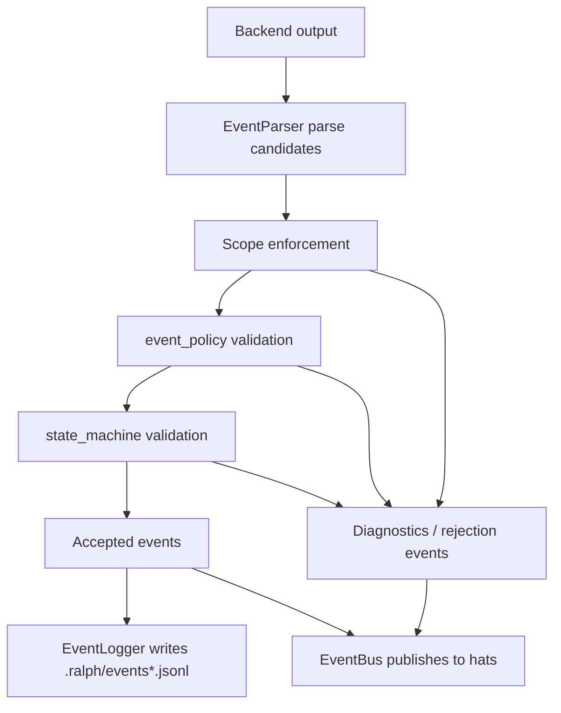

# upstream: Ralph 原生状态机与 accepted events 分层

## Execution Boundary

**Target repo:** `ralph-orchestrator`

**Important:** 本计划是 Ralph upstream 专用计划。执行 agent 如果在 Ralph 仓库中拿到这份文件，只需要修改 Ralph 仓库内文件。所有路径都相对 Ralph 仓库根目录，例如 `crates/ralph-core/src/config.rs`。不要读取、修改或假设存在 Universal AutoResearch 仓库中的 `skills/`、`docs/report/`、`tests/run_regression.py`、`hat-contracts.yml` 等文件。

**What this plan does not do:** Ralph 仓库不实现 TLA+、Alloy、Java/TLC 调用，也不实现 Universal 的 pre-run proof gate。形式化证明属于下游 Universal 仓库。Ralph 只实现 Rust 原生 runtime enforcement：读取 YAML 中的 `event_loop.state_machine`，在事件进入 accepted event log 和 EventBus 前进行状态机校验。

**How to run this with `code-assist`:** 在 Ralph 仓库根目录运行 code-assist 时，把本计划文件作为 prompt 或 prompt-file 输入即可。执行 agent 应把本文件当作完整规格，不需要知道 Universal 仓库路径。

**Non-regression rule:** 这是新增 opt-in 能力，不是 Ralph 现有运行语义的替换工程。任何实现如果在缺失 `event_loop.state_machine` 或 `enabled: false` 时改变 `ralph run`、`ralph emit`、`ralph preflight`、公共 preset、`workflow_guards`、`event_policy`、hooks、tasks、memories、session recording 或 accepted event 旧路径行为，都视为实现失败，必须回退或改成 state-machine-only 分支。

## Overview

Ralph 当前已经有 `event_policy` 和 `workflow_guards`，但这两个机制仍不足以表达真实工作流生命周期：

- `workflow_guards` 是线性 topic chain，只能表达“下一个 topic 是什么”。
- 它不能表达“某个事件可以从多个中间状态直接关闭实例”，例如 `experiment.blocked`。
- 当前事件记录路径会在 runtime validation 之前记录 LLM 输出中的 parsed events，导致后续被 scope/policy/guard drop 的事件仍可能进入主 `.ralph/events*.jsonl`。
- `LOOP_COMPLETE` 被拒绝后会发布 `task.resume`，在某些 agent 行为下可能造成重复 terminal retry loop。

本计划新增 opt-in `event_loop.state_machine`。启用后，Ralph 会把每个带 instance key 的业务事件当作状态转移处理。只有通过 scope、event policy、state machine 的事件才是 accepted event，才能写入主 events 文件和发布到 EventBus。

## Problem Frame

本计划要修的是 Ralph runtime 的通用能力，不是某个 AutoResearch 项目的专用逻辑。用通俗话说，Ralph 需要从“按 topic 顺序大致检查”升级为“按状态机接受事件”。

现有源码形态：

- `crates/ralph-core/src/config.rs`
  - `EventLoopConfig` 已包含 `workflow_guards`、`event_policy`、`execution_mode`。
  - `WorkflowChain` 只有 `topics: Vec<String>`，不能表达分支关闭。
- `crates/ralph-core/src/event_loop/loop_state.rs`
  - `WorkflowProgress` 只记录 highest phase，不知道实例是 open 还是 closed。
  - `LoopState` 记录 `completion_requested`、`completion_honored`，但没有通用 instance lifecycle state。
- `crates/ralph-core/src/event_loop/mod.rs`
  - `process_parse_result()` 已有 scope enforcement、event_policy、workflow_guards 的管线。
  - `check_completion_event()` 依赖 required events、workflow guard completion、tasks/scratchpad completion。
- `crates/ralph-cli/src/loop_runner.rs`
  - `log_events_from_output()` 在 `process_output()` 前调用，会把 backend output 解析到的 events 先写入 `EventLogger`。
  - 这会让主 events 文件不再严格等于 accepted events。
- `crates/ralph-core/src/event_logger.rs`
  - 当前负责 JSONL event record 写入，是 accepted events 语义应收敛的位置。

## Requirements Trace

- R1. 新增 `event_loop.state_machine` 配置，默认不启用；旧配置行为保持兼容。
- R2. state machine 必须支持按 payload 字段提取 instance key，例如 `task_key`。
- R3. state machine 必须支持 open、advance、close、terminal 四类语义。
- R4. close transition 必须允许 branch close：同一个 close topic 可从多个 open states 关闭实例。
- R5. terminal topic 只有在没有 open instances 时才能 accepted。
- R6. terminal accepted/honored 后，重复 terminal 和 terminal 后 business event 不得进入 accepted events。
- R7. scope/policy/state-machine rejected 或 dropped 的事件不得写入主 `.ralph/events*.jsonl`。
- R8. 如果需要保留 LLM 原始候选事件，必须进入单独 raw/diagnostic trace，不得污染 accepted events。
- R9. violation 必须有结构化 diagnostic，至少包含 topic、instance key、current state、expected states、reason。
- R10. `workflow_guards` 继续保留；未启用 `state_machine` 时旧行为不变。
- R11. 启用 `state_machine` 时，completion open-instance 判断以 state machine runtime state 为准。
- R12. 测试必须先从 BDD 行为出发，再补 Rust unit/integration tests。
- R13. 非回归是硬门槛：未启用 `state_machine` 的旧配置、公共 preset、`workflow_guards`、`event_policy`、EventLogger、SessionRecorder、hooks/tasks/memories 行为必须保持现状。
- R14. accepted-events 分层不能丢失或重复 legacy 合法事件；如果无法安全重构 legacy logging，必须只在 `state_machine.enabled` 分支启用新 accepted logging，旧路径保持原样。

## Scope Boundaries

- 不删除 `workflow_guards`。
- 不把 AutoResearch topic 写死进 Ralph。所有 topic/state/transition 都来自用户 YAML。
- 不引入 Java、TLA+、Alloy 或外部 model checker 到 Ralph runtime。
- 不修改 Universal 仓库。
- 不实现旧 `.ralph/events*.jsonl` 的迁移工具。
- 不改所有 preset；只在需要时添加一个最小 fixture/preset 用于测试。
- 不把 `state_machine` 变成现有用户必填配置；没有显式启用时，Ralph 必须走原有 legacy runtime 路径。
- 不顺手重构 `ralph run`、`ralph emit`、`ralph preflight`、公共 presets、hooks、tasks、memories、session recording 或 TUI/RPC 行为。
- 不因为 accepted event logging 修复而改变非 state-machine 配置的 event log 形状；除非已有测试证明旧路径本身存在独立 bug，且该 bug 被本计划明确纳入。

### Deferred to Separate Tasks

- TUI 中展示 state machine 当前 open instances。
- `ralph preflight` 对 state machine 进行更深入的静态可达性证明。
- CLI 命令自动从 `workflow_guards` 迁移到 `state_machine`。
- Raw event trace 的长期保留策略、压缩和隐私策略。

## Context & Research

### Relevant Code and Patterns

- `crates/ralph-core/src/config.rs`
  - 所有 YAML schema 类型集中在这里。
  - `EventPolicyConfig`、`WorkflowGuardsConfig`、`CorrelationConfig` 是新增 state machine config 的直接参考。
- `crates/ralph-core/src/event_policy.rs`
  - `PolicyDecision` 已表达 accept、warn、reject、hold、block、ignore 等处理结果。
  - state machine 可以采用类似“decision + finding”的返回风格。
- `crates/ralph-core/src/event_loop/mod.rs`
  - `apply_event_policy_validation()` 是状态机验证器插入点的直接参考。
  - `apply_workflow_guard_validation()` 是旧线性 guard 行为，不能直接扩展成状态机，但可借鉴 correlation extraction。
- `crates/ralph-core/src/event_loop/loop_state.rs`
  - `LoopState` 保存 per-loop runtime state，适合挂载 `StateMachineRuntimeState`。
- `crates/ralph-core/src/loop_state_snapshot.rs`
  - 已有 replay/snapshot 概念，可参考其输出形状，但 runtime state machine 不应依赖 post-hoc replay。
- `crates/ralph-core/src/event_logger.rs`
  - accepted events JSONL 写入边界需要收敛到这里或 loop_runner 调用这里的时机。
- `crates/ralph-cli/src/loop_runner.rs`
  - `log_events_from_output()` 是当前 raw/accepted 混淆的主要位置。
- `crates/ralph-e2e/features/hooks/*.feature`
  - 现有 Cucumber feature 风格参考。

## Key Technical Decisions

- **新增 `state_machine`，不改造 `workflow_guards`。** 线性 guard 和生命周期状态机是两个概念，硬塞到 `WorkflowChain` 会让兼容性和语义都变差。
- **state machine 是 opt-in。** 旧配置不声明 `event_loop.state_machine` 时，Ralph 行为不变。
- **accepted events 是主事件事实源。** 主 `.ralph/events*.jsonl` 必须只包含通过验证的 accepted events；raw candidate event 另走诊断通道。
- **state machine 不依赖 Java 或形式化工具。** Ralph runtime 只用 Rust 原生逻辑执行已生成的状态机配置。
- **event_policy 先于 state_machine。** 先确保 payload/schema/terminal policy 基本合法，再做业务状态转移。
- **启用 state_machine 时，它负责 open-instance completion gate。** 旧 `workflow_guards` completion check 仍保留给 legacy config，但不能覆盖 state machine 的实例关闭语义。
- **duplicate terminal 不再触发无限 `task.resume`。** completion honored 后的 duplicate terminal 应 reject/ignore with diagnostic，而不是继续推进恢复循环。
- **高风险改动先 characterization，再最小分支化。** `loop_runner` / `EventLogger` / `SessionRecorder` 这类共享路径必须先用现有行为测试锁住 legacy 语义；如果 accepted logging 新语义会影响旧配置，就把新语义限制在 `state_machine.enabled` 分支。

## Non-Regression Contract

本节是上游实现的硬约束。它的目的不是承诺“不会出 bug”，而是把“不搅乱其他功能”转成可执行的边界和测试门槛。

| Existing Surface | Must Stay True When `state_machine` Is Absent |
|---|---|
| Config loading | 旧 YAML 不需要新增字段即可解析；serde default 不改变 `EventLoopConfig` 既有字段含义 |
| Public presets | `crates/ralph-cli/presets/*.yml` 继续全部可解析，completion path 和 required events 不被改写 |
| `workflow_guards` | 线性 topic chain 校验、completion guard、diagnostic/recovery 行为保持既有测试结果 |
| `event_policy` | accept/warn/reject/hold/block/ignore 语义和 terminal policy 不因 state machine 类型新增而改变 |
| EventLogger | legacy 配置下 `.ralph/events*.jsonl` 的写入时机、记录形状和 `current-events` marker 不变 |
| SessionRecorder | 仍记录 EventBus 上的 accepted events；不因为 raw/accepted 分层改动丢事件或重复事件 |
| Hooks / tasks / memories | 任务完成判断、hook 触发、memory 注入和 scratchpad 相关行为不受 state machine 新字段影响 |
| CLI UX | `ralph run`、`ralph emit`、`ralph preflight` 对旧配置的命令输出和退出码保持兼容 |

实现时必须把“新增能力”和“旧能力”在代码上显式分开。推荐形态是：

- `config.event_loop.state_machine.as_ref().filter(|sm| sm.enabled)` 为唯一启用入口。
- 新的 runtime state 只在 enabled 时初始化和推进。
- 新的 terminal open-instance gate 只在 enabled 时替代 legacy completion gate。
- accepted logging 如果需要改变调用边界，先证明 legacy tests 不变；无法证明时使用 state-machine-only logging path。

## Regression Safety Gates

每个实现 PR 合并前必须通过以下 gate：

1. **Legacy config gate:** 至少保留一个不含 `event_loop.state_machine` 的配置 fixture，覆盖 parse、run、completion、event log。
2. **Public preset gate:** `crates/ralph-cli/src/presets.rs` 中公共 preset 解析和 completion path 测试必须继续通过；新增断言只能是兼容性断言。
3. **Workflow guard gate:** 现有 `workflow_guards` 测试必须未改预期地通过；如果必须修改预期，说明该修改不是本计划范围，应另开计划。
4. **Event policy gate:** 现有 `event_policy` 测试必须通过，尤其 terminal policy、business-after-terminal、reject/hold/block 行为不能被 state machine 抢先改变。
5. **Logging gate:** 对同一 legacy backend output，修改前后 accepted events 数量和 topic 顺序必须一致；state-machine fixture 才允许体现新 accepted-only 语义。
6. **Session recording gate:** session recording 仍只从 EventBus 观察 accepted events，不能因为 raw trace 引入重复记录。
7. **No broad refactor gate:** 除本计划列出的文件外，不做横向清理、命名风格统一或 preset 全量迁移；发现必要扩展时先更新本计划再实现。

## Public Config Design

> This illustrates the intended approach and is directional guidance for review, not implementation specification. The implementing agent should treat it as context, not code to reproduce.

```yaml
event_loop:
  state_machine:
    enabled: true
    instance_key:
      from_payload: task_key
      required_for:
        - experiment.planned
        - experiment.ready
        - experiment.measured
        - experiment.scored
        - experiment.attacked
        - experiment.evaluated
        - experiment.blocked
    terminal_topics:
      - LOOP_COMPLETE
    business_topics:
      - experiment.planned
      - experiment.ready
      - experiment.measured
      - experiment.scored
      - experiment.attacked
      - experiment.evaluated
      - experiment.blocked
    terminal_guard:
      require_no_open_instances: true
      duplicate_terminal: reject
      business_after_terminal: reject
      write_diagnostic_event: true
    transitions:
      - topic: experiment.planned
        from: [idle, closed]
        to: planned
        opens_instance: true
      - topic: experiment.ready
        from: [planned]
        to: ready
      - topic: experiment.measured
        from: [ready]
        to: measured
      - topic: experiment.scored
        from: [measured]
        to: scored
      - topic: experiment.attacked
        from: [scored]
        to: attacked
      - topic: experiment.evaluated
        from: [scored, attacked]
        to: evaluated
        closes_instance: true
      - topic: experiment.blocked
        from: [planned, ready, measured, scored, attacked]
        to: blocked
        closes_instance: true
```

### Config Semantics

- `enabled`: false 或缺失时，完全不启用 state machine。
- `instance_key.from_payload`: 从 event payload JSON 中读取 instance key，支持 dot path 的需求可延后；v1 先支持顶层字段即可。
- `instance_key.required_for`: 哪些 topic 必须带 instance key。
- `business_topics`: terminal 后禁止接受的业务 topic 集合。
- `terminal_topics`: 可完成 loop 的 terminal topic。
- `transitions[].from`: 当前 state 必须在此集合内才可接受该 topic。
- `transitions[].to`: 接受后写入的新 state。
- `opens_instance`: 接受后该 instance 进入 open set。
- `closes_instance`: 接受后该 instance 从 open set 移除，进入 closed map。
- `terminal_guard.require_no_open_instances`: terminal accepted 前必须 open set 为空。

### Runtime Decision Semantics

State machine validator 返回四类结果即可：

- `Accept`: 事件合法，允许进入 accepted events 和 EventBus。
- `Reject`: 事件非法，不写 accepted events；可发布 diagnostic/recovery。
- `Ignore`: terminal honored 后的重复噪声，不写 accepted events；可写 diagnostic。
- `DiagnosticOnly`: 写诊断事件，不推进业务状态。

## BDD Feature

```gherkin
Feature: Ralph native event state machine
  As a Ralph workflow author
  I want Ralph to validate events against an explicit state machine before accepting them
  So that invalid, completed, or out-of-scope workflows cannot keep driving the loop

  Scenario: A valid linear instance completes through evaluated
    Given event_loop.state_machine is enabled
    And task t1 has not started
    When Ralph processes experiment.planned with task_key t1
    And Ralph processes experiment.ready with task_key t1
    And Ralph processes experiment.measured with task_key t1
    And Ralph processes experiment.scored with task_key t1
    And Ralph processes experiment.evaluated with task_key t1
    Then task t1 is closed
    And LOOP_COMPLETE is accepted

  Scenario: blocked closes an open instance from an early state
    Given event_loop.state_machine is enabled
    And task t1 is at experiment.planned
    When Ralph processes experiment.blocked with task_key t1
    Then task t1 is closed
    And LOOP_COMPLETE is accepted when no other tasks are open

  Scenario: blocked closes an open instance from a later state
    Given event_loop.state_machine is enabled
    And task t1 is at experiment.scored
    When Ralph processes experiment.blocked with task_key t1
    Then task t1 is closed
    And no workflow guard linear terminal phase is required

  Scenario: out-of-order event is rejected
    Given event_loop.state_machine is enabled
    And task t1 has not started
    When Ralph processes experiment.ready with task_key t1
    Then experiment.ready is rejected
    And no downstream hat receives experiment.ready
    And accepted events does not contain experiment.ready

  Scenario: terminal is rejected while an instance is open
    Given event_loop.state_machine is enabled
    And task t1 is open at experiment.scored
    When Ralph processes LOOP_COMPLETE
    Then LOOP_COMPLETE is rejected
    And completion_requested remains false
    And a diagnostic lists task t1 as open

  Scenario: duplicate terminal does not create a retry loop
    Given event_loop.state_machine is enabled
    And LOOP_COMPLETE has already been honored
    When Ralph processes another LOOP_COMPLETE
    Then the duplicate terminal is ignored or rejected
    And task.resume is not repeatedly published

  Scenario: isolated out-of-scope event is not accepted
    Given isolated mode is enabled for strategist
    And strategist may not publish loop.noop
    When strategist outputs loop.noop
    Then loop.noop is dropped before accepted logging
    And accepted events does not contain loop.noop
    And a diagnostic records the scope violation

  Scenario: legacy configs keep existing behavior
    Given a config has workflow_guards
    But it does not define event_loop.state_machine
    When Ralph processes the config
    Then existing workflow guard behavior is unchanged
```

## Output Structure

Expected new or changed files in the Ralph repo:

```text
crates/ralph-core/src/
  config.rs
  event_loop/
    loop_state.rs
    mod.rs
    tests.rs
  event_logger.rs
  lib.rs
  state_machine.rs
crates/ralph-cli/src/
  loop_runner.rs
crates/ralph-cli/tests/
  loop_runner_state_machine_tests.rs
crates/ralph-e2e/features/
  state-machine/
    accepted-events.feature
    branch-close.feature
    completion-guard.feature
crates/ralph-e2e/src/
  state_machine_bdd.rs
```

The exact E2E harness file names may follow existing `crates/ralph-e2e/src/hooks_bdd.rs` patterns if that is more idiomatic during implementation.

## High-Level Technical Design

> This illustrates the intended approach and is directional guidance for review, not implementation specification. The implementing agent should treat it as context, not code to reproduce.



## Implementation Units

- [ ] **Unit 1: Add state machine config types**

**Goal:** 让 Ralph YAML 能声明通用状态机，但默认不影响旧配置。

**Requirements:** R1, R2, R3, R10

**Dependencies:** None

**Files:**
- Modify: `crates/ralph-core/src/config.rs`
- Test: `crates/ralph-core/src/config.rs`

**Approach:**
- 在 `EventLoopConfig` 增加 `state_machine: Option<StateMachineConfig>`。
- 新增 config types：
  - `StateMachineConfig`
  - `StateMachineInstanceKeyConfig`
  - `StateTransitionConfig`
  - `StateMachineTerminalGuardConfig`
  - enum-like action config for duplicate terminal / business after terminal，可复用现有 completion after terminal action 命名风格。
- `StateMachineConfig` 字段包括 `enabled`、`instance_key`、`terminal_topics`、`business_topics`、`terminal_guard`、`transitions`。
- config validation 中只做结构级错误：重复 topic transition、空 `to` state、`opens_instance` 和 `closes_instance` 同时 true 等。
- 缺失 `state_machine` 和 `enabled: false` 都表示不启用。
- 增加 default/compatibility characterization：解析旧配置后，除 `state_machine == None` 外，`workflow_guards`、`event_policy`、`execution_mode` 等既有字段的 default 和序列化形状不能变化。
- 公共 preset 不批量加入 `state_machine`；本单元只验证公共 preset 在新 schema 下仍能解析。

**Patterns to follow:**
- `EventPolicyConfig` 的 serde/default 风格。
- `WorkflowGuardsConfig` 和 `CorrelationConfig` 的 YAML 结构。
- `ConfigError` / warning 现有模式。

**Test scenarios:**
- Happy path: old config without `state_machine` deserializes and equals default disabled state.
- Happy path: old config round-trip does not add `state_machine` or change existing event loop defaults.
- Happy path: valid state machine YAML deserializes all transitions and terminal guard.
- Happy path: `enabled: false` with transitions present does not affect runtime until enabled.
- Error path: duplicate transition topic is rejected by config validation.
- Error path: transition with empty `from` list is rejected unless explicitly documented as wildcard; v1 should reject.
- Error path: `opens_instance: true` and `closes_instance: true` on the same transition is rejected.
- Compatibility: existing `workflow_guards` tests still pass unchanged.
- Compatibility: all public presets in `crates/ralph-cli/presets/*.yml` still parse without adding `state_machine`.

**Verification:**
- `RalphConfig::parse_yaml()` handles old and new configs.
- No public preset breaks due to missing `state_machine`.

- [ ] **Unit 2: Implement core state machine validator**

**Goal:** 新增 Rust 原生 validator，独立于 event loop 单元测试即可验证状态转移。

**Requirements:** R2, R3, R4, R5, R6, R9

**Dependencies:** Unit 1

**Files:**
- Create: `crates/ralph-core/src/state_machine.rs`
- Modify: `crates/ralph-core/src/lib.rs`
- Test: `crates/ralph-core/src/state_machine.rs`

**Approach:**
- 新增 runtime state:
  - open instances: instance key -> current state and last topic
  - closed instances: instance key -> final state and closing topic
  - terminal observed / terminal honored
  - recent rejected terminal fingerprint for no-retry-loop dedupe
- 新增 finding type:
  - topic
  - instance key if present
  - current state
  - expected states
  - violation type
  - human-readable message
- Payload parsing:
  - instance transition topics listed in `required_for` must have JSON object payload.
  - missing payload, invalid JSON, missing key, non-string key all reject.
  - terminal topics do not require instance key.
- Transition rules:
  - If no state exists, current state is `idle`.
  - `opens_instance` inserts into open map.
  - normal advance updates open map state.
  - `closes_instance` removes from open map and writes closed map.
  - close transition may be accepted from any configured `from` state.
- Terminal rules:
  - terminal accepted only if open map is empty when `require_no_open_instances` is true.
  - after terminal honored, duplicate terminal and business topics follow terminal guard action.

**Patterns to follow:**
- `event_policy.rs` style: decision plus finding, pure unit tests in same module.
- `loop_state_snapshot.rs` data naming for workflow instance summaries.

**Test scenarios:**
- Happy path: `experiment.planned` opens instance `t1` in state `planned`.
- Happy path: `experiment.ready` advances `t1` from `planned` to `ready`.
- Happy path: full `planned -> ready -> measured -> scored -> evaluated` closes instance.
- Happy path: `experiment.blocked` closes from `planned`.
- Happy path: `experiment.blocked` closes from `ready`, `measured`, `scored`, and `attacked`.
- Edge case: duplicate `experiment.planned` for open `t1` rejects.
- Edge case: `experiment.planned` for previously closed `t1` is rejected by default unless config explicitly allows reopen; v1 should reject reopen to avoid accidental duplicate tasks.
- Error path: `experiment.ready` before `experiment.planned` rejects with current state `idle`.
- Error path: transition from wrong state rejects and reports expected states.
- Error path: missing JSON payload rejects for `required_for` topic.
- Error path: payload has non-string `task_key` rejects.
- Error path: terminal rejects while open map contains any instance.
- Error path: business event after terminal rejects.
- Error path: duplicate terminal after honored rejects/ignores without requiring `task.resume`.

**Verification:**
- Validator is deterministic and can be tested without filesystem, EventBus, or CLI.

- [ ] **Unit 3: Add state machine runtime state to EventLoop**

**Goal:** 把 validator 挂进 `LoopState` 和 `process_parse_result()`，但先不改 CLI accepted logging。

**Requirements:** R3, R4, R5, R9, R11

**Dependencies:** Unit 2

**Files:**
- Modify: `crates/ralph-core/src/event_loop/loop_state.rs`
- Modify: `crates/ralph-core/src/event_loop/mod.rs`
- Test: `crates/ralph-core/src/event_loop/tests.rs`

**Approach:**
- `LoopState` 增加 `state_machine_runtime_state`，仅在 config enabled 时使用。
- 在 `process_parse_result()` 中，现有顺序保持为：
  - malformed handling
  - isolated/coordinator scope enforcement
  - event_policy validation
  - state_machine validation
  - workflow_guards validation for legacy / additional ordering
  - publish accepted events
- 如果 `state_machine.enabled`，state machine rejection 应在 `state.record_event()` 和 `bus.publish()` 前发生。
- 对 state machine rejection 发布 diagnostic event，例如 `event.state_machine_rejected`。
- Diagnostic payload 必须是可读字符串或 JSON；v1 可以字符串，但内容必须包含 structured fields。
- `check_completion_event()` 在 state machine enabled 时先检查 state machine open instances；如果有 open instances，拒绝 completion 并发布一次 diagnostic/recovery。

**Patterns to follow:**
- `apply_event_policy_validation()` 的插入方式。
- `apply_workflow_guard_validation()` 的 recovery event 风格，但避免重复 resume。
- `LoopState::completion_honored` 现有幂等逻辑。

**Test scenarios:**
- Integration: valid chain events are published to EventBus in order.
- Integration: invalid out-of-order event is not published to EventBus.
- Integration: state machine rejected event does not call `state.record_event()` for the original topic.
- Integration: `experiment.blocked` closes open instance and allows `LOOP_COMPLETE`.
- Integration: `LOOP_COMPLETE` with open instance does not set `completion_requested` to an accepted terminal state.
- Integration: diagnostic event is published when state machine rejects.
- Compatibility: when `state_machine` absent, existing workflow guard tests behave as before.
- Ordering: event_policy rejects invalid payload before state machine transition logic.

**Verification:**
- Event loop no longer routes illegal business events to hats when state machine is enabled.

- [ ] **Unit 4: Redefine accepted event logging boundary**

**Goal:** 确保主 `.ralph/events*.jsonl` 只记录 accepted events，不记录 raw candidate output。

**Requirements:** R6, R7, R8

**Dependencies:** Unit 3

**Files:**
- Modify: `crates/ralph-cli/src/loop_runner.rs`
- Modify: `crates/ralph-core/src/event_logger.rs`
- Test: `crates/ralph-cli/tests/loop_runner_state_machine_tests.rs`
- Test: `crates/ralph-core/src/event_logger.rs`

**Approach:**
- 先补 characterization tests，锁住当前 legacy logging 行为：不含 `state_machine` 的配置下，现有合法事件写入数量、topic 顺序、`current-events` marker、SessionRecorder 观察结果保持不变。
- 移除或重构 `run_loop_impl()` 中 `process_output()` 前的 `log_events_from_output()` 主事件写入。
- 新的 accepted logging 应发生在 event loop validation 之后。
- 可选设计：
  - 让 `process_output()` / `process_parse_result()` 返回 accepted events summary，CLI 层写主 event log。
  - 或让 EventBus observer / EventLoop 内部统一写 accepted event log。
  - 选择时优先最小改动，并避免同一 accepted event 写两次。
- `event.orphaned` 的处理要重新定位：
  - 当前 `log_events_from_output()` 会为 no subscriber event 写 `event.orphaned`。
  - 新设计中 orphan detection 应基于 accepted event，并在 accepted 后判断是否无 hat subscriber。
  - rejected raw topic 不应再产生 accepted orphan event，除非 diagnostic 明确表示 rejection。
- Raw trace 若保留，必须有单独文件名和明确 opt-in，例如 diagnostics collector 中的 agent output，不作为 replay source。
- 如果重构会改变 legacy 配置下的主 event log 形状，则不要改 legacy 路径；改为仅在 `state_machine.enabled` 时启用 accepted-only logging，并把 legacy accepted logging 独立保留到后续专门计划。

**Patterns to follow:**
- `EventLogger::from_context()` 的 workspace-aware path。
- `SessionRecorder` observer 模式。
- `event_reader.rs` 对 event log 读取位置的假设。

**Test scenarios:**
- Integration: valid accepted event is written exactly once to `.ralph/events*.jsonl`.
- Regression: legacy config without `state_machine` writes the same accepted event sequence as before this feature.
- Integration: isolated out-of-scope `loop.noop` is not written to `.ralph/events*.jsonl`.
- Integration: event_policy rejected event is not written to `.ralph/events*.jsonl`.
- Integration: state_machine rejected event is not written to `.ralph/events*.jsonl`.
- Integration: diagnostic event for rejection may be observed but is distinguishable from original business event.
- Regression: existing start event logging and `current-events` marker still work.
- Regression: session recording still records EventBus accepted events as before.
- Regression: hooks/tasks/memories completion behavior is unchanged for legacy configs.

**Verification:**
- Main event log can be described as accepted trace without caveats.

- [ ] **Unit 5: Completion idempotency and retry-loop prevention**

**Goal:** 修复 repeated terminal 和 rejected terminal 诱发恢复死循环的问题。

**Requirements:** R5, R6, R9, R11

**Dependencies:** Unit 3

**Files:**
- Modify: `crates/ralph-core/src/event_loop/mod.rs`
- Modify: `crates/ralph-core/src/event_policy.rs`
- Test: `crates/ralph-core/src/event_loop/tests.rs`
- Test: `crates/ralph-core/src/event_policy.rs`

**Approach:**
- completion honored 后：
  - duplicate terminal 不 publish `task.resume`。
  - business after terminal 按 event_policy/state_machine terminal guard reject/ignore。
- terminal rejected because open instances remain:
  - publish one diagnostic/recovery with open instance list。
  - record enough state to avoid identical terminal rejection causing endless `task.resume` every iteration。
- `check_completion_event()` 应避免在同一 completion rejection 原因上反复注入同样 resume event。
- 如果 state machine enabled，workflow guard incomplete 不应误判已 blocked closed 的实例。

**Patterns to follow:**
- `PolicyRuntimeState` 的 terminal observed / completion honored 状态。
- `LoopState::completion_honored` 幂等分支。

**Test scenarios:**
- Happy path: first valid `LOOP_COMPLETE` returns `CompletionPromise` exactly once.
- Error path: duplicate `LOOP_COMPLETE` after honored does not publish `task.resume`.
- Error path: `LOOP_COMPLETE` with open instance rejects and reports open instance.
- Error path: repeated rejected `LOOP_COMPLETE` with same open instance does not create unbounded identical recovery events.
- Regression: persistent mode still suppresses completion as before.
- Regression: cancellation promise still bypasses chain/state-machine completion requirements.

**Verification:**
- Repeated terminal no longer keeps loop alive by itself.

- [ ] **Unit 6: Snapshot and diagnostics integration**

**Goal:** 让 runtime state machine 的状态可被调试、summary 或未来 audit 理解。

**Requirements:** R8, R9, R11

**Dependencies:** Unit 2, Unit 3

**Files:**
- Modify: `crates/ralph-core/src/loop_state_snapshot.rs`
- Modify: `crates/ralph-core/src/summary_writer.rs`
- Modify: `crates/ralph-core/src/diagnostics/orchestration.rs`
- Test: `crates/ralph-core/src/loop_state_snapshot.rs`
- Test: `crates/ralph-core/src/summary_writer.rs`

**Approach:**
- Snapshot 中增加 state machine open/closed instance summary，或复用现有 workflow instance snapshot 的字段并标明 source。
- Summary writer 在 loop 终止时能写出是否有 open instances。
- Diagnostics 中记录 state machine rejection finding。
- 不要求 TUI 展示。

**Test scenarios:**
- Happy path: snapshot includes open instance key and current state.
- Happy path: snapshot includes closed instance key and close topic.
- Error path: state machine rejection appears in diagnostics with reason.
- Integration: summary for completed loop says no open state-machine instances.
- Integration: summary for max-runtime loop includes remaining open instances.

**Verification:**
- 用户能从 Ralph 自身产物看出为何 terminal 被拒绝。

- [ ] **Unit 7: CLI and E2E tests**

**Goal:** 用真实 loop runner 路径验证 accepted events 分层和 state machine 行为。

**Requirements:** R7, R8, R10, R12

**Dependencies:** Unit 1-6

**Files:**
- Create: `crates/ralph-cli/tests/loop_runner_state_machine_tests.rs`
- Create: `crates/ralph-e2e/features/state-machine/branch-close.feature`
- Create: `crates/ralph-e2e/features/state-machine/completion-guard.feature`
- Create: `crates/ralph-e2e/features/state-machine/accepted-events.feature`
- Modify: `crates/ralph-e2e/src/main.rs`
- Create or modify: `crates/ralph-e2e/src/state_machine_bdd.rs`

**Approach:**
- CLI tests use temporary workspace and fake backend output to avoid real LLM.
- E2E feature mirrors BDD scenarios from this plan.
- Tests must inspect accepted events file, not only process exit status.

**Test scenarios:**
- CLI: valid red-team-like chain writes accepted events in order and terminates.
- CLI: blocked branch writes blocked and terminal, with no open instance.
- CLI: terminal with open instance does not write accepted terminal.
- CLI: out-of-scope isolated event is absent from accepted events.
- CLI: duplicate terminal does not append duplicate accepted terminal.
- Cucumber: branch close scenario passes.
- Cucumber: completion guard scenario passes.
- Cucumber: accepted events trace excludes rejected/dropped events.

**Verification:**
- Ralph-level behavior is proven without Universal repository.

- [ ] **Unit 8: Documentation and preset compatibility**

**Goal:** 让 Ralph 用户知道 `state_machine` 与 `workflow_guards`、`event_policy` 的边界。

**Requirements:** R1, R9, R10

**Dependencies:** Unit 1-7

**Files:**
- Modify: `README.md` or relevant docs if present
- Modify: `crates/ralph-cli/presets/code-assist.yml` only if tests reveal preset assumptions need clarification
- Test: `crates/ralph-cli/src/presets.rs`

**Approach:**
- Docs explain:
  - `workflow_guards`: linear ordering guard。
  - `event_policy`: schema/terminal policy。
  - `state_machine`: instance lifecycle and terminal no-open-instance guard。
- Existing public presets should continue parsing.
- Do not add `state_machine` to every preset by default in this PR.
- 如果修改 `crates/ralph-cli/presets/code-assist.yml`，只能添加注释或最小 opt-in 示例 fixture；不能改变现有 code-assist 默认工作流。
- 文档必须明确：`state_machine` 是新增可选安全层，未配置时 Ralph 用户不需要改现有 YAML。

**Test scenarios:**
- Compatibility: all public presets still parse.
- Compatibility: public presets still expose completion path.
- Compatibility: `code-assist.yml` 默认行为不因本计划改变。
- Docs: state machine example includes branch close and terminal guard.

**Verification:**
- Existing users can ignore the new feature until they opt in.

## Detailed Test Plan

### Outside-In Test Flow

1. Add Cucumber feature files for branch close, completion guard, and accepted events.
2. Add Rust config tests that initially fail because `state_machine` config does not exist.
3. Add pure state-machine unit tests that initially fail because validator does not exist.
4. Add event loop integration tests that initially fail because validator is not wired.
5. Add CLI accepted-events tests that initially fail because `log_events_from_output()` writes too early.
6. Add completion retry-loop regression tests.
7. Run existing preset/config tests to ensure compatibility.

### Unit Test Checklist

| Area | File | Must Cover |
|---|---|---|
| Config | `crates/ralph-core/src/config.rs` | serde defaults, valid YAML, invalid transition shape, old config compatibility |
| Validator | `crates/ralph-core/src/state_machine.rs` | open, advance, branch close, terminal guard, duplicate terminal, payload errors |
| Loop integration | `crates/ralph-core/src/event_loop/tests.rs` | rejection before bus publish, completion gate, diagnostics |
| Event policy interop | `crates/ralph-core/src/event_policy.rs` | terminal honored consistency, business after terminal action |
| Accepted logging | `crates/ralph-cli/tests/loop_runner_state_machine_tests.rs` | accepted event written once, rejected event absent |
| E2E | `crates/ralph-e2e/features/state-machine/*.feature` | user-visible behavior |

### Legacy Regression Matrix

这些测试不是 state machine 新功能测试，而是防止上游改动破坏 Ralph 其他功能。实现 agent 必须先确认现有测试名称和 fixture 位置，再按 Ralph 当前测试组织补齐。

| Surface | Suggested Test Location | Required Assertion |
|---|---|---|
| Public presets | `crates/ralph-cli/src/presets.rs` | 所有 `crates/ralph-cli/presets/*.yml` 在不新增 `state_machine` 的情况下继续解析 |
| Code assist preset | `crates/ralph-cli/src/presets.rs` | `crates/ralph-cli/presets/code-assist.yml` 默认 completion path、required events、execution mode 不变 |
| Legacy event loop | `crates/ralph-core/src/event_loop/tests.rs` | 不含 `state_machine` 时，scope、policy、workflow guard 顺序和旧测试预期不变 |
| Workflow guards | `crates/ralph-core/src/event_loop/tests.rs` | 线性 guard completion 仍由旧 `workflow_guards` 路径负责 |
| Event policy | `crates/ralph-core/src/event_policy.rs` | terminal honored、business-after-terminal、reject/hold/block/ignore 现有语义不变 |
| EventLogger | `crates/ralph-core/src/event_logger.rs` 和 `crates/ralph-cli/tests/loop_runner_state_machine_tests.rs` | legacy 配置下事件记录数量、topic 顺序、marker 文件不变 |
| SessionRecorder | 现有 session recorder 测试位置 | 不因 raw/accepted 分层产生重复记录或漏记 accepted events |
| Hooks/tasks/memories | 现有 hooks/tasks/memories 测试位置 | 任务完成、hook 触发、memory/scratchpad 注入不受新增 config 字段影响 |
| CLI commands | 现有 CLI integration 测试位置 | `ralph run`、`ralph emit`、`ralph preflight` 对旧配置退出码兼容 |

### Characterization-First Rule

共享路径改动必须先写 characterization test，再实现：

- 改 `crates/ralph-cli/src/loop_runner.rs` 前，先锁住 legacy backend output 到 event log 的现有结果。
- 改 `crates/ralph-core/src/event_logger.rs` 前，先锁住 EventLogger record shape 和 exactly-once 语义。
- 改 `crates/ralph-core/src/event_loop/mod.rs` 前，先锁住未启用 state machine 时的 scope/policy/workflow guard 顺序。
- 改 completion path 前，先锁住 legacy `check_completion_event()` 对 required events、tasks、scratchpad、workflow guard 的行为。

如果 characterization test 暴露旧行为本身有 bug，但该 bug 不属于 state machine 必需改动，不在本计划内顺手修；记录为后续计划。

### Regression Event Sequences

Use these exact sequence shapes in tests. Topic names are examples from config, not hardcoded in production.

**Valid evaluated close:**

```text
experiment.planned(task_key=t1)
experiment.ready(task_key=t1)
experiment.measured(task_key=t1)
experiment.scored(task_key=t1)
experiment.evaluated(task_key=t1)
LOOP_COMPLETE
```

Expected: all business events accepted, `t1` closed, terminal accepted.

**Valid blocked close:**

```text
experiment.planned(task_key=t1)
experiment.blocked(task_key=t1)
LOOP_COMPLETE
```

Expected: `experiment.blocked` accepted, `t1` closed, terminal accepted.

**Invalid terminal with open task:**

```text
experiment.planned(task_key=t1)
LOOP_COMPLETE
```

Expected: `LOOP_COMPLETE` rejected, open instance diagnostic mentions `t1`.

**Invalid out-of-order transition:**

```text
experiment.ready(task_key=t1)
```

Expected: rejected, accepted events does not contain `experiment.ready`.

**Invalid post-terminal business:**

```text
experiment.planned(task_key=t1)
experiment.blocked(task_key=t1)
LOOP_COMPLETE
experiment.planned(task_key=t2)
```

Expected: `experiment.planned(task_key=t2)` rejected/ignored after terminal; accepted events stops at terminal plus diagnostics.

**Duplicate terminal retry-loop guard:**

```text
experiment.planned(task_key=t1)
experiment.blocked(task_key=t1)
LOOP_COMPLETE
LOOP_COMPLETE
LOOP_COMPLETE
```

Expected: only first terminal is accepted; later terminal events do not publish repeated `task.resume`.

## System-Wide Impact

- **Interaction graph:** Backend output is candidate data until it passes scope, policy, and state machine validation.
- **Error propagation:** Rejected events become diagnostics, not accepted business events.
- **State lifecycle risks:** Runtime open/closed instance state becomes first-class in Ralph, reducing reliance on downstream sidecars.
- **API surface parity:** `event_loop.state_machine` is new public YAML surface and must be documented.
- **Integration coverage:** Unit tests alone are insufficient because the bug class crosses parser, event loop, event logger, and CLI runner.
- **Unchanged invariants:** Configs without `state_machine` keep existing `workflow_guards` / `event_policy` behavior.

## Risks & Dependencies

| Risk | Likelihood | Impact | Mitigation |
|---|---:|---:|---|
| Accepted logging refactor causes duplicate or missing event records | Medium | High | Add CLI tests for exactly-once accepted writes and rejected absence |
| `state_machine` overlaps conceptually with `workflow_guards` | High | Medium | Docs and code comments define clear boundary: lifecycle vs linear ordering |
| Rejection diagnostics accidentally trigger hats as business events | Medium | Medium | Use diagnostic topic family and tests ensuring diagnostics do not advance business state |
| Old configs become stricter unintentionally | Low | High | State machine disabled by default; compatibility tests for old configs and presets |
| Terminal retry-loop fix suppresses useful recovery | Medium | Medium | Only dedupe identical repeated terminal rejection; first rejection still reports actionable open instances |

## Documentation / Operational Notes

- Document `event_loop.state_machine` as opt-in runtime validation.
- Document accepted events: main `.ralph/events*.jsonl` means events accepted by Ralph runtime, not raw LLM output.
- Document raw candidate traces separately if implemented.
- Document that Ralph does not run TLA+/Alloy and does not require Java for this feature.

## Acceptance Criteria

- A config without `event_loop.state_machine` behaves as before.
- A config with valid `event_loop.state_machine` can parse and run.
- Branch close works: a configured `blocked` topic can close an instance from multiple open states.
- Terminal with open instances is rejected before accepted logging.
- Duplicate terminal after honored does not create repeated `task.resume` loop.
- Out-of-scope isolated events are absent from accepted events.
- Rejected state-machine events are absent from accepted events.
- Diagnostics explain rejection reason with topic, instance key, current state, expected states.
- Existing public presets still parse and expose completion paths.
- Existing `workflow_guards` tests pass without changed expectations.
- Existing `event_policy` tests pass without changed expectations.
- EventLogger and SessionRecorder legacy tests pass without changed expectations, or only add compatibility assertions.
- Hooks/tasks/memories behavior remains covered by existing tests or new compatibility tests.
- `crates/ralph-cli/presets/code-assist.yml` default behavior is unchanged unless a separate plan explicitly approves changing that preset.
- No broad refactors outside the files named in this plan unless a failing test proves the change is necessary and the plan is updated first.

## Sources & References

All paths below are Ralph repo-relative:

- `crates/ralph-core/src/config.rs`
- `crates/ralph-core/src/event_policy.rs`
- `crates/ralph-core/src/event_loop/mod.rs`
- `crates/ralph-core/src/event_loop/loop_state.rs`
- `crates/ralph-core/src/event_loop/tests.rs`
- `crates/ralph-core/src/event_logger.rs`
- `crates/ralph-core/src/loop_state_snapshot.rs`
- `crates/ralph-cli/src/loop_runner.rs`
- `crates/ralph-cli/src/presets.rs`
- `crates/ralph-e2e/features/hooks/*.feature`
