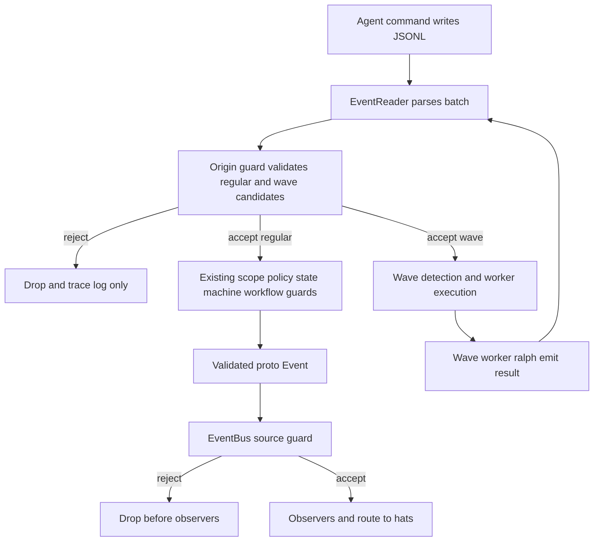
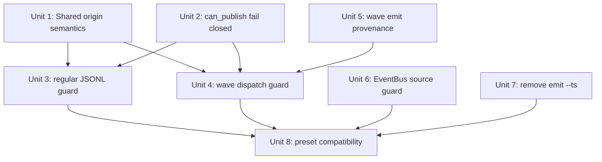
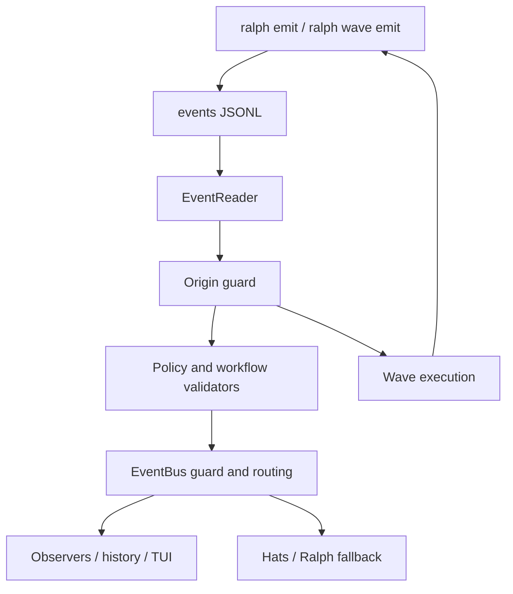

# fix: Harden Event Origin Guard

## Overview

This plan hardens Ralph's event ingestion path so LLM-generated fake events cannot
silently enter the orchestration loop as trusted business events.

The previous draft correctly identified the target failure class but missed two
important realities in the current codebase:

- `ce-executor` already has `event_loop.enforce_hat_scope: true`; the issue is
  not simply that ce-executor bypasses scope enforcement.
- Wave dispatch events are split out before `process_parse_result()`, so a guard
  inserted only inside `process_parse_result()` does not protect `ralph wave emit`.

The intended fix is a layered guard:

- `ralph emit` and `ralph wave emit` should stamp current runtime provenance.
- The JSONL ingestion path should reject ordinary business events without a valid
  hat provenance when hats are configured.
- Registered hats should only be able to publish topics declared in their
  `publishes` list, except for a small system/control topic allowlist.
- The EventBus should reject events whose `source` is set to an unregistered bus
  hat before observers see the event.
- `ralph emit --ts` should be removed so LLMs cannot forge event timestamps.

This remains a mechanism-level guard. Presets should not need to add fake safety
boilerplate to every hat just to preserve normal operation.

## Problem Frame

The origin document reports ce-executor runs where roughly half of the observed
events were LLM demo/fake events: unregistered hat names such as `strategist` or
`ralph`, topics outside the configured event chain such as `debug.step` or
`build.done`, premature `LOOP_COMPLETE` payloads, and historical timestamps such
as `2024-01-01T00:00:00Z` (see origin:
`docs/brainstorms/2026-05-31-event-origin-guard-requirements.md`).

Ralph currently has several partial guards, but they do not form a complete
trust boundary:

- `HatRegistry::can_publish()` currently returns `true` for unknown hats.
- `process_parse_result()` enforces active-hat publish scope in isolated mode and
  in coordinator mode when `enforce_hat_scope` is enabled, but it does not verify
  that the event's declared `hat` is a registered publisher.
- `process_events_from_jsonl_with_waves()` partitions wave dispatch events before
  delegating regular events to `process_parse_result()`.
- `ralph wave emit` writes wave metadata but does not write `hat` provenance.
- `ralph emit --ts` lets an agent choose a timestamp.
- EventBus observers currently see events before any proposed EventBus source
  rejection would run.

The correct boundary is: once a line is read from JSONL, Ralph should treat it as
untrusted agent output until provenance and scope checks accept it.

## Requirements Trace

- R1. EventBus must reject events with a set `source` that does not correspond
  to a registered EventBus hat before routing or observer notification.
- R2. System events with no source must remain allowed, including internal
  events such as `loop.terminate` and `event.malformed`.
- R3. Rejected origin events must not publish additional diagnostic events to the
  bus, because rejection diagnostics can themselves route unexpectedly.
- R4. JSONL ingestion must run publish-scope validation for all execution modes,
  including coordinator mode and wave dispatch.
- R5. JSONL validation must use the event's `hat` field as the declared publishing
  hat, because `event_reader::Event` maps `hat` to `ralph_proto::Event.source`.
- R6. `HatRegistry::can_publish()` must reject unknown hats.
- R7. `ralph emit` must remove `--ts` and always generate timestamps internally.
- R8. Existing internal timestamp producers such as `ralph wave emit` and session
  recording must continue to generate current timestamps without accepting an
  agent-supplied timestamp.
- R9. Ordinary business topics in hat-based runs must not pass when the JSONL
  event lacks `hat` provenance.
- R10. System/control topics that are intentionally outside hat `publishes` must
  continue to work without requiring every preset to list them. The JSONL
  control allowlist should be narrower than the direct EventBus system-event
  allowance.
- R11. ce-executor's main chain and wave review path must continue to work:
  `coordinator -> executor -> review-coordinator -> dimension-reviewer ->
  review-synthesizer -> shipper/fixer -> reporter`.
- R12. Public builtin presets must remain parseable and their normal publish
  chains must remain compatible with the new guard.

## Scope Boundaries

- Do not add event rate limits, payload content validation, or abuse heuristics.
  Existing EventPolicy and state-machine features remain responsible for payload
  and lifecycle semantics.
- Do not retroactively clean existing event files.
- Do not require preset authors to add `human.interact`, `loop.cancel`, or
  diagnostic `event.*` topics to every hat's `publishes`.
- Do not remove Ralph's EventBus fallback hat. Ralph remains registered as a
  catch-all receiver for routing orphaned events, but JSONL business events
  should not gain blanket publish rights by claiming `hat = "ralph"`.
- Do not change the public event JSONL schema except that CLI-generated events
  should now reliably include provenance when runtime context is available.
- Do not introduce backwards-compatibility shims for `--ts`; backwards
  compatibility is not required for this repository.

### Deferred to Separate Tasks

- Configurable user-defined system topic allowlists: defer until a real preset
  needs non-standard control topics.
- Metrics for rejected events: defer until there is a concrete observability
  requirement. This plan can log rejections, but it should not publish rejection
  events onto the EventBus.
- Payload schema hardening for fake `LOOP_COMPLETE` payload contents: defer to
  EventPolicy/state-machine work.

## Context & Research

### Relevant Code and Patterns

- `crates/ralph-core/src/event_loop/mod.rs`
  - `process_parse_result()` is the central regular event validation pipeline.
  - `process_events_from_jsonl_with_waves()` currently partitions wave dispatch
    events before regular validation.
  - Isolated mode already has a local system/control event allowlist.
  - Completion and cancellation are handled after parsing, before bus publish.
- `crates/ralph-core/src/event_reader.rs`
  - JSONL `hat` is converted to `ralph_proto::Event.source`.
  - JSONL `source` is parsed for display/provenance metadata but is not the
    EventBus `source`.
- `crates/ralph-core/src/hat_registry.rs`
  - `can_publish()` currently allows unknown hats and has direct unit tests for
    declared, undeclared, wildcard, and unknown publisher behavior.
- `crates/ralph-cli/src/main.rs`
  - `ralph emit` already resolves `hat` from CLI flags or `RALPH_CURRENT_HAT`.
  - `EmitArgs` still exposes `ts`, and many tests construct `EmitArgs { ts: ... }`.
- `crates/ralph-cli/src/wave.rs`
  - `write_wave_events()` generates current timestamps and wave metadata, but
    does not write `hat`, `triggered`, or `source`.
- `crates/ralph-cli/src/loop_runner.rs`
  - The runner injects `RALPH_CURRENT_HAT`, `RALPH_TRIGGERED_HAT`, and
    `RALPH_EVENTS_FILE` into backend execution environments.
  - Wave workers also receive wave-specific environment variables.
- `crates/ralph-proto/src/event_bus.rs`
  - `publish()` currently notifies observers before routing.
  - EventBus registers configured hats and also registers `ralph` as fallback in
    `EventLoop`.
- `scripts/ralph-zsh-plugin.zsh`
  - `--ts` appears in zsh completion and must be removed when the CLI flag is
    removed.
- `presets/ce-executor.yml` and `crates/ralph-cli/presets/ce-executor.yml`
  - ce-executor uses `enforce_hat_scope: true`.
  - ce-executor's review wave depends on `review.wave.ready` triggering a
    concurrent `dimension-reviewer`.

### Institutional Learnings

- `docs/solutions/developer-experience/ralph-zsh-builtin-hat-completion-maintenance-2026-05-26.md`
  - CLI/preset-facing behavior changes can require `scripts/ralph-zsh-plugin.zsh`
    updates and installation into the user's oh-my-zsh plugin copy.
  - For this plan, removing `--ts` requires zsh completion cleanup even though
    builtin hat values are not changing.
- `docs/solutions/tooling-decisions/ralph-preset-embedded-compilation-2026-05-26.md`
  - Preset files have canonical and embedded mirror copies. If this plan ends up
    changing preset YAML, the mirror under `crates/ralph-cli/presets/` must be
    synchronized. The preferred approach is to avoid preset YAML changes unless
    implementation discovers a real compatibility issue.

### External References

- External research skipped. This is local Rust CLI/orchestration behavior with
  direct codebase patterns and tests. No external library or standard changes are
  needed to plan the work.

## Key Technical Decisions

| Decision | Rationale |
|---|---|
| Validate JSONL before treating events as trusted | JSONL is agent-controlled output and must be considered untrusted until accepted. |
| Require `hat` for ordinary business topics when hats are configured | Allowing no-hat business events would preserve the current fake-event bypass. |
| Keep a mechanism-level system/control topic allowlist | `human.interact`, `human.guidance`, `task.resume`, and cancellation are orchestration controls, not preset business topics. Requiring every preset to publish them would create noisy, fragile config. Internal diagnostics remain valid when Ralph publishes them directly, but agent-authored JSONL should not get a broad `event.*` bypass. |
| Validate wave dispatch events before returning them to the loop runner | Wave events bypass `process_parse_result()`, so regular-only validation leaves a gap. |
| Stamp `ralph wave emit` with provenance from the runtime environment | Once business events require provenance, wave dispatch must carry the emitting hat just like regular `ralph emit`. |
| Change `can_publish()` unknown-hat behavior to fail closed | Unknown hats should never have unrestricted publish rights. This directly addresses the origin requirement. |
| Move EventBus source validation before observer notification | Rejected events should not pollute recorder/TUI/observer state if the EventBus rejects them. |
| Do not depend on EventBus to enforce `publishes` scope | `ralph-proto` does not know `HatConfig.publishes`; semantic publish-scope belongs in `ralph-core`. |
| Remove `--ts` without compatibility alias | The user explicitly accepts no backwards-compatibility clutter, and timestamp control is part of the vulnerability. |

## Open Questions

### Resolved During Planning

- Should source validation be only in EventBus or also in JSONL ingestion?
  - Resolution: both. EventBus can reject impossible source hats at the routing
    layer. JSONL ingestion can enforce hat publish scope and no-hat business
    rejection using `HatRegistry`.
- Should no-hat events be allowed?
  - Resolution: only for explicitly recognized system/control topics or when no
    hats are configured. No-hat business topics must be rejected in hat-based runs.
- Do ce-executor preset definitions need publish-topic changes?
  - Resolution: not as planned. ce-executor's normal business chain already has
    the relevant publishes. The required adaptation is in `ralph wave emit`
    provenance and shared validation, not preset YAML.
- Should `ralph` be treated as a configured publisher?
  - Resolution: no for hat-based JSONL business events. Ralph remains an
    EventBus fallback receiver, but `hat = "ralph"` must not grant unrestricted
    publishing in a configured hat workflow. Solo/hatless mode remains exempt
    because the registry is empty.
- Should rejected events publish diagnostics?
  - Resolution: no bus diagnostics for origin rejection. Log with tracing where
    useful, but do not append new EventBus events from the rejection itself.

### Deferred to Implementation

- Exact helper placement inside `event_loop/mod.rs` versus a new
  `crates/ralph-core/src/event_origin.rs`.
  - Prefer a small helper module if implementation finds the predicate reused by
    both regular and wave paths; keep local helpers if the change stays compact.
- Exact name and shape of the allowlist predicate.
  - The plan defines semantics; implementation can choose clear local names.
- Whether EventBus rejection should use `debug!` or no logging.
  - `ralph-proto` currently does not depend on `tracing`. Implementation should
    either add `tracing.workspace = true` intentionally or avoid logging there.

## Behavior Matrix

This table is authoritative for the intended validation behavior.

| Event kind | Example | `hat` value | Hats configured? | Expected result |
|---|---|---:|---:|---|
| Valid business event | `work.done` from `executor` | registered hat | yes | Accept if `executor.publishes` matches `work.done`. |
| Unknown-hat business event | `experiment.planned` from `strategist` in ce-executor | unknown hat | yes | Reject before bus publish. |
| No-hat business event | `debug.step` with no `hat` | none | yes | Reject before bus publish. |
| Out-of-scope business event | `build.done` from `review-coordinator` | registered hat | yes | Reject before bus publish. |
| Valid wave dispatch | `review.wave.ready` from `review-coordinator` | registered hat | yes | Accept as wave event if topic targets concurrent hat. |
| Forged wave dispatch | `review.wave.ready` from `strategist` | unknown hat | yes | Reject before wave execution. |
| Valid wave result | `review.dimension.done` from `dimension-reviewer` | registered hat | yes | Accept through regular path and route to aggregator. |
| Human interaction | `human.interact` from active hat | registered hat or none | yes | Accept as control event. |
| Cancellation | `loop.cancel` | registered hat or none | yes | Accept only according to existing cancellation behavior. |
| Internal system diagnostic | `event.malformed` created by Ralph code | none | yes | Accept when published directly by Ralph internals, not because an agent wrote it as JSONL. |
| Solo mode event | `LOOP_COMPLETE` in hatless-baseline | none or `ralph` | no | Preserve existing solo behavior. |
| Unknown EventBus source | direct `Event` with `source = ghost` | unknown bus hat | any | Reject before observers and routing. |

## High-Level Technical Design

> *This illustrates the intended approach and is directional guidance for review,
> not implementation specification. The implementing agent should treat it as
> context, not code to reproduce.*



The essential design rule is that `EventReader` output is not trusted. The
origin guard should run before regular events reach business validation and
before wave dispatch events trigger workers.

## Implementation Units

- [ ] **Unit 1: Define Shared JSONL Origin Guard Semantics**

**Goal:** Establish a single validation predicate for agent-authored JSONL events
that can be used by both regular events and wave dispatch events.

**Requirements:** R3, R4, R5, R9, R10, R11

**Dependencies:** None

**Files:**
- Modify: `crates/ralph-core/src/event_loop/mod.rs`
- Optional create: `crates/ralph-core/src/event_origin.rs`
- Optional modify: `crates/ralph-core/src/lib.rs`
- Test: `crates/ralph-core/src/event_loop/tests.rs`

**Approach:**
- Define one helper-level concept: "is this JSONL event allowed to enter the
  trusted orchestration pipeline?"
- Inputs should include:
  - the parsed `event_reader::Event`
  - the `HatRegistry`
  - whether hats are configured
  - the configured cancellation topic
  - enough mode/context to preserve existing isolated/coordinator behavior
- Treat registry-empty solo mode as permissive for business events, preserving
  hatless-baseline behavior.
- For hat-based runs:
  - Accept no-hat events only when they are recognized system/control topics.
  - For events with `hat`, reject unknown hats except where the topic is a
    system-generated no-source event path.
  - For registered hats publishing business topics, require
    `registry.can_publish(hat, topic)`.
  - Allow registered hats to emit accepted control topics even if the topic is
    not listed in `publishes`.
- Use a conservative JSONL control allowlist based on events agents or loop
  helpers currently write through the event file:
  - `human.interact`, because agents use it to ask a blocking human question
  - `human.guidance`, because hard-gate guidance is currently injected into the
    event file by loop code
  - `task.resume`, where existing recovery tests or loop continuation paths rely
    on JSONL delivery
  - configured cancellation topic when non-empty, commonly `loop.cancel`
  - existing isolated-mode special case `build.task.abandoned`
- Do not broadly allow `event.*` from JSONL. Internal diagnostics such as
  `event.malformed`, `event.state_machine.rejected`, and workflow guard
  diagnostics are created by Ralph code and published directly to the bus; they
  should not need to pass as trusted agent-authored JSONL events.
- Do not publish rejection events. A tracing `warn!` is acceptable in
  `ralph-core`, because the crate already uses tracing.
- Keep the helper small and deterministic. It should not inspect payloads.

**Execution note:** Add characterization tests around current control-event
behavior before tightening business-event rejection.

**Technical design:**

> Directional guidance only. Names and exact signatures are implementation
> details.

```text
if registry is empty:
  accept

if topic is system/control:
  accept if hat is absent or hat is registered
  reject if hat is present and unknown

if hat is absent:
  reject

if hat is unknown:
  reject

accept only if registry.can_publish(hat, topic)
```

**Patterns to follow:**
- The current isolated-mode system event allowlist in
  `crates/ralph-core/src/event_loop/mod.rs`.
- Existing `apply_event_policy_validation()` style: return accepted events and
  keep side effects contained.
- Existing `HatRegistry::can_publish()` topic matching tests in
  `crates/ralph-core/src/hat_registry.rs`.

**Test scenarios:**
- Happy path: with a registry containing `executor` that publishes `work.done`,
  a JSONL event `{topic: "work.done", hat: "executor"}` is accepted.
- Error path: with ce-executor-like hats, `{topic: "debug.step", hat:
  "strategist"}` is rejected because `strategist` is unknown.
- Error path: with hats configured, `{topic: "debug.step"}` with no `hat` is
  rejected as an ordinary business event.
- Error path: with `review-coordinator` registered but not publishing
  `build.done`, `{topic: "build.done", hat: "review-coordinator"}` is rejected.
- Happy path: `{topic: "human.interact"}` with no `hat` is accepted to preserve
  existing human-interaction tests.
- Happy path: `{topic: "human.guidance"}` with no `hat` is accepted to preserve
  hard-gate guidance injection.
- Happy path: `{topic: "human.interact", hat: "executor"}` is accepted even if
  `executor.publishes` does not list `human.interact`.
- Error path: `{topic: "human.interact", hat: "strategist"}` is rejected because
  the source hat is unknown.
- Happy path: configured cancellation topic `loop.cancel` is accepted without
  requiring every hat to publish it.
- Happy path: registry-empty solo mode still accepts `LOOP_COMPLETE` without a
  configured hat.

**Verification:**
- The origin guard can be invoked for regular and wave event batches.
- No new EventBus diagnostic events are produced for rejected origin events.
- Control events that existing tests rely on still work.

- [ ] **Unit 2: Make `HatRegistry::can_publish()` Fail Closed for Unknown Hats**

**Goal:** Remove the unknown-hat wildcard behavior that lets unregistered hat
names publish arbitrary topics.

**Requirements:** R5, R6

**Dependencies:** Unit 1 can be designed independently, but final validation
semantics depend on this behavior.

**Files:**
- Modify: `crates/ralph-core/src/hat_registry.rs`
- Test: `crates/ralph-core/src/hat_registry.rs`

**Approach:**
- Change unknown-hat behavior from allow-all to reject-all.
- Update method documentation so it no longer says unregistered hats can publish
  anything.
- Rename or rewrite `test_can_publish_unknown_hat_allows_all` to assert rejection.
- Keep wildcard publish behavior unchanged for registered hats whose
  `publishes` includes a wildcard pattern.

**Patterns to follow:**
- Existing `test_can_publish_allows_declared_topic`.
- Existing `test_can_publish_rejects_undeclared_topic`.
- Existing `test_can_publish_allows_wildcard`.

**Test scenarios:**
- Happy path: registered hat with `publishes: ["build.*"]` can publish
  `build.done`.
- Error path: registered hat with `publishes: ["build.*"]` cannot publish
  `plan.approved`.
- Error path: unknown hat `strategist` cannot publish `experiment.planned`.
- Error path: unknown hat `ralph` cannot publish `LOOP_COMPLETE` when checked
  through `HatRegistry`.

**Verification:**
- Existing registered-hat publish tests still pass.
- Unknown hats no longer produce `true` from `can_publish()`.

- [ ] **Unit 3: Apply Origin Guard to Regular JSONL Events**

**Goal:** Ensure regular events read from JSONL are provenance-checked before
EventPolicy, state-machine validation, workflow guards, completion handling, and
bus publication.

**Requirements:** R3, R4, R5, R9, R10, R11

**Dependencies:** Unit 1, Unit 2

**Files:**
- Modify: `crates/ralph-core/src/event_loop/mod.rs`
- Test: `crates/ralph-core/src/event_loop/tests.rs`

**Approach:**
- Insert the origin guard after existing isolated/coordinator active-hat scope
  enforcement and before EventPolicy validation.
- Preserve existing active-hat scope enforcement, because it catches a different
  condition: whether the current active hat could publish the topic even when
  the JSONL event has no or incorrect provenance.
- Make the new guard stricter about provenance:
  - A registered active hat is not enough if the JSONL event claims a different
    unknown publisher.
  - A no-hat business event is not enough in hat-based runs.
- Keep current completion/cancellation behavior for accepted events.
- Ensure rejected events do not count as `had_events`, do not update
  `accepted_events`, and do not affect `seen_topics`.
- Keep rejection logging concise. Include topic and declared hat when available.

**Patterns to follow:**
- Existing scope violation handling in `process_parse_result()`.
- Existing `accepted_log_events` accumulation in `process_parse_result()`.
- Existing tests around default_publishes and `had_events` behavior.

**Test scenarios:**
- Happy path: active `builder` with `{topic: "build.done", hat: "builder"}` is
  accepted and published.
- Error path: active `builder` with `{topic: "plan.approved", hat: "builder"}`
  is rejected by publish scope.
- Error path: active `builder` with `{topic: "build.done", hat: "ghost"}` is
  rejected by origin guard.
- Error path: active `builder` with `{topic: "build.done"}` and no `hat` is
  rejected in a hat-based registry.
- Error path: a rejected `review.passed` does not satisfy `required_events`.
- Happy path: no-hat `human.interact` still produces human interaction context.
- Happy path: no-hat `loop.cancel` still triggers cancellation when
  `cancellation_promise` is configured.
- Happy path: no-hat `task.resume` still routes to Ralph fallback.
- Error path: no-hat JSONL `event.malformed` is rejected unless implementation
  finds an existing internal JSONL writer that truly depends on it.
- Regression: rejected fake events do not cause default_publishes to be injected
  as if no agent attempted an event, unless existing caller logic already treats
  rejection that way intentionally. If the current caller distinguishes "wrote
  invalid event" from "wrote no event", preserve that distinction.

**Verification:**
- Regular fake/demo events are dropped before bus publication.
- Existing human interaction, cancellation, completion, and default publish tests
  still pass or are updated only where their expectations intentionally change.

- [ ] **Unit 4: Apply Origin Guard to Wave Dispatch Events**

**Goal:** Close the wave bypass by validating wave dispatch candidates before the
loop runner starts wave workers.

**Requirements:** R4, R5, R9, R10, R11

**Dependencies:** Unit 1, Unit 2, Unit 3

**Files:**
- Modify: `crates/ralph-core/src/event_loop/mod.rs`
- Test: `crates/ralph-core/src/event_loop/tests.rs`
- Test: `crates/ralph-core/src/wave_detection.rs`

**Approach:**
- In `process_events_from_jsonl_with_waves()`, apply the origin guard before
  returning `wave_events`.
- The safest shape is:
  - read batch
  - classify candidate wave dispatch events versus regular events
  - validate both groups with the same origin semantics
  - pass accepted regular events into `process_parse_result()`
  - return accepted wave events
- Avoid duplicating policy validation logic. EventPolicy validation for wave
  events already exists in this method; origin validation should run before
  EventPolicy for wave candidates.
- Make sure wave result events are not confused with dispatch events:
  - dispatch event: has `wave_id` and targets a concurrent hat
  - result event: may have `wave_id` because the worker env auto-tags it, but
    should route as regular if it does not target a concurrent hat
- If implementation creates a shared helper, ensure both regular and wave paths
  call it in tests.

**Patterns to follow:**
- Existing partition logic in `process_events_from_jsonl_with_waves()`.
- Existing `detect_wave_events()` resolution through `registry.find_by_trigger()`
  and `registry.get_config()`.

**Test scenarios:**
- Happy path: `{topic: "review.wave.ready", hat: "review-coordinator",
  wave_id: "...", wave_index: 0, wave_total: 1}` is returned as a wave event
  when `review.wave.ready` triggers a concurrent hat and `review-coordinator`
  publishes that topic.
- Error path: same wave event with `hat: "strategist"` is rejected and no wave
  workers are returned.
- Error path: same wave event with no `hat` is rejected in a hat-based registry.
- Error path: same wave event with registered `executor` is rejected if
  `executor.publishes` does not include `review.wave.ready`.
- Happy path: wave worker result `{topic: "review.dimension.done", hat:
  "dimension-reviewer", wave_id: "..."}` is processed as a regular event and
  can trigger `review-synthesizer`.
- Integration: ce-executor-like wave chain still reaches
  `review.dimension.done` and then aggregator routing.

**Verification:**
- No wave dispatch event can bypass origin validation.
- Valid ce-executor wave dispatch remains functional.

- [ ] **Unit 5: Add Provenance to `ralph wave emit`**

**Goal:** Make `ralph wave emit` produce the same origin metadata expectations as
regular `ralph emit`, so valid wave dispatch survives the stricter guard.

**Requirements:** R5, R8, R9, R11

**Dependencies:** Unit 1 semantics should be clear before this lands.

**Files:**
- Modify: `crates/ralph-cli/src/wave.rs`
- Test: `crates/ralph-cli/src/wave.rs`
- Related pattern: `crates/ralph-cli/src/main.rs`

**Approach:**
- Reuse the same precedence model as `ralph emit` where practical:
  - explicit CLI flags are not currently present for wave; do not add them unless
    implementation discovers a strong need
  - read `RALPH_CURRENT_HAT` for `hat`
  - read `RALPH_TRIGGERED_HAT` for `triggered` if useful and present
  - optionally read `RALPH_EVENT_SOURCE` for metadata `source`, matching
    regular `ralph emit`
- Keep timestamp generation internal with `chrono::Utc::now()`.
- Consider a small local helper in `wave.rs` rather than importing private CLI
  internals from `main.rs`.
- Do not make wave emit fail outside a Ralph runtime if no env is present. It can
  still write no-hat wave events for manual use, but those events will be
  rejected by origin validation when hats are configured. Tests should cover both
  env-present and env-absent serialization.
- Preserve atomic append behavior and parent directory creation.

**Patterns to follow:**
- `resolve_provenance()` in `crates/ralph-cli/src/main.rs`.
- Existing `write_wave_events()` tests.
- Loop runner env injection in `crates/ralph-cli/src/loop_runner.rs`.

**Test scenarios:**
- Happy path: with `RALPH_CURRENT_HAT=review-coordinator`,
  `write_wave_events()` or its replacement writes `"hat":"review-coordinator"` on
  each wave event.
- Happy path: with `RALPH_TRIGGERED_HAT=dimension-reviewer`, wave events include
  the expected triggered metadata if the implementation chooses to preserve it.
- Edge case: with empty env vars, no empty-string provenance fields are written.
- Edge case: all events in the same wave have the same timestamp, wave id, and
  provenance fields.
- Error path: empty payload list remains rejected.
- Regression: parent directories are still created.

**Verification:**
- ce-executor's `review-coordinator` can dispatch `review.wave.ready` under the
  stricter origin guard without preset YAML changes.

- [ ] **Unit 6: Harden EventBus Source Validation Before Observers**

**Goal:** Add a low-level EventBus guard that rejects impossible source hats
before observers and routing see the event.

**Requirements:** R1, R2, R3

**Dependencies:** None, but it should be integrated after Unit 1 semantics are
understood so the two layers do not conflict.

**Files:**
- Modify: `crates/ralph-proto/src/event_bus.rs`
- Optional modify: `crates/ralph-proto/Cargo.toml`
- Test: `crates/ralph-proto/src/event_bus.rs`

**Approach:**
- At the start of `publish()`, before observer notification, check whether
  `event.source` is set.
- If source is set and `self.hats` does not contain it, return an empty
  recipient list immediately.
- If source is absent, preserve current behavior.
- If source is registered, preserve current behavior.
- Do not add publish-topic scope checks here; EventBus has `Hat` subscriptions
  but not `HatConfig.publishes`.
- Decide logging carefully:
  - Option A: no log in `ralph-proto`, avoiding a new dependency.
  - Option B: add `tracing.workspace = true` to `crates/ralph-proto/Cargo.toml`
    and log at `debug!`.
  - Prefer Option A unless implementation needs traceability here.
- Keep human queue behavior unchanged for accepted `human.*` events.

**Patterns to follow:**
- Existing direct target and human event tests in `event_bus.rs`.
- Existing observer tests, especially multiple observers and clearing observers.

**Test scenarios:**
- Error path: event with `source = ghost` returns no recipients.
- Error path: observer is not called for event with `source = ghost`.
- Happy path: event with no source routes normally.
- Happy path: event with source equal to a registered hat routes normally.
- Happy path: no-source `human.interact` still goes to `human_pending`.
- Happy path: registered-source `human.interact` still goes to `human_pending`.
- Regression: direct target behavior still routes only to the target when source
  is valid or absent.
- Regression: self-routing remains allowed for registered source hats.

**Verification:**
- EventBus cannot route or observe events from impossible source hats.
- Existing EventBus routing semantics remain intact for valid/no-source events.

- [ ] **Unit 7: Remove `ralph emit --ts` and Clean CLI Surface**

**Goal:** Prevent agents from choosing event timestamps and remove stale CLI
surface area.

**Requirements:** R7, R8

**Dependencies:** None, but land after origin tests if a smaller review sequence
is preferred.

**Files:**
- Modify: `crates/ralph-cli/src/main.rs`
- Modify: `scripts/ralph-zsh-plugin.zsh`
- Test: `crates/ralph-cli/src/main.rs`

**Approach:**
- Remove `EmitArgs.ts`.
- Change `emit_command_with_root()` to always use `chrono::Utc::now().to_rfc3339()`.
- Update all tests that construct `EmitArgs` to remove `ts`.
- Replace tests that asserted custom timestamp behavior with tests that assert:
  - a timestamp field exists
  - it parses as an RFC3339 timestamp if existing test helpers support that
  - it is not a user-supplied historical value
- Remove `--ts` from `scripts/ralph-zsh-plugin.zsh`.
- Add or update a CLI parse test proving `ralph emit ... --ts ...` is rejected.
- Do not change `write_wave_events()` timestamp generation; it already uses
  current time internally.

**Patterns to follow:**
- Existing emit command tests in `crates/ralph-cli/src/main.rs`.
- Existing zsh completion maintenance guidance in
  `docs/solutions/developer-experience/ralph-zsh-builtin-hat-completion-maintenance-2026-05-26.md`.

**Test scenarios:**
- Happy path: `ralph emit build.done ok` writes a JSONL record with a generated
  `ts` field.
- Error path: CLI parsing rejects `ralph emit build.done ok --ts
  2024-01-01T00:00:00Z`.
- Regression: `--json`, `--file`, `--policy-check`, `--hat`, `--triggered`, and
  `--source` still parse and serialize correctly.
- Regression: urgent steer blocking still works.
- Regression: marker-based events file resolution still works from nested
  directories.
- Regression: strict provenance policy still rejects missing hat.

**Verification:**
- No code references `args.ts` or `EmitArgs { ts: ... }`.
- zsh completion no longer advertises `--ts`.

- [ ] **Unit 8: Verify Builtin Preset Compatibility and Mirror Hygiene**

**Goal:** Prove the stricter guard does not break public builtin presets and does
not leave embedded preset mirrors or completion artifacts stale.

**Requirements:** R11, R12

**Dependencies:** Units 1 through 7

**Files:**
- Modify if needed: `presets/*.yml`
- Modify if needed: `crates/ralph-cli/presets/*.yml`
- Modify if needed: `scripts/sync-embedded-files.sh`
- Test: `crates/ralph-cli/src/presets.rs`
- Test: `crates/ralph-e2e/src/`
- Test: `crates/ralph-core/tests/fixtures/`

**Approach:**
- First avoid preset YAML changes. The design should protect valid presets by
  fixing provenance at the command/runtime layer rather than forcing every hat
  config to list control topics.
- Add compatibility tests for the builtin public presets:
  - parse all embedded presets
  - assert every `default_publishes` topic is also accepted by the origin guard
    for that hat or is the configured completion/control path
  - assert every required completion promise has at least one declared publisher
    or valid default publish path, preserving existing preset tests
- Add focused ce-executor compatibility coverage:
  - `review-coordinator` can publish `review.wave.ready`
  - `dimension-reviewer` can publish `review.dimension.done`
  - `review-synthesizer` can publish `review.complete`, `review.passed`, and
    `review.failed`
  - `reporter` can publish `LOOP_COMPLETE`
- If implementation discovers an actual preset defect, change both canonical
  `presets/` and mirrored `crates/ralph-cli/presets/` files using the existing
  sync script.
- Run or specify validation for the zsh script after removing `--ts`.
- Keep `scripts/ralph-zsh-plugin.zsh` installation in the implementation
  checklist because AGENTS.md requires current-user installation when this
  script changes.

**Patterns to follow:**
- Existing public preset tests in `crates/ralph-cli/src/presets.rs`.
- Preset mirror guidance in
  `docs/solutions/tooling-decisions/ralph-preset-embedded-compilation-2026-05-26.md`.
- Zsh completion guidance in
  `docs/solutions/developer-experience/ralph-zsh-builtin-hat-completion-maintenance-2026-05-26.md`.

**Test scenarios:**
- Happy path: all public embedded presets parse after the change.
- Happy path: ce-executor's normal publish chain is accepted by origin guard
  predicate tests.
- Happy path: ce-executor wave dispatch and wave result topics are accepted only
  from their declaring hats.
- Error path: ce-executor rejects `strategist`, `ralph`, and no-hat business
  topics such as `debug.step` and `build.done` when not declared for the source
  hat.
- Regression: `scripts/ralph-zsh-plugin.zsh` has no `--ts` completion entry.
- Regression: if preset YAML changed, canonical and embedded mirror files are in
  sync.

**Verification:**
- Builtin presets remain usable without broad publish-topic boilerplate.
- ce-executor's wave review path remains available under the stricter guard.
- Completion script reflects the new CLI.

## Implementation Dependency Graph



## System-Wide Impact

- **Interaction graph:** Agent commands write JSONL; EventReader parses it;
  origin guard accepts or drops; regular events continue through policy,
  state-machine, workflow guard, completion, and bus publish; wave dispatch
  events go to wave execution; wave worker results return through JSONL.
- **Error propagation:** Origin rejection is a silent event drop with optional
  tracing logs. It must not publish `event.rejected` or `scope_violation` events
  because those can themselves alter routing.
- **State lifecycle risks:** Rejected events must not update `seen_topics`,
  `completion_requested`, `cancellation_requested`, or accepted event logs.
- **API surface parity:** Regular emit and wave emit must both stamp provenance
  when runtime env is present. CLI completion must match the actual CLI after
  `--ts` removal.
- **Integration coverage:** Unit tests alone must be supplemented with at least
  one ce-executor-style integration/smoke path covering wave dispatch and result
  routing.
- **Unchanged invariants:**
  - Ralph remains the EventBus fallback receiver.
  - No-source direct system events published by Ralph internals remain valid.
  - Hatless/solo mode remains permissive enough to run without configured hats.
  - EventPolicy remains responsible for payload schema validation.
  - State-machine/workflow guards remain responsible for lifecycle ordering.



## Risks & Dependencies

| Risk | Likelihood | Impact | Mitigation |
|---|---:|---:|---|
| Overly strict no-hat rejection breaks existing control events | Medium | High | Use explicit system/control allowlist and add regression tests for `human.interact`, `task.resume`, and cancellation. |
| Wave events still bypass validation | Medium | High | Validate wave candidates inside `process_events_from_jsonl_with_waves()` before returning them. Add fake wave rejection tests. |
| `ralph wave emit` valid events are rejected because they lack `hat` | High | High | Add provenance stamping to `wave.rs` from `RALPH_CURRENT_HAT`. |
| EventBus observers still see rejected events | Medium | Medium | Place EventBus source validation before observer notification. Add observer-not-called test. |
| `ralph-proto` logging introduces dependency churn | Low | Low | Prefer no logging in proto layer unless tracing is intentionally added. |
| `hat = "ralph"` legitimate solo events get rejected | Medium | Medium | Skip strict JSONL business provenance enforcement when registry is empty. Add solo-mode regression test. |
| Completion and tests still mention `--ts` | High | Medium | Search for `--ts`, `.ts`, and `EmitArgs { ts:`; update zsh completion and tests in same unit. |
| Preset mirror drift if YAML changes | Low | Medium | Avoid preset YAML changes; if needed, run sync and test embedded preset parsing. |

## Test Strategy

The implementation should add focused tests at the layer where each behavior is
owned, then run repository-level verification before completion.

### Unit and Integration Coverage

- `crates/ralph-core/src/hat_registry.rs`
  - unknown hats rejected by `can_publish()`
  - registered wildcard publishes still work
- `crates/ralph-core/src/event_loop/tests.rs`
  - valid registered-hat business events accepted
  - unknown hat business events rejected
  - no-hat business events rejected in hat-based mode
  - no-hat control/system events accepted
  - fake completion does not satisfy required events
  - cancellation and human interaction regressions
  - wave dispatch validation and wave result routing
- `crates/ralph-cli/src/wave.rs`
  - wave events include provenance from environment
  - wave metadata remains stable and atomic
- `crates/ralph-cli/src/main.rs`
  - `--ts` removed from CLI parsing
  - generated timestamps still exist
  - provenance flags and env fallback still work
- `crates/ralph-proto/src/event_bus.rs`
  - unknown source rejected before observers
  - no-source and registered-source events route normally
- `crates/ralph-cli/src/presets.rs`
  - public presets parse
  - ce-executor chain compatibility

### Regression Commands for Implementer

The implementer should run the repository's required verification, including:

- Core tests for event loop, registry, wave, and policy behavior.
- CLI tests with single-thread execution where needed.
- Replay-based smoke tests rather than live API tests.
- Mock e2e coverage for orchestration-level compatibility.
- zsh syntax validation for `scripts/ralph-zsh-plugin.zsh` after removing
  `--ts`.

The project guidance requires `cargo test` before declaring the task done, and
smoke tests after code changes.

## Documentation / Operational Notes

- Update inline comments and method docs that still describe unknown hats as
  unrestricted publishers.
- Update any user-facing help snapshots or completion docs that mention
  `ralph emit --ts`.
- If `scripts/ralph-zsh-plugin.zsh` changes, install it for the current user as
  required by `AGENTS.md` and verify zsh completion loads.
- If preset YAML changes are needed, synchronize canonical and embedded preset
  files with `scripts/sync-embedded-files.sh`.
- Do not add a migration or cleanup command for old event files.

## Success Metrics

- ce-executor event files from new runs no longer contain accepted business
  events from unregistered hats such as `strategist`.
- ce-executor no longer accepts chain-outside business topics such as
  `debug.step` or wrong-source `build.done`.
- Valid ce-executor wave review still dispatches dimension reviewers and routes
  their `review.dimension.done` results to synthesis.
- `ralph emit --ts` is not accepted by the CLI or advertised by zsh completion.
- System/control flows still work: `human.interact`, `task.resume`, configured
  cancellation, and internal diagnostics.
- Hatless baseline remains functional.

## Alternative Approaches Considered

- **Only change `HatRegistry::can_publish()`**
  - Rejected because no-hat events and wave dispatch bypasses would remain.
- **Only add EventBus source validation**
  - Rejected because EventBus cannot enforce `publishes`, and observers would
    still see events unless validation moved before observers.
- **Require every preset to publish control topics**
  - Rejected because it spreads orchestration mechanics into preset business
    definitions and increases regression risk.
- **Allow all no-hat events for backwards compatibility**
  - Rejected because no-hat business events are one of the primary fake-event
    bypasses.
- **Treat `ralph` as a universal JSONL publisher**
  - Rejected because the observed fake events include `ralph`, and granting it
    unrestricted JSONL publish rights recreates the vulnerability.

## Sources & References

- **Origin document:** `docs/brainstorms/2026-05-31-event-origin-guard-requirements.md`
- Superseded draft: `docs/plans/2026-05-31-event-origin-guard-plan.md`
- Event loop: `crates/ralph-core/src/event_loop/mod.rs`
- Event reader provenance mapping: `crates/ralph-core/src/event_reader.rs`
- Hat registry: `crates/ralph-core/src/hat_registry.rs`
- EventBus: `crates/ralph-proto/src/event_bus.rs`
- Regular emit CLI: `crates/ralph-cli/src/main.rs`
- Wave emit CLI: `crates/ralph-cli/src/wave.rs`
- Loop runner env injection: `crates/ralph-cli/src/loop_runner.rs`
- ce-executor preset: `presets/ce-executor.yml`
- Embedded ce-executor preset mirror: `crates/ralph-cli/presets/ce-executor.yml`
- zsh completion: `scripts/ralph-zsh-plugin.zsh`
- Zsh completion learning:
  `docs/solutions/developer-experience/ralph-zsh-builtin-hat-completion-maintenance-2026-05-26.md`
- Preset mirror learning:
  `docs/solutions/tooling-decisions/ralph-preset-embedded-compilation-2026-05-26.md`
