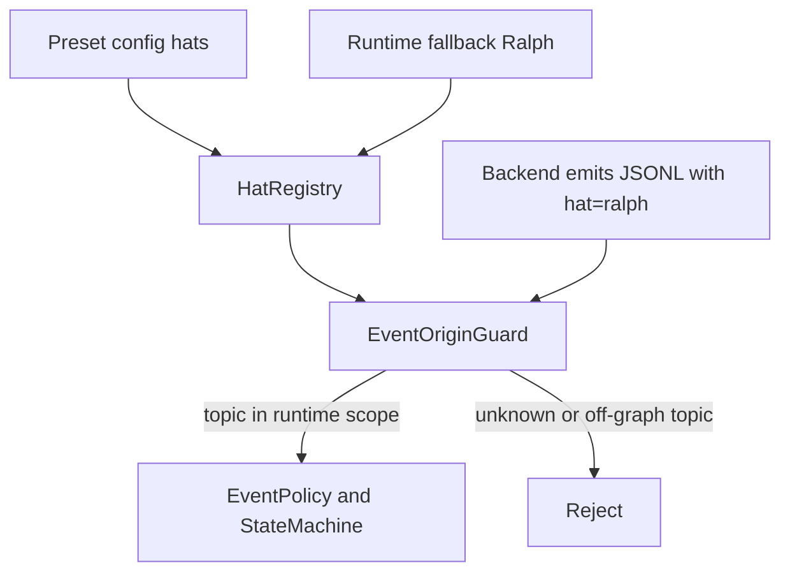

# 修复 Ralph fallback 事件来源契约

## 摘要

当前问题不是单纯的 `ce-executor` preset 配置遗漏，而是运行机制内部存在契约不一致：

- `EventLoop::new` 会把 fallback `ralph` 加进 `EventBus`，所以运行时认为它可以接活。
- `HatRegistry::from_config` 只登记 preset YAML 里的 hats，没有把 fallback `ralph` 登记为合法事件来源。
- `EventOriginGuard` 用 `HatRegistry` 校验 JSONL 事件来源，因此 fallback `ralph` 通过 CLI 发出的 `work.start`、`LOOP_COMPLETE`、`loop.cancel` 会被判定为 unknown hat。

修复方向应放在运行机制层：把 fallback `ralph` 建模成一个内置运行时 hat，并给它一个由当前配置推导出的有限发布范围，而不是要求每个 preset 手工添加 `ralph` hat，也不是把 `hat=ralph` 放成无限通行证。

## 目标

- 让 fallback `ralph` 在运行时、路由层、来源校验层拥有一致身份。
- 保持 `enforce_hat_scope: true` 的安全边界：未知 hat 和脱离 preset 拓扑的 topic 仍然被拒绝。
- 让 `LOOP_COMPLETE` 与 `loop.cancel` 在合法条件下能进入事件流，避免“事件写进 JSONL 但永远不被 loop 消费”的假象。
- 用单元测试、集成测试和 preset 校验测试覆盖这类契约断裂，防止后续 preset 或机制改动重新引入问题。

## 非目标

- 不把 `ralph` 手工复制到所有 preset YAML。
- 不把 `ralph` 设计成可以发布任意 topic 的全局特权身份。
- 不放宽所有 unknown-hat 事件。
- 不重构整个 event bus、state machine 或 backend executor。
- 不解决所有历史 worktree 的业务实现质量问题；本计划只修复运行机制契约。

## 需求追踪

| 编号 | 需求 | 验收方式 |
| --- | --- | --- |
| R1 | fallback `ralph` 必须在 `HatRegistry` 和 `EventBus` 中一致存在 | 新增 registry/event loop 单元测试 |
| R2 | `hat=ralph` 只能发布当前 preset 拓扑内的有限 topic | origin guard 测试覆盖合法 topic 与 off-graph topic |
| R3 | `ce-executor` 不需要额外 YAML boilerplate 即可接受 fallback `work.start`、合法 completion、合法 cancellation | 使用 `ce-executor` 配置的回归测试 |
| R4 | `loop.cancel` 的默认运行契约必须明确，不能因为默认空字符串导致文档可用但运行时不可用 | config/default 与 cancellation 测试 |
| R5 | preset 拓扑校验必须能提前发现“fallback 需要发布但来源契约不允许”的配置问题 | `hats validate` 或共享 validator 测试 |
| R6 | open tasks 阻止 `LOOP_COMPLETE` 的行为继续保留 | 任务门禁回归测试 |

## 已验证事实

- `crates/ralph-core/src/hat_registry.rs` 的 `HatRegistry::from_config` 只从 `config.hats` 注册 hats。
- `crates/ralph-core/src/event_loop/mod.rs` 在构造 `EventBus` 后追加 fallback `ralph` 订阅，但不追加到 `HatRegistry`。
- `crates/ralph-core/src/event_origin.rs` 的 unknown-hat 校验依赖 `HatRegistry`，因此 `hat=ralph` 在未显式配置时会被拒绝。
- `crates/ralph-cli/src/loop_runner.rs` 会向 backend 注入 `RALPH_CURRENT_HAT`，fallback 执行时会让 `ralph emit` 带上 `hat=ralph`。
- `ce-executor` 和 `ce-executor-zh` 开启了 `event_policy.enforce_hat_scope: true`，但没有显式 `ralph` hat。
- `crates/ralph-core/src/config.rs` 中 `cancellation_promise` 默认值为空字符串，因此 `loop.cancel` 默认不是可识别的取消承诺 topic。

## 技术方案

### 决策 1：引入内置 fallback Ralph 注册路径

新增一个统一入口，让所有需要构建 hat runtime 模型的地方都使用同一套规则，例如：

- `HatRegistry::from_runtime_config(config: &RalphConfig) -> Self`
- 或 `HatRegistry::from_config(config).with_builtin_ralph(&event_loop_config)`

该入口负责：

- 注册 preset YAML 中声明的 hats。
- 在需要 fallback Ralph 的运行模式下注册内置 `ralph`。
- 为内置 `ralph` 推导有限发布范围。
- 标记该 hat 是 runtime 内置角色，避免后续把它误当作用户 preset 作者声明的 hat。

保留 `HatRegistry::from_config` 可以作为低层构造函数，但 event loop、preflight、preset validator、CLI validate 应迁移到 runtime-aware 构造入口。

### 决策 2：fallback Ralph 的发布范围由配置拓扑推导

内置 `ralph` 不应拥有 wildcard publish 权限。它的发布范围应从当前配置推导，建议包括：

- `event_loop.starting_event`
- `event_loop.completion_promise`
- 非空的 `event_loop.cancellation_promise`
- 所有已配置 hats 的 `triggers`
- 所有已配置 hats 的 `publishes`
- 已有机制明确认可的 JSONL control topics

这样 `ralph` 可以完成协调、恢复、终止和取消动作，但仍不能发布 preset 拓扑之外的任意事件。例如 `hat=ralph topic=totally.fake` 必须继续被拒绝。

### 决策 3：`loop.cancel` 默认契约要变成显式可用

当前默认空字符串让取消机制很容易出现“文档说可用、运行时不识别”的状态。建议把默认 `cancellation_promise` 调整为 `loop.cancel`，并允许配置显式禁用：

- 默认：`cancellation_promise: "loop.cancel"`
- 若用户确实要关闭取消承诺，可配置为空字符串。

配套测试必须证明：

- 默认配置下 `loop.cancel` 能触发 cancellation path。
- 显式空字符串时 `loop.cancel` 不被当成取消承诺。
- fallback `ralph` 发布 `loop.cancel` 仍受来源校验约束。

### 决策 4：preset 拓扑校验使用共享运行时模型

`crates/ralph-core/src/preset_validator.rs` 已经存在，但当前实现更像静态占位检查，不能充分覆盖实际运行契约。应把它升级为共享校验器，并让 CLI 使用它：

- `crates/ralph-cli/src/hats.rs` 的 `validate_hats` 迁移到共享 validator，避免 CLI 和 core 规则漂移。
- validator 从 `starting_event` 出发做真实可达性分析，而不是只检查 topic 是否出现在图里。
- validator 使用 runtime-aware `HatRegistry`，确保 fallback Ralph 的发布范围参与校验。
- 所有 builtin presets 跑一遍拓扑校验，作为回归保护。

## 实施单元

### 单元 1：补充当前故障的刻画测试

目标是在改实现前先写失败测试，固定这次问题的形状。

涉及文件：

- `crates/ralph-core/src/event_origin.rs`
- `crates/ralph-core/src/hat_registry.rs`
- `crates/ralph-core/src/event_loop/mod.rs`
- `crates/ralph-cli/src/presets.rs`

测试用例：

- `ce-executor` 配置下，未显式声明 `ralph` 时，runtime registry 仍包含 fallback `ralph`。
- `hat=ralph topic=work.start` 在 `ce-executor` 拓扑内应通过来源校验。
- `hat=ralph topic=LOOP_COMPLETE` 在 completion topic 匹配时应通过来源校验，后续是否终止交给任务门禁和 state machine。
- `hat=ralph topic=totally.fake` 应被拒绝。
- `hat=fake topic=work.start` 应被拒绝。

### 单元 2：实现 runtime-aware `HatRegistry`

修改核心注册路径，让 event loop 和来源校验看到同一套 hat 集合。

涉及文件：

- `crates/ralph-core/src/hat_registry.rs`
- `crates/ralph-core/src/event_loop/mod.rs`
- `crates/ralph-core/src/event_origin.rs`
- `crates/ralph-core/src/config.rs`

验收点：

- `EventBus` 和 `HatRegistry` 都能看到 fallback `ralph`。
- 内置 `ralph` 的 publish scope 是有限集合。
- 现有用户定义 hats 的行为不变。
- no-hat 事件的现有策略不在本单元扩大或收紧，避免把两个安全策略混在一起。

### 单元 3：修复 cancellation 默认契约

修改 `EventLoopConfig` 的默认值与相关文档，消除 `loop.cancel` 默认不可用的问题。

涉及文件：

- `crates/ralph-core/src/config.rs`
- `crates/ralph-core/src/event_loop/mod.rs`
- `crates/ralph-core/src/event_origin.rs`
- `docs/guide/harness-extensions.md`

测试用例：

- 默认 config 下 `cancellation_promise == "loop.cancel"`。
- `loop.cancel` 事件进入事件流后，loop cancellation 检查返回 cancelled。
- 显式设置为空字符串时，不把 `loop.cancel` 当取消承诺。

### 单元 4：升级 preset 拓扑 validator

让 validator 检查真实运行可达性，而不是只检查静态 topic 出现。

涉及文件：

- `crates/ralph-core/src/preset_validator.rs`
- `crates/ralph-cli/src/hats.rs`
- `crates/ralph-cli/src/presets.rs`

测试用例：

- `ce-executor` 和 `ce-executor-zh` 通过 validator。
- 构造一个 starting event 无 subscriber 且 fallback Ralph 不能合法发布的配置，validator 报错。
- 构造一个 completion topic 不可达的配置，validator 报错。
- 构造一个 required event 不在所有 completion path 上的配置，validator 报错。

### 单元 5：补充 event loop 回归测试

覆盖真实 loop 层面的结果，而不只测单个函数。

涉及文件：

- `crates/ralph-core/src/event_loop/mod.rs`
- `crates/ralph-core/tests/scenarios/`
- `crates/ralph-core/tests/fixtures/`

测试用例：

- 有 open tasks 时，合法来源的 `LOOP_COMPLETE` 仍被任务门禁拒绝。
- open tasks 清零后，fallback `ralph` 的 `LOOP_COMPLETE` 能完成 loop。
- fallback `ralph` 的 `loop.cancel` 能触发取消路径。
- 被拒绝的 unknown hat 不会污染 state machine。

### 单元 6：更新 CLI 与文档

让用户在命令行层面也能提前看到同一类问题。

涉及文件：

- `crates/ralph-cli/src/hats.rs`
- `docs/guide/harness-extensions.md`
- `docs/solutions/tooling-decisions/ralph-preset-embedded-compilation-2026-05-26.md`

验收点：

- `ralph hats validate --preset ce-executor` 使用共享 validator。
- 文档说明 fallback `ralph` 是 runtime 内置角色，不要求 preset 作者手工声明。
- 文档说明 `loop.cancel` 默认启用，以及如何显式禁用。

## 测试计划

必须新增或更新以下测试：

- `cargo test -p ralph-core hat_registry`
- `cargo test -p ralph-core event_origin`
- `cargo test -p ralph-core preset_validator`
- `cargo test -p ralph-core event_loop`
- `cargo test -p ralph-core scenarios`
- `cargo test -p ralph-cli hats`
- `./scripts/run-tests.sh`

重点断言：

- `ralph` 被注册为 runtime 内置 hat，不依赖 preset YAML。
- `ralph` 可以发布当前拓扑内的合法 topic。
- `ralph` 不能发布拓扑外 topic。
- 其他 unknown hat 继续被拒绝。
- `LOOP_COMPLETE` 的任务门禁仍然有效。
- `loop.cancel` 默认可用，显式禁用时不可用。
- builtin preset validator 能覆盖 `ce-executor`、`ce-executor-zh` 和至少一个简单 preset。

## 风险与防护

| 风险 | 影响 | 防护 |
| --- | --- | --- |
| 给 `ralph` 太宽权限 | 可能绕过 hat scope | 只允许当前拓扑内 topic，测试 off-graph 拒绝 |
| CLI validate 和 runtime 规则再次漂移 | 用户本地校验通过但运行失败 | 共享 `preset_validator` 和 runtime-aware registry |
| cancellation 默认变更影响旧配置 | 旧 loop 可能开始响应 `loop.cancel` | 文档说明显式空字符串可禁用，并加配置测试 |
| validator 过严误杀合法 preset | preset 无法运行 | 对所有 builtin presets 加校验测试，错误信息带 topic 和 path |
| 把任务门禁误认为来源问题修掉 | open tasks 时 premature completion | 单独保留 open tasks 阻止 completion 的回归测试 |

## 需要特别避免的方案

### 给每个 preset 手工添加 `ralph`

这会解决 `ce-executor` 的表面问题，但会让所有 preset 都背一份 boilerplate，并且未来新增 preset 仍可能漏掉。它也没有解释为什么 runtime 已经有 fallback Ralph，registry 却没有。

### 特判 `hat=ralph` 永远通过

这会回退 2026-05-31 origin guard 计划想要建立的安全边界。`ralph` 应该是一个有边界的 runtime actor，而不是万能来源。

### 只改 `ce-executor`

当前故障由 `ce-executor` 暴露，但根因在 event bus、registry、origin guard 的共享模型不一致。只改一个 preset 会留下同类问题。

## 验收标准

- `ce-executor` 不新增显式 `ralph` YAML 也能通过新增回归测试。
- fallback `ralph` 的 `work.start`、合法 `LOOP_COMPLETE`、合法 `loop.cancel` 不再被 unknown-hat 拒绝。
- off-graph `hat=ralph` 事件仍被拒绝。
- fake hat 事件仍被拒绝。
- open tasks 阻止 completion 的逻辑保持不变。
- `ralph hats validate --preset ce-executor` 能提前暴露拓扑或来源契约问题。
- `./scripts/run-tests.sh` 通过。

## 参考源码与文档

- `crates/ralph-core/src/hat_registry.rs`
- `crates/ralph-core/src/event_origin.rs`
- `crates/ralph-core/src/event_loop/mod.rs`
- `crates/ralph-core/src/config.rs`
- `crates/ralph-core/src/preset_validator.rs`
- `crates/ralph-cli/src/hats.rs`
- `crates/ralph-cli/src/loop_runner.rs`
- `presets/ce-executor.yml`
- `crates/ralph-cli/presets/ce-executor.yml`
- `docs/plans/2026-05-31-003-fix-event-origin-guard-plan.md`
- `docs/plans/2026-05-31-004-feat-agent-operation-guard-plan.md`
- `docs/plans/2026-06-01-003-fix-preset-loop-termination-plan.md`
