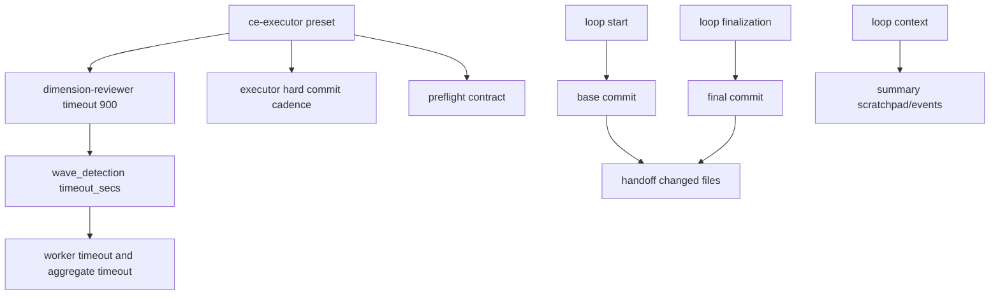

# fix: 修复 ce-executor preset 与运行报告准确性

## Summary

本计划修复一次 `ce-executor` dogfood run 暴露出的两类问题：`ce-executor` preset 对 wave review、incremental commit 和 hard prerequisite 的约束不够硬；loop 结束时生成的 handoff/summary 对本次改动、scratchpad 和 events 的描述不可信。

优先级按风险排序：先修 preset，确保 review 维度能完整跑完并减少 agent 行为漂移；再修 landing/reporting，使后续 run 的诊断材料可信。

---

## Problem Frame

诊断报告显示，本次 run 的事件流和 hat 编排按 preset 拓扑正常流转，未看到核心 orchestrator 调度失效。真正的问题集中在配置和收尾材料：

- `dimension-reviewer` 是触发 wave 的 hat，但没有配置 `timeout`，导致 standard review worker 使用默认 300 秒并持续超时。
- `review-synthesizer.aggregate.timeout` 容易被误读为 worker timeout，但它只属于 synthesizer 自身，不约束 `dimension-reviewer` workers。
- executor instructions 虽然有 incremental commit strategy，但没有禁止多个 U-ID batch 到一个 commit。
- coordinator 可以把 `hard_prereq` 写进 `work.ready` payload，但 executor 没有强制验证这些前置条件。
- handoff 的 recently modified 列表来自近期 git diff 范围，而不是本次 loop 的 base commit 到 final commit。
- summary 在实际存在 scratchpad 和 events 的情况下仍输出 `_No scratchpad found._` 和 `_No events recorded._`。

本计划不把这些问题归因为 Ralph 的主运行机制损坏；它把修复范围限定在 preset 契约、运行报告采集和相关回归测试。

---

## Requirements

### Preset Contract

- R1. `dimension-reviewer` 必须显式配置足够的 worker timeout，避免 standard review dimensions 默认落到 300 秒。
- R2. `review-synthesizer.aggregate.timeout` 的语义必须在 preset 中明确，不能让维护者误以为它控制 wave worker timeout。
- R3. executor 必须在每个测试通过的 Implementation Unit 后独立 commit，除非当前 runtime task 明确仍是未完成的同一 logical unit。
- R4. coordinator 发布的 hard prerequisites 必须变成 executor 会执行并记录的 preflight contract，而不是只作为 payload 文本存在。
- R5. 英文 builtin preset 与根目录 mirrored preset 必须保持一致；中文 `ce-executor-zh` 需要同步等价行为约束。

### Reporting Contract

- R6. handoff 的 `Recently modified` 必须反映本次 loop 的实际改动文件，默认来源为 `base_commit..final_commit`，不得混入更早 commit 或 pre-existing dirty 文件。
- R7. summary 必须从实际 loop context 读取 scratchpad 与 event file；存在文件时不得输出 “No scratchpad found” 或 “No events recorded”。
- R8. reporting 修复必须有测试覆盖，防止再次把状态采集错误包装成成功 handoff。

### Verification

- R9. preset YAML 必须能被 `RalphConfig::parse_yaml` 正常解析，且新增字段能被 config model 读到。
- R10. 修改后至少运行相关 unit tests；实现完成后再运行仓库要求的完整 `cargo test` 或 `./scripts/run-tests.sh`。

---

## Scope Boundaries

- 不重写 wave execution 机制；本计划默认当前 `DetectedWave::timeout_secs()` 的优先级 `hat.timeout > hat.aggregate.timeout > 300` 是正确契约。
- 不修改 `wave.worker.failed` 与 failed `review.dimension.done` 双事件模式；它们可能分别服务 TUI/监控和 aggregator 消费者。
- 不把 `loops.json` 为空视为本计划内 bug；当前源码在 loop 退出时 deregister active loop，这是 active registry 语义，不是历史审计语义。
- 不新增、删除或重命名 builtin preset，因此不涉及 zsh builtin completion 列表更新。
- 不修复外部 `ralph-log-monitor` 仓库中的业务代码；它只是 dogfood 证据来源。

---

## Key Technical Decisions

- **先修 preset，不动 runtime timeout 算法。** 超时根因是触发 wave 的 `dimension-reviewer` 缺 timeout，不是全局默认 300 秒错误。给目标 hat 显式 timeout 更小、更可解释。
- **timeout 取 900 秒作为第一版。** 这会把 7 个维度、并发 4 的 aggregate timeout 提高到 `900 * ceil(7 / 4) + 30 = 1830` 秒，足够覆盖 standard review，同时不会无限等待。
- **把 agent 行为要求写成 hard rule。** incremental commit 和 hard prerequisite 不能只依赖温和建议；preset instructions 需要明确失败条件、记录位置和 publish 行为。
- **reporting 用本次 loop 边界，不用近期历史。** handoff/summary 是 session handoff 材料，应该从 loop start/final commit 与 loop context 读取，而不是从 `HEAD~5..HEAD` 推测。
- **用测试钉住 YAML 行为和报告语义。** preset 文本变更容易被后续编辑冲掉，至少需要 parse-level 和 text-invariant tests；reporting 需要构造 git history 与 loop files 的单元测试。

---

## Implementation Units

### U1. 为 ce-executor wave review 配置显式 timeout

- **Goal:** 让 `dimension-reviewer` workers 不再默认 300 秒超时。
- **Requirements:** R1, R2, R5, R9
- **Files:**
  - `presets/ce-executor.yml`
  - `crates/ralph-cli/presets/ce-executor.yml`
  - `presets/ce-executor-zh.yml`
  - `crates/ralph-cli/src/presets.rs`
- **Approach:**
  - 在 `dimension-reviewer` hat 上新增 `timeout: 900`。
  - 在 `review-synthesizer.aggregate.timeout` 附近加入注释，说明该 timeout 只约束 synthesizer aggregate 等待，不控制 wave workers；worker timeout 见 `dimension-reviewer.timeout`。
  - 同步根目录英文 preset 与 `crates/ralph-cli/presets/ce-executor.yml`。
  - 中文 preset 添加等价 timeout 与语义注释；如果它仍不是 builtin embedded file，也要保持 root preset 测试通过。
- **Patterns to follow:**
  - `crates/ralph-core/src/wave_detection.rs` 的 timeout 优先级。
  - `presets/wave-review.yml` 中 wave hat 显式 timeout 的配置方式。
- **Test Scenarios:**
  - `ce-executor` parse 后 `dimension-reviewer.timeout == Some(900)`。
  - 根目录 `presets/ce-executor.yml` 与 `crates/ralph-cli/presets/ce-executor.yml` 内容一致。
  - `ce-executor-zh` parse 后 `dimension-reviewer.timeout == Some(900)`。
  - `cargo test -p ralph-cli ce_executor` 覆盖 preset parse 和 mirror 检查。

### U2. 加硬 executor commit cadence 与 hard prerequisite preflight

- **Goal:** 防止 executor 再次 batch 多个 U-ID commit，并确保 `hard_prereq` 在动代码前被验证。
- **Requirements:** R3, R4, R5, R9
- **Files:**
  - `presets/ce-executor.yml`
  - `crates/ralph-cli/presets/ce-executor.yml`
  - `presets/ce-executor-zh.yml`
  - `crates/ralph-cli/src/presets.rs`
- **Approach:**
  - 将 `Incremental Commit Strategy` 改为 `Commit Cadence (HARD RULE)`。
  - 明确规则：每个 U-ID 完成且相关测试通过后必须 commit；不得把多个 U-ID 合并成一个 commit；使用 `git add <relevant files>`，不得 `git add .`。
  - 在 coordinator 的 `work.ready` payload contract 中新增 `preflight_checks` 或 `preflight_commands` 字段说明。
  - 在 executor `Read State` 后新增 mandatory preflight step：若 payload 含 preflight contract，必须执行、记录到 `context.md` 或 `decisions.md`，失败则 publish `work.failed`。
  - 如果前置条件只能由用户验证，executor 必须停止并 publish `work.failed`，不能静默假设已满足。
- **Test Scenarios:**
  - preset text invariant：英文 builtin preset 包含 `Commit Cadence (HARD RULE)`、`Do NOT batch multiple U-IDs`、`preflight_checks` 或等价字段名。
  - 中文 preset 包含等价硬规则。
  - `RalphConfig::parse_yaml` 对修改后的英文和中文 preset 均成功。

### U3. 让 handoff 的 changed files 基于本次 loop diff

- **Goal:** `handoff.md` 的 `Recently modified` 列表只展示本次 loop 实际改动。
- **Requirements:** R6, R8
- **Files:**
  - `crates/ralph-core/src/git_ops.rs`
  - `crates/ralph-core/src/handoff.rs`
  - `crates/ralph-core/src/loop_context.rs`
  - `crates/ralph-cli/src/loop_runner.rs`
- **Approach:**
  - 增加一个显式 API，例如 `get_changed_files_between(path, base, head, limit)`，用 `git diff --name-only <base>..<head> --`。
  - 在 loop 启动时记录 base commit，并在 landing/handoff 写入阶段传给 `HandoffWriter`。
  - `HandoffWriter` 优先使用 `base_commit..final_commit`；没有 base commit 时再 fallback 到现有 recent-files 行为，并在测试中覆盖 fallback。
  - 不把 pre-existing dirty 文件列为本次改动；如需展示 dirty state，应放到独立段落而不是 `Recently modified`。
- **Test Scenarios:**
  - 构造 git repo：base 后提交 A、B，本次 loop base 为 B，再提交 C；handoff 只列 C 里的文件。
  - 构造 pre-existing dirty 文件：handoff 的本次改动列表不包含该文件。
  - 无 base commit 时仍能生成 handoff，不 panic。

### U4. 修复 summary 对 scratchpad 和 events 的读取

- **Goal:** summary 不再错误输出 “No scratchpad found” / “No events recorded”。
- **Requirements:** R7, R8
- **Files:**
  - `crates/ralph-core/src/summary_writer.rs`
  - `crates/ralph-core/src/loop_context.rs`
  - `crates/ralph-cli/src/loop_runner.rs`
- **Approach:**
  - 确认 `handle_termination` 传入的 scratchpad path 是否来自 runtime config，而不是默认/错误路径。
  - 将 events summary 的输入从隐式默认路径改为 loop context 当前 events file，或让 `SummaryWriter` 接收 explicit events path。
  - 当 scratchpad 文件存在但没有 `# Tasks` 段时，输出更准确的消息，例如 “Scratchpad found, no task section extracted”，不要说文件不存在。
  - 当 events file 存在但无法摘要时，区分 “file missing”、“file empty”、“parse/summarize failed”。
- **Test Scenarios:**
  - scratchpad 文件存在且含 `# Tasks`，summary 展示任务内容。
  - scratchpad 文件存在但无 tasks，summary 不输出 `_No scratchpad found._`。
  - events file 存在且含至少一个 event，summary 不输出 `_No events recorded._`。
  - events file 缺失时保留明确缺失提示。

### U5. 运行 targeted 验证与一次轻量 dogfood

- **Goal:** 验证 preset 修复和 reporting 修复都覆盖到真实路径。
- **Requirements:** R8, R9, R10
- **Files:**
  - `crates/ralph-cli/src/presets.rs`
  - `crates/ralph-core/src/handoff.rs`
  - `crates/ralph-core/src/summary_writer.rs`
  - `docs/report/2026-06-02-ce-executor-run-analysis.md`
- **Approach:**
  - 先运行 targeted tests，确保新增测试能证明每个修复点。
  - 再运行 `cargo test -p ralph-cli ce_executor` 与 `cargo test -p ralph-core handoff summary_writer`。
  - 完整实现后按仓库要求运行 `cargo test` 或 `./scripts/run-tests.sh`。
  - 如时间允许，用一个小型 plan 重新跑 `builtin:ce-executor`，检查 review dimensions 是否不再因 300 秒默认 timeout 失败。
- **Test Scenarios:**
  - 修改后的 preset parse 测试通过。
  - handoff/summary 单元测试通过。
  - dogfood run 中 `dimension-reviewer` worker timeout 日志不再显示 300 秒。

---

## High-Level Technical Design



---

## Risks & Mitigations

| Risk | Impact | Mitigation |
| --- | --- | --- |
| 900 秒仍不足以完成某些 standard review | review 仍有 timeout 盲区 | dogfood 后按维度调高或让 review-coordinator 降低 standard prompt 负载 |
| timeout 增加导致失败 run 等待更久 | 用户等待时间上升 | 只给 `dimension-reviewer` 增加，不提高全局默认；保留 aggregate timeout 兜底 |
| hard commit cadence 让 agent 对小型连续改动过度 commit | commit 数增多 | 规则允许“同一未完成 logical unit”不提交，但禁止跨 U-ID batch |
| preflight contract 仍被 agent 忽略 | hard prereq 继续漂移 | text invariant tests 只能防止 preset 文本丢失；后续可单独规划 schema/validator 强制 |
| handoff 需要 base commit，但当前 loop state 没保存 | reporting 改动扩大 | 先找现有 loop 初始化处记录 HEAD；如果没有，新增最小字段并只传给 landing/reporting |

---

## Acceptance Examples

- AE1. 当 `ce-executor` 发出 7 个 review dimensions 且其中 5 个为 standard depth 时，`dimension-reviewer` workers 使用 900 秒 timeout，而不是默认 300 秒。
- AE2. 当 executor 完成 U1 且测试通过时，preset 要求它 commit U1；如果它继续 U2 且不 commit，属于违反 preset。
- AE3. 当 `work.ready` payload 带有 hard prerequisite 时，executor 在实现前执行并记录验证；验证失败时发布 `work.failed`。
- AE4. 当 loop base 后只有 `src/foo.rs` 被提交，且工作区另有 pre-existing dirty `README.md`，handoff 的 `Recently modified` 只列 `src/foo.rs`。
- AE5. 当 `.ralph/agent/scratchpad.md` 和当前 events file 存在时，summary 不输出 “No scratchpad found” 或 “No events recorded”。

---

## Verification Commands

```bash
rtk cargo test -p ralph-cli ce_executor
rtk cargo test -p ralph-core handoff
rtk cargo test -p ralph-core summary_writer
rtk cargo test -p ralph-core wave_detection
rtk cargo test --workspace --exclude ralph-e2e -- --test-threads=1 --skip acp_executor::tests::test_create_terminal_and_output
```

如果本机安装了 nextest，最终验证优先使用：

```bash
rtk ./scripts/run-tests.sh
```

---

## Sources

- `docs/report/2026-06-02-ce-executor-run-analysis.md`
- `presets/ce-executor.yml`
- `crates/ralph-cli/presets/ce-executor.yml`
- `presets/ce-executor-zh.yml`
- `crates/ralph-core/src/wave_detection.rs`
- `crates/ralph-cli/src/loop_runner.rs`
- `crates/ralph-core/src/handoff.rs`
- `crates/ralph-core/src/summary_writer.rs`
- `crates/ralph-core/src/git_ops.rs`
