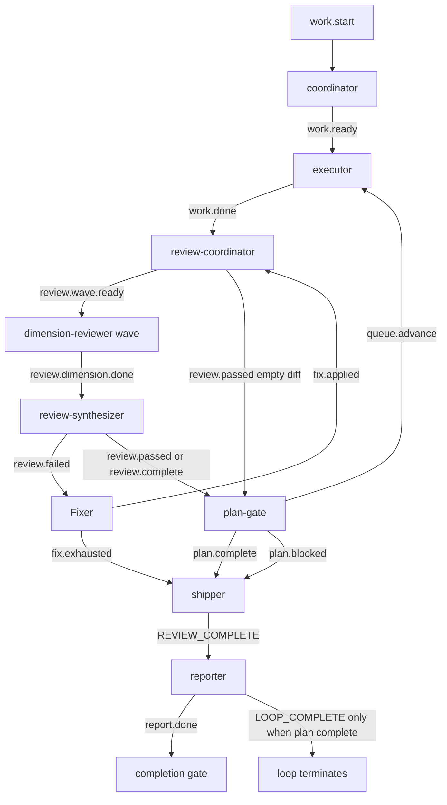
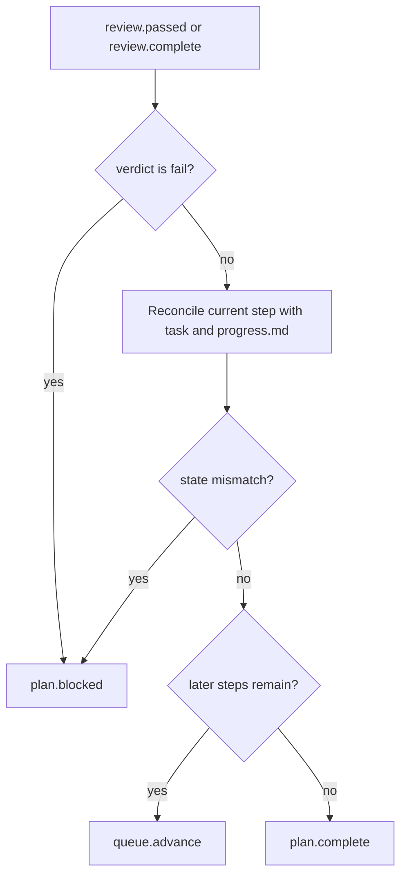

# fix: Add ce-executor plan gate

## Summary

本计划修复 `ce-executor` 在多步骤 plan 中完成第一个 step 后提前发布 `LOOP_COMPLETE` 的问题。核心方案是在 review 与 shipper 之间加入 `plan-gate`，由它对账当前 step、runtime task、`progress.md` 和 `plan.md`，决定继续发布 `queue.advance` 还是进入最终交付。

修复范围限定在 preset 拓扑、英文/中文配置同步、embedded mirror 同步和回归测试；不修改 ralph core 的 completion gate 语义。

---

## Problem Frame

诊断报告确认，`ce-executor` 当前事件图是单程链路：`work.start -> work.ready -> work.done -> review.* -> REVIEW_COMPLETE -> report.done -> LOOP_COMPLETE`。Coordinator 只创建当前 step 的 runtime tasks，U1 完成后 task 池为空，`verify_tasks_complete()` 按当前契约接受 `LOOP_COMPLETE`。因此 U2/U3/U4 从未被创建，也没有任何事件回到 executor 继续推进。

这个问题不是 `check_completion_event()` 的局部 bug。ralph core 当前把 runtime task 池视为完成门控，而 `ce-executor` 把 task 池当成当前 step 的局部队列。修复应优先把 plan-wide 推进语义编码进 `ce-executor` 的 hat 拓扑，而不是给 core 增加 plan manifest 读取能力。

---

## Requirements

### Plan Progress Gate

- R1. `ce-executor` 必须在当前 step review 通过后先进入 plan 进度门控，不得直接进入 final shipping。
- R2. 当 `plan.md` 仍有后续 step 时，门控必须发布 `queue.advance`，使 executor 创建并执行下一 step 的 runtime task。
- R3. 只有当所有 plan steps 都完成并且当前 review verdict 不是 fail 时，门控才能发布 `plan.complete`。
- R4. 门控不得监听 `fix.applied`。修复应用后必须先走 review-coordinator / review-synthesizer 复审，再由 review pass/complete 进入门控。
- R5. 门控必须能处理 `progress.md` 滞后：不能只相信 `Completed Steps`，必须结合当前 event payload 与 runtime task 状态对账后更新 progress。

### Shipping and Reporting

- R6. Shipper 必须从 `plan.complete` 进入最终验证/交付；不得再由 `review.passed` 或非 fail 的 `review.complete` 直接触发。
- R7. Review fail、fix exhausted、plan 状态不一致等情况仍必须能到达 reporter，生成失败或待决策报告，而不是静默卡住。
- R8. Reporter 在发布 `LOOP_COMPLETE` 前必须有防御性 plan 完成检查；如果仍有 pending step，应拒绝完成并发布继续/失败语义，而不是只依赖 `pass_or_fail`。

### Synchronization and Regression Protection

- R9. `presets/ce-executor.yml`、`presets/ce-executor-zh.yml`、`crates/ralph-cli/presets/ce-executor.yml` 的事件拓扑必须保持一致。
- R10. 预设测试必须覆盖 `plan-gate` 的存在、触发/发布 topics、shipper 不再直连 review pass、reporter 仍能满足 `report.done` completion gate。
- R11. 回归测试必须表达 multi-step plan 的关键行为：第一个 step review pass 后应出现 `queue.advance`，不应直接进入 `LOOP_COMPLETE`。
- R12. 修复不得破坏既有 origin guard、required events、verdict gate 和 embedded mirror drift 测试。

---

## High-Level Technical Design

### Updated Event Topology

### Gate Decision Flow

`plan-gate` 是单一职责节点：它不实现、不 review、不 final validate，只负责把“当前增量通过评审”翻译成“继续队列”或“全 plan 完成”。这与 `pdd-to-code-assist` 的 `finalizer` 模式一致，但为 `ce-executor` 保留 executor 创建下一 step runtime task 的既有职责。

---

## Key Technical Decisions

- KTD1. 在 preset 层修复，而不是修改 core completion gate：本次失败来自 `ce-executor` 缺少 plan-wide 推进事件，core 的 `verify_tasks_complete()` 仍按 task 池契约正常工作。core plan manifest gate 可作为后续平台能力，但不应成为本次 bug fix 的前置依赖。
- KTD2. 新增 `plan-gate`，而不是把逻辑塞进 review-coordinator 或 reporter：review-coordinator 的职责是组织评审，reporter 的职责是汇报；队列推进是独立状态门控，拆成独立 hat 能让拓扑、测试和后续维护更清晰。
- KTD3. `plan-gate` 不监听 `fix.applied`：`fix.applied` 只表示 safe_auto 修复已尝试，不表示增量已通过复审。它应回到 review-coordinator，再由 review 结果进入 gate。
- KTD4. `queue.advance` 由 `plan-gate` 发布，executor 响应该事件创建并执行下一 step：executor 不再在当前 step 结束时自行判断全局推进，避免“执行者自己宣布继续/完成”的职责混淆。
- KTD5. `progress.md` 是需对账的 soft state，不是唯一真相：实际事件中 U1 已 closed 但 `Completed Steps` 仍为空，因此 gate 必须结合 event payload、runtime task 和 `plan.md` 对账后更新 progress。
- KTD6. 保留 failure path 到 shipper/reporter：`plan.blocked` 与 `fix.exhausted` 应能进入 shipper，生成 `REVIEW_COMPLETE pass_or_fail=fail` 或待决策报告，避免引入新的卡死路径。

---

## Scope Boundaries

### In Scope

- 修改 `ce-executor` 英文 preset 拓扑与 instructions。
- 同步修改 `ce-executor-zh`。
- 同步 embedded mirror。
- 增加/调整静态拓扑测试、origin guard 兼容测试、mirror drift 测试、multi-step advancement 契约测试。
- 更新与本次 preset 行为直接相关的文档或 learning doc。

### Deferred to Follow-Up Work

- 为 ralph core 增加可配置 plan manifest completion gate。
- 修复 `HatRegistry::get_for_topic()` 在多 hat 订阅同一 topic 时的 HashMap 顺序脆弱性。
- 将 `ce-executor` 迁移到真正的结构化 state machine。
- 把 Coordinator 模式下的虚拟 hat 切换改造成进程级隔离或真正并行。

### Out of Scope

- 改变 `ralph tools task` 的数据模型。
- 改变 `check_completion_event()` 对 runtime open tasks 的现有语义。
- 修改 `pdd-to-code-assist` 的 finalizer 行为。
- 重新设计 `ce-executor` 的 wave review persona、finding schema 或 autofix 分类。

---

## Implementation Units

### U1. English ce-executor plan-gate topology

- **Goal:** 在 `presets/ce-executor.yml` 中加入 `plan-gate`，重写 review-to-ship 链路，使多 step plan 在每个 step review 后先判断继续或完成。
- **Requirements:** R1, R2, R3, R4, R5, R6, R7, R8
- **Dependencies:** 无
- **Files:**
  - `presets/ce-executor.yml`
- **Approach:**
  - 更新文件头部架构说明，从 8 hats 改为包含 `plan-gate` 的 9 hats。
  - 新增 `plan-gate` hat，建议配置：
    - `triggers: ["review.passed", "review.complete"]`
    - `publishes: ["queue.advance", "plan.complete", "plan.blocked"]`
    - `default_publishes: "plan.blocked"`
  - `plan-gate` instructions 明确读取 `context.md`、`plan.md`、`progress.md`、当前 event payload 和 runtime task。
  - `plan-gate` 在判断前先对账并更新当前 step 完成状态；如果 event/task/progress 不一致，发布 `plan.blocked`。
  - `plan-gate` 在还有后续 step 时发布 `queue.advance`，payload 包含 `plan_name`、`completed_step`、`next_step`、`reviewed_task_id`、`reviewed_task_key`。
  - `plan-gate` 在所有 step 完成时发布 `plan.complete`，payload 包含 plan 完成摘要和最终验证所需上下文。
  - 调整 `executor`：
    - `publishes` 去掉 `queue.advance`，由 `plan-gate` 独占推进。
    - `queue.advance` 激活时允许 payload 没有 `task_id`；executor 应根据 `next_step` 或 `progress.md` 创建该 step runtime tasks，选择当前 step 的第一个 task 并实施。
    - Step Advancement 指令改为当前 step 完成后发布 `work.done`，不直接发布 `queue.advance`。
  - 调整 `shipper`：
    - `triggers` 改为 `["plan.complete", "plan.blocked", "fix.exhausted"]`。
    - `plan.complete` 时执行最终验证和交付。
    - `plan.blocked` 或 `fix.exhausted` 时发布失败/待决策 `REVIEW_COMPLETE`，不得伪装为 pass。
  - 调整 `reporter`：
    - 发布 `LOOP_COMPLETE` 前再次检查 plan 是否完成。
    - 如果 payload 或 scratchpad 显示仍有 pending steps，不发布 `LOOP_COMPLETE`；发布 `report.done` 并标记 awaiting decision 或需要继续推进。
  - 调整 `review-coordinator` / `review-synthesizer` payload 说明，要求传递 `task_id`、`task_key`、`step` 或足够信息供 `plan-gate` 对账。
- **Execution note:** 先改拓扑声明，再改 instructions，避免测试新增时解析到半同步状态。
- **Patterns to follow:**
  - `presets/pdd-to-code-assist.yml` 的 `finalizer` gate 模式。
  - `docs/report/2026-06-02-ce-executor-loop-premature-termination-diagnosis.md` 第 7 节的方案 A，但排除 `fix.applied` trigger。
- **Test scenarios:**
  - Happy path: `review.passed` 且 `plan.md` 仍有后续 step 时，配置允许 `plan-gate` 发布 `queue.advance`，且 executor 订阅该事件。
  - Happy path: 所有 step 完成时，配置允许 `plan-gate` 发布 `plan.complete`，且 shipper 订阅该事件。
  - Failure path: `review.complete` verdict 为 fail 或状态不一致时，配置允许 `plan-gate` 发布 `plan.blocked`，且 shipper 订阅该事件。
  - Regression: `shipper.triggers` 不再包含 `review.passed` 或 `review.complete`。
  - Regression: `plan-gate.triggers` 不包含 `fix.applied`。
- **Verification:** 英文 preset YAML 可解析；builtin `ce-executor` 的 hats validation 仍通过；新的拓扑测试能证明 review pass 后不再直连 shipper。

### U2. Chinese preset synchronization

- **Goal:** 将 U1 的拓扑和行为完整同步到 `presets/ce-executor-zh.yml`，避免中文 preset 继续保留提前完成路径。
- **Requirements:** R1, R2, R3, R4, R5, R6, R7, R8, R9
- **Dependencies:** U1
- **Files:**
  - `presets/ce-executor-zh.yml`
- **Approach:**
  - 与英文版保持同构：新增 `plan-gate`，调整 executor/shipper/reporter/review payload 说明。
  - 保留中文说明风格，但 topic 名、payload 字段、文件路径、命令名保持英文技术标识符。
  - 特别同步 `plan-gate` 不监听 `fix.applied`、shipper 不监听 `review.passed` / `review.complete`、reporter 防御性 plan completion check 三条硬规则。
- **Execution note:** 修改后与英文版做结构对照，不要求逐字一致，但 triggers/publishes/default_publishes 必须一致。
- **Patterns to follow:**
  - `presets/pdd-to-code-assist-zh.yml` 中 `finalizer` 对英文版的翻译方式。
  - `crates/ralph-cli/src/presets.rs` 中现有 `ce-executor-zh` 一致性测试。
- **Test scenarios:**
  - Happy path: 中文 preset 的 `plan-gate` 与英文 preset 有相同 triggers/publishes/default_publishes。
  - Regression: 中文 preset 的 shipper 不再直连 review pass/complete。
  - Regression: 中文 preset reporter 仍声明可发布 `report.done` 和 `LOOP_COMPLETE`。
- **Verification:** 中文 preset YAML 可解析；英文/中文 completion gate 与 plan-gate 拓扑一致性测试通过。

### U3. Embedded mirror synchronization and static contract tests

- **Goal:** 同步 embedded preset，并用静态测试锁住新拓扑，防止 root preset、embedded mirror、中文 preset 再次漂移。
- **Requirements:** R9, R10, R12
- **Dependencies:** U1, U2
- **Files:**
  - `crates/ralph-cli/presets/ce-executor.yml`
  - `crates/ralph-cli/src/presets.rs`
- **Approach:**
  - 使用现有 mirror 脚本同步 root `presets/ce-executor.yml` 到 embedded mirror；不手写 mirror 内容。
  - 扩展现有 `ce-executor` preset tests：
    - root 与 embedded mirror 内容仍一致。
    - English/ZH 的 `plan-gate` triggers/publishes/default_publishes 一致。
    - `shipper.triggers` 只接受 `plan.complete`、`plan.blocked`、`fix.exhausted` 这类 finalization inputs。
    - `executor.publishes` 不再包含 `queue.advance`。
    - `reporter.publishes` 仍包含 `report.done` 和 `LOOP_COMPLETE`。
  - 更新 `test_ce_executor_publish_chain_origin_compatible` 的 chain：新增 `plan-gate` 发布 `queue.advance`、`plan.complete`、`plan.blocked`，shipper 发布 `REVIEW_COMPLETE`，reporter 发布完成事件。
  - 如果 `scripts/sync-embedded-files.sh` 本身无需改动，只在计划执行时用它同步；不要为同步动作制造无意义 diff。
- **Execution note:** 测试先捕获旧拓扑失败，再同步/调整 preset 使测试通过。
- **Patterns to follow:**
  - `crates/ralph-cli/src/presets.rs` 现有 `test_ce_executor_required_events_is_report_done_for_root_preset`。
  - 同文件中 `pdd-to-code-assist` finalizer 的静态断言。
- **Test scenarios:**
  - Happy path: embedded mirror 和 root preset 的 `plan-gate` 配置一致。
  - Happy path: origin guard 接受 `plan-gate` 发布 `queue.advance`、`plan.complete`、`plan.blocked`。
  - Regression: origin guard 不要求 shipper 能发布 `review.complete`；shipper 只发布 `REVIEW_COMPLETE`。
  - Regression: `required_events` 仍为 `["report.done"]`，不回退到旧的互斥 review gate。
- **Verification:** `ralph-cli` preset tests 通过；sync check 显示 embedded files 无漂移。

### U4. Preset topology validator and multi-step advancement regression coverage

- **Goal:** 更新 topology validator 的 ce-executor 测试样例，并增加能表达 multi-step advancement 的回归覆盖。
- **Requirements:** R10, R11, R12
- **Dependencies:** U1, U3
- **Files:**
  - `crates/ralph-core/src/preset_validator.rs`
  - `crates/ralph-core/src/event_loop/tests.rs`
  - `crates/ralph-core/tests/scenarios/`
- **Approach:**
  - 更新 `preset_validator.rs` 中硬编码的 ce-executor topology fixture，加入 `plan-gate` 并移除 shipper 对 review pass/complete 的直接依赖。
  - 增加一个静态/拓扑级测试：从 `work.start` 可到 `queue.advance` 回路，也可到 `plan.complete -> REVIEW_COMPLETE -> report.done -> LOOP_COMPLETE` 完成路径。
  - 增加一个 replay-light 或 scenario 级测试来固定行为语义：
    - 模拟多 step plan 中第一步 review pass。
    - 期望下一步是 `queue.advance`，而不是 `REVIEW_COMPLETE` 或 `LOOP_COMPLETE`。
    - 模拟所有步骤完成后才允许 `plan.complete -> REVIEW_COMPLETE -> report.done -> LOOP_COMPLETE`。
  - 如果现有 YAML scenario harness 无法直接表达 agent instructions 的 plan parsing，可使用静态 config contract 测试加 replay-light 事件序列测试，不强行写会误导的伪 e2e。
- **Execution note:** 优先写能稳定失败/通过的 deterministic 测试；不要依赖 live LLM 行为验证 preset instructions。
- **Patterns to follow:**
  - `crates/ralph-core/src/preset_validator.rs` 中 `ce_executor_topology_is_valid`。
  - `crates/ralph-core/src/event_loop/tests.rs` 中 ce-executor completion chain replay-light 测试。
  - `crates/ralph-core/tests/scenarios/` 中已有 completion acceptance/rejection 场景格式。
- **Test scenarios:**
  - Happy path: review pass with later planned steps reaches `queue.advance`.
  - Happy path: final step complete reaches `plan.complete` and then normal report completion path。
  - Failure path: plan-gate state mismatch reaches `plan.blocked` and final report path，不能直接 `LOOP_COMPLETE`。
  - Regression: `report.done + LOOP_COMPLETE` 仍能被 core completion gate 接受，避免重引入 2026-06-01 修过的 completion gate 死循环。
- **Verification:** core preset validator tests 与 event loop replay-light tests 通过；multi-step advancement contract 在旧拓扑下会失败，在新拓扑下通过。

### U5. Documentation and learning capture

- **Goal:** 把这次“step-scoped task 池不等于 plan-wide completion”的教训写入可复用文档，降低后续 preset 设计复发概率。
- **Requirements:** R9, R10, R11
- **Dependencies:** U1, U2, U3, U4
- **Files:**
  - `docs/solutions/`
  - `docs/guide/presets.md`
  - `presets/README.md`
- **Approach:**
  - 在 `docs/solutions/` 新增一条简短 learning，说明：
    - 诊断症状：runtime tasks closed 但 plan 仍有 pending steps。
    - 根因：preset 缺少 plan-wide advancement gate。
    - 推荐模式：review pass 后进入 finalizer/plan-gate，gate 决定 `queue.advance` 或 completion。
    - 反模式：reporter 在不知道 plan 完成状态时发布 `LOOP_COMPLETE`。
  - 如果 `docs/guide/presets.md` 当前描述 `ce-executor` 流程，更新为包含 `plan-gate`。
  - 如果 `presets/README.md` 只列举 preset 名称且不描述流程，可不改，避免无意义 churn。
- **Execution note:** 文档只记录稳定设计原则，不复述整份诊断报告。
- **Patterns to follow:**
  - `docs/solutions/` 下现有 YAML frontmatter 和分类风格。
  - `docs/guide/presets.md` 中 ce-executor workflow 说明。
- **Test scenarios:**
  - Test expectation: none -- 文档/learning 捕获，无行为变更。
- **Verification:** 文档引用的事件 topic 与最终 preset 拓扑一致；没有绝对路径或过期行号。

---

## Acceptance Examples

- AE1. 多步骤 plan 的第一步通过评审：给定 `plan.md` 有 Step 1 和 Step 2，且当前事件为 Step 1 的 `review.passed`，当 `plan-gate` 对账发现 Step 2 仍未完成时，它发布 `queue.advance`，不发布 `plan.complete`。
- AE2. 最后一步通过评审：给定 `plan.md` 中所有 steps 都已完成，且当前 review verdict 不是 fail，当 `plan-gate` 对账成功时，它发布 `plan.complete`，shipper 才执行最终验证并发布 `REVIEW_COMPLETE`。
- AE3. 修复刚应用但未复审：给定 fixer 发布 `fix.applied`，当事件进入下一轮时，应激活 review-coordinator 复审，而不是激活 `plan-gate` 推进下一 step。
- AE4. 进度文件滞后：给定 runtime task 已 closed，但 `progress.md` 的 `Completed Steps` 仍未记录当前 step，当 `plan-gate` 处理 review pass 时，应先 reconcile 并更新 progress，而不是误判为状态完成或直接 shipping。
- AE5. 状态不一致：给定 event payload、runtime task 和 `progress.md` 指向不同 step，当 `plan-gate` 无法安全对账时，应发布 `plan.blocked`，并让 reporter 输出待决策报告，不发布 `LOOP_COMPLETE`。

---

## System-Wide Impact

这次修复会改变 `builtin:ce-executor` 的主事件链，因此影响所有使用该 preset 执行 plan 文件的开发循环。影响不是 ralph core 行为变化，而是 agent prompt 与 hat topology 的行为变化：运行时间会从“单 step 即可 shipping”变成“每 step review 后 gate 决定继续”，多步骤 plan 会自然增加 executor/review 循环次数。

由于 `ce-executor-zh.yml` 不作为 embedded builtin，但可通过文件路径使用，它必须同步更新，否则中英文 preset 会表现不同。`crates/ralph-cli/presets/ce-executor.yml` 是 `include_str!` mirror，必须通过同步脚本保持与 root preset 一致。

---

## Risks & Dependencies

- **Risk: gate 过度依赖 markdown 解析。** `plan.md` 和 `progress.md` 是 agent 生成的 soft state，格式漂移会影响 gate 判断。缓解：instructions 要求使用编号 Step、U-ID、task key 三者交叉对账；状态不一致时发布 `plan.blocked`，不猜测。
- **Risk: queue.advance payload 不足导致 executor 无法创建下一 task。** 缓解：plan-gate payload 明确包含 `next_step` 和 reviewed task 信息；executor instructions 明确支持无 `task_id` 的 `queue.advance` 激活。
- **Risk: 修复旧的提前退出后引入新的卡死。** 缓解：保留 `plan.blocked` / `fix.exhausted` 到 shipper/reporter 的失败报告路径，并增加拓扑测试证明 failure path 可达。
- **Risk: 中文 preset 漂移。** 缓解：新增英文/中文 plan-gate 一致性测试，直接读取 root `ce-executor-zh.yml`。
- **Risk: 静态测试无法证明 LLM 一定遵守 instructions。** 缓解：测试锁住 topology 和 prompt contracts；行为风险通过 clear payload rules、default_publishes 和失败路径降低。live LLM dogfood 属于实施后的验证，不作为计划期硬依赖。

---

## Documentation / Operational Notes

实施完成后应重点 dogfood 一个至少 2-step 的小 plan，观察事件序列中是否出现：

- Step 1 `review.passed` 或非 fail `review.complete`
- `plan-gate` 发布 `queue.advance`
- executor 第二次执行并发布新的 `work.done`
- 最后 step 通过后才出现 `plan.complete`
- `REVIEW_COMPLETE`、`report.done`、`LOOP_COMPLETE` 只出现在全 plan 完成之后

如果 dogfood 中 reporter 输出 `scope_pending` 但仍发布 `LOOP_COMPLETE`，说明 reporter 防御性检查或 plan-gate 状态对账仍有漏洞。

---

## Sources & Research

- `docs/report/2026-06-02-ce-executor-loop-premature-termination-diagnosis.md`：本计划的直接 origin，包含事件流、任务池状态、completion gate 源码分析和推荐方案。
- `presets/ce-executor.yml`：当前英文 preset，缺少 review pass 后的 plan-wide gate。
- `presets/ce-executor-zh.yml`：当前中文 preset，同步存在旧链路。
- `presets/pdd-to-code-assist.yml` 和 `presets/pdd-to-code-assist-zh.yml`：已有 finalizer gate 模式参考。
- `crates/ralph-cli/src/presets.rs`：builtin preset、mirror drift 和 ce-executor completion gate 回归测试位置。
- `crates/ralph-core/src/preset_validator.rs`：preset topology validator 的 ce-executor 硬编码测试样例。
- `crates/ralph-core/src/event_loop/tests.rs`：completion gate replay-light 测试位置。
- `scripts/sync-embedded-files.sh`：root preset 到 embedded mirror 的同步契约。
