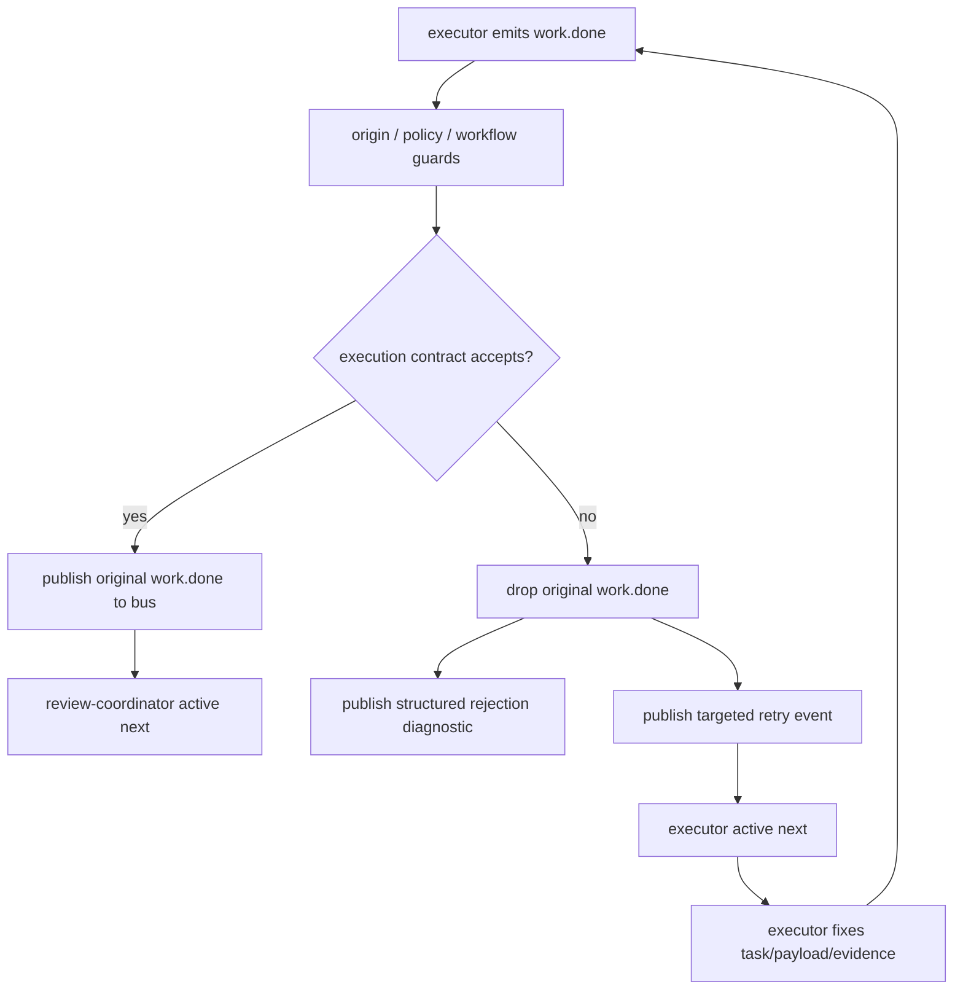

# fix: 修复 execution contract 拒绝后的 hat retry 路由

## Summary

当前 `ce-executor` rerun 仍然卡在 `coordinator -> executor -> ralph`：`executor` 发出的 `work.done` 被 execution contract 正确拒绝后，恢复信号只以 `human.guidance` 形式进入下一轮，而 `human.guidance` 不参与 active hat 选择，导致下一轮由 Ralph coordinator 接管并继续错误发布业务事件。

本计划修复的是 **contract rejection recovery 路由机制**：被拒绝的业务事件不能触发下游 hat，但必须把 retry 明确交还给原 active hat；同时补齐 `ce-executor` 的 `work.done` 合同字段一致性与端到端回归测试，确保拒绝后的下一轮是 `executor` 修正，而不是 `ralph` 代劳。

---

## Problem Frame

`d7ef7cc` 已经固化了 registry 层契约：`work.done` 在正常路由下应命中 `review-coordinator`，不是 `ralph` fallback。当前生产 rerun 的失败不在 `get_for_topic` / `find_by_trigger`，而在更晚的事件处理链：

1. `executor` 发布 `work.done`。
2. `execution_contracts.work.done` 在进入 bus 前拒绝该事件，例如 task 仍是 `open` 或 payload 缺 `plan_path`。
3. event loop 丢弃原始 `work.done`，只发布 `event.execution_contract.rejected` 和 `human.guidance`。
4. 下一轮 prompt 构建把 `human.guidance` 从 regular events 分离；active hat 从 regular events 推导，因此没有 executor/review-coordinator 可激活。
5. Ralph coordinator 拿到恢复提示并尝试自己补发 `work.done`，继续制造缺字段或越权业务事件。

因此需要保留两条边界：

- **拒绝事件不能推进下游**：无效 `work.done` 绝不能触发 `review-coordinator`。
- **拒绝恢复必须回到原 hat**：修正 payload、关闭 task、补 git/test evidence 的责任仍属于发错事件的 hat，通常是 `executor`。

---

## Requirements

### Rejection Recovery

- R1. execution contract 拒绝业务事件时，原始事件仍不得进入 bus，也不得触发下游订阅者。
- R2. rejection 必须记录原始发布 hat、被拒 topic、rejection finding、原始 payload 摘要和 retry 目标 hat。
- R3. rejection recovery 必须在下一轮激活原始 active hat，不能只靠 `human.guidance` 注入 Ralph coordinator prompt。
- R4. 如果原始 active hat 不存在或已不可用，recovery 必须 fail closed，转为 Ralph 可见的 diagnostic，而不是猜测目标。
- R5. retry prompt 必须告诉目标 hat：修正后重新发布同一 topic，或明确发布允许的 failure topic。

### Contract and Preset Consistency

- R6. `presets/en/ce-executor.yml` 中 `work.done` 的 execution contract、event policy schema、executor instructions、review-coordinator read-state 必须对同一字段集合保持一致。
- R7. `work.done` 必须包含 `plan_name`、`plan_path`、`task_id`、`task_key`、`step`；若某字段只用于上游 contract，也必须在 instructions 中写清楚。
- R8. `work.failed` 在 ce-executor 中不能孤儿化；至少必须有明确订阅者或明确的 fail-closed recovery 设计。
- R9. executor 仍不得使用成功型 `default_publishes`；contract rejection 不应触发 default fallback。

### Test and Observability

- R10. 必须有单元测试证明 contract rejection 后下一轮 active hat 是原 hat，而不是 `ralph`。
- R11. 必须有测试证明有效 `work.done` 仍正常触发 `review-coordinator`。
- R12. 必须有测试证明 rejected `work.done` 不触发 `review-coordinator`。
- R13. 必须有 ce-executor preset 静态测试覆盖 `work.done` 字段一致性、executor no-default、`work.failed` 可达性。
- R14. 必须有 replay-light 或 event-loop 集成测试覆盖现场链路：`executor` 发无效 `work.done` → retry 到 executor → executor 修正后有效 `work.done` → review-coordinator 激活。

---

## Scope Boundaries

### In Scope

- 修复 execution contract rejection 的恢复路由和 prompt active-hat 选择。
- 扩展 rejection diagnostic，使其携带 retry target 和原始事件上下文。
- 为 retry event 使用现有 direct target 能力或等价的 typed recovery 事件。
- 调整 `ce-executor` 的 `work.done` 字段一致性与 `work.failed` 可达性。
- 增加 core event loop、CLI loop runner、preset validator / preset tests。
- 更新本问题相关报告或方案文档中的错误归因，避免继续把 registry 路由测试误认为 bug fix。

### Out of Scope

- 不重写 execution contract validator 的 payload/task/git/test evidence 基础能力。
- 不放宽 `work.done` contract 来绕过失败；拒绝是正确行为。
- 不让 Ralph 在 contract rejection 后自行修正业务 payload。
- 不引入 live LLM 或真实 ce-executor 长跑作为唯一验收。
- 不解决当前两个 worktree 的业务代码质量，只修复导致 rerun 继续塌缩的机制。

### Deferred to Follow-Up Work

- 为所有 preset 建立统一 execution contract matrix。
- 把 contract rejection 计数和 retry 状态展示到 TUI 专用面板。
- 把 git/test evidence 进一步收敛为 `ralph tools evidence` 类结构化证据。
- 将 ce-executor 端到端 mock runner 纳入常规 CI smoke，而不仅是 replay-light。

---

## High-Level Technical Design

### Rejection Recovery Flow



### Event Routing Shape

The recovery event should be a regular event, not only guidance. It must be direct-targeted to the original hat so `determine_active_hat_ids` can select that hat via `event.target` before topic fallback.

```mermaid
sequenceDiagram
  participant Exec as executor
  participant Loop as EventLoop
  participant Bus as EventBus
  participant Ralph as Ralph prompt builder

  Exec->>Loop: work.done payload invalid
  Loop->>Loop: validate_execution_contract rejects
  Loop--xBus: original work.done is not published
  Loop->>Bus: event.execution_contract.rejected
  Loop->>Bus: task.resume target=executor
  Ralph->>Bus: take pending events
  Ralph->>Ralph: regular events include targeted task.resume
  Ralph->>Exec: build prompt with executor instructions
```

---

## Key Technical Decisions

- KTD1. **Contract rejection remains backpressure, not downstream routing.** Rejected `work.done` must stay out of the bus; otherwise the review chain would validate untrusted completion claims.

- KTD2. **Retry uses regular targeted event, not only `human.guidance`.** `human.guidance` is intentionally separated before active-hat selection. Recovery must therefore create a regular event with `target=<source_hat>` or equivalent persisted target metadata.

- KTD3. **Prefer existing `task.resume` direct-target path unless a distinct topic proves necessary.** `Event::with_target` and `determine_active_hat_ids` already support direct handoff. Reusing `task.resume` keeps recovery aligned with existing stale-breaker and fallback recovery behavior. If the payload needs stronger typing, introduce `event.execution_contract.retry` with direct target, but do not rely on wildcard fallback.

- KTD4. **The retry target is the last active hat, cross-checked against event source.** For JSONL events, the source hat is available from parsed event provenance; for runtime state, `last_active_hat_ids` records the prompt target. The safe retry target is valid only when it is registered and can publish the rejected topic.

- KTD5. **`work.failed` must become an explicit failure route in ce-executor.** The current preset lets coordinator/executor publish `work.failed`, but no concrete hat handles it. That makes the “emit `work.failed` if unrecoverable” guidance unsafe. Route it to `plan-gate` or a dedicated failure gate so failure can become `plan.blocked` and then `shipper/reporter`.

- KTD6. **Tests should prove behavior at the event-loop boundary, not only registry lookup.** `d7ef7cc` showed registry routing is necessary but insufficient. New tests must process events through contract validation and then inspect pending active hats / bus recipients.

---

## Implementation Units

### U1. Characterize Contract Rejection Recovery Failure

**Goal:** Add failing tests that reproduce the current rerun behavior before changing implementation.

**Requirements:** R1, R3, R10, R12, R14

**Dependencies:** None

**Files:**

- Modify: `crates/ralph-core/src/event_loop/tests.rs`
- Modify: `crates/ralph-cli/src/loop_runner.rs`
- Test: `crates/ralph-core/src/event_loop/tests.rs`
- Test: `crates/ralph-cli/src/loop_runner.rs`

**Approach:** Extend the existing contract rejection tests instead of creating isolated artificial coverage. Build a minimal topology with `executor -> work.done -> reviewer`, enable `work.done` execution contract, emit invalid `work.done`, and assert both sides of the boundary: original event is rejected, but the next prompt target is still executor.

**Execution note:** Characterization-first. The first test should fail on current `d7ef7cc` behavior by showing that only `human.guidance` is present and no targeted retry activates executor.

**Patterns to follow:** Existing tests around `test_contract_rejection_does_not_publish_original_event`, `test_contract_rejection_satisfies_any_valid_or_rejected`, and direct-target `task.resume` tests in `event_loop/tests.rs`.

**Test scenarios:**

- Invalid `work.done` with open/missing task produces `contract_rejections` and does not publish original `work.done`.
- The same invalid `work.done` publishes a recovery event that is a regular event, not only `human.guidance`.
- Calling prompt construction after rejection selects `executor` as active hat.
- Regression: `reviewer` / `review-coordinator` remains inactive until a valid `work.done` is accepted.
- CLI gate regression: `had_rejected_events=true` still skips missing-event hard gate, but does not mean recovery can be handled by Ralph.

**Verification:** The new failing tests demonstrate the current gap without relying on live Claude output or long-running worktrees.

### U2. Add Targeted Contract Retry Event

**Goal:** When execution contract rejects an event, publish a targeted regular recovery event to the original responsible hat.

**Requirements:** R2, R3, R4, R5

**Dependencies:** U1

**Files:**

- Modify: `crates/ralph-core/src/event_loop/mod.rs`
- Modify: `crates/ralph-core/src/execution_contract.rs`
- Test: `crates/ralph-core/src/event_loop/tests.rs`

**Approach:** In the rejection branch, continue publishing structured diagnostic and human-readable guidance, but additionally publish a regular retry event:

- Preferred topic: `task.resume`.
- Target: original active hat, usually `executor`.
- Payload: JSON object containing `rejected_topic`, `reason`, `required_action`, `original_payload`, `retry_publish_topics`, and `contract_finding`.

Before publishing retry, validate:

- target hat exists in registry;
- target hat can publish the rejected topic or one of the allowed failure topics;
- target is not fallback-only `ralph` unless the rejected event was genuinely produced by Ralph in solo mode.

If no safe target exists, publish only diagnostic/guidance and include an explicit “no retry target” finding. Do not guess another business hat.

**Patterns to follow:** Existing `Event::with_target`, `task.resume` recovery events, and `determine_active_hat_ids` target-first selection.

**Test scenarios:**

- Rejected `work.done` from executor publishes `task.resume` with `target=executor`.
- Rejected `work.done` from unknown or unregistered hat does not publish targeted retry.
- Rejected topic that source hat is not allowed to publish does not create an unsafe retry.
- Retry payload includes the rejected topic, finding kind, and a concise original payload summary.
- Human guidance is still persisted for operator visibility.

**Verification:** EventBus pending queue for executor contains the targeted retry event; ralph fallback queue does not become the only recovery path.

### U3. Preserve Active Hat Selection Through Guidance Partitioning

**Goal:** Ensure prompt construction activates the retry target even though `human.guidance` is partitioned away from regular events.

**Requirements:** R3, R10

**Dependencies:** U2

**Files:**

- Modify: `crates/ralph-core/src/event_loop/mod.rs`
- Test: `crates/ralph-core/src/event_loop/tests.rs`

**Approach:** Keep `human.guidance` partition behavior unchanged, but make targeted retry events participate in `regular_events`. `determine_active_hat_ids` already prefers `event.target` over topic lookup; the implementation should verify the retry event is consumed by the multi-hat Ralph prompt builder and causes active hat instructions for the target hat.

If `effective_regular_events` later filters recovery noise, ensure it does not remove targeted retry when no downstream business event is available.

**Patterns to follow:** Tests around targeted `task.resume`, stale breaker recovery, and multi-hat prompt generation.

**Test scenarios:**

- Prompt built after rejection contains executor instructions and does not contain full coordinator table as the only actionable mode.
- `last_active_hat_ids` updates to `executor` after consuming targeted retry.
- Multiple events with `human.guidance` plus targeted retry still activate executor.
- If a valid downstream `work.done` and a stale retry event coexist, progressed downstream event wins and review-coordinator activates.

**Verification:** Active-hat logs and prompt content reflect executor mode on recovery turn.

### U4. Align ce-executor `work.done` Contract, Schema, and Instructions

**Goal:** Remove field drift that currently lets Ralph or agents emit `work.done` payloads that satisfy one layer but fail another.

**Requirements:** R6, R7, R9, R13

**Dependencies:** None

**Files:**

- Modify: `presets/en/ce-executor.yml`
- Modify: `presets/zh/ce-executor-zh.yml`
- Modify: `presets/schemas/ce-executor.yml`
- Modify if mirrored: `crates/ralph-cli/src/presets.rs`
- Modify: `crates/ralph-core/src/preset_validator.rs`
- Test: `crates/ralph-core/tests/hat_explicit_routing.rs`
- Test: `crates/ralph-cli/src/presets.rs`

**Approach:** Make `work.done` field expectations identical across:

- `event_loop.execution_contracts.rules.work.done.require_payload_fields`;
- `event_loop.event_policy.schemas.work.done.required_fields`;
- executor instructions “Step Advancement” and “Trivial” completion sections;
- review-coordinator read-state instructions.

Minimum required set: `plan_name`, `plan_path`, `task_id`, `task_key`, `step`. Keep additional evidence fields optional unless the contract requires them.

Also verify executor has no `default_publishes` and still explicitly publishes `work.done` / `work.failed`.

**Patterns to follow:** Existing ce-executor preset topology tests and `presets/COLLECTION.md` maintenance style. If this changes mirrored builtin preset files, preserve the repository’s existing sync path and do not hand-edit generated mirrors without validation.

**Test scenarios:**

- Static parse: execution contract required fields equal event policy required fields for `work.done`.
- Static parse: executor instructions mention every required `work.done` field.
- Static parse: review-coordinator read-state includes every field it needs from `work.done`.
- Regression: executor default publishes is absent.
- Regression: `work.done` still routes to `review-coordinator` when accepted.

**Verification:** No config layer can accept a `work.done` payload that another required layer rejects solely because of field-list drift.

### U5. Route ce-executor `work.failed` Into Plan Failure Handling

**Goal:** Make the recovery guidance safe when it tells executor to emit `work.failed` if the work cannot be completed.

**Requirements:** R5, R8

**Dependencies:** U4

**Files:**

- Modify: `presets/en/ce-executor.yml`
- Modify: `presets/zh/ce-executor-zh.yml`
- Modify: `presets/schemas/ce-executor.yml`
- Modify if mirrored: `crates/ralph-cli/src/presets.rs`
- Modify: `crates/ralph-core/src/preset_validator.rs`
- Test: `crates/ralph-core/tests/hat_explicit_routing.rs`

**Approach:** Choose one explicit failure route:

- Preferred: add `work.failed` to `plan-gate.triggers`, and have plan-gate publish `plan.blocked` with `reason`, `task_id`, `task_key`, `plan_name`, and `step`.
- Alternative: add a dedicated `failure-gate` hat if `plan-gate` should remain review-only.

The preferred path is smaller and aligns with plan-gate’s “continue vs complete vs blocked” responsibility. It must not allow `work.failed` to skip final reporting; it should still flow to `shipper -> REVIEW_COMPLETE -> reporter -> LOOP_COMPLETE`.

**Test scenarios:**

- Static topology: `work.failed` has a concrete non-Ralph subscriber.
- Static routing: `work.failed` routes to `plan-gate` or the chosen failure gate, not fallback Ralph.
- Payload schema: `work.failed` requires enough fields for failure reporting, including `reason`, `plan_name`, `task_id`, `task_key`, and `step`.
- Failure flow: `work.failed -> plan.blocked -> shipper -> REVIEW_COMPLETE -> reporter`.

**Verification:** Every recovery option presented by contract guidance maps to a reachable ce-executor path.

### U6. Add Accepted and Rejected End-to-End Event-Loop Tests

**Goal:** Prove the full event-loop behavior around accepted and rejected `work.done`, not just pure validator behavior.

**Requirements:** R10, R11, R12, R14

**Dependencies:** U2, U3, U4

**Files:**

- Modify: `crates/ralph-core/src/event_loop/tests.rs`
- Optionally create: `crates/ralph-core/tests/scenarios/ce_executor_contract_retry.yml`
- Test: `crates/ralph-core/src/event_loop/tests.rs`
- Test: `crates/ralph-core/tests/scenarios/`

**Approach:** Build tests with real `EventLoop`, `EventBus`, `HatRegistry`, and task store. Avoid live backend execution. Tests should explicitly inspect:

- accepted event list;
- contract rejection findings;
- EventBus pending recipients;
- active hat ids after prompt construction;
- absence or presence of review-coordinator activation.

**Test scenarios:**

- Valid path: closed task + complete payload + git evidence accepted; `work.done` is published; review-coordinator is the next active hat.
- Rejected path: open task + complete payload rejected; original `work.done` absent from accepted events; executor gets targeted retry.
- Rejected path: missing `plan_path` rejected; executor gets targeted retry with field-specific finding.
- Retry path: after targeted retry, executor emits corrected valid `work.done`; review-coordinator activates.
- Safety path: forged `hat=ralph work.done` cannot steal executor retry unless Ralph is a safe source for that topic in the active mode.

**Verification:** The tests reproduce and close the exact `coordinator -> executor -> ralph` loop collapse observed in rerun artifacts.

### U7. Loop Runner and Diagnostics Hardening

**Goal:** Make contract rejection visible and prevent misleading “agent tried, so all good” semantics from hiding broken recovery.

**Requirements:** R2, R3, R5, R14

**Dependencies:** U2, U3

**Files:**

- Modify: `crates/ralph-cli/src/loop_runner.rs`
- Modify if needed: `crates/ralph-core/src/diagnostics/mod.rs`
- Test: `crates/ralph-cli/src/loop_runner.rs`
- Test: `crates/ralph-core/src/diagnostics/integration_tests.rs`

**Approach:** Keep the existing decision that contract rejection does not trigger missing-event hard gate; that behavior is valid because the agent did emit. Add stronger assertions and logging around recovery:

- warn includes `retry_target` when available;
- if no retry target exists, warn at higher severity;
- diagnostics record whether a targeted retry event was published;
- default_publishes remains skipped on rejected events.

Do not make loop runner invent retry routing; retry creation belongs in core event processing where original event and active hat context are available.

**Test scenarios:**

- Contract rejection with retry target logs target and does not trigger missing-event hard gate.
- Contract rejection without retry target logs no-target diagnostic.
- Contract rejection does not trigger default_publishes fallback.
- Existing missing-event hard gate still fires when there are no raw events at all.

**Verification:** Operator logs distinguish “agent emitted invalid event and will retry as executor” from “agent emitted invalid event and no safe retry target exists”.

### U8. Update Reports and Guardrails

**Goal:** Prevent future diagnosis from blaming the wrong layer and keep docs aligned with the fixed behavior.

**Requirements:** R6, R13

**Dependencies:** U4, U5, U6

**Files:**

- Modify: `docs/report/2026-06-04-ce-executor-worktree-prod-audit.md`
- Modify: `docs/solutions/developer-experience/agent-execution-contract-gates-2026-06-03.md`
- Modify if needed: `presets/COLLECTION.md`

**Approach:** Update the audit report to separate:

- old hypothesis: Ralph registry fallback shadowing downstream hats;
- confirmed current root cause: rejected event recovery lacks target hat routing;
- `d7ef7cc`: route-contract test only, not production bug fix.

Update solution docs with the new rule: execution contract rejection must produce both non-advancing diagnostic and targeted retry, otherwise guidance falls back to Ralph.

**Test expectation:** none for prose-only report edits, unless `presets/COLLECTION.md` changes are covered by existing docs or preset checks.

**Verification:** The report no longer implies the latest commit fixed runtime behavior, and the documented causal chain matches the code.

---

## Acceptance Examples

- AE1. Given executor emits `work.done` while task is still `open`, when execution contract validates the event, then original `work.done` is rejected, review-coordinator is not activated, and executor receives a targeted retry event.

- AE2. Given executor receives the retry event, when prompt is built for the next iteration, then the prompt contains executor mode instructions and contract rejection guidance, not only Ralph coordinator guidance.

- AE3. Given executor closes the task and emits complete `work.done`, when execution contract accepts the event, then review-coordinator becomes the next active hat.

- AE4. Given executor cannot complete the task, when it emits `work.failed`, then the event routes to the configured failure gate and eventually reaches reporter through the failure path.

- AE5. Given `work.done` is missing `plan_path`, when the event is processed, then the rejection finding names `plan_path` and the retry target remains executor.

---

## Test Matrix

| Area | Test file | Required coverage |
| --- | --- | --- |
| Contract rejection recovery | `crates/ralph-core/src/event_loop/tests.rs` | Rejected `work.done` drops original event, publishes targeted retry, keeps review inactive |
| Active hat prompt routing | `crates/ralph-core/src/event_loop/tests.rs` | Targeted retry survives `human.guidance` partition and activates executor |
| Accepted work path | `crates/ralph-core/src/event_loop/tests.rs` | Valid `work.done` reaches review-coordinator |
| Missing-event gate interaction | `crates/ralph-cli/src/loop_runner.rs` | Rejected raw event skips missing-event gate, but no-event still gates |
| ce-executor field consistency | `crates/ralph-cli/src/presets.rs` or `crates/ralph-core/src/preset_validator.rs` | execution contract, event policy, and instructions agree on required fields |
| ce-executor topology | `crates/ralph-core/tests/hat_explicit_routing.rs` | `work.done` routes to review-coordinator; `work.failed` routes to concrete failure handler |
| Diagnostics | `crates/ralph-core/src/diagnostics/integration_tests.rs` | rejection log includes retry target / no-target state |

---

## System-Wide Impact

This change affects the event loop’s backpressure semantics. It should improve all execution-contract users, but it also changes how rejected events shape the next prompt. Areas to watch:

- **EventBus pending queues:** targeted retry adds an extra regular event, so stale recovery filters must not drop it incorrectly.
- **Robot guidance:** guidance remains visible, but it no longer owns routing.
- **Scope enforcement:** retry target must not give a hat permission to publish topics outside its `publishes` list.
- **Preset validation:** `work.failed` orphan detection may expose additional preset defects beyond ce-executor.
- **Diagnostics:** operators need to distinguish invalid emit retry from forgotten emit hard gate.

---

## Risks & Mitigations

| Risk | Impact | Mitigation |
| --- | --- | --- |
| Targeted retry accidentally routes to wrong hat | Wrong hat may try to fix another hat’s contract violation | Cross-check event source, last active hat, registry existence, and `can_publish` before publishing retry |
| Retry event loops forever | Bad agent repeatedly emits invalid payload | Preserve guidance; add diagnostics; optionally count repeated same finding as follow-up if this appears in practice |
| Reusing `task.resume` blurs semantics | Existing stale recovery and contract recovery become hard to distinguish | Use typed JSON payload with `reason: execution_contract_rejected`; introduce `event.execution_contract.retry` if tests show ambiguity |
| Adding `work.failed` to plan-gate changes failure flow | plan-gate may need more payload fields than current failures provide | Align `work.failed` schema and instructions in the same unit; fail closed to `plan.blocked` |
| Preset field consistency test becomes brittle against prose edits | Tests might overfit exact wording | Test structured config fields strictly; prose tests should search concise required-field tokens, not full paragraphs |

---

## Sources & Research

- `crates/ralph-core/src/event_loop/mod.rs` — prompt building partitions `human.guidance`; active hats are determined from regular events and direct targets.
- `crates/ralph-core/src/event_loop/mod.rs` — execution contract rejection branch drops original event and currently publishes diagnostic/guidance.
- `crates/ralph-core/src/execution_contract.rs` — existing validator already handles payload, task, git, and test evidence; this plan does not replace it.
- `crates/ralph-cli/src/loop_runner.rs` — missing-event gate intentionally treats contract rejection as “agent emitted something”, so recovery must be handled elsewhere.
- `crates/ralph-core/tests/hat_explicit_routing.rs` — current HEAD proves registry routing is not the failing layer.
- `docs/solutions/developer-experience/agent-execution-contract-gates-2026-06-03.md` — execution contracts are intended to block false completion before review.
- `docs/solutions/developer-experience/ce-executor-plan-gate-premature-completion-2026-06-02.md` — ce-executor failure paths should still reconcile through plan-level gates and reporter.
