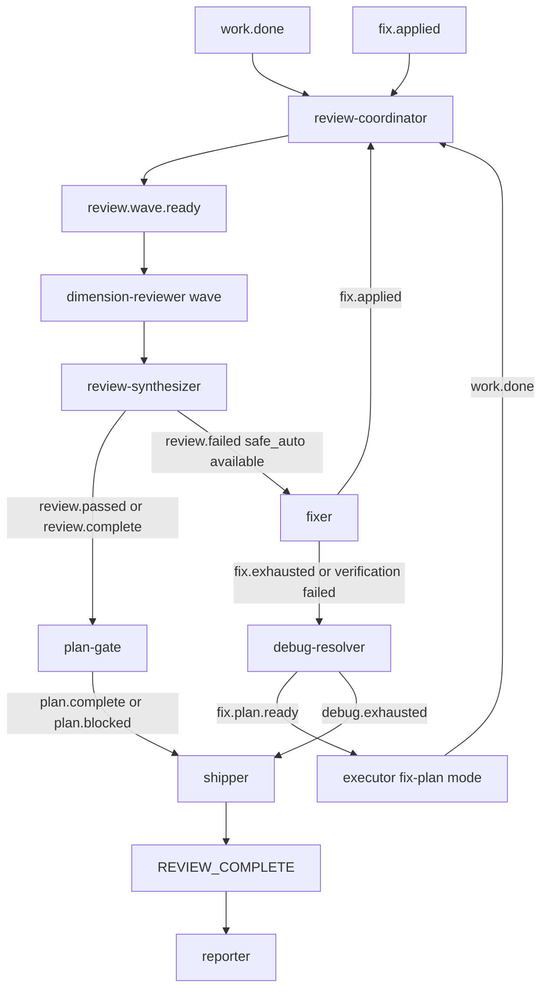
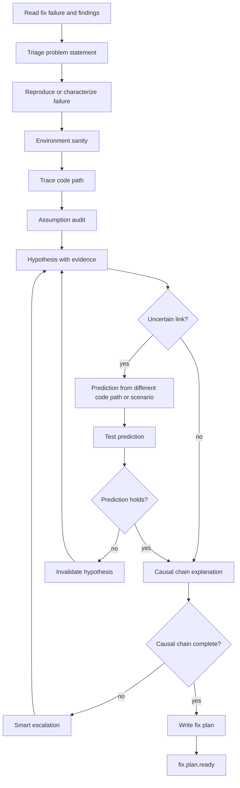
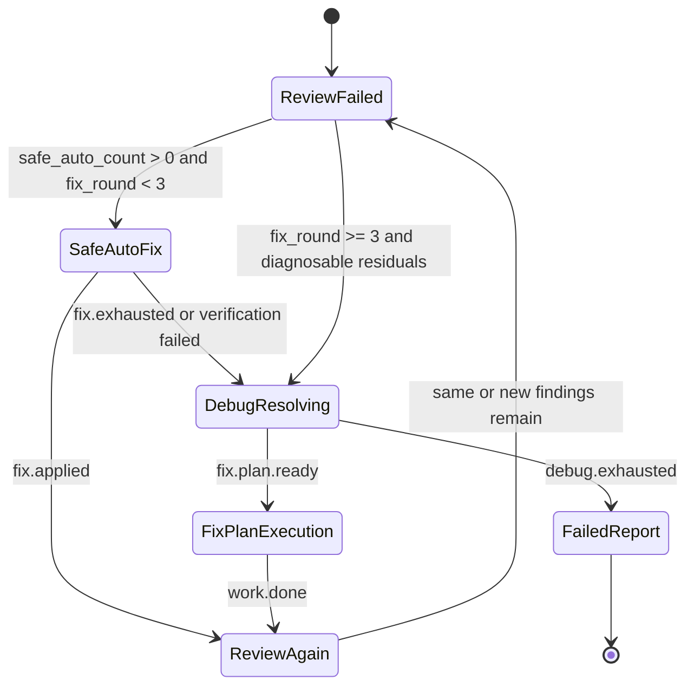

# feat: Add ce-executor debug resolver

## Summary

本计划把 compound-engineering 的 `ce-debug` 根因诊断能力移植进 `ce-executor`，但不原封不动复制交互式 skill。目标是在 `Fixer` 的 3 轮 `safe_auto` 快修失败后，不再直接把 `fix.exhausted` 送到最终失败报告，而是先进入新增的 `debug-resolver` hat：它按 `ce-debug` 的调查优先、假设预测、因果链门控和 smart escalation 规则诊断残留 finding，产出一个新的 `fix.plan.ready`，再交给 `Executor` 执行并重新 review。

---

## Problem Frame

当前 `ce-executor` 的自动修复链路是：

```text
review.failed -> fixer -> fix.applied -> review-coordinator -> review-synthesizer
```

当 `Fixer` 超过 3 轮或 post-fix verification 失败时，它发布 `fix.exhausted`，随后 `shipper` 发布 `REVIEW_COMPLETE pass_or_fail=fail`，`reporter` 输出 `awaiting_decision`。这条链路有一个明确优点：不会无限修，也不会伪装成功。但它没有解决用户质疑的核心问题：`safe_auto` 快修失败后，系统没有进入根因诊断，而是直接终止。

`ce-debug` 的原始工作流正好覆盖这个缺口：

- Phase 1 调查：复现、环境 sanity、追踪代码路径。
- Phase 2 根因：假设、证据、预测、因果链门控、smart escalation。
- Phase 3 修复：test-first、一次一个改动、失败后回到 Phase 2 并明确 invalidates hypothesis。
- 3 次失败后不是继续试，而是诊断为什么失败。

但是 `ce-debug` 也是一个交互式 skill。它包含用户选择 gate、workspace/branch check、默认分支建分支、commit/PR、learning capture 等流程。这些不能直接塞入 `ce-executor`，因为 `ce-executor` 是 preset 内的自动 hat 编排，且当前 guardrails 明确禁止 agent 创建/切换分支、push、PR。正确做法是移植 `ce-debug` 的诊断原则和修复纪律，而不是移植它的交互收尾流程。

---

## Requirements

### Debug Capability

- R1. `ce-executor` 必须新增一个独立的 `debug-resolver` hat，用于处理 `Fixer` 快修失败后的残留 finding。
- R2. `debug-resolver` 必须吸收 `ce-debug` 的核心原则：先调查再修复、对不确定链路提出 prediction、一次只验证一个 hypothesis、卡住时做 smart escalation。
- R3. `debug-resolver` 在根因未确认前不得发布可执行修复计划；必须先通过 causal chain gate。
- R4. `debug-resolver` 必须区分“根因已确认可修”“根因未确认”“设计/需求问题”“环境问题”四类结果。
- R5. 当根因确认且可修时，`debug-resolver` 必须发布 `fix.plan.ready`，而不是直接进行大范围代码修改。
- R6. 当根因无法确认、证据矛盾、需要产品/架构决策或超出自动修复边界时，`debug-resolver` 必须发布 `debug.exhausted` 或 `plan.blocked`，不能继续猜测。

### Fixer Boundary

- R7. `Fixer` 仍然只处理 `autofix_class: safe_auto`，不承担根因诊断。
- R8. `Fixer` 仍然最多 3 轮；3 轮不是“继续自动修”的次数上限，而是从快修模式升级到 debug-resolver 的阈值。
- R9. `Fixer` 的 verification failed 路径应优先进入 debug-resolver，除非当前工作树不可恢复或缺少足够上下文。
- R10. `Fixer` 不得处理 `gated_auto`、`manual`、`advisory` 或 `pre_existing` findings；这些仍由 review-synthesizer / plan-gate / shipper 的既有规则处理。

### Executor Fix Plan Mode

- R11. `Executor` 必须新增 `fix.plan.ready` trigger，并进入明确的 fix-plan execution mode。
- R12. fix-plan execution mode 只能执行 `debug-resolver` 产出的 fix plan，不能顺手推进原 plan 的下一个 Implementation Unit。
- R13. `Executor` 执行 fix plan 后仍必须发布正常 `work.done`，并重新进入 `review-coordinator` / `review-synthesizer` 复审。
- R14. `fix.plan.ready` payload 必须携带 `plan_name`、`task_id`、`task_key`、`step`，保持 task correlation 不丢失。

### Event Topology and Completion Safety

- R15. `fix.exhausted` 不应再无条件直达 `shipper`；当仍有可诊断上下文时，应先进入 `debug-resolver`。
- R16. `debug.fixed` 或 `fix.plan.ready -> executor -> work.done` 后必须重新 review；不得跳过 review 直达 `plan-gate`。
- R17. `debug.exhausted` 必须能到达 `shipper`，并最终生成 `REVIEW_COMPLETE pass_or_fail=fail` 和 manager-facing report。
- R18. `plan-gate` 不应监听 `fix.applied` 或 `debug.fixed`；通过 review 的结果仍是唯一进入 plan-wide gate 的路径。
- R19. `reporter` 仍不得在 `pass_or_fail == "fail"` 时发布 `LOOP_COMPLETE`，除非现有 verdict gate/required event 语义明确允许失败报告完成当前 loop；失败必须体现为 awaiting decision。

### Schema and Preset Synchronization

- R20. `presets/en/ce-executor.yml` 的内联 `event_policy.schemas` 必须新增或调整所有 debug 相关 topic schema。
- R21. `presets/schemas/ce-executor.yml` 作为 deprecated reference copy，必须与内联 schema 同步。
- R22. `presets/zh/ce-executor-zh.yml` 必须同步同构 hat、triggers、publishes、schema 字段和关键行为规则。
- R23. `crates/ralph-cli/src/presets.rs` 必须新增静态测试，防止 English/ZH、root/embedded、schema/reference copy 和 origin guard 链路漂移。
- R24. 如果新增或重命名 builtin preset，必须同步 zsh completion；本计划不新增 builtin preset 名称，因此不应修改 completion 列表。

### Verification

- R25. 必须有测试证明 `Fixer` 3 轮失败后会路由到 `debug-resolver`，而不是直接进入最终 shipper。
- R26. 必须有测试证明 `debug-resolver` 发布的 `fix.plan.ready` 会激活 `executor`，且 executor 之后重新走 review 链。
- R27. 必须有测试证明 `debug.exhausted` 保留 failure reporting path，不能卡住或被错误判为 pass。
- R28. 必须有测试证明 `fix.plan.ready`、`debug.exhausted`、新增 debug topic 都有 event policy schema，且 origin guard 接受对应发布者。

---

## High-Level Technical Design

### Updated Event Topology



### Debug Resolver Internal Flow



### State Transition for Fix Attempts



---

## Key Technical Decisions

- KTD1. **新增 `debug-resolver`，不把 ce-debug 塞进 Fixer。** `Fixer` 的价值是快、窄、确定，只应用 `safe_auto`；根因调查需要读代码、构造假设、验证 prediction，会污染 `Fixer` 的职责。独立 hat 能让 3 轮快修失败后的状态升级更清晰。

- KTD2. **移植 ce-debug 的诊断纪律，不移植交互式 skill 的用户 gate。** `ce-debug` 的 “Fix it now / Diagnosis only / Rethink design” 是交互工作流；`ce-executor` 是自动 preset。这里应把这些分支改成事件：可修发布 `fix.plan.ready`，设计/需求问题发布 `plan.blocked`，无法确认发布 `debug.exhausted`。

- KTD3. **移植 ce-debug 的 Phase 1/2 为 debug-resolver 主体。** 必须包含 reproduce/characterize、environment sanity、trace code path、assumption audit、hypothesis、prediction、causal chain gate、smart escalation。没有完整因果链时不得产出修复计划。

- KTD4. **不移植 ce-debug 的 branch/PR/commit 流程。** `ce-executor` guardrails 明确禁止 agent 创建、切换、重命名分支，也禁止 push/PR；shipper 才负责最终本地提交。debug-resolver 不得运行 branch creation，也不得调用 PR/commit 工作流。

- KTD5. **debug-resolver 产出 fix plan，Executor 负责实施。** 这保留 `Executor` 作为唯一 plan/fix plan 实施者的边界，也让 execution contract、`work.done` task correlation 和 review loop 继续复用已有机制。

- KTD6. **`fix.exhausted` 从终止信号改为升级信号，但保留最终失败出口。** 当 `Fixer` 失败且还有当前 finding/task/context 时，先给 debug-resolver；当 debug-resolver 也不能建立根因或发现需人工决策，再进入 `debug.exhausted -> shipper -> reporter`。

- KTD7. **所有新增事件必须 schema-first。** 当前 builtin preset 已经把 schemas 内联到 `event_policy.schemas`，`presets/schemas/ce-executor.yml` 只是 reference copy。实施时必须先定义内联 schema，再同步 reference copy 和中文 preset，避免 `SchemaMissingForRequiredTopic`。

- KTD8. **review 仍然是修复后的唯一质量门。** 即使 debug-resolver 诊断准确、executor 执行 fix plan 成功，也必须重新进入 review-coordinator/wave/synthesizer。`debug.fixed` 不能直接进 plan-gate。

---

## Scope Boundaries

### In Scope

- 修改 `presets/en/ce-executor.yml` 的 hats、事件拓扑、instructions 和内联 schema。
- 同步修改 `presets/zh/ce-executor-zh.yml`。
- 同步修改 `presets/schemas/ce-executor.yml` reference copy。
- 新增 `debug-resolver` hat，并将 `ce-debug` 的调查/根因/因果链/smart escalation 规则适配为 preset instructions。
- 为 `Executor` 增加 `fix.plan.ready` 的 fix-plan execution mode。
- 调整 `Fixer` 的 exhausted/verification failed 路由，使其优先升级到 debug-resolver。
- 调整 `shipper`，让 `debug.exhausted` 进入失败报告路径。
- 增加 preset 静态测试、schema 测试、origin guard / publish chain 测试。
- 必要时更新 `docs/solutions/`，记录 `safe_auto` 失败后应升级到根因诊断的 preset 模式。

### Out of Scope

- 不新增新的 builtin preset 名称；仍然是 `builtin:ce-executor`。
- 不把 compound-engineering plugin 的 skill runtime 或文件加载机制嵌进 Ralph。
- 不让 `ce-executor` 自动创建/切换分支。
- 不让 `debug-resolver` 直接 push、PR 或调用 commit skill。
- 不放宽 `Fixer` 对 `gated_auto/manual/advisory/pre_existing` 的边界。
- 不改变 `dimension-reviewer` finding schema 的核心字段，除非 debug-resolver 需要读取现有字段。
- 不重写 event loop core；本计划优先通过 preset hat 拓扑和 schema 完成。

### Deferred to Follow-Up Work

- 把 `ce-debug` 作为 first-class Ralph skill injection，让 preset hat 可以引用 skill 文档片段而不是复制 instructions。
- 为所有 preset 建立统一 “fast fix -> debug resolver -> executor fix plan” 模式库。
- 在 TUI/diagnostics 中单独展示 debug-resolver 的 hypothesis、prediction 和 causal chain。
- 将 debug-resolver 的 diagnosis artifacts 结构化成机器可查询 JSON，而不只是 markdown。

---

## Compound Engineering Source Mapping

本计划不是重新发明 debug 流程；`debug-resolver` 的 instruction 内容必须从 compound-engineering-plugin 的 `ce-debug` skill 精确移植并适配。实施时按下表从源文件抽取能力，不得只写泛泛的“参考 ce-debug”。

| Source file and lines | Source capability | Target in ce-executor | Adaptation rule |
|---|---|---|---|
| `/home/chaowen/Dev/agent_tools/compound-engineering-plugin/plugins/compound-engineering/skills/ce-debug/SKILL.md:13-18` | Core Principles：先调查再修、prediction、一次一个 hypothesis、卡住时诊断原因 | `debug-resolver` instructions 的 `Core Principles` 小节 | 原则整体移植；保留英文关键短语 `Investigate before fixing`、`Predictions for uncertain links`、`One change at a time`、`When stuck, diagnose why`，便于测试断言 |
| `/home/chaowen/Dev/agent_tools/compound-engineering-plugin/plugins/compound-engineering/skills/ce-debug/SKILL.md:20-30` | Phase 0-4 总流程 | `debug-resolver` instructions 的阶段结构 | Phase 0-2 原样转为诊断阶段；Phase 3 从“直接 fix”适配为“产出 fix plan”；Phase 4 从交互 handoff 适配为写 scratchpad artifacts 并发事件 |
| `/home/chaowen/Dev/agent_tools/compound-engineering-plugin/plugins/compound-engineering/skills/ce-debug/SKILL.md:34-55` | Triage、问题 statement、先调查、prior-attempt awareness | `debug-resolver` 的 `Triage` / `Read State` | issue tracker fetch 不移植为默认行为；`fix.exhausted` payload、`fix-log.md`、`findings.md` 是问题来源；prior attempts 来自 `fix-log.md` round 记录 |
| `/home/chaowen/Dev/agent_tools/compound-engineering-plugin/plugins/compound-engineering/skills/ce-debug/SKILL.md:59-69` | Reproduce bug、无法复现时记录条件、写 reproduction test | `debug-resolver` 的 `Investigate` 和 `fix.plan.ready.recommended_tests` | 允许 characterization/reproduction，不要求 live issue；推荐测试必须进入 `fix.plan.ready` payload，交给 executor 实施 |
| `/home/chaowen/Dev/agent_tools/compound-engineering-plugin/plugins/compound-engineering/skills/ce-debug/SKILL.md:71-80` | Environment sanity | `debug-resolver` 的 `Environment Sanity` | 移植为只读检查和记录；不得因该阶段创建分支或改环境；环境问题发布 `debug.exhausted` 或 `plan.blocked` |
| `/home/chaowen/Dev/agent_tools/compound-engineering-plugin/plugins/compound-engineering/skills/ce-debug/SKILL.md:82-103` | Trace code path，找到 valid state 变 invalid 的起点 | `debug-resolver` 的 `Trace Code Path` | 原样移植为根因定位要求；输出到 `debug-summary.md` 的 `Causal Chain` |
| `/home/chaowen/Dev/agent_tools/compound-engineering-plugin/plugins/compound-engineering/skills/ce-debug/SKILL.md:107-133` | Root Cause、anti-patterns、assumption audit、hypothesis、prediction、causal chain gate | `debug-resolver` 的核心 `Root Cause` 阶段 | 必须完整移植；没有 causal chain 不得发布 `fix.plan.ready`；prediction 结果写入 `debug-hypotheses.md` |
| `/home/chaowen/Dev/agent_tools/compound-engineering-plugin/plugins/compound-engineering/skills/ce-debug/SKILL.md:135-161` | confirmed root cause 后提出 fix/tests，设计问题建议 brainstorm | `debug-resolver` 的结果路由 | 用户选择菜单不移植；可修发布 `fix.plan.ready`，设计/需求问题发布 `plan.blocked`，不可确认发布 `debug.exhausted` |
| `/home/chaowen/Dev/agent_tools/compound-engineering-plugin/plugins/compound-engineering/skills/ce-debug/SKILL.md:163-176` | Smart escalation table 和 read-only parallel investigation | `debug-resolver` 的 `Smart Escalation` | 表格四类诊断要移植；parallel sub-agent 不移植为默认要求，因 `ce-executor` 禁止 agent 调用 parallel subagent，改为顺序 probes |
| `/home/chaowen/Dev/agent_tools/compound-engineering-plugin/plugins/compound-engineering/skills/ce-debug/SKILL.md:180-206` | Phase 3 Fix：test-first、minimal fix、failed fix invalidates hypothesis、3 failed attempts escalation、defense-in-depth trigger | `executor` 的 `FIX PLAN EXECUTION MODE`，以及 `debug-resolver` 的 fix-plan 内容要求 | test-first/minimal fix/one change 迁移到 executor；failed fix invalidation 作为 executor 失败回流规则；workspace/branch check 不移植 |
| `/home/chaowen/Dev/agent_tools/compound-engineering-plugin/plugins/compound-engineering/skills/ce-debug/SKILL.md:210-252` | Debug Summary、commit/PR/learning capture 收尾 | `debug-resolver` artifacts 和 reporter failure summary | 只移植 Debug Summary 字段；commit/PR/branch-owned flow、post-fix menu、learning prompt 不移植 |
| `/home/chaowen/Dev/agent_tools/compound-engineering-plugin/plugins/compound-engineering/skills/ce-debug/references/anti-patterns.md:7-23` | Prediction quality：prediction 必须测试不同路径/observable | `debug-resolver` 的 hypothesis/prediction quality gate | 作为 instruction 中的 prediction 质量标准，测试断言包含 `different code path or scenario` |
| `/home/chaowen/Dev/agent_tools/compound-engineering-plugin/plugins/compound-engineering/skills/ce-debug/references/anti-patterns.md:27-35` | Shotgun debugging 禁止多改动试错 | `executor` fix-plan mode | 迁移为 `one hypothesis, one change, one verification`，并禁止 debug-resolver 直接修改代码 |
| `/home/chaowen/Dev/agent_tools/compound-engineering-plugin/plugins/compound-engineering/skills/ce-debug/references/anti-patterns.md:39-48` | Confirmation bias 防护 | `debug-resolver` Root Cause 阶段 | 要求每个 hypothesis 写出可证伪条件 |
| `/home/chaowen/Dev/agent_tools/compound-engineering-plugin/plugins/compound-engineering/skills/ce-debug/references/anti-patterns.md:52-61` | “It works now” 不是根因确认 | `executor` fix-plan mode 和 review loop | executor 修好后仍必须 review；不能因测试变绿跳过 causal chain/report |
| `/home/chaowen/Dev/agent_tools/compound-engineering-plugin/plugins/compound-engineering/skills/ce-debug/references/anti-patterns.md:65-77` | shortcut warning signs | `debug-resolver` instructions | 作为禁止项：不得 quick fix、不得无证据确定、不得忽略环境差异 |
| `/home/chaowen/Dev/agent_tools/compound-engineering-plugin/plugins/compound-engineering/skills/ce-debug/references/anti-patterns.md:81-91` | Smart escalation patterns | `debug-resolver` Smart Escalation | 四类模式必须出现在 debug-resolver instructions 或 artifacts 模板 |
| `/home/chaowen/Dev/agent_tools/compound-engineering-plugin/plugins/compound-engineering/skills/ce-debug/references/investigation-techniques.md:7-37` | Root-cause backward tracing 和 instrumentation | `debug-resolver` Trace Code Path | 迁移 tracing 方法；instrumentation 只能用于调查/测试，不得留下无关 debug 输出 |
| `/home/chaowen/Dev/agent_tools/compound-engineering-plugin/plugins/compound-engineering/skills/ce-debug/references/investigation-techniques.md:41-75` | Multi-component boundary instrumentation | `debug-resolver` 对跨系统 finding 的调查方法 | 作为条件策略：当 finding 跨 CLI/event/preset/runtime 边界时使用 |
| `/home/chaowen/Dev/agent_tools/compound-engineering-plugin/plugins/compound-engineering/skills/ce-debug/references/investigation-techniques.md:79-99` | Git bisect for regressions | `debug-resolver` 可选调查技术 | 可作为只读调查建议；不得因 bisect 创建/切换长期分支，使用后必须回到原状态 |
| `/home/chaowen/Dev/agent_tools/compound-engineering-plugin/plugins/compound-engineering/skills/ce-debug/references/investigation-techniques.md:103-161` | intermittent bug、repro minimization | `debug-resolver` 可选调查技术 | 用于无法稳定复现的 residual finding；结果写入 `debug-summary.md` |
| `/home/chaowen/Dev/agent_tools/compound-engineering-plugin/plugins/compound-engineering/skills/ce-debug/references/investigation-techniques.md:187-244` | debugger vs instrumentation、race investigation | `debug-resolver` 可选调查技术 | 仅在 timing/concurrency 类 finding 中启用 |
| `/home/chaowen/Dev/agent_tools/compound-engineering-plugin/plugins/compound-engineering/skills/ce-debug/references/defense-in-depth.md:1-35` | defense-in-depth 触发条件和四层模型 | `debug-resolver` fix plan 的可选 `defense_in_depth` 字段 | 只在 root-cause pattern 3+ 处或高危生产风险时建议；不作为默认 padding |

### Non-Portable Source Sections

以下 `ce-debug` 段落不能直接移植进 `ce-executor`，只能转成事件或删除：

- `/home/chaowen/Dev/agent_tools/compound-engineering-plugin/plugins/compound-engineering/skills/ce-debug/SKILL.md:145-153` 的用户选择菜单：在 `ce-executor` 中改为 `fix.plan.ready` / `plan.blocked` / `debug.exhausted` 事件。
- `/home/chaowen/Dev/agent_tools/compound-engineering-plugin/plugins/compound-engineering/skills/ce-debug/SKILL.md:186-189` 的 workspace/default branch 建分支提示：与 `ce-executor` 禁分支规则冲突，不移植。
- `/home/chaowen/Dev/agent_tools/compound-engineering-plugin/plugins/compound-engineering/skills/ce-debug/SKILL.md:228-242` 的 skill-owned branch commit-and-PR：与 `ce-executor` 禁 push/PR 和 shipper-owned local commit 边界冲突，不移植。
- `/home/chaowen/Dev/agent_tools/compound-engineering-plugin/plugins/compound-engineering/skills/ce-debug/SKILL.md:244-252` 的 learning capture prompt：作为后续 `docs/solutions/` 可选文档任务，不进自动 debug-resolver 事件链。

---

## Implementation Units

### U1. 定义 debug-resolver 事件契约和 schema

**Goal:** 先把新增事件的契约钉住，避免后续 hat instructions 引用未声明字段或 origin guard 拒绝。

**Requirements:** R14, R17, R20, R21, R22, R28

**Dependencies:** None

**Files:**

- Modify: `presets/en/ce-executor.yml`
- Modify: `presets/zh/ce-executor-zh.yml`
- Modify: `presets/schemas/ce-executor.yml`
- Test: `crates/ralph-cli/src/presets.rs`

**Approach:**

- 在英文 preset 的 `event_policy.schemas` 中新增：
  - `fix.plan.ready`
  - `debug.exhausted`
- 如果实施时需要更细粒度可观测性，可以新增 `debug.started` 或 `debug.diagnosis.ready`，但默认不增加，避免无意义事件膨胀。
- `fix.plan.ready.required_fields` 至少包含：
  - `plan_name`
  - `task_id`
  - `task_key`
  - `step`
  - `root_cause_summary`
  - `causal_chain`
  - `recommended_tests`
  - `fix_plan`
- `debug.exhausted.required_fields` 至少包含：
  - `plan_name`
  - `reason`
  - `task_id`
  - `task_key`
  - `step`
  - `debug_summary`
- `fix.exhausted` schema 保持能被 fixer 发布，但后续 routing 将先命中 debug-resolver。
- 同步 `presets/schemas/ce-executor.yml` reference copy。
- 同步中文 preset 内联 schema。
- 在 `crates/ralph-cli/src/presets.rs` 增加测试：
  - 英文 preset 定义新增 schemas。
  - 中文 preset 对应 schemas 字段集合与英文一致。
  - reference copy 至少包含同名 topics 和 required fields。

**Patterns to follow:**

- `presets/COLLECTION.md` 中 builtin schema inline 的规则。
- 现有 `test_ce_executor_work_done_field_consistency` 和 `test_ce_executor_zh_failure_topics_match_en_reason_only_schema`。

**Test scenarios:**

- Happy path: `fix.plan.ready` schema 要求 task correlation 和 debug plan 字段。
- Happy path: `debug.exhausted` schema 要求 reason、task correlation 和 debug summary。
- Regression: 中文 preset 缺少任一新增 schema 字段时测试失败。
- Regression: reference copy 漂移时测试失败或 sync check 暴露差异。

**Verification:** 解析英文/中文 YAML 后，`event_policy.schemas` 中所有新增 topic 均存在且 required fields 符合计划。

### U2. 新增 debug-resolver hat 并移植 ce-debug 诊断纪律

**Goal:** 将 `ce-debug` 的 investigation/root-cause/smart escalation 能力转成 `ce-executor` 内的非交互式 hat。

**Requirements:** R1, R2, R3, R4, R5, R6

**Dependencies:** U1

**Files:**

- Modify: `presets/en/ce-executor.yml`
- Modify: `presets/zh/ce-executor-zh.yml`
- Test: `crates/ralph-cli/src/presets.rs`

**Approach:**

- 新增 hat：
  - key: `debug-resolver`
  - name: `Debug Resolver`
  - triggers: `["fix.exhausted"]`
  - publishes: `["fix.plan.ready", "debug.exhausted", "plan.blocked"]`
  - default_publishes: `debug.exhausted`
- Instructions 按 `ce-debug` 原始流程移植：
  - Phase 0 Triage：从 `fix.exhausted` payload、`fix-log.md`、`findings.md`、`context.md`、`plan.md` 提炼问题 statement。来源：`/home/chaowen/Dev/agent_tools/compound-engineering-plugin/plugins/compound-engineering/skills/ce-debug/SKILL.md:34-55`。
  - Phase 1 Investigate：复现或 characterization；检查环境 sanity；从 finding symptom 反向追踪到 bad state 起点。来源：`/home/chaowen/Dev/agent_tools/compound-engineering-plugin/plugins/compound-engineering/skills/ce-debug/SKILL.md:59-103`。
  - Phase 2 Root Cause：读取 anti-patterns 精神规则；做 assumption audit；形成 hypothesis；为不确定链路写 prediction；验证 prediction；通过 causal chain gate。来源：`/home/chaowen/Dev/agent_tools/compound-engineering-plugin/plugins/compound-engineering/skills/ce-debug/SKILL.md:107-133` 和 `references/anti-patterns.md:7-91`。
  - Smart escalation：2-3 个 hypothesis 或 fix attempts 被证伪后，按 `ce-debug` 表格判断是架构/设计问题、mental model 错、环境差异还是 symptom fix。来源：`/home/chaowen/Dev/agent_tools/compound-engineering-plugin/plugins/compound-engineering/skills/ce-debug/SKILL.md:163-176`。
  - Phase 3 Plan：只写 fix plan，不直接大修；test-first / minimal fix / failed hypothesis invalidation 交给 executor fix-plan mode。来源：`/home/chaowen/Dev/agent_tools/compound-engineering-plugin/plugins/compound-engineering/skills/ce-debug/SKILL.md:180-206`。
  - Phase 4 Handoff equivalent：只移植 Debug Summary 字段，写 `debug-summary.md` 到 scratchpad，并通过事件发布结果。来源：`/home/chaowen/Dev/agent_tools/compound-engineering-plugin/plugins/compound-engineering/skills/ce-debug/SKILL.md:210-222`。
- Explicit adaptations:
  - 删除用户选择 gate，改为事件分支。
  - 删除 branch creation/default branch prompt。
  - 删除 commit/PR/push/handoff 菜单。
  - 保留 “failed fix 后 invalidate hypothesis” 规则，但让 executor 的 fix-plan failure 回到 review/fixer/debug 链路表达。
- Debug artifacts 写入：
  - `.agents/scratchpad/ce-executor/{plan_name}/debug-summary.md`
  - `.agents/scratchpad/ce-executor/{plan_name}/debug-hypotheses.md`
  - 可选 `.agents/scratchpad/ce-executor/{plan_name}/fix-plan.md`

**Patterns to follow:**

- compound-engineering `ce-debug` 的 Core Principles、Phase 1、Phase 2、Smart escalation、Phase 3 failed fix invalidation，具体来源见 `Compound Engineering Source Mapping`。
- `ce-executor` 现有 `fixer` 和 `plan-gate` 的 fail-closed default style。

**Test scenarios:**

- Static parse: `debug-resolver` 存在，triggers/publishes/default_publishes 符合计划。
- Text invariant: instructions 包含 `Investigate before fixing` 或中文等价规则。
- Text invariant: instructions 包含 `causal chain gate`、`prediction`、`assumption audit`、`smart escalation`。
- Text invariant: instructions 禁止 branch creation、push、PR。
- Regression: `debug-resolver` 不发布 `work.done`，避免绕过 executor。

**Verification:** `debug-resolver` 的 instructions 能被审查者直接追溯到 `ce-debug` 的关键阶段，同时不包含与 `ce-executor` guardrails 冲突的交互/分支/PR流程。

### U3. 调整 Fixer exhausted 路由为 debug escalation

**Goal:** 让 `Fixer` 的 3 轮上限从“直接最终失败”变成“快修失败后升级到 debug-resolver”。

**Requirements:** R7, R8, R9, R10, R15, R25

**Dependencies:** U1, U2

**Files:**

- Modify: `presets/en/ce-executor.yml`
- Modify: `presets/zh/ce-executor-zh.yml`
- Test: `crates/ralph-cli/src/presets.rs`

**Approach:**

- 保留 `Fixer`：
  - triggers: `["review.failed"]`
  - publishes: `["fix.applied", "fix.exhausted"]`
  - default_publishes: `fix.exhausted`
- 修改 `Fixer` instructions 的含义：
  - `fix_round + 1 > 3` 时发布 `fix.exhausted`，但描述为 “escalate to debug-resolver”，不是 “final failure”。
  - post-fix verification failed 时也发布 `fix.exhausted`，payload 附带 `reason`、`residual_findings`、`failed_attempt_summary`。
  - 必须把 `task_id/task_key/step` 带下去，供 debug-resolver 和 executor fix-plan mode 使用。
- 修改文件头架构说明：
  - 从 “Auto-Fix -> Ship” 改成 “Auto-Fix -> Debug Resolver -> Fix Plan -> Review -> Ship”。
- 修改 `shipper.triggers`：
  - 如果当前是 `["plan.complete", "plan.blocked", "fix.exhausted"]`，计划改为 `["plan.complete", "plan.blocked", "debug.exhausted"]`。
  - 只有 debug-resolver 无法继续时才到 shipper。
- 如果要保留 `shipper` 对 `fix.exhausted` 的兜底监听，需要明确它只处理 “debug-resolver unavailable / malformed payload” 的 fail-closed path，默认正常路径仍由 debug-resolver 接管。推荐第一版移除 shipper 的 `fix.exhausted` trigger，使拓扑更明确。

**Patterns to follow:**

- 现有 `test_ce_executor_shipper_triggers_finalization_only`。
- 现有 `test_ce_executor_fixer_exhausted_early_exit_keeps_task_correlation`。

**Test scenarios:**

- Happy path: `fixer.publishes` 仍包含 `fix.exhausted`，且 `debug-resolver.triggers` 包含 `fix.exhausted`。
- Regression: 正常 finalization shipper 不再直接处理 `fix.exhausted`，或只在计划明确的兜底模式处理。
- Regression: `Fixer` exhausted section 仍包含 `task_id`、`task_key`、`step`。
- Regression: `Fixer` instructions 仍禁止处理 gated/manual/advisory/pre-existing findings。

**Verification:** `Fixer` 作为 safe_auto 快修器的边界不变，但 exhausted 后拓扑进入 debug-resolver。

### U4. 为 Executor 增加 fix-plan execution mode

**Goal:** 让 debug-resolver 的根因诊断结果进入已有执行和 review contract，而不是新增一个能直接改代码并宣布成功的 hat。

**Requirements:** R11, R12, R13, R14, R16, R26

**Dependencies:** U1, U2, U3

**Files:**

- Modify: `presets/en/ce-executor.yml`
- Modify: `presets/zh/ce-executor-zh.yml`
- Test: `crates/ralph-cli/src/presets.rs`

**Approach:**

- 修改 executor：
  - triggers 增加 `fix.plan.ready`。
  - Read State 中新增分支：从 `fix.plan.ready` 读取 `plan_name`、`task_id`、`task_key`、`step`、`root_cause_summary`、`causal_chain`、`recommended_tests`、`fix_plan`。
  - 进入 `FIX PLAN EXECUTION MODE`。
- Fix plan mode rules:
  - 只执行 `fix_plan` 里指定的修复，不推进 `plan.md` 的下一 step。
  - 先根据 `recommended_tests` 写或更新失败测试/characterization 测试。
  - 一次只做一个 root-cause fix；不得 shotgun debugging。
  - 如果实施发现 prediction 不成立或 causal chain 不完整，发布 `work.failed` 或专门的 `debug.exhausted` 回路，而不是强行改。
  - 修复完成后按现有 `work.done` contract 发布 `work.done`，包含 `plan_name`、`plan_path`、`task_id`、`task_key`、`step`。
- `review-coordinator` 已监听 `work.done`，无需新增 debug-specific review 入口。
- `plan-gate` 仍只处理 review 结果，不监听 `fix.plan.ready`。

**Patterns to follow:**

- Executor 现有 `work.ready` / `queue.advance` Read State 分支。
- `ce-debug` Phase 3 的 test-first、one change at a time、failed fix invalidation。
- `docs/solutions/developer-experience/agent-execution-contract-gates-2026-06-03.md` 对 `work.done` required fields 的约束。

**Test scenarios:**

- Static parse: executor triggers 包含 `fix.plan.ready`。
- Text invariant: executor instructions 有 `FIX PLAN EXECUTION MODE` 或中文等价段落。
- Text invariant: fix-plan mode 包含 root cause summary、causal chain、recommended tests、fix plan 字段。
- Regression: executor `publishes` 仍只有 `work.done` / `work.failed`，不发布 review 或 plan-gate topic。
- Regression: executor no `default_publishes`。

**Verification:** `fix.plan.ready` 可以激活 executor；executor 执行后必须通过 `work.done` contract 和 review 链验证。

### U5. 调整 shipper/reporter 失败报告路径

**Goal:** 保留 debug-resolver 失败后的 manager-facing 报告，同时避免 `fix.exhausted` 过早终止。

**Requirements:** R17, R18, R19, R27

**Dependencies:** U1, U2, U3

**Files:**

- Modify: `presets/en/ce-executor.yml`
- Modify: `presets/zh/ce-executor-zh.yml`
- Test: `crates/ralph-cli/src/presets.rs`

**Approach:**

- 修改 shipper triggers：
  - 推荐：`["plan.complete", "plan.blocked", "debug.exhausted"]`
  - 如果必须保留 `fix.exhausted`，需要在 instructions 中明确它只是 malformed/no-debug fallback，并新增测试区分正常 debug escalation。
- `shipper` Read State 新增 `debug.exhausted`：
  - 读取 `plan_name`、`reason`、`debug_summary`、`task_id`、`task_key`、`step`。
  - 读取 `debug-summary.md`、`debug-hypotheses.md`、`findings.md`、`fix-log.md`。
- `shipper` Event Publishing：
  - 对 `debug.exhausted` 发布 `REVIEW_COMPLETE` with `pass_or_fail: "fail"`、`verdict: "fail"`。
  - `residual_findings_summary` 必须包含 debug-resolver 的原因和是否需要人工/架构/环境决策。
- `reporter`：
  - 失败报告中区分 `fix exhausted` 与 `debug exhausted`。
  - 不把 debug exhausted 伪装为 pass。
  - 保留 `awaiting_decision: true`。

**Patterns to follow:**

- 当前 shipper 对 `plan.blocked` / `fix.exhausted` 的 guarded sections。
- `verdict_gate` 读取 `REVIEW_COMPLETE pass_or_fail` 的现有契约。

**Test scenarios:**

- Happy path: `debug.exhausted` 有 shipper subscriber。
- Failure path: shipper instructions 明确 `debug.exhausted` 发布 `pass_or_fail: "fail"`。
- Regression: plan.complete 仍是唯一会 mark plan completed 和 commit 的路径。
- Regression: reporter 在 failure path 不发布 `LOOP_COMPLETE` 或按现有 awaiting decision 规则处理。

**Verification:** debug-resolver 失败不会卡死，也不会被误报成功。

### U6. 更新 origin guard / publish chain / schema 静态测试

**Goal:** 用测试固定新拓扑，防止新增 debug 链路被 origin guard、schema gate 或中英文漂移破坏。

**Requirements:** R20, R21, R22, R23, R25, R26, R27, R28

**Dependencies:** U1, U2, U3, U4, U5

**Files:**

- Modify: `crates/ralph-cli/src/presets.rs`
- Test: `crates/ralph-cli/src/presets.rs`

**Approach:**

- 扩展 `test_ce_executor_publish_chain_origin_compatible`：
  - `fixer` 可发布 `fix.exhausted`。
  - `debug-resolver` 可订阅 `fix.exhausted`。
  - `debug-resolver` 可发布 `fix.plan.ready`、`debug.exhausted`、`plan.blocked`。
  - `executor` 可订阅 `fix.plan.ready`。
  - `shipper` 可订阅 `debug.exhausted`。
- 新增 tests：
  - `test_ce_executor_debug_resolver_exists_and_routes_correctly`
  - `test_ce_executor_executor_accepts_fix_plan_ready`
  - `test_ce_executor_shipper_handles_debug_exhausted_not_fix_exhausted`
  - `test_ce_executor_debug_topics_have_schemas`
  - `test_ce_executor_zh_debug_topology_matches_en`
- 如果 reference copy schema 有读取工具，增加 reference copy 同步测试；如果没有，至少用文本/YAML parse 对 reference copy required fields 做断言。

**Patterns to follow:**

- 现有 `test_ce_executor_plan_gate_exists_and_routes_correctly`。
- 现有 `test_ce_executor_shipper_triggers_finalization_only`。
- 现有 `test_ce_executor_zh_plan_gate_matches_en`。

**Test scenarios:**

- Happy path: 从 `fix.exhausted` 可达 `debug-resolver -> fix.plan.ready -> executor -> work.done -> review-coordinator`。
- Failure path: 从 `fix.exhausted` 可达 `debug-resolver -> debug.exhausted -> shipper -> REVIEW_COMPLETE -> reporter`。
- Regression: `plan-gate` 不监听 `fix.plan.ready`、`fix.applied`、`debug.exhausted`。
- Regression: `debug-resolver` 不发布 `work.done`。
- Regression: 所有新增 debug topic 都在 schema 中声明。

**Verification:** 相关 `ralph-cli` preset tests 在旧拓扑下失败，在新拓扑下通过。

### U7. 更新文档和 preset 维护说明

**Goal:** 记录 safe_auto 失败后升级到 debug-resolver 的新模式，避免后续维护者把 3 轮机制重新理解为“修不了就直接失败”。

**Requirements:** R2, R7, R8, R23

**Dependencies:** U1, U2, U3, U4, U5, U6

**Files:**

- Modify: `presets/COLLECTION.md`
- Add: `docs/solutions/developer-experience/ce-executor-debug-resolver-after-safe-auto-exhaustion-2026-06-04.md`
- Modify if present/relevant: `docs/guide/presets.md`

**Approach:**

- 在 `presets/COLLECTION.md` 的 preset author guidance 或 payload contracts 区域补充：
  - safe_auto fixer 是快修器，不是 debugger。
  - 多轮 safe_auto 失败应升级到 root-cause resolver。
  - resolver 输出 fix plan，executor 执行，review 复核。
- 新增 solution doc：
  - 症状：safe_auto 3 轮失败后直接失败报告，缺少根因诊断。
  - 根因：Fixer 和 Debugger 职责混淆或缺少 debug-resolver。
  - 解决模式：`fix.exhausted -> debug-resolver -> fix.plan.ready -> executor -> review`。
  - 移植边界：移植 ce-debug 的调查/因果链/smart escalation，不移植 branch/PR/interactive menu。
- 如果 `docs/guide/presets.md` 对 `ce-executor` 有流程图或描述，同步更新；如果没有相关内容，不制造无意义文档 churn。

**Patterns to follow:**

- `docs/solutions/developer-experience/agent-execution-contract-gates-2026-06-03.md`
- `docs/solutions/developer-experience/ce-executor-plan-gate-premature-completion-2026-06-02.md`

**Test scenarios:**

- Test expectation: none -- 文档/solution 捕获，无直接行为变更。

**Verification:** 文档中的事件 topic 与最终 preset 拓扑一致；不包含绝对路径；不声称 compound-engineering plugin 被运行时动态加载。

---

## Acceptance Examples

- AE1. 当 review-synthesizer 发现 safe_auto finding 且 `fix_round < 3` 时，仍发布 `review.failed` 给 `Fixer`，保持快修路径。
- AE2. 当 `Fixer` 进入第 4 次尝试边界时，发布 `fix.exhausted`；下一跳是 `debug-resolver`，不是最终 `shipper`。
- AE3. 当 `Fixer` 修复后 full test suite 失败并回滚时，发布带 task correlation 的 `fix.exhausted`；`debug-resolver` 读取 `fix-log.md` 和 `findings.md` 后开始诊断。
- AE4. 当 debug-resolver 无法解释完整 causal chain 时，不发布 `fix.plan.ready`；它记录 hypothesis 被证伪的原因并继续调查或 smart escalation。
- AE5. 当 debug-resolver 确认根因并写出推荐测试与 fix plan 时，发布 `fix.plan.ready`；executor 被激活进入 fix-plan execution mode。
- AE6. 当 executor 执行 fix plan 后发布有效 `work.done` 时，review-coordinator 重新发起 wave review；plan-gate 不会直接接受 debug-resolver 的输出。
- AE7. 当 debug-resolver 判断问题是设计/需求边界，需要人工决策时，发布 `plan.blocked` 或 `debug.exhausted`，最终 reporter 输出 awaiting decision。
- AE8. 当新增 `fix.plan.ready` schema 缺少 `task_id` 或 `fix_plan` 时，preset 静态测试失败。

---

## Risks & Mitigations

| Risk | Impact | Mitigation |
|---|---|---|
| debug-resolver instructions 过长，agent 执行时漂移 | 诊断 hat 变成另一个随意 fixer | 用清晰阶段、禁止项和测试锁住关键短语；必要时把 artifacts 格式做成固定模板 |
| `fix.exhausted` 从 shipper 改路由后 failure path 卡住 | 自动 run 无法结束或无报告 | `debug.exhausted` 必须有 shipper subscriber；publish chain 测试覆盖 failure path |
| debug-resolver 直接修改代码 | 绕过 executor contract 和 review | instructions 明确禁止大修，测试断言 debug-resolver 不发布 `work.done` |
| Executor fix-plan mode 推进原 plan next step | 修复和正常实施混在一起 | fix-plan mode 明确只执行 payload fix_plan；完成后复审当前 task/step |
| 中英文 preset 或 reference schema 漂移 | 中文 preset 或 reference copy 失真 | 增加 EN/ZH topology/schema parity tests；同步 reference copy |
| 原版 ce-debug 的交互/分支/PR 规则被误植 | 违反 ce-executor guardrails | 计划和 tests 明确禁止 branch creation、push、PR、interactive menu |
| 3 轮 safe_auto 后 debug-resolver 仍在猜测 | 无限诊断或低质量 fix plan | causal chain gate + smart escalation；无法确认时必须 `debug.exhausted` |

---

## Documentation / Operational Notes

- 这是 builtin preset 行为变更，但不是新增 builtin preset 名称，不需要改 `scripts/ralph-zsh-plugin.zsh` 的 builtin completion 列表。
- 修改 `presets/en/ce-executor.yml` 后，构建时 `$OUT_DIR` 会由 manifest/build script 复制；测试仍应覆盖 canonical root preset 与 embedded content 一致。
- 当前 `presets/schemas/ce-executor.yml` 是 deprecated reference copy，但本计划仍要求同步，避免未来维护者读 reference copy 得到旧契约。
- 所有用户可见的新增计划/solution 文档使用中文；preset 技术 topic、payload 字段、hat key 保持英文标识符。

---

## Sources & Research

- `presets/en/ce-executor.yml`：当前 Fixer 3 轮 safe_auto、`fix.exhausted`、shipper/reporter failure path、内联 schema。
- `presets/zh/ce-executor-zh.yml`：中文 reference preset，需要同步同构行为。
- `presets/schemas/ce-executor.yml`：deprecated reference copy，需要与内联 schema 同步。
- `crates/ralph-cli/src/presets.rs`：现有 ce-executor topology、schema、ZH parity、origin guard 和 fix.exhausted 静态测试。
- `presets/COLLECTION.md`：builtin schema 必须内联、reference copy 维护规则。
- `docs/solutions/developer-experience/agent-execution-contract-gates-2026-06-03.md`：execution contract、contract rejection、work.done 字段一致性、failure topic 订阅者经验。
- `docs/solutions/developer-experience/ce-executor-plan-gate-premature-completion-2026-06-02.md`：plan-gate 模式和 preset 拓扑测试经验。
- compound-engineering `ce-debug` skill：Core Principles、Phase 1 Investigate、Phase 2 Root Cause、Smart escalation、Phase 3 failed fix invalidation。

---

## Verification Plan

- Targeted preset tests:
  - `rtk cargo test -p ralph-cli ce_executor_debug`
  - `rtk cargo test -p ralph-cli ce_executor`
- Schema/reference checks:
  - `rtk cargo test -p ralph-cli ce_executor_debug_topics_have_schemas`
  - `rtk ./scripts/sync-embedded-files.sh check`
- Broader validation after implementation:
  - `rtk cargo test -p ralph-cli presets`
  - `rtk cargo test -p ralph-core event_loop`
  - `rtk ./scripts/run-tests.sh`

Implementation should run the repository-required full test command before declaring the code change complete.
