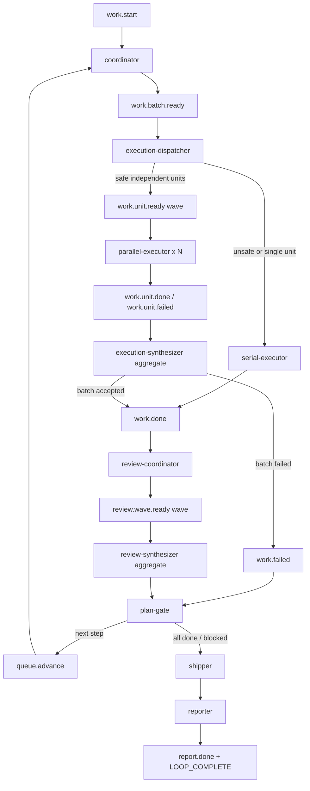

# feat: Add ce-executor-wave preset

## Overview

新增 builtin preset `ce-executor-wave`，在 `ce-executor` 现有“plan 驱动执行 + wave review + auto-fix + debug-resolver + shipper/report”链路基础上，引入**当前 step 内安全并发执行**。现有 `builtin:ce-executor` 保持行为不变；新能力通过新 preset 暴露，避免对稳定执行链路造成回归。

计划采用保守 v1：只并发执行 Coordinator/Dispatcher 明确判定为互不重叠的 implementation units；worker 不提交、不操作 runtime task 生命周期、不发嵌套 wave；由聚合 hat 统一验收、关闭任务、按 U-ID 串行提交，再进入现有 review wave。核心目标是提升吞吐，同时保留 `ce-executor` 已修复过的 plan-wide gate、execution contract 和真实事件门控。

## Problem Frame

当前 `ce-executor` 的执行阶段是单个 `executor` 按当前 step 串行推进，review 阶段已经使用 wave 并发。用户希望“多个 executor 并发做工作”，并明确选择：

- 使用 wave 机制。
- 新增 builtin preset，而不是修改现有 `ce-executor`。
- 只并发当前 step 内的独立任务。
- worker 并发改动后，由聚合阶段串行提交。

主要工程难点不是 wave 能否并发，而是如何防止多个写代码 worker 在同一 Git 工作区互相覆盖、争用 index、污染 runtime task 状态、绕过 plan-gate 或制造假成功。

## Requirements Trace

- R1. 新增 `builtin:ce-executor-wave`，用户可通过 `ralph run -H builtin:ce-executor-wave -p "docs/plans/my-plan.md"` 使用。
- R2. 现有 `builtin:ce-executor` 行为、事件链和测试必须保持不变。
- R3. 并发执行只覆盖当前 step 内被判定为互不重叠的 implementation units；不跨 step 预执行。
- R4. 对文件范围不清、文件重叠、迁移/lockfile/全局配置/跨层重构等高冲突任务，必须降级为串行执行。
- R5. 并发 worker 必须通过 Ralph wave 启动，并使用 per-worker payload 聚焦单个 U-ID。
- R6. 并发 worker 不得 `git add`、`git commit`、创建/切换 branch/worktree、操作 runtime task 生命周期或发嵌套 wave。
- R7. 聚合 hat 必须统一收集 `work.unit.*` 结果，验证文件边界、测试证据和失败情况后，按 U-ID 串行关闭任务与提交。
- R8. 新事件 topic 的 `event_policy.schemas`、hat `publishes/triggers`、instructions read-state、origin guard 可达性测试必须一致。
- R9. 新 preset 必须进入 embedded preset 构建链、用户可见 preset index 和 zsh completion。
- R10. 回归测试必须覆盖新 preset 自身和现有 `ce-executor` 未受影响。

## Scope Boundaries

- 不修改 `ralph wave emit` 的核心 CLI 语义；复用现有 batch wave dispatch。
- 不引入 nested waves；worker 内继续禁止 `ralph wave emit`。
- 不新增全局 wave 并发上限、跨 hat 调度器或新的 core-level plan manifest。
- 不让 worker 各自提交；Git index 只由聚合/集成阶段串行使用。
- 不实现跨 step 并发、自动依赖图推断或 patch-only 隔离模式。
- 不要求 v1 新增中文 `ce-executor-wave-zh` reference preset；如果后续需要，可作为独立任务补齐。

## Context & Research

### Relevant Code and Patterns

- `presets/en/ce-executor.yml`：现有 plan-driven 执行链路、review wave、execution contract、event policy schema、plan-gate、shipper/reporter。
- `presets/extras/wave-review.yml`：最小 wave preset 示例，展示 dispatcher → concurrent worker → aggregate synthesizer 模式。
- `crates/ralph-cli/src/wave.rs`：`ralph wave emit` 会写入 `wave_id`、`wave_index`、`wave_total`，并在 `RALPH_WAVE_WORKER=1` 时拒绝嵌套 wave。
- `crates/ralph-core/src/wave_detection.rs`：只有目标 hat `concurrency > 1` 时，wave event 才进入并发 worker 执行。
- `crates/ralph-core/src/wave_prompt.rs`：worker prompt 会注入单个 payload、wave context 和“publish exactly one result event”约束。
- `crates/ralph-cli/src/loop_runner.rs`：wave worker 使用 per-worker events file，完成后 merge result events 回主 events file，再由 aggregator 消费。
- `crates/ralph-core/src/task_store.rs`：runtime task store 有文件锁，但 `task close` 当前仍是 load/close/save 路径；为降低并发风险，v1 worker 不直接操作 task 生命周期。
- `crates/ralph-cli/src/presets.rs`、`presets/manifest.yml`、`presets/index.json`、`scripts/ralph-zsh-plugin.zsh`：新增 builtin preset 必须同步的嵌入、展示和补全入口。

### Institutional Learnings

- `docs/solutions/developer-experience/agent-execution-contract-gates-2026-06-03.md`：实施型 hat 不应使用会制造假成功的 `default_publishes`；完成事件必须由 contract/schema/task/git 证据共同约束。
- `docs/solutions/developer-experience/ce-executor-plan-gate-premature-completion-2026-06-02.md`：step-scoped task 池不等于 plan-wide completion；多 step preset 必须保留独立 plan gate 决定继续或结束。
- `docs/brainstorms/2026-05-31-agent-operation-guard-requirements.md`：wave provenance 需要在 ingestion/origin guard 层验证；正常 ce-executor 和 wave-review wave dispatch 不能回归。
- `specs/agent-waves/design.md`：wave v1 是 batch dispatch；worker 结构上不能发 nested wave；aggregator 等所有 worker result 合并后才激活。

### External References

未做外部研究。本改动是 Ralph 内部 preset 编排和已有 wave 能力复用，repo 内已有设计文档、实现和回归经验足够支撑计划；外部资料不会显著降低风险。

## Key Technical Decisions

- **新增 preset 而不是改 `ce-executor`**：保留稳定路径，避免并发执行实验影响现有用户和现有回归测试。
- **复用 `ce-executor` 的 review/fix/debug/ship/report 后半链路**：只替换 work execution 前半段，降低拓扑差异和维护成本。
- **并发只发生在当前 step 内**：保留 plan-gate 的顺序语义，避免提前实现后续 step 导致需求依赖、review 范围和 progress 对账混乱。
- **worker 不提交、不关 task**：避免 Git index 争用和 task store read-modify-write 竞争，把提交和 task 生命周期集中到 synthesizer。
- **安全并发优先于最大并发**：dispatcher 必须能降级串行；不明确就是不并发。
- **新事件契约全量显式声明**：`work.batch.ready`、`work.unit.ready`、`work.unit.done`、`work.unit.failed`、`work.serial.ready` 等 topic 必须有 schema、publisher、consumer 和测试同步。
- **不使用 `default_publishes` 表达成功**：实施型并发 worker 必须显式发布 `work.unit.done` 或 `work.unit.failed`；聚合 hat 可以 fail-closed，但不能把缺失 worker 结果伪装成成功。

## Open Questions

### Resolved During Planning

- 新功能承载方式：新增 builtin preset `ce-executor-wave`。
- 并发边界：仅当前 step 内明确互不重叠的任务。
- Git 集成：worker 不提交，聚合后串行提交。
- 是否跨 step：v1 不跨 step。

### Deferred to Implementation

- 具体任务文件范围提取方式：先从 plan task description / Files / Verification 文本中保守解析；实现时根据现有 Coordinator 文本结构确定最小可靠解析策略。
- 串行 fallback 是否复用现有 executor 指令文本或拆成独立 `serial-executor` 文本：实现时可选择更易维护的写法，但必须保留 `work.serial.ready` → `work.done` / `work.failed` 的显式 handoff。
- 是否需要同步创建 `presets/zh/ce-executor-wave-zh.yml`：v1 默认不做，除非实现阶段发现 preset listing 或测试强依赖 zh mirror。

## High-Level Technical Design

> *This illustrates the intended approach and is directional guidance for review, not implementation specification. The implementing agent should treat it as context, not code to reproduce.*

关键不变量：

- `work.done` 仍是进入 review 的唯一正常完成 handoff；并发 batch 不新增第二个“完成并进入 review”的 topic。
- `plan-gate` 仍是继续下一 step 或最终结束的唯一决策点。
- 并发 worker 的输出必须先经过 `execution-synthesizer`，不能直接进入 review 或 shipper。

## Implementation Units

- [ ] **Unit 1: 建立 `ce-executor-wave` preset 骨架**

**Goal:** 新增可解析、可嵌入、用户可见的 builtin preset 文件，并先保持与 `ce-executor` 后半链路兼容。

**Requirements:** R1, R2, R9

**Dependencies:** None

**Files:**
- Create: `presets/en/ce-executor-wave.yml`
- Modify: `presets/manifest.yml`
- Modify: `presets/index.json`
- Modify: `crates/ralph-cli/src/presets.rs`
- Modify: `scripts/ralph-zsh-plugin.zsh`
- Test: `crates/ralph-cli/src/presets.rs`

**Approach:**
- 以 `presets/en/ce-executor.yml` 为基线复制语义，不直接改原文件。
- 将 header、usage、scratchpad 子目录、task key prefix 改为 `ce-executor-wave`，避免与现有 runs 混用。
- 在 `PRESETS` 中添加 `ce-executor-wave`，保持 `presets/manifest.yml` 与 Rust array 对齐。
- 在 `presets/index.json` 添加 user-facing entry。
- 在 zsh plugin builtin values/descriptions 中添加 `builtin:ce-executor-wave`，保持现有 `compadd` 风格。

**Patterns to follow:**
- `presets/manifest.yml` authoring rules。
- `crates/ralph-cli/src/presets.rs` 中 `ce-executor` embedded preset 写法。
- `scripts/ralph-zsh-plugin.zsh` 中 `_RALPH_BUILTIN_HAT_VALUES` / `_RALPH_BUILTIN_HAT_DESCRIPTIONS`。

**Test scenarios:**
- Happy path: `get_preset("ce-executor-wave")` 返回 preset，`RalphConfig::parse_yaml` 成功。
- Integration: `presets_array_matches_manifest` 覆盖 manifest 与 Rust array 同步。
- Regression: `get_preset("ce-executor")` 内容、required_events 和核心拓扑测试继续通过。
- Completion: zsh builtin values 包含 `builtin:ce-executor-wave`，不移除现有 builtin values。

**Verification:**
- 新 preset 可被 builtin lookup 找到。
- manifest/index/zsh/Rust array 全部同步。
- 现有 `ce-executor` 相关断言不需要为通过测试而放宽。

- [ ] **Unit 2: 设计并声明并发执行事件契约**

**Goal:** 为新 preset 增加并发执行前半链路的事件 topic、payload schema、publisher/consumer 关系和 completion safety gate。

**Requirements:** R5, R7, R8, R10

**Dependencies:** Unit 1

**Files:**
- Modify: `presets/en/ce-executor-wave.yml`
- Test: `crates/ralph-cli/src/presets.rs`

**Approach:**
- 在 `event_policy.schemas` 中新增并发执行 topic，最小字段集合建议：
  - `work.batch.ready`: `plan_name`, `plan_path`, `step`, `task_ids`, `task_keys`, `parallel_mode`
  - `work.unit.ready`: `plan_name`, `plan_path`, `step`, `task_id`, `task_key`, `owned_files`, `verification`
  - `work.unit.done`: `plan_name`, `plan_path`, `step`, `task_id`, `task_key`, `changed_files`, `tests`
  - `work.unit.failed`: `plan_name`, `plan_path`, `step`, `task_id`, `task_key`, `reason`
  - `work.serial.ready`: `plan_name`, `plan_path`, `step`, `task_id`, `task_key`, `reason`
- 保留 `work.done` schema 与 execution contract 的字段集合：`plan_name`, `plan_path`, `task_id`, `task_key`, `step`。
- 指定 `execution-synthesizer` 是并发 batch 转换为 `work.done` 的唯一 owner；不新增 `work.batch.done`，避免出现第二条 review handoff。
- 失败路径统一到 `work.failed`，由现有/新 plan-gate 处理为 `plan.blocked`，避免 orphan failure topic。

**Patterns to follow:**
- `presets/en/ce-executor.yml` 中 inlined `event_policy.schemas`。
- `docs/solutions/developer-experience/agent-execution-contract-gates-2026-06-03.md` 的字段一致性经验。

**Test scenarios:**
- Happy path: 新 topic schema 存在且 required fields 与 producer/consumer instructions 中字段一致。
- Error path: 缺少 `task_id` 或 `task_key` 的 `work.unit.done` schema 应被测试识别为不符合契约。
- Regression: `work.done` contract/schema 仍保持原最小字段集合，不因新增 batch topic 放宽。
- Origin compatibility: dispatcher 可发布 `work.unit.ready` / `work.serial.ready`；parallel-executor 可发布 `work.unit.done` / `work.unit.failed`；execution-synthesizer 和 serial-executor 可发布 `work.done` / `work.failed`。

**Verification:**
- 新 preset YAML parse 成功。
- 新事件链没有 orphan topic。
- schema、instructions、read-state 和 tests 形成一致约束。

- [ ] **Unit 3: 增加 execution-dispatcher 安全分派 hat**

**Goal:** 在当前 step 内选择可安全并发的 runtime tasks，并在不安全时降级串行。

**Requirements:** R3, R4, R5

**Dependencies:** Unit 2

**Files:**
- Modify: `presets/en/ce-executor-wave.yml`
- Test: `crates/ralph-cli/src/presets.rs`

**Approach:**
- `coordinator` 不直接触发 executor；它在 `work.start` 或 `queue.advance` 时创建对应 step 的 runtime tasks 后发布 `work.batch.ready`。
- 新增 `execution-dispatcher`：
  - 读取 `context.md`、`plan.md`、`progress.md`、当前 step runtime tasks。
  - 从 task description/plan unit 中提取 owned files、test files、verification。
  - 只把互不重叠、范围明确、无 blocker 的任务发为 `work.unit.ready` wave。
  - 如果只有一个任务或任何任务不满足安全规则，发布 `work.serial.ready` 进入串行执行路径。
- 安全规则必须写入 instructions，禁止“猜测可并发”。
- wave dispatch 使用 `ralph wave emit work.unit.ready --payloads-stdin`，payload 每行是一个单行 JSON 字符串，避免多 JSON 行误传给 `--payloads`。

**Patterns to follow:**
- `presets/en/ce-executor.yml` Coordinator 的 task creation / pre-publish validation。
- `presets/extras/wave-review.yml` dispatcher 使用 `ralph wave emit` 的约束。
- `crates/ralph-cli/src/wave.rs` 对 `--payloads-stdin` 的 footgun 防护。

**Test scenarios:**
- Happy path: 两个任务 owned files 无交集时，dispatcher instructions 要求发出同一 wave 的多个 `work.unit.ready` payload。
- Edge case: 文件范围为空、包含 lockfile、包含 migration、包含全局 config 或 owned files 重叠时，必须走串行 fallback。
- Error path: task list 为空或任务创建失败时，发布 `work.failed`，不得发空 wave。
- Regression: dispatcher 不发布 `work.done`、`queue.advance`、`REVIEW_COMPLETE`，只负责并发 wave dispatch 或串行 fallback handoff。

**Verification:**
- dispatcher 的 `publishes` 只包含 batch/unit dispatch 和失败/串行 handoff 所需 topic。
- 文本约束明确“只当前 step、无重叠才并发、不明确就串行”。

- [ ] **Unit 4: 增加 parallel-executor wave worker**

**Goal:** 让每个 worker 只执行一个 U-ID，并用结构化 `work.unit.done` / `work.unit.failed` 汇报结果。

**Requirements:** R5, R6, R8

**Dependencies:** Unit 3

**Files:**
- Modify: `presets/en/ce-executor-wave.yml`
- Test: `crates/ralph-cli/src/presets.rs`

**Approach:**
- 新增 `parallel-executor` hat：
  - `triggers: ["work.unit.ready"]`
  - `publishes: ["work.unit.done", "work.unit.failed"]`
  - `concurrency: 3`
  - 不设置成功型 `default_publishes`
- worker 必须：
  - 只读 payload 中的 `task_id`, `task_key`, `step`, `owned_files`, `verification`。
  - 只修改 `owned_files` 列表内文件；需要额外文件时发布 `work.unit.failed`。
  - 可以运行相关测试并记录测试证据。
  - 不执行 `git add` / `git commit` / branch/worktree 操作。
  - 不执行 `ralph tools task start/close/fail/reopen`。
  - 不调用 `ralph wave emit`。
- worker 结果文件可写入 `.agents/scratchpad/ce-executor-wave/{plan_name}/units/{task_id}.md`，但事件 payload 必须包含足够字段供 synthesizer 聚合。

**Patterns to follow:**
- `crates/ralph-core/src/wave_prompt.rs` 的 worker prompt 结构。
- `docs/solutions/developer-experience/agent-execution-contract-gates-2026-06-03.md` 对实施型 hat 的 explicit emit 要求。

**Test scenarios:**
- Happy path: `parallel-executor` 配置 `concurrency: 3` 且不含 `aggregate`。
- Error path: instructions 明确 owned file 越界时必须 `work.unit.failed`。
- Error path: instructions 明确测试失败时必须 `work.unit.failed`，不得伪造 `work.unit.done`。
- Regression: instructions 明确禁止 commit、task lifecycle mutation、branch/worktree 操作、nested wave。

**Verification:**
- wave detector 能将 `work.unit.ready` 路由到 concurrent `parallel-executor`。
- worker 成功和失败结果都可被后续 aggregator 消费。

- [ ] **Unit 5: 增加 execution-synthesizer 聚合与串行集成**

**Goal:** 聚合所有并发 worker 结果，统一验收、处理失败、关闭任务并按 U-ID 串行提交，最后发布 `work.done`。

**Requirements:** R6, R7, R8, R10

**Dependencies:** Unit 4

**Files:**
- Modify: `presets/en/ce-executor-wave.yml`
- Test: `crates/ralph-cli/src/presets.rs`

**Approach:**
- 新增 `execution-synthesizer` hat：
  - `triggers: ["work.unit.done", "work.unit.failed"]`
  - `publishes: ["work.done", "work.failed"]`
  - `aggregate: { mode: wait_for_all, timeout: 300 }`
  - 不设置会把缺失结果伪装为成功的 default。
- 聚合逻辑要求：
  - 等待所有 wave worker result 或 aggregate timeout。
  - 任一 `work.unit.failed`、缺失 result、payload 不完整、文件越界、测试证据不足时，发布 `work.failed`。
  - 全部通过时，串行执行 task lifecycle close 和 Git commit，每个 U-ID 一个 commit。
  - 记录 batch summary 到 `.agents/scratchpad/ce-executor-wave/{plan_name}/execution-batch.md`。
  - 发布 `work.done` 时包含 `plan_name`, `plan_path`, `task_id`, `task_key`, `step`，其中 task correlation 使用本 batch 的代表 task 或明确的 batch task，但必须满足现有 review-coordinator/contract 需求。
- 聚合阶段应重新运行当前 step 的必要验证，不能只信 worker 自述。

**Patterns to follow:**
- `presets/en/ce-executor.yml` executor 的 commit cadence 和 step advancement。
- `presets/en/ce-executor.yml` review-synthesizer aggregate 配置和 partial failure handling。
- `docs/solutions/developer-experience/ce-executor-plan-gate-premature-completion-2026-06-02.md` 的 gate 职责分离。

**Test scenarios:**
- Happy path: 多个 `work.unit.done` 聚合后，instructions 要求串行关闭任务、串行提交、发布单个 `work.done`。
- Edge case: 一个 worker timeout 或缺失 result 时，发布 `work.failed` 而不是 `work.done`。
- Error path: 任一 `work.unit.failed` 时，batch failed，不能进入 review。
- Error path: changed_files 超出 owned_files 时，batch failed。
- Regression: `execution-synthesizer` 不发布 `queue.advance` 或 final completion topic。

**Verification:**
- 聚合 hat 与 concurrent worker 互斥：aggregator 不设置 `concurrency > 1`。
- `work.done` 仍能触发现有 review-coordinator。
- 失败路径能到达 plan-gate/shipper/reporter，不会卡住循环。

- [ ] **Unit 6: 串行 fallback 与现有后半链路兼容**

**Goal:** 当并发不安全或只有一个任务时，使用串行执行路径，并确保 review/fix/debug/plan-gate/shipper/reporter 与 `ce-executor` 行为一致。

**Requirements:** R2, R3, R4, R10

**Dependencies:** Unit 5

**Files:**
- Modify: `presets/en/ce-executor-wave.yml`
- Test: `crates/ralph-cli/src/presets.rs`

**Approach:**
- 添加或复用 `serial-executor` hat，语义尽量贴近现有 `executor`。
- `serial-executor` 处理：
  - dispatcher 通过 `work.serial.ready` 明确降级的当前 step。
  - `queue.advance` 后的新 step 先回 `coordinator` 创建任务并发布 `work.batch.ready`，再由 dispatcher 判断并发或串行。
  - `fix.plan.ready` root-cause fix plan，默认串行执行，不并发。
- 保留现有后半链路：
  - `work.done` → review-coordinator → dimension-reviewer wave → review-synthesizer → fixer/debug-resolver/plan-gate → shipper → reporter。
- `plan-gate` 仍独占 `queue.advance` / `plan.complete` / `plan.blocked`。

**Patterns to follow:**
- `presets/en/ce-executor.yml` executor、review-coordinator、plan-gate、shipper、reporter sections。
- `docs/solutions/developer-experience/ce-executor-plan-gate-premature-completion-2026-06-02.md` 防提前完成经验。

**Test scenarios:**
- Happy path: unsafe batch 走串行 executor 后发布 `work.done` 并进入 review。
- Edge case: `fix.plan.ready` 触发串行 fix plan execution，不进入 parallel dispatcher。
- Regression: `shipper` 不直接监听 `review.passed` / `review.complete`。
- Regression: `plan-gate` 继续监听 review result 和 `work.failed`，不监听 `fix.applied`。

**Verification:**
- 新 preset 的单任务/不安全任务行为与现有 `ce-executor` 接近。
- 多 step plan 仍由 plan-gate 决定继续或完成。

- [ ] **Unit 7: 增加 preset 拓扑、contract 和回归测试**

**Goal:** 用测试固化新 preset 的安全约束，并确保现有 `ce-executor` 不被改坏。

**Requirements:** R2, R8, R10

**Dependencies:** Unit 1-6

**Files:**
- Modify: `crates/ralph-cli/src/presets.rs`
- Modify as needed: `crates/ralph-core/src/config.rs`
- Modify as needed: `crates/ralph-core/src/wave_detection.rs`
- Test: `crates/ralph-cli/src/presets.rs`
- Test as needed: `crates/ralph-core/src/event_loop/tests/wave_results.rs`

**Approach:**
- 增加 `ce-executor-wave` 专属测试：
  - YAML parse。
  - `config.validate()` 通过，并断言 `parallel-executor` 与 `execution-synthesizer` 没有触发 `AggregateOnConcurrentHat`。
  - root preset matches embedded copy。
  - required_events 仍是 `report.done`。
  - `parallel-executor.concurrency == 3` 且无 aggregate。
  - `execution-synthesizer.aggregate.wait_for_all` 且无 concurrency > 1。
  - 所有新 topic 的 publish chain 通过 origin compatibility。
  - 所有新增 topic 同时存在 publisher、consumer 和 `event_policy.schemas`。
  - worker instructions 禁止 commit、task lifecycle、branch/worktree、nested wave。
  - dispatcher instructions 包含 current-step-only、owned-files-disjoint、serial fallback。
  - `work.done` 以及 `work.unit.*` / `work.serial.ready` contract/schema/instructions/read-state 字段一致。
- 保留并运行现有 `ce-executor` 测试，不为新 preset 修改其断言。
- 如实现发现 core validator 对新拓扑有误报，只修 validator 的泛化逻辑，不在 preset 里添加无意义 boilerplate 绕过。

**Patterns to follow:**
- `test_ce_executor_publish_chain_origin_compatible`。
- `test_ce_executor_work_done_field_consistency`。
- `test_ce_executor_root_preset_matches_embedded`。
- `presets_array_matches_manifest`。

**Test scenarios:**
- Happy path: 新 preset 正常 parse、embedded、list、origin chain 可达。
- Error path: aggregator + concurrency 同时出现时配置验证应失败；测试确保新 preset 不触发该错误。
- Error path: strict payload contract 缺少 schema 时必须失败；新 preset 必须在 strict 模式下无 warning/error。
- Regression: `ce-executor` 原有 required_events、plan-gate、shipper trigger、executor no default_publishes 测试继续通过。
- Regression: `wave-review` 或 core wave detection 测试继续通过，证明新增 topic 没破坏 wave v1。

**Verification:**
- `cargo test -p ralph-cli presets` 能覆盖新增 preset 的主要静态契约。
- `cargo test -p ralph-core wave` 相关测试不回归。
- `ralph hats validate -H builtin:ce-executor-wave --strict` 和 `ralph hats validate -H builtin:ce-executor --strict` 都通过。

- [ ] **Unit 8: 文档、补全安装和冒烟验证**

**Goal:** 让用户能发现并使用新 preset，并完成项目要求的补全安装与命令冒烟。

**Requirements:** R1, R9, R10

**Dependencies:** Unit 7

**Files:**
- Modify: `presets/README.md`
- Modify as needed: `presets/COLLECTION.md`
- Modify as needed: `docs/reference/troubleshooting.md`
- Modify: `scripts/ralph-zsh-plugin.zsh`
- Test: `scripts/ralph-zsh-plugin.zsh`

**Approach:**
- 在 preset docs 中说明：
  - `ce-executor-wave` 是实验性/高吞吐执行 preset。
  - 推荐用于当前 step 内有多个互不重叠 U-ID 的计划。
  - 不适合迁移、lockfile、大范围重构、文件边界不清任务。
  - 与 `ce-executor` 的区别：执行阶段可并发，review/fix/ship 流程保持类似。
- 按项目规则将 zsh plugin 安装到 `~/.oh-my-zsh/plugins/ralph/ralph.plugin.zsh` 并验证加载。
- 如果 docs 中有 builtin preset list，加入 `ce-executor-wave`。

**Patterns to follow:**
- `presets/README.md` 现有 preset table。
- AGENTS.md 中 builtin preset/zsh completion 同步规则。

**Test scenarios:**
- Happy path: `ralph --list-presets` 或对应 preset list 输出包含 `ce-executor-wave`。
- Happy path: zsh completion source 后 `_RALPH_BUILTIN_HAT_VALUES` 包含 `builtin:ce-executor-wave`。
- Regression: existing builtin completion values 仍保留，包含冒号的 values 继续使用 `compadd` 风格。

**Verification:**
- CLI help/list 冒烟能看到新 preset。
- zsh plugin 已安装并能加载。

- [ ] **Unit 9: 全量验证与反向回归审计**

**Goal:** 在宣布完成前执行面向回归的最终验证，特别覆盖 existing preset、wave、contract、docs drift。

**Requirements:** R2, R8, R10

**Dependencies:** Unit 8

**Files:**
- No planned source modifications; verification-focused unit.

**Approach:**
- 运行 targeted tests 后再跑项目标准测试。
- 特别检查：
  - `ce-executor` 原测试不变。
  - `ce-executor-wave` 新测试通过。
  - `ralph hats validate -H builtin:ce-executor-wave --strict` 无 topology error、orphan warning 和 payload contract warning/error。
  - `ralph hats graph -H builtin:ce-executor-wave --format mermaid` 的图与 High-Level Technical Design 一致，特别是 worker 不直连 review/shipper/completion。
  - wave CLI nested guard 仍通过。
  - preset manifest/Rust array/index/zsh list 没有漂移。
  - 如果修改任何 `ralph tools` 文档或源码引用，按 AGENTS 规则反向验证行号；本计划默认不修改 `crates/ralph-core/data/*.md`。

**Patterns to follow:**
- AGENTS.md 的测试要求：完成前跑 `cargo test` 或 `./scripts/run-tests.sh`。
- AGENTS.md 的 zsh completion 安装要求。

**Test scenarios:**
- Regression: `cargo test -p ralph-cli presets` 覆盖 preset 静态契约。
- Regression: `cargo test -p ralph-core wave` 或等价 targeted tests 覆盖 wave detection/prompt/merge 行为。
- Regression: `ralph hats validate -H builtin:ce-executor --strict` 和 `ralph hats validate -H builtin:ce-executor-wave --strict` 都通过。
- Regression: `ralph preflight -H builtin:ce-executor-wave --strict` 通过。
- Full gate: `./scripts/run-tests.sh` 通过；如果 nextest 不可用，脚本 fallback 到 cargo test。

**Verification:**
- 没有为新 preset 放宽现有 `ce-executor` 测试。
- 没有未提交的 ephemeral 文件被纳入计划外变更。
- 最终报告明确列出未能运行的验证项及原因。

## System-Wide Impact

- **Interaction graph:** 新增执行前半链路，但 `work.done` 之后复用现有 review/fix/debug/plan-gate/ship/report。最关键的 blast radius 是 preset topology、origin guard 和 event policy schema。
- **Error propagation:** worker-level 失败先汇聚为 batch-level `work.failed`；不得让失败 worker 的 partial result 进入 review。`work.failed` 必须有 plan-gate/shipper/report 路径。
- **State lifecycle risks:** 并发 worker 同时改同一工作区是主要风险；通过 owned files disjoint、worker 不提交、不操作 task 生命周期、synthesizer 串行集成缓解。
- **API surface parity:** 新增 builtin preset 影响 CLI preset listing、zsh completion、docs。不是 Rust public API 变更，但属于用户可见 CLI surface。
- **Integration coverage:** 静态 YAML parse 不够；需要 origin chain、wave topology、contract field consistency 和 completion/list/preflight 冒烟共同覆盖。
- **Unchanged invariants:** `ce-executor` required_events 仍为 `report.done`；plan-gate 仍独占 plan advancement；nested wave 仍禁止；executor-style success 必须显式 emit，不能依赖成功型 `default_publishes`。

## Validation Matrix

这部分是实现完成后的验收主线。实现者不能只跑 YAML parse 或单个 Rust test；每层校验覆盖不同失败模式。

| 层级 | 入口 | 必须验证什么 | 能抓住的回归 |
|------|------|--------------|--------------|
| YAML parse | `RalphConfig::parse_yaml` 读取 `presets/en/ce-executor-wave.yml` | YAML 语法、serde 字段、基本配置可反序列化 | 缩进错误、字段拼错、schema 结构无法解析 |
| Config semantic validate | `config.validate()` 或通过 CLI 间接触发 | `concurrency >= 1`、aggregator 不能同时 `concurrency > 1`、reserved trigger 等 | `parallel-executor` / `execution-synthesizer` 配置互斥错误 |
| Hat topology validate | `ralph hats validate -H builtin:ce-executor-wave` | starting event 有订阅者、published topic 有消费者、拓扑 validator 无 error | orphan topic、漏配 trigger/publishes、completion 链断开 |
| Strict payload contract | `ralph hats validate -H builtin:ce-executor-wave --strict` | instructions 引用字段都有 schema；schema/source hats/line 信息一致 | 新 topic 漏 schema、payload 字段漂移、consumer 读了 producer 不保证的字段 |
| Existing preset regression | `ralph hats validate -H builtin:ce-executor --strict` | 原 `ce-executor` 在新增 preset 后仍严格通过 | 复制/测试改动误伤原 preset |
| Preflight | `ralph preflight -H builtin:ce-executor-wave --strict` | 配置解析、hat source resolution、环境/工具检查能跑完 | builtin lookup、preflight config loading、环境依赖问题 |
| Hat graph inspection | `ralph hats graph -H builtin:ce-executor-wave --format mermaid` | 可视化链路符合计划：batch → dispatcher → parallel/serial → work.done → review → plan-gate | 人眼可见的直连 shipper、绕过 synthesizer、绕过 plan-gate |
| Static preset tests | `cargo test -p ralph-cli presets` | embedded/root mirror、manifest、index、field consistency、instruction guardrails | build.rs 复制漂移、PRESETS 漏项、zsh/index 漏项、文本 guard 被删 |
| Wave core tests | `cargo test -p ralph-core wave` 和相关 event_loop wave tests | wave detection、worker prompt、aggregate result merge 仍正确 | 新 topic/hat 配置破坏 wave v1 |
| CLI smoke | `ralph hats list -H builtin:ce-executor-wave` 和 preset list 命令 | 用户能发现并加载新 preset | builtin 入口不可见或名称拼错 |
| Full gate | `./scripts/run-tests.sh` | workspace 回归 | 非局部 Rust 回归、doctest 回归 |

### YML / Hat Validation Acceptance Criteria

- `ralph hats validate -H builtin:ce-executor-wave --strict` 必须输出 `Result: Valid`，不能只有非 strict 通过。
- `ralph hats validate -H builtin:ce-executor --strict` 必须继续通过，证明新增 preset 没污染现有链路。
- `ralph preflight -H builtin:ce-executor-wave --strict` 必须通过；如果环境检查导致失败，最终报告必须区分“环境失败”和“preset 配置失败”。
- `ralph hats graph -H builtin:ce-executor-wave --format mermaid` 生成的图中：
  - `work.unit.ready` 只进入 `parallel-executor`。
  - `work.unit.done` / `work.unit.failed` 只进入 `execution-synthesizer`。
  - `parallel-executor` 不能直接发布 `work.done`、`queue.advance`、`REVIEW_COMPLETE` 或 `LOOP_COMPLETE`。
  - `work.done` 后才进入 `review-coordinator`。
  - `plan-gate` 仍是 `queue.advance` / `plan.complete` / `plan.blocked` 的唯一 owner。
- 对所有新增 topic，测试必须断言三件事同时成立：publisher 的 `publishes` 包含它、consumer 的 `triggers` 包含它、`event_policy.schemas` 定义它。
- 对所有新增 JSON payload topic，测试必须断言 producer instructions、consumer read-state 和 schema required fields 不漂移。

## Risks & Dependencies

| Risk | Likelihood | Impact | Mitigation |
|------|------------|--------|------------|
| 新 preset 与现有 `ce-executor` 复制后漂移 | Medium | Medium | 新 preset 独立测试；保留 `ce-executor` 原测试；只复用后半链路语义，不修改原 preset |
| worker 并发修改同一文件导致覆盖 | High | High | dispatcher 只允许 owned files disjoint；synthesizer 复核 changed_files；不明确就串行 |
| worker 自行提交造成 Git index 争用 | Medium | High | instructions + tests 明确禁止 worker `git add` / `git commit`；synthesizer 串行提交 |
| worker 关闭 task 导致 task state 竞争 | Medium | Medium | worker 禁止 task lifecycle mutation；synthesizer 串行关闭 |
| payload 字段在 schema、contract、instructions 间漂移 | Medium | High | 增加字段一致性测试；所有新增 topic 必须有 schema 和 read-state 对应 |
| 并发失败路径 orphan，循环卡住 | Medium | High | `work.unit.failed` 聚合为 `work.failed`；plan-gate/shipper/reporter 覆盖 blocked report |
| 新 builtin 未进入补全或 index | Medium | Low | Unit 1/8 明确更新 manifest、index、zsh，并安装验证 |
| full test 太慢或环境缺 nextest | Medium | Medium | 使用 `./scripts/run-tests.sh`，记录 fallback 或无法运行原因 |

## Documentation / Operational Notes

- 新 preset 文档要明确它是高吞吐 variant：适合 plan step 内多个文件边界清晰的 U-ID，不适合边界不清或共享文件密集任务。
- zsh completion 改动后必须复制到 `~/.oh-my-zsh/plugins/ralph/ralph.plugin.zsh` 并验证加载。
- 不需要迁移用户配置；现有 `ce-executor` 入口不变。
- 如果后续用户希望中文 preset，也应新增 `presets/zh/ce-executor-wave-zh.yml` 并补中文一致性测试，而不是把本 v1 范围临时扩大。

## Success Metrics

- `builtin:ce-executor-wave` 可被 CLI 发现、解析、验证。
- 安全并发情况下，当前 step 内多个 U-ID 能通过 wave worker 并发执行，并最终只产生一个进入 review 的 `work.done` handoff。
- 不安全任务自动走串行 fallback。
- 现有 `builtin:ce-executor` 测试和行为不回归。
- 新 preset 的所有新增事件 topic 有 schema、publisher、consumer 和 origin compatibility 覆盖。

## Sources & References

- Related preset: `presets/en/ce-executor.yml`
- Wave example: `presets/extras/wave-review.yml`
- Preset embedding: `crates/ralph-cli/src/presets.rs`
- Preset manifest: `presets/manifest.yml`
- Zsh completion: `scripts/ralph-zsh-plugin.zsh`
- Wave CLI: `crates/ralph-cli/src/wave.rs`
- Wave detection: `crates/ralph-core/src/wave_detection.rs`
- Wave prompt: `crates/ralph-core/src/wave_prompt.rs`
- Task store: `crates/ralph-core/src/task_store.rs`
- Prior learning: `docs/solutions/developer-experience/agent-execution-contract-gates-2026-06-03.md`
- Prior learning: `docs/solutions/developer-experience/ce-executor-plan-gate-premature-completion-2026-06-02.md`
- Wave design: `specs/agent-waves/design.md`
