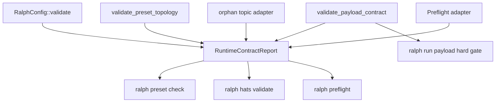

# Runtime Contract Consolidation: Preset 预检与回归门禁整合

## Overview

本计划把 Ralph 现有的 preset / workflow 运行前校验能力收拢成统一的 Runtime Contract 体系。

这里不是从零新增一套校验系统。当前仓库已经有多层保护：

- `RalphConfig::validate()` 校验配置语义。
- `PreflightRunner` 提供 `ralph preflight` 和可选的 `ralph run` 前置检查。
- `preset_validator::validate_preset_topology()` 校验 starting event、completion promise、required events 的可达性。
- `payload_contract::validate_payload_contract()` 和 `enforce_payload_contract_gate()` 校验静态 payload 契约，并在 `ralph run` 启动 agent 前执行不可跳过 hard gate。
- `ralph hats validate` 已经整合 topology、orphan topic、payload contract 的人工检查入口。

当前问题是这些能力分散在不同入口和不同输出里。Preset 作者需要知道该跑哪个命令、哪个 warning 能忽略、哪个 failure 会阻止 `ralph run`。本计划目标是把它们产品化为统一的 preset/workflow 质量门禁，同时严格避免回归。

## Problem Frame

用户要构建自己的 workflow / preset。对 preset 作者来说，最痛的不是缺少某一个校验函数，而是：

- 创建或修改 preset 后，不知道应该运行哪一组检查。
- `ralph preflight`、`ralph hats validate`、`ralph run` hard gate 的关系不清楚。
- 有些检查只在 CLI 人工入口暴露，有些检查只在运行时 hard gate 暴露。
- 检查结果没有统一分级，难以区分“结构错误”“环境问题”“严格模式下才失败”“只是提示”。
- builtin preset 的回归基线不够集中，新入口或校验逻辑容易误伤 `ce-executor` / `ce-executor-wave`。

这个计划的核心判断：

**Runtime Contract 不是新造一个大系统，而是把已有的 config、topology、payload、orphan、preflight、hard gate 收敛到一个统一的 contract report 和 CLI 入口。**

## Requirements Trace

- **R1. 统一入口。** 提供面向 preset 作者的统一命令，能一次性检查 preset 的配置语义、拓扑、orphan topic、payload contract 和 workflow 可调度性；环境可执行性仍归 `ralph preflight`。
- **R2. 复用已有能力。** 不重写 `RalphConfig::validate()`、`validate_preset_topology()`、`validate_payload_contract()`、`PreflightRunner`、`enforce_payload_contract_gate()` 的核心逻辑。
- **R3. 输出可读且机器可读。** 新入口必须支持 human 和 JSON 输出；human 输出用于人快速修复，JSON 输出用于后续 diagnostics / CI / 脚本。
- **R4. 运行行为不回归。** 默认 `ralph run` 行为不能因为新增统一入口而改变；`features.preflight.enabled` 默认仍保持当前语义。
- **R5. Hard gate 不软化。** `enforce_payload_contract_gate()` 在 `ralph run` 启动 agent 前不可跳过的行为保持不变。
- **R6. 旧入口不破坏。** `ralph hats validate`、`ralph preflight` 继续可用；输出可以增强，但不能丢失现有错误信息。
- **R7. Builtin preset 回归基线。** 所有 public builtin preset 必须纳入批量 contract 校验，重点保护 `ce-executor`、`ce-executor-wave`、`code-assist`、`pdd-to-code-assist`。
- **R8. 诊断计划可接入。** 后续 `ralph diagnose` 能引用统一 contract report，而不是分别解析 `hats validate` / `preflight` 的人类输出。
- **R9. 测试优先。** 对现有行为先补 characterization test，再重构共享结果层和 CLI 输出。
- **R10. Strict 语义不混淆。** 区分 payload strict、warning-as-error、run hard gate 三种强度，不能让不同入口因为复用 report 而改变既有 strict 语义。
- **R11. 最小回归面。** MVP 不重命名现有 preflight check、不默认接入 CI gate、不强制修改 AGENTS/CLAUDE、不把 CLI-only 渲染需求下沉为 core 依赖。

## Scope Boundaries

### In Scope

- 新增统一 Runtime Contract report 数据模型。
- 新增 `ralph preset check` 命令，面向 builtin、文件、远程 hats source。
- 让 `ralph hats validate` 和 `ralph preflight` 复用共享 contract 结果，减少逻辑分叉。
- 增加 builtin preset 批量回归测试和开发脚本；默认 CI gate 是否接入必须单独评估运行成本后再决定。
- 明确 strict / non-strict / hard gate / preflight enabled 的行为矩阵。
- 输出 human 和 JSON 两种格式。

### Out of Scope

- 不做 preset 模板化和版本化；这是后续独立计划。
- 不做 `ralph diagnose` 报告生成；本计划只为 diagnostics 提供可引用的 contract report。
- 不改变 EventBus、StateMachine、EventPolicy 的运行时语义。
- 不默认开启 `features.preflight.enabled`。
- 不新增自动修复 preset 的能力。
- 不把环境检查失败误判成 preset contract 失败。

### Deferred to Separate Tasks

- **Preset 模板化与版本化：** 后续计划处理 `ralph preset new`、template metadata、preset version。
- **Diagnostics 报告接入：** 后续计划让 `ralph diagnose` 读取本计划输出的 JSON contract report。
- **Web dashboard 展示：** 后续再考虑把 contract report 作为 UI 面板展示。

## Context & Research

### Repo Reality Check

- `crates/ralph-core/src/config/ralph_config.rs` 已有 `RalphConfig::validate()`，覆盖配置语义、reserved triggers、ambiguous routing、workflow guard、state machine、event policy 等。
- `crates/ralph-core/src/preflight.rs` 已有 `PreflightRunner` 和 `PresetTopologyCheck`；`features.preflight.enabled` 默认是 `false`，所以 `ralph run` 前置 preflight 是可配置能力，不是默认 hard gate。
- `crates/ralph-cli/src/preflight.rs` 已有 `ralph preflight --format human|json --strict --check <NAME>`。
- `crates/ralph-cli/src/hats.rs` 已有 `ralph hats validate --strict`，当前会打印 topology、orphan topic、payload contract 结果。
- `crates/ralph-core/src/preset_validator.rs` 已有 `validate_preset_topology()` 和 `validate_preset()`。
- `crates/ralph-core/src/payload_contract.rs` 已有静态字段引用提取和 payload contract validation。
- `crates/ralph-cli/src/loop_runner/payload_contract_gate.rs` 的 `enforce_payload_contract_gate()` 是 `ralph run` 前不可跳过的 payload hard gate。
- `crates/ralph-cli/src/presets.rs` 已有 embedded preset 列表和基础测试，但没有统一 contract matrix 测试覆盖所有 public builtin preset。
- 当前没有 `scripts/validate-builtin-presets.sh` 之类的 preset contract 批量脚本。
- 全局 `-H/--hats` 已在 `crates/ralph-cli/src/main.rs` 定义为 global 参数，`ralph preset check -H builtin:...` 不需要新增 hats source 解析类型。

### Relevant Existing Patterns

- CLI 子命令拆分：`crates/ralph-cli/src/commands/*.rs` 和 `crates/ralph-cli/src/main.rs` 中注册命令。
- 共享检查结构：`PreflightReport` / `CheckResult` / `CheckStatus` 已经提供 pass/warn/fail 模型。
- 人类输出 + JSON 输出：`crates/ralph-cli/src/preflight.rs` 是可复用样例。
- Strict 行为：`ralph preflight --strict` 把 warning 当失败，`ralph hats validate --strict` 把 payload missing schema 从 warning 升级为 error。
- Builtin preset 测试：`crates/ralph-cli/src/presets.rs` 用 `PRESETS` 循环校验 public preset 基础属性。
- Hard gate 测试：`crates/ralph-cli/src/loop_runner/tests.rs` 已有 payload hard gate 行为测试。

### Institutional Learnings

- `docs/brainstorms/2026-06-02-payload-contract-validation-requirements.md` 明确 payload contract 的目标是“启动前拒绝明显坏的 preset”，并要求诊断信息能快速定位。
- `docs/plans/2026-06-04-004-feat-ce-executor-wave-preset-plan.md` 的 Validation Matrix 已经把 YAML parse、config validate、hat topology、strict payload contract、preflight、graph inspection、full gate 拆成分层验证。
- `docs/plans/2026-06-04-004-feat-drift-auto-calibration-plan.md` 已经要求后续 diagnostics 报告能引用 payload contract / workflow guard / execution contract 等 gate 证据。本计划提供其中的 Runtime Contract 输入。

### External Research Decision

本计划主要整合本仓库已有 CLI、config、preflight、preset validator 和 payload contract 机制。没有引入第三方工作流引擎、云服务或外部协议。外部最佳实践只作为背景，不进入实施约束；优先遵循本地代码事实。

### Design Review Findings（2026-06-05 严格评审）

本轮评审按“增强与整合，不能破坏现有功能”的原则审查计划，发现并收紧以下风险点：

| Finding | 风险 | 计划处理 |
|---|---|---|
| `--strict` 在不同入口含义不同 | 把 `preflight --strict` 和 `hats validate --strict` 混成一个 bool 会改变 exit code | 增加 `payload_strict` 与 `fail_on_warnings` 双维度，旧入口保持旧语义 |
| orphan 检查贸然下沉到 core | 为统一 report 改动 crate 边界，可能复制 loop-runner internal topic 或引入架构倒挂 | MVP 允许 orphan helper 留在 CLI adapter；无法无风险移动时不强行下沉 |
| 重命名 `preset-topology` preflight check | 破坏 `features.preflight.skip` 和 `ralph preflight --check preset-topology` | MVP 禁止重命名；新增 `preset-contract` 只能作为增量 check 或 alias |
| 新脚本直接进入 CI gate | 增加 CI 时间或环境依赖，导致非功能性回归 | MVP 只新增开发脚本；默认 CI 接入另行评估 |
| 把 AGENTS/CLAUDE 当必改文件 | 无必要修改项目级 agent 指令会扩大回归面，并引入同步风险 | 改为 only-if-needed；若修改必须保持完全一致 |
| 修改 `HatsSource::parse()` | 全局 `-H` 已存在，改 parser 会影响所有命令 | 明确不新增 source 类型，不修改 parser |
| config warnings 丢失 | `config.validate()` warnings 若不进 report，会破坏 warning-as-error | 明确 config warnings 必须映射为 warning findings |

## Key Technical Decisions

1. **新增共享 contract report，不新增第二套校验逻辑。**  
   统一入口应调用现有 config/topology/payload/preflight 能力，输出统一结构。避免出现 `hats validate` 和 `preset check` 对同一个 preset 给出不同结论。

2. **`ralph preset check` 是作者入口，不替代 `ralph preflight`。**  
   `preflight` 同时检查环境、git、tools、hooks；`preset check` 重点检查 preset/workflow 本身。两者可以共享输出片段，但用户心智要分开。

3. **`ralph run` 默认行为保持当前状态。**  
   不默认开启 `features.preflight.enabled`。本计划可以让 run 的 summary 更清楚，但不能突然让历史 preset 因新增 preflight 默认失败。

4. **Payload hard gate 保持不可跳过。**  
   `enforce_payload_contract_gate()` 继续在 backend spawn 前执行。统一 report 可以复用它背后的 validation 结果，但不把 hard gate 降级成普通 preflight warning。

5. **错误分级必须带来源和执行阶段。**  
   每条 finding 至少能说明它来自 config、topology、orphan、payload、environment 还是 runtime hard gate，以及它是在 authoring、preflight、run-hard-gate 哪个阶段生效。

6. **Strict 分成两个维度。**  
   `payload_strict` 控制 payload missing schema 是否从 warning 升级为 error；`fail_on_warnings` 控制 warning 是否影响整体 exit code。`ralph preflight --strict` 当前等价于 `fail_on_warnings=true`；`ralph hats validate --strict` 当前更接近 `payload_strict=true`。共享 report 必须表达这两个维度，不能用单个 bool 混掉。

7. **旧入口先适配共享结果，再逐步收敛输出。**  
   `ralph hats validate` 的现有输出已有测试依赖，不能一次性大改。第一阶段应保持关键文本和 exit code，再内部改为复用共享结果。

8. **回归保护优先于漂亮抽象。**  
   实现前先补 characterization tests；没有测试覆盖的旧行为不应被重构。

## Behavior Matrix

| 入口 | 目标用户 | 检查重点 | 默认是否阻止继续 | 本计划后的定位 |
|---|---|---|---|---|
| `ralph preset check` | preset 作者、CI | preset/workflow contract | 有 error 时 exit 1 | 新增统一作者入口 |
| `ralph hats validate` | hat/preset 调试者 | hat topology、orphan、payload | strict error 时 exit 1 | 保留旧入口，复用共享结果 |
| `ralph preflight` | operator、CI | config + environment + preset topology | failure 时 exit 1 | 保留运行前检查入口 |
| `ralph run` auto preflight | operator | 可配置运行前检查 | 仅 `features.preflight.enabled=true` 时生效 | 不改变默认启用语义 |
| `ralph run` payload hard gate | operator | 静态 payload contract | 不可跳过，失败则不 spawn backend | 保持现状，不软化 |

### Strict Semantics Matrix

| 入口 | `payload_strict` | `fail_on_warnings` | 说明 |
|---|---:|---:|---|
| `ralph hats validate` | false | false | 现有默认：payload missing schema 是 warning，orphan 也是 warning |
| `ralph hats validate --strict` | true | false | 保持现有语义：payload missing schema 变 error，但普通 warning 不自动失败 |
| `ralph preflight` | false 或 check 默认值 | false | 现有默认：failure 失败，warning 不失败 |
| `ralph preflight --strict` | false 或 check 默认值 | true | 保持现有语义：warning 也使 preflight failed |
| `ralph preset check` | false | false | 新入口默认：适合快速作者检查 |
| `ralph preset check --strict` | true | true | 新入口 strict：适合 CI 和发布前检查 |
| `ralph run` payload hard gate | true | 不适用 | 不可跳过 hard gate；不是 warning 模式 |

## High-Level Technical Design

> *This illustrates the intended approach and is directional guidance for review, not implementation specification. The implementing agent should treat it as context, not code to reproduce.*



说明：

- `RuntimeContractReport` 是统一结果层，不直接改变 EventLoop。
- `ralph preset check` 读取完整 report。
- `ralph hats validate` 和 `ralph preflight` 逐步适配共享结果，但保留用户可见语义。
- `ralph run` 的 payload hard gate 继续直接保护 backend spawn 前的主路径。
- `orphan topic adapter` 只能做 pure detection，不能改变 EventBus 或 HatRegistry；如果实现时发现需要跨 crate 依赖，先留在 CLI 层拼接 finding，不强行下沉到 core。

## Implementation Units

- [ ] **U0: Characterization Tests for Existing Contract Behavior**

**Goal:** 在重构前锁住现有 contract 行为，确保后续共享结果层不会引入回归。

**Requirements:** R2, R4, R5, R6, R9

**Dependencies:** None

**Files:**
- Modify: `crates/ralph-core/src/config/ralph_config.rs`（test-only / `cfg(test)`）
- Modify: `crates/ralph-core/src/preflight.rs`（test-only / `cfg(test)`）
- Modify: `crates/ralph-core/src/preset_validator.rs`（test-only / `cfg(test)`）
- Modify: `crates/ralph-cli/src/hats.rs`（test-only / `cfg(test)`）
- Modify: `crates/ralph-cli/src/commands/run.rs`（test-only / `cfg(test)`）
- Modify: `crates/ralph-cli/src/loop_runner/tests.rs`（test-only）
- Test: `crates/ralph-core/src/preflight.rs`
- Test: `crates/ralph-core/src/preset_validator.rs`
- Test: `crates/ralph-cli/src/hats.rs`
- Test: `crates/ralph-cli/src/commands/run.rs`
- Test: `crates/ralph-cli/src/loop_runner/tests.rs`

**Approach:**
- 先补现有行为测试，再做任何共享层抽取。
- 保持测试关注行为，不绑定最终 helper 名称。
- 覆盖 `features.preflight.enabled=false` 时 `run_auto_preflight()` 返回 no-op 的现有语义。
- 覆盖 `features.preflight.enabled=true` 时 preflight failure 会阻止 `ralph run`。
- 覆盖 `enforce_payload_contract_gate()` 不受 `--skip-preflight` 或 `features.preflight.enabled` 影响。
- 覆盖 `ralph hats validate` 的 orphan exemption 不会吞掉真实 orphan topic。

**Execution note:** Characterization-first。这个单元必须先于共享 report 抽取执行。

**Patterns to follow:**
- `crates/ralph-cli/src/hats.rs` 中已有 orphan exemption 回归测试。
- `crates/ralph-cli/src/loop_runner/tests.rs` 中已有 payload hard gate 测试。
- `crates/ralph-cli/src/commands/run.rs` 中已有 auto preflight 测试。

**Test scenarios:**
- Happy path: 有 `features.preflight.enabled=false` 的默认 config 调用 run auto preflight，结果应为 `None`，不执行 checks。
- Happy path: 有 `features.preflight.enabled=true` 且 skip 掉环境依赖检查时，合法 topology preset preflight 通过。
- Error path: `features.preflight.enabled=true` 且 backend 不存在时，run auto preflight 在 Run mode 返回错误，错误包含 `Preflight checks failed`。
- Error path: payload contract 缺 required field 时，`enforce_payload_contract_gate()` 返回错误，错误包含 topic、field、source hats。
- Regression: `build.blocked` 仍作为 loop-runner internal topic 被 orphan check 豁免。
- Regression: 随机 typo topic 如 `orphan.typo` 仍产生 orphan warning。
- Regression: strict payload missing schema 在 `ralph hats validate --strict` 语义下仍失败，non-strict 下仍是 warning。

**Verification:**
- 修改共享逻辑前，上述 characterization tests 全部通过。
- 旧入口的 exit code 语义被测试覆盖。

- [ ] **U1: Introduce Runtime Contract Report Model**

**Goal:** 定义统一的 contract finding/report 数据模型，让不同入口共享同一份结构化结果。

**Requirements:** R1, R2, R3, R8

**Dependencies:** U0

**Files:**
- Create: `crates/ralph-core/src/runtime_contract.rs`
- Modify: `crates/ralph-core/src/lib.rs`
- Test: `crates/ralph-core/src/runtime_contract.rs`

**Approach:**
- 在 `ralph-core` 中新增轻量模块，负责把现有检查结果规范化为统一 finding。
- finding 字段建议包括：
  - `id`：稳定机器 ID，例如 `config.invalid_concurrency`、`topology.unreachable_completion`、`payload.field_missing_from_schema`。
  - `source`：`config` / `topology` / `orphan` / `payload` / `preflight`。
  - `severity`：`pass` / `warn` / `error`。
  - `stage`：`authoring` / `preflight` / `run_hard_gate`。
  - `message`：人类可读摘要。
  - `details`：可选结构化上下文，例如 hat、topic、field、schema source。
  - `action_hint`：可选修复建议。
- report 字段建议包括：
  - `passed`
  - `warnings`
  - `errors`
  - `payload_strict`
  - `fail_on_warnings`
  - `findings`
  - `checked_at`
  - `source_label`
- 不把环境检查塞进核心 preset contract report；环境检查由 `PreflightRunner` 适配为 separate group。
- `config.validate()` 返回的 warnings 必须保留为 config warning findings；否则 `preflight --strict` 的 warning-as-error 语义会丢失。
- `source=preflight` 只允许出现在 CLI/preflight adapter 生成的 wrapper report 中；core preset contract report 不直接运行 git/backend/tools 等环境检查。
- 不在这个单元更改 CLI 输出。

**Technical design:**  
方向性结构如下，不是最终实现规格：

```text
RuntimeContractReport
  source_label
  payload_strict
  fail_on_warnings
  passed
  findings[]

RuntimeContractFinding
  id
  source
  severity
  stage
  message
  details
  action_hint
```

**Patterns to follow:**
- `crates/ralph-core/src/preflight.rs` 的 `CheckStatus` / `CheckResult` / `PreflightReport`。
- `crates/ralph-core/src/preset_validator.rs` 的 `TopologyValidationResult`。
- `crates/ralph-core/src/payload_contract.rs` 的 `PayloadContractValidationResult`。

**Test scenarios:**
- Happy path: 空 finding report 的 `passed=true`，warnings/errors 都是 0。
- Happy path: 单个 warning finding 使 warnings=1，但 non-strict report 仍 `passed=true`。
- Error path: 单个 error finding 使 report `passed=false`。
- Edge case: `fail_on_warnings=true` 时 warning finding 使 report failed；`payload_strict=true` 只影响 payload validation 的 finding severity。
- Serialization: report 序列化为 JSON 后包含 stable `id`、`source`、`severity`、`stage`。

**Verification:**
- core 模块可独立测试。
- 不影响现有 CLI 编译和输出。

- [ ] **U2: Build Preset Contract Aggregator and Optional Orphan Adapter**

**Goal:** 建立一个共享 aggregator，按固定顺序调用 config、topology、payload contract 校验，并通过可选 orphan adapter 追加 orphan findings，生成 `RuntimeContractReport`。

**Requirements:** R1, R2, R3, R6, R8

**Dependencies:** U1

**Files:**
- Modify: `crates/ralph-core/src/runtime_contract.rs`
- Modify if needed: `crates/ralph-core/src/preset_validator.rs`
- Modify if needed: `crates/ralph-core/src/payload_contract.rs`
- Test: `crates/ralph-core/src/runtime_contract.rs`
- Test: `crates/ralph-core/src/preset_validator.rs`

**Approach:**
- aggregator 输入应是已经加载并 normalize/resolve schema 的 `RalphConfig` 和 runtime-aware `HatRegistry`。
- `RalphConfig::validate()` 的 warnings 应变成 `source=config`、`stage=authoring` 的 warning finding。
- `RalphConfig::validate()` 的错误应变成 `source=config`、`stage=authoring` 的 error finding；如果 config validate 失败，aggregator 应跳过依赖有效 config 的 topology/orphan/payload 检查，避免在同一个坏 config 上制造误导性二次错误。
- `validate_preset_topology()` 的 errors 应变成 `source=topology` 的 error findings。
- `validate_payload_contract()` 的 warnings/errors 应保留 strict 语义，并映射到 `source=payload`。
- `preset_validator.rs` 和 `payload_contract.rs` 的修改只能是暴露现有结构、补转换 helper 或补测试；不能在本单元改变 validation 规则。
- orphan topic check 当前在 `crates/ralph-cli/src/hats.rs`，不能为了统一 report 贸然扩大架构边界：
  - MVP 优先抽成 pure helper，允许先留在 CLI 层并把 orphan finding append 到 report。
  - 只有当 helper 不依赖 CLI-only 状态时，才允许移动到 core。
  - `LOOP_RUNNER_INTERNAL_TOPICS` 不能复制成两份；如果移动，必须有单一来源，并保留现有 exemption 测试。
  - 如果实现时无法无风险移动，就保持 `ralph preflight` 不包含 orphan finding，由 `ralph preset check` 和 `ralph hats validate` 覆盖 orphan。
- aggregator 不应运行环境检查，如 git clean、backend availability、tools in PATH；这些属于 preflight adapter。
- aggregator 不应调用 `enforce_payload_contract_gate()`，避免把 CLI error string 反向解析成结构化数据。

**Patterns to follow:**
- `validate_preset()` 当前已组合 topology + payload，可扩展或被 aggregator 复用。
- `validate_hats()` 当前的 orphan check 逻辑是行为来源，不能丢。

**Test scenarios:**
- Happy path: 两个 hat 形成 `work.start -> work.done -> LOOP_COMPLETE`，required event 在所有 completion path 上，report 通过。
- Error path: starting event 没订阅者，report 包含 `source=topology` error。
- Error path: completion promise 不可达，report 包含 `source=topology` error。
- Error path: required event 不在所有 completion path 上，report 包含明确 required topic。
- Warning path: published topic 没有 subscriber 且不属于 completion/required/internal topic，report 包含 orphan warning。
- Regression: completion promise topic 不被 orphan warning 报告。
- Regression: required_events topic 不被 orphan warning 报告。
- Regression: `build.blocked` 不被 orphan warning 报告。
- Payload path: downstream instructions 引用 `plan_name` 但 schema 未声明，report 包含 `source=payload` finding，details 包含 hat/topic/field。
- Strict path: strict=false 时 missing schema 是 warning；strict=true 时 missing schema 是 error。
- Config warning path: dropped/deferred config warning 在 `fail_on_warnings=false` 时不失败，在 `fail_on_warnings=true` 时使 report failed。

**Verification:**
- aggregator 能表达 `hats validate` 当前所有核心检查。
- core 层不依赖 CLI 输出或 process exit。

- [ ] **U3: Add `ralph preset check` CLI**

**Goal:** 提供面向 preset 作者的统一入口，一次性检查 preset/workflow contract，并支持 human/json 输出。

**Requirements:** R1, R3, R7, R8

**Dependencies:** U1, U2

**Files:**
- Create: `crates/ralph-cli/src/commands/preset.rs`
- Modify: `crates/ralph-cli/src/commands/mod.rs`
- Modify: `crates/ralph-cli/src/main.rs`
- Test: `crates/ralph-cli/src/commands/preset.rs`
- Test: `crates/ralph-cli/src/main.rs`

**Approach:**
- 新增命令组 `ralph preset`，首个子命令为 `check`。
- 命令形态建议：
  - `ralph preset check -H builtin:ce-executor`
  - `ralph preset check -H path/to/preset.yml`
  - `ralph preset check -H https://example.com/preset.yml`
  - `ralph preset check --format json -H builtin:ce-executor`
  - `ralph preset check --strict -H builtin:ce-executor`
- 继续复用全局 `-H/--hats` source 机制，不额外发明位置参数解析规则。
- 不修改 `HatsSource::parse()`，除非确实新增 source 类型；本计划不需要新增 source 类型。
- 如果用户没有提供 `-H`，命令应检查当前 config/hats overlay，与 `ralph hats validate` 保持一致。
- human 输出应分组展示：
  - Config
  - Topology
  - Orphan topics
  - Payload contract
  - Summary
- JSON 输出直接序列化 `RuntimeContractReport` 或稳定 wrapper。
- exit code 语义：
  - report passed -> exit 0。
  - report failed -> exit 1。
  - config/hats source 无法加载 -> exit 1，错误归类为 loader error，不伪装成 contract finding。
- `--strict` 在这个新入口中同时启用 `payload_strict=true` 和 `fail_on_warnings=true`，用于 CI / 发布前检查；旧入口的 strict 语义不因此改变。
- 不在该命令中运行 backend availability、git clean、tools in PATH；需要这些时用户继续用 `ralph preflight`。

**Patterns to follow:**
- `crates/ralph-cli/src/preflight.rs` 的 `--format human|json` 和 strict 输出。
- `crates/ralph-cli/src/hats.rs` 的 `validate_hats()` human 输出风格。
- `crates/ralph-cli/src/commands/*.rs` 的命令拆分方式。

**Test scenarios:**
- Happy path: `builtin:ce-executor` 在 strict 模式下通过时，human 输出包含 `Result: PASS` 或等价摘要，exit 0。
- Happy path: `--format json` 输出合法 JSON，包含 `passed` 和 `findings`。
- Error path: 缺失 completion path 的临时 preset 返回 exit 1，human 输出包含 completion promise。
- Error path: payload strict 失败返回 exit 1，JSON 输出包含 `source=payload` 和 field。
- Error path: `--strict` 下 orphan warning 会使 `preset check` exit 1，但同一 preset 在 `hats validate --strict` 中仍只按旧语义处理普通 warning。
- Edge case: 未传 `-H` 时，命令使用当前 config source 加载，不 panic。
- Edge case: 远程 hats source 加载失败时，返回 loader error，不输出误导性的 passed report。
- Regression: 新增 `preset` 命令不影响 `ralph run` 默认子命令解析。

**Verification:**
- `ralph preset check --help` 能显示清楚用法。
- 命令输出足以指导 preset 作者下一步该修哪里。

- [ ] **U4: Adapt `ralph hats validate` to Shared Contract Results**

**Goal:** 让旧入口复用 aggregator，减少逻辑分叉，同时保持现有用户可见语义和测试稳定。

**Requirements:** R2, R3, R6, R9

**Dependencies:** U2

**Files:**
- Modify: `crates/ralph-cli/src/hats.rs`
- Test: `crates/ralph-cli/src/hats.rs`

**Approach:**
- `validate_hats()` 不再独立拼 topology/payload/orphan 的判断，改为读取 `RuntimeContractReport`。
- 初期渲染可以保留当前文案结构，避免一次性重写输出导致测试和用户习惯全变。
- 当前 `strict` 参数继续控制 payload contract 的 strict 语义。
- 已有 `No hats configured (solo mode).` 行为需保持。
- `hats graph/list/show` 不参与本次改造。
- 如果共享 report 中新增 finding 字段，不应让 `hats validate` 输出过度冗长；详细 JSON 交给 `preset check --format json`。

**Patterns to follow:**
- 当前 `validate_hats()` 的 headers、summary、error return 行为。
- 当前 `test_validate_hats_*` 测试覆盖的 warning/error 文案。

**Test scenarios:**
- Happy path: 合法 topology 输出 `Result: Valid`，exit 0。
- Warning path: orphan typo 仍输出 `Event 'orphan.typo' published by 'Sloppy' has no hat subscribers`。
- Regression: required_events topic 仍豁免 orphan warning。
- Regression: `build.blocked` 仍豁免 orphan warning。
- Payload warning: non-strict missing schema 仍不让 `hats validate` 返回 error。
- Payload error: strict missing schema 仍让 `hats validate` 返回 error。
- Compatibility: `hats list`、`hats show`、`hats graph` 测试不受影响。

**Verification:**
- `hats validate` 和 `preset check` 对同一个 preset 的核心结论一致。
- 旧 tests 不因输出重排之外的行为改变而失败。

- [ ] **U5: Integrate Contract Report with `ralph preflight` Without Changing Defaults**

**Goal:** 让 `ralph preflight` 可以呈现更完整的 preset contract 信息，同时不改变 `features.preflight.enabled` 默认行为。

**Requirements:** R1, R2, R4, R6, R8

**Dependencies:** U2

**Files:**
- Modify: `crates/ralph-core/src/preflight.rs`
- Modify: `crates/ralph-cli/src/preflight.rs`
- Modify: `crates/ralph-cli/src/commands/run.rs`
- Test: `crates/ralph-core/src/preflight.rs`
- Test: `crates/ralph-cli/src/preflight.rs`
- Test: `crates/ralph-cli/src/commands/run.rs`

**Approach:**
- `PreflightRunner` 中现有 `PresetTopologyCheck` 的 check name `preset-topology` 不能在 MVP 中重命名，避免破坏 `features.preflight.skip` 和 `ralph preflight --check preset-topology`。
- 如果要新增 `preset-contract`，必须作为新 check 或 alias 增量加入；不能替换现有 `preset-topology`。
- 若 orphan detection 仍保留在 CLI adapter 层，`ralph preflight` 的 core check 只承载 topology/payload/config summary，不强求与 `preset check` 完全同粒度。
- `ralph preflight --format json` 可包含新的 contract check message，但不应把完整 nested report 强塞进现有 `CheckResult.message` 导致 JSON 不稳定。可用 concise summary，完整结构交给 `ralph preset check --format json`。
- `run_auto_preflight()` 的启用条件保持：
  - `skip_preflight` 为 true -> no-op。
  - `config.features.preflight.enabled` 为 false -> no-op。
- `ralph run` 中 `enforce_payload_contract_gate()` 保持现有位置和语义，不因 preflight disabled 而跳过。

**Patterns to follow:**
- `run_auto_preflight()` 当前测试。
- `PreflightRunner::default_checks_with_config()` 的 check list 构造方式。
- `preflight::execute()` 的 `--check` unknown validation。

**Test scenarios:**
- Happy path: `ralph preflight --check preset-topology` 继续只运行现有 topology check，并保持当前可用性。
- Compatibility: `--check preset-topology` 仍可用，并且语义不弱于当前 topology check。
- Compatibility: 如果新增 `preset-contract`，`--check preset-contract` 不影响 `preset-topology`。
- Error path: 指定 unknown check 仍返回 available checks。
- Regression: `features.preflight.enabled=false` 时 `run_auto_preflight()` 仍返回 `None`。
- Regression: `--skip-preflight` 仍跳过 auto preflight。
- Regression: preflight disabled 时 payload hard gate 仍会在 runner 入口执行。
- JSON path: `ralph preflight --format json` 输出仍符合 `PreflightReport` 结构。

**Verification:**
- `ralph preflight` 的用户心智仍是运行前环境 + config 检查。
- `ralph preset check` 成为详细 preset contract 输出入口。

- [ ] **U6: Add Builtin Preset Contract Regression Matrix**

**Goal:** 把 public builtin preset 纳入统一 contract 校验，防止未来改 preset、schema、validator 时引入回归。

**Requirements:** R7, R9

**Dependencies:** U2, U3

**Files:**
- Modify: `crates/ralph-cli/src/presets.rs`
- Create: `scripts/validate-builtin-presets.sh`
- Test: `crates/ralph-cli/src/presets.rs`

**Approach:**
- 在 `presets.rs` 测试中循环所有 public `PRESETS`，分层检查：
  - parse YAML。
  - `config.validate()`。
  - `HatRegistry::from_runtime_config()`。
  - shared contract aggregator 的 authoring profile。
  - 对开发类 preset 执行 `payload_strict=true` 的 contract profile。
  - 对允许 non-strict 的 preset 明确记录例外和原因，不允许隐式放过。
- 单测侧不应依赖 CLI process，保持快速和稳定。
- 脚本侧可提供用户和 CI 可运行的命令：
  - 遍历 `presets/index.json` 或 `crates/ralph-cli/src/presets.rs` 的 public preset。
  - 对每个 preset 跑 `ralph preset check -H builtin:<name> --strict`。
  - 失败时打印 preset 名称和摘要。
- 如果 `merge-loop` 是 hidden builtin，是否纳入严格检查需要显式决定：
  - public preset 必须检查。
  - hidden preset 至少 parse + config validate。
- MVP 不修改 `scripts/ci-rust-gate.sh`。是否把脚本接入默认 CI gate 需要实施后测量运行成本，并作为单独小变更处理。

**Patterns to follow:**
- `crates/ralph-cli/src/presets.rs` 的 `test_public_presets_have_completion_path()`。
- `docs/plans/2026-06-04-004-feat-ce-executor-wave-preset-plan.md` 的 Validation Matrix。
- `scripts/test-cli-doc-drift.sh` 这类 project script 的错误输出风格。

**Test scenarios:**
- Happy path: 所有 public builtin preset 至少通过 parse/config/topology authoring contract。
- Happy path: 开发类 public builtin preset strict contract 检查通过，或者有显式 allowlist 说明原因。
- Regression: `ce-executor` 和 `ce-executor-wave` 必须 strict 通过。
- Regression: `code-assist` 和 `pdd-to-code-assist` 的 payload/schema 检查不能被新增 allowlist 隐式跳过。
- Error path: 构造一个临时 bad preset 测试 helper，确保 contract matrix 能指出具体 preset 名。
- Script path: 脚本在一个 preset 失败时返回非零 exit code。
- Script path: 脚本输出包含失败 preset 名称，不只输出 Rust backtrace 或 cargo 噪音。

**Verification:**
- builtin preset contract 变成稳定回归基线。
- 新增或修改 builtin preset 时，失败能在单测或脚本中尽早暴露。

- [ ] **U7: Documentation and Operator Guidance**

**Goal:** 让 preset 作者知道应该用哪个入口检查什么问题，避免“工具有了但不知道怎么用”。

**Requirements:** R1, R3, R4, R5, R6, R8

**Dependencies:** U3, U4, U5, U6

**Files:**
- Modify: `presets/README.md`
- Modify: `presets/COLLECTION.md`
- Create: `docs/guide/runtime-contracts.md`
- Modify if needed: `AGENTS.md`
- Modify if needed: `CLAUDE.md`
- Test: `scripts/test-cli-doc-drift.sh`

**Approach:**
- 文档要用通俗方式说明：
  - `ralph preset check`：检查 preset/workflow 自身。
  - `ralph hats validate`：检查当前 hats 视角，保留给已有用户。
  - `ralph preflight`：检查运行环境 + 配置。
  - `ralph run` payload hard gate：不可跳过，防止明显坏的 preset 启动 agent。
- 明确推荐 preset 开发流程：
  - 修改 preset。
  - 跑 `ralph preset check -H builtin:<name> --strict` 或 file source。
  - 必要时跑 `ralph hats graph` 看拓扑。
  - 跑 `ralph preflight` 检查环境。
  - 最后跑目标 workflow。
- `AGENTS.md` 和 `CLAUDE.md` 不是本计划的必改文件。只有当实施新增了对 agent/operator 有约束力的项目规则时才修改；若修改其中一个，另一个必须同步更新并保持完全一致。
- 如果新增 CLI 命令影响自动补全，需要评估 `scripts/ralph-zsh-plugin.zsh` 是否需要更新；如果支持 `ralph preset` 子命令补全，应同步更新并验证。
- 不修改 `ralph tools` 子命令；如果实施时意外触及 `crates/ralph-core/data/*.md`，必须执行项目要求的反向验证。

**Patterns to follow:**
- `presets/README.md` 当前对 preset 使用方式的组织。
- `docs/guide/harness-extensions.md` 的用户指南风格。
- AGENTS/CLAUDE 同步规则。

**Test scenarios:**
- Documentation: CLI help 中的新命令、文档示例、实际 clap 定义一致。
- Documentation: 如果触及 `AGENTS.md` 或 `CLAUDE.md`，两者内容完全一致；如果未触及，不需要为了本计划改动它们。
- Drift check: 如果 CLI 文档漂移脚本覆盖新命令，`scripts/test-cli-doc-drift.sh` 通过。
- Help smoke: `ralph preset --help` 和 `ralph preset check --help` 可运行且包含 `--format`、`--strict`。

**Verification:**
- 新用户能通过文档区分 preset check、hats validate、preflight、run hard gate。
- 文档没有暗示 preflight 默认开启。

## Phased Delivery

### Phase 1: Stabilize Existing Behavior

- 完成 U0。
- 不改命令、不改输出、不改 run 行为。
- 目标是把现有 Runtime Contract 行为变成可测试基线。

### Phase 2: Shared Contract Core

- 完成 U1、U2。
- 新增结构化 report 和 aggregator。
- 不把新 report 暴露给用户主路径，先在测试中证明与旧逻辑一致。

### Phase 3: CLI Surface

- 完成 U3、U4、U5。
- 新增 `ralph preset check`。
- 旧入口适配共享 report。
- `ralph run` 默认行为保持不变。

### Phase 4: Regression Matrix and Docs

- 完成 U6、U7。
- builtin preset 批量检查进入测试或开发脚本。
- 文档说明清楚各入口职责。

## System-Wide Impact

- **CLI surface:** 新增 `ralph preset check`，并可能新增 `preset-contract` preflight check name。需要保护默认 `ralph run` 解析。
- **Validation ownership:** orphan detection 只有在能保持 pure helper 和单一 exemption 来源时才移动到 core；否则留在 CLI adapter，避免架构倒挂。
- **Error propagation:** config load error、contract finding、environment failure 必须分开表达，不能都塞成 generic validation failed。
- **State lifecycle risks:** 本计划不改变 EventLoop 状态，不写 `.ralph/diagnostics` session，不改变 termination reason。
- **API surface parity:** `hats validate`、`preflight`、`preset check` 对同一 preset 的核心结论应一致，但展示粒度可以不同。
- **Integration coverage:** 单元测试验证 report mapping；CLI 测试验证 exit code 和输出；脚本/fixture 验证 builtin preset matrix。
- **Unchanged invariants:** `features.preflight.enabled` 默认 false；payload hard gate 不可跳过；`task.start` / `task.resume` reserved trigger 规则保持；`ce-executor` / `ce-executor-wave` strict payload contract 必须继续通过。

## Regression Test Plan

本计划的测试目标是：**在 authoring / validation 阶段发现 preset 和 contract 问题，不把问题推迟到真实 `ralph run` 才暴露。** 实施者不能只依赖最后跑一次 workspace test；每个风险都要有离它最近的测试层覆盖。

### Test Layers

| 层级 | 主要文件 | 必须覆盖 | 防止的回归 |
|---|---|---|---|
| Core report unit tests | `crates/ralph-core/src/runtime_contract.rs` | finding severity、`payload_strict`、`fail_on_warnings`、JSON serialization | strict 语义漂移、JSON schema 不稳定 |
| Core validator mapping tests | `crates/ralph-core/src/runtime_contract.rs`、`crates/ralph-core/src/preset_validator.rs`、`crates/ralph-core/src/payload_contract.rs` | config warning/error、topology error、payload warning/error 到 finding 的映射 | report 结论和旧 validator 结论不一致 |
| Existing entry characterization | `crates/ralph-cli/src/hats.rs`、`crates/ralph-cli/src/preflight.rs`、`crates/ralph-cli/src/commands/run.rs`、`crates/ralph-cli/src/loop_runner/tests.rs` | 旧命令 exit code、旧 warning/error 行为、auto preflight no-op、payload hard gate | 增强功能改坏现有功能 |
| New CLI tests | `crates/ralph-cli/src/commands/preset.rs`、`crates/ralph-cli/src/main.rs` | `ralph preset check` 参数、human/json 输出、bad preset exit 1、global `-H` | 新命令破坏默认 run 解析或输出不可用 |
| Builtin preset matrix | `crates/ralph-cli/src/presets.rs`、`scripts/validate-builtin-presets.sh` | 所有 public builtin preset 的 parse/config/topology/payload contract | preset/schema 漂移到真实运行才发现 |
| Documentation/help drift | `presets/README.md`、`docs/guide/runtime-contracts.md`、`scripts/test-cli-doc-drift.sh` | 文档示例和 clap/help 一致 | 用户按文档运行失败 |
| Full workspace gate | workspace test command | 非局部 Rust 回归、doctest 回归 | 跨 crate 破坏 |

### Core Test Matrix

这些测试必须不启动 backend、不跑真实 agent、不依赖 git 状态，全部在 Rust 单测内完成。

| Scenario | Input | Expected |
|---|---|---|
| Empty report | no findings | `passed=true`、warnings/errors 为 0 |
| Warning only, non-strict | one config warning, `fail_on_warnings=false` | `passed=true`、warnings=1 |
| Warning only, fail on warnings | one config warning, `fail_on_warnings=true` | `passed=false`、warnings=1 |
| Error finding | one topology error | `passed=false`、errors=1 |
| Payload non-strict missing schema | downstream references field, topic has no schema, `payload_strict=false` | payload finding severity 是 warning |
| Payload strict missing schema | same input, `payload_strict=true` | payload finding severity 是 error |
| Config invalid short-circuit | invalid config such as empty completion promise | only config error; topology/payload checks do not add misleading secondary findings |
| JSON stability | report with config/topology/payload findings | JSON contains stable `id`、`source`、`severity`、`stage`、`details` |

### Topology and Orphan Test Matrix

这些测试的目标是挡住 workflow 结构问题，尤其是“topic 拼错但要到 run 时才发现”的情况。

| Scenario | Input | Expected |
|---|---|---|
| Valid linear chain | `work.start -> work.done -> LOOP_COMPLETE` | topology pass |
| Missing start subscriber | `starting_event` 无 hat trigger | topology error mentions start topic |
| Missing completion publisher | 没有 hat publish completion promise | topology error mentions completion promise |
| Required event unreachable | `required_events` 包含不存在 topic | topology error mentions required topic |
| Required event bypassed | completion path 可以绕过 required event | topology error says required not on all completion paths |
| Real orphan typo | hat publishes `work.dnoe`，无人订阅 | orphan warning/error finding retained |
| Completion promise exemption | hat publishes `LOOP_COMPLETE`，无人订阅 | no orphan finding |
| Required event exemption | hat publishes `report.done` and it is in `required_events` | no orphan finding |
| Loop internal exemption | hat publishes `build.blocked` | no orphan finding |
| Exemption does not widen | random `build.blockedd` or `report.dnoe` | still flagged as orphan |

### CLI Compatibility Matrix

这些测试要证明新入口是 additive，不改变旧入口。

| Command / Path | Scenario | Expected |
|---|---|---|
| `ralph preset check -H builtin:ce-executor --strict` | known-good preset | exit 0 |
| `ralph preset check --format json -H builtin:ce-executor` | JSON output | parses as JSON and contains `findings` |
| `ralph preset check -H bad.yml` | bad topology | exit 1 and human output names topology source |
| `ralph preset check --strict -H orphan.yml` | orphan warning only | exit 1 because new strict means `fail_on_warnings=true` |
| `ralph hats validate -H orphan.yml --strict` | same orphan warning only | preserves existing behavior; ordinary orphan warning must not become payload error |
| `ralph preflight --check preset-topology` | existing check name | still accepted |
| `ralph preflight --check unknown` | bad check name | still lists available checks |
| default command parse | `ralph -p "..."` or current default run parse path | still resolves to run path, not preset |
| global hats flag | `ralph -H builtin:ce-executor preset check` and `ralph preset check -H builtin:ce-executor` if clap supports both positions | parsed consistently or documented clearly |

### Run-Path Non-Regression Matrix

这些测试专门防止“只是增强工具，却影响真实 run”的问题。

| Scenario | Expected |
|---|---|
| `features.preflight.enabled=false` | `run_auto_preflight()` returns `None` and does not run checks |
| `features.preflight.enabled=true` with failing backend | auto preflight fails before loop start as today |
| `--skip-preflight` | skips auto preflight only |
| preflight disabled + bad payload contract | payload hard gate still fails before backend spawn |
| payload hard gate failure | termination/error wording still includes payload contract details; no backend spawn |
| valid config without diagnostics | no `.ralph/diagnostics` behavior added by this plan |
| existing `hats graph/list/show` | output and behavior unchanged |

### Builtin Preset Matrix

这些检查必须尽量在单测和脚本中完成，不等人工跑真实 workflow。

| Preset class | Required checks |
|---|---|
| All public builtin presets | YAML parse、`config.validate()`、completion promise non-empty、required_events non-empty、authoring contract pass |
| Development presets | strict payload contract pass：`ce-executor`、`ce-executor-wave`、`code-assist`、`pdd-to-code-assist` |
| Research/review/debug presets | 至少 authoring contract pass；如果 strict payload 不适用，必须有显式 allowlist 和原因 |
| Hidden builtin presets | parse + config validate；是否 strict 由用途单独决定 |
| Schema-backed presets | schema file resolution succeeds; missing schema file fails before contract report says pass |

### Script and Smoke Checks

- `scripts/validate-builtin-presets.sh` 必须能在一个 preset 失败时返回非零。
- 脚本输出必须包含失败 preset 名称、检查 profile、失败 source，不能只输出 cargo 噪音。
- `ralph preset --help` 和 `ralph preset check --help` 必须能运行，并显示 `--format`、`--strict`、`-H/--hats` 使用方式。
- 如果文档加入命令示例，`scripts/test-cli-doc-drift.sh` 或等价检查必须覆盖这些示例。
- 最终合并前运行项目标准测试；如果 nextest 不可用，使用 AGENTS.md 指定 fallback。

### Test Ordering Gate

实施顺序必须按下面 gate 走，不能先改行为再补测试：

1. **G0 Characterization:** U0 测试先通过，证明旧行为可观测。
2. **G1 Core report:** U1/U2 新增 core tests 通过；此时不暴露新 CLI。
3. **G2 CLI additive:** U3 新命令测试通过，默认 run parse 和旧命令测试通过。
4. **G3 Legacy adapter:** U4/U5 适配旧入口后，`hats validate`、`preflight` 旧测试继续通过。
5. **G4 Preset matrix:** U6 builtin preset matrix 通过。
6. **G5 Full gate:** workspace 标准测试通过。

## Alternative Approaches Considered

| Approach | Why Not Chosen |
|---|---|
| 只新增文档，不改代码 | 不能解决检查结果分散和 JSON 输出缺失；后续 diagnostics 仍要解析多个入口 |
| 让 `ralph preflight` 直接变成唯一入口 | preflight 同时包含环境检查，容易把 preset contract 和 operator 环境问题混在一起 |
| 让 `ralph hats validate` 承担所有新能力 | hats validate 名称偏 hat 调试，不适合作为 workflow/preset 作者的统一产品入口 |
| 默认开启 `features.preflight.enabled` | 回归风险高，可能让历史 run 因环境检查失败而无法启动 |
| 把 payload hard gate 降级到 preflight | 会破坏当前“backend spawn 前不可跳过”的安全边界 |

## Risks & Mitigations

| Risk | Likelihood | Impact | Mitigation |
|---|---|---|---|
| 新共享 report 和旧入口结论不一致 | 中 | 高 | U0 先补 characterization，U4/U5 逐步适配，核心结论用同一 aggregator |
| orphan exemption 移动到 core 后误伤真实 orphan | 中 | 高 | 保留 `build.blocked` / required_events / completion_promise / real typo 四类回归测试 |
| `ralph run` 默认行为被意外改变 | 中 | 高 | 明确测试 `features.preflight.enabled=false` no-op；payload hard gate 独立测试 |
| CLI 输出大改导致用户和测试不适应 | 中 | 中 | `hats validate` 保留现有人类输出，详细结构只放 `preset check --format json` |
| strict 语义混乱 | 中 | 高 | Behavior Matrix 写入文档；strict 相关测试覆盖 preflight、hats validate、preset check |
| 环境失败和 preset 失败混淆 | 中 | 中 | `preset check` 不跑环境检查；`preflight` 输出分组说明 |
| 新脚本增加 CI 成本 | 低 | 中 | 先作为开发脚本；是否进默认 gate 由运行成本决定 |
| AGENTS/CLAUDE 不同步 | 低 | 中 | U7 明确同步规则并测试 diff |

## Success Metrics

- preset 作者能用一个命令判断 preset 是否结构健康。
- `ralph preset check --format json` 能作为后续 diagnostics / CI 的稳定输入。
- 所有 public builtin preset 都有统一 contract regression coverage。
- `ralph run` 默认行为没有因为本计划改变。
- `ralph hats validate` 和 `ralph preflight` 没有丢失已有用户可见能力。

## Documentation / Operational Notes

- 新文档应明确推荐流程：
  - authoring 阶段用 `ralph preset check`。
  - 拓扑理解用 `ralph hats graph`。
  - 环境运行前检查用 `ralph preflight`。
  - 真正运行时依赖 `ralph run` 的 hard gates。
- 文档必须说明 `features.preflight.enabled` 默认行为，避免用户误以为 `ralph run` 总会跑完整 preflight。
- 如果实现新增 `ralph preset` 命令补全，应更新 `scripts/ralph-zsh-plugin.zsh` 并按项目规则验证。
- 本计划不要求修改 `ralph tools`；如果实施时触及相关文档，必须按 AGENTS.md 的反向验证规则执行。

## Acceptance Criteria

- [ ] `ralph preset check -H builtin:ce-executor --strict` 通过。
- [ ] `ralph preset check -H builtin:ce-executor-wave --strict` 通过。
- [ ] `ralph preset check --format json -H builtin:ce-executor` 输出合法 JSON，包含 stable findings array。
- [ ] 对坏 preset，`ralph preset check` exit 1，并指出 config/topology/orphan/payload 中的具体来源。
- [ ] `ralph hats validate --strict` 继续保持当前 strict payload contract 行为。
- [ ] `ralph preflight` 继续支持 `--format json`、`--strict`、`--check`，并且 unknown check 报错仍列出可用 checks。
- [ ] `features.preflight.enabled=false` 时，`ralph run` 的 auto preflight 仍 no-op。
- [ ] `enforce_payload_contract_gate()` 仍在 backend spawn 前执行，且不受 `--skip-preflight` 影响。
- [ ] 所有 public builtin preset 被 Rust 单测或脚本纳入 contract matrix。
- [ ] `ce-executor`、`ce-executor-wave`、`code-assist`、`pdd-to-code-assist` 有明确 strict contract 回归覆盖。
- [ ] Core report unit tests 覆盖 `payload_strict`、`fail_on_warnings`、config warning、payload strict/non-strict 映射。
- [ ] Topology/orphan tests 覆盖真实 typo、completion promise exemption、required_events exemption、`build.blocked` exemption 和 exemption 不扩大。
- [ ] CLI compatibility tests 证明 `preset check` 是 additive，不改变 `hats validate`、`preflight`、默认 run 解析。
- [ ] Run-path non-regression tests 证明 preflight disabled 仍 no-op，payload hard gate 仍不可跳过。
- [ ] 测试执行顺序符合 G0-G5：先 characterization，再 core report，再 CLI，再旧入口适配，再 builtin matrix，再 full gate。
- [ ] `AGENTS.md` 和 `CLAUDE.md` 如被修改，内容保持完全一致。
- [ ] 项目标准测试通过：优先 `./scripts/run-tests.sh`；如 nextest 不可用，使用 AGENTS.md 指定 fallback。

## Sources & References

- `crates/ralph-core/src/config/ralph_config.rs`：配置语义校验。
- `crates/ralph-core/src/preflight.rs`：PreflightRunner、PreflightReport、PresetTopologyCheck。
- `crates/ralph-cli/src/preflight.rs`：`ralph preflight` CLI 输出与 JSON 模式。
- `crates/ralph-cli/src/hats.rs`：`ralph hats validate` topology、orphan、payload contract 人类输出。
- `crates/ralph-core/src/preset_validator.rs`：preset topology 和 combined validation。
- `crates/ralph-core/src/payload_contract.rs`：payload field extraction 和 static contract validator。
- `crates/ralph-cli/src/loop_runner/payload_contract_gate.rs`：`ralph run` 前不可跳过 payload hard gate。
- `crates/ralph-cli/src/presets.rs`：builtin preset registry 和现有 preset tests。
- `docs/brainstorms/2026-06-02-payload-contract-validation-requirements.md`：payload contract 需求来源。
- `docs/plans/2026-06-04-004-feat-ce-executor-wave-preset-plan.md`：preset validation matrix 参考。
- `docs/plans/2026-06-04-004-feat-drift-auto-calibration-plan.md`：后续 diagnostics 接入背景。
