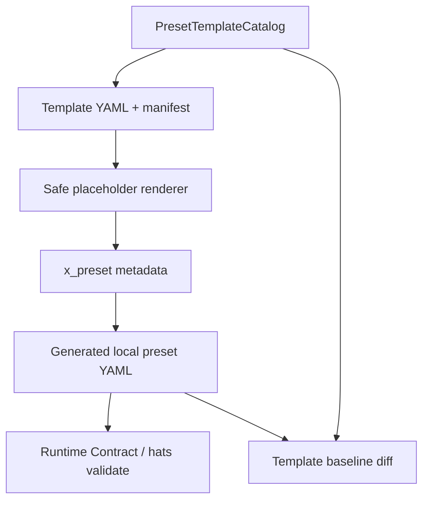
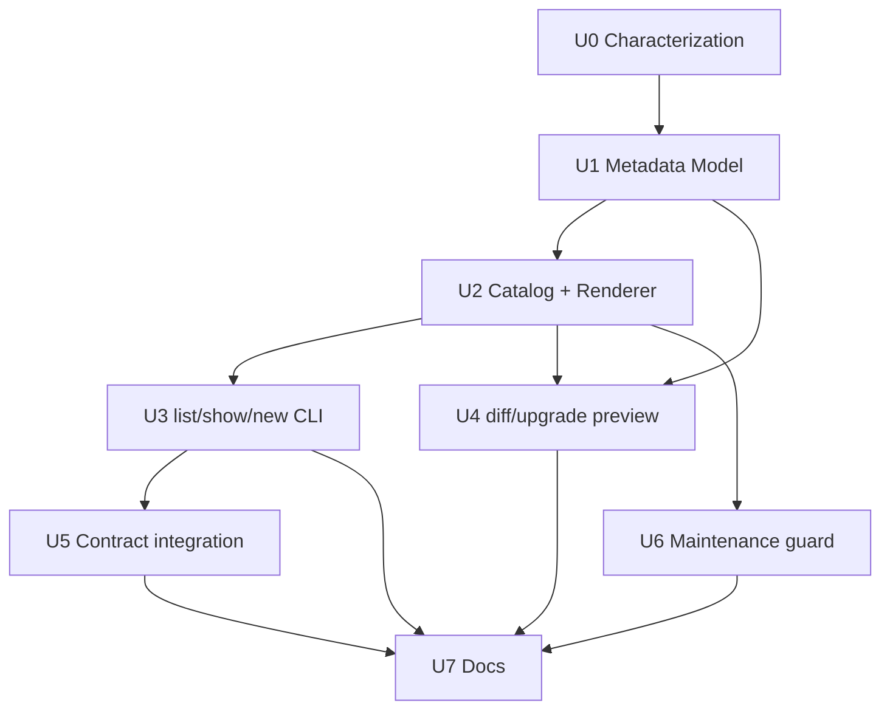

# Preset Template & Versioning: Workflow 模板化与版本化作者工具

## Overview

本计划解决 preset 作者体验问题：让用户能更轻松地创建自己的 workflow / preset，并且在后续 Ralph 升级、preset 修改、团队复用时知道“这个 preset 从哪里来、适配哪个 Ralph、该怎么验证、能不能升级”。

通俗地说：

- **模板化**：不要让用户从空白 YAML 开始写 workflow。Ralph 提供几种“可改造的脚手架”，例如串行开发、调试、只读研究、并行 review、plan-driven executor。用户用命令生成一份本地 preset，再按自己的业务改。
- **版本化**：每个生成出来的 preset 带一个小身份证，说明它基于哪个模板、模板版本是多少、需要哪个 Ralph preset schema 版本、推荐跑哪些检查。以后看到这份 YAML，能判断它是不是旧模板、是不是可能需要升级。
- **作者工具链**：提供 `ralph preset new/list/show/diff/upgrade` 这类作者入口，让“复制、改、校验、升级”的流程可见、可测试、可回归。

本计划不是引入 Helm、Kustomize 或另一个模板引擎。Ralph 的运行时仍然只消费当前已有的 `RalphConfig` / hats YAML。模板与版本只服务于 authoring、检查、文档和后续 diagnostics，不改变 `ralph run` 默认行为。

## Problem Frame

当前 preset 能用，但作者体验偏“手工维护”：

- 新建 preset 时，用户要自己知道该从哪个 builtin 复制、哪些字段不能漏、哪些 topic 应该收敛到 `required_events`。
- 新增 builtin preset 时，需要同时维护 `presets/en/*.yml`、`presets/manifest.yml`、`presets/index.json`、`crates/ralph-cli/src/presets.rs`、zsh completion、文档和测试。
- YAML 文件本身没有稳定元数据，无法回答“它来自哪个模板”“模板版本是多少”“适配哪个 Ralph 版本/contract 版本”。
- 后续如果模板升级，用户无法轻松知道自己的本地 preset 和新模板差在哪里。
- 现有 `ralph hats validate` / `ralph preflight` / runtime contract 计划能检查结果，但不能帮助用户从标准模板开始创建 workflow。

核心判断：

**模板化不是把 preset 变复杂，而是把“正确的起步方式”产品化。版本化不是运行时兼容层，而是给作者和工具一个稳定的对账锚点。**

## Requirements Trace

- **R1. 提供作者入口。** 新增 `ralph preset` 命令族，至少支持列模板、查看模板、从模板生成本地 preset。
- **R2. 模板输出是普通 Ralph YAML。** 生成结果必须能被现有 `-H <file>` 加载，不要求 `ralph run` 理解模板语法。
- **R3. 模板元数据可读。** 生成的 preset 带顶层 `x_preset` 元数据，记录模板名、模板版本、生成时间、Ralph preset schema 版本、推荐检查 profile。
- **R4. 版本检查不改变运行时。** `x_preset` 首版只被 `ralph preset` 作者命令读取；`RalphConfig` 解析和 `ralph run` 行为保持现状。
- **R5. 支持安全升级提示。** 提供只读 diff / upgrade 预览，能告诉用户本地 preset 与当前模板基线的差异；首版不自动合并复杂 YAML。
- **R6. 复用 Runtime Contract。** 生成后默认提示或可选执行 `ralph preset check` / `hats validate`；不再复制 contract 逻辑。
- **R7. 保护 builtin preset 维护链。** 模板系统不能让新增 builtin preset 更容易漏掉 manifest/index/Rust/zsh/doc/test 任一环。
- **R8. 可测试。** 模板渲染、变量替换、元数据解析、版本比较、diff 输出、CLI 行为和旧入口回归必须有明确测试。
- **R9. 不引入高风险模板语言。** MVP 使用受控占位符和 YAML 解析，不引入 Tera/Handlebars/Go template 等通用模板执行能力。
- **R10. 不引入回归。** 不改变 `HatsSource::parse()`、`get_preset()`、`list_presets()`、`PreflightRunner`、payload hard gate 和现有 builtin preset 内容。
- **R11. 文档面向普通 preset 作者。** 文档必须解释“什么时候用模板”“什么时候只是复制 builtin”“怎么验证自己生成的 preset”。

## Scope Boundaries

### In Scope

- 新增 `ralph preset` 作者命令族：
  - `ralph preset list`
  - `ralph preset show <template>`
  - `ralph preset new <template> --name <name> --output <path>`
  - `ralph preset diff --file <path>`
  - `ralph preset upgrade --file <path> --dry-run`
- 新增内置 preset template catalog，首批模板面向已有 Ralph 工作流模式。
- 新增 `x_preset` 元数据解析与版本比较工具。
- 新增受控占位符渲染，不执行任意表达式。
- 新增生成后校验建议或可选 `--check`。
- 新增详细测试矩阵和文档。

### Out of Scope

- 不把 template 语法加入 `ralph run`。
- 不做远程 template repository、签名分发、模板 marketplace。
- 不做复杂三方 merge 或自动解决用户 YAML 改动冲突。
- 不默认把用户生成的 preset 注册为 builtin。
- 不修改现有 builtin preset 的运行语义。
- 不替代 Runtime Contract Consolidation 计划中的 `ralph preset check`。
- 不引入通用模板语言或脚本执行能力。

### Deferred to Separate Tasks

- **模板包发布机制：** 远程 template registry、版本 pin、签名校验后续单独设计。
- **自动迁移器：** 复杂 YAML AST merge、字段级迁移、交互式升级后续再做。
- **Web dashboard preset builder：** UI 化编辑 workflow 后续再考虑。
- **Diagnostics 报告接入：** diagnostics 可以读取 `x_preset` 辅助定位，但不是本计划的首要交付。

## Context & Research

### Repo Reality Check

- `crates/ralph-cli/src/main.rs` 已有全局 `-H/--hats`，现有命令通过 `HatsSource::parse()` 支持 file、builtin、remote。
- `crates/ralph-cli/src/presets.rs` 当前用 `EmbeddedPreset` 常量数组暴露 builtin preset，并通过 `include_str!(concat!(env!("OUT_DIR"), ...))` 嵌入 `presets/en/*.yml`。
- `crates/ralph-cli/build.rs` 读取 `presets/manifest.yml`，把 allowlist 中的英文 preset 复制到 `$OUT_DIR`，并在构建时发现 manifest 与文件漂移。
- `presets/index.json` 是用户可见 builtin 列表；hidden builtin 如 `merge-loop` 不进入普通列表。
- `scripts/ralph-zsh-plugin.zsh` 需要手工维护 builtin `-H builtin:*` 补全；项目规则要求新增/变更 builtin preset 时同步更新并安装验证。
- `RalphConfig` 顶层没有 `deny_unknown_fields`，未知顶层字段会被 serde 忽略。因此首版可以在 YAML 顶层添加 `x_preset` 元数据，不破坏现有 `RalphConfig::parse_yaml()` 和 `ralph run`。
- `RalphConfig::validate()`、`preset_validator::validate_preset_topology()`、`payload_contract::validate_payload_contract()` 已经能检查生成后 YAML 的主要结构风险。
- `docs/plans/2026-06-05-001-feat-runtime-contract-consolidation-plan.md` 计划新增 `ralph preset check`，本计划应复用它，不重复实现 contract report。

### Relevant Existing Patterns

- CLI 命令注册模式：`crates/ralph-cli/src/main.rs` 的 `Commands` enum + 独立模块 `execute(...)`。
- hats 子命令模式：`crates/ralph-cli/src/hats.rs` 使用 `clap::{Parser, Subcommand, ValueEnum}`，并在模块内做输出和测试。
- builtin preset registry：`crates/ralph-cli/src/presets.rs` 提供 `list_presets()`、`get_preset()`、`preset_names()`。
- 预检加载路径：`crates/ralph-cli/src/preflight.rs` 已经能把 `HatsSource::Builtin/File/Remote` 合并到 core config。
- 文档组织：`docs/guide/presets.md` 当前是 preset 使用主文档，`presets/README.md` 是仓库内维护说明。

### Institutional Learnings

- `docs/solutions/tooling-decisions/ralph-preset-embedded-compilation-2026-05-26.md` 记录过旧的双目录镜像问题；当前 repo 已迁移到 `build.rs + presets/manifest.yml + $OUT_DIR` 模式。新计划不能重新引入镜像目录漂移。
- `docs/solutions/developer-experience/ralph-zsh-builtin-hat-completion-maintenance-2026-05-26.md` 明确 builtin preset 变化必须同步 zsh completion，且 `builtin:*` 值要用 `compadd`，不能用 `_describe`。
- `docs/plans/2026-06-04-004-feat-ce-executor-wave-preset-plan.md` 的验证矩阵证明：新增 workflow 能力时，必须同时保护新 preset 和原 `ce-executor` 不回归。
- `docs/plans/2026-06-05-001-feat-runtime-contract-consolidation-plan.md` 已把 preset 检查入口、strict 语义和 builtin preset matrix 纳入后续 Runtime Contract 工作。本计划应依赖该入口，而不是再造一个验证系统。

### External References

- Helm chart 把 chart metadata、默认 values、templates 分开，并用 chart `version` 作为包名和 CLI 工具识别锚点。对 Ralph 的启发是：模板需要稳定元数据和版本，而不是靠文件名猜语义。
- Kubernetes Kustomize 的 base / overlay 思路说明：可复用基线和本地差异应该分开；base 不知道 overlay，overlay 在其上定制。对 Ralph 的启发是：生成后的用户 preset 可以保留模板基线信息，后续 diff 时用它对账，但运行时仍消费普通 YAML。
- JSON Schema 通过 `$schema` / `$id` 给 schema 版本和解析锚点。对 Ralph 的启发是：`x_preset.schema_version` 应该是机器可读的显式字段，不能只写在人类注释里。

## Key Technical Decisions

1. **新增 `ralph preset` 作者命令，不复用 `ralph init --list-presets` 承担所有职责。**  
   `init` 负责项目初始化，`preset` 负责 workflow authoring。这样用户心智更清楚，也避免继续把 preset 相关能力塞进 init。

2. **模板生成普通 YAML，不引入运行时 template 解释。**  
   生成之后的文件就是当前 Ralph 能加载的 hats/config YAML。`ralph run -H .ralph/hats/foo.yml` 不需要知道模板系统存在。

3. **`x_preset` 作为顶层扩展元数据。**  
   现有 `RalphConfig` 会忽略未知顶层字段，因此 `x_preset` 对运行时是透明的。作者命令通过 raw YAML 读取它，用于 list/diff/upgrade/check。

4. **MVP 使用受控占位符，不引入通用模板引擎。**  
   支持有限变量如 `{{preset_name}}`、`{{description}}`、`{{author}}`、`{{generated_at}}`。不支持循环、条件、函数、文件 include、shell 执行。

5. **模板目录和 builtin preset 目录分开。**  
   builtin preset 是产品运行面，template 是作者脚手架。模板可以基于 builtin 形态，但不自动成为 builtin。

6. **版本化首版只做检测和提示，不自动迁移复杂 YAML。**  
   `upgrade --dry-run` 输出当前文件与新模板基线差异、版本差异和建议动作。真正写回只允许在无用户改动或明确 `--force` 的简单场景，MVP 可先不实现写回。

7. **模板生成必须默认走验证链。**  
   `preset new --check` 可以直接调用 Runtime Contract 计划中的 `ralph preset check` 能力；如果该计划尚未实现，则先复用 `RalphConfig::validate()`、topology validator 和 payload contract validator 的本地 helper。

8. **新增 builtin preset 维护仍保持显式。**  
   模板工具可以生成本地 preset，但不能绕过 `presets/manifest.yml`、`presets/index.json`、`crates/ralph-cli/src/presets.rs`、zsh completion 的显式维护要求。

9. **与 Runtime Contract 计划共享同一个 `ralph preset` 命名空间。**  
   `docs/plans/2026-06-05-001-feat-runtime-contract-consolidation-plan.md` 已计划新增 `ralph preset check`。本计划不能另建一套命令入口；如果 `check` 已实现，就扩展同一个 `crates/ralph-cli/src/commands/preset.rs`；如果尚未实现，也要按同一模块路径创建，给后续 `check` 留子命令位置。

## Behavior Matrix

| 用户想做什么 | 推荐命令 | 产物 | 是否影响 `ralph run` |
|---|---|---|---|
| 看有哪些 workflow 起步模板 | `ralph preset list` | 模板列表 | 否 |
| 看模板会生成什么 | `ralph preset show <template>` | 模板说明或 YAML 预览 | 否 |
| 从模板创建本地 preset | `ralph preset new code-assist --name my-flow --output .ralph/hats/my-flow.yml` | 普通 YAML + `x_preset` | 生成后可被 `-H` 使用 |
| 验证生成结果 | `ralph preset check -H .ralph/hats/my-flow.yml --strict` | contract report | 否 |
| 看本地 preset 和模板差异 | `ralph preset diff --file .ralph/hats/my-flow.yml` | diff / summary | 否 |
| 看是否能升级模板版本 | `ralph preset upgrade --file .ralph/hats/my-flow.yml --dry-run` | 升级建议 | 否 |
| 真正运行 workflow | `ralph run -H .ralph/hats/my-flow.yml -p ...` | 正常 loop | 行为仍由普通 YAML 决定 |

## Template Catalog Shape

首批模板建议从已有稳定/常用模式抽取，不扩大 builtin 支持面：

| Template | 基线 | 适合场景 | 首版风险处理 |
|---|---|---|---|
| `minimal-linear` | 新建极简二到三 hat 链 | 用户学习/小工作流 | 最小字段，强校验 |
| `code-assist` | 参考 `builtin:code-assist` | 默认实现工作流 | 不直接改 builtin，只生成本地副本 |
| `debug` | 参考 `builtin:debug` | 调试、复现、验证 | 保留只针对问题调查的说明 |
| `research` | 参考 `builtin:research` | 只读代码探索 | 明确 no-code-change |
| `review` | 参考 `builtin:review` | 代码审查 | 明确不修改代码 |
| `ce-executor-lite` | 参考 `builtin:ce-executor` 的简化版 | plan-driven 串行执行 | 默认不启用 wave，降低复杂度 |
| `scatter-gather-review` | 参考 wave review 模式 | 多维 review 汇总 | 默认较小 concurrency，必须有 aggregate |

首版不建议把 `ce-executor-wave` 作为完整模板直接暴露给新用户。它的并发执行边界、owned files、aggregate timeout、fallback 逻辑复杂，适合作为高级示例或后续 P2 模板。

## High-Level Technical Design

> *This illustrates the intended approach and is directional guidance for review, not implementation specification. The implementing agent should treat it as context, not code to reproduce.*



关键边界：

- Catalog 和 Renderer 是 authoring 层。
- Output 是普通 Ralph YAML。
- Contract 检查复用现有/计划中的验证能力。
- Diff 读取 `x_preset.template` 和 `x_preset.template_version` 找到基线，但不参与运行时调度。

## Implementation Units

- [ ] **U0: Characterization Tests for Current Preset Surfaces**

**Goal:** 在新增模板化能力前锁住现有 preset 入口和 builtin 行为，防止作者工具影响运行路径。

**Requirements:** R4, R7, R8, R10

**Dependencies:** None

**Files:**
- Modify: `crates/ralph-cli/src/main.rs`（test-only）
- Modify: `crates/ralph-cli/src/presets.rs`（test-only）
- Modify: `crates/ralph-cli/src/cli/shared.rs`（test-only）
- Modify: `crates/ralph-cli/src/preflight.rs`（test-only）
- Test: `crates/ralph-cli/src/main.rs`
- Test: `crates/ralph-cli/src/presets.rs`
- Test: `crates/ralph-cli/src/cli/shared.rs`
- Test: `crates/ralph-cli/src/preflight.rs`

**Approach:**
- 先补现有行为测试，再新增 `preset` 命令。
- 锁住 `HatsSource::parse()` 对 `builtin:`, file path, remote URL 的行为。
- 锁住 `list_presets()` 只返回 public presets，`get_preset("merge-loop")` 仍可用于 internal。
- 锁住 `ralph init --list-presets` 的现有能力不被 `ralph preset list` 替代或删除。
- 锁住 default no-subcommand 仍解析为 `run`。

**Execution note:** Characterization-first。这个单元必须先执行。

**Patterns to follow:**
- `crates/ralph-cli/src/main.rs` 中现有 clap parse tests。
- `crates/ralph-cli/src/presets.rs` 中现有 builtin preset tests。

**Test scenarios:**
- Happy path: `HatsSource::parse("builtin:code-assist")` 仍返回 builtin source。
- Happy path: `HatsSource::parse(".ralph/hats/my.yml")` 仍返回 file source。
- Happy path: `HatsSource::parse("https://example.com/hats.yml")` 仍返回 remote source。
- Regression: `list_presets()` 返回 public preset，不包含 hidden `merge-loop`。
- Regression: `get_preset("merge-loop")` 仍能返回 hidden preset。
- Regression: `ralph init --list-presets` 仍能解析。
- Regression: `ralph -p "task"` 或 no subcommand 默认 run parse 不被新增 `preset` 影响。
- Regression: `ralph hats validate -H builtin:code-assist` parse path 不受影响。

**Verification:**
- 新命令落地前，旧 preset surface 有测试保护。

- [ ] **U1: Add Preset Template Metadata Model**

**Goal:** 定义 `x_preset` 和 template manifest 的结构化模型，为生成、diff、upgrade 和 diagnostics 留稳定锚点。

**Requirements:** R3, R4, R5, R8

**Dependencies:** U0

**Files:**
- Create: `crates/ralph-cli/src/preset_templates.rs`
- Modify: `crates/ralph-cli/src/main.rs`
- Optional Modify: `Cargo.toml`
- Optional Modify: `crates/ralph-cli/Cargo.toml`
- Test: `crates/ralph-cli/src/preset_templates.rs`

**Approach:**
- 在 CLI 层实现 metadata 解析，避免把 authoring-only 元数据塞进 `ralph-core` 运行时模型。
- `x_preset` 建议字段：
  - `schema_version`: 首版固定为 `1`。
  - `template`: 模板名，例如 `code-assist`。
  - `template_version`: 模板版本，使用 SemVer 字符串。
  - `generated_by`: 例如 `ralph preset new`。
  - `generated_at`: RFC3339 或稳定可解析时间字符串。
  - `name`: 用户生成的 preset 名称。
  - `description`: 用户说明。
  - `check_profile`: `authoring` / `strict` / `runtime-ready`。
  - `ralph_compat`: 可选范围，例如 `>=0.2.0`，首版只展示不强制。
- template manifest 建议字段：
  - `name`
  - `version`
  - `description`
  - `category`
  - `difficulty`
  - `source`
  - `recommended_checks`
  - `placeholders`
  - `output_notes`
- 解析 metadata 时从 raw `serde_yaml::Value` 读取 `x_preset`，再把同一 YAML 交给 `RalphConfig::parse_yaml()` 验证运行时可读性。
- 不修改 `RalphConfig` struct；不让运行时依赖 `x_preset`。
- 版本比较必须显式实现：优先使用小而成熟的 `semver` crate；如果实施者选择不新增依赖，则只能实现受限的 `MAJOR.MINOR.PATCH` parser，并用测试覆盖 prerelease、build metadata 和非法版本的拒绝行为。

**Technical design:**  
方向性 YAML 形态如下：

```yaml
x_preset:
  schema_version: 1
  template: code-assist
  template_version: "1.0.0"
  generated_by: "ralph preset new"
  generated_at: "2026-06-05T00:00:00Z"
  name: my-code-flow
  description: "Team-specific code assist workflow"
  check_profile: strict
  ralph_compat: ">=0.2.0"
```

**Patterns to follow:**
- `crates/ralph-cli/src/cli/shared.rs` 中 CLI-only 类型留在 CLI 层的做法。
- `crates/ralph-core/src/config/ralph_config.rs` 先 raw YAML pre-check 再 `serde_yaml::from_value` 的解析模式。

**Test scenarios:**
- Happy path: 含 `x_preset` 的 YAML 能解析出 metadata，也能被 `RalphConfig::parse_yaml()` 接受。
- Happy path: 不含 `x_preset` 的旧 preset 返回 `None` metadata，不报错。
- Error path: `x_preset.schema_version` 非数字或为空时，metadata parser 返回作者命令错误，但不改变 `RalphConfig` parse 行为。
- Error path: `template_version` 不是可比较版本字符串时，`preset diff/upgrade` 报 metadata error。
- Regression: 含 `x_preset` 的 YAML 通过现有 `hats validate` config load path。
- JSON path: metadata 可以序列化为稳定 JSON，用于未来 diagnostics。

**Verification:**
- `x_preset` 成为 authoring 元数据，不进入 runtime contract。

- [ ] **U2: Add Safe Template Catalog and Renderer**

**Goal:** 提供内置模板 catalog 和安全渲染器，从受控模板生成普通 YAML。

**Requirements:** R1, R2, R3, R8, R9

**Dependencies:** U1

**Files:**
- Modify: `crates/ralph-cli/src/preset_templates.rs`
- Create: `crates/ralph-cli/preset-templates/minimal-linear.yml`
- Create: `crates/ralph-cli/preset-templates/code-assist.yml`
- Create: `crates/ralph-cli/preset-templates/debug.yml`
- Create: `crates/ralph-cli/preset-templates/research.yml`
- Create: `crates/ralph-cli/preset-templates/review.yml`
- Create: `crates/ralph-cli/preset-templates/ce-executor-lite.yml`
- Optional Create: `crates/ralph-cli/preset-templates/scatter-gather-review.yml`
- Test: `crates/ralph-cli/src/preset_templates.rs`

**Approach:**
- 模板文件放在 CLI crate 内，作为 CLI authoring 资源嵌入，和 runtime builtin preset 的 `presets/en/` 分开。
- 模板 catalog 可以先用 Rust 常量显式列出，不读取远程或用户目录。
- 占位符白名单：
  - `preset_name`
  - `description`
  - `author`
  - `generated_at`
  - `starting_event`
  - `completion_promise`
- 渲染器只做精确占位符替换；遇到未知占位符直接报错。
- 渲染后必须用 YAML parser 校验，并用 `RalphConfig::parse_yaml()` 校验可被运行时接受。
- 模板文件中的 `x_preset` 可以包含默认 metadata，渲染时覆盖 `name`、`description`、`generated_at`。
- 避免把完整 `ce-executor-wave` 变成首版模板，减少并发 workflow 误用风险。

**Patterns to follow:**
- `crates/ralph-cli/src/presets.rs` 的显式 catalog 模式。
- `crates/ralph-cli/build.rs` 的 allowlist 思路，但 template 不进入 `presets/manifest.yml`。

**Test scenarios:**
- Happy path: 每个 template 都能用最小变量成功渲染。
- Happy path: 渲染结果是合法 YAML，并能被 `RalphConfig::parse_yaml()` 接受。
- Happy path: 渲染结果包含 `x_preset.template` 和正确 `template_version`。
- Edge case: `preset_name` 包含空格、大写或非法字符时被拒绝，错误说明允许字符。
- Edge case: `description` 为空时使用模板默认描述或明确报错。
- Error path: 模板包含未知 `{{foo}}` 占位符时报错。
- Error path: 模板渲染后 YAML 结构不合法时报错，并指出模板名。
- Regression: template catalog 不改变 `list_presets()` public builtin 数量。
- Regression: template 文件不需要加入 `presets/manifest.yml`。

**Verification:**
- 模板渲染不执行代码、不读任意文件、不影响 builtin preset registry。

- [ ] **U3: Add `ralph preset list/show/new` CLI**

**Goal:** 暴露首批作者命令，让用户能发现模板、查看模板并生成本地 preset。

**Requirements:** R1, R2, R3, R6, R8, R11

**Dependencies:** U2

**Files:**
- Create or Modify: `crates/ralph-cli/src/commands/preset.rs`
- Modify: `crates/ralph-cli/src/commands/mod.rs`
- Modify: `crates/ralph-cli/src/main.rs`
- Modify: `crates/ralph-cli/src/commands/completions.rs`（if command completions are maintained here）
- Optional Modify: `scripts/ralph-zsh-plugin.zsh`
- Test: `crates/ralph-cli/src/commands/preset.rs`
- Test: `crates/ralph-cli/src/main.rs`

**Approach:**
- 新增 `Commands::Preset(preset::PresetArgs)`，和现有 `Hats`、`Preflight` 同级。
- 如果 Runtime Contract 计划已先落地 `ralph preset check`，本单元只新增 `list/show/new` 子命令；如果本计划先落地，则必须保留 `check` 子命令扩展点，不占用或改变上一份计划定义的 strict / format 语义。
- `preset list` 默认列出 template catalog，不列 builtin preset；如果需要同时看 builtin，可提供 `--kind templates|builtins|all`。
- `preset show <template>` 支持 `--format human|yaml|json`。
- `preset new <template>` 参数建议：
  - `--name <name>`
  - `--description <text>`
  - `--output <path>`
  - `--force` 覆盖已有文件
  - `--check` 生成后运行作者级检查
  - `--format human|json` 输出生成摘要
- 如果 `--output` 缺省，默认写入 `.ralph/hats/<name>.yml`，但必须先创建父目录并避免覆盖。
- 文件写入必须是原子或近似原子：先写 temp，再 rename；失败时不留下半截文件。
- `--check` 如果 Runtime Contract 计划已经实现，则调用共享 helper；否则 MVP 可调用 config validate + topology + payload validator 并在文档中说明临时覆盖范围。
- 输出中明确下一步命令，例如 `ralph run -H .ralph/hats/<name>.yml -p ...` 和 `ralph preset check -H ... --strict`。

**Patterns to follow:**
- `crates/ralph-cli/src/hats.rs` 的子命令结构。
- `crates/ralph-cli/src/commands/init.rs` 的用户可见输出风格。
- `crates/ralph-cli/src/preflight.rs` 的 human/json 输出分离。

**Test scenarios:**
- Happy path: `ralph preset list` 输出所有 template 名称和描述。
- Happy path: `ralph preset list --format json` 输出可解析 JSON，包含 `name`、`version`、`category`。
- Happy path: `ralph preset show code-assist --format yaml` 输出模板渲染前或预览 YAML，且不写文件。
- Happy path: `ralph preset new minimal-linear --name my-flow --output <tmp>/my-flow.yml` 写入文件。
- Happy path: 生成文件包含 `x_preset` 和 `hats`。
- Error path: 未知模板名报错并列出可用模板。
- Error path: output 文件已存在且未传 `--force` 时拒绝覆盖。
- Error path: output 父目录不存在且不能创建时报错。
- Regression: 新增 `preset` 命令后 `ralph hats list`、`ralph init --list-presets`、默认 run parse 仍通过。
- CLI compatibility: global `-H` 不影响 `preset new`；`preset` 命令不要求 `-H`。

**Verification:**
- 用户可以不用手动复制 builtin YAML，就能生成一个可运行的本地 preset。

- [ ] **U4: Add Version Diff and Upgrade Preview**

**Goal:** 让用户知道自己的本地 preset 和当前模板基线差在哪里，以及是否基于旧模板版本。

**Requirements:** R3, R5, R8, R10

**Dependencies:** U1, U2, U3

**Files:**
- Modify: `crates/ralph-cli/src/commands/preset.rs`
- Modify: `crates/ralph-cli/src/preset_templates.rs`
- Test: `crates/ralph-cli/src/commands/preset.rs`
- Test: `crates/ralph-cli/src/preset_templates.rs`

**Approach:**
- `preset diff --file <path>`：
  - 读取文件 `x_preset.template` 和 `x_preset.template_version`。
  - 根据 metadata 找到当前 catalog 中同名模板。
  - 用同名/描述等 metadata 重新渲染当前模板基线。
  - 输出用户文件与当前基线的摘要差异。
- `preset upgrade --file <path> --dry-run`：
  - 如果本地 `template_version == catalog.version`，输出 already current。
  - 如果本地版本落后，输出版本差异、模板 release notes（若有）、diff 摘要和建议。
  - MVP 默认 dry-run；不自动写回复杂文件。
- diff 首版可以文本级 unified diff + 结构化 summary；不要一开始实现复杂 YAML AST merge。
- 对没有 `x_preset` 的手写 YAML，命令应给出友好错误：可以先运行 `preset check`，但无法 template diff。
- 对用户明显改过的文件，`upgrade` 只建议人工迁移，避免覆盖用户业务逻辑。

**Patterns to follow:**
- `git diff` 风格的 compact diff 思路可以作为输出启发，但实现不要依赖 git。
- `docs/plans/2026-06-05-001-feat-runtime-contract-consolidation-plan.md` 对 JSON/human 双输出的分层。

**Test scenarios:**
- Happy path: 文件基于当前模板，`diff` 输出 no drift 或 equivalent。
- Happy path: 文件基于旧模板版本，`upgrade --dry-run` 输出 old/new version。
- Happy path: 用户修改了 hat instructions，`diff` 摘要指出 changed sections。
- Error path: 文件没有 `x_preset`，`diff` 返回 actionable error。
- Error path: `x_preset.template` 不存在于当前 catalog，提示模板不可用。
- Error path: `template_version` 高于当前 catalog，提示当前 Ralph 可能过旧，不尝试降级。
- Regression: `upgrade --dry-run` 不写文件；mtime 或内容保持不变。
- JSON path: `diff --format json` 包含 `template`, `local_version`, `catalog_version`, `status`, `changes`。

**Verification:**
- 用户能判断本地 preset 是否从旧模板生成，以及是否需要人工合并新模板改动。

- [ ] **U5: Integrate with Runtime Contract Without Duplicating It**

**Goal:** 生成后能立即检查 preset，但模板系统不复制 contract 逻辑，也不改变 `ralph run` hard gate。

**Requirements:** R6, R8, R10

**Dependencies:** U3 and Runtime Contract plan if available

**Files:**
- Modify: `crates/ralph-cli/src/commands/preset.rs`
- Optional Modify: `crates/ralph-core/src/runtime_contract.rs`
- Optional Modify: `crates/ralph-cli/src/preflight.rs`
- Test: `crates/ralph-cli/src/commands/preset.rs`

**Approach:**
- 如果 `ralph preset check` 已由 Runtime Contract 计划实现，`preset new --check` 应调用同一个共享 helper 或内部 adapter。
- 如果尚未实现，首版 `--check` 只能执行最小 authoring checks：
  - YAML parse
  - `RalphConfig::parse_yaml()`
  - `RalphConfig::validate()`
  - `validate_preset_topology()`
  - `validate_payload_contract(..., strict=false/true by profile)`
- 输出中明确检查 profile 和覆盖范围。
- `preset new --check` 的顺序必须确定：先生成并写入目标文件，再运行检查；如果检查失败，保留生成文件并返回非零状态，输出中说明文件已保留，方便作者打开修复。
- 不调用 live backend，不启动 agent，不写 `.ralph/diagnostics`。
- 不改变 `enforce_payload_contract_gate()`。
- 不默认开启 `features.preflight.enabled`。

**Patterns to follow:**
- `crates/ralph-cli/src/preflight.rs` 的 config load + hats source 合并。
- Runtime Contract 计划中的 `payload_strict` / `fail_on_warnings` 分离语义。

**Test scenarios:**
- Happy path: `preset new minimal-linear --check` 成功写文件并返回 check pass。
- Error path: 构造坏模板或临时 bad output，`--check` 返回失败并保留生成文件，输出中包含目标路径和失败检查来源。
- Regression: `--check` 不调用 backend detection，不依赖本机安装 `claude/codex`。
- Regression: `--check` 不改变 `features.preflight.enabled` 默认语义。
- Regression: payload hard gate 相关测试仍在 loop_runner 中通过。
- Compatibility: 如果 Runtime Contract helper 存在，`preset new --check` 与 `ralph preset check -H <file>` 核心结论一致。

**Verification:**
- 模板生成后的问题尽量在 authoring 阶段暴露，而不是等真实 run 才发现。

- [ ] **U6: Builtin Authoring Maintenance Guard**

**Goal:** 防止模板化能力掩盖 builtin preset 维护链，新增/修改 builtin 时仍能被测试和脚本抓住漂移。

**Requirements:** R7, R8, R10

**Dependencies:** U2, U3

**Files:**
- Modify: `crates/ralph-cli/src/presets.rs`
- Modify: `presets/manifest.yml`
- Modify: `presets/index.json`
- Modify if needed: `scripts/ralph-zsh-plugin.zsh`
- Create: `scripts/validate-preset-authoring.sh`
- Test: `crates/ralph-cli/src/presets.rs`

**Approach:**
- 新增或强化测试，确保 builtin preset catalog 与 manifest/index/zsh 文档关系明确。
- 注意：模板文件不进入 `presets/manifest.yml`，也不进入 builtin `PRESETS`。
- `scripts/validate-preset-authoring.sh` 可以集中跑：
  - template catalog render tests
  - public builtin parse/config tests
  - manifest 与 `PRESETS` 对齐检查
  - `presets/index.json` public entry 对齐检查
  - zsh completion value 对齐检查（只对 public builtin，不对 templates）
- 如果脚本触及 zsh completion，必须保持 `compadd` 风格，并按项目规则安装到用户 oh-my-zsh 插件位置验证。
- 不把脚本默认接入 CI，除非实施后确认成本可接受；先作为开发者脚本。

**Patterns to follow:**
- `crates/ralph-cli/build.rs` 的 manifest allowlist 思路。
- `docs/solutions/developer-experience/ralph-zsh-builtin-hat-completion-maintenance-2026-05-26.md` 的补全维护规则。
- `docs/plans/2026-06-05-001-feat-runtime-contract-consolidation-plan.md` 的 builtin preset matrix 思路。

**Test scenarios:**
- Happy path: 所有 template 可渲染，所有 public builtin 可 parse。
- Regression: template 名称不出现在 `preset_names()`。
- Regression: public builtin 名称必须出现在 `presets/index.json`。
- Regression: hidden builtin 不强制出现在 `presets/index.json`。
- Regression: public builtin 名称必须出现在 zsh builtin completion values。
- Error path: 构造 manifest 中存在但 `PRESETS` 缺失的测试 helper，能失败并指出 preset 名。
- Error path: 构造 `PRESETS` 中存在但 manifest 缺失的测试 helper，能失败并指出 preset 名。
- Script path: `scripts/validate-preset-authoring.sh` 任一检查失败时 exit non-zero。

**Verification:**
- 模板化不会削弱 builtin 维护纪律，也不会新增“看起来存在但 CLI 找不到”的 preset。

- [ ] **U7: Documentation and Authoring Guide**

**Goal:** 用通俗文档解释模板化和版本化，让 preset 作者知道推荐流程和边界。

**Requirements:** R1, R2, R3, R5, R6, R7, R11

**Dependencies:** U3, U4, U5, U6

**Files:**
- Modify: `docs/guide/presets.md`
- Modify: `presets/README.md`
- Create: `docs/guide/preset-authoring.md`
- Modify: `docs/guide/cli-reference.md`
- Modify if needed: `scripts/test-cli-doc-drift.sh`
- Modify if needed: `AGENTS.md`
- Modify if needed: `CLAUDE.md`

**Approach:**
- 文档解释三层概念：
  - builtin preset：Ralph 官方内置、通过 `-H builtin:<name>` 使用。
  - template：用来生成本地 preset 的脚手架。
  - local preset：用户自己的普通 YAML，通过 `-H .ralph/hats/foo.yml` 使用。
- 给出推荐作者流程：
  - `ralph preset list`
  - `ralph preset show <template>`
  - `ralph preset new <template> --name <name> --output .ralph/hats/<name>.yml --check`
  - 修改 YAML
  - `ralph preset check -H .ralph/hats/<name>.yml --strict`
  - `ralph run -H .ralph/hats/<name>.yml -p ...`
- 明确 `x_preset` 是元数据，不是运行时指令。
- 明确版本化首版只能 diff / dry-run，不能保证自动升级复杂用户改动。
- `AGENTS.md` 和 `CLAUDE.md` 不是必改；只有新增对 agent/operator 有约束力的维护规则时才改，且必须完全同步。
- 如果新增 CLI help 示例，文档漂移测试要覆盖。

**Patterns to follow:**
- `docs/guide/presets.md` 当前的用户指南结构。
- `presets/README.md` 当前的维护说明。

**Test scenarios:**
- Documentation: CLI help 与文档命令名称一致。
- Documentation: 文档没有暗示 templates 会自动注册为 builtin。
- Documentation: 文档没有暗示 `x_preset` 会改变 `ralph run` 行为。
- Documentation: 如果改 `AGENTS.md` 或 `CLAUDE.md`，两者内容完全一致。
- Help smoke: `ralph preset --help`、`ralph preset list --help`、`ralph preset new --help` 可运行。

**Verification:**
- 新用户能理解：先用模板生成本地 preset，再用 contract 检查，再运行。

## Dependency Graph



## Phased Delivery

### Phase 1: No-Regression Baseline

- 完成 U0。
- 不新增用户可见命令。
- 目标是确认现有 preset registry、init list、hats source parse、default run parse 都被测试保护。

### Phase 2: Authoring Core

- 完成 U1、U2。
- 新增 metadata、template catalog、safe renderer。
- 此阶段仍可只通过单测验证，不急着暴露 CLI。

### Phase 3: User-Facing Creation

- 完成 U3、U5。
- 用户可以 `preset list/show/new`，生成后可选 `--check`。
- 保持 `ralph run` 默认行为不变。

### Phase 4: Version Awareness

- 完成 U4。
- 用户可以 diff / upgrade dry-run。
- 不做复杂自动 merge。

### Phase 5: Maintenance Guard and Docs

- 完成 U6、U7。
- 文档和脚本收口，避免模板系统和 builtin 系统互相混淆。

## Regression Test Plan

测试目标：**模板化是作者体验增强，不允许破坏现有 preset 加载、builtin 注册、运行前校验、`ralph run` 默认行为。**

### Test Layers

| Layer | Files | Must Cover | Regression Prevented |
|---|---|---|---|
| Current behavior characterization | `main.rs`, `presets.rs`, `cli/shared.rs`, `preflight.rs` | 现有 parse/list/load 行为 | 新命令破坏旧入口 |
| Metadata unit tests | `preset_templates.rs` | `x_preset` parse、missing metadata、invalid version | 元数据破坏普通 YAML |
| Renderer unit tests | `preset_templates.rs` | 占位符白名单、未知占位符、YAML parse | 模板注入或生成坏 YAML |
| CLI tests | `commands/preset.rs`, `main.rs` | list/show/new/diff/upgrade args、exit code、json output | 作者命令不可用或解析冲突 |
| Contract integration tests | `commands/preset.rs` | `--check` 成功/失败、无 backend 依赖 | 生成后问题延迟到 run |
| Builtin maintenance tests | `presets.rs`, script | manifest/index/PRESETS/zsh 对齐 | builtin 漂移 |
| Docs/help smoke | docs + help tests | 文档命令和 help 一致 | 用户按文档失败 |
| Full workspace gate | workspace tests | 跨 crate 回归 | 非局部破坏 |

### Metadata Test Matrix

| Scenario | Input | Expected |
|---|---|---|
| Old preset without metadata | YAML has `hats`, no `x_preset` | metadata parser returns `None`; `RalphConfig` parse succeeds |
| Generated preset metadata | YAML has valid `x_preset` | parser returns template/name/version/check profile |
| Unknown top-level metadata | YAML has `x_preset` | existing runtime parse ignores it |
| Bad schema version | `schema_version: abc` | authoring command error |
| Missing template name | `x_preset` lacks `template` | diff/upgrade error with actionable message |
| Bad template version | `template_version: latest` | version comparison error |
| Future schema version | `schema_version: 99` | authoring command says unsupported, runtime parse still succeeds |
| JSON output | valid metadata | stable fields serialize |

### Renderer Test Matrix

| Scenario | Input | Expected |
|---|---|---|
| Minimal render | `minimal-linear`, valid name | YAML parses and validates |
| Builtin-derived render | `code-assist`, valid name | YAML parses, contains expected hats |
| Read-only template render | `research` | instructions preserve no-code-change intent |
| Placeholder replacement | `{{preset_name}}`, `{{generated_at}}` | all known placeholders replaced |
| Unknown placeholder | `{{shell_exec}}` | render fails |
| Unsafe name | `my flow` or `../flow` | render/new rejects |
| Empty description | no description | default or explicit error per template manifest |
| Template YAML broken | malformed fixture | test fails before CLI exposure |
| Runtime parse | rendered YAML | `RalphConfig::parse_yaml()` succeeds |
| Topology check | rendered YAML | authoring topology passes or known warning documented |

### CLI Test Matrix

| Command | Scenario | Expected |
|---|---|---|
| `ralph preset list` | default | human table includes template names |
| `ralph preset list --format json` | scripting | valid JSON array |
| `ralph preset show minimal-linear` | human | includes description and placeholders |
| `ralph preset show minimal-linear --format yaml` | preview | no file write |
| `ralph preset new minimal-linear --name my-flow --output tmp.yml` | generate | file exists and parses |
| `ralph preset new unknown --name x` | invalid template | exit 1, lists available templates |
| `ralph preset new minimal-linear --name my-flow --output existing.yml` | no force | refuses overwrite |
| `ralph preset new minimal-linear --force` | overwrite | overwrites only target file |
| `ralph preset diff --file generated.yml` | current version | reports current or no drift |
| `ralph preset upgrade --file generated.yml --dry-run` | old version fixture | reports old/new version, no write |

### Run-Path Non-Regression Matrix

| Scenario | Expected |
|---|---|
| `ralph run -H builtin:code-assist` parse | unchanged |
| `ralph run -H .ralph/hats/my-flow.yml` using generated file | normal hats source load path |
| default no subcommand | still run |
| `ralph init --list-presets` | unchanged |
| `ralph hats validate` | unchanged except it can validate generated files |
| `features.preflight.enabled=false` | still no auto preflight |
| payload hard gate | still enforced before backend spawn |
| diagnostics disabled | preset authoring commands do not create runtime diagnostics session |

### Builtin Maintenance Matrix

| Scenario | Expected |
|---|---|
| Public builtin in `PRESETS` | present in `presets/index.json` |
| Public builtin in `PRESETS` | present in zsh builtin completion |
| Hidden builtin | loadable by `get_preset`, not required in `index.json` |
| Template catalog entry | not present in `preset_names()` unless also intentionally builtin |
| Template file | not required in `presets/manifest.yml` |
| Manifest entry | matching `presets/en/<name>.yml` exists |
| Manifest/PRESETS mismatch | test or script fails with preset name |
| zsh script changed | `zsh -n` and completion value smoke pass |

### Test Ordering Gate

1. **G0 Characterization:** U0 tests pass before adding CLI.
2. **G1 Metadata:** U1 tests prove `x_preset` does not break runtime parse.
3. **G2 Renderer:** U2 tests prove every template renders valid YAML.
4. **G3 CLI:** U3 tests prove `list/show/new` are additive.
5. **G4 Version Preview:** U4 tests prove diff/upgrade dry-run never writes unintentionally.
6. **G5 Contract Integration:** U5 tests prove `--check` catches generated preset defects without backend.
7. **G6 Maintenance Guard:** U6 script/tests catch builtin/template catalog drift.
8. **G7 Full Gate:** workspace standard tests pass.

## System-Wide Impact

- **CLI surface:** 新增 `ralph preset` 命令族；必须保护 default run parse、global `-H`、`init --list-presets`、`hats validate`。
- **Runtime config:** 不修改 `RalphConfig`，不让 `x_preset` 参与 event loop。
- **Builtin preset registry:** 不改变 `PRESETS` 语义；template catalog 是独立 authoring catalog。
- **Build system:** template 文件可用 CLI crate 内嵌方式；不能重新引入旧的 mirror drift。
- **Docs and completion:** 新增 `preset` 子命令可能需要 completion 更新；builtin `-H builtin:*` completion 仍按现有规则维护。
- **Diagnostics future:** 后续 diagnostics 可以读取 `x_preset`，把报告定位到模板版本，但这不是运行时硬依赖。
- **Security:** 受控占位符替换避免任意模板代码执行；不读取远程模板，不运行 shell。
- **Unchanged invariants:** `ralph run` 默认行为、payload hard gate、preflight enabled 默认值、builtin preset 内容和 hidden/public 语义保持不变。

## Alternative Approaches Considered

| Approach | Why Not Chosen |
|---|---|
| 只写文档让用户复制 builtin YAML | 仍然依赖人工复制和记忆，无法版本化、diff、升级提示 |
| 把模板直接做成 builtin preset | 会扩大产品运行面，每个模板都变成需要长期支持的 builtin |
| 引入 Tera/Handlebars/Go template | 能力过强，带来语法、注入、安全和测试复杂度；MVP 不需要 |
| 在 `RalphConfig` 中正式加入 `preset_metadata` 字段 | 会把 authoring-only 元数据下沉到 runtime core，扩大回归面 |
| 直接实现自动 YAML AST merge 升级 | 风险高，容易覆盖用户业务改动；先做 dry-run 和人工建议 |
| 借鉴 Kustomize overlay 让 runtime 支持 base/patch | 会让 `ralph run` 多一种配置解释模式，当前收益不足 |

## Risks & Mitigations

| Risk | Likelihood | Impact | Mitigation |
|---|---:|---:|---|
| 模板系统和 builtin 系统混淆 | 中 | 高 | 明确两个 catalog 分离；测试 template 不进入 `preset_names()` |
| `x_preset` 元数据破坏旧 YAML 解析 | 低 | 高 | U1 测试证明 `RalphConfig::parse_yaml()` 忽略未知顶层字段 |
| 通用模板引擎带来执行风险 | 中 | 高 | MVP 只允许白名单占位符替换 |
| `preset new --check` 复制 runtime contract 逻辑 | 中 | 中 | 优先复用 Runtime Contract helper；临时 fallback 必须标注覆盖范围 |
| 自动 upgrade 覆盖用户改动 | 中 | 高 | MVP 默认 dry-run，不做复杂写回 |
| 新 CLI 子命令破坏默认 run parse | 中 | 高 | U0/U3 clap parse tests |
| 新脚本增加 CI 成本 | 低 | 中 | 首版作为开发脚本；是否进 CI 另行评估 |
| zsh completion 漂移 | 中 | 中 | U6 检查 public builtin 与 completion 对齐；模板不混入 builtin completion |
| 模板生成的 workflow 质量不稳定 | 中 | 高 | 每个模板渲染后跑 parse/config/topology/payload checks |

## Success Metrics

- 用户可以用一个命令生成可运行的本地 preset。
- 生成的 preset 带机器可读版本元数据。
- 用户可以看到本地 preset 与当前模板的差异。
- 模板生成不改变任何现有 builtin preset 和 `ralph run` 行为。
- 所有模板都有渲染和验证测试。
- 新增 builtin preset 的维护链不会因为模板系统变得更松散。

## Documentation / Operational Notes

- 文档中必须明确：
  - `builtin preset` 是运行时产品面。
  - `template` 是作者脚手架。
  - `local preset` 是用户生成后自己维护的普通 YAML。
- 推荐流程必须把 contract check 放在真实 run 前。
- `x_preset` 不应被描述为 runtime feature flag。
- 若实现新增 shell completion，必须验证 zsh 脚本语法和当前用户安装副本。
- 若修改 `AGENTS.md` 或 `CLAUDE.md`，必须保持完全一致。
- 本计划不涉及 `ralph tools` 子命令；不应触发 `crates/ralph-core/data/*.md` 反向验证规则。

## Acceptance Criteria

- [ ] `ralph preset list` 可列出 template catalog，且不改变 `ralph init --list-presets`。
- [ ] `ralph preset show minimal-linear --format json` 输出可解析 JSON。
- [ ] `ralph preset new minimal-linear --name my-flow --output <tmp>/my-flow.yml` 生成普通 YAML。
- [ ] 生成 YAML 包含有效 `x_preset`，并能被 `RalphConfig::parse_yaml()` 接受。
- [ ] 生成 YAML 可通过 `ralph hats validate -H <file>`，并可接入 `ralph preset check`。
- [ ] `ralph preset new --check` 不启动 backend、不依赖 live agent。
- [ ] `ralph preset diff --file <generated.yml>` 能根据 `x_preset` 找到模板基线。
- [ ] `ralph preset upgrade --file <generated.yml> --dry-run` 不写文件，并输出版本差异。
- [ ] 未含 `x_preset` 的旧 preset 仍可运行；只是在 diff/upgrade 命令中得到友好提示。
- [ ] `HatsSource::parse()` 行为不变。
- [ ] `list_presets()` / `get_preset()` public/hidden 语义不变。
- [ ] `ralph run` 默认 parse 和默认 preflight 行为不变。
- [ ] payload hard gate 仍不可跳过。
- [ ] 所有模板渲染测试、CLI 测试、builtin maintenance tests 通过。
- [ ] 如果修改 zsh completion，保持 `compadd` 风格并完成项目要求的安装验证。
- [ ] 如果修改 `AGENTS.md` 或 `CLAUDE.md`，两者完全一致。
- [ ] 项目标准测试通过：优先 `./scripts/run-tests.sh`；如 nextest 不可用，使用 AGENTS.md 指定 fallback。

## Sources & References

- `crates/ralph-cli/src/main.rs`：CLI 命令注册、global `-H`、default run parse。
- `crates/ralph-cli/src/cli/shared.rs`：`HatsSource` / `ConfigSource` 解析。
- `crates/ralph-cli/src/presets.rs`：builtin preset registry。
- `crates/ralph-cli/build.rs`：`presets/manifest.yml` 到 `$OUT_DIR` 的嵌入流程。
- `presets/manifest.yml`：embedded preset allowlist 和维护规则。
- `presets/index.json`：public builtin preset 用户可见索引。
- `scripts/ralph-zsh-plugin.zsh`：`builtin:*` 补全。
- `docs/guide/presets.md`：现有 preset 用户指南。
- `docs/solutions/tooling-decisions/ralph-preset-embedded-compilation-2026-05-26.md`：preset 嵌入机制历史经验。
- `docs/solutions/developer-experience/ralph-zsh-builtin-hat-completion-maintenance-2026-05-26.md`：zsh completion 维护经验。
- `docs/plans/2026-06-05-001-feat-runtime-contract-consolidation-plan.md`：Runtime Contract 依赖计划。
- Helm Charts docs: https://helm.sh/docs/v3/topics/charts/
- Kubernetes Kustomize docs: https://kubernetes.io/docs/tasks/manage-kubernetes-objects/kustomization/
- JSON Schema Draft 2020-12: https://json-schema.org/draft/2020-12
