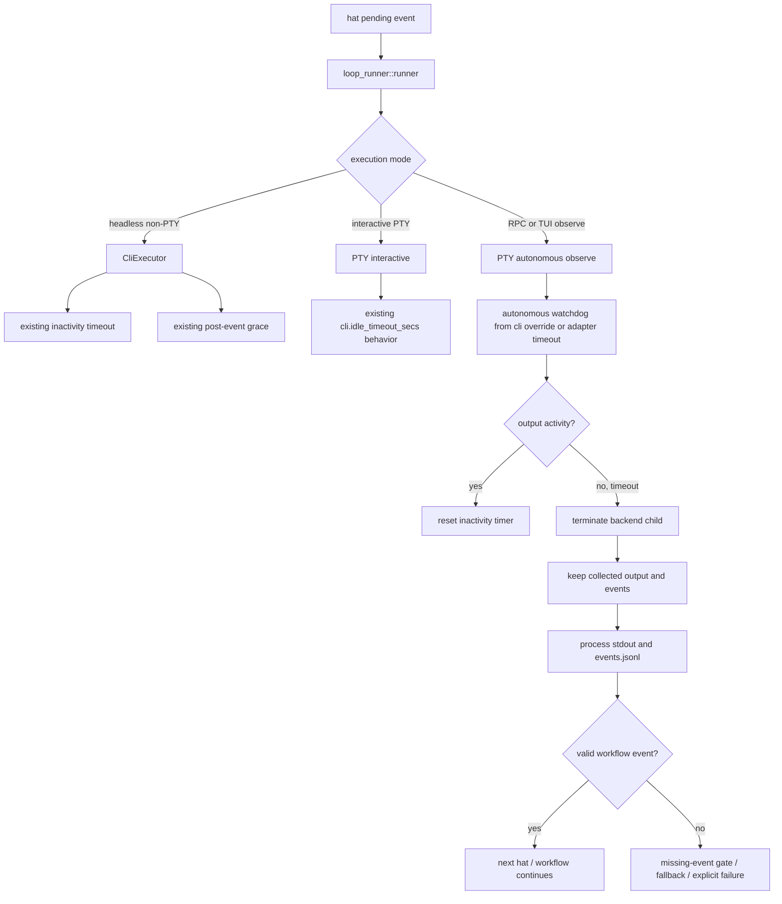

# fix: 修复 autonomous PTY/RPC 执行超时缺口

## Overview

这次要解决的不是 `ce-executor` preset 拓扑问题，而是 Ralph 执行层的一个卡死缺口：在 `ralph run -H builtin:ce-executor --worktree --rpc` 这类 autonomous / RPC / TUI 观察路径里，Ralph 会通过 PTY 启动后端 agent。后端 agent 可能已经通过 `ralph emit` 写出了有效事件，例如 `fix.applied`，但进程本身没有退出。旧二进制会继续等待这个后端进程自然结束，导致 Ralph 主循环拿不回控制权，TUI 看起来就像“很久没动”。

修复目标是补齐 autonomous PTY/RPC 路径的 watchdog：后端长时间无输出或发出事件后仍不退出时，Ralph 应终止当前后端子进程、保留已经产生的输出和事件，然后继续走现有事件解析、policy、hard gate、fallback 和下一轮 hat 选择流程。watchdog 结束的是“本次 backend 调用”，不是无条件停止整个 loop。

当前需要特别标注一个运行前提：如果源码已经包含修复，但用户机器上的 `ralph` 二进制还没有重新编译或安装，那么正在运行的旧 loop 仍会表现出旧 bug。这不代表修复方案无效，只代表运行中的进程仍在使用旧执行逻辑。修复完成后的验证必须使用新编译的二进制重新启动 loop 才有意义。

## Problem Frame

### 用户看到的现象

- 某个 worktree 下的 TUI 很久没有新增输出。
- `.ralph/events*.jsonl` 或 worktree 中间产物里能看到业务事件已经写出，例如 Fixer 已经 emit `fix.applied`。
- `ps` 能看到 Ralph 主进程还活着，同时它下面挂着一个 `claude --print` 子进程。
- 后续 workflow 没有继续，例如 `fix.applied` 没有触发下一轮 `review-coordinator`。

### 实际发生了什么

这条链路可以按下面理解：

1. Ralph 选中某个 hat，例如 Fixer。
2. Ralph 通过 PTY/RPC 路径启动 Claude，让它处理 pending event。
3. Claude 完成了业务动作，并执行 `ralph emit` 写出 `fix.applied`。
4. Claude 进程没有退出，或者进入长时间无输出状态。
5. 旧 Ralph 二进制在 PTY/RPC 路径没有可用的 autonomous watchdog，于是一直等待 Claude 退出。
6. Ralph 主循环没有机会读取刚写出的 `fix.applied` 并进入下一轮。

通俗说：Claude 已经把“我做完了”贴到事件文件里，但 Ralph 还站在门口等 Claude 本人离开房间。Claude 不走，Ralph 就不去看门上那张纸。

### 为什么不是 preset 编排问题

`presets/en/ce-executor.yml` 的链路要求 Fixer 在 safe_auto 修复后发布 `fix.applied`，这个事件已经写出。问题发生在事件写出之后、下一轮处理之前，也就是执行层等待后端进程退出的阶段。因此修复不应优先改 `ce-executor` 的 hat 拓扑、topic 订阅或 plan-gate 逻辑。

### 为什么“源码已修但仍复现”是合理现象

Ralph loop 启动时使用的是当时磁盘上的二进制。后续即使仓库源码已经改好，只要没有重新编译并让运行命令指向新二进制，旧 loop 仍会执行旧逻辑。这个问题尤其容易误判，因为事件文件会显示“业务动作已经完成”，但主进程仍卡在旧 PTY 等待路径。

## Requirements Trace

- R1. autonomous / RPC / worktree / TUI 观察路径不能在后端长时间无输出时无限等待。
- R2. 后端已经写出有效事件后，即使进程尾部挂住，Ralph 也必须保留并处理这些 partial events。
- R3. watchdog 触发后应结束当前 backend 子进程，而不是默认终止整个 Ralph loop。
- R4. interactive 模式现有行为保持不变，不能把手动交互体验改坏。
- R5. autonomous watchdog 不能复用 `cli.idle_timeout_secs` 的 30 秒 interactive 默认值作为后台默认值，避免误杀正常长任务。
- R6. 默认 autonomous timeout 应优先对齐 adapter execution timeout，当前默认语义是 300 秒级别的后端无输出监控。
- R7. 必须保留明确禁用语义：如果新增或使用 `cli.autonomous_idle_timeout_secs: 0`，实现、文档和测试都要一致。
- R8. 非 PTY 的 headless CLI 路径继续使用 `CliExecutor` 现有 inactivity timeout 和 post-event grace 行为，不能被改坏。
- R9. 回归测试必须覆盖真实 `runner.rs -> execution.rs -> PtyExecutor` 路径，不能只测孤立 helper。
- R10. 修复完成后必须用新编译的 `ralph` 二进制重新验证 `--worktree --rpc` 场景；旧二进制复现不算修复失败。

## Scope Boundaries

- 不修改 `ce-executor` 的 plan / review / fix / ship / report 拓扑。
- 不把这次修复做成新的用户流程功能。
- 不重构所有 backend 的 timeout 策略；本次聚焦 autonomous PTY/RPC/TUI 观察路径。
- 不把 interactive 30 秒 idle timeout 直接套给后台 agent。
- 不把 backend idle timeout 简单映射成 operator stop 或全局 loop stop。
- 不要求修复已经卡住的旧进程自动恢复；旧进程使用旧二进制，恢复需要人工停止并用新二进制重启。

### Deferred to Separate Tasks

- 若后续发现 ACP 或其他非 PTY backend 也需要统一 watchdog，再单独抽象跨 backend 的 execution watchdog。
- 若需要新增 CLI help、用户指南或配置迁移说明，可在实现稳定后追加文档计划。
- 若需要提供 `ralph diagnose hanging-loop` 之类的诊断命令，另开计划，不混入本次修复。

## Context & Research

### Relevant Code and Patterns

- `crates/ralph-cli/src/loop_runner/runner.rs`：决定 `enable_tui || enable_rpc || user_interactive` 时进入 PTY 路径；也负责把执行结果交给事件解析和后续 loop 状态机。
- `crates/ralph-cli/src/loop_runner/execution.rs`：封装 `execute_pty`、`execute_acp` 和 `CliExecutor` 输出结果；这是区分 watchdog timeout 与正常成功/失败的核心边界。
- `crates/ralph-adapters/src/pty_executor.rs`：PTY observe / streaming / interactive 的读取、activity tracking、timeout 和子进程终止逻辑集中在这里。
- `crates/ralph-adapters/src/cli_executor.rs`：非 PTY CLI 路径已有成熟 inactivity timeout、post-event grace timeout、SIGTERM/SIGKILL 处理，可作为 PTY 行为对齐参考。
- `crates/ralph-core/src/config/cli.rs`：`idle_timeout_secs` 是 interactive mode 语义；若新增 `autonomous_idle_timeout_secs`，这里要承载默认值和文档边界。
- `crates/ralph-core/src/config/ralph_config.rs`：适合提供 `autonomous_idle_timeout_secs(backend)` 解析 helper，用于表达 “CLI override > adapter timeout > 默认” 的优先级。
- `crates/ralph-core/src/config/v1_adapters.rs`：adapter `timeout` 默认 300 秒，语义更接近 autonomous backend execution watchdog。
- `crates/ralph-cli/src/loop_runner/wave/worker.rs`：wave worker 已有 timeout 后保留 partial events 的行为，可作为 main PTY 路径的行为参考。
- `presets/en/ce-executor.yml`：当前证据显示 preset 事件链路本身能发出 `fix.applied`，不应作为主要修改点。

### Institutional Learnings

- `docs/solutions/developer-experience/ce-executor-plan-gate-premature-completion-2026-06-02.md`：计划层和执行层职责要分开，执行层卡死不能靠 plan-gate 猜测兜底。
- `docs/solutions/developer-experience/agent-execution-contract-gates-2026-06-03.md`：成功和失败必须显式、可验证，不能靠“没报错”推断成功。

### External References

未做外部研究。问题来自 Ralph 自身执行路径，仓库内日志、事件文件和源码已经足够定位。

## Key Technical Decisions

- **修执行层，不先改 preset**：证据显示 Fixer 已经发布 `fix.applied`，卡点在 Ralph 等 backend 进程退出；因此主要改 `runner.rs` / `execution.rs` / `pty_executor.rs`。
- **watchdog 结束 backend call，不结束 loop**：timeout 后要回到事件解析流程，让已有事件继续驱动 workflow。只有没有有效事件时，才由 missing-event / hard-gate / fallback 走明确失败或恢复。
- **interactive timeout 与 autonomous timeout 分离**：`cli.idle_timeout_secs` 继续表示手动交互 idle timeout；autonomous 后台路径使用 adapter timeout 或明确的 `cli.autonomous_idle_timeout_secs`。
- **post-event tail hang 是软收尾场景**：如果 backend 已写出事件但尾部不退出，应该短 grace 后终止子进程并继续处理事件，而不是把这次视为业务失败。
- **禁用语义必须显式**：`autonomous_idle_timeout_secs: 0` 如果被支持，就必须明确表示禁用 autonomous watchdog；不能文档说禁用、代码仍 fallback 到 300 秒。
- **验证必须区分源码和二进制**：计划完成不等于正在运行的旧 loop 会自动变好；验收必须确认 `ralph` 命令指向新构建产物。

## Open Questions

### Resolved During Planning

- 根因属于执行层 PTY/RPC watchdog 缺口，不是 `presets/en/ce-executor.yml` 编排错误。
- 修复必须保留 partial events，不能因为 timeout 丢掉已写事件。
- 后台默认 timeout 不应使用 interactive 默认 30 秒。
- 旧二进制继续复现不等于修复无效，必须重新编译并重启 loop。

### Deferred to Implementation

- 是否需要把 post-event grace timeout 从 `CliExecutor` 抽成共享配置或常量：实现时根据代码复杂度决定。
- PTY 路径是否需要完全等价于 `CliExecutor` 的 `post_event_timed_out` 结果字段：实现时可以选择共享 outcome 结构，也可以在 runner 层映射。
- 若已有源码实现了 `autonomous_idle_timeout_secs`，实施者需先审查当前实现是否已经满足本计划，而不是重复新增字段。
- 真实 `--worktree --rpc` 验证如何做得足够快且不依赖 live Claude 长时间等待：实现时可用 mock backend 或短 timeout 配置。

## High-Level Technical Design

> *This illustrates the intended approach and is directional guidance for review, not implementation specification. The implementing agent should treat it as context, not code to reproduce.*

核心形状是三条路径分离：

- headless non-PTY 继续使用 `CliExecutor` 的既有 timeout。
- interactive PTY 继续保留用户手动交互语义。
- autonomous PTY/RPC/TUI observe 新增后台 watchdog，并在 timeout 后交回事件处理。

## Implementation Units

- [x] **Unit 1: 重建并记录当前故障链路**

**Goal:** 用可复核的材料把“旧二进制卡住”的现象、触发路径和非 preset 根因写清楚，避免后续误诊。

**Requirements:** R1, R2, R9, R10

**Dependencies:** None

**Files:**
- Modify: `docs/plans/2026-06-06-001-fix-autonomous-pty-timeout-plan.md`
- Test: `crates/ralph-cli/src/loop_runner/tests.rs`
- Test: `crates/ralph-adapters/src/pty_executor.rs`

**Approach:**
- 记录可观察证据类型：loop 进程仍活着、backend 子进程未退出、事件文件已有 `fix.applied`、后续 workflow 未推进。
- 将“源码已改但二进制未更新”作为运行前提写进计划，明确这类复现不能作为新实现失败证据。
- 增加 characterization 测试时优先模拟“backend 先产生事件再挂住”的场景，而不是只模拟完全无输出。

**Execution note:** 先做 characterization，再改行为或确认已有实现。

**Patterns to follow:**
- `crates/ralph-cli/src/loop_runner/tests.rs` 中已有 loop runner 集成测试组织方式。
- `crates/ralph-adapters/src/cli_executor.rs` 中 timeout 和 post-event grace 的测试风格。

**Test scenarios:**
- Integration: RPC/TUI observe 路径启动 PTY backend，backend 输出一个可解析事件后继续 sleep，runner 不应无限等待。
- Integration: 同样场景下事件必须被保留并进入后续事件处理，而不是因为 timeout 被丢弃。
- Edge case: 旧的 `interactive=false -> timeout None` 行为要有测试能证明修复前会暴露问题。
- Regression: `presets/en/ce-executor.yml` 的事件链路不用修改也能解释 `fix.applied` 已写出。
- Documentation: 计划文件明确区分“源码修复状态”和“当前运行二进制状态”。

**Verification:**
- 实施者能只凭计划和测试说明复述：卡点在 backend 进程退出等待，不在 `ce-executor` topic 编排。

- [x] **Unit 2: 给 autonomous PTY/RPC/TUI observe 路径接入后台 watchdog**

**Goal:** 让 PTY observe 路径在非交互运行时也有无输出超时，不再因为 `interactive=false` 自动禁用 timeout。

**Requirements:** R1, R4, R5, R6, R7

**Dependencies:** Unit 1

**Files:**
- Modify: `crates/ralph-cli/src/loop_runner/runner.rs`
- Modify: `crates/ralph-cli/src/loop_runner/execution.rs`
- Modify: `crates/ralph-adapters/src/pty_executor.rs`
- Modify: `crates/ralph-core/src/config/cli.rs`
- Modify: `crates/ralph-core/src/config/ralph_config.rs`
- Test: `crates/ralph-adapters/src/pty_executor.rs`
- Test: `crates/ralph-core/src/config/cli.rs`
- Test: `crates/ralph-core/src/config/ralph_config.rs`

**Approach:**
- 将 PTY timeout 是否启用从 `interactive` 布尔值中解耦：`idle_timeout_secs > 0` 表示启用，`0` 表示禁用。
- runner / execution 层根据模式选择 timeout：
  - interactive：使用 `cli.idle_timeout_secs`。
  - autonomous / RPC / TUI observe：使用 `cli.autonomous_idle_timeout_secs`，没有显式配置时 fallback 到 `adapters.<backend>.timeout`。
- 若当前源码已经有 `autonomous_idle_timeout_secs(backend)` helper，实施者应先审查它是否满足优先级和禁用语义，再补缺口。
- timeout 触发后复用现有子进程终止逻辑，确保 process group / PTY reader / output channel 能正确收尾。

**Patterns to follow:**
- `crates/ralph-adapters/src/cli_executor.rs` 的 inactivity timeout 与 terminate child 语义。
- `crates/ralph-core/src/config/ralph_config.rs` 的 adapter settings 解析模式。
- `crates/ralph-core/src/config/cli.rs` 的 serde default 和配置注释风格。

**Test scenarios:**
- Happy path: autonomous PTY backend 周期性输出，watchdog 每次 activity 后重置，不误杀。
- Happy path: `adapters.claude.timeout: 600` 时 autonomous watchdog 使用 600 秒语义，而不是 interactive 30 秒。
- Edge case: `cli.autonomous_idle_timeout_secs: 120` 优先于 adapter timeout。
- Edge case: `cli.autonomous_idle_timeout_secs: 0` 明确禁用 autonomous watchdog，不 fallback 到 adapter timeout。
- Edge case: interactive PTY 仍使用 `cli.idle_timeout_secs`，不受 autonomous 配置影响。
- Error path: backend 超过 autonomous timeout 后被终止，执行结果能标识 watchdog timeout。
- Regression: `use_pty=false` 的 `CliExecutor` 路径行为不变。

**Verification:**
- autonomous / RPC / TUI observe 路径不会再因为 `interactive=false` 得到 `timeout_duration=None`，除非用户显式禁用。

- [x] **Unit 3: 让 post-event tail hang 成为可恢复的软收尾**

**Goal:** 当 backend 已经发出有效事件但进程尾部不退出时，Ralph 能短 grace 后终止子进程，并继续处理已产生事件。

**Requirements:** R2, R3, R8, R9

**Dependencies:** Unit 2

**Files:**
- Modify: `crates/ralph-adapters/src/pty_executor.rs`
- Modify: `crates/ralph-cli/src/loop_runner/execution.rs`
- Modify: `crates/ralph-cli/src/loop_runner/runner.rs`
- Test: `crates/ralph-adapters/src/pty_executor.rs`
- Test: `crates/ralph-cli/src/loop_runner/tests.rs`

**Approach:**
- 对齐 `CliExecutor` 的关键语义：一旦输出中出现事件发射信号，后端进程不应继续无限占用本轮执行。
- PTY stream-json / text / pi-stream-json 等输出路径都要能识别已产生事件或至少保留可解析输出，让 runner 后续处理。
- 区分两类 timeout：
  - 没有事件的 inactivity timeout：这是 backend call 失败或无响应，应进入 missing-event / fallback / hard gate。
  - 已有事件后的 post-event tail timeout：这是 backend 已完成交接但进程未退出，应视为软收尾，继续处理事件。
- 如果 PTY 层不方便直接识别 `Event emitted:`，可以在 runner 层通过收集到的 output / events file delta 判定是否已有可处理事件，但测试必须锁住结果。

**Patterns to follow:**
- `crates/ralph-adapters/src/cli_executor.rs` 的 `post_event_timed_out` 语义。
- `crates/ralph-cli/src/loop_runner/wave/worker.rs` 的 partial timeout 事件保留行为。

**Test scenarios:**
- Happy path: backend 输出 `Event emitted: fix.applied` 后 sleep，PTY watchdog 终止 backend，但 runner 仍处理 `fix.applied`。
- Happy path: backend 直接写 events file 但 stdout 只显示简短确认，事件仍进入下一轮。
- Edge case: backend 输出普通文本后 hang，且没有有效事件，不能假成功，应进入 missing-event 或明确失败路径。
- Edge case: post-event grace 不应被后续噪声输出无限重置；事件发出后 tail hang 要能收尾。
- Regression: `CliExecutor` 的 `post_event_timed_out` 仍被视为成功软收尾，不误报 watchdog hard failure。
- Integration: `fix.applied -> review-coordinator` 的下一轮触发不被 timeout 截断。

**Verification:**
- “事件已写出但 backend 不退出”的场景不再卡住，且 workflow 会继续处理事件。

- [x] **Unit 4: 调整 timeout outcome 和 loop 终止语义**

**Goal:** 防止 backend idle timeout 被错误解释成 operator stop 或整个 loop 终止。

**Requirements:** R3, R8, R9

**Dependencies:** Unit 2, Unit 3

**Files:**
- Modify: `crates/ralph-cli/src/loop_runner/execution.rs`
- Modify: `crates/ralph-cli/src/loop_runner/runner.rs`
- Modify: `crates/ralph-cli/src/loop_runner/hooks/format.rs`
- Test: `crates/ralph-cli/src/loop_runner/tests.rs`
- Test: `crates/ralph-core/src/event_loop/tests/replay_light_integration.rs`

**Approach:**
- 审查 `convert_termination_type(IdleTimeout, false)` 是否仍映射到 `TerminationReason::Stopped`；如果会绕过事件解析或直接终止 loop，应引入更精确的 backend watchdog outcome。
- `ExecutionOutcome` 应能表达“backend 被 watchdog 结束”与“用户停止 loop”的区别。
- runner 收到 watchdog outcome 后先处理 output/events，再由现有 policy / hard gate / fallback 判断下一步。
- 日志和诊断输出要能显示 watchdog 原因，方便用户以后分辨“agent 没发事件”和“agent 发了事件但尾部挂住”。

**Patterns to follow:**
- `crates/ralph-core/src/event_loop/mod.rs` 的 termination reason 与 hard gate 处理边界。
- `crates/ralph-cli/src/loop_runner/tests.rs` 里已有 termination / fallback 测试。

**Test scenarios:**
- Happy path: watchdog timeout 且已有有效事件时，loop 不直接返回 `Stopped`，而是进入事件驱动的下一步。
- Error path: watchdog timeout 且没有有效事件时，loop 给出可诊断失败或 fallback，而不是静默等待。
- Regression: 用户主动 interrupt / stop 仍保持原来的 stop 语义。
- Regression: 非 timeout 后端失败仍按原有 success / failure 语义传播。
- Integration: verdict gate 和 required events 不会因为 backend watchdog 被绕过。

**Verification:**
- backend watchdog 被建模为一次 backend 调用结束条件，而不是 operator stop。

- [x] **Unit 5: 覆盖真实 ce-executor worktree/RPC 验证路径**

**Goal:** 证明用户最初遇到的 `ce-executor + worktree + --rpc` 场景在新二进制下不再无限卡住。

**Requirements:** R1, R2, R5, R9, R10

**Dependencies:** Unit 2, Unit 3, Unit 4

**Files:**
- Modify: `crates/ralph-cli/src/loop_runner/tests.rs`
- Modify: `crates/ralph-cli/src/loop_runner/wave/worker.rs`  # 仅在 parity 测试发现需要同步时修改
- Test: `crates/ralph-cli/src/loop_runner/tests.rs`
- Test: `crates/ralph-core/src/event_loop/tests/ce_executor.rs`

**Approach:**
- 用 mock backend 或测试 backend 构造接近真实的 `ce-executor` 事件链：`review.failed -> Fixer -> fix.applied -> review-coordinator`。
- 验证 `--rpc` 或等价 RPC observe 执行路径会进入 PTY autonomous watchdog。
- 验证 backend 已写 `fix.applied` 后即使不退出，runner 仍能释放本轮并继续处理下一 hat。
- 明确测试使用的是当前构建产物逻辑；计划验收时需要重新编译 `ralph` 并重启 loop。

**Patterns to follow:**
- `crates/ralph-core/src/event_loop/tests/ce_executor.rs` 的 ce-executor 事件链测试。
- `crates/ralph-cli/src/loop_runner/tests.rs` 的 mock backend 和 wave timeout 测试。

**Test scenarios:**
- Integration: `fix.applied` 已写出、backend hang，新 runner 在 watchdog 后进入 `review-coordinator`。
- Integration: no-event backend hang，新 runner 走 missing-event / fallback，不无限等待。
- Integration: event policy 拒绝事件时，rejection 仍可见，不因 timeout 丢失诊断。
- Regression: wave worker partial timeout 测试继续通过。
- Regression: headless CLI 路径继续由 `CliExecutor` 处理 timeout，不走 PTY watchdog。
- Operational: 使用新编译二进制重新跑最小 `--worktree --rpc` 复现场景，不再出现旧 loop 那种 3 小时等待。

**Verification:**
- 新二进制下，用户复现路径最多等待配置的 watchdog 窗口，不会无限卡住。

- [x] **Unit 6: 文档和操作说明同步**

**Goal:** 让用户和后续 agent 能正确理解 timeout 边界、二进制更新要求和旧 loop 处理方式。

**Requirements:** R4, R7, R10

**Dependencies:** Unit 2, Unit 3, Unit 5

**Files:**
- Modify: `docs/brainstorms/ce-executor-worktree-mode-requirements.md`
- Modify: `docs/guide/configuration.md`
- Modify: `docs/guide/cli-reference.md`
- Modify: `docs/plans/2026-06-06-001-fix-autonomous-pty-timeout-plan.md`

**Approach:**
- 若新增 `cli.autonomous_idle_timeout_secs`，在配置文档中说明它和 `cli.idle_timeout_secs` 的区别。
- 写清楚 `0` 的禁用语义和默认 fallback 到 adapter timeout 的规则。
- 写清楚旧 loop 不会因为源码更新自动获得修复，必须使用新二进制重启。
- 若 CLI help 或 guide 提到 `--idle-timeout`，检查是否会让用户误解为所有 PTY 路径都共用同一 timeout。

**Patterns to follow:**
- `docs/guide/configuration.md` 的配置字段说明风格。
- `docs/guide/cli-reference.md` 的 CLI 行为说明风格。
- 本计划的 Problem Frame 和 Requirements Trace。

**Test scenarios:**
- Documentation: 配置文档能解释 interactive timeout、autonomous watchdog、adapter timeout 三者关系。
- Documentation: 用户能理解为什么旧二进制仍会卡住。
- Regression: 若 docs 中引用 CLI help 或字段名，字段名与 clap/config 定义一致。

**Verification:**
- 文档读者能知道：修复代码后需要重新编译/安装并重启 loop；旧进程不会自动变好。

## Verification Matrix

| 场景 | 期望 |
|------|------|
| headless non-PTY backend 无输出超时 | 继续使用 `CliExecutor` timeout |
| headless non-PTY backend 发事件后挂住 | `CliExecutor` post-event grace 收尾，事件继续处理 |
| interactive PTY | 保持 `cli.idle_timeout_secs` 既有语义 |
| RPC / TUI observe PTY 无输出 | autonomous watchdog 终止 backend，进入 missing-event / fallback / failure |
| RPC / TUI observe PTY 发事件后挂住 | post-event 软收尾，事件继续处理 |
| `cli.autonomous_idle_timeout_secs` unset | fallback 到 `adapters.<backend>.timeout` |
| `cli.autonomous_idle_timeout_secs: 0` | 明确禁用 autonomous watchdog |
| adapter timeout override | autonomous watchdog 使用 override，不使用 30 秒 interactive 默认 |
| 新源码但旧二进制运行中 | 仍可能复现旧 bug，不计为修复失败 |
| 新二进制重启 loop | 不再无限等待 backend 自然退出 |

## System-Wide Impact

- **Interaction graph:** 受影响入口是 `ralph run -> loop_runner::runner -> loop_runner::execution -> PtyExecutor`。事件处理仍由现有 event loop、event policy、origin guard、hard gate 和 hat registry 驱动。
- **Error propagation:** watchdog timeout 必须有明确 outcome；不能吞掉、不能假成功、不能直接等同用户 stop。
- **Partial event preservation:** 已写入 stdout 或 events file 的 valid/rejected events 不能丢。timeout 只是 backend 子进程结束条件，不是事件丢弃条件。
- **State lifecycle risks:** 子进程 terminate、PTY reader thread、output channel 和 process group 都必须收尾，避免残留进程影响下一轮。
- **API surface parity:** 如果新增 `cli.autonomous_idle_timeout_secs`，配置解析、默认值、禁用语义、文档和测试必须一致。
- **Integration coverage:** 单测 `PtyExecutor` 不够，必须覆盖 runner 层真实分流和至少一个 ce-executor 风格事件链。
- **Unchanged invariants:** `presets/en/ce-executor.yml` 的 topic 编排、interactive 模式、headless `CliExecutor` timeout 和 wave worker partial-event 语义不应被破坏。

## Risk Analysis & Mitigation

| Risk | Likelihood | Impact | Mitigation |
|------|------------|--------|------------|
| timeout 设得太短，误杀正常后台任务 | Medium | High | 默认对齐 adapter timeout，不复用 interactive 30 秒；增加 override 和测试 |
| timeout 后丢掉已写事件 | Medium | High | Unit 3 专门覆盖 post-event tail hang 和 partial events |
| backend timeout 被当成用户 stop，loop 直接结束 | Medium | High | Unit 4 调整 outcome 语义，测试不直接返回 `Stopped` |
| 只修 PTY observe 的一个分支，TUI/RPC 另一分支仍挂 | Medium | Medium | Unit 2/5 覆盖 `enable_rpc`、`enable_tui`、ordinary autonomous PTY |
| 旧二进制继续复现导致误判 | High | Medium | 文档和验收明确要求重新编译、确认命令路径、重启 loop |
| 禁用语义混乱 | Medium | Medium | `0` 语义写入 config tests 和 docs |
| 修复影响 interactive 体验 | Low | High | 保留 interactive 分支独立测试 |

## Documentation / Operational Notes

- 修复代码合入后，必须重新编译并确认 `ralph` 命令指向新二进制；仅修改源码不会影响已经运行的 loop。
- 已卡住的旧 loop 不会自动恢复。操作员需要按现有 loop 管理方式停止旧 loop，并用新二进制重新启动。
- 若要验证用户原始场景，应使用短 autonomous timeout 配置或 mock backend，避免测试本身等待 300 秒。
- 如果新增 `cli.autonomous_idle_timeout_secs`，配置文档必须明确：
  - `cli.idle_timeout_secs` 只管 interactive。
  - `cli.autonomous_idle_timeout_secs` 管 autonomous PTY/RPC/TUI observe。
  - 未设置时 fallback 到 adapter timeout。
  - 设置为 `0` 时是否禁用，必须与实现一致。

## Success Metrics

- `--worktree --rpc` 下 backend 发出事件后挂住，不再导致 Ralph 无限等待。
- `fix.applied` 这类事件会被下一轮正常处理，能触发 `review-coordinator`。
- 没有事件的 backend hang 会变成可诊断失败或 fallback，而不是沉默卡住。
- interactive PTY 行为保持不变。
- headless CLI timeout 行为保持不变。
- 新二进制重启后，原问题不能再复现；旧二进制复现被明确归类为部署/运行状态问题。

## Execution Result

执行结论：当前源码已经包含本计划要求的修复，实施重点转为复核实现、跑针对性回归测试，并把计划状态标记为完成。

已确认的实现点：

- `crates/ralph-core/src/config/cli.rs` 已新增 `cli.autonomous_idle_timeout_secs`，并保留 `None` 默认和 `0` 禁用语义。
- `crates/ralph-core/src/config/ralph_config.rs` 已提供 `autonomous_idle_timeout_secs(backend)` resolver：显式 CLI override 优先，其次使用 adapter timeout，默认不回落到 interactive 30 秒。
- `crates/ralph-cli/src/loop_runner/runner.rs` 和 `crates/ralph-cli/src/loop_runner/execution.rs` 已在 autonomous / RPC / TUI observe PTY 路径传入后台 watchdog timeout。
- `crates/ralph-adapters/src/pty_executor.rs` 已把 PTY timeout 是否启用改为只看 `idle_timeout_secs > 0`，不再因为 `interactive=false` 自动禁用。
- `ExecutionOutcome.watchdog_timeout` 已区分 backend watchdog 与用户停止 loop；runner 仍会继续处理已收集 output / events。
- `CliExecutor` 的 post-event grace 语义仍保持独立：`post_event_timed_out` 是软收尾，不被误标为 hard watchdog failure。

已跑验证：

- `rtk cargo test -p ralph-core autonomous_idle_timeout_secs`
- `rtk cargo test -p ralph-adapters idle_timeout`
- `rtk cargo test -p ralph-cli execute_pty_autonomous_watchdog`
- `rtk cargo test -p ralph-cli watchdog_timeout`
- `rtk cargo test -p ralph-core watchdog_timeout`

这些针对性测试覆盖了配置解析、PTY idle watchdog、runner outcome、partial-event 路由和真实 `execute_pty` 路径。最终验收仍要求使用新编译的 `ralph` 二进制重启相关 loop；旧二进制或已经卡住的旧进程不会自动获得这次修复。

## Sources & References

- 相关计划：`docs/plans/2026-06-06-001-fix-autonomous-pty-timeout-plan.md`
- 相关计划：`docs/plans/2026-06-04-004-feat-ce-executor-wave-preset-plan.md`
- 相关需求：`docs/brainstorms/ce-executor-worktree-mode-requirements.md`
- 相关代码：`crates/ralph-cli/src/loop_runner/runner.rs`
- 相关代码：`crates/ralph-cli/src/loop_runner/execution.rs`
- 相关代码：`crates/ralph-adapters/src/pty_executor.rs`
- 相关代码：`crates/ralph-adapters/src/cli_executor.rs`
- 相关代码：`crates/ralph-core/src/config/cli.rs`
- 相关代码：`crates/ralph-core/src/config/ralph_config.rs`
- 相关经验：`docs/solutions/developer-experience/ce-executor-plan-gate-premature-completion-2026-06-02.md`
- 相关经验：`docs/solutions/developer-experience/agent-execution-contract-gates-2026-06-03.md`
