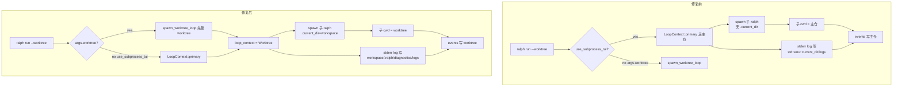
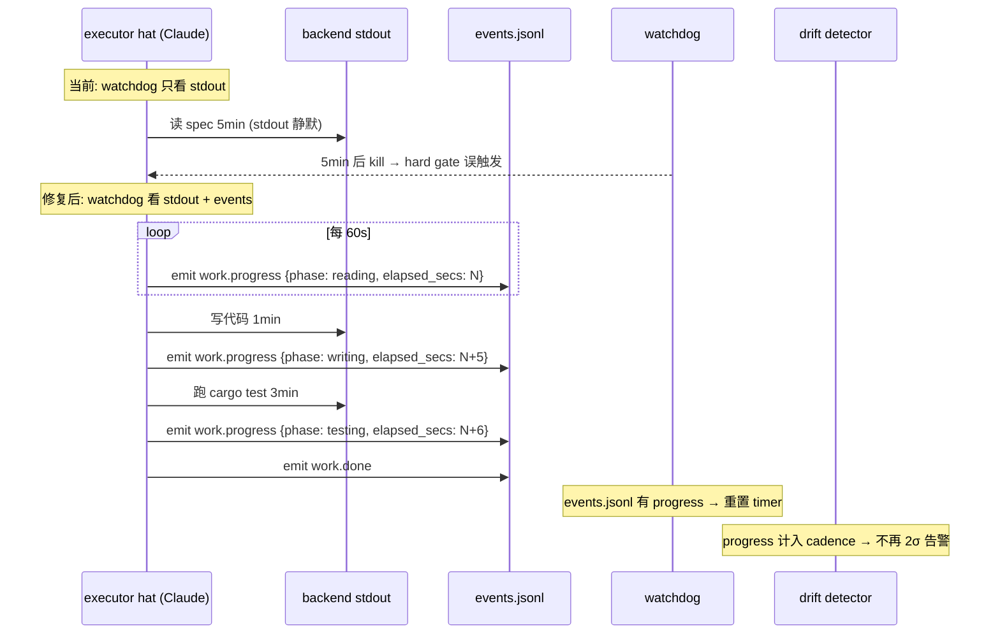

# fix: ce-executor worktree 模式两个残留问题

## Summary

修复 `ralph run -H builtin:ce-executor --worktree` 模式下两个互相独立的残留 P1 问题：

1. **worktree 隔离在 subprocess TUI 模式下不生效**——父进程先按"主仓"工作，worktree 半路才接管，导致 `.ralph/` 文件夹、日志、`loops.json` 漏到主仓。
2. **长 thinking 段被 watchdog 误判为 hang**——`ce-executor` 单次思考 5-15 分钟内 stdout 完全空白，watchdog 看 stdout 没动静就 kill Claude；600s 治标不治本。

## Problem Frame

### 故事背景

`ce-executor` 是个内置的"自动化程序员"preset，10 个 hat 接力（coordinator → executor → review-coordinator → ... → shipper → reporter），把一整份开发 plan 跑完。用 `--worktree` 模式跑是为了让所有代码改动隔离在 git worktree 里，不动主仓、不污染主分支。

这个模式 6/6 plan 已经修过一轮"watchdog 卡死"问题（plan `2026-06-06-001`），但实际跑下来发现**两个 P1 bug 还在阻塞生产可用性**。

### 问题 A：worktree 隔离在 subprocess TUI 模式下不生效（实测）

**用户视角看到的现象**：

- 跑 `ralph run -H builtin:ce-executor --worktree` 之后，`git status` 主仓显示干净 ✅
- 但发现**主仓的 `.ralph/diagnostics/logs/` 里冒出了日志** ❌
- 想"清理" worktree 时发现 `loops.json` 里 `worktree_path` 和 `workspace` 指向不同目录 ❌
- 进一步查发现 worktree 自己的 `events.jsonl` 有时不完整，事件流像被截断 ❌

**因果链（用大白话）**：

1. 你跑了 `ralph run --worktree`。Ralph 想要"在 TUI 里看到事件流"，所以它决定**开一个子进程 ralph 专门负责 RPC**，自己只当 TUI 显示器。
2. **子进程模式 + worktree 模式这两个开关在代码里抢先后顺序**：`crates/ralph-cli/src/commands/run.rs:712` 那个 `if/else if`，**子进程模式先匹配**，所以父进程直接走"我跑在主仓"分支，**完全跳过了 worktree 创建**。
3. 然后父进程才开子进程 ralph 去 RPC，**子进程 spawn 那行 `commands/run.rs:1167` 没告诉子进程"你的工作目录在 worktree 里"**——子进程用默认 cwd 也就是主仓。
4. 父进程自己也要写 stderr 日志，`commands/run.rs:1158` 那一行用 `std::env::current_dir()` 拼日志路径——父进程的 cwd 也是主仓。
5. 结果：父进程的 stderr log 落主仓 `.ralph/diagnostics/logs/`；子进程的 events reader 走主仓 cwd，事件流也落主仓；`loops.json` 注册的 `worktree_path` 字段也指向主仓。**主仓就这么被污染了**。

**为什么这是 P1 不是 P2**：

- 用户跑 `--worktree` 的核心承诺是"主仓不受影响"。这个承诺**没兑现**。
- `loops.json` 字段错乱让 `ralph loops` 命令族的 list/attach/diff/merge/discard 在并行场景下全乱套。
- 事件流落主仓意味着**worktree 里 `ralph loops` 看不到自己的事件**，诊断工具全部失灵。

### 问题 B：长 thinking 段被 watchdog 误判为 hang（统计上暴露）

**用户视角看到的现象**：

- `ralph.yml` 配了 `cli.autonomous_idle_timeout_secs: 600`（10 分钟），cheery-eagle 这次过了 ✅
- 但 6/8 14:03 那次 wise-palm 没配，跑 5 分钟（默认 300s）就 hard gate 报"hat has publish obligation but emitted no event hat=executor" ❌
- 把 watchdog 调到 600s 是**统计上的缓解**：thinking 段这次 8 分钟没超过 10 分钟。**下次 thinking 段 12 分钟就又炸**。

**因果链（用大白话）**：

1. `ce-executor` 的 executor hat 接到任务后，会进入几段**长沉默**：
   - **Opus 4 / Sonnet 4 读 plan + 思考怎么改**：2-15 分钟，stdout 完全空（模型没吐 token 之前没 tool_call）
   - **写完代码到 self-review 之间**：30s-2 分钟，模型在拼装 patch
   - **跑 `git diff` / `cargo fmt --check` / `cargo clippy` 中间**：可能 1-3 分钟完全静默
2. 现有的 watchdog 看的是**backend 进程的 stdout**：`crates/ralph-adapters/src/pty_executor.rs:402-405`，每收到一段新输出就重置计时器。
3. **stdout 静默 ≥ watchdog 上限就 kill Claude**。问题在于：上面那几段长沉默，**Claude 进程在 100% 工作**，只是**没打印到 stdout**。
4. Claude 被杀，executor hat 一个业务事件都没发出去，hard gate 当成"这个 hat 没干活"。

**为什么 600s 治标不治本**：

- 治的是"5 分钟太短"，不是"5 分钟的判断方法错"。
- 计划越大（plan 越长、文件越多、需要读 100+ 文件理解 spec），thinking 段越长。10 分钟对**典型 plan**够，对**复杂 plan**不够。
- 调 30 分钟也救不了：用户不可能无限调高 watchdog，因为真 hang 的情况下要等 30 分钟才发现。

**正确做法**：

让 hat 主动"喊一嗓子证明自己还活着"——发一个 `work.progress` 事件，里面带 `phase: thinking / writing / testing / reviewing` 和 `elapsed_secs`。watchdog 看到"最近 60s 有 progress 事件"就**不算 hang**；只有"stdout 静默 + 也没 progress 事件"才真判定 hang。

### 跟现有 plan / brainstorms 的关系

- **origin**：`docs/brainstorms/ce-executor-worktree-mode-requirements.md`（WM-01..WM-13）—— 这次新加的 WM-14、WM-15 不破坏 WM-01..WM-13 的任何已实现约束。
- **plan 6/6（已 achieved）**：`docs/achieved/plan/2026-06-06-001-fix-autonomous-pty-timeout-plan.md`——已经修过 watchdog 的"hang 之后怎么处理"，但**没修"什么是 hang"**。这次新计划在 plan 6/6 的基础上扩展**"hang 的判定信号"**，不重复 plan 6/6 的 outcome / partial event 保留逻辑。
- **plan 6/5（active）**：`docs/plans/2026-06-05-002-feat-preset-template-versioning-plan.md`——本次修复不修改模板/preset 注册表，只动 ce-executor preset 的执行细节。

---

## Requirements

### 隔离 / worktree

- **R1.** 跑 `ralph run -H builtin:ce-executor --worktree`（或任何 preset + `--worktree`），**主仓的 `.ralph/` 目录树下不应该出现任何新文件**。worktree 自己的 `.ralph/` 才是事件、日志、`loops.json` 的所在地。
- **R2.** 父进程在 subprocess TUI 模式下不再"先按主仓跑、worktree 半路才接管"。**worktree 创建必须在 spawn 子 ralph 之前发生**。
- **R3.** 子 ralph 进程启动时，cwd 必须是 worktree 目录。任何走 `std::env::current_dir()` 兜底的 env / 路径解析，**都应该在 worktree 下解析**。
- **R4.** 父进程的 stderr log 落盘路径，必须用 worktree 路径拼，不是主仓路径拼。
- **R5.** `loops.json` 注册的 `worktree_path` 字段值**必须等于** `workspace` 字段值（都是 worktree 绝对路径）；两者语义不再分裂。

### 长任务生命体征

- **R6.** ce-executor preset 的所有 hat 在长 thinking / writing / self-review / 跑外部命令阶段，**每 ≤ 60 秒 emit 一次 `work.progress` 事件**，payload 至少含 `phase`（枚举：thinking / reading / writing / testing / reviewing / waiting_tool）和 `elapsed_secs`。
- **R7.** watchdog 把"收到 `work.progress` 事件"等同于"backend 还活着"，**重置 inactivity 计时器**。只有"stdout 静默 + events.jsonl 也静默"才判定 hang 并 kill。
- **R8.** telemetry drift detector（U5，6/8 commit `56e27ae` 加的）把 `work.progress` 纳入 emit cadence 计算。
- **R9.** 不破坏现有 plan 6/6 的 watchdog 主路径：超时之后 partial events 仍保留、outcome 仍是 `watchdog_timeout=true` 而非 `Stopped`、autonomous 路径不退回 interactive 30s。
- **R10.** interactive 模式（`cli.idle_timeout_secs` 路径）**不引入** progress 协议——interactive 是用户手动交互，thinking 段是用户自己的思考，不需要 hat 主动"喊"。

### 可发现性

- **R11.** `ralph run --help` 和 `docs/guide/cli-reference.md` 提到 `--worktree` 时，必须能让人意识到"worktree 隔离是端到端承诺，不只是 git worktree 创建"。
- **R12.** `docs/guide/configuration.md` 把 `cli.autonomous_idle_timeout_secs` 列在显著位置（不是埋在 watchdog 章节里）。ce-executor 用户首次遇到 hard gate 时，能在 30 秒内找到这个旋钮。

---

## Key Technical Decisions

- **KTD-1**：问题 A 修在 `commands/run.rs:712`，**直接交换两个分支顺序**——`args.worktree` 必须在 `use_subprocess_tui` 之前判断。理由：worktree 模式是**显式用户承诺**，subprocess TUI 是**实现细节**，显式承诺必须压倒实现细节。
- **KTD-2**：问题 A 的 spawn 子进程 cwd 用 `loop_context.workspace()` 而非 `std::env::current_dir()`。理由：worktree 模式下 `workspace()` 才是逻辑工作目录，所有子进程路径解析（`RALPH_WORKSPACE_ROOT` fallback 等）必须挂这个。
- **KTD-3**：问题 A 的 stderr 日志路径用 `loop_context.workspace()` 而非 `std::env::current_dir()`。理由同 KTD-2。
- **KTD-4**：问题 B 的 `work.progress` 事件是**新事件类型**，复用现有 `event_policy.schemas` 注册机制（参考 `ce-executor.yml:80-130` 的 `work.ready` / `work.done` schema 写法）。
- **KTD-5**：问题 B 的 watchdog 改造**只发生在 PTY 路径**（`pty_executor.rs`）。`CliExecutor` 路径不动（plan 6/6 早就修过 headless 路径）。
- **KTD-6**：`work.progress` 是**side-channel** 事件（不推进 workflow progress，不触发 hat selection），参考 `event_loop/mod.rs:357` 注释 "Topic not in any chain — accept as side-channel (no progress tracking)"。这意味着 progress 事件**只用于 watchdog 喂信号 + drift detector 算 cadence**，不参与工作流推进。
- **KTD-7**：ce-executor preset 的 hat instructions 用**显式文字**（不是新字段）让 hat 知道要 emit progress：`## Progress Protocol` 段落，每个长阶段前说明 "emit work.progress before entering this phase"。这比给 preset 加结构化 progress 配置更轻量、不破坏现有 hat schema。
- **KTD-8**：drift detector 的 `emit_cadence_sigma` 阈值**不变**（保持 2σ），但 `compute_emit_cadence()` 把 progress 事件也计入。这避免引入新阈值调音负担。

---

## High-Level Technical Design

### 隔离修复前后的数据流对比



### Watchdog 判定信号修复前后对比



---

## Implementation Units

### U1. 修 worktree 隔离在 subprocess TUI 模式下的优先级 bug

**Goal**：让 `ralph run --worktree` 在所有代码路径下都把 worktree 创建 / cwd / 日志路径放在第一位，subprocess TUI 模式不再有豁免。

**Requirements**：R1, R2, R3, R4, R5

**Files**：
- Modify: `crates/ralph-cli/src/commands/run.rs`
- Test: `crates/ralph-cli/src/loop_runner/tests.rs`（已有 subprocess TUI + worktree 相关测试，扩 case）

**Approach**：

1. **交换 branch 顺序**（`run.rs:712`）：把 `else if args.worktree` 提到 `if use_subprocess_tui` 之前。worktree 是显式承诺，必须先处理。
2. **子进程 spawn 加 `.current_dir`**（`run.rs:1167`）：在 `Command::new(...)` 之后链 `.current_dir(loop_context.workspace())`。`loop_context.workspace()` 已经是逻辑工作目录（worktree 模式返回 worktree 路径，primary 模式返回主仓）。
3. **stderr log 路径修源**（`run.rs:1157-1158`）：把 `std::env::current_dir().unwrap_or_default()` 换成 `loop_context.workspace().clone()`。
4. **`loops.json` 字段语义**：审查 `spawn_worktree_loop` 注册到 `loops.json` 的 `worktree_path` 字段，确保填的是 worktree 绝对路径而非主仓路径。

**Test scenarios**：

- Happy path: `ralph run --worktree`（不传 `--no-tui` / `--rpc`）走 subprocess TUI 路径，验证：
  - 父进程的 `.ralph/diagnostics/logs/` 路径**在 worktree 下**
  - 子进程的 events 写到 worktree 的 `.ralph/events*.jsonl`
  - `loops.json` 里 `worktree_path == workspace`（两个字段都是 worktree 绝对路径）
- Happy path: `ralph run --rpc --worktree` 走 RPC 路径，验证同上
- Happy path: `ralph run --worktree --no-tui` 走非 TUI 路径，验证同上（这条原本就是对的，确认没回归）
- Edge case: `ralph run`（无 `--worktree`）走 primary 路径，验证 `.ralph/diagnostics/logs/` 仍落主仓（不能误改）
- Integration: 跑完整个 `--worktree` loop，主仓 `git status --porcelain` 返回空（包括 untracked 文件）。这是隔离承诺的端到端测试。

**Verification**：

- `cargo test -p ralph-cli -- worktree_isolation` 全绿
- 手工跑一次 `ralph run -H builtin:ce-executor --worktree`（mock backend，< 30s 即可触发一次 worktree 创建），看主仓 `.ralph/diagnostics/logs/` 没新文件

---

### U2. 引入 `work.progress` 事件 schema

**Goal**：在 `event_policy` 系统里注册 `work.progress` 事件，让所有 hat 都可以发，watchdog 和 drift detector 可以消费。

**Requirements**：R6, R7（schema 部分）

**Files**：
- Modify: `crates/ralph-core/src/event_policy.rs`（新增 `work.progress` schema 注册 helper）
- Modify: `presets/en/ce-executor.yml`（在 `event_policy.schemas` 下加 `work.progress`）
- Modify: `presets/zh/ce-executor-zh.yml`（同步）
- Modify: `presets/schemas/ce-executor.yml`（参考副本同步）
- Test: `crates/ralph-core/src/event_policy.rs` 的现有 schema 测试

**Approach**：

1. **payload 形状**：
   ```yaml
   work.progress:
     required_fields: [hat, phase, elapsed_secs]
     payload: json_object
     # hat: 当前 hat 名
     # phase: 枚举 thinking|reading|writing|testing|reviewing|waiting_tool|context_compaction
     # elapsed_secs: 从 hat 接到 trigger 开始累计
     # last_tool: 可选，上一次 tool_call 名
     # note: 可选，<140 字符
   ```
2. **side-channel 语义**：在 `event_loop/mod.rs` 的 chain 匹配里把 `work.progress` 标 side-channel（不推进 workflow_progress）。参考 `event_loop/mod.rs:357` 注释和 `workflow_progress.is_phase_valid` 逻辑。
3. **origin guard 接受**：确保 `event_origin.rs` 不把 `work.progress` 误判为"未注册 hat 发的"。所有 10 个 ce-executor hat 都加进允许的 hat 列表（如果还没在的话）。
4. **payload contract preset 同步**：`presets/en/ce-executor.yml` 的 `event_policy.schemas` 加 `work.progress` 条目，参考 `work.ready` 写法（line 80-82）。

**Test scenarios**：

- Happy path: emit `work.progress` with payload `{hat: executor, phase: writing, elapsed_secs: 120, last_tool: Edit, note: "patching cli/run.rs"}` → 通过 `event_policy` 校验
- Edge case: payload 缺 `elapsed_secs` → 被 policy reject（required field）
- Edge case: payload `phase` 是未知值如 `"sleeping"` → policy reject（白名单枚举）
- Edge case: hat 字段填成 `"unknown-hat"` → origin guard reject
- Integration: ce-executor preset 加载后，能从 hat 端通过 `ralph emit work.progress --hat executor --json '...'` 成功发出事件

**Verification**：

- `cargo test -p ralph-core -- work_progress` 全绿
- `ralph emit work.progress --hat executor --json '{"phase":"thinking","elapsed_secs":5}'` 在 cheery-eagle worktree 里手动跑一次，事件出现在 `.ralph/events.jsonl`

---

### U3. pty_executor watchdog 把 `work.progress` 算作 activity

**Goal**：watchdog 改读 events.jsonl delta，看到 progress 事件就重置 inactivity 计时器。

**Requirements**：R7, R9

**Files**：
- Modify: `crates/ralph-adapters/src/pty_executor.rs`（inactivity timer 喂信号逻辑）
- Modify: `crates/ralph-cli/src/loop_runner/runner.rs`（把 `events.jsonl` 路径传给 PtyExecutor）
- Test: `crates/ralph-adapters/src/pty_executor.rs` 的 inactivity 测试
- Test: `crates/ralph-cli/src/loop_runner/tests.rs` 的 watchdog 测试

**Approach**：

1. **PtyConfig 加 `events_path` 字段**（`pty_executor.rs:92-110`）：让 PtyExecutor 知道去哪个文件 tail。
2. **inactivity 喂信号扩展**（`pty_executor.rs:402-525`）：除了现有"收到 stdout byte 就重置 timer"，**新加 "events.jsonl mtime 在 N 秒内更新过也算 activity"**。两种信号任一为真都重置。
3. **保持 plan 6/6 行为不变**：
   - `idle_timeout_secs == 0` 仍表示禁用
   - 超时后 outcome 仍是 `watchdog_timeout=true`，partial events 仍保留
   - autonomous 路径不退回 interactive 30s
4. **interactive 路径不动**：`is_interactive` 仍走原 `cli.idle_timeout_secs` 行为，不读 events.jsonl。

**Test scenarios**：

- Happy path: backend stdout 静默但每 30s emit `work.progress` → watchdog 不触发
- Happy path: backend stdout 有输出 + emit progress → watchdog 不触发（双信号都活跃）
- Happy path: backend stdout 静默且没 progress → watchdog 触发（回归原行为）
- Edge case: `events.jsonl` 文件不存在（极端环境）→ watchdog fallback 到只看 stdout
- Edge case: `idle_timeout_secs == 0` → watchdog 禁用，不读 events.jsonl
- Integration: 真实 PTY 路径下，模拟"长 thinking 8 分钟 + 每 60s progress 事件"，watchdog 不杀 backend；模拟"长 thinking 8 分钟 + 0 progress 事件"，watchdog 在 `autonomous_idle_timeout_secs` 阈值时杀 backend

**Verification**：

- `cargo test -p ralph-adapters -- idle_timeout_progress` 全绿
- `cargo test -p ralph-cli -- execute_pty_progress` 全绿

---

### U4. ce-executor preset 内嵌 progress 协议

**Goal**：每个 ce-executor hat 的 instructions 加一段 `## Progress Protocol`，让 hat 知道在长阶段主动 emit `work.progress` 事件。

**Requirements**：R6

**Files**：
- Modify: `presets/en/ce-executor.yml`（10 个 hat instructions）
- Modify: `presets/zh/ce-executor-zh.yml`（同步）
- Test: `crates/ralph-cli/src/presets.rs` 的 preset 加载测试

**Approach**：

1. **共享段落**：在 preset 顶部加一段 "Progress Protocol" 说明，所有 hat 引用：
   ```markdown
   ### Progress Protocol (HAT CONTRACT)
   Every ce-executor hat MUST emit a `work.progress` event at least every 60 seconds
   during long-running phases. Payload shape:
   ```yaml
   payload:
     hat: "<current hat name>"
     phase: thinking|reading|writing|testing|reviewing|waiting_tool|context_compaction
     elapsed_secs: <int, seconds since hat activation>
     last_tool: "<last tool called, optional>"
     note: "<≤140 char context, optional>"
   ```
   ```
   The watchdog uses these events to distinguish "long silent work" from "hang".
   Failure to emit progress during >90s silence will look identical to a hang.
   ```
2. **per-hat 触发点**：每个 hat 的 instructions 在它**已知的长阶段**前加一句：
   - **executor**：
     - "Before reading plan/spec (likely 1-3 min): emit `work.progress` with `phase: reading`"
     - "Before writing a multi-file patch: emit `phase: writing` and re-emit before each Edit/Write tool call"
     - "Before running `cargo test` / `cargo clippy`: emit `phase: testing`"
     - "Before self-review (running `git diff` / `cargo fmt --check`): emit `phase: reviewing`"
   - **review-coordinator / dimension-reviewer**：在 `git diff` / 读 patch 阶段 emit `phase: reading`
   - **fixer / debug-resolver / plan-gate**：在分析和写代码阶段同上
   - **shipper**：在跑 final validation 6 步时，每步 emit
3. **不强制每 60s emit**：只在**进入新 phase 时** emit。如果 hat 在某个 phase 干 1 分钟（远小于 watchdog 上限），不需要疯狂 emit。这是 KTD-7 的具体落地。

**Test scenarios**：

- Snapshot: `cargo run -p ralph-cli -- run --help` 输出 + preset YAML 反序列化测试通过
- 验证：grep `work.progress` 关键字在 ce-executor.yml 出现 ≥ 10 次（每个 hat 至少 1 处提到）
- 验证：preset 加载测试 9 个 hat 都成功（不破坏现有 instructions）
- 验证：mock backend 跑一次完整 ce-executor 流程，event 流里能看到 ≥ 1 个 `work.progress` 事件

**Verification**：

- `cargo test -p ralph-cli -- ce_executor_preset` 全绿
- BDD scenario: `crates/ralph-core/tests/scenarios/ce-executor-progress-emit.yml`（新文件）

---

### U5. drift detector 把 `work.progress` 纳入 cadence

**Goal**：telemetry drift detector 的 emit cadence 计算把 progress 事件也算上，避免 6/8 commit `56e27ae` 的 `emit_cadence_sigma: 2.0` 阈值在长 silent 工作时误报。

**Requirements**：R8

**Files**：
- Modify: `crates/ralph-core/src/telemetry/drift_detector.rs`（cadence 计算）
- Test: `crates/ralph-core/src/telemetry/` 现有 drift 测试

**Approach**：

1. **cadence 公式扩展**：`compute_emit_cadence()` 当前只看"业务事件"（work.done / fix.applied 等）。改为把 `work.progress` 计入"节奏点"——这意味着 hat 静默超过 N 分钟时，drift detector 不会被误判为"hat 没在 emit 业务事件"。
2. **阈值不变**：保持 6/8 commit `56e27ae` 的 `field_completeness_threshold: 0.85` / `coord_join_rate_threshold: 0.6` / `emit_cadence_sigma: 2.0`。
3. **telemetry 配置同步**：`docs/guide/runtime-diagnosis.md` 描述 cadence 算法时，明确说明 progress 事件是节奏点之一。

**Test scenarios**：

- Happy path: 模拟"每 30s emit progress + 业务事件稀疏" 30 分钟，drift detector 不报 cadence drift
- Edge case: 业务事件密集 + 0 progress（10 分钟内 50 个 work.done），cadence 仍正常
- Edge case: 业务事件 + progress 都静默 5 分钟，cadence 跌破 2σ → 报 drift
- Integration: telemetry U5 模块整体测试通过

**Verification**：

- `cargo test -p ralph-core -- drift_detector` 全绿

---

### U6. 文档同步 + diagnostic 现场验证

**Goal**：让用户和后续 agent 能复述这两个 bug 的存在、修法、和验证方法。

**Requirements**：R11, R12

**Files**：
- Modify: `docs/brainstorms/ce-executor-worktree-mode-requirements.md`（加 WM-14 / WM-15 需求 ID，对应本计划 R1 / R6）
- Modify: `docs/guide/configuration.md`（`autonomous_idle_timeout_secs` 提到显著位置）
- Modify: `docs/guide/cli-reference.md`（`--worktree` 说明加端到端承诺描述）
- Modify: `docs/achieved/plan/2026-06-06-001-fix-autonomous-pty-timeout-plan.md`（加 cross-reference：本计划扩展了"什么是 hang"的判定信号）
- Modify: `presets/COLLECTION.md`（ce-executor 章节加 progress 协议说明）
- Add: `docs/report/2026-06-08-ce-executor-worktree-progress-protocol-report.md`（实施完成后写）

**Approach**：

1. **WM-14 / WM-15 注册到 brainstorm doc**：
   - WM-14: 显式 worktree 模式必须保证 `.ralph/`、events、logs、`loops.json` 全部落在 worktree 目录；主仓的 `.ralph/` 不应被任何 worktree-mode loop 写入。
   - WM-15: ce-executor preset 必须内嵌 progress 协议，长 thinking / writing / self-review 段必须 emit `work.progress` 事件；watchdog 视 progress 为 activity。
2. **`docs/guide/configuration.md`**：把 `autonomous_idle_timeout_secs` 移到 "Execution" 章节顶部，配 1-2 句话 "ce-executor 用户首次遇到 hard gate 时调这里" 的指引。
3. **`docs/guide/cli-reference.md`**：`--worktree` flag 说明加一句 "worktree 隔离是端到端承诺，包括 events/logs/loops.json 全部在 worktree 下，不只是 git worktree 创建"。
4. **diagnostic 现场验证**：
   - 写一个 BDD scenario `crates/ralph-core/tests/scenarios/ce-executor-worktree-isolation-and-progress.yml`，跑 mock backend 验证两件事：(a) worktree 模式下主仓 `.ralph/` 无新文件；(b) 长 thinking 段有 progress 事件，watchdog 不误杀。
   - 跑一次真实（用 mock backend）`ralph run -H builtin:ce-executor --worktree` 30s，确认主仓 `git status --porcelain` 干净。

**Test scenarios**：

- Documentation link integrity: `docs/guide/configuration.md` 提到的字段名跟 `crates/ralph-core/src/config/cli.rs::CliConfig` 字段名一致（反向验证）
- BDD: 新 scenario `ce-executor-worktree-isolation-and-progress` 全绿
- Smoke: 跑一次 30s 真实 worktree loop，主仓隔离

**Verification**：

- `grep autonomous_idle_timeout` 在 `docs/guide/configuration.md` 第一屏命中
- BDD 跑通
- 30s smoke 通过

---

## System-Wide Impact

- **CLI 表面**：`ralph run --worktree` 行为变更（隔离变严格），**backwards-incompatible 在错误方向**——以前错误行为是默认，现在变正确。不破坏现有调用方式。
- **事件系统**：新增 `work.progress` 事件。**side-channel** 不推进 workflow，origin guard / event policy 同步接受。
- **Watchdog 行为**：PTY 路径多了一条"events.jsonl mtime" 喂信号。**现有 plan 6/6 outcome 语义不变**（`watchdog_timeout=true` / partial events 保留 / 不当 Stopped）。
- **Telemetry U5**：drift detector cadence 计算公式扩展。阈值不变。
- **Preset 体积**：`ce-executor.yml` 加 ~20 行 progress 协议说明 + per-hat 触发点。**不增加结构化字段**（KTD-7），不破坏 preset schema。
- **Loops.json**：`worktree_path` 字段语义修正，**与 `workspace` 字段值统一为 worktree 绝对路径**。如果有外部工具依赖 `worktree_path` 是主仓路径，会破坏——但这本身就是 bug，没合理消费者。
- **Diagnostic 现场**：plan 6/6 的 `ralph diagnose` 命令不需要新 schema；progress 事件和 watchdog 触发都进现有的 `recovery.jsonl` 流。

---

## Risks & Dependencies

| Risk | Likelihood | Impact | Mitigation |
|------|------------|--------|------------|
| U1 改 branch 顺序破坏现有 `--rpc` 流程 | Medium | High | 跑现有 rpc 集成测试，扩 3 个新 case |
| `loops.json` 字段语义修正让外部 tool 失效 | Low | Medium | 没有合理消费者（错的就是错的），不需要兼容 |
| U3 watchdog 双信号耦合让"events.jsonl 假活"绕过 watchdog | Low | High | 双重保险：U5 drift detector 仍检测；progress 事件必须含合理 `phase` 枚举 |
| U4 hat 不按 progress 协议 emit，watchdog 还是误杀 | High | Medium | 这是 hat 合规问题；U5 drift detector 仍能告警"hat emit cadence 跌破阈值" |
| U5 引入 progress 后 cadence 太密反而漂移 | Low | Low | progress 只在 phase 切换时 emit，不是定时器 |
| 文档更新遗漏 scripts/ralph-zsh-plugin.zsh | Low | Low | 复查 completion 脚本不需改 `--worktree` 选项语义 |
| ce-executor preset 体积膨胀影响 preset 加载性能 | Low | Low | +20 行 yaml，可忽略 |

**Dependencies**：
- 6/8 commit `56e27ae` 的 telemetry drift 调音参数是 U5 的基础（KTD-8 复用 `emit_cadence_sigma: 2.0`）
- plan 6/6 已实现的 `ExecutionOutcome.watchdog_timeout` 是 U3 的复用面
- `presets/schemas/ce-executor.yml` 是参考副本，U2/U4 修改时同步更新

---

## Open Questions

### Resolved During Planning

- ✅ `work.progress` 是 side-channel，不推进 workflow（KTD-6）：`event_loop/mod.rs:357` 已有 side-channel 接受逻辑
- ✅ progress 协议通过 hat instructions 文字承载，不引入 preset schema 新字段（KTD-7）：保持 preset schema 稳定
- ✅ 隔离修复不引入 backwards-compat shim：旧版本的行为是 bug，不是 feature
- ✅ watchdog 双信号不破坏 plan 6/6 行为：U3 显式保留 `watchdog_timeout=true` outcome + partial events 保留

### Deferred to Implementation

- 具体哪些 hat 触发点要 emit progress（U4 per-hat 清单）由 implementer 按 hat 实际工作流细化
- events.jsonl tail 的 mtime 检查频率（U3 选 1s 还是 5s poll）由 implementer 决定；用 1s 简单起步，必要时再调
- BDD scenario `ce-executor-worktree-isolation-and-progress.yml` 的具体 mock backend 行为由 implementer 写实

---

## Success Metrics

- **隔离**：`ralph run -H builtin:ce-executor --worktree` 跑完整一轮（mock backend, < 5min）后，主仓 `git status --porcelain` 返回空，包括 `.ralph/diagnostics/logs/`、`loops.json`、`events-*.jsonl` 都不出现在主仓
- **Progress 协议**：mock backend 跑完整 ce-executor 流程，`events.jsonl` 里至少有 1 个 `work.progress` 事件
- **Watchdog 行为**：`autonomous_idle_timeout_secs: 30` + mock backend 长 silent 8min + 每 60s emit progress → watchdog 不触发；同样条件但 0 progress → watchdog 在 30s 触发
- **Drift detector**：U5 cadence 计算 0 误报
- **BDD**：新增的 `ce-executor-worktree-isolation-and-progress` scenario 全绿
- **回归**：`cargo test --workspace --exclude ralph-e2e` 全绿（不引入新失败）
- **文档反向验证**：`docs/guide/configuration.md` 提到的 `autonomous_idle_timeout_secs` 字段名跟 `CliConfig` 字段名一致

---

## Sources & Research

- **Origin doc**：`docs/brainstorms/ce-executor-worktree-mode-requirements.md`（WM-01..WM-13 + 7.1-7.5 timeout 语义）
- **相关 plan**：`docs/achieved/plan/2026-06-06-001-fix-autonomous-pty-timeout-plan.md`（watchdog 机制已实现，本次扩展判定信号）
- **相关 plan**：`docs/plans/2026-06-05-002-feat-preset-template-versioning-plan.md`（active；不破坏 preset 注册表）
- **代码位置**：
  - `crates/ralph-cli/src/commands/run.rs:712`（branch 顺序 P1 bug）
  - `crates/ralph-cli/src/commands/run.rs:1157-1158`（stderr log 路径 P1 bug）
  - `crates/ralph-cli/src/commands/run.rs:1167`（子进程 cwd P1 bug）
  - `crates/ralph-adapters/src/pty_executor.rs:92-110`（PtyConfig）
  - `crates/ralph-adapters/src/pty_executor.rs:402-525`（inactivity timer 喂信号逻辑）
  - `crates/ralph-core/src/diagnostics/log_rotation.rs:51-63`（`create_log_file(base_path)` 签名）
  - `crates/ralph-core/src/event_loop/mod.rs:357`（side-channel 注释）
  - `presets/en/ce-executor.yml:80-130`（`event_policy.schemas` 写法参考）
- **Telemetry 现状**：6/8 commit `56e27ae` 的 drift detector + `emit_cadence_sigma: 2.0`
- **现场证据**：
  - 6/8 14:03 wise-palm 跑挂：`/home/chaowen/Dev/agent_tools/ralph-orchestrator/.ralph/diagnostics/logs/ralph-2026-06-08T13-53-45-332-76728.log:13-15` 记 `Idle timeout triggered timeout_secs=300` → `Hard gate triggered: hat has publish obligation but emitted no event hat=executor`
  - 6/8 14:28-14:30 cheery-eagle 600s 实验：worktree 自己的 `.ralph/diagnostics/logs/ralph-2026-06-08T14-47-40-416-134956.log` 是 0 字节，但主仓 `.ralph/diagnostics/logs/ralph-2026-06-08T14-28-50-501-112012.log` 同步出现——印证 P1 bug 仍在
  - cheery-eagle 自己的 `.ralph/loops.json` 显示 `worktree_path` 指向主仓、`workspace` 指向 worktree——印证 R5 失败
