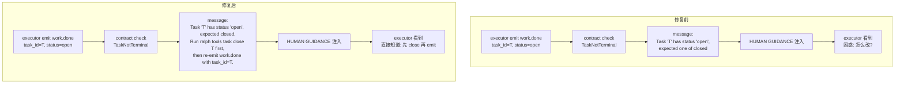
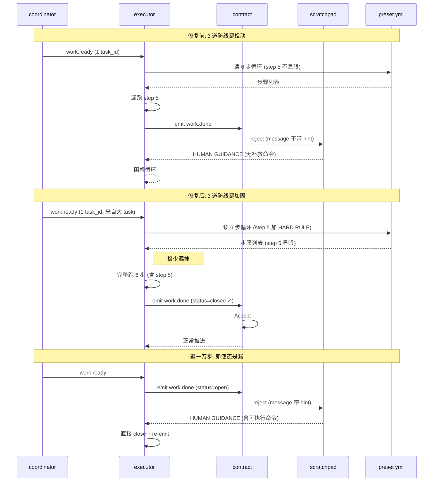

# fix: ce-executor preset 加固防漏 close 步

## Summary

针对 2026-06-08 cheery-eagle worktree（`worktree/2026-06-05-002-...-cheery-eagle`）的现场事故——`executor` 在 6 步循环里漏跑第 5 步 `ralph tools task close`、直接发 `work.done`、被 execution contract 拒收并写进 `HUMAN GUIDANCE`——加固三处协同防线，让"漏 close"在发生时更容易被 agent 看到、补救时**一查就知道怎么改**、**事前就少拆错粒度**。

**关键设计哲学（Tenet #2）**：backpressure over prescription。**反压消息本身就是 backpressure**——给它加 hint 比把 instructions 加粗更鲁棒（hint 是机器给的、不会丢；instruction 是给 agent 看的、prompt 长就漏抓）。

**范围只覆盖**本计划的 3 处改进，**不重复** plan `2026-06-08-001`（worktree 隔离 + watchdog 改进）。

---

## Problem Frame

### 现场事故链路

1. coordinator emit `work.ready`（payload 含 `task_id = task-1780900194-386a`），4 张 open 状态的 task 由 coordinator 创建。
2. executor 接到触发，**6 步循环跑了 1-4 步**（start / read / implement / test），**漏跑第 5 步 `task close`**。
3. executor 写代码（commit `14db274`），**所有 4 张 task 的代码都写完了**，但只 emit **1 次** `work.done`（payload 的 `task_id` 是第 1 张 task）。
4. execution contract 检查 task 状态：status = `open`，allowed_terminal_statuses = `["closed"]` → **reject**（`TaskNotTerminal`）。
5. 拒绝消息落到 `HUMAN GUIDANCE` 块：
   > "Task 'task-1780900194-386a' has status 'open', expected one of [\"closed\"]"
6. executor 看到后**不知道怎么补救**——消息只说"状态不对"，没指明"先 `task close` 再 emit"。
7. 用户的 4 张 task 全是 `open`，**3 张更没机会被 contract 校验**——executor 漏了第 5 步的问题被掩盖成"被拒 1 张 task"。

### 直接病因 vs 防漏机制

| 层级 | 责任 | 这次的现象 |
|---|---|---|
| **直接病因** | executor 漏跑 1 步 | 漏了第 5 步 `task close` |
| **防漏机制** | preset + contract 设计 | 当前防漏做得不够显眼、补漏时不够直接 |

直接病因不在本次 plan 范围（用户已用操作卡 `close + 重发 work.done` 善后）。本次只加固**防漏机制**的 3 处。

### 为什么是 P0 级别（防漏机制松动）

- 跨 hat 误读曾让用户怀疑授权问题（实际上 ce-executor preset 31-33 行的 `coordinator_hats: [executor, coordinator]` 正确放权了 executor）。**反压消息含糊** + **预设指令长 prompt 漏抓** + **coordinator 拆工单过细** 三者叠加，会让"漏 close"事故**难诊断、难补救、易复现**。
- Ralph Tenet #2 "backpressure over prescription" 在 contract 层是"接收 / 拒绝"二选一，**但拒绝消息本身也是一种 backpressure**——目前的拒绝消息只有诊断（"为什么拒"），没有**操作提示**（"怎么改"），backpressure 不完整。
- ce-executor preset 的 instructions 是**10 个 hat × 数百行**的 markdown，6 步循环里的 step 5 **没有视觉强约束**，跟 step 1/2/3/4/6 长得一样，prompt 一长就漏抓。

### 跟现有 plan / 文档的关系

- **现场事故来源**：`worktree/2026-06-05-002-...-cheery-eagle/.ralph/agent/scratchpad.md:38-44`（HUMAN GUIDANCE 块）+ 同目录 `events-20260608-062850.jsonl`（coordinator work.ready + executor work.done 被拒）+ `tasks.jsonl`（4 张 open task）。
- **本次不进 plan `2026-06-08-001`**：那个 plan 修 worktree 隔离（U1）+ watchdog progress 协议（U2-U5），跟"漏 close"是不同因果链。
- **不动 ce-executor preset 的 schema**：ce-executor.yml 的 `event_policy.schemas` 和 `execution_contracts.rules.work.done` 维持现状，不引入新结构。
- **不动 execution contract 的 `auto_close_on_valid`**：保持 `false`（避免改多 hat 并发语义）。

---

## Requirements

### 反压消息可操作性

- **R1.** `ExecutionContractViolationKind::TaskNotTerminal` 的 `message` 字段，必须包含**可执行的 `ralph tools task close <task_id>` 命令提示**（带 task_id 占位符），让 executor / reviewer / debug-resolver / 用户看到拒绝时**直接知道怎么改**。
- **R2.** hint 必须保留在**当前的 `message` 字符串**里，不引入新字段、不改 `required_fields_for_resume()` 行为（这条 API 已经被 U2 targeted-retry 流程使用）。
- **R3.** hint 文案必须自包含——只读 `ExecutionContractFinding.message` 一行能完整复述"先 close、再 emit work.done"，不依赖外部文档。

### preset 6 步循环强约束

- **R4.** `presets/en/ce-executor.yml` 的 `executor.hat.instructions` 中 "Task Execution Loop (Small/Large)" 段，**step 5 (`ralph tools task close <task_id>`) 必须加视觉强约束**：标题升 HARD RULE、加 ⚠️ 标记、加 "missing this step → contract will reject" 提示。
- **R5.** `presets/zh/ce-executor-zh.yml` 同步修改（中文版用相同强调形式）。
- **R6.** `presets/schemas/ce-executor.yml` 同步（参考副本，目前的 `Mirror in presets/schemas/ce-executor.yml is kept as a reference copy only` 注释要求保持同步）。
- **R7.** 不破坏现有 6 步循环的可读性——step 1-4、6 的格式不变。

### coordinator 拆工单粒度

- **R8.** `presets/en/ce-executor.yml` 的 `coordinator.hat.instructions` 中 "Runtime Task Creation" 段后，加 **"Task Split Heuristics"** 段落，明确：
  - "U0 这种粗活（1 个 Implementation Unit 涵盖 4 个文件级改动）应拆 1 张大工单（key 形如 `ce-executor:{plan_name}:step-01:u0-characterization-tests`），让 executor 1 次迭代完成 1 张大工单；不要把同 U0 内的 4 个子目标拆成 4 张独立小工单。"
  - "只在以下情况拆多张：U 编号显式列出 (U1 / U2 / U3)、U 包含明确 sub-step、需要 wave 并行、需要独立 worktree。"
- **R9.** `presets/COLLECTION.md` 在 ce-executor 章节加 1-2 段引用，指向 ce-executor.yml 的 "Task Split Heuristics" 段（不做内容重复，只做 discoverability 索引）。
- **R10.** 不引入结构性 gate（**用户已选文档化**）——不修改 `event_policy`、不写 `task_count` 校验、不动 `coordinator_hats`。

### 范围边界

- **R11.** 本 plan **不**修改 execution contract 的 `auto_close_on_valid`（保持 `false`）；不修改 `event_policy.schemas`；不修改 `ce-executor` preset 的 hat 拓扑和 triggers / publishes；不修改 coordinator_hats 列表。
- **R12.** 本 plan **不**做 worktree-mode dogfood——代码改完跑 `cargo test` 验证即可，用户后续在真循环里观察复现情况。

---

## Key Technical Decisions

- **KTD-1**：反压 hint 写在 `ExecutionContractFinding::message` 字段里（Rust 源 `crates/ralph-core/src/execution_contract.rs` 的 `TaskNotTerminal` 拒绝构造点），不引入新字段、不改 `ExecutionContractViolationKind` 变体。**理由**：`message` 已经被 `findings` 列表序列化喂给 `HUMAN GUIDANCE` 注入路径，写到这里等于零额外落地成本；不破坏 `required_fields_for_resume()` 的语义（hint 是 ad-hoc 提示，不是结构性字段）。
- **KTD-2**：hint 文案采用**单一可执行命令**格式（`Run \`ralph tools task close <task_id>\` first, then re-emit work.done with the same task_id.`），不写多步骤、不写条件分支。**理由**：执行器看到时已经在"被拒"状态，认知带宽最差；多步提示反而增加误操作面。
- **KTD-3**：preset 强约束沿用 ce-executor.yml 现有的 **"HARD RULE"** 命名约定（参考同文件 280-284 行 `Branch / Worktree Policy (HARD RULE)`、266-274 行 `Preflight Contract (HARD RULE)` 的写法），不引入新 schema、新 marker、新字段。**理由**：HARD RULE 是 preset 内部已有的 visual convention，遵守它 = 不破坏 preset schema 兼容性 = 不破坏 `ralph preset check --strict` 已有绿灯。
- **KTD-4**：U3 是**文档化而非结构性 gate**（用户拍板）。具体落地："Task Split Heuristics" 段落用**陈述句**写在 coordinator instructions 里，不写"必须"、不写 reject 逻辑、不挂 event policy 钩子。**理由**：coordinator 的拆工单粒度受 plan 内容、复杂度、U-ID 颗粒度多重影响，写死"拆 1 张"会误伤真正需要拆 4 张的合法场景（如 4 个独立可并行子项目）。
- **KTD-5**：U4 只跑 `cargo test --workspace --exclude ralph-e2e` + `cargo test --workspace --exclude ralph-e2e --doc`，**不跑** `cargo run` 真循环、不开 worktree、不接真实 backend。**理由**：用户已确认"改完就行我后面观察"——本 plan 的 verification 是代码 + 单元测试，**真循环复现验证由用户后续在生产里完成**。
- **KTD-6**：本 plan 不发新事件类型、不改 event_policy.schemas、不改 `event_policy.mode`。**理由**：反压 hint 完全在**已有事件类型的 rejection finding**里承载，零事件系统爆炸半径。
- **KTD-7**：本 plan 不修改 `crates/ralph-cli/src/presets.rs` 的 `extract_payload_field_refs` 等 regex 抽取工具。**理由**：本计划改动在**纯文本 hint 字符串**和**纯文档段落**层面，不引入新字段引用。

---

## High-Level Technical Design

### 修复前后的反压消息对比



### preset 强约束的视觉层次（修复后）

```
6 步循环 (修复前):
  1. ralph tools task start
  2. Read task files
  3. Implement
  4. Run tests
  5. ralph tools task close       ← 平庸，不显眼
  6. Evaluate commit

6 步循环 (修复后):
  1. ralph tools task start
  2. Read task files
  3. Implement
  4. Run tests
  ⚠️ HARD RULE: Step 5 is REQUIRED before Step 6
  5. ralph tools task close <task_id>
     → Missing this step → contract will reject work.done
  6. Evaluate commit
```

### 漏 close 事故的协同防护（修复后）



---

## Implementation Units

### U1. execution contract `TaskNotTerminal` 反压消息加补救 hint

**Goal**：让 `work.done` 被 contract 拒为 `TaskNotTerminal` 时，反压 message 包含**可执行的 `ralph tools task close <task_id>` 命令**，让 executor / reviewer / debug-resolver / 用户看到拒绝时**直接知道怎么改**。

**Requirements**：R1, R2, R3

**Files**：
- Modify: `crates/ralph-core/src/execution_contract.rs`（`TaskNotTerminal` 拒绝构造点的 `message` 格式）
- Test: `crates/ralph-core/src/execution_contract.rs` 现有 tests 模块（新增 2 个 test）

**Approach**：

1. **找拒绝构造点**：`crates/ralph-core/src/execution_contract.rs` 中 `ExecutionContractViolationKind::TaskNotTerminal { task_id, status, allowed }` 变体对应的 `message` 格式化处（约 511-534 行 `validate_task` 函数尾部）。在现有 message 字符串后**追加** hint 子串，新 message 形如：
   ```
   "Task 'T' has status 'open', expected one of [\"closed\"]. Run `ralph tools task close T` first, then re-emit work.done with task_id=T."
   ```
2. **hint 文案常量**：在 `execution_contract.rs` 顶部加一个 `const TASK_NOT_TERMINAL_HINT: &str = " Run \`ralph tools task close <task_id>\` first, then re-emit work.done with task_id=<task_id>.";`（占位符 + 反引号 + `<task_id>` 双标记），实现里 `format!` 替换成实际 task_id。
3. **不动 `required_fields_for_resume()`**（KTD-1）——hint 写在 `message` 字段里，不写进 `required_fields_for_resume()` 的 match 分支，不影响 U2 targeted-retry 流程。
4. **测试覆盖**：
   - `test_task_not_terminal_message_includes_close_hint`：构造 task 状态 `open`、allowed `["closed"]`、event `work.done` payload 含 `task_id="T"`，断言 finding message 字符串包含 `"ralph tools task close T"`。
   - `test_task_not_terminal_message_is_human_readable`：断言 message 是单行、不含 `\n`（保持注入到 `HUMAN GUIDANCE` 时的格式稳定）。

**Patterns to follow**：
- `crates/ralph-core/src/execution_contract.rs:113-132`（`ExecutionContractFinding` 结构）—— `message: String` 字段已存在
- 同文件 `validate_payload` / `validate_task` / `validate_git_change` / `validate_test_evidence` 的 message 风格（KTD-1 一致）

**Test scenarios**：

- Happy path: task 状态 `open`、contract 要求 `closed` → finding message 包含 `ralph tools task close T` 提示
- Happy path: task 状态 `pending`、contract 要求 `["closed", "failed"]` → message 同时包含提示和 `closed | failed` 列表
- Edge case: payload 缺 `task_id` 字段 → 跳过 task 验证，不进入 hint 路径（保持现有 `MissingPayloadField` 行为）
- Edge case: 消息是单行、无换行（保证 HUMAN GUIDANCE 注入格式稳定）

**Verification**：
- `cargo test -p ralph-core -- execution_contract::tests::test_task_not_terminal_message_includes_close_hint` 通过
- `cargo test -p ralph-core -- execution_contract` 全绿
- `cargo test --workspace --exclude ralph-e2e` 全绿

---

### U2. preset 6 步循环 step 5 强约束（en / zh / schemas 同步）

**Goal**：让 ce-executor preset 的 6 步 task execution loop 中 step 5（`ralph tools task close <task_id>`）成为**视觉 HARD RULE**，避免 executor 在长 prompt 里漏抓。

**Requirements**：R4, R5, R6, R7

**Files**：
- Modify: `presets/en/ce-executor.yml`（`executor.hat.instructions` 中的 "Task Execution Loop (Small/Large)" 段）
- Modify: `presets/zh/ce-executor-zh.yml`（同步中文版）
- Modify: `presets/schemas/ce-executor.yml`（参考副本同步）
- Test: `crates/ralph-cli/src/presets.rs` 的 preset 加载测试（确认 YAML 仍可解析）

**Approach**：

1. **找插入点**：`presets/en/ce-executor.yml` 中 "Task Execution Loop (Small/Large)" 段，约 294-303 行的 6 步伪代码块。**不替换现有 6 步**，在 step 5 前加 1 行 HARD RULE 标记行 + 在 step 5 后加 1 行"missing this step"提示。
2. **改后结构**（示意，YAML 里以 `|` literal block 写）：
   ```
   ### Task Execution Loop (Small/Large)
   ⚠️ HARD RULE: Step 5 (`ralph tools task close <task_id>`) is REQUIRED
   before emitting `work.done`. The execution contract will REJECT
   `work.done` if the referenced task is not in a terminal state.
   
   while (current step has uncompleted tasks):
     1. ralph tools task start <task_id>
     2. Read task files and patterns
     3. Implement (test-first / characterization-first per Execution note)
     4. Run and verify tests
     5. ralph tools task close <task_id>     ← missing → contract rejection
     6. Evaluate incremental commit
   ```
3. **en / zh 同步**：在 `presets/zh/ce-executor-zh.yml` 同样位置加中文版 HARD RULE 行。
4. **schemas 同步**：`presets/schemas/ce-executor.yml` 是 deprecated reference copy，**根据 1014 行注释要求**保持同步（修改与 en 版一致）。
5. **不动 step 1-4、6 的格式**（R7）——只新增 1 行 HARD RULE + 1 行 step 5 旁注。
6. **不引入新 schema**（KTD-3）——纯 markdown 文本改动。

**Patterns to follow**：
- `presets/en/ce-executor.yml:280-284`（`Branch / Worktree Policy (HARD RULE)`）—— HARD RULE 命名约定的样板
- `presets/en/ce-executor.yml:266-274`（`Preflight Contract (HARD RULE)`）—— "missing → reject" 描述样式的样板

**Test scenarios**：

- Snapshot: `cargo run -p ralph-cli -- run --help` 输出 + preset YAML 反序列化测试通过
- 内容验证: `grep -c "HARD RULE" presets/en/ce-executor.yml` ≥ 3（原本已有 2 处：Branch / Preflight；新增 1 处：Task Execution Loop）
- 内容验证: `grep -c "task close" presets/en/ce-executor.yml` 在原基础 +1（step 5 的 `task close` 词条在原 6 步循环里已有 1 次；本修改让它出现在 HARD RULE 上下文 1 次）
- 回归: 现有 `cargo test -p ralph-cli -- ce_executor_preset` 全绿
- 回归: `ralph preset check --strict --format json`（如果存在）保持 0 findings

**Verification**：
- `cargo test -p ralph-cli -- ce_executor_preset` 全绿
- `cargo test -p ralph-cli -- preset` 全绿
- 手工 `grep` 验证 4 个验证项通过
- `cargo test --workspace --exclude ralph-e2e` 全绿

---

### U3. coordinator "Task Split Heuristics" 文档化（en / zh / COLLECTION.md）

**Goal**：让 coordinator 在 "Runtime Task Creation" 阶段**自觉**遵守"U0 这种粗活拆 1 张大工单，不拆 4 张小工单"的指导，避免 executor 写完 4 张代码却只发 1 次 `work.done` 的粒度错配。

**Requirements**：R8, R9, R10

**Files**：
- Modify: `presets/en/ce-executor.yml`（`coordinator.hat.instructions` 中 "Runtime Task Creation" 段后追加 "Task Split Heuristics" 段）
- Modify: `presets/zh/ce-executor-zh.yml`（同步中文版）
- Modify: `presets/COLLECTION.md`（ce-executor 章节加 1 段引用）

**Approach**：

1. **找插入点**：`presets/en/ce-executor.yml` 中 `coordinator.hat.instructions` 的 "Runtime Task Creation" 段，约 194-201 行。在该段**后**追加新段 "Task Split Heuristics"（不修改原段，不打散 U 编号 / key 格式约定）。
2. **新段内容**（YAML `|` literal block）：
   ```
   ### Task Split Heuristics
   When converting Implementation Units to runtime tasks, prefer **one task per
   Implementation Unit** unless the unit explicitly requires splitting.
   
   **Default (one task per U):**
   - U-ID is the granularity. A single U covering 4 file-level changes is
     **one** task with a single `task_id` and a key like
     `ce-executor:{plan_name}:step-01:u0-characterization-tests`.
   - Rationale: the executor completes the whole U in one iteration and
     emits exactly one `work.done` with that single `task_id`. This matches
     the contract: `work.done` is checked against the task it references.
   
   **Split into multiple tasks only when:**
   - The plan explicitly enumerates sub-units (U1a / U1b / U1c) and labels
     them as separately testable deliverables.
   - The work is naturally wave-parallel (e.g., independent test files
     for different crates) AND the plan invokes `concurrency > 1`.
   - The unit spans independent worktrees (rare in ce-executor; default
     is single-workspace).
   
   **Anti-pattern (do not do):**
   - Splitting a single U0 ("Add characterization tests for current preset
     surfaces") into 4 separate tasks (one per file) when the plan does not
     call for that granularity. The executor will write code for all 4 but
     only emit 1 `work.done` referencing the first task — leaving 3 tasks
     open and triggering the contract's `TaskNotTerminal` rejection for the
     unreferenced ones.
   ```
3. **zh 同步**：`presets/zh/ce-executor-zh.yml` 同样位置加中文版。
4. **COLLECTION.md 加引用**：ce-executor 章节（约 1014 行附近）加 1-2 句话，指向 preset yml 里的 "Task Split Heuristics" 段。**不做内容重复**，只做 discoverability 索引。模板：
   ```
   **Task Split Heuristics**: `ce-executor` coordinator 默认每 U 拆 1 张 task；
   只有在 plan 显式列子单元、需要 wave 并行、或跨 worktree 时才拆多张。
   详见 `presets/en/ce-executor.yml` 的 coordinator "Task Split Heuristics" 段。
   ```
5. **不引入结构性 gate**（KTD-4）——纯文本指引，不写 reject 逻辑、不挂 event_policy 钩子、不动 `coordinator_hats`。
6. **不动 "Runtime Task Creation" 段**（194-201 行）——只在它**后**追加新段。

**Patterns to follow**：
- `presets/en/ce-executor.yml:194-201`（"Runtime Task Creation" 段本身）—— 段标题、加粗、列表的格式样板
- `presets/COLLECTION.md:1014` 附近的 ce-executor 章节元数据风格 —— 列表项 + 简短描述

**Test scenarios**：

- Snapshot: preset YAML 反序列化测试通过
- 内容验证: `grep -c "Task Split Heuristics" presets/en/ce-executor.yml` = 1（新增段标题）
- 内容验证: `grep -c "one task per U\|one task per Implementation Unit" presets/en/ce-executor.yml` = 1（"Default" 段落里的核心建议）
- 内容验证: `grep -c "Task Split Heuristics" presets/COLLECTION.md` = 1（COLLECTION.md 加的引用）
- 回归: `cargo test -p ralph-cli -- ce_executor_preset` 全绿
- 反向验证: 文档反向验证（ce-executor.yml 提到的"anti-pattern"和实际 cheery-eagle 现场事故一致——U0 拆 4 张导致 executor 写完 4 张只 emit 1 次 work.done）

**Verification**：
- `cargo test -p ralph-cli -- ce_executor_preset` 全绿
- `cargo test -p ralph-cli -- preset` 全绿
- 4 个 `grep` 验证项通过
- `cargo test --workspace --exclude ralph-e2e` 全绿

---

### U4. cargo test 全量验证 + 提交

**Goal**：用 cargo test 全量套件验证 3 处改动不破坏现有功能，commit 提交并写清 PR 描述。

**Requirements**：R12（验证路径遵循 KTD-5：不跑 worktree 真循环）

**Files**：
- Modify: 无
- Action: 跑测试命令 + 提交 commit + 写 PR 描述

**Approach**：

1. **跑测试套件**：
   - `cargo test -p ralph-core -- execution_contract`（U1 单测）
   - `cargo test -p ralph-cli -- ce_executor_preset preset`（U2 + U3 YAML 加载）
   - `cargo test --workspace --exclude ralph-e2e`（全量）
   - `cargo test --workspace --exclude ralph-e2e --doc`（doctest）
2. **lint**：`cargo clippy --workspace --all-targets -- -D warnings`（项目 pedantic 严格度，按 CLAUDE.md 要求）
3. **format**：`cargo fmt --check` 通过（如果失败，commit 前 `cargo fmt` 修一下）
4. **commit** 写清（按 CLAUDE.md conventional commit）：
   - scope 用 `ce-executor`（与 preset / contract 改动对齐）
   - 标题格式 `fix(ce-executor): <3 处改进摘要>`
   - body 列 3 处改进（U1 / U2 / U3 各 1 段）
   - footer 引用本 plan 路径 + 现场事故 worktree 路径
5. **PR description** 写清：
   - 现场事故背景（1-2 句话，cheery-eagle worktree）
   - 3 处改进的因果链（不重复本 plan 的 HTD，只说"为什么改"）
   - **不**包含 dogfood 验证章节（本 plan 范围内不做，KTD-5）
   - 引用本 plan 文件路径 + 现场事故证据路径

**Patterns to follow**：
- `CLAUDE.md` 顶部 "Build & Test" 章节的 test 命令组合（`./scripts/run-tests.sh` 优先）
- `CLAUDE.md` 顶部 "Code Locations" 章节的 preset / contract 引用

**Test scenarios**：
- 4 个 `cargo test` 命令全绿
- `cargo clippy` 无新 warning
- `cargo fmt --check` 通过
- commit 提交，PR description 包含 3 处改进 + 现场事故引用

**Verification**：
- `./scripts/run-tests.sh` 全绿（如果 nextest 装了；否则 `cargo test --workspace --exclude ralph-e2e -- --test-threads=1` fallback）
- `cargo clippy --workspace --all-targets -- -D warnings` 无 warning
- `cargo fmt --check` 通过
- commit hash 记录，PR 链接

---

## System-Wide Impact

- **execution contract 输出**：`TaskNotTerminal` finding 的 `message` 字段多了 hint 子串。**消费方影响**：所有把 finding message 注入 scratchpad / log / report 的路径（`event_loop/mod.rs`、`recovery.jsonl` writer、`HUMAN GUIDANCE` builder）都会自动拿到更长的 message。**没有破坏**——它们都把 message 当 opaque string 处理，hint 出现不改变解析逻辑。
- **preset 文件体积**：`presets/en/ce-executor.yml` 增加约 10-15 行（U2 + U3 各 1 段）；`presets/zh/ce-executor-zh.yml` 同步增加；`presets/schemas/ce-executor.yml` 同步增加。**不破坏** preset schema、不破坏 `ralph preset check`。
- **Event Policy / Origin Guard / State Machine**：本 plan **完全不动**——事件类型、schema、hat 拓扑、origin guard 接受列表、state machine 转换规则 0 变化。
- **coordinator_hats 授权**：**不动**——`presets/en/ce-executor.yml:31-33` 保持 `[executor, coordinator]`。误读已澄清，executor 本来就有 close 授权。
- **Telemetry / drift detector**：`U5 drift detector`（6/8 commit `56e27ae`）的 `emit_cadence_sigma: 2.0` 阈值**不变**。**预期正面影响**：本 plan 让 executor 更少进入"被拒循环 → 重 emit"的卡死态，从而降低 false positive cadence drift 告警。
- **Documentation 反向验证**：本 plan 修改后，需要复查 `docs/guide/preset-authoring.md`（如存在）描述的 preset 段标题约定与 U3 新段一致；复查 `docs/solutions/` 里的相关 best-practice 文档是否引用旧 "Runtime Task Creation" 段名（如果引用，**不破坏**，因为旧段没动）。
- **CLI / commands**：`ralph tools task close <task_id>` 命令的 clap 定义、help 输出、subcommand 注册表**完全不动**。
- **BDD scenarios**：`crates/ralph-core/tests/scenarios/` 现有 scenarios **不动**——本 plan 不写新 BDD scenario（KTD-5：U4 不做 worktree dogfood）。

---

## Risks & Dependencies

| Risk | Likelihood | Impact | Mitigation |
|------|------------|--------|------------|
| U1 hint 文案被未来 i18n 框架误判 | Low | Low | hint 是单行 ASCII 英文 + 反引号命令，不含 i18n 标记；如未来加 i18n，hint 走单独 key 即可 |
| U2 HARD RULE 提示行让 6 步循环总行数膨胀 | Low | Low | 新增 2 行（1 行 HARD RULE + 1 行 step 5 旁注），prompt 长度影响可忽略 |
| U3 Heuristics 段落被 coordinator 误读为"必须严格 1 张" | Medium | Medium | Heuristics 文案明确"Default (one task per U)"，并列出"split into multiple only when..."的合法场景；KTD-4 决定不做结构性 gate 就是为了不把建议写成强约束 |
| U3 在 COLLECTION.md 引用路径后续漂移 | Low | Low | 反向验证步骤要求 grep 验证 "Task Split Heuristics" 在 COLLECTION.md 命中 |
| U4 cargo test 暴露 ralph-cli preset 测试已存在的 flaky 行为 | Low | Medium | 这是已存在的问题（KTD-5 决定本次不修），按 CLAUDE.md "Build & Test" 流程跑全套件即可 |
| U1 hint 中 `<task_id>` 占位符被 serde 替换时漏替换 | Low | High | 测试 `test_task_not_terminal_message_includes_close_hint` 显式断言 message 含 "ralph tools task close T" 而非字面 `<task_id>` |
| 用户后续真循环里复现，且新改进不生效 | Medium | Medium | 改进有 3 道防线（hint / HARD RULE / Heuristics），失效 1-2 道仍有第 3 道兜底；用户观察后可再次报 bug，参照"诊断到此为止"流程 |

**Dependencies**：
- 6/8 commit `56e27ae` 的 telemetry drift 调音参数是参考（不影响本 plan）
- `crates/ralph-core/src/execution_contract.rs` 的现有 `validate_task` 函数结构是 U1 的实现入口
- `presets/en/ce-executor.yml` 的 HARD RULE 命名约定（280-284 / 266-274 行）是 U2 的格式样板
- `presets/COLLECTION.md:1014` 附近的 ce-executor 章节元数据是 U3 的引用位置
- cheery-eagle 现场事故的 `HUMAN GUIDANCE` 块（`worktree/2026-06-05-002-...-cheery-eagle/.ralph/agent/scratchpad.md:38-44`）是本 plan 的"反例"参照——U1 hint 写完后，从 cheery-eagle 复刻这条 finding 时 message 应包含 "Run `ralph tools task close task-1780900194-386a` first, then re-emit work.done with task_id=task-1780900194-386a."

---

## Open Questions

### Resolved During Planning

- ✅ 反压 hint 放 `message` 字段 vs 放新字段？**放 `message`**（KTD-1）。
- ✅ U2 强约束用 HARD RULE 标题 vs 新 schema 字段？**HARD RULE**（KTD-3）。
- ✅ U3 文档化 vs 结构性 gate？**文档化**（用户拍板，KTD-4）。
- ✅ U4 要不要跑 worktree 真循环？**不跑**（用户拍板，KTD-5）。
- ✅ hint 文案单步 vs 多步？**单步**（KTD-2）。

### Deferred to Implementation

- U1 hint 的最终措辞由 implementer 在写测试时根据 message 长度 / HUMAN GUIDANCE 注入格式（单行约束）做最后 1-2 字调整；**核心三元素必须保留**：`ralph tools task close` 命令 + 实际 task_id + "re-emit work.done"。
- U2 step 5 旁注的措辞（HARD RULE 行的子句）由 implementer 在保证"missing → contract will reject"语义不变的前提下微调。
- U3 "Anti-pattern" 段落是否引用 cheery-eagle 现场具体 task_id（如 `task-1780900194-386a`）由 implementer 决定——**不推荐**（task_id 是临时标识，会过期），**建议**用抽象描述（"1 张 U0 拆 4 张 task"）作为反例。
- U4 PR description 的具体 commit hash 在 implementer 提交时填入；本 plan 不预设。

---

## Success Metrics

- **U1**：现场事故复现路径下，`TaskNotTerminal` finding message 同时含 `Task 'T' has status 'open'` 和 `ralph tools task close T first, then re-emit work.done` 两个子串。`cargo test -p ralph-core -- execution_contract::tests::test_task_not_terminal_message_includes_close_hint` 通过。
- **U2**：`presets/en/ce-executor.yml` 中 `HARD RULE` 关键字命中 ≥ 3（原本 2，新增 1）；`presets/zh/ce-executor-zh.yml` 同步。`cargo test -p ralph-cli -- ce_executor_preset` 全绿。
- **U3**：`presets/en/ce-executor.yml` 中 `Task Split Heuristics` 段存在；`presets/COLLECTION.md` 中 `Task Split Heuristics` 引用存在。`cargo test -p ralph-cli -- preset` 全绿。
- **U4**：`./scripts/run-tests.sh` 全绿（nextest 路径）或 `cargo test --workspace --exclude ralph-e2e` 全绿（fallback 路径）；`cargo clippy --workspace --all-targets -- -D warnings` 无 warning；`cargo fmt --check` 通过。
- **回归**：`cargo test --workspace --exclude ralph-e2e` 全绿（不引入新失败）。
- **可观察性**（用户后续在真循环里）：
  - executor 漏 step 5 时，HUMAN GUIDANCE 块直接含"先 close 再 emit"的可执行命令
  - 强约束 prompt 让 6 步循环 step 5 视觉上不再"扁平"
  - coordinator 接到 U0 规格的 plan 时，默认按"1 张大 task"拆（可在 cheery-eagle 类比场景观察）

---

## Sources & Research

- **现场事故证据**：
  - `.worktrees/2026-06-05-002-...-cheery-eagle/.ralph/agent/scratchpad.md:38-44`（HUMAN GUIDANCE 块原文）
  - 同目录 `.ralph/events-20260608-062850.jsonl`（coordinator work.ready + executor work.done 2 个事件）
  - 同目录 `.ralph/agent/tasks.jsonl`（4 张 `status: open` / `owner_hat_id: coordinator` 的 task）
  - commit `14db274`（executor 实际写完代码的 commit）
- **代码位置**：
  - `crates/ralph-core/src/execution_contract.rs:113-132`（`ExecutionContractFinding` 结构 + `message` 字段）
  - 同文件 511-534 行（`TaskNotTerminal` 拒绝构造点 = U1 改动处）
  - 同文件 982-1013 行（`test_rejects_task_not_found` 模板 = U1 测试样板）
  - `presets/en/ce-executor.yml:194-201`（coordinator "Runtime Task Creation" 段 = U3 插入点）
  - 同文件 280-284 行（`Branch / Worktree Policy (HARD RULE)` 样板）
  - 同文件 266-274 行（`Preflight Contract (HARD RULE)` 样板）
  - 同文件 294-303 行（6 步 task execution loop = U2 强约束插入点）
  - `presets/zh/ce-executor-zh.yml:283`（中文版 6 步循环 = U2 同步点）
  - `presets/schemas/ce-executor.yml`（deprecated reference copy = U2 + U3 同步点）
  - `presets/COLLECTION.md:1014` 附近（ce-executor 章节 = U3 引用插入点）
  - `presets/COLLECTION.md:1057`（`ralph preset check --strict --format json` 零 findings 验证项 = U2 + U3 回归项）
- **CLAUDE.md 设计哲学引用**：
  - "The Ralph Tenets" 节 Tenet #2 "Backpressure Over Prescription"（U1 + U2 设计的根本依据）
  - "Build & Test" 节（U4 命令组合的依据）
  - "Code Locations" 节的 preset / contract 索引
- **不重复 plan**：`docs/plans/2026-06-08-001-fix-ce-executor-worktree-residual-issues-plan.md`（worktree 隔离 + watchdog，本 plan 不动那个范围）
- **CLAUDE.md 反向验证规则**：本 plan 引用 `task close` 命令时，命令路径与 `crates/ralph-cli/src/task_cli.rs` 一致；不引用具体行号（行号会漂移），只引用 `task_cli.rs` 路径 + 段标题。
