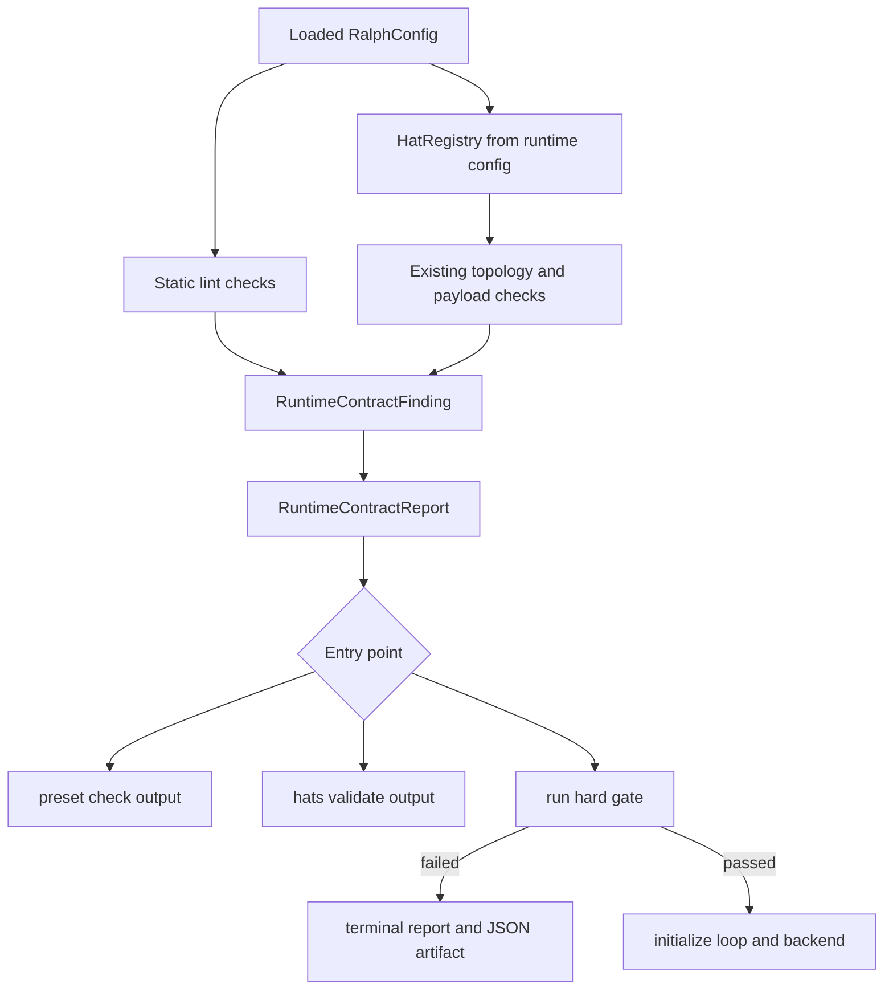

# feat: 建立 Preset 静态 Lint 硬门禁

## Summary

在现有 preset contract 聚合器上增加结构化静态 lint，统一校验 topic ownership、topic 格式、task coordinator 完备性，并把同一套规则接入 `ralph preset check`、`ralph hats validate` 与 `ralph run` 启动硬门禁。实现以当前嵌入式 preset 架构为准，不依赖磁盘上可能与二进制不一致的运行时文件。

---

## Problem Frame

当前代码已有拓扑、payload contract、orphan topic、required topic 与 obligation 对齐检查，但缺少 topic ownership、命名格式和 coordinator 配置检查。`ralph run` 仅强制 payload contract gate，因此部分 preset 结构错误要到 agent 启动后才暴露。

需求文档同时提出“`topic_owners` 只是责任归属、同一 topic 可有多个 publisher”与“非 owner publisher 属于越权”两种不兼容语义。为了让 `cross_hat_unauthorized_publish` 可静态判定，本计划采用以下明确约束：在 strict 模式下，owner 是该 topic 的唯一直接 publisher；确需多个 hat 表达同类结果时，使用不同 topic 或由 owner 汇聚后发布统一 topic。非 strict 模式只告警，以便迁移现有 preset。

---

## Requirements

**配置与规则**

- R1. `RalphConfig` 支持 `topic_owners` 和 `topic_format_whitelist`，默认均为空，旧配置可解析。
- R2. owner 引用必须指向已声明 hat，owner 必须在自己的 `publishes` 或 `default_publishes` 中声明该 topic。
- R3. 非 owner hat 声明 owner topic 时产生 `cross_hat_unauthorized_publish`；默认是 warning，strict 模式升级为 error。
- R4. 所有 authoring-time topic surface 使用同一 lowercase dot-case 校验器，并允许显式白名单。
- R5. `tasks.enabled=true` 时必须存在 `coordinator_hats`；发布 `task.*` 的 hat 必须被 coordinator 集合覆盖。

**入口与输出**

- R6. `ralph preset check [--strict]` 和 `ralph hats validate [--strict]` 使用同一聚合报告，不复制规则。
- R7. `ralph run` 在 backend、TUI、events 文件初始化前执行不可跳过的 strict lint，失败返回专用退出码 2。
- R8. lint 失败同时输出稳定的人类格式与 JSON artifact；artifact 写入失败不得掩盖 lint 失败。
- R9. lint 只读，不修改 preset 或自动生成迁移补丁。

**内置 preset 与回归**

- R10. `presets/manifest.yml` 声明的全部 9 个嵌入 preset 均通过 strict lint；公开数量仍由 `presets.rs` 的 `public` 字段决定。
- R11. canonical `presets/en/*.yml`、`build.rs` 复制产物和 `PRESETS` 清单继续由现有同步/一致性测试约束。
- R12. 修改 `ralph hats validate` 语法后，同步 `crates/ralph-core/data/ralph-tools.md` 中相关命令描述和源码引用。

---

## Key Technical Decisions

- **扩展现有 contract 聚合器，不创建平行验证栈：** 新检查返回 `RuntimeContractFinding`，由 `RuntimeContractAggregator` 统一排序、strictness 和渲染。
- **strictness 增加 authoring 轴：** 将当前仅表达 payload 的 strict 配置扩展为可控制 owner coverage/ownership 的 authoring strict；避免把所有 warning 全局升级为 error。
- **topic surface 由单一收集器枚举：** 收集 hats 的 `triggers`、`publishes`、`default_publishes`、obligations，event policy schema keys、required events、starting/cancellation/completion topic、verdict gate topic、workflow guard topic及 ownership keys，防止入口遗漏。
- **格式校验保留 token 原值：** lint 不做规范化后继续执行；suggestion 仅用于报告，避免大小写折叠掩盖真实拓扑。
- **启动 gate 使用已加载配置：** builtin preset 通过 `load_config_for_preflight` 解析嵌入内容，不能在 gate 中重新读取 `presets/en`。
- **源码位置使用当前模块边界：** 配置字段落在 `config/mod.rs`，规则集中在新 `preset_lint.rs`，CLI 只负责选择 strictness、渲染与退出码。

---

## High-Level Technical Design

---

## Implementation Units

### U1. 配置模型与共享 topic 枚举

- **Goal:** 建立 lint 所需配置字段和完整、可复用的 topic surface。
- **Requirements:** R1, R4
- **Dependencies:** 无
- **Files:** `crates/ralph-core/src/config/mod.rs`, `crates/ralph-core/src/config/ralph_config.rs`, `crates/ralph-core/src/preset_lint.rs`, `crates/ralph-core/src/lib.rs`
- **Approach:** 在顶层配置加入默认空 map/list；新模块定义 topic occurrence（topic、surface、hat、可选来源提示）与确定性 suggestion。配置校验只处理结构合法性，lint 处理跨字段语义。
- **Patterns to follow:** `payload_contract.rs` 的纯验证结果；`runtime_contract.rs` 的稳定 finding id 和 details。
- **Test scenarios:**
  1. 不含新字段的旧 YAML 解析后得到空集合。
  2. 所有 topic surface 各放入一个非法 token，枚举结果包含准确 surface。
  3. whitelist token 被标记为豁免，未白名单的大写 token仍被返回。
  4. `REVIEW_COMPLETE`、camelCase、首字符数字分别产生稳定 suggestion。
- **Verification:** topic 枚举器不依赖文件系统，字段 serde round-trip 保持稳定。

### U2. Ownership 与 coordinator 静态规则

- **Goal:** 实现 owner 引用、独占 publisher 与 task coordinator 完备性检查。
- **Requirements:** R2, R3, R5
- **Dependencies:** U1
- **Files:** `crates/ralph-core/src/preset_lint.rs`
- **Approach:** 每类错误使用稳定 finding id；缺 owner 和非 owner publisher 在默认模式为 warning、strict 为 error；无效 owner 引用始终为 error。`task.*` 使用具体 topic 前缀判断，不把 wildcard trigger 误当 publisher。
- **Execution note:** 先写表驱动失败用例，再实现规则。
- **Test scenarios:**
  1. owner 不存在时返回 `preset.owner_unknown_hat`。
  2. owner 未声明 publish 时返回 `preset.owner_not_publisher`。
  3. 非 owner 发布 owner topic，默认 warning、strict error。
  4. 无 owner topic，默认 warning、strict error。
  5. tasks 禁用时空 coordinator 合法。
  6. tasks 启用且 coordinator 为空时报错。
  7. 发布 `task.created` 的 hat 未被覆盖时列出候选 hat；覆盖后通过。
- **Verification:** 每个 finding 的 topic、hat、owner 与 fix hint 均可由机器字段读取。

### U3. Topic 格式规则与聚合器接入

- **Goal:** 将 lint 作为现有 contract report 的正式 authoring stage。
- **Requirements:** R4, R6
- **Dependencies:** U1, U2
- **Files:** `crates/ralph-core/src/preset_lint.rs`, `crates/ralph-core/src/runtime_contract.rs`, `crates/ralph-core/src/preset_validator.rs`, `crates/ralph-core/src/lib.rs`
- **Approach:** `RuntimeContractAggregator` 在 config validation 后运行静态 lint，再运行拓扑/payload/orphan 检查；结构错误可短路，语义 lint 不短路后续检查，以便一次报告全部 authoring 问题。
- **Test scenarios:**
  1. 非法 topic 在每个支持 surface 上产生 `preset.invalid_topic_format`。
  2. `LOOP_COMPLETE` 仅在 whitelist 中时通过。
  3. 多个 lint 与 payload 错误同时存在时报告同时包含两类 finding。
  4. finding 顺序在 HashMap 输入顺序变化后仍稳定。
- **Verification:** `preset check` 与直接 aggregator 调用得到相同 findings。

### U4. CLI 输出、退出码与启动硬门禁

- **Goal:** 三个入口共享规则，并保证 `run` 在副作用前失败。
- **Requirements:** R6, R7, R8, R9, R12
- **Dependencies:** U3
- **Files:** `crates/ralph-cli/src/commands/preset.rs`, `crates/ralph-cli/src/hats.rs`, `crates/ralph-cli/src/loop_runner/runner.rs`, `crates/ralph-cli/src/loop_runner/preset_lint_gate.rs`, `crates/ralph-cli/src/loop_runner/mod.rs`, `crates/ralph-cli/src/main.rs`, `crates/ralph-core/data/ralph-tools.md`
- **Approach:** 抽取 test-friendly gate 函数返回 typed error；CLI 边界映射 exit code 2。JSON artifact 使用原子临时文件 + rename，路径归属 workspace `.ralph/diagnostics/`，但不创建 events 文件。
- **Test scenarios:**
  1. `hats validate` 默认模式显示 warning 并成功，`--strict` 对同配置失败。
  2. `preset check --strict` 与 `hats validate --strict` 对同配置错误集合一致。
  3. `run` 遇到 bad preset 时 backend spawn 计数为 0、events 文件不存在、退出码为 2。
  4. artifact 可写时 JSON schema 完整；不可写时 stderr 包含附加 I/O warning，主退出码仍为 2。
- **Verification:** `ralph hats validate --help` 与工具文档参数一致，gate 位于 process group/TUI/backend 初始化之前。

### U5. 内置 preset strict 迁移

- **Goal:** 让 manifest 中全部嵌入 preset strict 通过。
- **Requirements:** R10, R11
- **Dependencies:** U3
- **Files:** `presets/en/autoresearch.yml`, `presets/en/ce-executor.yml`, `presets/en/ce-executor-wave.yml`, `presets/en/code-assist.yml`, `presets/en/debug.yml`, `presets/en/merge-loop.yml`, `presets/en/pdd-to-code-assist.yml`, `presets/en/research.yml`, `presets/en/review.yml`, `presets/manifest.yml`, `crates/ralph-cli/src/presets.rs`
- **Approach:** 以 manifest 为迁移清单；先规范化非白名单 topic，再补 owner/coordinator。不要新增不存在的 `hatless-baseline`。保留 `LOOP_COMPLETE` 等协议 token 时显式 whitelist。
- **Test scenarios:**
  1. manifest 每个 preset 均能 parse、validate、strict lint 通过。
  2. `PRESETS` 名称集合与 manifest 一致。
  3. canonical 文件与 `$OUT_DIR` 嵌入内容一致。
  4. public preset 数量和可见性不因 lint 迁移改变。
- **Verification:** CI 的 embedded sync check 与 builtin preset contract matrix 均保持通过。

### U6. BDD 与回放式门禁覆盖

- **Goal:** 用真实 CLI/runtime 路径证明硬门禁和无副作用保证。
- **Requirements:** R7, R8, R10
- **Dependencies:** U4, U5
- **Files:** `crates/ralph-core/tests/scenarios/preset_static_lint.yml`, `crates/ralph-core/tests/scenarios.rs`, `crates/ralph-cli/src/loop_runner/tests.rs`, `crates/ralph-cli/src/presets.rs`
- **Approach:** BDD 通过现有 scenario harness 运行真实配置解析和 gate；CLI 集成测试使用 mock backend，不调用外部 agent。
- **Test scenarios:**
  1. Covers AE1. 全部 builtin strict 通过。
  2. Covers AE2. 临时越权配置被 `run` 拒绝且无 events。
  3. Covers AE3. whitelist 仅豁免列出的 token。
  4. Covers AE4. 缺 coordinator 报候选列表。
- **Verification:** 场景测试不是源码字符串断言，实际经过 config loader、aggregator 和 run gate。

---

## Scope Boundaries

### In Scope

- preset authoring-time lint、共享 contract report、CLI/启动 gate、内置 preset 迁移。

### Out of Scope

- payload 字段 schema 的新规则、运行时 event origin 强制、AI 自动修改 preset、自定义 preset 迁移器。

### Deferred to Follow-Up Work

- 共享 topic 的委托 publisher 模型；如未来确需同一 owner topic 多 publisher，应单独设计显式 delegation 字段，而不是弱化 strict lint。

---

## Risks & Dependencies

- **需求语义冲突：** owner 独占语义会要求拆分部分共享 topic；迁移必须以现有拓扑测试证明行为不变。
- **错误来源行号：** serde 模型不保留 YAML span。首版不得伪造精确行号；可报告配置路径 + surface，CLI 在有原始 YAML 时再通过 span-aware parser补充行号。
- **入口漂移：** `preset check`、`hats validate`、`run` 必须消费同一 report，避免 strict 语义分叉。
- **嵌入内容：** builtin 校验对象必须是已加载的 embedded content，磁盘 canonical 仅用于开发期一致性测试。

---

## Acceptance Examples

- AE1. manifest 中全部 9 个嵌入 preset 通过 strict contract，8 个 public preset 的用户可见集合不变。
- AE2. owner 为 `executor` 的 topic 被其他 hat 声明 publish 时，strict gate 在 backend 启动前失败。
- AE3. whitelist 中的 `LOOP_COMPLETE` 合法，其他大写 topic 仍失败。
- AE4. tasks 启用且 coordinator 配置缺失时，报告列出所有发布 `task.*` 的候选 hat。

---

## Documentation / Operational Notes

- 更新用户指南中的 strict lint、退出码 2、JSON artifact 路径与 builtin rebuild 说明。
- 修改 `ralph tools` 引用文档后，按仓库规则反向核对所有源码行号引用，并执行相应 `--help` 冒烟。

---

## Sources / Research

- `crates/ralph-core/src/runtime_contract.rs`：现有统一 contract aggregator。
- `crates/ralph-cli/src/loop_runner/runner.rs`：现有 payload contract 启动硬门禁。
- `crates/ralph-cli/build.rs` 与 `crates/ralph-cli/src/presets.rs`：manifest 驱动的嵌入 preset。
- `docs/solutions/tooling-decisions/ralph-preset-embedded-compilation-2026-05-26.md`：嵌入内容与 canonical 文件同步约束。
