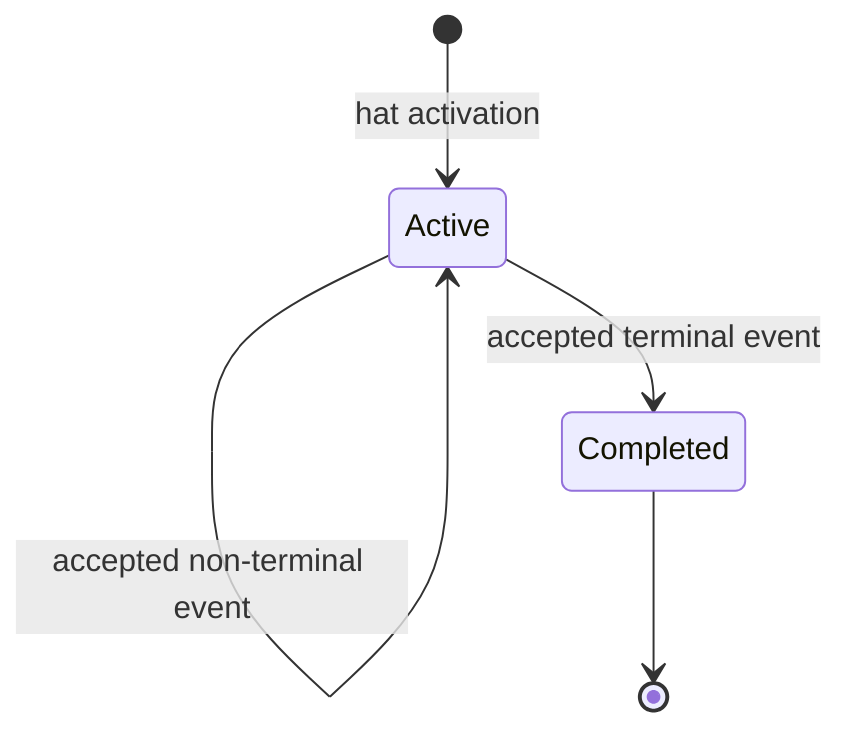
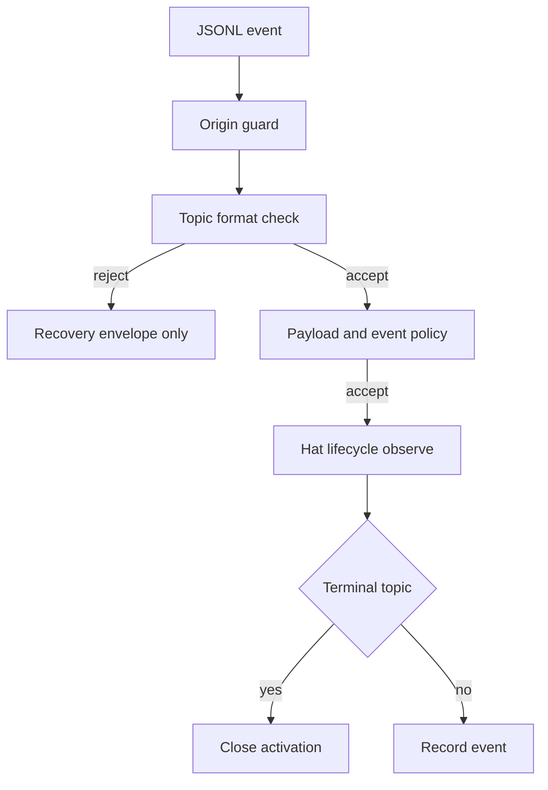
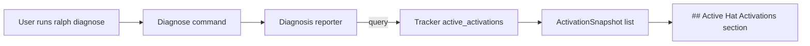

# feat: 强化 Hat 生命周期与 Topic 格式契约

## Summary

为每次 hat activation 建立显式生命周期跟踪，支持多结果终态、激活元数据暴露给 `ralph diagnose` 报告做调试可观测性、以及运行时 topic 格式拒绝。实现复用现有 recovery envelope、execution contract 与 task store，不把 hat 生命周期硬塞进当前以业务 instance 为中心的 `state_machine.rs`。

本 plan 显式规定 **tracker 唯一**读**消费方是 `ralph diagnose` reporter**——event loop 决策路径（hat 选择、policy apply、execution contract）不读 tracker；stall 监控、forced task closure 等任何"读 tracker 做自动决策"的扩展明确放到 plan 之外，等待真实数据再独立评审。

> **更新记录（2026-06-10，code review P2 #24）**：U4 实施时（commit `def2855` + 后续 P1 #3 修复 `f372342` / `20dbf3c`）实际上把 tracker 的**写**消费方从单一 reporter 扩展为：
> 1. `runner.rs:160` 在 loop 终止时调 `event_loop.hat_lifecycle_tracker().active_activations()` 落盘到 `active-activations.json`
> 2. `runner.rs` 在 heartbeat 周期（`RALPH_ACTIVATIONS_HEARTBEAT_SEC`）内调 `write_active_activations` 持续落盘
> 3. `reporter.rs:200` 从落盘文件读 `Vec<ActivationSnapshot>` 渲染 `## Active Hat Activations` 段
>
> 这些写消费方只**写**不**读**（即不基于 tracker 状态做自动决策），所以"读消费方只有 reporter"的不变量仍然成立；但"tracker 状态如何物化到 disk"这一面已经在 U4 实施过程中被拓宽。后续任何"读 tracker 做自动决策"的扩展（stall 监控、forced task closure）仍然按本 plan 显式规定放到 plan 之外。

---

## Problem Frame

当前 `StateMachineRuntimeState` 跟踪 payload 中的业务 instance，并不识别"哪次 hat activation 尚未完成"，需要在 hat 层面补充 activation lifecycle 跟踪。`TaskNotTerminal` 只拒绝完成事件，不会形成明确的强制收尾。

需求文档要求单一 `terminal_event`，但现有 preset 多处存在成功/失败双结果。计划采用 OQ1 方案 A 的泛化形式：`terminal_events` 是非空集合；一轮 activation emit 集合中任一 terminal topic 即完成。这样保留显式契约，又不要求人为增加无业务意义的统一 completion event。

**激活元数据的可观测性消费方**：`ralph diagnose --session latest` 输出在现有 `## Diagnostics` 段之后追加 `## Active Hat Activations` section，列出当前 active 的 hat 名字、激活时长、最后事件时间、关联 task id，按激活时长倒序。loop 跑着跑着卡住时，用户无需 grep 日志，跑 `ralph diagnose` 就能直接看到"哪个 hat 在卡、卡了多久"。

**tracker 只写不读决策路径**：`ralph diagnose` 是**唯一**显式读 tracker 的入口。这样做的两个原因：
1. **避免隐性反馈环**：event loop 决策路径如果读 tracker 做自动行为（"看 X 是不是超时就 kill"），就形成了"tracker → kill → tracker"的隐式状态机，破坏现有"事件驱动 + backpressure"的清晰边界。
2. **保持 plan 可独立验证**：tracker 的所有消费方在本 plan 内可枚举、可测试；stall 监控等未来消费方在新 plan 里重新评审 tracker 是否够用。

---

## Requirements

**生命周期配置**

- R1. `HatConfig` 支持非空 `terminal_events` 集合；单字符串 `terminal_event` 仅作为 serde 输入别名，不作为长期双 schema。
- R2. 每个 terminal topic 必须存在于该 hat 的 `publishes`，并通过现有 authoring contract 校验。
- R3. lifecycle tracking 以 activation 为单位，记录 trigger、hat、activated_at、last_event_at、terminal topics、关联 task id 与状态；tracker 暴露 `active_activations() -> Vec<ActivationSnapshot>` 只读 query API。

**Runtime topic contract**

- R9. 所有 JSONL agent event 在 payload policy 前执行 topic 格式检查；未白名单的非法 topic 被拒绝。
- R10. topic 格式拒绝不自动向同一 agent 发 retry event，只写 recovery signal，避免自激循环。
- R11. 运行时 owner check 仅在 ownership 配置可用时启用；缺失时不阻塞本计划其他能力。

**迁移与验证**

- R12. manifest 中全部嵌入 preset 补齐 terminal sets。
- R13. topic 格式拒绝的 recovery signal 复用现有 `RecoveryDiagnosisEnvelope` 与 execution source，不创建平行 diagnostics schema。
- R14. `ralph diagnose --session latest` 输出包含 `## Active Hat Activations` section，列出当前 active 的 hat 名字、激活时长、最后事件时间、关联 task id；section 来源是 tracker 的 `active_activations()` query API；无 active activation 时显示占位提示。

---

## Key Technical Decisions

- **新增 `hat_lifecycle.rs`，不扩张业务 instance state machine：** 两者 key、关闭条件不同，强行复用会污染现有纯状态转换。
- **多 terminal topic 是一等配置：** 成功、失败、耗尽均可结束 activation；terminal 后是否推进成功链仍由现有拓扑决定。
- **tracker 唯一显式消费方是 `ralph diagnose` reporter：** event loop 决策路径（hat 选择、policy apply、execution contract）只调 tracker 写 API；read API 仅 U4 消费。任何其它读 tracker 的需求必须先有新 plan。
- **`ActivationSnapshot` 定义在 `hat_lifecycle.rs`：** 避免 diagnosis → hat_lifecycle 反向依赖；reporter 反向消费 snapshot。
- **使用可注入 clock：** activation 时间戳与 duration 计算测试使用 fake clock，生产环境用 `SystemTime::now()`，不阻塞实时运行。
- **topic 格式检查先于 schema：** 非法 topic 不会进入 schema lookup；rejection 转成专用 `ViolationType` 和 recovery reason。
- **owner 能力可选：** 若 001 计划尚未实现，lifecycle 仍可独立工作；owner-related authoring/runtime 检查返回 capability unavailable warning，而不是编译依赖。

---

## High-Level Technical Design

事件流（写路径）：





读路径（独立）：



**两条路径不相连**：event loop 写 tracker / diagnose 读 tracker，没有反向边。

---

## Implementation Units

### U1. Lifecycle 配置模型

- **Goal:** 定义可迁移、可验证的 terminal set 配置。
- **Requirements:** R1, R2
- **Dependencies:** 无
- **Files:** `crates/ralph-core/src/config/hat.rs`, `crates/ralph-core/src/config/loop_config.rs`, `crates/ralph-core/src/config/ralph_config.rs`, `crates/ralph-core/src/runtime_contract.rs`
- **Approach:** `terminal_events` 默认空以允许解析旧 preset，但 strict authoring contract 要求非空；serde 接受单字符串 `terminal_event` 别名并展开为单元素集合。
- **Test scenarios:**
  1. 单字符串 alias 和数组形式解析为同一 terminal set。
  2. 空 terminal set 默认 warning、strict error。
  3. terminal topic 不在 publishes 时 error。
  4. 旧 preset（无 `terminal_event`/`terminal_events` 字段）解析为 warning + 空集合，不阻塞。
- **Verification:** 配置模型无 runtime 时间状态，contract report 能完整描述错误；旧 preset 解析回归测试不破坏现有 strict contract 行为。

### U2. Activation 生命周期跟踪器

- **Goal:** 用纯 Rust 状态机跟踪每次 hat activation 的 active、completed 状态，并暴露只读 query API。
- **Requirements:** R3
- **Dependencies:** U1
- **Files:** `crates/ralph-core/src/hat_lifecycle.rs`（**新增**），`crates/ralph-core/src/lib.rs`
- **Approach:**
  - activation key 由 loop id、iteration、hat id 和触发 event identity 组成，保证并行 activation 互不污染。
  - **写 API**：`activate(key, snapshot)` / `observe_accepted_event(key, event)` / `complete(key, terminal_topic)`。
  - **读 API**：`active_activations() -> Vec<ActivationSnapshot>`，仅返回 active 状态，completed 立即从 active 集合移除。
  - **`ActivationSnapshot`** 定义在 `hat_lifecycle.rs`：字段包含 `hat_id`、`trigger_topic`、`trigger_identity`、`activated_at: SystemTime`、`last_event_at: SystemTime`、`duration: Duration`（实时计算）、`linked_task_id: Option<TaskId>`。
  - **幂等性**：重复 `complete` 同 key 不 panic，记录日志；late event 对已 complete 的 activation 不修改状态。
  - 记录 activation 元数据，不直接做 I/O。
  - clock 注入通过 trait `Clock`（trait object 或 generic parameter），fake clock 单测驱动时间。
- **Test scenarios:**
  1. active 后收到中间 event 记录时间戳，不关闭。
  2. 任一 terminal event 关闭 activation。
  3. 并行 activation（不同 key）的状态互不污染。
  4. 被拒 event 不调用 observe API，不进入 tracker。
  5. `active_activations()` 返回当前 active 的快照，不含 completed。
  6. completed activation 立即从 active 集合移除。
  7. 重复 `complete` 同 key 幂等不 panic。
  8. late event 对已 complete 的 activation 不修改状态。
- **Verification:** tracker 可在无 EventBus、文件系统和 tokio timer 的单测中完整运行；query API 单测覆盖空 / 1 个 / 多个 / completed 各种状态；fake clock 驱动时间字段计算。

### U3. Event loop 集成与 diagnostics

- **Goal:** 在真实 activation 和 accepted event 上驱动 tracker；显式验证"event loop 决策路径不读 tracker"。
- **Requirements:** R3, R13
- **Dependencies:** U2
- **Files:** `crates/ralph-core/src/event_loop/mod.rs`, `crates/ralph-core/src/event_loop/loop_state.rs`, `crates/ralph-cli/src/loop_runner/runner.rs`, `crates/ralph-core/src/diagnosis/envelope.rs`, `crates/ralph-core/src/diagnostics/recovery.rs`
- **Approach:**
  - hat 选中时调 `tracker.activate(...)`；policy/execution contract 通过后的 accepted events 调 `tracker.observe_accepted_event(...)`；terminal accepted event 调 `tracker.complete(...)`。
  - topic 格式拒绝的 recovery signal 复用现有 `RecoveryDiagnosisEnvelope`，不创建平行 envelope schema。
  - **显式约束**：event loop 决策路径（hat 选择、policy apply、execution contract）不调用 `tracker.active_activations()`；通过 lint 或 code review checklist 守住这条边界。
- **Test scenarios:**
  1. 中间 accepted event 在 tracker 留下记录。
  2. terminal accepted event 结束跟踪。
  3. diagnostics 禁用时 tracker 内存状态仍正确，只有落盘为 no-op。
  4. **决策路径"只写不读"回归测试**：在 hat 选择 / policy apply 阶段 instrumentation 记录所有 tracker 调用，断言不出现 read API 调用。
- **Verification:** replay/integration 测试能从真实 event loop 观察 lifecycle 状态；通过 instrumentation 守住"决策路径不读 tracker"的边界。

### U4. Diagnose 报告暴露 active activations

- **Goal:** 让用户跑 `ralph diagnose` 时直接看到当前 active 的 hat activation 列表（hat 名字、激活时长、最后事件时间、关联 task id），无需 grep 日志。
- **Requirements:** R14
- **Dependencies:** U3
- **Files:** `crates/ralph-core/src/hat_lifecycle.rs`（query API + `ActivationSnapshot` 类型，U2 已暴露）, `crates/ralph-core/src/diagnosis/reporter.rs`（扩展 report 渲染，新增 `## Active Hat Activations` section）, `crates/ralph-cli/src/commands/diagnose.rs`（**确认入口位置**；若 diagnose 命令在其它文件，按实际位置调整）
- **Approach:**
  - reporter 调 `tracker.active_activations()` 拉取当前快照。
  - 在现有 `## Diagnostics` section 之后追加 `## Active Hat Activations` section。
  - section 格式（Markdown 表格，按 `duration` 倒序）：

    ```
    ## Active Hat Activations

    | Hat | Activated at | Last event at | Duration | Task |
    |---|---|---|---|---|
    | executor | 2026-06-09 14:23:10 | 2026-06-09 14:25:30 | 30m 20s | task-abc123 |
    | reviewer | 2026-06-09 14:50:01 | 2026-06-09 14:51:15 | 1m 14s | task-def456 |

    _2 active activations, sorted by duration descending._
    ```

  - 无 active activation 时显示占位：`_No active hat activations._`。
  - 时间字段（`activated_at`、`last_event_at`、`duration`）生产环境用 `SystemTime::now()` 实时计算，测试通过 fake clock 注入。
  - duration 格式化用现有 `humanize` crate 或项目内已有的时长格式化工具。
  - **diagnostics 禁用时 section 仍渲染**：query 来自内存 tracker，不依赖落盘 artifacts；loop 重启后内存状态丢失，section 显示空。
- **Test scenarios:**
  1. `ralph diagnose --session latest` 输出包含 `## Active Hat Activations` section header。
  2. section 表格列出每个 active activation 的 hat 名字、激活时长、最后事件时间、关联 task id。
  3. 多个并行 activation 全部列出，按 duration 倒序。
  4. completed activation 不出现在 section 中。
  5. 无 active activation 时 section 显示 `_No active hat activations._` 占位。
  6. diagnostics 禁用 / 未落盘 artifacts 时 section 仍能渲染（依赖内存 tracker）。
  7. fake clock 注入验证 duration 字段计算正确（不是 0、不是负数、不是 stale）。
- **Verification:**
  - replay fixture 模拟"executor hat 卡住 30 min、最后事件 28 min 前"，跑 `ralph diagnose --session latest` 验证 section 字段值与 fixture 一致。
  - snapshot → section 的渲染单测覆盖表格排序、空集合、fake clock 三种场景。

### U5. Runtime topic 格式拒绝

- **Goal:** 在 agent event 进入 payload schema 前拒绝非法 topic，且不自动 retry。
- **Requirements:** R9, R10, R11
- **Dependencies:** U1
- **Files:** `crates/ralph-core/src/event_policy.rs`, `crates/ralph-core/src/event_loop/mod.rs`, `crates/ralph-core/src/event_loop/rejection.rs`, `crates/ralph-cli/src/loop_runner/hard_gate.rs`, `crates/ralph-core/src/diagnosis/reporter.rs`
- **Approach:** 增加 `InvalidTopicFormat` violation；event loop 将其映射为 non-retryable policy rejection 和 execution-contract recovery envelope。格式工具与静态 lint 通过独立共享模块复用；若 001 未落地，本计划把工具放在 `topic_contract.rs`，001 后续只消费它。
- **Test scenarios:**
  1. 未白名单 `REVIEW_COMPLETE` 被拒且不进入 payload schema。
  2. whitelist 中 `LOOP_COMPLETE` 被接受。
  3. 非法 topic 不产生 `task.resume`。
  4. 同 batch 中合法 event 继续处理，不被非法 sibling 阻断。
  5. diagnostics 报告显示 reason code、source hat 和原 topic。
- **Verification:** accepted event history、EventBus 和 lifecycle tracker 均看不到被拒 topic。

### U6. Preset 迁移与真实路径测试

- **Goal:** 为所有嵌入 preset 声明 terminal sets，并证明分支终态行为。
- **Requirements:** R12
- **Dependencies:** U1, U2, U3, U4, U5
- **Files:** `presets/en/*.yml`, `crates/ralph-cli/src/presets.rs`, `crates/ralph-core/tests/scenarios/hat_lifecycle_contract.yml`, `crates/ralph-core/tests/replay_light_integration.rs`, `crates/ralph-cli/src/loop_runner/tests.rs`
- **Approach:** 以 manifest 枚举迁移，不硬编码"N 个"；对成功/失败分支使用 terminal set。grand-lily 证据转为最小 replay fixture，避免依赖现场 worktree。
- **Test scenarios:**
  1. Covers AE2. 大写 topic 被拒且无 retry。
  2. Covers AE4. 非 terminal 中间 event 不关闭 activation。
  3. Covers AE5. 白名单 completion token 保持可用。
  4. Covers AE6. diagnose 报告暴露 active activation 字段。
  5. 所有 manifest preset strict authoring contract 通过。
- **Verification:** BDD 经过真实 event loop、policy、task store、diagnose reporter 路径。

---

## Scope Boundaries

### In Scope

- activation lifecycle 跟踪、terminal sets 配置、tracker 暴露给 `ralph diagnose` reporter、runtime topic format 拒绝。

### Out of Scope

- backend 自动 kill、wave worker 子生命周期、动态复杂度 timeout、payload schema 新规则、per-hat stall 与 forced task closure（保留为 follow-up）。
- **tracker 在 event loop 决策路径上的任何读访问**（明确禁止，避免隐性反馈环）。
- tracker 状态的持久化（loop 重启后内存状态丢失；如需持久化在 follow-up plan 评审）。

### Deferred to Follow-Up Work

- 针对 wave worker 的子 activation 与 aggregate deadline 模型。
- per-hat stall 监控 + 多次重试后 force close task（**基于真实 stall 频次数据决定是否引入**）。
- 任何"基于 activation 状态做自动决策"的扩展（需要先有真实 stall 数据 + 新 plan 评审）。
- tracker 状态持久化（如 session 重启后保留 activation 视图）。

---

## Risks & Dependencies

- **重复事件：** late terminal event 与 tracker activate 可能竞态；tracker 必须幂等（重复 `complete` 不 panic，late event 对 completed activation 不修改状态）。见 U2 test 7-8。
- **001 计划可选依赖：** topic whitelist/owner 配置若已存在则复用；否则通过 adapter trait 或共享 module 保证本计划可独立编译。
- **diagnose consumer 单一化：** tracker 当前唯一消费方是 diagnose reporter；如果未来 stall plan 直接读 tracker 做决策，状态机设计可能不够用（需要扩展字段如 progress density、emit cadence、event-spamming tail 检测）。本 plan 明确**不预设**这条路径，state machine 接口面保持最小。
- **reporter 时间字段依赖 fake clock 测试：** 生产用 `SystemTime::now()` 实时计算，不阻塞实时运行；测试通过 `Clock` trait 注入。
- **diagnose 报告时效性：** tracker 数据来自内存，loop 重启后丢失；用户跑 diagnose 时如果当前无 loop 持有 tracker，section 显示空。这不是 bug，是 design——避免为了"重启后还能看"而引入持久化复杂度。

---

## Acceptance Examples

- AE2. 非白名单大写 topic 被拒，不产生 retry，后续合法 event 仍可处理。
- AE4. success/failure 任一 terminal topic 均可结束同一 hat activation。
- AE5. 白名单 completion token（`LOOP_COMPLETE`）保持可用，不被 topic 格式检查误拒。
- AE6. `ralph diagnose --session latest` 输出包含 `## Active Hat Activations` section，列出当前 active 的 hat 名字、激活时长、最后事件时间、关联 task id；completed activation 不出现；多个并行 activation 按 duration 倒序；无 active 时显示占位提示。示例输出：

  ```
  ## Active Hat Activations

  | Hat | Activated at | Last event at | Duration | Task |
  |---|---|---|---|---|
  | executor | 2026-06-09 14:23:10 | 2026-06-09 14:25:30 | 30m 20s | task-abc123 |
  | reviewer | 2026-06-09 14:50:01 | 2026-06-09 14:51:15 | 1m 14s | task-def456 |

  _2 active activations, sorted by duration descending._
  ```

---

## Documentation / Operational Notes

- 更新 runtime diagnosis 指南，说明：
  - `## Active Hat Activations` section 的字段含义与排序规则（U4）
  - tracker 当前不参与 event loop 决策，**不要**在配置里假设它会触发自动行为
  - tracker 数据来自内存，loop 重启后丢失（不持久化）
- 更新 topic 格式拒绝与现有 recovery envelope 复用关系（U5）。
- preset 作者文档给出 terminal set 的分支结果示例，不鼓励增加无意义统一 terminal topic。
- 文档中**不再**涉及 stall timeout / forced closure 概念；如未来重新引入，应作为独立 follow-up plan 写明触发条件、信号源与回退策略。
- 文档明确 diagnose 报告的 active activations 仅用于**人肉调试**，**不**是自动恢复机制的依据。

---

## Sources / Research

- `crates/ralph-core/src/state_machine.rs`：现有业务 instance state machine，证明需独立 lifecycle tracker。
- `crates/ralph-cli/src/loop_runner/runner.rs`：当前 hat activation 与 terminal event 跟踪。
- `crates/ralph-core/src/execution_contract.rs`：现有 `TaskNotTerminal` 拒绝路径。
- `crates/ralph-core/src/diagnosis/responder.rs`：现有 repeated/escalation in-memory 聚合模式，证明 U4 read API 设计可对齐。
- `crates/ralph-core/src/diagnosis/reporter.rs`：现有 diagnose 报告输出格式，证明可扩展 `## Active Hat Activations` section。
- `crates/ralph-cli/src/commands/diagnose.rs`（或等价入口）：CLI 入口，证明 query 路径可行。
- `crates/ralph-core/src/clock.rs`（或等价时间抽象）：若已存在 `Clock` trait，复用；否则 U2 新增最小 trait。
