# fix: ce-executor worktree 隔离在 subprocess TUI 模式下不生效

## Summary

修复 `ralph run -H builtin:ce-executor --worktree` 在默认 subprocess TUI 模式下,**主仓的 `.ralph/` 被父子进程交叉污染**的 bug。

本计划是从原 plan `docs/plans/2026-06-08-001-fix-ce-executor-worktree-residual-issues-plan.md` 中**只切出问题 A(worktree 隔离)**独立处理。原 plan 的问题 B(长 thinking 段被 watchdog 误判 + `work.progress` 协议)留给后续独立 plan。

> **本计划所有源码行号锚定 commit `93aea61`**(2026-06-10 当日 main 分支 HEAD)。实施时若 main 已前进,**以「分支模式 + 函数名 + 关键字符串」定位**,行号仅作参考——参见 KTD-1。

---

## Problem Frame

### 用户视角看到的现象

跑 `ralph run -H builtin:ce-executor --worktree` 之后:

- 主仓 `git status` 干净 ✅(git worktree 隔离确实有效)
- **但主仓的 `.ralph/diagnostics/logs/` 里冒出了日志** ❌(父进程 stderr 落在主仓)
- **`loops.json` 里 worktree-mode loop 的字段可能错乱** ❌(若 child 被错误地以主仓 cwd 启动)
- worktree 自己 `.ralph/diagnostics/logs/` 反而经常是 0 字节或缺失

### 因果链(读源码后的精确版,不是原 plan 推测版)

调研 commit `93aea61` 源码定位到 4 处实际 bug 点:

**Bug 点 1:`run_command` 主分支顺序倒置**

`crates/ralph-cli/src/commands/run.rs:721-738` 处的三路 `if/else if/else`:

```rust
let (loop_context, _lock_guard) = if use_subprocess_tui {
    // 行 721-727:subprocess TUI 抢先匹配,强写 LoopContext::primary
    let context = LoopContext::primary(workspace_root.clone());
    (context, None)
} else if args.worktree {
    // 行 728-738:只在 use_subprocess_tui=false 时才进
    spawn_worktree_loop(...)?
} else { ... }
```

**后果**:用户传 `--worktree` 且 stdin/stdout 是 TTY(默认情况),`use_subprocess_tui` 命中,parent **完全跳过 worktree 创建**,`loop_context` 是 primary 模式(workspace = main repo)。

**Bug 点 2:`run_subprocess_tui` 入参没带 worktree 信息**

`run.rs:1100-1122` `SubprocessTuiArgs` 结构体只有 `worktree: bool`(一个布尔开关),**没有任何字段携带 worktree 实际路径**。`run.rs:1159-1163` `async fn run_subprocess_tui(args: SubprocessTuiArgs, resume: bool, custom_args: Vec<String>)` 也没接 `LoopContext`。

**后果**:即使 Bug 点 1 修了让 parent 创建出 worktree,这个 worktree path 也**没法传给 `run_subprocess_tui`**。

**Bug 点 3:spawn child 没有 `.current_dir`**

`run.rs:1286-1292`:
```rust
let mut child = Command::new(std::env::current_exe()?)
    .args(&child_args)
    .stdin(Stdio::piped())
    .stdout(Stdio::piped())
    .stderr(stderr_stdio)
    .spawn()
```

**后果**:child 进程隐式继承 parent cwd(主仓)。即使 child 内部 `args.worktree=true` 会自己再调 `spawn_worktree_loop`,它会在**主仓**下又创建一个 `.worktrees/<id>` —— 这条 child-side worktree 创建是 plan `2026-05-31-002` 的原设计,但因为 parent 视角和 child 视角是两套 cwd,parent stderr 落主仓,child events 落 child 自己创建的另一个 worktree。**主仓和某个 worktree 都被写,但写的不是同一个 worktree**。

**Bug 点 4:stderr log 路径用 `std::env::current_dir()`**

`run.rs:1276-1277`:
```rust
let stderr_stdio = match ralph_core::diagnostics::create_log_file(
    &std::env::current_dir().unwrap_or_default(),
) { ... };
```

**后果**:即使 parent 持有 worktree 路径,这一行也只看 cwd,日志依然落主仓。

### 现状的本质

`docs/achieved/plan/2026-05-31-002-feat-ce-executor-worktree-mode-plan.md` 的原设计假设是「**child 创建 worktree,parent 只是 TUI**」。这个假设在以下两点没兜住:

1. **parent 也写文件**(stderr log)—— 它不知道 worktree path,只能用 cwd
2. **child 创建的 worktree 跟 parent 视角不一致** —— parent cwd=主仓,child cwd 继承也=主仓,然后 child 在主仓下创建 `.worktrees/<id>`;但 parent 这一侧的日志写在「主仓 cwd」,child 的 worktree 又是另一个文件夹

**正确架构 = parent 主动创建 worktree(成为 worktree path 的唯一权威),把路径下发给 child;child 不再自己创建。**

### 跟现有 plan 的关系

- **原 plan**:`docs/plans/2026-06-08-001-fix-ce-executor-worktree-residual-issues-plan.md`(问题 A + 问题 B 合并)。本 plan **只继承问题 A**,问题 B 完全独立(后续 plan 处理)。
- **历史 plan**:`docs/achieved/plan/2026-05-31-002-feat-ce-executor-worktree-mode-plan.md`(worktree-mode 原始实现)—— 本 plan **修正其遗留假设**(child-only 创建 worktree 不够),不推翻其架构(worktree mode 本身的设计不变)。
- **不动**:`docs/plans/2026-06-05-002-feat-preset-template-versioning-plan.md`(active,本 plan 不修改 preset 注册表)。

---

## Requirements

### 隔离承诺(端到端)

- **R1.** 跑 `ralph run --worktree`(任意 preset、任意 TUI 模式组合),**主仓 `.ralph/` 目录树下不应该出现任何新文件**。包括 `diagnostics/logs/`、`events*.jsonl`、`loops.json` 的 worktree-mode entry、`current-events` marker 等全部都落在 worktree 内的 `.ralph/`。
- **R2.** subprocess TUI 模式下,**parent 必须先创建 worktree,再 spawn child**。当前「parent 走 primary、child 自己再创建一份」的双重创建路径必须消除。
- **R3.** child 进程的 cwd 必须是 worktree 路径。所有走 `std::env::current_dir()` 兜底的代码(`RALPH_EVENTS_FILE` 解析、log 路径、`workspace_root` 推断)在子进程内都在 worktree 下解析。
- **R4.** parent 进程为 child stderr 创建的 log 文件,落在 worktree 内 `.ralph/diagnostics/logs/`,不在主仓。
- **R5.** `loops.json` 中 worktree-mode loop 的 `worktree_path` 字段值与 `workspace` 字段值**都是 worktree 绝对路径**(两者值相等;`Option<String>` 的 None/Some 信号语义保留——None 仍表示 primary loop)。

### 可发现性

- **R6.** `ralph run --help` 与 `docs/guide/cli-reference.md` 中 `--worktree` 说明,需要让人意识到「worktree 隔离是端到端承诺,不只是 git worktree 创建」。

### 不影响项(显式约束)

- **R7.** 不引入新事件类型,不修改 `event_policy` schema,不修改任何 hat 的 `instructions`。`work.progress` 协议属于原 plan 的问题 B,**完全不在本 plan 范围**。
- **R8.** 不修改 watchdog(`pty_executor.rs`)行为,不修改 drift detector。
- **R9.** 不破坏 RPC 模式(`--rpc` 显式 flag)和 `--no-tui` 模式的现有行为。它们走 `run_loop_impl` 直接路径,本 plan 修复点只影响 subprocess TUI 路径上的 parent 行为 + child cwd 下发。

---

## Key Technical Decisions

- **KTD-1. 行号定位策略:模式锚定,不绑数字**。
  本 plan 引用的源码行号锚定 commit `93aea61`,**实施时优先用「函数名 + 分支结构 + 关键字符串」定位**。修复点的锚定标识:
  - 主分支顺序:`run_command` 函数内 `let (loop_context, _lock_guard) = if use_subprocess_tui { ... } else if args.worktree { ... }` 三路 if 链
  - parent spawn child:`run_subprocess_tui` 函数内 `Command::new(std::env::current_exe()?)` 调用点
  - stderr log:`run_subprocess_tui` 函数内 `ralph_core::diagnostics::create_log_file(...)` 调用点
  - `spawn_worktree_loop`:`run.rs` 中定义的 private fn,签名包含 `pending_worktree_registration: &mut Option<LoopEntry>`
  违反本 KTD(直接写裸行号)会随 main 推进失效。

- **KTD-2. parent 主动创建 worktree,child 跳过重复创建**。
  subprocess TUI + `--worktree` 模式下,parent 调 `spawn_worktree_loop`(承担 worktree path 的唯一权威),通过新 CLI flag `--worktree-path <PATH>` 将路径下发给 child;child 看到这个 flag 后**跳过** `spawn_worktree_loop`,直接以 `LoopContext::worktree(loop_id_from_path, worktree_path, repo_root)` 构造 ctx。**理由**:消除「parent 与 child 创建两个 worktree」的并发分歧。

- **KTD-3. `LoopContext::workspace()` 是 cwd 的单一真相**。
  parent 为 child 设置 `Command::current_dir(loop_context.workspace())`(worktree 模式时返回 worktree 路径,primary 模式返回主仓路径)。parent 自身的 stderr log 也用 `loop_context.workspace()` 作为 `create_log_file` 的 base_path,不再用 `std::env::current_dir()`。**理由**:这是 ralph 现有 LoopContext 设计的语义,不引入新概念。

- **KTD-4. `LoopEntry` 字段填法保持「都填 worktree 路径」**。
  代码调研发现 `spawn_worktree_loop` 当前(`run.rs:380-385`)已经把 `worktree_path` 和 `workspace` **都填成 worktree 绝对路径**——这是对的,不动。**Bug 在调用链入口**(subprocess TUI 路径短路了这段代码),不在 LoopEntry 构造逻辑。原 plan R5 描述「`worktree_path` 指向主仓」的现场证据,经核实是更早版本的遗物。本 plan **不删 `worktree_path` 字段**(它的 `Option<String>` 是「primary vs worktree」的信号,被 5 处生产代码消费,见 Sources 段)。

- **KTD-5. 新 CLI flag `--worktree-path` 仅供内部 child 进程使用**。
  对外仍是 `--worktree`(boolean),`--worktree-path` 不在 `ralph run --help` 公开介绍,但接受合法路径输入。**理由**:避免污染用户面向的 CLI 表面,同时保留 child 跳过创建的能力。可选改用 env var `RALPH_WORKTREE_PATH`(优势:不进 `--help`;劣势:env 传递跟现有 RALPH_* env 命名一致需要 audit)。最终选 flag 还是 env 由 implementer 在 U2 决定;默认走 flag。

- **KTD-6. BDD 端到端验证 worktree 隔离**。
  新建一个独立 BDD scenario `crates/ralph-core/tests/scenarios/ce-executor-worktree-isolation.yml`,**只**验证 worktree 隔离的端到端承诺:跑完一个最小 ce-executor mock loop,断言主仓 `.ralph/diagnostics/logs/` 为空 + worktree 内 `.ralph/events.jsonl` 有内容。**不**与 progress 协议合并。

- **KTD-7. 不引入向后兼容垫片**。
  按 `CLAUDE.md`「Backwards compatibility doesn't matter — it adds clutter for no reason」原则,新版 ralph 写出的 `loops.json` 不强制兼容旧版读取者;旧版 `loops.json` 若被新版读到,`serde_json` 默认忽略未知字段。

---

## High-Level Technical Design

### Subprocess TUI + `--worktree` 数据流(修复前 vs 修复后)

```mermaid
flowchart TD
    subgraph BEFORE["修复前:parent 走 primary,child 自己再建"]
        A1[ralph run --worktree] --> B1{use_subprocess_tui?}
        B1 -->|是,TTY 默认| C1["parent: LoopContext::primary<br/>cwd=主仓"]
        C1 --> D1["spawn child<br/>(无 .current_dir)<br/>(无 worktree path 下发)"]
        D1 --> E1["child cwd 继承=主仓"]
        E1 --> F1["child 自己跑 spawn_worktree_loop<br/>在主仓下创建 .worktrees/X<br/>cwd 仍是主仓!"]
        C1 --> G1["parent stderr log:<br/>create_log_file(env::current_dir)<br/>→ 主仓/.ralph/diagnostics/logs/"]
        F1 --> H1["child events 走 child 内 ctx<br/>→ .worktrees/X/.ralph/events.jsonl"]
        G1 -.污染.-> POLLUTE[主仓 .ralph 被污染]
    end

    subgraph AFTER["修复后:parent 创建,child 继承"]
        A2[ralph run --worktree] --> B2{args.worktree?}
        B2 -->|是,优先| C2["parent: spawn_worktree_loop<br/>→ LoopContext::worktree<br/>注册 LoopEntry 到主仓 loops.json"]
        C2 --> D2["spawn child<br/>.current_dir = loop_context.workspace<br/>--worktree-path WORKTREE 下发"]
        D2 --> E2["child cwd = worktree"]
        E2 --> F2["child 检测到 --worktree-path<br/>跳过 spawn_worktree_loop<br/>直接 LoopContext::worktree(已存在路径)"]
        C2 --> G2["parent stderr log:<br/>create_log_file(loop_context.workspace)<br/>→ worktree/.ralph/diagnostics/logs/"]
        F2 --> H2["child events<br/>→ worktree/.ralph/events.jsonl"]
        G2 -.全部落 worktree.-> CLEAN[主仓 .ralph 干净]
        H2 -.全部落 worktree.-> CLEAN
    end
```



### 修复涉及的代码触面(以 `93aea61` 为锚)

```
crates/ralph-cli/src/commands/run.rs
  ├── run_command            ── 调换/嵌套分支:worktree 优先于 use_subprocess_tui
  ├── run_subprocess_tui     ── 加 LoopContext 入参;.current_dir;stderr base path
  ├── SubprocessTuiArgs      ── 加 worktree_path: Option<PathBuf> 字段
  └── spawn_worktree_loop    ── 当前实现对,不动;加 unit test 保护字段填法

crates/ralph-cli/src/cli/mod.rs (或 run args 定义文件)
  └── RunArgs                ── 加内部 --worktree-path <PATH>(隐藏 from help)

crates/ralph-cli/src/loop_runner/runner.rs / tests.rs
  └── 现有 worktree unit test ── 扩 subprocess TUI 隔离 case

crates/ralph-core/tests/scenarios/
  └── ce-executor-worktree-isolation.yml ── 新建,端到端 BDD

docs/guide/cli-reference.md
  └── --worktree 段落 ── 加端到端承诺说明
```

---

## Implementation Units

### U1. parent 在 subprocess TUI 路径下也调 `spawn_worktree_loop`

**Goal**:把 `args.worktree` 提升到 `use_subprocess_tui` 之上判定,parent 在 subprocess TUI + worktree 模式下也走 `spawn_worktree_loop` 拿到 `LoopContext::worktree`。

**Requirements**:R2, R5

**Dependencies**:无(第一个 unit)

**Files**:
- Modify: `crates/ralph-cli/src/commands/run.rs`(函数 `run_command` 中的三路 if 链)
- Test: `crates/ralph-cli/src/commands/run.rs` 现有 unit test 区(若无对应 test,新加 `mod tests` 内的同步测试,或挂到 `crates/ralph-cli/src/loop_runner/tests.rs` 的 worktree 测试组)

**Approach**:

1. **重构分支结构**:把当前 `if use_subprocess_tui { primary } else if args.worktree { spawn_worktree } else { lock-flow }` 改成**嵌套二维判断**——先按 `args.worktree` 分两路,再各自按 `use_subprocess_tui` 决定锁/无锁。两种等价表达任选其一(implementer 决定):
   - **方案 a**:外层 `match (args.worktree, use_subprocess_tui)` 四个 arm
   - **方案 b**:外层 `if args.worktree { spawn_worktree_loop(...) } else if use_subprocess_tui { primary 无锁 } else { 现有 lock-flow }`
   
   推荐方案 b(改动小,语义清晰)。

2. **保留无锁语义**:无论 subprocess TUI 还是直接模式,worktree 路径**都不获取 `.ralph/loop.lock`**(这是 `spawn_worktree_loop` 已有行为,见 `run.rs:728-738` 注释「Worktree mode does not hold .ralph/loop.lock - it's fully isolated」)。

3. **`pending_worktree_registration` 在 subprocess TUI 路径下也要写入**:走完 `spawn_worktree_loop` 后,后续 `if let Some(entry) = pending_worktree_registration { registry.register(entry) }`(`run.rs:895-900`)无条件执行,parent 把 entry 注册到主仓 `.ralph/loops.json`。

**Test scenarios**:

- Happy path:`use_subprocess_tui=true, args.worktree=true` → `loop_context.is_primary() == false`,`loop_context.workspace()` 是 worktree 路径
- Happy path:`use_subprocess_tui=true, args.worktree=false` → `loop_context.is_primary() == true`,无锁(保留现有 subprocess TUI 行为)
- Happy path:`use_subprocess_tui=false, args.worktree=true` → 与现有 `--no-tui --worktree` 行为一致(回归测试)
- Happy path:`use_subprocess_tui=false, args.worktree=false` → 走原 `LoopLock::inspect` 路径(回归测试)
- Edge case:`spawn_worktree_loop` 内 `create_worktree` 失败 → 错误向上传播,不进 RPC,不污染状态
- Integration:`pending_worktree_registration` 在 worktree 模式下被填入,`LoopRegistry::register` 收到 entry,主仓 `loops.json` 写入(`workspace == worktree_path == worktree 绝对路径`)

**Verification**:

- `cargo nextest run -p ralph-cli -- run::tests` 全绿
- 手动:`ralph run --worktree --no-tui` + `ralph run --worktree`(TTY)两种模式下,`ls -la .worktrees/` 都看到**唯一一个**新 worktree(确认 parent + child 没双重创建)

---

### U2. 给 child 进程加 `--worktree-path` 内部 flag,跳过重复创建

**Goal**:child 进程接收 parent 下发的 worktree 路径,跳过自己的 `spawn_worktree_loop`,直接以 worktree 模式启动。

**Requirements**:R2, R3

**Dependencies**:U1

**Files**:
- Modify: `crates/ralph-cli/src/cli/mod.rs`(或 `RunArgs` 定义所在文件——通过 `rg "struct RunArgs"` 定位)
- Modify: `crates/ralph-cli/src/commands/run.rs`(`run_command` 主分支:检测 `args.worktree_path` 时跳过 `spawn_worktree_loop`)
- Test: `crates/ralph-cli/src/commands/run.rs` unit tests

**Approach**:

1. **`RunArgs` 加内部字段**:
   ```rust
   /// Internal: used by parent process to pass an already-created worktree path
   /// to a child subprocess in TUI mode, so the child doesn't duplicate creation.
   /// Not intended for direct user use.
   #[arg(long, hide = true)]
   pub worktree_path: Option<PathBuf>,
   ```
   `hide = true` 让它不出现在 `--help`,但仍可解析。

2. **`run_command` 分支扩展**:在 U1 改好的分支结构基础上,**当 `args.worktree_path.is_some()` 时**:
   - 不调 `spawn_worktree_loop`,而是直接:
     ```rust
     // pseudo-code, directional
     let worktree_path = args.worktree_path.as_ref().unwrap();
     let loop_id = derive_loop_id_from_path(worktree_path); // 从 .worktrees/<loop_id> 反推
     let context = LoopContext::worktree(loop_id, worktree_path.clone(), workspace_root.clone());
     (context, None)
     ```
   - 不再 push `LoopEntry` 到 `pending_worktree_registration`(parent 已注册)

3. **`--worktree-path` 与 `--worktree` 互斥逻辑**:
   - parent 给 child 只传 `--worktree-path`(不传 `--worktree`),避免歧义
   - 若用户手动同时传 `--worktree --worktree-path`,clap 报冲突或后者优先(implementer 决定;推荐 clap `conflicts_with`)

4. **隐式不变量**:loop_id 必须能从 worktree 路径**反推**(因为 worktree 路径形如 `<repo>/.worktrees/<loop_id>`)。`spawn_worktree_loop` 当前的 `loop_id` 生成器(`LoopNameGenerator`)写出的路径就是这个形状,反推用 `worktree_path.file_name()` 即可。

**Test scenarios**:

- Happy path:child 启动时 `RunArgs { worktree: false, worktree_path: Some("/repo/.worktrees/cheery-eagle"), .. }` → `loop_context.workspace() == "/repo/.worktrees/cheery-eagle"`,`loop_context.repo_root() == "/repo"`,不重复创建 worktree
- Happy path:child 不再 push 到 `pending_worktree_registration`(主仓 `loops.json` 不出现 child PID 重复 entry)
- Edge case:`worktree_path` 指向不存在的目录 → 报错并退出(防御性,child 不应该收到无效路径)
- Edge case:`--worktree` 与 `--worktree-path` 同时传 → clap 冲突或后者优先(implementer 决定,需有明确行为)
- Integration:用 `assert_cmd` 或 `Command::new(ralph_bin).args(["run", "--worktree-path", tmp_worktree, ...])` 启动一次 child,断言 `loops.json` 没有 child PID entry

**Verification**:

- `cargo nextest run -p ralph-cli -- worktree_path` 全绿
- `ralph run --worktree-path /nonexistent` 报错且不创建副作用

---

### U3. `run_subprocess_tui` 把 worktree path 用于 child cwd 和 stderr log

**Goal**:parent 调 `run_subprocess_tui` 时把 `LoopContext` 传进去;child spawn 设 `.current_dir(loop_context.workspace())`;parent 自己的 stderr log 也写到 `loop_context.workspace()/.ralph/diagnostics/logs/`。

**Requirements**:R3, R4

**Dependencies**:U1, U2

**Files**:
- Modify: `crates/ralph-cli/src/commands/run.rs`(`SubprocessTuiArgs`、`run_subprocess_tui`、调用点)

**Approach**:

1. **`SubprocessTuiArgs` 加字段**:
   ```rust
   /// Resolved workspace cwd for child (worktree path in worktree mode,
   /// main repo in primary mode). Used as Command::current_dir and as
   /// base path for parent's stderr log.
   pub workspace: PathBuf,
   /// Worktree path forwarded to child via --worktree-path (Some iff worktree mode).
   pub worktree_path: Option<PathBuf>,
   ```
   `SubprocessTuiArgs::new(...)` 加参数 `loop_context: &LoopContext`,从中取 `workspace = loop_context.workspace().to_path_buf()` 和 `worktree_path = if loop_context.is_primary() { None } else { Some(loop_context.workspace().to_path_buf()) }`。

2. **`run_subprocess_tui` 内 spawn child**:
   ```rust
   // 锚定:Command::new(std::env::current_exe()?) 调用处
   let mut child = Command::new(std::env::current_exe()?)
       .args(&child_args)
       .current_dir(&args.workspace)          // <-- 新增
       .stdin(Stdio::piped())
       .stdout(Stdio::piped())
       .stderr(stderr_stdio)
       .spawn()
   ```

3. **stderr log 路径**:
   ```rust
   // 锚定:create_log_file 调用处
   let stderr_stdio = match ralph_core::diagnostics::create_log_file(
       &args.workspace,                       // <-- 从 env::current_dir() 改为 args.workspace
   ) { ... };
   ```

4. **child_args 加 `--worktree-path`**(当 worktree 模式):
   ```rust
   // 现有 if args.worktree { child_args.push("--worktree"); } 改为:
   if let Some(ref wp) = args.worktree_path {
       child_args.push("--worktree-path".to_string());
       child_args.push(wp.to_string_lossy().into_owned());
   }
   // 不再传 --worktree(避免 child 重复创建)
   ```

5. **`run_command` 调用点**:`run_subprocess_tui(subprocess_tui_args, resume, custom_args)` 处的 `SubprocessTuiArgs::new(...)` 入参补 `&loop_context`。

**Test scenarios**:

- Happy path:`SubprocessTuiArgs::new` 在 worktree LoopContext 下产生 `workspace == worktree_path`,`worktree_path == Some(worktree_abs)`
- Happy path:`SubprocessTuiArgs::new` 在 primary LoopContext 下产生 `workspace == main_repo`,`worktree_path == None`
- Happy path:`run_subprocess_tui` spawn child 时 `Command::current_dir` 收到 worktree 路径(用 mock Command 或 trait 抽象测试)
- Happy path:`create_log_file(workspace)` 写到 `<workspace>/.ralph/diagnostics/logs/ralph-*-*.log`
- Edge case:`workspace` 路径不存在 → `create_log_file` 自带 `fs::create_dir_all`,自动创建;若 worktree 已被外部删除则报错
- Integration:跑一次 `ralph run --worktree`(TTY,会触发 subprocess TUI),检查 `<worktree>/.ralph/diagnostics/logs/` 有日志,主仓 `.ralph/diagnostics/logs/` 没有新日志

**Verification**:

- `cargo nextest run -p ralph-cli -- run_subprocess_tui` 全绿
- 手动:`ralph run --worktree -p "echo hi" --max-iterations 1`(mock backend),主仓 `git status --porcelain | grep -E "^\?\?.*\.ralph"` 空

---

### U4. 端到端 BDD scenario 验证主仓隔离

**Goal**:用 BDD scenario 验证「跑一次 ce-executor `--worktree` mock loop,主仓 `.ralph/` 无任何新文件」。

**Requirements**:R1, R2, R3, R4

**Dependencies**:U1, U2, U3

**Files**:
- Add: `crates/ralph-core/tests/scenarios/ce-executor-worktree-isolation.yml`
- 可能 Modify: `crates/ralph-core/tests/scenarios/mod.rs` 或 scenario runner 注册点(按现有 BDD 注册机制 follow)

**Approach**:

1. **scenario 形状**(YAML 大纲,直接拷自现有 scenarios 风格作为方向性参考):
   ```yaml
   name: ce-executor-worktree-isolation
   description: |
     Verify that `ralph run -H builtin:ce-executor --worktree` keeps the main repo's
     .ralph/ tree clean. All loop artifacts (events, diagnostics, current-events
     marker) must land inside the worktree.
   given:
     - main repo at $TMPDIR/repo (git init + initial commit)
     - mock backend cli on PATH
   when:
     - run `ralph run -H builtin:ce-executor --worktree -p "noop" --max-iterations 1`
       (via subprocess TUI path, or use --no-tui for deterministic CI)
   then:
     - main repo `.ralph/diagnostics/logs/` is empty
     - main repo `.ralph/events.jsonl` does not exist (or has no new lines)
     - main repo `.ralph/loops.json` exists (registry is shared) but
       its single entry has worktree_path == workspace == <worktree absolute path>
     - the created worktree has `.ralph/events.jsonl` with at least 1 line
     - the created worktree has `.ralph/diagnostics/logs/ralph-*.log`
   ```

2. **走 `--no-tui` 还是 subprocess TUI**:CI 环境通常没有 TTY,走 `--no-tui` 更确定。**因此 scenario 主断言走 `--no-tui` 触发的 worktree 路径**(回归保护)。subprocess TUI 路径的端到端覆盖用 U3 的 integration test(可标 `#[ignore]` 走手动验证)。

3. **mock backend**:复用 `crates/ralph-core/tests/fixtures/` 或 `ralph-e2e` 的 mock CLI 机制(具体走哪个 follow 现有 BDD scenario 习惯)。

**Test scenarios**(scenario 内的断言):

- 主仓 `.ralph/diagnostics/logs/` 无文件
- 主仓 `.ralph/events.jsonl` 不存在或为空
- 主仓 `.ralph/loops.json` 单条 entry,字段满足 `worktree_path == workspace == <worktree abs>`(`worktree_path.is_some()`)
- worktree 内 `.ralph/events.jsonl` 行数 ≥ 1
- worktree 内 `.ralph/diagnostics/logs/` 至少 1 个 `ralph-*.log`
- 跑完后 `git -C <main_repo> status --porcelain` 输出为空

**Verification**:

- `cargo test -p ralph-core scenarios -- ce_executor_worktree_isolation` 全绿
- BDD scenario 集成在 `./scripts/run-tests.sh` 默认跑

---

### U5. 文档 + CLI help 文案更新

**Goal**:让用户和 future agent 能复述「`--worktree` 是端到端隔离承诺」+「worktree-mode loops.json 字段语义」。

**Requirements**:R6

**Dependencies**:U1-U4(文档反映已落地的行为)

**Files**:
- Modify: `crates/ralph-cli/src/cli/mod.rs`(或 `RunArgs` 定义所在文件)的 `--worktree` doc comment
- Modify: `docs/guide/cli-reference.md`(`--worktree` 段落)
- Modify: `crates/ralph-core/src/loop_registry.rs`(`LoopEntry.worktree_path` / `workspace` 字段的 doc comment,明确语义)
- Modify: `CLAUDE.md` 与 `AGENTS.md`「Key Files」段(`.ralph/loops.json` 描述补一句字段语义)—— 同步规则见 `CLAUDE.md` 末尾
- 可选 Add: `docs/solutions/integration-issues/worktree-subprocess-tui-isolation-2026-06-10.md`(若本次落地后用 `/ce-compound` 沉淀,可选)

**Approach**:

1. **`RunArgs.worktree` doc comment**:
   ```rust
   /// Run this loop in an isolated git worktree.
   ///
   /// End-to-end isolation contract: when set, the loop's `.ralph/` directory
   /// (events, diagnostics, current-events marker, etc.) is created inside the
   /// worktree, not the main repo. The main repo's working tree is untouched.
   #[arg(long)]
   pub worktree: bool,
   ```

2. **`docs/guide/cli-reference.md`** `--worktree` 段落新增:
   > **隔离承诺**:`--worktree` 是端到端承诺。所有 loop 副产物——`.ralph/events.jsonl`、`.ralph/diagnostics/logs/`、`.ralph/current-events`——都落在 worktree 内的 `.ralph/`,主仓 `.ralph/` 不会被本 loop 写入。唯一例外是 `.ralph/loops.json`(loop registry 跨 worktree 共享,落主仓)。

3. **`LoopEntry` 字段 doc 同步**:
   ```rust
   /// Path to the worktree (None if this is a primary loop running in the main workspace).
   /// In worktree mode, this equals `workspace`. The Some/None distinction is the
   /// canonical signal used to distinguish primary vs worktree loops by ralph loops list,
   /// is_alive checks, and the web dashboard's domain model.
   pub worktree_path: Option<String>,

   /// The workspace cwd where the loop is running (worktree path in worktree mode,
   /// main repo root in primary mode). Always present.
   pub workspace: String,
   ```

4. **反向验证**:文档中所有引用源码行号/字段名/CLI flag 名的地方,改完后跑 `ralph run --help | grep -- --worktree` 和 `grep -r worktree_path crates/ralph-core/src/loop_registry.rs` 确认对得上。

**Test scenarios**:

- Doc link integrity:`docs/guide/cli-reference.md` 提到的 `--worktree` flag 通过 `ralph run --help` grep 命中
- Doc field integrity:`docs/guide/cli-reference.md` 或 `loop_registry.rs` doc 提到的 `worktree_path` / `workspace` 字段在 struct 定义里存在
- Test expectation:none for `CLAUDE.md`/`AGENTS.md` mirror update —— 纯文档同步,无行为验证(但要确认两文件 diff 完全相等,见 `CLAUDE.md` 末尾的同步规则)

**Verification**:

- `cargo doc --no-deps -p ralph-core -p ralph-cli` 无 warning
- 反向验证:`rg "worktree_path|workspace" docs/guide/cli-reference.md crates/ralph-core/src/loop_registry.rs` 字段名对得上
- `diff CLAUDE.md AGENTS.md` 输出为空(同步规则)

---

## Scope Boundaries

### In Scope

- subprocess TUI + `--worktree` 模式下 parent/child 双重 worktree 创建的修复(U1-U3)
- parent stderr log 路径(U3)
- BDD 端到端隔离验证(U4)
- 用户面与开发者面文档(U5)

### Out of Scope(显式不做)

- **`work.progress` 事件协议**(原 plan 问题 B)—— 完全独立计划处理
- **watchdog `pty_executor.rs` 改造** —— 不动
- **drift detector 改造** —— 不动
- **ce-executor preset hat instructions** —— 不修改
- **`event_policy` schema 注册** —— 不新增事件

### Deferred to Follow-Up Work

- `/ce-compound` 把本次发现沉淀到 `docs/solutions/integration-issues/`(U5 列为可选)
- 让 `--worktree-path` 升级为公开 flag(若 future use case 出现),当前保持 `hide = true`
- subprocess TUI 路径的真实 TTY 集成测试(CI 无 TTY,目前只能本地手动跑;若 future 引入 `pty` mock 框架可补)

---

## Risks & Dependencies

| Risk | Likelihood | Impact | Mitigation |
|------|------------|--------|------------|
| U1 改 branch 结构破坏 `--rpc` 显式模式 | Low | High | `--rpc` 不进 `use_subprocess_tui`(`run.rs:715` 的 `!args.rpc`),分支重构不影响;扩 2 个 `--rpc --worktree` 回归 case |
| U2 `--worktree-path` 内部 flag 被用户误用 | Low | Low | `hide = true` 不进 help;若设无效路径,child 启动报错 |
| U2 loop_id 从 worktree 路径反推失败(路径形状变化) | Low | Medium | `worktree.path.file_name()` 是 `LoopNameGenerator` 已有约定;加 unit test 锚定路径形状 |
| U3 spawn child 加 `.current_dir` 在 child 创建失败 | Low | Medium | tokio `Command::spawn` 错误已传播;扩 1 个 `nonexistent worktree path` test |
| U4 BDD 在 CI 跑不过(mock backend 依赖) | Medium | Low | 走 `--no-tui` 避免 TTY 依赖;mock backend 走已有 fixture 框架 |
| 文档与代码漂移(U5) | Low | Low | `CLAUDE.md` 已有「文档反向验证」规则;实施完成跑 `ralph run --help` + grep |
| `loops.json` 跨 worktree 并发写争用 | Low | Medium | `LoopRegistry` 已用 `flock()`(见 `loop_registry.rs` doc 段)—— 现状,本 plan 不变 |
| parent 创建 worktree 后 spawn child 失败,worktree 残留 | Medium | Low | 现有 `pending_worktree_registration` 在 preflight 失败时回滚(`run.rs:895-900` 注册时机);spawn 失败也属同类,扩 cleanup 路径 |

**Dependencies**:

- `LoopContext` API(`crates/ralph-core/src/loop_context.rs`)— 复用 `primary()` / `worktree()` / `workspace()` / `repo_root()` / `is_primary()`
- `LoopRegistry` API(`crates/ralph-core/src/loop_registry.rs`)— 复用 `LoopEntry::with_id` / `register`
- `create_log_file` API(`crates/ralph-core/src/diagnostics/log_rotation.rs:51`)— 签名稳定
- clap `hide = true` attribute(已有 crate 依赖)
- 当前 commit `93aea61` 的 `spawn_worktree_loop` 内部实现 — KTD-4 依赖其字段填法是对的

---

## Open Questions

### Resolved During Planning

- ✅ **行号策略**:用「模式 + 函数名」锚定,行号仅作 commit `93aea61` 参考(KTD-1)
- ✅ **`loops.json` 字段是否 deprecate**:保留 `worktree_path`,它是 None/Some 信号,被 5 处生产代码消费(KTD-4)
- ✅ **parent 创建 vs child 创建**:parent 创建是唯一权威,child 通过 `--worktree-path` 跳过(KTD-2)
- ✅ **`--worktree-path` 公开还是内部**:内部 flag,`hide = true`(KTD-5)
- ✅ **BDD 是否合并 progress 验证**:不合并,本 plan 只验证隔离(KTD-6)
- ✅ **是否引入 backwards-compat 垫片**:不引入(KTD-7)

### Deferred to Implementation

- `--worktree-path` 还是 `RALPH_WORKTREE_PATH` env var(默认 flag,U2 可改)
- `--worktree-path` 与 `--worktree` 同时传时的具体行为(clap `conflicts_with` 还是后者优先,U2 决定)
- BDD scenario 用 `--no-tui` 还是 `--rpc` 触发底层路径(取决于 mock backend 跟哪个路径协作得最好,U4 决定;两者都走 `run_loop_impl`)
- 是否在 `RunArgs` 加内部一致性 assertion(parent 不应同时设 `worktree=true` 和 `worktree_path=Some(...)`),U2 决定

---

## Success Metrics

- **隔离断言**:`ralph run --worktree --no-tui -p "noop" --max-iterations 1`(mock backend)跑完后,主仓 `git status --porcelain` 返回空(包括 `.ralph/` 子树)
- **subprocess TUI 隔离**:`ralph run --worktree`(TTY,触发 subprocess TUI)跑完后,主仓 `ls .ralph/diagnostics/logs/ 2>/dev/null` 无新文件;worktree 内 `ls .ralph/diagnostics/logs/` 有日志
- **loops.json 字段**:主仓 `.ralph/loops.json` 中 worktree-mode entry 满足 `worktree_path == workspace`(都是 worktree 绝对路径)
- **不双重创建**:`ls .worktrees/` 跑完后只有**一个**新目录(parent 创建,child 不再创建)
- **回归**:`./scripts/run-tests.sh` 全绿,不引入新失败
- **BDD**:`ce-executor-worktree-isolation` scenario 全绿
- **文档反向验证**:`diff CLAUDE.md AGENTS.md` 为空;`ralph run --help | grep -- --worktree` 包含端到端承诺关键字

---

## Sources & Research

### Origin

- `docs/plans/2026-06-08-001-fix-ce-executor-worktree-residual-issues-plan.md`(本计划只继承其问题 A,问题 B 留给后续 plan)

### 相关历史 plan

- `docs/achieved/plan/2026-05-31-002-feat-ce-executor-worktree-mode-plan.md`(worktree mode 原始实现,其「child-only 创建 worktree」假设是本次 bug 的源头)
- `docs/achieved/plan/2026-06-06-001-fix-autonomous-pty-timeout-plan.md`(plan 6/6,与本计划无交集)

### 代码锚点(commit `93aea61`)

`worktree_path` 字段的 5 处生产代码消费者(KTD-4 依据):

- `crates/ralph-core/src/loop_registry.rs:164,174`(`is_alive()` 区分 "PID 死了" vs "worktree 被外部删了")
- `crates/ralph-cli/src/loops.rs:362`(`ralph loops list` 判断 primary 是否已在 registry,去重)
- `crates/ralph-cli/src/loops.rs:392`(`ralph loops list` "location" 列展示)
- `crates/ralph-api/src/loop_side_effects.rs:47,84`(RPC API 转换层)
- `crates/ralph-api/src/loop_domain.rs:134,291`(Web Dashboard 域模型)

修复点定位:

- `crates/ralph-cli/src/commands/run.rs:721-738`(主分支顺序,U1)
- `crates/ralph-cli/src/commands/run.rs:380-385`(`spawn_worktree_loop` LoopEntry 字段填法 — 正确,不动,KTD-4)
- `crates/ralph-cli/src/commands/run.rs:895-900`(`LoopEntry` 注册时机)
- `crates/ralph-cli/src/commands/run.rs:1100-1122`(`SubprocessTuiArgs` 结构,U3 扩字段)
- `crates/ralph-cli/src/commands/run.rs:1159-1163`(`run_subprocess_tui` 签名)
- `crates/ralph-cli/src/commands/run.rs:1276-1277`(stderr log 路径,U3 修)
- `crates/ralph-cli/src/commands/run.rs:1286-1292`(child spawn `.current_dir`,U3 加)
- `crates/ralph-core/src/loop_context.rs:67-130,162-177`(`LoopContext` API)
- `crates/ralph-core/src/loop_registry.rs:43-124`(`LoopEntry` 构造器)
- `crates/ralph-core/src/diagnostics/log_rotation.rs:51-63`(`create_log_file` 签名)

### docs/solutions/ 学习

调研结果(`compound-engineering:ce-learnings-researcher`):本次 worktree 隔离主题在 `docs/solutions/` **无已有学习**。本计划落地后可考虑用 `/ce-compound` 沉淀到 `docs/solutions/integration-issues/worktree-subprocess-tui-isolation-2026-06-10.md`(U5 Deferred)。
