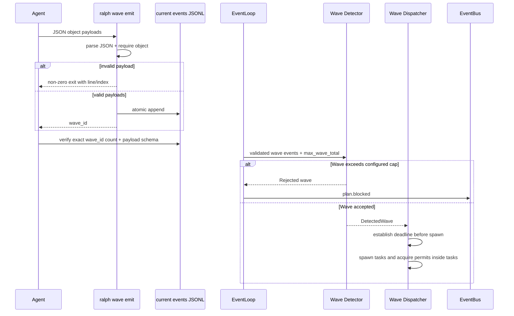

# 修复 ce-executor-isolated Wave 335 Fan-out 与 Partial Review 路由

> **Origin**：`docs/report/ce-debug-report-2026-06-10-wave-335-fanout.md`
> **Run**：`2026-06-10-003-refactor-event-loop-and-loop-runner-tests-split-plan-prime-badger`
> **Preset**：`builtin:ce-executor-isolated`
> **类型**：`fix`
> **状态**：已审查，待实施
> **审查结论**：原计划的 U3、U4、U8、U9、U11 存在实现或数据模型错误；本版已按源码真实控制流重写。

---

## 1. 摘要

第二轮 review wave 实际派发了 335 个 worker，而预期为 7 个。直接触发原因是：

```bash
printf '%s\n' $(cat payloads.jsonl)
```

shell command substitution 对 7 行 JSONL 做了 IFS word splitting，产生 335 个 token。当前 `ralph wave emit --payloads-stdin` 接受任意非空行，wave detection 也没有 fan-out 上限，因此这些 token 被写成一个 `wave_total=335` 的合法 wave。

本计划只把能够由源码强制保证的行为放入 P0 主链路：

1. CLI 只接受 JSON object payload。
2. wave detection 返回可区分的拒绝原因，并强制 `max_wave_total`。
3. dispatcher 在创建任何 worker 前处理拒绝结果和运行预算。
4. semaphore permit 获取移入 worker task，aggregate deadline 覆盖整个 wave 生命周期。
5. wave 异常进入 RecoveryResponder，且 runner 在 wave await 期间仍受全局 watchdog 控制。
6. emit 后按 CLI 返回的 `wave_id` 精确验真。
7. partial review 在进入 findings 决策前强制完整性门禁。

TUI 稀疏 buffer、额外 parse-error 文件、跨启动文件大小检测不属于解决本次 bug 的必要条件，移到后续工作。`build.done` 越权问题先取证，不在未证明 no-hat 旁路是根因时修改 EventOriginGuard。

---

## 2. 已验证根因

| 层 | 已验证事实 | 源码 |
|---|---|---|
| CLI | stdin 每个非空行直接成为 payload，没有 JSON object 校验 | `crates/ralph-cli/src/wave.rs:120-138` |
| Detection | `wave_total` 仅检查非零、index 范围和一致性，没有上限 | `crates/ralph-core/src/wave_detection.rs:68-159` |
| Dispatcher | 在计算 aggregate timeout 前，派发循环先 `acquire_owned().await` | `crates/ralph-cli/src/loop_runner/wave/dispatcher.rs:287-413` |
| Dispatcher | aggregate deadline 在所有 permit 都获取后才启动，无法覆盖排队批次 | `crates/ralph-cli/src/loop_runner/wave/dispatcher.rs:473-496` |
| Preset | JSONL 文件输入没有安全示例 | `presets/en/ce-executor-isolated.yml` 的 Wave Emission 段 |
| Preset | partial wave 可绕过 timeout 守则进入 Decision Logic | 同文件 All-Dimensions-Timeout 与 Decision Logic 段 |
| Event 文件 | payload 是 JSON 字符串；`wave_id`、`wave_total` 位于事件顶层 | `crates/ralph-cli/src/wave.rs:166-175` |
| Event 文件 | 实际文件由 `.ralph/current-events` 指向时间戳 JSONL | `crates/ralph-core/src/event_logger.rs:283-303` |

---

## 3. 目标与非目标

### 3.1 目标

- 任何输入路径都不能把非 JSON object 写成 wave payload。
- 超过配置上限的 wave 必须在启动 worker 前被拒绝。
- 拒绝原因必须可观测，不能被压缩成无语义的 `None`。
- aggregate deadline 必须覆盖 worker 排队、执行和结果收集全过程。
- isolated mode 的 scope 与单次逻辑事件边界必须覆盖 wave 路径。
- wave rejection、timeout 和 cancellation 必须进入 RecoveryResponder，并能 fail-closed。
- `max_runtime_seconds` 在 runner 等待 wave 时仍必须生效。
- review coordinator 必须使用返回的 `wave_id` 验证本次写入数量和 payload schema。
- partial review 不得发布 `review.failed`、`review.complete` 或 `review.passed`。

### 3.2 非目标

- 不修复或清理现场 `.ralph/` 运行时文件。
- 不为 TUI 实现稀疏 worker buffer。
- 不新增 `.ralph/parse_error.jsonl`。
- 不实现跨启动的 events 文件大小比较。
- 不在没有现场证据前改变所有 no-hat 事件的 origin 语义。
- 不把 prompt 遵循性测试伪装成 runtime BDD。

---

## 4. 关键设计决策

### KTD-1：CLI 两种 payload 输入统一执行 JSON object 校验

`--payloads` 和 `--payloads-stdin` 最终都经过同一个验证函数。每个 payload 必须：

1. 能被 `serde_json::from_str::<serde_json::Value>()` 解析。
2. `Value::is_object()` 为真。

数字、字符串、数组、截断 JSON 和普通 token 全部拒绝。不能只调用 `from_str`，否则 `10` 仍是合法 JSON。

### KTD-2：wave detection 使用 typed rejection

把 `Option<DetectedWave>` 改为能够携带原因的结果：

```rust
pub enum WaveRejection {
    ZeroTotal,
    TotalExceedsCap { actual: u32, cap: u32 },
    InconsistentTopic,
    InconsistentTotal,
    MissingIndex,
    IndexOutOfRange,
    Incomplete { expected: u32, actual: u32 },
    NoTargetHat,
    SequentialTarget,
}
```

具体类型可以根据现有 API 调整，但必须满足：

- caller 能区分超限与普通 incomplete。
- 单 wave API 和 all-wave API 不丢失拒绝原因。
- 纯检测函数不直接持有或调用 EventBus。

### KTD-3：fan-out cap 属于 EventLoopConfig

新增：

```yaml
event_loop:
  max_wave_total: 64
```

默认值为 64。检测使用 `wave_total > max_wave_total`，并在 partial policy 判断前执行。

当前配置系统没有 hat 级 `max_wave_total` 字段，因此本次采用 event-loop 级上限。不要在文档中声称该值来自 `HatConfig`。

### KTD-4：dispatcher 在启动 UI 和 worker 前处理拒绝

`process_events_from_jsonl_with_waves` 继续负责解析、origin 和 event policy。wave detector 返回：

```rust
pub struct WaveDetectionOutcome {
    pub accepted: Vec<DetectedWave>,
    pub rejected: Vec<RejectedWave>,
}
```

`handle_wave_events` 持有 `&mut EventLoop`，由它：

- 为 `TotalExceedsCap` 发布一次 `plan.blocked`。
- 写 runtime diagnosis recovery envelope。
- 不发送 `WaveStarted`。
- 不创建 TUI `WaveInfo`。
- 不启动任何 worker。

其他 malformed rejection 默认记录 warning/diagnostics，不应全部转成 `plan.blocked`，避免一个坏事件阻塞无关工作流。

### KTD-5：aggregate deadline 覆盖完整生命周期

现有实现先在主 task 中等待 permit，导致 timeout 计时开始得太晚。修复方式：

1. 在 worker 创建前计算 `raw_timeout` 和 runtime budget。
2. 若配置预算本身不可接受，立即拒绝，不启动 worker。
3. 为每个 event 立即 spawn task。
4. `acquire_owned().await` 移入 spawned task。
5. 从第一批 task 创建前建立 aggregate deadline。
6. deadline 到达时 abort 未完成 task，并为未报告 index 记录 synthetic failure。

不能仅把现有 `aggregate_timeout` 改成 `min(raw, cap)`，这无法覆盖 permit 排队时间。

### KTD-6：运行预算使用明确配置，不使用隐式 `/4`

`max_runtime_seconds / 4` 会让默认配置下的合法 wave 因一个任意比例被拒绝。新增独立配置：

```yaml
event_loop:
  max_wave_total: 64
  max_wave_runtime_seconds: 7200
```

默认值应通过现有 wave timeout 和常见规模验证后确定。实施前先用当前 builtin presets 计算：

```text
ceil(max expected wave total / concurrency) * timeout + 30
```

默认值必须覆盖所有 builtin preset 的已声明合法 wave。若团队不希望增加配置字段，则仅实施 `max_wave_total`，并把 aggregate timeout 重构为正确覆盖全生命周期；不要引入未经验证的 `/4` 策略。

### KTD-7：emit 验真必须绑定 wave_id

`ralph wave emit` stdout 返回唯一 `wave_id`。review coordinator 必须捕获该值，并解析 `.ralph/current-events` 指向的事件文件：

```bash
wave_id=$(cat payloads.jsonl | ralph wave emit review.wave.ready --payloads-stdin)
events_file=$(cat .ralph/current-events)
```

随后按 `.wave_id == $wave_id` 精确统计，不能使用 `tail -n "$expected_count"`。

payload schema 通过：

```jq
.payload | fromjson
```

解析，不能把 `dimension` 等业务字段当成事件顶层字段。

### KTD-8：不修改 no-hat origin 语义，先验证 build.done 实际路径

源码明确说明 agent output 解析出的事件可能天然没有 `hat`。全面拒绝 no-hat workflow topic 会破坏主事件入口。

本次只增加 characterization test 和现场证据检查，确认 `build.done` 是从：

- isolated agent JSONL；
- agent output parser；
- trusted event logger；
- 或其他路径

进入事件流。只有复现现有 scope/origin/policy 均未拒绝后，才新增最小代码修复。

### KTD-9：wave 路径必须服从 isolated invariant

当前 `process_events_from_jsonl_with_waves` 在调用普通事件的
`process_parse_result` 之前分离 wave events，导致 wave 跳过：

- `current_isolated_hat` 的 publish scope；
- 每次 isolated activation 只允许一个 business event 的边界。

修复后，wave partition 不能成为特权旁路：

- 每个 wave 必须能归属当前 isolated hat。
- wave topic 必须在当前 isolated hat 的 `publishes` 中。
- 同一次 isolated activation 的一个完整 wave 视为一个逻辑 business event。
- 同一 activation 产生多个不同 `wave_id` 时，只接受第一个完整合法 wave，其余以
  `isolated_multiple_business_emissions` 拒绝。
- wave 内 payload 数量不受 single-event 规则限制，而由 `max_wave_total` 独立控制。

### KTD-10：RecoveryResponder 是 wave 失败的第二终止路径

正常业务路径仍优先发布 `plan.blocked`，由 shipper/reporter 形成失败报告。RecoveryResponder
负责处理该路径本身未能收敛的情况：

- `TotalExceedsCap`：记录 `WaveDispatcher`、severity=Error、
  outcome=NotRetriable 的 envelope。
- aggregate timeout/cancellation：记录包含 wave_id、expected、completed、timeout 的 envelope。
- isolated scope rejection：记录 source hat、topic 和 rejection reason。
- 所有 envelope 必须通过 `EventLoop::record_recovery_envelope`，不能只写
  `recovery.jsonl`，否则 responder 内存状态不会更新。
- 有安全恢复目标时允许 Hard escalation；没有安全目标或重复耗尽时生成 Final
  `TerminationHint`。

### KTD-11：全局 runtime 必须能抢占 wave await

`max_runtime_seconds` 当前只在 iteration 边界由 `check_termination()` 检查。runner 等待
`handle_wave_events().await` 时不会重新检查，故它不是 watchdog。

修复后 runner 必须使用剩余 loop runtime 包围 wave future。全局 deadline 到达时：

1. 取消所有 queued/running worker。
2. 等待 worker 与 progress reporter 清理。
3. 记录 `wave_global_runtime_exceeded` recovery envelope。
4. 返回 `TerminationReason::MaxRuntime`，走统一 termination hooks/summary/diagnosis 流程。

worker task 必须由 cancellation token、`JoinSet::abort_all` 或等价 guard 持有；仅 drop
`JoinHandle` 会让 task detach，不能算取消。

---

## 5. 高层流程



---

## 6. 实施单元

### Phase 1：P0 机制修复

#### U1. 统一 JSON object payload 校验

**Goal**：拒绝导致本次事故的 word-split token，并确保两个输入模式行为一致。

**Files**：

- `crates/ralph-cli/src/wave.rs`
- 现有 `wave.rs` tests；仅在确有 CLI integration harness 时新增 `crates/ralph-cli/tests/wave_emit.rs`
- `crates/ralph-core/data/ralph-tools.md`（若其中记录 wave 命令语法）

**Approach**：

- 新增 `validate_payload(payload, source, index)`。
- 先保留现有 multiline footgun 提示，再 parse JSON。
- parse 成功后要求 `value.is_object()`。
- stdin 错误包含非空行序号和安全输入提示。
- `--payloads` 同样拒绝非 object，避免通过另一入口绕过。
- 在完成 CLI 语法变更后执行 `ralph wave emit --help`，并反向验证 `crates/ralph-core/data/*.md` 中源码引用和参数说明。

**Tests**：

- 7 行 object 成功，写入 7 条。
- 空行忽略。
- leading whitespace object 成功。
- `10`、`"text"`、`[]`、`placeholder`、截断 object 全部失败。
- `--payloads` 与 stdin 使用相同规则。
- 模拟 word-splitting token 序列时不写入任何事件。
- 失败必须保持原子性：前一行合法、后一行非法时，events 文件不增长。

**Verification**：

```bash
rtk cargo test -p ralph-cli wave
rtk cargo run -p ralph-cli -- wave emit --help
```

#### U2. typed wave rejection 与 max_wave_total

**Goal**：任何超过 cap 的 wave 在启动 UI/worker 前被明确拒绝。

**Files**：

- `crates/ralph-core/src/config/loop_config.rs`
- `crates/ralph-core/src/wave_detection.rs`
- `crates/ralph-core/src/lib.rs`
- `crates/ralph-cli/src/loop_runner/wave/dispatcher.rs`

**Approach**：

- 新增 `EventLoopConfig.max_wave_total`，默认 64。
- 将 detector 从 `Option` 改为 typed outcome。
- `detect_all_wave_events_with_policy` 返回 accepted 与 rejected。
- cap 检查在 incomplete/partial 检查前。
- `handle_wave_events` 发布一次结构化 `plan.blocked`：

```json
{
  "reason": "wave_total_exceeds_cap",
  "wave_id": "...",
  "actual": 335,
  "cap": 64
}
```

- 同一 wave 的 335 个 event 只能产生一个 rejection 和一个 blocked 事件。

**Tests**：

- 7/64、64/64 accepted。
- 65/64、335/64、`u32::MAX` rejected。
- 200/335 partial 仍优先得到 `TotalExceedsCap`。
- zero total 与 no target hat 保留独立 rejection。
- 多 wave batch 中一个超限、一个合法时，合法 wave 仍执行。
- cap rejection 不产生 `WaveStarted`，不调用 backend。

**Verification**：

```bash
rtk cargo test -p ralph-core wave_detection
rtk cargo test -p ralph-cli wave
```

#### U3. 重构 dispatcher deadline 和 semaphore 生命周期

**Goal**：aggregate timeout 覆盖 permit 排队和 worker 执行全过程。

**Files**：

- `crates/ralph-cli/src/loop_runner/wave/dispatcher.rs`
- 相关 loop runner tests

**Approach**：

- 在 spawn 前计算 aggregate timeout。
- permit acquisition 移入 `tokio::spawn`。
- 保存可 abort 的 task handles。
- aggregate deadline 在第一个 task spawn 前建立。
- deadline 到达后 abort remaining tasks，等待 join 清理。
- 未报告 worker 记录 synthetic failure。
- 避免等待 `progress_handle` 永不结束：abort worker 后确保所有 sender 被 drop。
- 使用 `wave.events.len()` 表示实际创建的 worker 数；`wave.total` 仅表示协议预期总数。partial wave 不得为不存在的 event 创建 task。

**预算决策门**：

- 先盘点所有 builtin preset 的 `concurrency`、`timeout` 和最大预期 wave。
- 若引入 `max_wave_runtime_seconds`，补 config/default/serde/test。
- 若不引入新字段，保留现有公式，但确保 deadline 从 wave 开始即生效。
- 禁止实现 `max_runtime_seconds / 4`。

**Tests**：

- concurrency=2、4 个 worker：只允许 2 个同时执行。
- 后续 worker 等 permit 的时间计入 aggregate deadline。
- 超时后 queued 和 running task 全部被取消。
- progress reporter 正常退出。
- partial wave 只 spawn `events.len()` 个 task。
- `wave.total=335` 即使绕过 U2，也在 deadline 前不会出现主 task 按批次阻塞。

**Verification**：

```bash
rtk cargo test -p ralph-cli wave_dispatcher
```

#### U4. isolated wave scope + RecoveryResponder + 全局 watchdog

**Goal**：消除 wave 对 isolated scope 和 iteration-boundary recovery 的旁路。

**Files**：

- `crates/ralph-core/src/event_loop/mod.rs`
- `crates/ralph-core/src/event_loop/loop_state.rs`
- `crates/ralph-cli/src/loop_runner/runner.rs`
- `crates/ralph-cli/src/loop_runner/wave/dispatcher.rs`
- `crates/ralph-core/src/diagnosis/` 中现有 responder/envelope 测试
- `crates/ralph-core/src/event_loop/tests/`
- `crates/ralph-cli/src/loop_runner/tests.rs`

**Approach A：isolated scope parity**：

- wave partition 前或 wave 专用 validation 中应用当前 `current_isolated_hat`。
- 检查 current hat 是否能 publish wave topic。
- 按 `wave_id` 分组后把一个 wave 计为一个逻辑 business emission。
- 同 activation 的第二个不同 wave 拒绝，并发布 isolation diagnostic。
- 不复用普通路径“只保留第一条 event”的实现，因为那会把合法 wave 截成 partial wave。

**Approach B：recovery 闭环**：

- U2 cap rejection、U3 aggregate timeout、isolated wave rejection 都构造
  `RecoveryDiagnosisEnvelope`。
- 必须调用 `event_loop.record_recovery_envelope(...)`。
- 同时发布结构化 `plan.blocked`，正常路由优先。
- 为同一 wave 使用稳定 retry key，避免 335 条 event 生成 335 个 finding。
- runner 在下一 termination check 消费 responder Final hint。
- 若 `plan.blocked` 已正常传播到 `report.done` 并终止，recovery finding 标记为
  recovered，不再升级。

**Approach C：runner watchdog**：

- 在调用 `handle_wave_events` 前计算：

```text
remaining = max_runtime_seconds - event_loop.state().elapsed()
```

- 使用 `tokio::select!` 或 `timeout_at` 同时等待 wave completion 和 global deadline。
- U3 提供显式 cancellation handle/guard，确保 timeout branch 能 abort 并 join worker。
- global deadline 分支返回 `TerminationReason::MaxRuntime`，不能继续执行
  default-publishes、missing-event gate 或下一 iteration。
- stop/restart signal 如已有异步通知能力，一并接入；否则至少保证 global runtime 和
  external interrupt 可取消 worker。

**Tests**：

- isolated review-coordinator 发一个 7-event wave：作为一个逻辑 business event 接受。
- isolated review-coordinator 发两个不同 wave_id：第二个拒绝，不启动其 backend。
- isolated executor 发 `review.wave.ready`：scope rejection，不启动 backend。
- cap rejection 只产生一个 recovery finding，retry key 包含 wave_id。
- aggregate timeout 进入 responder，并包含 completed/expected。
- responder 有安全目标时产生 Hard action；重复耗尽时产生 Final hint。
- `plan.blocked` 正常收敛后 finding 标记 recovered。
- loop 剩余 runtime 小于 wave timeout 时，全局 deadline 抢占 wave，返回 MaxRuntime。
- watchdog 触发后 queued/running worker 与 progress reporter 全部结束，无 detached task。

**Verification**：

```bash
rtk cargo test -p ralph-core isolated_wave
rtk cargo test -p ralph-core drift_integration
rtk cargo test -p ralph-cli wave_recovery
rtk cargo test -p ralph-cli wave_global_runtime
```

#### U5. wave_id 精确验真辅助能力

**Goal**：提供可靠的机器校验，避免 prompt 中脆弱的 `tail | grep` 逻辑。

**首选设计**：扩展 `ralph wave emit` 的成功输出或增加机器可读模式，使 agent 无需手写解析事件文件。

可选方案：

```bash
ralph wave emit ... --payloads-stdin --output json
```

输出：

```json
{"wave_id":"w-...","topic":"review.wave.ready","count":7,"events_file":".ralph/events-...jsonl"}
```

若本次不新增 CLI 参数，则 preset 使用当前 stdout `wave_id`，并以 `.ralph/current-events` 解析当前文件。

**Files**：

- `crates/ralph-cli/src/wave.rs`
- `crates/ralph-core/data/ralph-tools.md`
- `presets/en/ce-executor-isolated.yml`

**精确校验逻辑**：

```bash
events_file=$(cat .ralph/current-events)
jq -e --arg id "$wave_id" --argjson expected "$expected_count" '
  [. | select(.wave_id == $id)] as $events
  | ($events | length) == $expected
  and all($events[];
    .topic == "review.wave.ready"
    and .wave_total == $expected
    and ((.payload | fromjson) |
      (.dimension | type == "string")
      and (.changed_files | type == "array")
      and (.task_id | type == "string")
      and (.task_key | type == "string")
    )
  )
' "$events_file"
```

实施时可把 jq 程序改成单独脚本或 Rust 子命令，避免在 preset 中维护复杂 shell。不得使用 `tail -n "$expected_count"`。

**Tests**：

- expected=7、实际同 wave_id=7：通过。
- expected=7、实际同 wave_id=335：失败。
- 文件尾部还有其他 wave：不影响结果。
- payload 是字符串化 object：`fromjson` 后验证成功。
- payload 缺字段或不是 JSON：失败。
- `current-events` 指向时间戳文件时读取正确文件。

**Verification**：

```bash
rtk cargo test -p ralph-cli wave
rtk cargo run -p ralph-cli -- wave emit --help
```

### Phase 2：Partial review 与 preset 加固

#### U6. synthesizer 完整性门禁

**Goal**：partial review 只能进入 `plan.blocked`，不能进入 findings 决策。

**Files**：

- `presets/en/ce-executor-isolated.yml`
- 能够覆盖真实 runtime 路径的现有 scenario/tests

**Approach**：

- `Completeness Check` 必须位于 `Decision Logic` 前。
- 使用本次 wave 的 correlation metadata，不统计整个文件中同 topic 的总数。
- `received < expected` 时发布：

```json
{
  "reason": "dimension_reviewers_failed_to_converge",
  "details": {
    "expected": 7,
    "received": 4,
    "missing_dimensions": ["..."]
  }
}
```

- 不允许发布 `review.passed`、`review.failed` 或 `review.complete`。

**重要限制**：

当前 `aggregate: wait_for_all` 的 timeout 行为没有在 Rust event loop 中实现为可验证状态机，主要由 agent instructions 驱动。实施者必须先确认 aggregator 收到的 prompt 是否包含足够 correlation metadata。若 runtime 不提供 expected/received/wave_id，则先补 runtime metadata，不能仅增加一段 grep 指令后宣称机制已修复。

**Tests**：

- runtime 层能构造 4/7 aggregator 输入时，验证只允许 `plan.blocked`。
- 若测试框架无法执行 agent decision，则测试 prompt metadata 注入和 event policy guard，不写“agent 必然遵循”的伪 BDD。
- 7/7 仍进入正常 Decision Logic。

#### U7. JSONL 文件输入安全示例

**Goal**：消除本次 shell 反模式。

**Files**：

- `presets/en/ce-executor-isolated.yml`
- `crates/ralph-core/data/ralph-tools.md`

**必须包含**：

```bash
# 正确
cat payloads.jsonl | ralph wave emit review.wave.ready --payloads-stdin

# 错误：IFS word splitting
printf '%s\n' $(cat payloads.jsonl) | ralph wave emit review.wave.ready --payloads-stdin
```

同时要求：

- 捕获成功返回的 `wave_id`。
- 调用 U5 的机器可读验真。
- 验真失败时发布 `work.failed` 并停止，不更新 scratchpad 成功状态。

测试以 U1/U5 的 CLI integration 为主。preset 文本检查只能作为 lint，不能替代 runtime 测试。

#### U8. last_reviewed_sha 原子写入与回读

**Goal**：禁止写入失败后继续宣称成功。

**Files**：

- `presets/en/ce-executor-isolated.yml`
- 如已有 agent-doc helper，优先复用，不新增跨平台 sed 方言

**Approach**：

- 优先使用仓库已有结构化/原子文件更新 helper。
- 若必须使用 shell，采用临时文件 + rename 或跨平台工具。
- 写入后精确读取并比较 SHA。
- 失败时发布 `work.failed` 并停止本次 review emission 后续记账。
- 不创建 `.bak` 临时文件残留。

**Tests**：

- 替换已有字段。
- 字段不存在时只追加一次。
- 回读值不符时失败。
- 写权限失败时不记录成功。

### Phase 3：build.done 路径取证

#### U9. characterization：定位 executor build.done 绕过路径

**Goal**：先复现，再决定是否需要代码修复。

**Files**：

- `crates/ralph-core/src/event_loop/tests/origin_guard.rs`
- `crates/ralph-core/src/event_loop/tests/ce_executor.rs`
- 必要时 `crates/ralph-cli/src/loop_runner/tests.rs`

**Approach**：

分别构造：

1. isolated executor 直接写 trusted JSONL，事件带 `hat=executor`。
2. isolated executor 直接写 trusted JSONL，事件无 hat。
3. agent output parser 产生的 no-hat `build.done`。
4. event policy `topic_deny_rules` 开启和关闭。

记录事件经过：

- isolated scope enforcement；
- origin guard；
- topic deny policy；
- bus publication

的实际结果。

**Decision gate**：

- 若现有 isolated scope 已拒绝，则报告中的 5 条只存在于 history/原始文件，不代表进入 EventBus；不修改 EventOriginGuard。
- 若 agent output parser 路径确实绕过当前 hat scope，则在 parser/active-hat attribution 层补 provenance，而不是维护 `build.done/test.done/lint.done` topic 黑名单。
- 只有无法可靠归属 source hat 时，才设计 no-hat workflow policy；该设计需要单独 plan。

---

## 7. 后续工作

以下项目不阻塞本次 bug 修复：

- TUI 大 wave 的稀疏展示。推荐使用 `HashMap<u32, IterationBuffer>` 或显式 slot-to-worker 映射，不能用紧凑 Vec 破坏 worker identity。
- malformed event 指标接入现有 `DiagnosticsCollector`/`errors.jsonl`。现有 `EventReader` 已返回 `MalformedLine` 并发布 `event.malformed`，无需再造根目录 `parse_error.jsonl`。
- 运行中 truncation 检测。应基于当前 resolved events path、文件 identity 和 `EventReader.position` 检测 `len < position`，不能跨 session 比较全局文件大小。
- `ce-executor`、`ce-executor-wave` 的同类 preset 审计。
- 若 U9 证明存在通用 no-hat provenance 缺陷，另立 origin attribution 设计。

---

## 8. 风险与缓解

| 风险 | 严重度 | 缓解 |
|---|---|---|
| JSON object 强校验影响依赖纯字符串 payload 的 wave | 中 | 搜索所有 `ralph wave emit` 使用点；若确有合法字符串 wave，改为 topic schema 驱动，而不是静默放宽 |
| detector API 改动影响调用方 | 中 | 一次性更新 lib exports、unit tests 和 dispatcher；typed rejection 保持纯函数边界 |
| task 内获取 permit 后，取消/关闭路径复杂 | 高 | 使用 deterministic paused-time tests，覆盖 queued/running/aborted sender 生命周期 |
| wave recovery 与正常 `plan.blocked` 路由重复升级 | 中 | 使用稳定 retry key；正常失败报告收敛后显式标记 recovered |
| global watchdog drop future 后 worker 变成 detached task | 高 | dispatcher 暴露 cancellation guard，并测试 abort + join；禁止仅 drop JoinHandle |
| isolated single-event 规则错误截断合法 wave | 高 | 一个 wave 按逻辑事件计数，先完整分组再做 activation boundary 检查 |
| max_wave_total=64 误伤合法 wave | 低 | 审计 builtin presets；字段可覆盖 |
| aggregate runtime 默认值选择错误 | 中 | 先盘点配置；无法证明时不新增 `/4` cap |
| prompt 完整性门禁仍可能被 agent 忽略 | 中 | 尽量把 correlation metadata 与拒绝逻辑下沉 runtime；测试不夸大 prompt 保证 |
| build.done 根因与报告推断不同 | 中 | U9 characterization 先于任何 origin guard 修改 |

---

## 9. 验证策略

### 9.1 定向测试

```bash
rtk cargo test -p ralph-cli wave
rtk cargo test -p ralph-core wave_detection
rtk cargo test -p ralph-cli wave_dispatcher
rtk cargo test -p ralph-core isolated_wave
rtk cargo test -p ralph-cli wave_recovery
rtk cargo test -p ralph-cli wave_global_runtime
rtk cargo test -p ralph-core origin_guard
```

### 9.2 必需集成覆盖

- word-split token 输入：CLI 非零退出，events 文件不增长。
- 335 个合法 JSON object 直接进入事件文件：detector 拒绝，只产生一个 blocked 信号，不启动 backend。
- 一个合法 wave 与一个超限 wave 同批：合法 wave 继续执行。
- concurrency-limited workers：排队时间计入 aggregate deadline。
- isolated hat 的一个合法 wave 被视为一个 business emission；第二个 wave 被拒绝。
- 非授权 isolated hat 不能通过 wave 路径发布其他 hat 的 topic。
- cap、aggregate timeout 和 isolated rejection 都进入 RecoveryResponder。
- `plan.blocked` 正常收敛时 recovery 不重复升级；无法收敛时可生成 Final hint。
- global max runtime 能在 `handle_wave_events().await` 期间抢占，并清理所有 worker。
- wave_id 精确验真：335/7 mismatch 必须失败。
- partial review：缺失维度不能产生 review terminal event。

BDD/Cucumber 场景必须执行真实 runtime 路径。纯 grep preset YAML 的检查应放 lint/unit test，不得标记为 BDD。

### 9.3 Smoke

```bash
rtk cargo test -p ralph-core smoke_runner
rtk cargo run -p ralph-e2e -- --mock
```

手工 dogfood：

1. 运行一次 `builtin:ce-executor-isolated` 小型任务。
2. 确认 wave 数量与选择维度一致。
3. 确认机器输出中的 wave_id、count 和 resolved events file 一致。
4. 确认 TUI 未出现超限 wave，因为 rejection 发生在 `WaveStarted` 前。
5. 模拟 partial dimension results，确认只走 `plan.blocked`。
6. 模拟 wave aggregate timeout，确认 `recovery.jsonl`、responder 状态和最终失败报告一致。
7. 把 loop 剩余 runtime 调小于 worker timeout，确认以 `MaxRuntime` 退出且无遗留 worker。

### 9.4 完成门

按仓库要求，在声明完成前运行：

```bash
./scripts/run-tests.sh
```

若 nextest 不可用，使用脚本提供的 fallback。另跑：

```bash
rtk cargo test -p ralph-core smoke_runner
```

---

## 10. 实施顺序

1. **U1**：统一 JSON object 校验，立即封堵现场触发方式。
2. **U2**：typed rejection + `max_wave_total`，形成硬上限。
3. **U3**：重构 deadline/semaphore，修复兜底机制本身。
4. **U4**：补齐 isolated wave scope、RecoveryResponder 与全局 watchdog。
5. **U5**：wave_id 精确验真或机器可读输出。
6. **U6-U8**：partial review 和 preset 使用闭环。
7. **U9**：build.done characterization，根据结果决定是否另立修复。
8. 完成定向测试、smoke、mock E2E 和全量测试。

里程碑：

- **M1（U1-U2）**：335 wave 无法启动。
- **M2（U3-U4）**：wave 不再绕过 isolated/recovery，且全局 runtime 可抢占。
- **M3（U5-U8）**：emit 可精确验真，preset 不再制造或掩盖错误 wave。
- **M4（U9）**：build.done 问题有可复现结论，不再基于推断修改 origin guard。

---

## 11. 文档与项目同步

### 11.1 ralph tools 文档

修改 `ralph wave emit` 参数或输出后：

- 更新 `crates/ralph-core/data/ralph-tools.md`。
- 复核其中全部 `*.rs:NN-MM` 引用。
- 运行 `ralph wave emit --help`。

### 11.2 Preset 同步

本次只修改现有 `ce-executor-isolated` 内容，不新增、删除或重命名 builtin preset，因此不需要修改 manifest 的 embedded 列表或 zsh builtin 名称补全。

只有在用户可见 description 确实变化时，才同步：

- `presets/manifest.yml`
- `crates/ralph-cli/src/presets.rs`
- `presets/index.json`
- `scripts/ralph-zsh-plugin.zsh`

如修改 zsh 脚本，按仓库规则安装并验证。修改 `CLAUDE.md` 或 `AGENTS.md` 时，两者必须保持完全一致。

### 11.3 任务登记

按项目规范，在 `.ralph/tasks/` 为实施单元建立 code task，但不得手工修改 `.ralph/agent/tasks.jsonl` 等运行时状态文件。

---

## 12. 完成标准

- 非 object payload 无法通过任一 wave emit 输入模式。
- `wave_total > max_wave_total` 在任何 UI/backend 副作用前被拒绝。
- rejection 原因在 API、日志和测试中可区分。
- aggregate deadline 覆盖排队与执行全过程。
- wave 路径执行与普通事件等价的 isolated scope，并把一个完整 wave 视为一个逻辑 business event。
- 同一 isolated activation 的第二个 wave 被拒绝且不启动 backend。
- wave cap、scope rejection、aggregate timeout 与 global timeout 均通过
  `record_recovery_envelope` 进入 RecoveryResponder。
- 正常 `plan.blocked` 路由失败时 RecoveryResponder 能升级到 Final termination hint。
- `max_runtime_seconds` 能在 wave await 期间抢占，并以统一 MaxRuntime 终止流程退出。
- watchdog 终止后不存在 queued/running detached worker。
- 335/7 emit mismatch 能按 wave_id 检出。
- partial review 无法进入 findings terminal decision。
- build.done 是否真的进入 EventBus 有 characterization test 结论。
- 定向测试、smoke test、mock E2E 和仓库全量测试通过。
