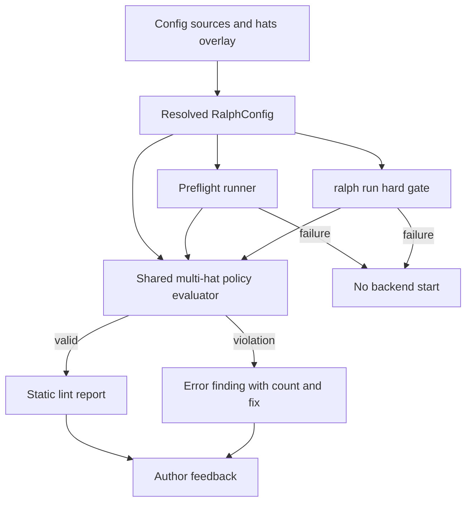
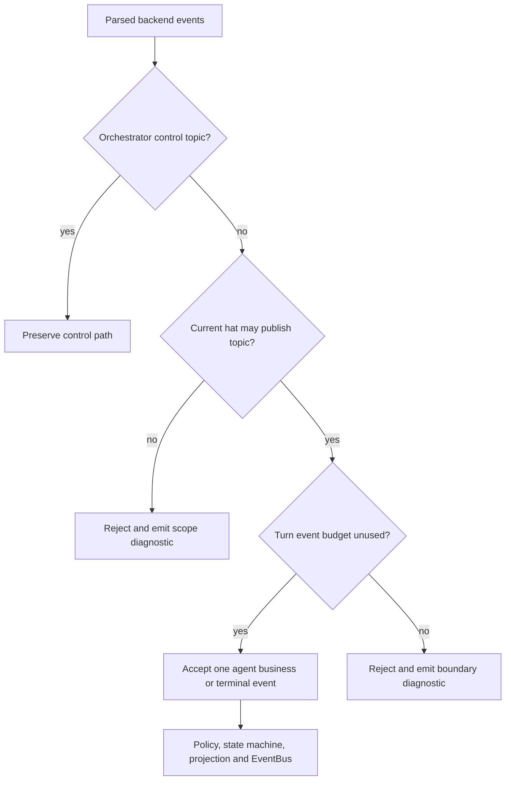
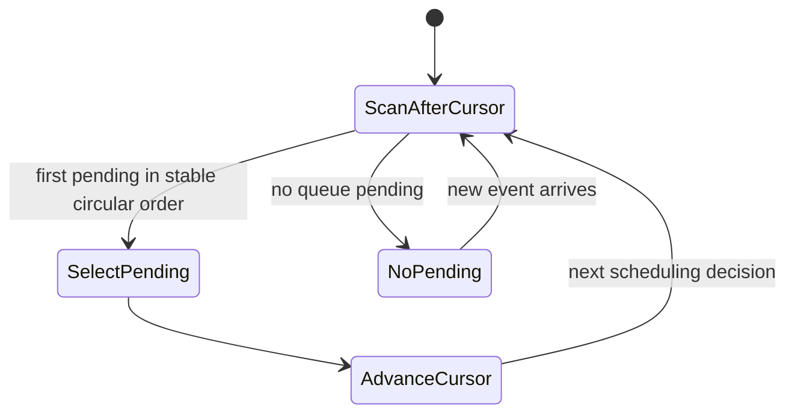
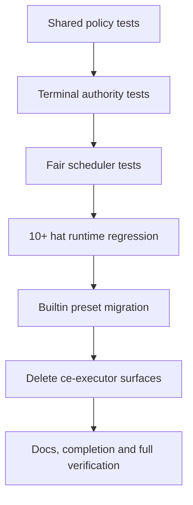

# feat: Enforce isolated mode for complex multi-hat presets

## Summary

为含 4 个及以上 hat 的 preset 建立不可豁免的 isolated execution policy，并以共享规则同时驱动静态 lint、preflight 和运行硬门禁。在迁移全部复杂内置 preset、删除旧 `ce-executor` 入口前，先修复 isolated 终态权限绕过和字典序调度饥饿，再以 10+ hat 的真实 runtime 场景形成发布回归门。

---

## Problem Frame

当前 coordinator mode 会把多个 active hat 的指令和事件放入同一 backend 上下文。复杂 topology 中，这会扩大角色混淆、跨 hat 发布和错误推进工作流阶段的概率。现有 isolated mode 能从执行上下文上隔离 hat，但仍有两个机制缺口：completion topic 被归为 system event 后绕过 `publishes` 校验；`EventBus::next_hat_with_pending()` 固定选择 `BTreeMap` 中字典序最靠前的 pending hat，持续回流时可能永久饿死其他 hat。

仅修改内置 preset 不能防止新配置重现问题。需要把固定阈值变成核心配置策略，并让 authoring lint、显式 preflight 与 `ralph run` 启动路径共同执行同一规则。迁移还涉及 preset manifest、embedded registry、公开索引、补全、现行文档和大量以旧名称为输入的测试，必须作为一次原子契约变更处理。

---

## Requirements

### Multi-Hat Policy And Gates

- R1. `hats` 配置项总数不超过 3 时，允许 coordinator 或 isolated mode；达到 4 时必须显式配置 isolated mode。
- R2. hat 计数包含 aggregate、observer、concurrent worker 及其他特殊 hat，不根据可达性、运行阶段或 backend 调整。
- R3. 缺省 execution mode 等价于 coordinator；显式 coordinator 与缺省 coordinator 在超阈值时均必须失败。
- R4. 规则不得提供配置、环境变量、测试开关或隐藏兼容豁免。
- R5. 该规则不允许配置豁免、环境变量豁免或隐藏兼容开关。
- R6. Preset 静态 lint 必须产生 error finding。
- R7. Preflight 必须独立执行同一规则并拒绝启动 loop。
- R8. Lint 与 preflight 必须复用同一规则定义。
- R9. 错误必须包含实际 hat 数、coordinator 上限和 isolated 修复方向。
- R10. 所有 embedded preset 必须经过超阈值策略测试，新增复杂 preset 不得绕过门禁。

### Builtin Migration And Removal

- R11. `autoresearch`、`ce-executor-wave`、`code-assist`、`debug`、`merge-loop`、`pdd-to-code-assist` 和 `review` 必须显式迁移到 isolated mode。`review` 是规划时经用户确认补入 origin 枚举的遗漏项。
- R12. `ce-executor-isolated` 保持 isolated，并成为原 `ce-executor` 场景的唯一现行入口。
- R13. 删除 `ce-executor` 的实际配置、manifest、公开索引、registry 和 shell completion。
- R14. `builtin:ce-executor` 必须明确解析失败，不提供 alias 或映射。
- R15. 所有现行指南、示例、模板和测试输入迁移到 `ce-executor-isolated`；历史归档保持事实记录。
- R16. 迁移不得主动改变 topology、业务 topic 协议和职责划分；仅修正 isolated 单-hat 执行暴露的共享上下文依赖。

### Isolated Runtime Hardening

- R17. Agent 发布的 completion promise、review verdict、report completion 等终态 topic 不得作为 system event 绕过当前 hat 的 `publishes` 权限。
- R18. 未声明终态 topic 的 hat 发布时必须被拒绝并产生可诊断记录。
- R19. 一个 isolated backend turn 最多接受一个获授权的业务或 agent 终态事件；追加 completion 不得绕过单事件边界。
- R20. 真正由 orchestrator 产生的控制事件必须与 agent 终态事件区分。

### Fair Isolated Scheduling

- R21. 多个 isolated hat 同时 pending 时必须无饥饿。
- R22. 相同 pending 状态和调度历史必须产生相同选择。
- R23. 持续回流的 hat 不能垄断执行，其他 pending hat 必须在有限轮次内运行。
- R24. 公平调度不得改变 direct target、aggregate 等待条件或 wave worker 并行模型。

### Regression Gate

- R25. 新增至少 10 个 hat 的 isolated 端到端集成场景，验证每轮仅执行目标 hat 且 authority 一致。
- R26. 回归覆盖线性流、分支汇合、aggregate、wave、失败恢复、human guidance 和合法终止。
- R27. 包含非法终态发布，证明非授权 hat 无法提前完成 loop。
- R28. 包含持续回流的多个 pending hat，证明调度无饥饿且顺序确定。
- R29. 每个迁移 preset 通过配置加载、lint、preflight 和 topology reachability。
- R30. 含 wave 或 aggregate 的迁移 preset 必须通过真实 runtime path，不允许仅做配置文本断言。

---

## Key Technical Decisions

- **单一策略函数返回结构化违规信息：** 在 `ralph-core` 定义固定上限及纯函数策略结果，lint、preflight 和 run gate 只负责把同一结果适配为各自 finding/check/error，避免阈值和错误文本分叉。
- **策略基于解析后的完整配置：** 在 core config 与 hats overlay 完成合并后计数，确保 `-c`、`-H builtin:*` 和文件 hats source 的有效配置口径一致；不从 YAML 文本推断“是否显式”以外的 topology。
- **显式 isolated 通过枚举值判断：** 默认值和显式 coordinator 均解析为 `Coordinator` 并失败；只有 `HatExecutionMode::Isolated` 通过。需求只要求 isolated 必须显式，因此无需为 enum 增加来源追踪字段。
- **Agent 事件与 orchestrator 控制事件分开分类：** completion promise 从 isolated system allowlist 移除，接受顺序统一为“控制事件豁免”或“当前 hat authority 校验 + 单业务事件预算”。`human.*`、取消和恢复等内部控制路径保持既有路由。
- **公平性状态属于 EventBus 调度器：** 在 pending 队列所有者中保存上次获选 hat 的游标，按注册 hat 的稳定排序从游标后轮转。引入只读 `peek_next_hat_with_pending(&self)` 与有副作用 `select_next_hat_with_pending(&mut self) -> Option<HatId>`；EventLoop 的实际选择返回 owned `HatId`，preview/has-pending 不推进游标。
- **direct target 不享有调度垄断特权：** target 只决定事件进入哪个 pending queue；一旦多个 queue pending，仍由相同轮转策略选择，以满足持续回流下的有限等待。aggregate 和 wave 条件在事件入队前后保持现有语义。
- **机制加固先于 preset 迁移：** 先通过 authority 与 scheduler 的单元/集成测试，再修改 embedded preset。这样迁移失败可归因于 topology 对 isolated 语义的真实依赖，而不是底层机制缺口。
- **旧 preset 直接删除而非兼容：** 所有现行代码和文档迁移到 `ce-executor-isolated`；保留 `ce-executor-lite` 等不同产品实体，但其 `source`、说明或示例不得再宣称依赖已删除的 builtin。

---

## High-Level Technical Design

### Validation Flow

静态 lint、显式 preflight 和 run hard gate 使用同一个 evaluator；差异只在 finding stage、展示格式和退出行为。

### Isolated Event Authority

Completion promise 与其他 agent 终态 topic 均走 authority 和 turn budget；只有可证明由 orchestrator 生成的控制事件走豁免路径。

### Deterministic Fair Scheduling

稳定顺序来自已注册 hat ID；历史由上次实际选中的 hat 表示。相同 pending 状态与相同游标产生相同选择，且任一持续 pending hat 最多等待其他 pending hat 各执行一次。

### Delivery Gates

---

## Implementation Units

### U1. Add The Shared Multi-Hat Isolation Policy

- **Goal:** 建立固定阈值的纯策略定义，并让 config、lint 与 runtime contract 能消费统一的结构化结果。
- **Requirements:** R1-R5。
- **Dependencies:** None。
- **Files:**
  - `crates/ralph-core/src/config/workflow_guards.rs`
  - `crates/ralph-core/src/config/error.rs`
  - `crates/ralph-core/src/config/ralph_config.rs`
  - `crates/ralph-core/src/preset_lint/mod.rs`
  - `crates/ralph-core/src/preset_lint/finding_id.rs`
  - `crates/ralph-core/src/preset_lint/tests/run_preset_lint.rs`
  - `crates/ralph-core/src/runtime_contract.rs`
- **Approach:**
  - 将 coordinator 上限定义为 core 常量，并提供接收 hat 总数与 `HatExecutionMode` 的纯 evaluator。
  - 违规结果携带实际数量、允许上限和要求的 mode，供 config error、lint finding 与 preflight check 渲染。
  - 在 `run_preset_lint()` 中增加始终为 error 的规则，不受 `LintStrictness` 降级影响。
  - 保持 `HatExecutionMode::default()` 为 coordinator；不自动改写配置。
- **Execution note:** 先写阈值边界和特殊 hat 计数测试，再接入 lint/runtime contract。
- **Patterns to follow:** `preset_lint::validate_ownership_and_coordinator()` 的确定性 finding 排序；`RuntimeContractFinding` 的稳定 ID、details 和 action hint 结构。
- **Test scenarios:**
  - Covers AE1. 3 个 hat、缺省 mode：evaluator 与 lint 均通过 multi-hat policy。
  - Covers AE2. 4 个 hat、缺省 mode：返回 error，details 中实际数量为 4、上限为 3。
  - Covers AE3. 4 个 hat、显式 coordinator：返回与缺省 coordinator 相同类型的 error。
  - 4 个 hat、显式 isolated：policy 无 finding。
  - Covers AE4. 8 个配置项中包含 aggregate、observer 和 concurrent worker：计数仍为 8。
  - Default 与 Strict lint 对该违规均保持 error，不受 ownership severity 规则影响。
  - Runtime contract 聚合后保留稳定 finding ID、`source=lint`、`stage=authoring` 和修复提示。
- **Verification:** 单一 evaluator 的边界测试完整；不存在第二份阈值常量或独立计数算法。

### U2. Enforce The Policy In Explicit Preflight And Run Startup

- **Goal:** 无论用户运行 `ralph preflight` 还是直接 `ralph run`，超阈值 coordinator 配置都在 backend 启动前失败。
- **Requirements:** R3, R6-R10。
- **Dependencies:** U1。
- **Files:**
  - `crates/ralph-core/src/preflight.rs`
  - `crates/ralph-cli/src/preflight.rs`
  - `crates/ralph-cli/src/loop_runner/preset_lint_gate.rs`
  - `crates/ralph-cli/src/loop_runner/tests.rs`
  - `crates/ralph-core/tests/scenarios/preset_static_lint.yml`
  - `crates/ralph-core/tests/scenarios.rs`
- **Approach:**
  - 新增命名明确的 native preflight check，内部调用 U1 evaluator；保证 `--check` 可单独选择且 human/JSON 输出一致。
  - run startup 继续通过 strict preset lint gate 阻断，复用 U1 产生的 error finding，不另写阈值判断。
  - 确认检查发生在 backend executor 构造/启动前，失败不创建部分 loop 执行状态。
  - 覆盖 config+hats overlay 后的有效配置，避免 base config 与 `-H` 分别合法但合并后超阈值时漏检。
- **Patterns to follow:** `PresetTopologyCheck`、`PresetContractCheck` 的 preflight adapter；`PresetLintGateError` 的 human 与 JSON artifact 输出。
- **Test scenarios:**
  - Covers F1 / AE2. `ralph preset check` 对 4-hat 缺省 coordinator 返回 error finding。
  - Covers F2 / AE2. `ralph preflight` 对同一配置返回 failed check，JSON 和 human message 均含数量、上限和 isolated 指引。
  - Covers F2 / AE3. 显式 coordinator 同样失败。
  - 3-hat 缺省 coordinator 在 lint、preflight 和 run gate 均不因本规则失败。
  - 4-hat isolated 在三条入口均通过本规则。
  - Base config 2 hats + hats overlay 2 hats：合并后按 4 计数并拒绝。
  - Run gate 失败时 mock backend spawn 计数保持 0，且 lint artifact 包含稳定 finding。
- **Verification:** 三个用户入口对相同 resolved config 得到一致结论；直接运行无法绕过显式 preflight。

### U3. Close Isolated Terminal Authority And Turn-Budget Bypasses

- **Goal:** 让 agent completion 与其他终态事件接受当前 isolated hat 的 topic authority 和单事件边界检查，同时保留 orchestrator 控制事件。
- **Requirements:** R17-R20。
- **Dependencies:** U1。
- **Files:**
  - `crates/ralph-core/src/event_loop/mod.rs`
  - `crates/ralph-core/src/event_origin.rs`
  - `crates/ralph-core/src/event_loop/rejection.rs`
  - `crates/ralph-core/src/event_loop/tests/origin_guard.rs`
  - `crates/ralph-core/src/event_loop/tests/completion_honored.rs`
  - `crates/ralph-core/src/event_loop/tests/payload_types.rs`
  - `crates/ralph-core/tests/scenarios/isolated_boundary_violation.yml`
  - `crates/ralph-core/tests/scenarios/isolated_multi_hat.yml`
  - `crates/ralph-core/tests/scenarios.rs`
- **Approach:**
  - 把“orchestrator control topic”收敛为共享分类函数，避免 `process_parse_result()` 内继续以 completion promise 字符串作为 system-event 豁免。
  - 当前 isolated hat 的所有 agent business/terminal topic 先检查 `registry.can_publish()`，通过后共同消耗一次 turn event budget。
  - 未授权终态与超额终态分别形成 scope/boundary rejection，并保留 hat、topic、reason 供 diagnostics 使用。
  - 检查 `human.*`、`loop.cancel`、targeted `task.resume`、恢复和 abandon 路径，确保真正内部生成事件不被 agent authority 规则误伤。
- **Execution note:** 先增加当前绕过行为的失败测试，再调整分类与处理顺序。
- **Patterns to follow:** 既有 `event_origin::is_jsonl_control_topic()`、`ContractRejection` 归一化和 `event.scope_violation` 诊断路径。
- **Test scenarios:**
  - Covers F4 / AE5. 未声明 completion promise 的 isolated hat 直接发布 completion：事件拒绝、loop 未完成、诊断包含 hat 与 topic。
  - 已声明 completion promise 的合法终止 hat 单独发布 completion：事件进入既有 completion safety checks。
  - Hat 先发布合法业务事件再追加 completion：仅首个事件接受，completion 产生 boundary diagnostic。
  - Hat 先发布 completion 再追加业务事件：completion 消耗预算，业务事件被拒绝。
  - 未声明 review/report terminal topic 的 hat 发布该 topic：按 scope violation 拒绝，不因 topic 被 state machine 标记 terminal 而放行。
  - Orchestrator 发布 `task.resume`、`human.guidance` 和 `loop.cancel`：既有恢复、人工交互和取消流程继续工作。
  - Coordinator mode 的 completion 与 scope 行为保持原样。
- **Verification:** 所有 agent 终态均有可追踪 publisher；控制事件回归通过；单 turn 不可能接受两个 agent 推进事件。

### U4. Implement Deterministic Starvation-Free Isolated Scheduling

- **Goal:** 用稳定轮转替代字典序首项选择，保证相同历史下确定、持续 pending 下有限等待。
- **Requirements:** R21-R24。
- **Dependencies:** U1。
- **Files:**
  - `crates/ralph-proto/src/event_bus.rs`
  - `crates/ralph-core/src/event_loop/loop_state.rs`
  - `crates/ralph-core/src/event_loop/mod.rs`
  - `crates/ralph-core/src/event_loop/tests/active_hat.rs`
  - `crates/ralph-core/src/event_loop/tests/payload_types.rs`
  - `crates/ralph-cli/src/loop_runner/tests.rs`
  - `crates/ralph-bench/src/`
- **Approach:**
  - 在 EventBus 中维护“上次实际选择的 pending hat”游标，按 `BTreeMap` 稳定顺序循环扫描下一非空 queue。
  - 新增 `peek_next_hat_with_pending(&self) -> Option<&HatId>` 与 `select_next_hat_with_pending(&mut self) -> Option<HatId>`，避免内部可变性。
  - `EventLoop::next_hat()` 改为可变选择并返回 owned `HatId`；`triggered_hat`、runner、benchmark、scenario 和测试调用点同步迁移。
  - `has_pending_events()` 改用无副作用的 `EventBus::has_pending()`；UI preview 和诊断查询只调用 peek。
  - 选中后再由既有 prompt 路径消费目标 queue；queue 清空、hat 注册及无 pending 状态不得造成游标失效或 panic。
- **Execution note:** 用表驱动测试锁定 exact scheduling sequence，再改 EventLoop 调用点。
- **Patterns to follow:** EventBus 对 pending queue 的所有权；`active_hat` 测试中 prompt-selected hat 与 display preview 一致性约束。
- **Test scenarios:**
  - Covers F3 / AE6. A、B 同时 pending 且 A 每次执行后自回流：序列必须让 B 在下一轮或固定有限轮次内执行。
  - A、B、C 持续 pending：完整轮次按稳定循环顺序执行，每个 hat 恰好一次后再回到首个。
  - 相同注册 hats、pending queues 和游标历史重复运行：选择序列完全一致。
  - 仅一个 pending hat：连续选择同一 hat，不引入空转。
  - 游标指向已清空 queue：从其后继续扫描并正确 wrap around。
  - Direct-target event 与普通订阅 event 同时 pending：两者进入各自 queue，调度仍公平。
  - `has_pending_events()`、preview 和多次 peek 不改变下一次实际选择。
  - Coordinator mode 多 hat pending 仍返回 `ralph`；human-only pending fallback 行为不变。
- **Verification:** 对 N 个持续 pending hats，任一 hat 的等待上界不超过 N-1 次其他选择；现有 coordinator、aggregate 和 wave tests 无回归。

### U5. Add The Complex Isolated Runtime Regression Harness

- **Goal:** 用 10+ hat 的真实 event-loop 场景共同验证 prompt isolation、authority、fairness、aggregate、wave、恢复、human guidance 与合法终止。
- **Requirements:** R25-R28。
- **Dependencies:** U3, U4。
- **Files:**
  - `crates/ralph-core/src/event_loop/tests/isolated_complex_regression.rs`
  - `crates/ralph-core/src/event_loop/tests/mod.rs`
  - `crates/ralph-core/src/event_loop/tests/replay_light_integration.rs`
  - `crates/ralph-cli/src/loop_runner/tests.rs`
  - `crates/ralph-cli/src/loop_runner/wave/dispatcher.rs`
  - `crates/ralph-core/tests/fixtures/isolated-complex-topology.jsonl`
- **Approach:**
  - 构造至少 10 个 hat 的共享 topology fixture：入口规划、两个并行分支、aggregate 汇合、验证、失败恢复、human guidance consumer、reporter 和唯一 completion owner。
  - Core scenario/replay 验证 parser、prompt isolation、authority、fairness、aggregate 与 completion；只使用现有 YAML expected 字段，额外 selected-hat/prompt/rejection 断言写成 Rust integration helpers，不扩展通用 scenario DSL。
  - CLI loop-runner 集成测试复用同一 topology 配置，单独验证真实 wave dispatcher、worker execution 与 result merge；不声称 core YAML harness 能执行 CLI wave runtime。
  - 在同一场景中插入未授权 completion 尝试和高频自回流 queue，验证 loop 继续并最终由合法 owner 终止。
  - Aggregate 必须等待预期 result 数量后才激活；CLI wave test 必须证明 worker results 通过真实 merge 路径进入该等待条件。
- **Execution note:** 先建立最小 10-hat happy path，再逐项加入非法终态、回流、恢复与 human guidance，保持失败定位清晰。
- **Patterns to follow:** `isolated_multi_hat.yml` 的多轮 mock、`isolated_boundary_violation.yml` 的 rejection、现有 wave dispatcher tests 和 replay-light fixture。
- **Test scenarios:**
  - Covers AE8. 完整场景按预期 topology 合法完成，completion 仅来自授权 reporter/closer hat。
  - 每个 backend turn 的 prompt 只包含目标 hat instructions 和其 pending events，不包含其他 hat instructions。
  - 分支 fan-out 后两个 branch hats 都获得执行；其中一个持续自回流也不能饿死另一个。
  - Wave dispatcher 产生多 worker payload，worker results 全部合并，aggregate 在未收齐前不运行、收齐后只运行一次。
  - 中间 hat 发布未授权 completion：产生诊断且后续 branch/aggregate/reporter 仍运行。
  - 某阶段返回失败事件：恢复事件 direct-target 回原 hat，恢复后 workflow 从正确阶段继续。
  - `human.guidance` 在目标 turn 注入并被消费，不泄漏为其他 hat 的业务发布权限。
  - 重放同一 fixture 两次：selected-hat 与 accepted-event 序列相同。
- **Verification:** Core 集成覆盖 parser、scope gate、EventBus、scheduler、aggregate 和 completion guard；CLI 集成覆盖真实 wave dispatch/merge；两者均不存在 source-only assertion。

### U6. Migrate All Builtin Presets At Or Above The Threshold

- **Goal:** 在 runtime 加固通过后，将全部当前复杂 builtin preset 显式切换 isolated，并建立长期 embedded gate。
- **Requirements:** R10-R12, R16, R29-R30。
- **Dependencies:** U2, U3, U4, U5。
- **Files:**
  - `presets/en/autoresearch.yml`
  - `presets/en/ce-executor-wave.yml`
  - `presets/en/code-assist.yml`
  - `presets/en/debug.yml`
  - `presets/en/merge-loop.yml`
  - `presets/en/pdd-to-code-assist.yml`
  - `presets/en/review.yml`
  - `crates/ralph-cli/src/presets.rs`
  - `crates/ralph-core/src/preset_validator.rs`
  - `crates/ralph-cli/src/preflight.rs`
- **Approach:**
  - 为列出的 preset 增加显式 `event_loop.execution_mode: isolated`；保持 topic、trigger、publishes、terminal、aggregate 和 concurrency 定义不变。
  - 扫描原指令中依赖“同一 turn 同时扮演多个 hat”或一次发布多个业务阶段的内容，只修正违反 isolated 单事件语义的指令。
  - 更新 embedded strict-lint test：直接断言每个 hat 数达到阈值的 preset mode 为 isolated，不允许按 preset 名称维护 exemption。
  - 为每个迁移 preset 建立统一 contract matrix：parse、validate、strict lint、preflight、topology reachability；wave/aggregate preset 增加 runtime-path case。
- **Patterns to follow:** `ce-executor-isolated.yml` 的 execution mode 与 per-hat prompt语义；`test_all_embedded_presets_pass_strict_lint()` 的全 manifest 遍历。
- **Test scenarios:**
  - 每个目标 preset 解析后 `execution_mode == Isolated`，hat 数与迁移前一致。
  - Embedded manifest 中任一 4+ hat preset 若删除 isolated 配置，统一 gate 失败并报告 preset 名及 hat 数。
  - 3-hat `research` 保持可选择 coordinator，不被强制迁移。
  - `review` 的 4 hats 被纳入策略与迁移矩阵。
  - `autoresearch`、`debug` 既有 topology exemption 不得豁免 multi-hat policy；其真实 topology 问题仍按现有独立机制处理。
  - `ce-executor-wave` 的 wave dispatch/aggregate runtime test 在 isolated 下完成。
  - 其他包含 aggregate 的迁移 preset 在等待条件满足前不选择 aggregator。
  - 每个 preset 的 completion owner 在 `publishes` 中显式声明 completion promise。
- **Verification:** 全部 embedded presets 满足固定策略；迁移前后 topology/event protocol diff 仅含 execution mode 与必要 instruction 修正。

### U7. Remove The Legacy `ce-executor` Builtin And Migrate Current References

- **Goal:** 删除旧 builtin 的全部现行入口，让 `ce-executor-isolated` 成为唯一完整 CE executor preset。
- **Requirements:** R13-R16。
- **Dependencies:** U6。
- **Files:**
  - `presets/en/ce-executor.yml`
  - `presets/zh/ce-executor-zh.yml`
  - `presets/schemas/ce-executor.yml`
  - `presets/manifest.yml`
  - `presets/index.json`
  - `crates/ralph-cli/src/presets.rs`
  - `scripts/ralph-zsh-plugin.zsh`
  - `scripts/validate-preset-authoring.sh`
  - `presets/README.md`
  - `presets/COLLECTION.md`
  - `crates/ralph-cli/src/preset_templates.rs`
  - `crates/ralph-core/src/runtime_contract.rs`
  - `crates/ralph-core/src/preset_validator.rs`
  - `crates/ralph-core/tests/scenarios/ce_executor_recovery.yml`
  - `crates/ralph-core/tests/fixtures/recovery/ce-executor-rejected-event-recovery.jsonl`
- **Approach:**
  - 删除 canonical English YAML、manifest 与 `PRESETS` entry，不保留 lookup alias；公开 index 和 shell completion 同步移除。
  - 将 `presets/zh/ce-executor-zh.yml` 重命名为 `presets/zh/ce-executor-isolated-zh.yml`，配置改为 isolated，命令示例和中英文一致性测试改指 isolated。
  - 将 `presets/schemas/ce-executor.yml` 重命名为 `presets/schemas/ce-executor-isolated.yml`，并更新 reference-copy 注释和 `presets/COLLECTION.md` 的映射。
  - 将仍代表现行完整 executor 的测试、示例和模板 source 改为 `ce-executor-isolated`；内部 scratchpad key、历史 fixture payload 或报告文件名只有在它们构成现行用户入口时才重命名。
  - 保留 `ce-executor-lite` 作为独立模板，但清理其指向已删除 builtin 的 source metadata 或改指 isolated。
  - 增加负向 registry/CLI 测试，确保旧名称明确 unknown，而不是 fallback 或模糊匹配到新名称。
- **Patterns to follow:** manifest 与 `PRESETS` 的 build-time 一致性检查；`get_preset()` 的 unknown preset 错误路径；现有 `compadd` completion 结构。
- **Test scenarios:**
  - Covers F5 / AE7. `get_preset("ce-executor")` 返回 None/unknown，`get_preset("ce-executor-isolated")` 成功。
  - `ralph run -H builtin:ce-executor` 在 backend 启动前明确失败，消息不宣称 alias。
  - `ralph preset list` 和 `presets/index.json` 只展示 isolated 入口。
  - Build manifest 与 `PRESETS` 数组一致，删除 YAML 后 build 不再尝试 embed。
  - zsh builtin completion 不包含旧值且包含 isolated；completion loader 正常加载。
  - authoring validation script 不再遍历旧 preset。
  - `validate-preset-authoring.sh` 中两处静态 preset 名单均完成迁移。
  - 中文参考 preset 与 schema reference copy 均只使用 isolated 名称，中英文一致性测试继续通过。
  - 现行 recovery/runtime fixtures 继续验证同一行为，必要时仅更新 source label。
  - `docs/achieved/**`、历史 report 与历史 fixture 中作为事实记录的旧名称不被批量改写。
- **Verification:** 对非历史目录执行旧名称搜索，只剩独立模板名、内部兼容数据或经人工判定应保留的事实性文本；不存在可执行旧 builtin 入口。

### U8. Synchronize Documentation, Agent Instructions, And User-Facing Examples

- **Goal:** 让现行文档准确描述固定阈值、isolated runtime 语义和新 preset 名称，并保持项目要求的镜像文件一致。
- **Requirements:** R15。
- **Dependencies:** U6, U7。
- **Files:**
  - `CLAUDE.md`
  - `AGENTS.md`
  - `docs/guide/configuration.md`
  - `docs/guide/harness-extensions.md`
  - `docs/reference/troubleshooting.md`
  - `presets/README.md`
  - `presets/COLLECTION.md`
  - `scripts/ralph-zsh-plugin.zsh`
- **Approach:**
  - 文档说明 3-hat coordinator 上限、4+ 必须显式 isolated、无豁免和错误修复方式。
  - 补充 isolated 终态 authority、每 turn 单 agent 推进事件和公平轮转语义，避免用户依赖旧字典序行为。
  - 更新 builtin preset 列表与所有现行命令示例；最后将 `CLAUDE.md` 同步到 `AGENTS.md` 并验证内容完全一致。
  - 按项目约束安装更新后的 zsh plugin 到当前用户目录并验证补全加载；该安装是实施时的必要操作，不把用户主目录文件纳入 git。
- **Patterns to follow:** `docs/guide/harness-extensions.md` 的配置矩阵和 runtime 说明；troubleshooting 的错误、修复、链接结构。
- **Test scenarios:**
  - Test expectation: none -- 文档内容由 U1-U7 的自动化测试和以下一致性检查支撑。
  - 文档中的 builtin 列表与 manifest/registry 一致。
  - `CLAUDE.md` 与 `AGENTS.md` byte-for-byte 一致。
  - 现行文档与脚本不再建议 `builtin:ce-executor`。
  - zsh completion 加载后候选包含所有现行 builtin，且 `builtin:*` 继续使用 `compadd`。
- **Verification:** 文档、registry、manifest、index 和 completion 对 preset 名称及 multi-hat policy 的描述一致。

### U9. Run Full Contract, Smoke, And CLI Verification

- **Goal:** 执行完整质量门禁，确认策略、runtime hardening、preset 迁移与删除没有跨 crate 回归。
- **Requirements:** R29-R30。
- **Dependencies:** U1-U8。
- **Files:**
  - `scripts/run-tests.sh`
  - `crates/ralph-core/tests/fixtures/`
  - `crates/ralph-core/tests/scenarios/`
- **Approach:**
  - 先执行受影响 crate 的 focused tests，再执行 workspace test 与 doctest。
  - 运行 replay-based smoke tests，至少包含新增复杂 isolated fixture 和既有 isolated fixtures。
  - 对 preset list/check、preflight、旧名称失败、新名称成功与 completion 执行 CLI 冒烟。
  - 运行格式化与 clippy；检查没有 ephemeral diagnostics、临时 preset 或用户目录安装文件进入 git。
  - 若 `ralph tools` 未发生变更，不修改其 skill 文档；若实施中意外触及相关命令或引用源码，按项目反向验证规则同步并逐条复核。
- **Patterns to follow:** `scripts/run-tests.sh` 的 nextest + doctest 路径及 serial fallback；mock/replay 测试优先于 live API。
- **Test scenarios:**
  - Workspace 非 E2E 测试和 doctest 全部通过。
  - `ralph-core` smoke runner 覆盖新旧 isolated fixtures。
  - Mock E2E 在 CI-safe 模式通过相关过滤场景。
  - Strict preset contract 对全 embedded manifest 通过。
  - CLI 对 4-hat coordinator preflight 非零、4-hat isolated 为零、旧 builtin unknown、新 builtin 可加载。
  - `cargo fmt` 无 diff，clippy 无新增 warning。
- **Verification:** 所有项目规定门禁通过，git diff 仅包含计划内源码、preset、测试与文档，不包含运行时或 ephemeral 文件。

---

## Acceptance Examples

- AE1. 3 个 hat 且未声明 execution mode：lint、preflight 与 run gate 不因 multi-hat policy 失败。
- AE2. 4 个 hat 且未声明 execution mode：lint 与 preflight 均以 error 拒绝并报告实际数量 4。
- AE3. 4 个 hat 且显式 coordinator：仍被拒绝。
- AE4. 8 个 hat 中多数为 aggregate/observer：计数仍为 8，必须 isolated。
- AE5. 当前 isolated hat 未声明 completion promise：completion 被拒绝，loop 保持打开并产生带 hat/topic 的诊断。
- AE6. A、B 同时 pending 且 A 持续自回流：B 在有限轮次内运行，重复执行得到相同序列。
- AE7. 请求 `builtin:ce-executor`：明确 unknown；registry 仅保留 `ce-executor-isolated`。
- AE8. 10+ hat 复杂 fixture：无指令泄漏、无越权发布、无饥饿，并由授权 hat 合法终止。

---

## System-Wide Impact

- **Configuration contract:** 原本合法的 4+ hat coordinator 自定义 preset 将变为硬错误；这是需求明确要求的 breaking change。
- **Runtime scheduling:** isolated mode 从字典序优先改为历史相关的稳定轮转；依赖旧顺序的测试与隐式工作流需要改为显式 target 或 topology 约束。
- **Event authority:** completion promise 不再是 agent 的全局豁免 topic；所有合法 completion owner 必须在 `publishes` 中声明。
- **Preset ecosystem:** builtin registry、manifest、index、authoring scripts、templates、docs 和 shell completion 必须同版本发布。
- **Operations:** preflight 与 run gate 在 backend 启动前失败，不产生部分执行；错误及 diagnostics 可直接指向 isolated 修复。
- **Stakeholders:** preset 作者需要迁移自定义复杂 topology；operator 获得更早失败和更清晰诊断；维护者获得防止新增复杂 coordinator preset 的自动化门禁。

---

## Scope Boundaries

### In Scope

- 固定 3-hat coordinator 上限及不可豁免门禁。
- isolated agent terminal authority 和单事件边界。
- isolated pending-hat 公平确定调度。
- 全部当前 4+ hat embedded preset 的迁移，包括 `review`。
- 删除旧 `ce-executor` 现行 builtin 入口。
- 复杂 topology 的真实 runtime 回归与现行文档同步。

### Out Of Scope

- 不根据 topology 可达性、active hat 数或 hat 类型动态计算阈值。
- 不自动把 coordinator 配置改成 isolated。
- 不重写 EventBus pub/sub、wave worker 并行模型或 aggregate 协议。
- 不增加通用事件溯源、跨 loop 审计或新的持久化 scheduler 数据库。
- 不批量改写历史归档对 `ce-executor` 的事实记录。

### Deferred To Follow-Up Work

- 评估是否把公平调度策略开放为用户可配置选项；本计划固定为唯一安全策略。
- 清理与本次迁移无关的旧 preset 注释、schema reference copy 或大规模测试结构重构。

---

## Risks And Mitigations

- **内部控制事件误判为 agent 事件：** 先建立控制 topic 分类测试，再收紧 completion；覆盖取消、human、恢复和 abandon 路径。
- **调度查询意外推进游标：** 明确拆分 select 与 peek API，用 preview/has-pending 回归证明只读查询无副作用。
- **迁移 preset 暴露共享上下文依赖：** 机制测试先绿，再逐 preset 运行真实 topology；只修改违反单-hat turn 的指令，不重设计协议。
- **旧名称搜索产生过度替换：** 区分现行入口与历史事实；删除前按目录分类审计，不对 `docs/achieved/` 做机械替换。
- **大型 `presets.rs` 测试仍绑定旧名称：** 将通用 contract tests 参数化到 isolated preset，删除只验证旧 registry 存在性的测试，保留仍验证业务协议的覆盖。
- **preflight 与 run gate 报告漂移：** 所有 adapter 从共享 violation 结构生成消息，测试比较关键 details 而非复制全文。
- **复杂 scenario 变成脆弱脚本：** 使用稳定 selected-hat/event 序列与关键 invariant 断言，不锁定无关日志或完整 prompt 文本。

---

## Documentation And Operational Notes

- 发布说明需要标明这是 preset 配置 breaking change：4+ hat coordinator 将无法 lint、preflight 或启动。
- troubleshooting 应提供最小修复：在 `event_loop` 显式配置 isolated，并确保唯一终止 hat 声明 completion topic。
- 删除 `ce-executor` 后，现行用户命令统一为 `-H builtin:ce-executor-isolated`。
- shell completion 更新后按仓库要求安装到当前用户的 oh-my-zsh plugin 目录并验证加载，但不得提交用户目录文件。
- 计划实施不需要数据迁移或 rollout feature flag；门禁与 preset 迁移必须同一版本发布，避免新规则先使内置 preset 自身失效。

---

## Delivery Note

本计划在 U1+U2+U3 主线（游标算法、机制级 core 集成、CLI wave dispatch 集成）实施后交付审查发现三处交付缺口：游标清空后回退字典序首项、复杂 fixture 未触发真实 wave/aggregate/恢复/guidance、以及 clippy `deprecated_semver` 与 zsh completion 8/9 数组漂移。补完计划 `docs/plans/2026-06-11-006-fix-multi-hat-isolated-regression-gaps-plan.md` 在不修改 3-hat coordinator 上限、终态 authority、错误文本、coordinator fallback 行为的前提下，闭环了这三项缺口并恢复了 clippy 与 completion 数组一致性自动化门禁。本计划 status 字段在补完计划 U1+U2+U3+U4 全部通过验证后由 `active` 更新为 `completed`，并通过 `delivered_by` 引用补完计划。

---

## Sources And Research

- `docs/brainstorms/2026-06-11-multi-hat-isolated-mode-requirements.md`
- `docs/plans/2026-06-11-006-fix-multi-hat-isolated-regression-gaps-plan.md`
- `crates/ralph-core/src/config/workflow_guards.rs`
- `crates/ralph-core/src/config/ralph_config.rs`
- `crates/ralph-core/src/preset_lint/mod.rs`
- `crates/ralph-core/src/preflight.rs`
- `crates/ralph-cli/src/loop_runner/preset_lint_gate.rs`
- `crates/ralph-core/src/event_loop/mod.rs`
- `crates/ralph-core/src/event_loop/loop_state.rs`
- `crates/ralph-proto/src/event_bus.rs`
- `crates/ralph-core/tests/scenarios/isolated_multi_hat.yml`
- `crates/ralph-core/tests/scenarios/isolated_boundary_violation.yml`
- `crates/ralph-cli/src/presets.rs`
- `presets/manifest.yml`
- `docs/achieved/plan/2026-05-15-001-feat-isolated-hat-execution-mode-plan.md`
- `docs/achieved/plan/2026-06-11-001-feat-ce-executor-isolated-preset-plan.md`
