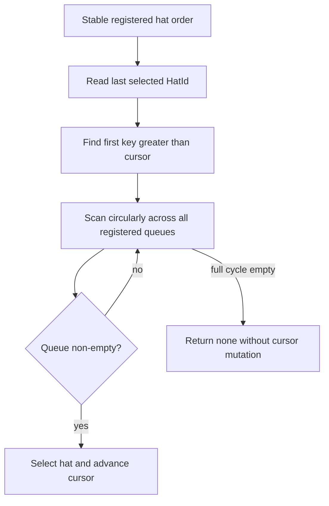
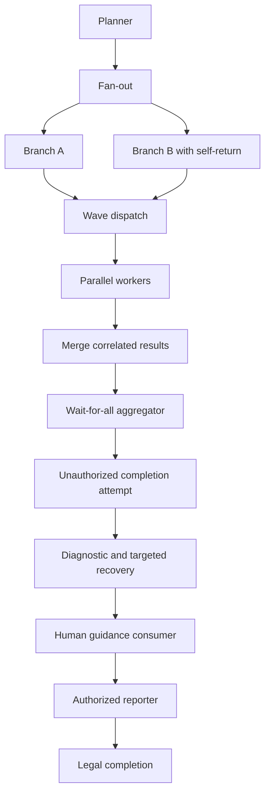

# fix: Close multi-hat isolated regression gaps

## Summary

补齐 multi-hat isolated policy 首轮实施遗留的交付缺口：修正游标队列清空后的公平轮转语义，以真实 wave、aggregate、恢复和 human guidance 路径重建 10+ hat 回归门，并修复 clippy 与 zsh completion 一致性问题。已完成的策略门禁、终态 authority、builtin preset 迁移和旧入口删除保持不变。

---

## Problem Frame

原计划 `docs/plans/2026-06-11-003-feat-multi-hat-isolated-policy-plan.md` 已实现固定阈值、lint/preflight/run 门禁、isolated 终态 authority、builtin 迁移和旧 `ce-executor` 删除，但交付审查发现三个未闭环点。

第一，`EventBus::select_next_hat_with_pending()` 仅在上次选择的 hat 仍处于非空 pending 子集时从其后轮转；一旦该队列被消费为空，代码退回字典序首项。这与“从完整稳定注册顺序中寻找游标后继”的设计不符，并会在动态清空、回流组合下破坏有限等待保证。

第二，现有 `isolated_complex_topology.yml` 是把 wave、aggregate、恢复和 human guidance 命名为普通线性 topic 的 happy path。它没有触发 wave dispatcher、`wait_for_all` aggregate、拒绝后的 `task.resume` 恢复或真实 `human.guidance` 注入，因而没有实现原需求 R25-R30 所要求的机制级回归门。

第三，新增的非 semver `#[deprecated(since = "U4")]` 导致 workspace clippy 失败，zsh builtin 候选与描述数组也存在 8 对 9 的数量漂移。测试套件通过并不足以满足项目交付门禁。

---

## Requirements

### Fair Scheduling

- R1. 调度游标必须锚定完整、稳定的注册 hat 顺序；上次选择的队列清空后，下一选择仍从该 hat 的后继开始循环扫描。
- R2. 游标指向已注销或不存在的 hat 时，行为必须确定且有明确降级规则，不得 panic 或依赖哈希迭代顺序。
- R3. 在队列动态清空、重新入队和持续自回流的组合下，任一持续 pending hat 的等待上界不得超过其他可调度 hat 的一个完整轮次。
- R4. `peek_next_hat_with_pending()`、pending 查询和 UI preview 不得推进或重置实际调度游标。

### Real Runtime Regression

- R5. 10+ hat 回归必须包含真实 fan-out，使至少两个 branch hat 在同一阶段同时 pending，而不是顺序 topic 链。
- R6. 回归必须通过真实 `concurrency > 1` wave detection、worker dispatch、result merge 路径产生带相同 `wave_id` 的结果。
- R7. 回归必须配置并验证真实 `aggregate.mode: wait_for_all`：结果未收齐时 aggregator 不激活，收齐后只激活一次。
- R8. 回归必须触发一次未授权终态或其他可恢复拒绝，验证诊断与 targeted `task.resume` 后工作流继续。
- R9. 回归必须注入真实 `human.guidance`，验证其进入目标 prompt、不会成为 agent 业务发布权限，并不会泄漏到非目标 hat。
- R10. 同一 fixture 或同一输入序列重复执行时，selected-hat、accepted-event 和最终 completion owner 序列必须一致。
- R11. 复杂场景只能由声明 completion topic 的唯一 hat 合法终止，非法终态不能提前结束 loop。

### Delivery Quality

- R12. Workspace clippy 必须通过；deprecated 元数据必须使用合法 semver 或移除不必要的 `since` 字段。
- R13. zsh builtin completion 的值与描述必须严格一一对应，并由自动化测试检查数量和顺序。
- R14. Workspace tests、doctests、isolated replay smoke、preset strict contract 和 CLI 冒烟必须全部通过。
- R15. 新测试必须证明真实运行路径，不允许以 source text、hat 名称或 topic 名称代替机制行为断言。

---

## Key Technical Decisions

- **游标在完整注册顺序中定位：** 调度选择遍历 `pending` 的完整稳定 key 顺序，从第一个严格大于 `last_selected` 的 key 开始并循环；扫描时跳过空队列。这样即使上次队列已清空，游标位置仍保留。
- **游标失效采用稳定 successor 语义：** 若上次 hat 已注销，仍以 `HatId` 排序位置寻找第一个更大的注册 key；不存在更大 key 时从首项 wrap。无需把游标改成数组索引，也无需在注册/注销时重写历史。
- **复杂回归分层但共享拓扑契约：** core 层负责 prompt isolation、authority、fair scheduling、aggregate、恢复和 guidance；CLI 层负责真实 wave worker dispatch 与 merge。两层使用同一 topic、hat 和 wave correlation 约定，避免各自构造不相关的“类似场景”。
- **不扩展通用 YAML scenario DSL 来伪装 CLI 能力：** 复杂状态和 selected-hat 序列在 Rust integration helper 中断言；CLI wave dispatcher 继续通过其真实测试 seam 使用可控 worker executor，避免启动 live backend。
- **质量门禁成为回归契约：** clippy 和 zsh 数组一致性增加窄测试，避免只在人工发布检查中发现。

---

## High-Level Technical Design

### Scheduler Selection

### Complex Regression Flow

Core integration verifies event-loop semantics through this flow；CLI integration owns the `E -> F -> G` worker lifecycle and feeds merged results back into the same aggregate contract.

---

## Implementation Units

### U1. Correct The Round-Robin Cursor Semantics

- **Goal:** 让动态清空或注销队列不会把调度退化为字典序首项，恢复原计划承诺的确定性有限等待。
- **Requirements:** R1-R4。
- **Dependencies:** None。
- **Files:**
  - `crates/ralph-proto/src/event_bus.rs`
  - `crates/ralph-core/src/event_loop/mod.rs`
  - `crates/ralph-core/src/event_loop/tests/active_hat.rs`
- **Approach:**
  - 选择算法基于完整 `BTreeMap` 顺序循环扫描，而不是先过滤为 non-empty 子集再寻找游标。
  - `last_selected` 保持 `HatId`，让已注销 cursor 仍可按 key 排序找到稳定 successor。
  - 保持 `select` 有副作用、`peek` 无副作用的 API 边界；不改变 coordinator 和 human-only fallback。
  - 校正文档注释，使“starvation-free”声明与实际算法、等待上界一致。
- **Execution note:** 先增加能稳定复现现有错误的失败测试，再修改选择算法。
- **Patterns to follow:** `EventBus` 的 `BTreeMap<HatId, Vec<Event>>` 稳定排序；现有 `three_hats_fair_rotation` 和 `peek_does_not_advance_cursor` 测试结构。
- **Test scenarios:**
  - Covers F3 / AE6. 上次选择 `beta` 后清空其队列，`alpha` 与 `gamma` 同时 pending：下一项必须是 `gamma`，不能退回 `alpha`。
  - Cursor 为 `gamma` 且 `gamma` 清空，`alpha` 与 `beta` pending：必须 wrap 到 `alpha`。
  - Cursor 对应 hat 已注销，较大 key 和较小 key 都 pending：选择排序上的后继；没有后继时 wrap。
  - A 每轮自回流、B/C 动态清空后重新入队：固定轮数内 B/C 都被选择，完整序列重复执行一致。
  - 多次 `peek`、`has_pending` 和 prompt preview 后，实际 `select` 结果与未查询时一致。
  - Coordinator mode 和仅 human event pending 的选择保持现有行为。
- **Verification:** 调度算法的实现、注释和表驱动序列测试共同证明游标即使不在 non-empty 子集中也不会丢失顺序位置。

### U2. Replace The Nominal Complex Fixture With A Real Core Runtime Scenario

- **Goal:** 让 core 回归实际执行 fan-out、aggregate、authority rejection、targeted recovery 和 human guidance，而非仅使用同名 topic。
- **Requirements:** R5, R7-R11, R15。
- **Dependencies:** U1。
- **Files:**
  - `crates/ralph-core/src/event_loop/tests/isolated_complex_regression.rs`
  - `crates/ralph-core/src/event_loop/tests/mod.rs`
  - `crates/ralph-core/src/event_loop/tests/replay_light_integration.rs`
  - `crates/ralph-core/src/event_loop/tests/active_hat.rs`
  - `crates/ralph-core/src/event_loop/tests/origin_guard.rs`
  - `crates/ralph-core/src/event_loop/tests/wave_results.rs`
- **Approach:**
  - 保留至少 10 个 hat，但把入口事件真正 fan-out 到两个 branch queue；其中一个 branch 自回流，用 selected-hat 序列验证公平性。
  - 为 aggregator 配置 `wait_for_all` 和明确 correlation；分阶段注入结果，断言部分结果时不激活。
  - 在汇合后由非 completion owner 尝试发布终态，断言拒绝诊断、loop 保持打开和 recovery event 定向回源 hat。
  - 通过 EventBus/LoopContext 注入真实 `human.guidance`，检查目标 prompt 内容和其他 hat 的隔离。
  - Rust helper 记录每轮选中的 hat、接受和拒绝的 topic、completion owner；同一 fixture 重放两次比较序列。
  - 修正 fixture 的实际 hat 数、注释、描述和断言，禁止“11-hat”与配置数量漂移。
- **Execution note:** 先把每个机制的失败断言加入 integration helper，再替换线性 fixture，避免仅让 happy path 继续变绿。
- **Patterns to follow:** `isolated_boundary_violation.yml` 的终态拒绝；`wave_results.rs` 的 `wait_for_all` 激活；`replay_light_integration.rs` 的 targeted recovery；`initialization.rs` 的 guidance prompt 注入。
- **Test scenarios:**
  - Covers AE8. 入口 fan-out 后两个 branch hat 同时 pending，持续回流分支不能阻塞另一分支。
  - Aggregator 在收到 `1/N` 结果时不激活，在收到 `N/N` 同一 correlation 结果后只激活一次。
  - 不同 correlation 或 wave ID 的旧结果不能满足当前 aggregate。
  - 非授权 hat 发布 completion：产生带 hat/topic 的诊断，targeted recovery 可见，loop 未终止。
  - Recovery turn 成功发布合法后续事件，流程继续到 reporter。
  - `human.guidance` 只进入预期目标 turn 的 prompt，不消耗业务事件预算，也不能被 agent 借作 publisher authority。
  - Reporter 是唯一 completion owner；最终 completion 通过现有 safety checks。
  - 重放两次得到相同 selected-hat、accepted-event、rejection 和 completion 序列。
- **Verification:** 测试断言读取运行时选择、pending queue、prompt、rejection 和 accepted events；不以 fixture 注释或 topic 名称推断机制已执行。

### U3. Exercise Real CLI Wave Dispatch And Aggregate Handoff

- **Goal:** 验证迁移 preset 所依赖的 wave worker 并行执行和结果 merge 确实能驱动 isolated aggregate，而不是由 core 测试直接向 bus 填充结果。
- **Requirements:** R6-R7, R10-R11, R15。
- **Dependencies:** U2。
- **Files:**
  - `crates/ralph-cli/src/loop_runner/wave/dispatcher.rs`
  - `crates/ralph-cli/src/loop_runner/wave/io.rs`
  - `crates/ralph-cli/src/loop_runner/tests.rs`
  - `crates/ralph-core/src/wave_detection.rs`
  - `crates/ralph-core/src/wave_tracker.rs`
- **Approach:**
  - 使用 dispatcher 现有 `WaveWorkerExecutor` seam 运行多个可控 worker，生成真实 worker events files。
  - 通过 `handle_wave_events()` 或等价生产编排入口执行 detection、并发限制、worker completion、merge 和 event-loop re-read。
  - worker 结果携带一致 `wave_id`、唯一 `wave_index` 和正确 `wave_total`；merge 后交给 U2 同形 aggregate 配置。
  - 分别覆盖全部成功、部分结果先到和 worker 失败合成事件；验证 aggregator 只在完整结果集后激活。
  - 不调用 live API 或真实外部 backend。
- **Patterns to follow:** dispatcher 的 paused-time controllable executor tests；`merge_wave_results_to_events_file` 的 synthetic failure coverage；`wave_results.rs` 的 aggregator prompt assertions。
- **Test scenarios:**
  - 三个 worker 在 concurrency 2 下分批执行，全部结果 merge 后 aggregator 激活一次。
  - 前两个 worker 完成而第三个仍 pending 时，event-loop re-read 不得提前激活 aggregator。
  - 一个 worker 失败时生成关联到同一 wave 的 synthetic result；完整结果计数满足后 aggregator 走失败处理而非永久等待。
  - 重复 `wave_index` 被归一化或拒绝时不应错误满足完整性条件。
  - 两个 wave ID 交错返回时，各自 aggregate 独立，不发生跨 wave join。
  - 非 wave 普通事件与 wave results 同批存在时，authority 和单 turn 预算保持现有约束。
- **Verification:** 测试经过生产 wave detection、dispatcher、events file merge 和 event-loop aggregate 激活链路；不存在直接向 bus 注入全部成功结果来替代 CLI runtime 的捷径。

### U4. Restore Delivery Gates And Completion Metadata Consistency

- **Goal:** 清除本次功能引入的静态质量回归，并将 completion 数组一致性纳入自动化门禁。
- **Requirements:** R12-R14。
- **Dependencies:** U1-U3。
- **Files:**
  - `crates/ralph-proto/src/event_bus.rs`
  - `scripts/ralph-zsh-plugin.zsh`
  - `crates/ralph-cli/src/presets.rs`
  - `docs/plans/2026-06-11-003-feat-multi-hat-isolated-policy-plan.md`
- **Approach:**
  - 将 deprecated `since` 改为 workspace crate 的合法 semver，或在兼容 API 不需要版本承诺时移除 `since`。
  - 删除 zsh 描述数组中无对应公开候选的 `merge-loop` 描述；保持 `compadd` 的 colon-value completion 方式。
  - 扩展 preset/completion 契约测试，同时解析候选数组和描述数组，断言长度、顺序及 public preset 映射一致。
  - 在所有补缺口完成后，将原计划 status 更新为 completed，并在其交付说明中引用本补完计划；不重写原计划 Implementation Units 为进度清单。
  - 按仓库要求安装更新后的 zsh plugin 到当前用户目录并验证 completion function 可加载，用户目录文件不进入 git。
- **Patterns to follow:** `test_index_json_entries_have_zsh_completion`；`docs/solutions/developer-experience/ralph-zsh-builtin-hat-completion-maintenance-2026-05-26.md`。
- **Test scenarios:**
  - Clippy 对 deprecated metadata 不再报告 `deprecated_semver`。
  - Completion 候选与描述数组数量相同且同位置语义匹配。
  - 所有 public preset 在 completion 中恰好出现一次；hidden `merge-loop` 不出现在候选或孤立描述中。
  - zsh 文件被 source 后 `_ralph_builtin_hats` 使用 `compadd` 并能返回现行 builtin 候选。
  - Workspace tests 和 doctests 全部通过；isolated complex、wave dispatcher、preset strict contract 和 replay smoke 均被完整门禁执行。
- **Verification:** 完整测试、doctest 和 clippy 均为零失败；git 状态不包含 diagnostics、临时 fixture、用户目录 plugin 或其他 ephemeral 文件。

---

## Acceptance Examples

- AE1. **Cursor queue cleared.**
  - **Given:** `beta` 是上次选择的 hat，其队列已清空，`alpha` 和 `gamma` 同时 pending。
  - **When:** isolated scheduler 选择下一 hat。
  - **Then:** 选择 `gamma`，保持完整注册顺序中的 successor 语义。

- AE2. **Real aggregate waits.**
  - **Given:** 一个三 worker wave 已 merge 两个同 wave ID 的结果。
  - **When:** event loop 重新读取 merged events。
  - **Then:** wait-for-all aggregator 不激活；第三个结果 merge 后才激活一次。

- AE3. **Recovery after unauthorized completion.**
  - **Given:** 非 completion owner 在复杂 isolated 流程中发布 completion。
  - **When:** authority gate 拒绝该事件。
  - **Then:** loop 保持打开，诊断和 targeted recovery 可见，最终仍由 reporter 合法完成。

- AE4. **Guidance stays control-plane only.**
  - **Given:** branch 恢复后收到 human guidance。
  - **When:** 构建目标 hat prompt 并处理下一业务事件。
  - **Then:** guidance 对目标可见但不授予 topic 发布权限，也不泄漏到其他 hat。

- AE5. **Release gates pass.**
  - **Given:** 所有补缺口改动完成。
  - **When:** 执行 workspace tests、doctests、clippy 和 completion 契约验证。
  - **Then:** 全部门禁通过，且 zsh 候选与描述一一对应。

---

## Scope Boundaries

### In Scope

- 修正现有 round-robin cursor 算法及其测试盲区。
- 用真实机制级测试替换名义上的复杂线性 fixture。
- 串联 core aggregate 与 CLI wave dispatch/merge 的集成回归。
- 修复本计划实施引入的 clippy 与 zsh completion 质量问题。

### Out Of Scope

- 不修改 3-hat coordinator 上限、共享 isolation policy 或错误文本。
- 不重新设计 terminal authority、origin guard 或单 turn event budget。
- 不改变 wave timeout、partial threshold、worker concurrency 或 aggregate 产品语义。
- 不恢复 `ce-executor` alias，不调整已迁移 builtin preset topology。
- 不增加通用 scenario DSL 对 CLI subprocess 的模拟能力。

### Deferred To Follow-Up Work

- 评估是否删除 deprecated `next_hat_with_pending()` 兼容 API；本计划只保证其元数据合法且不影响现行调用。
- 将 complex topology harness 抽象为跨 preset 的通用 contract suite；本计划优先建立正确、可维护的单一回归门。

---

## System-Wide Impact

- **Scheduler:** isolated 多 pending 场景恢复严格轮转语义；依赖错误字典序回退的隐式行为会改变，但这正是原需求禁止的行为。
- **Testing:** core 与 CLI 测试形成分层 runtime contract，后续 wave/aggregate 改动必须同时保持两层通过。
- **Contributor workflow:** clippy 恢复为可信发布门禁；completion 数组漂移会在测试阶段失败。
- **Operations:** 非授权终止、恢复和 guidance 在复杂拓扑中的组合行为获得可重复回归证据。

---

## Risks And Mitigations

- **复杂测试过度耦合完整日志：** 只断言 selected hat、pending 状态、关键 prompt 片段和 accepted/rejected event 序列，不锁定无关输出。
- **Core 与 CLI fixture 漂移：** 共享 topic、hat IDs、wave correlation 常量或 helper；测试分别验证职责边界，不复制两套独立拓扑。
- **公平性修复影响 preview：** 保持 peek/select 分离，并加入多次 preview 后实际选择不变的测试。
- **异步 wave 测试不稳定：** 复用 paused-time 和 controllable executor seam，不依赖 wall-clock sleep 或外部进程。
- **恢复场景被其他 guard 提前拦截：** 使用已存在且可诊断的 authority rejection 路径，明确断言拒绝来源和 targeted recovery 目标。

---

## Documentation And Operational Notes

- 若调度实现注释或用户指南仍描述字典序首项，必须同步为“基于完整注册顺序的 round-robin cursor”。
- 原计划只有在本计划全部门禁通过后才能标记 completed。
- zsh plugin 修改后按项目要求安装到 `~/.oh-my-zsh/plugins/ralph/ralph.plugin.zsh` 并验证加载，但该路径不是仓库产物。

---

## Sources And Research

- `docs/brainstorms/2026-06-11-multi-hat-isolated-mode-requirements.md`
- `docs/plans/2026-06-11-003-feat-multi-hat-isolated-policy-plan.md`
- `crates/ralph-proto/src/event_bus.rs`
- `crates/ralph-core/src/event_loop/mod.rs`
- `crates/ralph-core/src/event_loop/tests/wave_results.rs`
- `crates/ralph-core/src/event_loop/tests/replay_light_integration.rs`
- `crates/ralph-core/tests/scenarios/isolated_complex_topology.yml`
- `crates/ralph-cli/src/loop_runner/wave/dispatcher.rs`
- `crates/ralph-cli/src/loop_runner/wave/io.rs`
- `docs/solutions/developer-experience/ralph-zsh-builtin-hat-completion-maintenance-2026-05-26.md`
