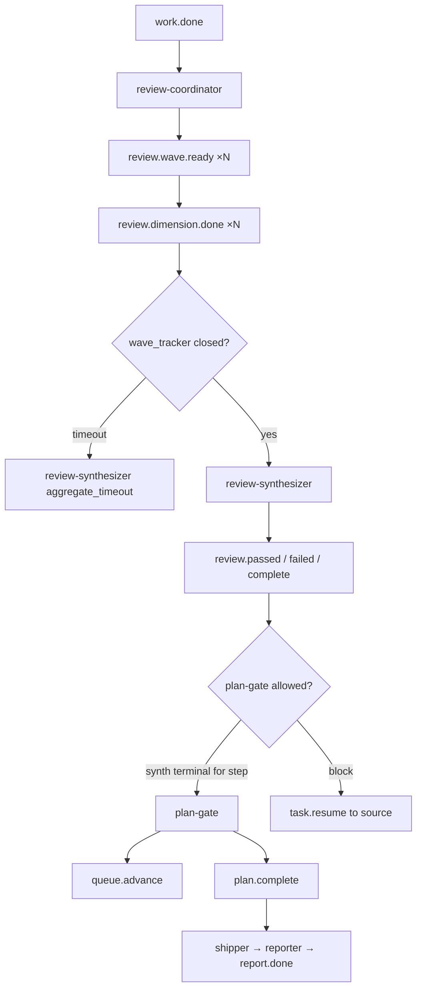
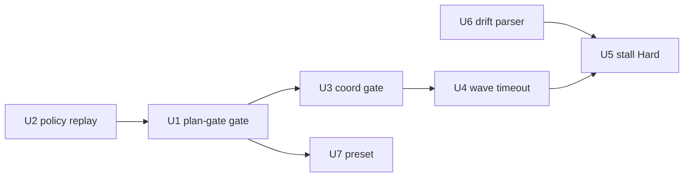

# 修复 ce-executor-isolated 闭环缺口

## Summary

`docs/report/2026-06-12-ce-executor-isolated-multi-run-diagnosis.md` 对 jolly-pine 与 autoresearch 两轮 worktree 产物对账后确认：**实现有进展，但 10-hat 流水线在 review 聚合与 plan 终态上多次被打穿**。`2026-06-11-002` 计划中的 U1–U4（语义门、wave 幂等、诊断路径、progress 对账）已部分落地，**未解决本次 P0 闭环问题**。

本计划在 **不改变 hat 数量、不迁移 `queue.advance` 接收者、不重写 EventBus** 的前提下，分三层修复：

1. **编排 + 基座硬门**：plan-gate 不得在 review 未终态时 `plan.complete`；`review.passed` / `review.failed` 必须过 schema。
2. **Wave 收不齐补偿**：缺维时走 `aggregate_timeout` 路径，而非无限 stall。
3. **观测与冒充防护**：消除 drift 误报；收紧 ralph hat 业务 topic。

## Problem Frame

### 现状

| 现象 | 影响 |
|------|------|
| Session B：`plan.complete` 早于 `review.failed` 6 分钟 | Fixer → 复审 → Shipper → Reporter 链被短路 |
| `review.passed` 缺 `findings_count/fix_round/verdict` 仍落盘 | plan-gate 在残缺 payload 上决策 |
| `review.failed` 为 prose 字符串仍落盘 | Fixer 无法解析，schema 门失效 |
| Session A：9 维 wave 仅回 3 维 → stall → `consecutive_failures` | 第一轮 U1 审查无法闭环 |
| ralph hat 多次 `LOOP_COMPLETE` / 非 schema `work.ready` | agent 绕路；幸被 `required_events: [report.done]` 挡住假成功 |

### 根因归类

- **P0-1 编排竞态**：plan-gate 只触发于 `review.passed` / `review.complete`，不感知同 step 待处理的 `review.failed` 或未完成 wave。
- **P0-2 机制缺口**：部分事件（`triggered=ralph` 注入、或 policy 链未覆盖路径）绕过 `validate_event` 后写入 events 文件。
- **P0-3 wave stall**：`missing_event_gate` / `stall_recovery` 只诊断不治愈；`aggregate.timeout` 未在缺维场景自动触发。

（见 origin 报告 §5 归因表。）

### 成功标准

1. **Replay 回归**：用 Session B 问题事件 fixture replay 时，`review.passed`（缺字段）与 `review.failed`（字符串）均被 `RejectWithResume`，且 **不写入** events 文件。
2. **闭环顺序**：同一 step 在 synthesizer 发出 `review.failed` 或 `review.complete` 之前，plan-gate **不得** emit `plan.complete` 或 `queue.advance`。
3. **Wave 缺维**：当 `wave_tracker` 显示 active wave 且 `dimension.done` 未齐超过 aggregate 窗口，synthesizer 被激活并 emit `review.passed(skip_reason=aggregate_timeout)` 或 `review.failed`，loop **不得** 因 `stall_no_events` 连续失败退出。
4. **Dogfood**：`ralph preset check` / `ralph preflight -H builtin:ce-executor-isolated` 通过；`cargo test -p ralph-core` 与相关 BDD scenario 绿。

---

## Requirements

| ID | 要求 | 来源 |
|----|------|------|
| R1 | plan-gate 不得在 review 终态未决时发布 `plan.complete` 或 `queue.advance` | P0-1 |
| R2 | `review.passed` / `review.failed` / `review.complete` 缺字段或非 JSON object 一律 policy 拒绝 | P0-2 |
| R3 | review-coordinator 不得在 wave 未 closed 时发 `review.passed`（`aggregate_timeout` 仅 synthesizer） | P1-2 |
| R4 | wave 缺维超时后自动进入 synthesizer 终态，不依赖 agent 自救 | P0-3 |
| R5 | `stall_recovery` 同一 `retry_key` 重复 N 次后 Hard 路由到安全 hat | P2-2 |
| R6 | drift `field_completeness` 对 JSON 字符串 payload 与 object 等价解析 | P2-1 |
| R7 | ralph hat 不得 emit `work.ready` / 业务终态（扩 topic_deny 或 origin guard） | P1-3 |
| R8 | plan-gate 对账 `progress.md` Current Step 与 runtime task 状态，不一致则 `plan.blocked` | P1-1 |

---

## Key Technical Decisions

| 决策 | 方案 | 理由 |
|------|------|------|
| plan-gate 竞态修复层 | **基座状态门 + preset 指令** 双轨 | 仅改 preset 挡不住 agent 乱序 emit；需在 event_loop 维护 step 级 review 终态 |
| Review 终态状态 | 每 `(plan_name, task_id, step)` 维护 `ReviewStepState { wave_open, synth_terminal_topic, synth_terminal_ts }` | 与现有 `wave_tracker` 正交，可挂在 `LoopState` |
| plan-gate 拦截点 | `validate_event` 之后、`bus.publish` 之前：对 `plan.complete` / `queue.advance` 做 **business-after-review** 检查 | 与 `event_policy` 语义门同层，复用 `RejectWithResume` |
| Schema bypass 根因 | 先 **replay Session B fixture** 定位跳过路径，再统一入口 | 避免猜；可能涉及 `inject_fallback_event` 或 observer 直写 |
| Wave 缺维补偿 | `wave_tracker` 超时回调 → 激活 review-synthesizer（或注入 `aggregate.timeout` 合成事件） | preset 已有 aggregate 300s 与 `aggregate_timeout` skip_reason；基座补「到点必达」 |
| stall Hard 阈值 | N=3（与 Fixer max rounds 量级一致），路由 `review-coordinator` 或 `review-synthesizer` | 对齐现有 Responder 三档模型 |
| Drift 修复 | 抽取共享 `parse_json_object_field_set` 到 `drift/mod.rs`，`alert.rs` 与 `engine.rs` 共用 | `engine.rs` 已有 String 二次解析，`alert.rs` 需对齐 |
| 范围外 | 不重写 agent prompt 全文、不新增 hat、不改 `queue.advance → executor` | 与 2026-06-11-002 边界一致 |

---

## High-Level Technical Design

### 目标闭环（修复后）

### ReviewStepState（新增，event_loop）

对每个活跃 plan step 跟踪：

- `open_wave_id: Option<String>` — review-coordinator 最近一次 wave emit 的 id
- `wave_expected: u32` — 来自 wave_total
- `wave_received: u32` — `review.dimension.done` 计数（按 wave_id 去重 dimension）
- `synth_terminal: Option<Topic>` — 本 step 已接受的 synthesizer 终态（passed/failed/complete）
- `plan_gate_emitted: bool` — 本 step 是否已 queue.advance / plan.complete

**plan-gate 硬规则**（基座 enforce）：

- `plan.complete` / `queue.advance` 要求 `synth_terminal ∈ {review.passed, review.complete}` 且 `verdict` 非 fail（fail 应走 `review.failed` → fixer，不应到 plan-gate pass 路径）。
- 若同 step 已有 `review.failed` 且 fix 链未完成（无后续 `fix.applied` + 复审），禁止 `plan.complete`。
- `review.passed` 来自 review-coordinator 时：若 `open_wave_id` 存在且 `!wave_tracker.is_complete(wave_id)`，拒绝（`invalid_review_passed_wave_open`）。

---

## Scope Boundaries

### 在范围内

- `crates/ralph-core`：event_loop、event_policy、wave_tracker、drift、diagnostics responder
- `presets/en/ce-executor-isolated.yml` + `presets/zh/ce-executor-isolated-zh.yml` 镜像
- Replay fixture（自 jolly-pine Session A/B events 脱敏）
- BDD scenario 或 `crates/ralph-core/tests/scenarios/` 增量场景

### 不在范围内

- 新增 hat、改 hat 数量、迁移 queue.advance 接收者
- 重写 review prompt / 全量 preset instructions
- 修改运行中 `.ralph/` 状态文件
- autoresearch 仓库内 skill 同步（属另一 plan）
- 将 progress 对账完全 Rust 化（首版保持 plan-gate preflight 指令 + 可选轻量校验）

### Deferred to Follow-Up Work

- 主仓 `.ralph` 与 worktree 诊断 UX 统一（P2-3）
- `ralph diagnose` summary 与 events 文件计数不一致（报告性修复）
- 多 step 单 commit 的 git-range 检测（P1 编排，需产品决策）

---

## Implementation Units

### U1. Review 步级终态状态机 + plan-gate 硬门

**Goal**  
在 event_loop 引入 `ReviewStepState`，拦截过早的 `plan.complete` / `queue.advance`，修复 P0-1。

**Requirements**  
R1

**Dependencies**  
无

**Files**

- `crates/ralph-core/src/event_loop/loop_state.rs`（或新建 `review_step_state.rs`）
- `crates/ralph-core/src/event_loop/mod.rs`
- `crates/ralph-core/src/event_loop/tests/review_step_gate.rs`（新建）
- `presets/en/ce-executor-isolated.yml`（plan-gate instructions 补充「基座已 enforce」说明）
- `presets/zh/ce-executor-isolated-zh.yml`

**Approach**

1. 在事件入 bus 前更新状态：`review.wave.ready` 注册 wave；`review.dimension.done` 递增；`review.passed|failed|complete` 标记 `synth_terminal`（按 plan_name+task_id+step 键）。
2. 对 `plan.complete` / `queue.advance`：若无合法 `synth_terminal`，`RejectWithResume` 路由 plan-gate，reason `plan_gate_review_not_terminal`。
3. 若 payload 显示 `review.passed` 但同 step 已有未消费的 `review.failed`（fix 链未完成），拒绝。
4. preset：plan-gate `triggers` 增加 `review.failed` → 翻译为 `plan.blocked` 或等待 fix（与现有 work.failed 路由一致）；instructions 写明禁止在 synthesizer 终态前 complete。

**Execution note**  
先写 integration test replay Session B 事件序（passed → plan.complete → failed），断言 **plan.complete 被拒绝**。

**Patterns to follow**

- `event_policy` 的 `RejectWithResume` + `task.resume` 模式（`event_loop/mod.rs:735-774`）
- `docs/solutions/developer-experience/ce-executor-plan-gate-premature-completion-2026-06-02.md` 的 plan-gate 语义

**Test scenarios**

- Covers P0-1. Session B 序：dimension.done 齐 → review.passed（合法）→ plan.complete **允许**。
- Session B 实际乱序：review.passed → plan.complete **拒绝**；随后 review.failed 到达 → plan-gate 可走 blocked/fix 路径。
- 同 step 先 review.failed 后 review.passed：plan.complete **拒绝**。
- queue.advance 在 synth 终态前：**拒绝**。

**Verification**

- 新测试模块全绿；`cargo test -p ralph-core review_step` 通过。

---

### U2. Event policy 统一校验 + Session B replay fixture

**Goal**  
确保 `review.passed`（缺字段）、`review.failed`（字符串）无法落盘，修复 P0-2。

**Requirements**  
R2

**Dependencies**  
无（可与 U1 并行）

**Files**

- `crates/ralph-core/src/event_policy.rs`
- `crates/ralph-core/src/event_loop/mod.rs`（若 bypass 在注入路径）
- `crates/ralph-core/tests/fixtures/ce_executor_session_b_policy_violations.jsonl`（新建，脱敏）
- `crates/ralph-core/src/event_loop/tests/event_policy.rs`
- `crates/ralph-core/smoke_runner` 或 replay 入口（若已有 hook）

**Approach**

1. 从 `events-20260611-233519.jsonl` 提取 L25–27 构造 fixture（缺字段 passed、字符串 failed）。
2. 跑 replay，确认当前行为；定位若 `validate_event` 未调用，则 **所有** 入 bus 事件统一过 policy（含 orchestrator 注入的 `task.resume` 除外系统 topic）。
3. 补测试：`review.passed` 缺 `findings_count` → `MissingRequiredField`；`review.failed` 为 string → `PayloadTypeMismatch`。
4. 拒绝事件写入 `recovery.jsonl`（`payload_contract` / `event_policy` source）。

**Execution note**  
Characterization-first：先 failing replay test，再修 bypass。

**Test scenarios**

- `review.passed` 仅含 skip_reason + plan 字段，无 findings_count/fix_round/verdict → reject。
- `review.failed` payload 为纯文本 → reject。
- 合法 `review.passed(empty_diff)` 全字段 → accept。
- `review.failed` 合法 JSON 全字段 → accept。

**Verification**

- Fixture replay 测试绿；`cargo test -p ralph-core event_policy` 无回归。

---

### U3. review-coordinator wave 完整性语义门

**Goal**  
禁止 review-coordinator 在 wave 未 closed 时发 `review.passed`，修复 P1-2 与 Session A 绕路。

**Requirements**  
R3

**Dependencies**  
U1（共享 wave_tracker / ReviewStepState）

**Files**

- `crates/ralph-core/src/event_policy.rs`（或 `execution_contract` 扩展）
- `presets/en/ce-executor-isolated.yml`（review-coordinator HARD RULE 与 obligations 对齐）
- `presets/zh/ce-executor-isolated-zh.yml`
- `crates/ralph-core/src/event_loop/tests/event_policy.rs`

**Approach**

1. 当 `hat=review-coordinator` 且 `topic=review.passed`：查 `wave_tracker` 或 ReviewStepState，若存在 open wave 且未 complete → reject，reason `review_passed_while_wave_open`。
2. 当 `skip_reason=aggregate_timeout` 且 hat≠review-synthesizer → reject（仅 synthesizer 可发此 skip_reason）。
3. preset：instructions 引用 reason code，recovery 指引「等待 dimension 或 synthesizer」。

**Test scenarios**

- open wave + coordinator review.passed → reject。
- wave complete + synthesizer review.passed(empty_diff) 全字段 → accept。
- coordinator 发 aggregate_timeout → reject。

**Verification**

- 单元 + integration 测试绿；preset snapshot 含 obligations 文案。

---

### U4. Wave 缺维超时 → synthesizer 自动终态

**Goal**  
Session A 类「9 维只回 3 维」不再无限 stall，修复 P0-3。

**Requirements**  
R4

**Dependencies**  
U1, U3

**Files**

- `crates/ralph-core/src/wave_tracker.rs`
- `crates/ralph-core/src/event_loop/mod.rs`
- `presets/en/ce-executor-isolated.yml`（review-synthesizer aggregate 段已有 U4 文案，核对一致）
- `crates/ralph-core/tests/scenarios/`（新增 YAML scenario，可选）

**Approach**

1. 在 event_loop 每迭代检查 `wave_tracker` active waves；若 `elapsed > aggregate.timeout`（从 hat config 读，默认 300s）且 `!is_complete`：
   - 注入内部事件 `aggregate.timeout`（或激活 review-synthesizer hat），payload 含 `wave_id`、missing dimensions 列表。
2. synthesizer 指令已要求超时发 `review.passed(aggregate_timeout)` 或 `review.failed`；基座保证 **hat 被选中**。
3. `missing_event_gate` outcome 从 `pending` 升级为 `recovered` 当自动路由触发。

**Execution note**  
Scenario test：mock 3/9 dimension.done，快进时钟，断言 synthesizer 激活且无 `consecutive_failures`。

**Test scenarios**

- 3/9 dimension.done，超时前：synthesizer 不激活。
- 超时后：synthesizer 激活；终态 topic 出现；wave 从 active 清除。
- 9/9 正常路径：不触发超时分支。

**Verification**

- `cargo test -p ralph-core wave_tracker` + scenario 绿。

---

### U5. stall_recovery / missing_event_gate Hard 升级

**Goal**  
重复 stall 时路由到能产事件的 hat，修复 P2-2。

**Requirements**  
R5

**Dependencies**  
U4

**Files**

- `crates/ralph-core/src/event_loop/mod.rs`（`inject_fallback_event`）
- `crates/ralph-core/src/diagnostics/responder.rs`（或等价）
- `crates/ralph-core/src/event_loop/tests/drift_integration.rs`（扩展）

**Approach**

1. 对 `stall_recovery:ralph:task_resume:stall_no_events:*` 计数；≥3 次 `repeated` → Hard：`task.resume` 带 `safe_target=review-coordinator` 或 `review-synthesizer`（按 pending wave 状态）。
2. recovery payload 含：缺维列表、last wave_id、expected emit topic。
3. `missing_event_gate` 对 dimension-reviewer：第一次 Soft（prompt alert 已有），第二次 Hard 路由 review-coordinator「重发 wave 或 declare timeout」。

**Test scenarios**

- 连续 3 次 stall_no_events → Hard envelope，`safe_target` 非 ralph。
- 第一次 missing_event_gate → pending；触发 U4 后 → recovered。

**Verification**

- `drift_integration` 或 dedicated responder 测试绿。

---

### U6. Drift 字段投影统一

**Goal**  
消除 `review.wave.ready` 字符串 payload 的 0% 字段误报，修复 P2-1。

**Requirements**  
R6

**Dependencies**  
无

**Files**

- `crates/ralph-core/src/drift/alert.rs`
- `crates/ralph-core/src/drift/engine.rs`
- `crates/ralph-core/src/drift/mod.rs`（抽取共享 parser）
- `crates/ralph-core/src/drift/detector.rs`（测试）

**Approach**

1. 将 `parse_json_object_field_set` 抽到 `drift/mod.rs` 并 pub(crate)。
2. `alert.rs::parse_json_fields` 委托共享实现（与 `engine.rs:528` 行为一致）。
3. 测试：payload `"{\"dimension\":\"x\",...}"` → field set 含 `dimension`。

**Test scenarios**

- JSON object 字符串 → 字段正确。
- 双层编码字符串 → 字段正确。
- 纯 prose 字符串 → 空集（不误报 object 字段）。

**Verification**

- `cargo test -p ralph-core drift` 绿；replay jolly-pine session drift 不再对合法 wave.ready 刷 critical。

---

### U7. Preset 收紧：ralph topic deny + plan-gate progress 对账

**Goal**  
减少 agent 冒充与 progress/tasks 漂移，修复 P1-1、P1-3、P7。

**Requirements**  
R7, R8

**Dependencies**  
U1

**Files**

- `presets/en/ce-executor-isolated.yml`
- `presets/zh/ce-executor-isolated-zh.yml`
- `crates/ralph-cli/src/presets.rs`（若 snapshot 测试）
- `scripts/ralph-zsh-plugin.zsh`
- `presets/manifest.yml`（仅当 preset 元数据变）
- `CLAUDE.md` / `AGENTS.md`（builtin 列表无变则可跳过）

**Approach**

1. `topic_deny_rules` 增加：`ralph → work.ready`, `ralph → review.passed`, `ralph → plan.complete`（`LOOP_COMPLETE` 保留 ralph 豁免仅 orchestrator 内部，agent JSONL 禁止）。
2. plan-gate instructions：发布前 `ralph tools task show` + 读 progress.md Current Step；不一致 → `plan.blocked` reason `progress_task_mismatch`。
3. review-synthesizer：首次 `review.failed` 前必须创建 `fix-log.md`（指令级，非 Rust）。
4. 同步 zh preset、跑 `ralph preset check`。

**Test scenarios**

- preset lint：`ralph preset check builtin:ce-executor-isolated` pass。
- snapshot：topic_deny 含 ralph+work.ready。
- Test expectation: none — 纯 preset 指令，由 U1/U8 E2E 覆盖。

**Verification**

- `ralph preset check` + `ralph preflight -H builtin:ce-executor-isolated` 通过。

---

## Sequencing

**推荐落地顺序**：U2 → U6 → U1 → U3 → U4 → U5 → U7（U2/U6 可并行）。

---

## Risks & Dependencies

| 风险 | 缓解 |
|------|------|
| 硬门过严导致合法 empty_diff 被拒 | U2 全字段 passed 测试 + U3 区分 coordinator/synthesizer |
| aggregate 超时与 agent 终态重复 emit | wave_id 幂等 + ReviewStepState 只接受首个 synth_terminal |
| preset 与基座双重拒绝消息冗长 | recovery payload 引用单一 reason code |
| 与 2026-06-11-002 已合并代码冲突 | 在 jolly-pine worktree 或 main 上 rebase 后跑全量测试 |

---

## Verification Strategy（整计划）

| 层级 | 动作 |
|------|------|
| 单元 | `cargo test -p ralph-core` 聚焦 review_step、event_policy、wave_tracker、drift |
| 集成 | Session B fixture replay；scenario YAML（wave 缺维超时） |
| Preset | `ralph preset check` / `ralph preflight -H builtin:ce-executor-isolated` |
| 手工 | 用 `PROMPT.md` 指向 shorten plan 在 worktree 跑 1 step，检查 events 序：不得 plan.complete 早于 review.failed |
| 回归 | `./scripts/run-tests.sh` 全仓 |

---

## Sources & Research

- `docs/report/2026-06-12-ce-executor-isolated-multi-run-diagnosis.md`（origin）
- `docs/plans/2026-06-11-002-harden-ce-executor-isolated-nonblocking-anomalies-plan.md`（已落地 U1–U4 边界）
- `docs/solutions/developer-experience/ce-executor-plan-gate-premature-completion-2026-06-02.md`
- `docs/solutions/integration-issues/ce-executor-wave-emission-must-batch-in-single-emit-2026-06-09.md`
- `crates/ralph-core/src/event_reader.rs`（flexible payload）
- `crates/ralph-core/src/wave_tracker.rs`（`force_take_wave_results`）

---

## Open Questions（实现时决策，非阻塞）

1. **ReviewStepState 持久化**：仅内存 vs 写入 `.ralph/` 种子文件以便 loop 重启恢复？首版建议内存 + 从 events 文件重放重建。
2. **Hard 路由目标**：缺维 stall 默认 `review-synthesizer` 还是 `review-coordinator`？建议有 open wave 时 coordinator（重发），无 wave 时 synthesizer。
