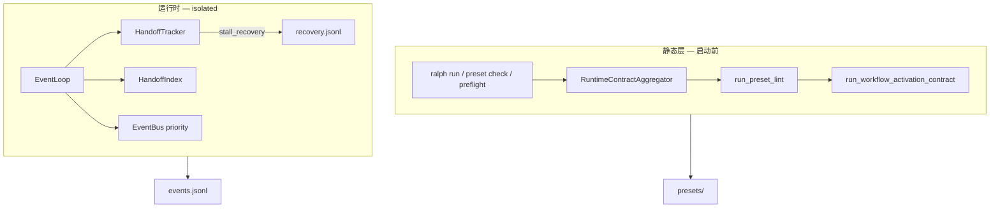
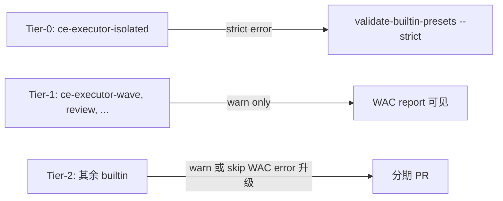
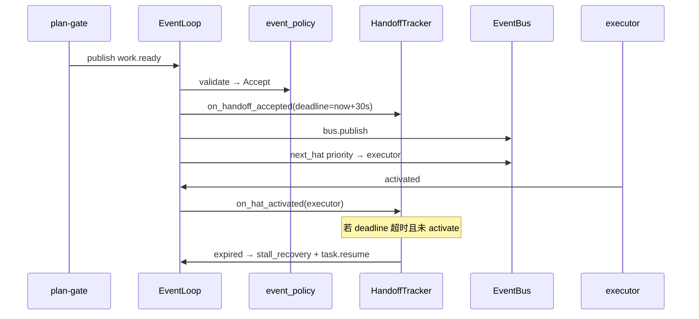

# feat: WAC 机制上线与收尾 — 接线、语义收敛、运行时兜底

## Summary

`2026-06-12-002` 已交付 WAC 静态规则库、HandoffIndex 优先调度、payload 硬门与 `ce-executor-isolated` 拓扑修补，但 **WAC 尚未接入 `run_preset_lint` / 启动硬门**，**HandoffTracker 未挂主循环**，**R2 语义与 plan 字面不一致**，**全 builtin strict 范围被低估**。本计划把 WAC 从「可测库」推进到「对用户生效的护栏」，以 `ce-executor-isolated` 为 Tier-0 验收夹具，其余 builtin 分期 warn→error，并修订父 plan 的成功标准与语义定义。

**与 002 的关系**：002 标记为 `partial-complete`（本计划 U7 执行）；本计划不重复实现已有模块，聚焦接线、语义、集成与门禁分层。

### 命名空间

| 前缀 | 含义 |
|------|------|
| **WRC-U1…U7** | 本计划 Implementation Units |
| **WAC-U1…U8** | `2026-06-12-002` 原单元编号（引用用） |

---

## Problem Frame

002 执行后的真实状态（2026-06-12 工作区）：

| 现象 | 根因 |
|------|------|
| `ralph preset check --strict` 对 `ce-executor-isolated` 显示 PASS，但 WAC 规则存在 | `run_workflow_activation_contract` **未**被 `run_preset_lint` 调用 |
| R6「builtin 违反 WAC 必须拒绝启动」未生效 | 无 manifest 驱动的 WAC Error 路径；aggregator 仅在 `fail_on_warnings` 时跑 lint |
| R8「30s handoff 超时 escalation」未生效 | `HandoffTracker` 仅有单元测试，EventLoop 无引用 |
| R2 plan 写「任意 hat-to-hat 即 trap」，实现几乎会打爆所有 preset | 实现已窄化为「唯一消费者 + 无 closure path」——更正确，但 plan/测试文档未同步 |
| `queue.advance` seed + plan-gate self-loop 产生永恒 R3/R4 噪声 | KTD-12 与 R7 seed 列表冲突：audit topic 被当作 handoff |
| `starting_event` / runner 注入 topic 被静态图误判 | 豁免散落在 R5/HandoffIndex，无统一模型 |
| `ce-executor-wave` 与 isolated 的 plan-gate 已分叉 | WAC-U4 后「shared back-half」假设失效——测试已改，需在 plan 层正式记录 |

**用户目标**：同类编排死端在启动前不可通过；`work.ready` 类 handoff 在运行时不可静默卡死；不必一次性重构全部 builtin preset。

---

## Requirements

| ID | 需求 |
|----|------|
| R-WRC-01 | `run_preset_lint` **必须**调用 `run_workflow_activation_contract`；WAC findings 进入 `RuntimeContractAggregator` 与 `ralph preset check` JSON 报告 |
| R-WRC-02 | WAC 在 aggregator 中 **always-on**（与 002 KTD-2 一致）：默认 `preset check` 路径也产出 WAC warn；severity 由 strict/builtin 决定 |
| R-WRC-03 | **R2 语义锁定**：re-emit trap = 唯一非 wildcard 消费者 + 外部 publisher + 无 ≤2-hop closure；更新 002 plan 与 AE1 描述与此一致 |
| R-WRC-04 | **Runner 注入 topic 模型**：`starting_event`、`task.resume`、ralph 内置 publish 在 WAC 图中可见或统一豁免，避免「无 publisher」误报 |
| R-WRC-05 | **Handoff seed 收敛**：R8 超时/priority 仅覆盖真实外发 handoff；`queue.advance` 降级为 audit/progress topic，移出 R7 seed 或标记 non-handoff |
| R-WRC-06 | `builtin:*` 且名在 `presets/manifest.yml` embedded 列表 → WAC violation **始终 Error**（002 R6 / KTD-7） |
| R-WRC-07 | **Tier-0**：`ce-executor-isolated` en/zh embedded 在 `run_workflow_activation_contract(strict=true)` 下 **零 Error**；`ralph preset check -H builtin:ce-executor-isolated --strict` 通过 |
| R-WRC-08 | **HandoffTracker** 接入 EventLoop：`on_handoff_accepted` / `on_hat_activated` / stall tick `expired()` → recovery envelope + `task.resume`（KTD-13） |
| R-WRC-09 | **Tier 门禁**：除 Tier-0 外，builtin preset WAC 默认 **warn**；CI `validate-builtin-presets.sh --strict` 仅对 Tier-0 强制 WAC error |
| R-WRC-10 | 002 plan `status` 更新为 `partial-complete`；本计划 Success Criteria 取代 002 中未达成的 R6/R13/R14 合并验收 |
| R-WRC-11 | R12：`ralph wave emit` 在 `wave_total != len(payloads)` 时拒收整批（若当前仅隐式相等则补显式校验测试） |

### 明确不做（本计划）

- 一次性修到**所有** builtin preset WAC 全绿（归入 Tier-1 长期清扫）
- Coordinator 模式 handoff priority / timeout
- `diagnosis-summary.json` counter、001 计划 plan-gate 竞态门（仍 deferred）
- 扩展 `RALPH_CONTROL_TOPICS` 让 ralph hat 模拟 workflow publish

---

## Key Technical Decisions

| ID | 决策 | 理由 |
|----|------|------|
| KTD-WRC-1 | **窄 R2 为 canonical 语义** | 字面 R2 对正常 hat 流转噪声≈100%；与 dispatch-gap 根因（handoff dead-end）一致 |
| KTD-WRC-2 | **WAC always-on，severity 分级** | 002 KTD-2：规则始终执行；builtin/strict 升 error，用户 preset 默认 warn |
| KTD-WRC-3 | **虚拟 publisher `ralph`** | 在 `HandoffGraph::from_config` 注入 `starting_event` + ralph 内置 topic 的 publisher，优于 scattered exemption |
| KTD-WRC-4 | **`queue.advance` 非 handoff** | 与 KTD-12 对齐：保留 audit 双 publish，R8/R7 seed 只管 `work.ready` 等外发 handoff |
| KTD-WRC-5 | **Tier-0 CI 门** | 全 builtin 一次修完=重构所有拓扑；先保证验收夹具，再分期清扫 |
| KTD-WRC-6 | **HandoffTracker 挂 `LoopState`** | 与 002 F2 一致；在 policy accept 之后、`next_hat` 之前；与 `ReviewStepTracker` 边界不变 |
| KTD-WRC-7 | **002 状态 `partial-complete`** | 诚实反映「机制在、硬门未上」；避免后人误判 002 已 closure |
| KTD-WRC-8 | **wave/isolated plan-gate 分叉为文档化事实** | 不再维护 `shared_tail` 对 plan-gate 的字段级镜像 |

---

## High-Level Technical Design

### 目标架构（接线后）

### Tier 门禁

### Handoff 生命周期（U4）

---

## Scope Boundaries

### In scope

- R-WRC-01 ～ R-WRC-11
- 002 plan 状态与 R2/AE1 语义修订（U7）
- Tier-0 CI 纳入 WAC（U5）
- `docs/solutions/` 一篇 WAC rollout 学习（U7，可选简短）

### Deferred to Follow-Up Work

- Tier-1 builtin 逐 preset 消 WAC finding（`ce-executor-wave` dispatcher 静态图外、`fix.applied` 多跳链等）
- `WacExemption` YAML 注解（动态 consumer / closure_hops 配置）——Tier-1 遇到假阳性再加
- R14–R15 全量 `2026-06-10-003` 8-step dogfood（002 已 deferred）
- 001 计划 payload/review gate 与 WAC 双重拒收协调（合并时人工核对）

### Outside this product's identity

- Runner 隐式 `queue.advance → work.ready` 桥接
- 为通过 WAC 而禁用 `review_step_state` 或 MH-U4 fair scheduling

---

## Phased Delivery

| 阶段 | 单元 | 可独立合并 | 验收 |
|------|------|------------|------|
| **P0** | WRC-U1, WRC-U2, WRC-U3 | U1 后 CI 可能红直到 U3 | Tier-0 embedded preset WAC 零 error |
| **P1** | WRC-U4 | 依赖 P0 | handoff timeout 集成测绿 |
| **P2** | WRC-U5, WRC-U6, WRC-U7 | U5/U7 可并行 U4 | CI Tier-0 strict；002 标 partial-complete |

---

## Risks & Dependencies

| 风险 | 缓解 |
|------|------|
| U1 接线后 Tier-0 仍红 | U3 先于 U1 merge 不可行；顺序：U2 语义 → U3 preset 修 → U1 接线 |
| 虚拟 publisher 与 MH-U3 终态 authority 冲突 | 仅注入 runner topic，不注入 `default_publishes` |
| HandoffTracker 与 human.interact / wave 并发 | 仅 unique consumer；policy 拒收不计入 tracker |
| `validate-builtin-presets` 现有 orphan/topology 失败 | Tier-0 脚本只强制 isolated；或 isolated 单独 job |
| 与 001 双重修改 event_loop | U4 仅加 tracker 钩子，不改 review_step_state 语义 |

**依赖**：002 已合入的 `workflow_activation.rs`、`handoff_index.rs`、`handoff_tracker.rs`、`event_policy` R10/R11。

---

## Success Criteria

- `cargo test --workspace --exclude ralph-e2e` 绿
- `ralph preset check -H builtin:ce-executor-isolated --strict` 通过，且 JSON 报告含 WAC 步骤（无 `lint.preset.*` error）
- `run_workflow_activation_contract` 对 embedded `ce-executor-isolated` strict 返回空 error 列表
- isolated replay/BDD：`work.ready` publish 后 priority 选中 executor；mock 31s 无 activation 产生 recovery 记录
- `scripts/validate-builtin-presets.sh --strict` 对 **Tier-0 列表** 通过（至少 `ce-executor-isolated`）
- `docs/plans/2026-06-12-002` 标 `partial-complete` 并链接本计划

---

## Implementation Units

### WRC-U1. WAC 接入 `run_preset_lint` 与 Aggregator always-on

**Goal：** 落实 R-WRC-01、R-WRC-02；WAC findings 进入所有 contract 报告路径。

**Requirements：** R-WRC-01, R-WRC-02

**Dependencies：** 无（可与 U2 并行开发，合并前需 U3 绿）

**Files：**
- `crates/ralph-core/src/preset_lint/mod.rs`
- `crates/ralph-core/src/runtime_contract.rs`
- `crates/ralph-core/src/preset_lint/tests/run_preset_lint.rs`
- `crates/ralph-cli/src/loop_runner/preset_lint_gate.rs`
- `crates/ralph-cli/src/commands/preset.rs`（tests）

**Approach：**

1. 在 `run_preset_lint` 末尾调用 `run_workflow_activation_contract(config, strictness == LintStrictness::Strict)`，结果经 `lint_findings_to_contract_findings` 合并。
2. **Aggregator 拆分 WAC 步骤**（002 KTD-2）：新增 Step 2b——**无论** `fail_on_warnings`，始终执行 WAC；非 strict 时 WAC 产 warn，strict 时产 error。现有 ownership lint 仍仅在 `fail_on_warnings` 时跑（保持 U3 历史行为）。
3. 排序：WAC findings 与现有 lint 统一 `(id, topic, hat)` 确定性排序。
4. 删除 `mod.rs` 中「WAC 未接线」注释，改为指向本计划。

**Execution note：** 先写 failing test：`run_preset_lint` 对已知 re-emit fixture 产出 `lint.preset.re_emit_trap`，再接线。

**Patterns to follow：**
- `crates/ralph-core/src/preset_lint/multi_hat.rs`（always-Error 先例）
- `crates/ralph-core/src/runtime_contract.rs` Step 2 现有 lint 门控

**Test scenarios：**

| # | 输入 | 期望 |
|---|------|------|
| T-WRC-U1-01 | re-emit dead-end YAML + `run_preset_lint(Default)` | warn `lint.preset.re_emit_trap` |
| T-WRC-U1-02 | 同上 + `run_preset_lint(Strict)` | error |
| T-WRC-U1-03 | aggregator 非 strict | 仍含 WAC warn findings |
| T-WRC-U1-04 | `enforce_preset_lint_gate` + 违规 builtin | `ralph run` 阻断 |

**Verification：** `cargo test -p ralph-core run_preset_lint` + `cargo test -p ralph-cli preset_lint_gate` 绿。

---

### WRC-U2. WAC 语义收敛：R2 文档、Runner 图、handoff seed

**Goal：** 落实 R-WRC-03、R-WRC-04、R-WRC-05；消除 plan-gate `queue.advance` 自环噪声。

**Requirements：** R-WRC-03, R-WRC-04, R-WRC-05

**Dependencies：** 无

**Files：**
- `crates/ralph-core/src/preset_lint/workflow_activation.rs`
- `crates/ralph-core/src/workflow_contract/handoff_index.rs`
- `crates/ralph-core/src/config/workflow_contract.rs`
- `crates/ralph-core/src/preset_lint/workflow_activation.rs`（tests）
- `crates/ralph-core/src/workflow_contract/handoff_index.rs`（tests）

**Approach：**

1. **KTD-WRC-3 虚拟 publisher**：`HandoffGraph::from_config` 增加 `inject_runner_topics(config)`：
   - publisher `ralph`（逻辑 hat）发布：`starting_event`（或默认 `task.start`）、`task.resume`、`loop.cancel`（与 `HatRegistry::from_runtime_config` 对齐，读源码确认完整列表）
   - R5「无 publisher」不再对 starting_event fire
2. **KTD-WRC-4 handoff seeds**：默认 seeds 改为 `work.ready`, `fix.plan.ready`, `work.failed`；`queue.advance` 移出 seed 或标 `HandoffEntry { consumer: None, handoff: false }`
3. **R4 自环豁免**：若 `unique_consumer(topic) == publisher(topic)`（self-loop handoff），R4 不报 dead-end（audit 信号）
4. 更新 T-U1-01 注释：标明「窄 R2 + 无 closure」前提；新增正例测试 executor 正常消费 `work.ready` 且有 egress → 无 R2

**Patterns to follow：**
- `crates/ralph-core/src/hat_registry.rs`（ralph 内置 publish 列表）
- `crates/ralph-core/src/preset_validator.rs`（starting_event subscriber 检查先例）

**Test scenarios：**

| # | 场景 | 期望 |
|---|------|------|
| T-WRC-U2-01 | hat triggers `work.start`，无 hat publishes | 无 R5（ralph 虚拟发布） |
| T-WRC-U2-02 | plan-gate self-loop `queue.advance` | 无 R4 handoff_pairing_broken |
| T-WRC-U2-03 | executor 消费 `work.ready` 且 publish 可达 review | 无 R2 |
| T-WRC-U2-04 | HandoffIndex 默认 seeds 不含 `queue.advance` | `work.ready` 仍有 consumer |

**Verification：** `cargo test -p ralph-core workflow_activation handoff_index` 绿。

---

### WRC-U3. Builtin strict 门 + Tier-0 `ce-executor-isolated` 全绿

**Goal：** 落实 R-WRC-06、R-WRC-07；embedded preset 作为 CI 锚点。

**Requirements：** R-WRC-06, R-WRC-07

**Dependencies：** WRC-U1, WRC-U2

**Files：**
- `crates/ralph-core/src/preset_lint/workflow_activation.rs`（`wac_severity` 扩展）
- `crates/ralph-cli/src/preflight.rs`
- `crates/ralph-cli/src/commands/preset.rs`
- `presets/en/ce-executor-isolated.yml`
- `presets/zh/ce-executor-isolated-zh.yml`
- `crates/ralph-cli/src/presets.rs`（embedded + contract tests）
- `crates/ralph-cli/src/presets.rs`（`test_all_embedded_presets_pass_strict_lint` 扩展）

**Approach：**

1. **KTD-7 实现**：`wac_severity(strict, source_is_builtin_embedded)` → builtin 始终 `Error`；用户 preset 非 strict → `Warn`。
2. `RuntimeContractAggregator` / `preset check` 传入 `source_label`（`builtin:ce-executor-isolated` vs 路径），解析 manifest embedded 列表（复用 `presets/manifest.yml` 或 `presets.rs` 常量）。
3. 对 embedded `ce-executor-isolated` / `ce-executor-isolated-zh` 跑 WAC，修到 strict 零 error（可能需微调 plan-gate instructions 无关的纯拓扑项）。
4. 新增 `test_ce_executor_isolated_passes_wac_strict`：加载 embedded YAML → `run_workflow_activation_contract(true)` → assert no error severity。

**Patterns to follow：**
- `crates/ralph-core/src/preset_lint/multi_hat.rs`（builtin 无豁免）
- `crates/ralph-cli/src/presets.rs`（`test_all_embedded_presets_pass_strict_lint`）

**Test scenarios：**

| # | 场景 | 期望 |
|---|------|------|
| T-WRC-U3-01 | `ralph preset check -H builtin:ce-executor-isolated --strict` | exit 0 |
| T-WRC-U3-02 | 用户 preset 同违规，无 `--strict` | warn，可启动 |
| T-WRC-U3-03 | builtin 违规 YAML | error，消息含 `lint.preset.*` |
| T-WRC-U3-04 | en/zh WAC findings 一致 | 镜像 guard 绿 |

**Verification：** Covers 002 AE1 正向。`cargo test -p ralph-cli presets` 绿。

---

### WRC-U4. HandoffTracker 主循环集成

**Goal：** 落实 R-WRC-08；完成 002 WAC-U6 未接线部分。

**Requirements：** R-WRC-08

**Dependencies：** WRC-U1, WRC-U3（priority 路径已存在）

**Files：**
- `crates/ralph-core/src/event_loop/loop_state.rs`
- `crates/ralph-core/src/event_loop/mod.rs`
- `crates/ralph-core/src/workflow_contract/handoff_tracker.rs`
- `crates/ralph-core/src/diagnosis/envelope.rs`（`stall_recovery` + `reason=handoff_dispatch_timeout`）
- 新建 `crates/ralph-core/src/event_loop/tests/handoff_dispatch.rs`

**Approach：**

1. `LoopState` 增加 `handoff_tracker: HandoffTracker`，构造时从 `WorkflowContractConfig` 读 timeout。
2. **挂钩点**（002 F2）：
   - `apply_event_policy_validation` → `Accept` 且 topic ∈ `HandoffIndex` 且 `consumer_of` 为 Some → `on_handoff_accepted`
   - hat activation 成功路径 → `on_hat_activated(consumer)`
   - 主循环 stall / iteration tick → `expired(now)` → 写 recovery envelope，`task.resume` 路由 `safe_target`（plan-gate 或 review-coordinator，KTD-13）
3. policy / origin **拒收**的不调用 `on_handoff_accepted`（T-U6-03）
4. coordinator 模式：tracker 构造但 no-op

**Patterns to follow：**
- `crates/ralph-core/src/event_loop/review_step_state.rs`（并行 state 机边界）
- `crates/ralph-core/src/workflow_contract/handoff_tracker.rs` 现有单测

**Test scenarios：**

| # | 场景 | 期望 |
|---|------|------|
| T-WRC-U4-01 | mock clock：accept handoff 后 31s 无 activation | escalation 含 topic/consumer/safe_target |
| T-WRC-U4-02 | 25s 内 activation | pending 清空，无 escalation |
| T-WRC-U4-03 | policy 拒收 handoff | tracker pending 为空 |
| T-WRC-U4-04 | Covers AE2 子集 | publish `work.ready` 后 N tick 内 executor selected |

**Verification：** `cargo test -p ralph-core handoff_dispatch` 绿。

---

### WRC-U5. Tier 门禁与 CI 脚本

**Goal：** 落实 R-WRC-09；避免全 builtin 一次修完阻塞 CI。

**Requirements：** R-WRC-09

**Dependencies：** WRC-U1, WRC-U3

**Files：**
- `scripts/validate-builtin-presets.sh`
- `crates/ralph-cli/src/presets.rs`（`TIER_0_WAC_PRESETS` 常量或 manifest 注解）
- `.config/nextest.toml` 或 CI workflow（若存在 WAC job 挂载点）
- `crates/ralph-core/tests/scenarios.rs`（可选 AE 回归）

**Approach：**

1. 定义 **Tier-0** 列表：`ce-executor-isolated`（首期唯一成员）。
2. `validate-builtin-presets.sh --strict`：
   - 对所有 public preset 跑现有 contract
   - 对 Tier-0 **额外**断言 JSON 报告无 `lint.preset.*` error（WAC）
   - 非 Tier-0：WAC error 降级为脚本 WARN（或仅 topology/lint 旧逻辑）
3. 文档注释：Tier-1 候选（`ce-executor-wave`）及已知 finding 类别，供后续 PR 引用。

**Test scenarios：**

| # | 场景 | 期望 |
|---|------|------|
| T-WRC-U5-01 | `./scripts/validate-builtin-presets.sh --strict` | Tier-0 通过 |
| T-WRC-U5-02 | `ce-executor-wave` strict | 不因 WAC 失败脚本（warn 可接受） |

**Verification：** 本地跑 script exit 0；Tier-0 isolated 绿。

---

### WRC-U6. R12 wave 校验与 BDD 补全

**Goal：** 落实 R-WRC-11；闭合 002 WAC-U7/U8 缺口。

**Requirements：** R-WRC-11

**Dependencies：** WRC-U1

**Files：**
- `crates/ralph-cli/src/wave.rs`
- `crates/ralph-core/tests/scenarios.rs`
- 可选 `crates/ralph-core/tests/fixtures/handoff/queue_advance_executor_dispatch.jsonl`

**Approach：**

1. 确认 `wave emit` 路径：`wave_total` 必须等于 `payloads.len()`；若手写 JSONL 入口存在，同规则拒收。
2. 补 scenario：wave_total mismatch → CLI exit ≠ 0，零行写入。
3. 可选：replay fixture 覆盖 AE2 timing 子集（与 U4 协调，避免重复）。

**Test scenarios：**

| # | 场景 | 期望 |
|---|------|------|
| T-WRC-U6-01 | `ralph wave emit` 3 payloads | wave_total=3 |
| T-WRC-U6-02 | 内部构造 mismatch（单测） | 拒收整批 |

**Verification：** `cargo test -p ralph-cli wave` 绿。

---

### WRC-U7. 父 plan 修订、分叉文档与学习沉淀

**Goal：** 落实 R-WRC-10；消除 002 与实现漂移。

**Requirements：** R-WRC-10

**Dependencies：** WRC-U1–U5 合并后

**Files：**
- `docs/plans/2026-06-12-002-feat-workflow-activation-contract-plan.md`
- `docs/plans/2026-06-12-003-feat-wac-rollout-completion-plan.md`（本文件 `status: complete`）
- `crates/ralph-cli/src/presets.rs`（`test_ce_executor_wave_shared_tail` 注释）
- 可选 `docs/solutions/developer-experience/wac-rollout-tiered-gates-2026-06-12.md`

**Approach：**

1. 002 更新：
   - `status: partial-complete`
   - R2 定义改为窄语义 + KTD-4 补充
   - 新增 KTD-14 runner-injected topics
   - WAC-U4 成功标准改为 Tier-0 only
   - Success Criteria 指向 003
2. 记录 wave/isolated plan-gate 分叉表（KTD-WRC-8）
3. 一篇简短 solutions doc：Tier 门禁、接线顺序、假阳性处理策略

**Test expectation:** none — 文档与状态修订。

**Verification：** 002 frontmatter `partial-complete`；003 链接可解析。

---

## Acceptance Examples

- **AE-WRC-1. WAC 硬门生效**（R-WRC-01, R-WRC-06）
  - Given：executor triggers `queue.advance` 且无 closure 的违规片段
  - When：`ralph preset check --strict`
  - Then：报告含 `lint.preset.re_emit_trap`；`ralph run` 不进入 event loop

- **AE-WRC-2. Tier-0 isolated 通过**（R-WRC-07）
  - Given：embedded `ce-executor-isolated`
  - When：`run_workflow_activation_contract(strict=true)`
  - Then：零 error

- **AE-WRC-3. Handoff 超时**（R-WRC-08）
  - Given：isolated + `work.ready` accepted
  - When：31s 无 executor activation（mock）
  - Then：`recovery.jsonl` 含 handoff_dispatch_timeout；`task.resume` 路由 safe target

- **AE-WRC-4. 正常 handoff 不误报 R2**（R-WRC-03）
  - Given：plan-gate → `work.ready` → executor → `work.done` → review 链
  - When：WAC strict
  - Then：无 `re_emit_trap` on executor

---

## Open Questions

### Resolved in this plan

| 问题 | 决议 |
|------|------|
| R2 字面 vs 窄语义 | 窄语义 canonical（KTD-WRC-1） |
| 全 builtin WAC strict | Tier-0 only（KTD-WRC-5） |
| `queue.advance` 是否 handoff | 否，audit only（KTD-WRC-4） |
| Runner topic 豁免方式 | 虚拟 publisher ralph（KTD-WRC-3） |

### Deferred to implementation

| 问题 | 默认假设 |
|------|----------|
| Tier-1 `ce-executor-wave` 消 finding 策略 | 先 warn；dispatcher 边用 `WacExemption` 或补静态边 |
| Handoff escalation 独立 diagnosis source | 复用 `stall_recovery` + `reason=handoff_dispatch_timeout` |
| `validate-builtin-presets` 入默认 CI | 本计划仅改脚本；CI job 另 PR |

---

## Sources & Research

### 上游与诊断

- `docs/plans/2026-06-12-002-feat-workflow-activation-contract-plan.md` — 原 WAC 计划（partial-complete）
- `docs/solutions/integration-issues/ce-executor-isolated-preset-dispatch-gap-plan-gate-executor-2026-06-12.md`
- `docs/solutions/developer-experience/ce-executor-plan-gate-premature-completion-2026-06-02.md`

### 代码扩展点

- `crates/ralph-core/src/preset_lint/mod.rs` — `run_preset_lint` 接线点
- `crates/ralph-core/src/preset_lint/workflow_activation.rs` — WAC 规则
- `crates/ralph-core/src/runtime_contract.rs` — aggregator Step 2/2b
- `crates/ralph-core/src/event_loop/mod.rs` — `next_hat` + tracker 挂钩
- `crates/ralph-core/src/workflow_contract/handoff_tracker.rs` — 超时状态机
- `scripts/validate-builtin-presets.sh` — Tier-0 CI
