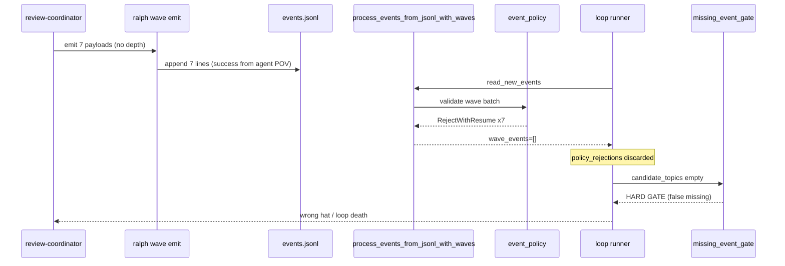
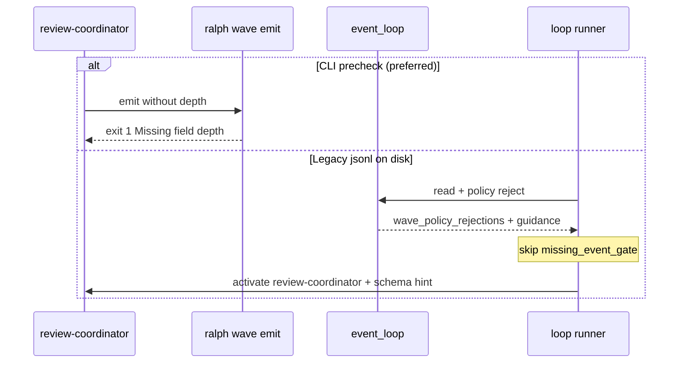
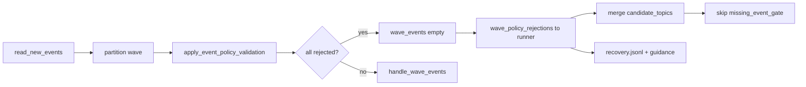

# fix: Wave policy 拒绝与 missing_event_gate 脱节修复

## Overview

修复 `ce-executor-isolated`（及所有 isolated + wave preset）在 **wave 事件被 event policy 拒绝** 后，runner 误判 obligation 未满足、错误触发 `missing_event_gate`、hat 路由漂移到 `executor` 并最终 `payload_contract_violation` 终止的缺陷链。同时在 `ralph wave emit` 写入前增加与 loop 一致的 schema 预检，并对 preset 示例 payload 补齐 `depth` 字段。

本计划对应需求文档 `docs/brainstorms/2026-06-13-wave-dispatch-policy-gate-requirements.md`（R1–R18）。

---

## Problem Frame

2026-06-12 worktree loop 中，7 个 `review.wave.ready` 已写入 jsonl，但 0 个 dimension-reviewer worker 启动。复核结论：**payload 缺 `depth`** → wave 路径 policy 校验拒绝 → `wave_events` 为空 → runner 认为 review-coordinator「未 emit」→ hard gate → 错误 hat 激活 → loop 暴毙。

这不是 wave dispatcher 未实现 fan-out，而是 **policy 拒绝结果未进入 runner 的 obligation / recovery 语义**。(see origin: `docs/brainstorms/2026-06-13-wave-dispatch-policy-gate-requirements.md`)

---

## Requirements Trace

| ID | 计划单元 |
|----|----------|
| R1–R3, R7 | U1: Wave policy rejection  surfaced |
| R4–R6, R5 | U2: missing_event_gate 与 candidate_topics 修正 |
| R9–R11 | U3: Hard gate 后 hat 路由稳定 |
| R12–R15, R18 | U4: ralph wave emit schema 预检 |
| R19–R22 | U4: JSON 结构化 validation 错误 + 批量 violations |
| R16–R17, R21 | U5: Preset depth 示例 + 强制 CLI policy check |
| SC1–SC4 | 全单元 Verification + U6 集成回归 |

---

## Scope Boundaries

- 不修改 `enforce_wave_isolated_scope` 核心语义（现场无 violation 证据）。
- 不新增 preset 级 poll/wait review 指令。
- 不放宽 `review.wave.ready` schema。
- 不修改 dimension-reviewer dispatcher 的 concurrency fan-out 算法。

### Deferred to Separate Tasks

- scratchpad guidance 去重：独立 DX 任务
- `worker.started` 遥测事件：独立可观测性任务

---

## Context & Research

### Relevant Code and Patterns

| 区域 | 路径 | 说明 |
|------|------|------|
| Wave 分区 + policy | `crates/ralph-core/src/event_loop/mod.rs` | `process_events_from_jsonl_with_waves`、`apply_event_policy_validation` |
| 结果类型 | `crates/ralph-core/src/event_loop/mod.rs` | `ProcessedEventsWithWaves` 目前仅 `processed` + `wave_events` |
| Runner 主循环 | `crates/ralph-cli/src/loop_runner/runner.rs` | `agent_wrote_any_valid_or_rejected`、`should_gate_missing_events` 调用点 ~3563 |
| Hard gate | `crates/ralph-cli/src/loop_runner/hard_gate.rs` | `inject_missing_event_hard_gate_guidance`、`should_gate_missing_events` |
| Wave dispatch | `crates/ralph-cli/src/loop_runner/wave/dispatcher.rs` | `handle_wave_events`、已有 `handle_wave_rejection` |
| Wave CLI | `crates/ralph-cli/src/wave.rs` | `validate_payload_shape`（仅 JSON object，无 schema） |
| Emit policy 先例 | `crates/ralph-cli/src/commands/emit.rs` | `PolicyCheckMode`、`validate_event` 调用 |
| Policy 核心 | `crates/ralph-core/src/event_policy.rs` | `validate_event`、`PolicyRejection` |
| Handoff 路由 | `crates/ralph-core/src/workflow_contract/handoff_tracker.rs` | `HandoffEscalation.safe_target` |
| Contract reject 先例 | `crates/ralph-cli/src/loop_runner/tests.rs` | `test_contract_rejection_satisfies_any_valid_or_rejected` |
| Preset schema | `presets/en/ce-executor-isolated.yml` | `review.wave.ready.required_fields` 含 `depth` |
| Preset manifest | `presets/manifest.yml`、`crates/ralph-cli/src/presets.rs` | U5 若改 en preset 需同步 zh/schema（本需求仅 en 示例 + schema 注释） |

### Institutional Learnings

- `docs/solutions/integration-issues/ce-executor-wave-emission-must-batch-in-single-emit-2026-06-09.md` — wave 必须单次 emit N payload；本修复不改变 batch 语义，但须保证 batch 合规后 dispatch 不被 policy 静默清空。
- `docs/solutions/integration-issues/ce-executor-isolated-preset-dispatch-gap-plan-gate-executor-2026-06-12.md` — plan-gate/executor 路由错位是已知集成类问题；U3 与之间接相关。

### External References

- 无额外外部依赖；行为以 repo 内 `event_policy` 与 `validate_event` 为准。

---

## Key Technical Decisions

- **KTD-1: 扩展 `ProcessedEventsWithWaves` 而非 runner 二次读盘** — wave policy reject 在 `process_events_from_jsonl_with_waves` 内已发生，将 `wave_policy_rejections: Vec<PolicyRejection>` 随结果返回，避免 runner 重复解析 jsonl。(see origin R3)
- **KTD-2: `had_rejected_events` 合并 wave reject** — runner 侧 `agent_wrote_any_valid_or_rejected` 增加 `wave_had_policy_rejections` 分支，与 regular 路径 `had_rejected_events` 对称。(see origin R4–R5)
- **KTD-3: recovery source 复用 `payload_contract`** — 缺失 required field 已是 `payload_contract` 范畴；不新增 diagnosis source 枚举，除非 implementer 发现 taxonomy 冲突。(resolves origin D1)
- **KTD-4: wave emit 预检默认 enforce（ce-executor preset）** — `ce-executor-isolated` 显式 `require_policy_check_for_cli_emit: true` + `allow_unsafe_cli_emit: false`，与 loop enforce 对齐；不依赖 workspace 默认 false。(resolves origin R21)
- **KTD-5: hard gate 路由绑定 `display_hat` / gated hat id** — missing_event_gate 触发时，向 `EventLoop` state 写入 `pending_recovery_hat`，下一 iteration hat 选择优先该值直至 cleared。(see origin R9–R11)
- **KTD-6: 预检共享函数** — 从 `emit.rs` 提取 policy check 到共享模块，wave 与 emit 均调用。(see origin R13)
- **KTD-7: 批量 violations 一次报告** — 预检遍历全部 payload，聚合 `validation_errors[]` 后单次 fail；`--output json` 为 agent 主消费面，stderr 为人类摘要。(see origin R19–R20)

---

## Open Questions

### Resolved During Planning

- **D1 recovery source 命名** → 复用 `DiagnosisSource::PayloadContract`，reason_code 区分 `missing_required_field` vs `wave_dispatch_blocked`。
- **D2 预检默认** → `ce-executor-isolated` preset 显式开启 strict CLI policy check（R21）；有 config 且 `event_policy.enabled` 时 wave emit 始终预检，无 `--no-policy-check` 豁免除非全局 `allow_unsafe_cli_emit: true`（该 preset 设为 false）。
- **D3 JSON 错误形状** → 见 U4 Technical design；成功路径保留现有 `{ wave_id, topic, count, ... }`，失败路径用 `{ ok: false, validation_errors: [...] }` 区分。

### Deferred to Implementation

- Hat 选择逻辑是否已有 `last_hard_gate_hat` 等价字段 — implementer 读 `EventLoop` state / `loop_state.rs` 后决定 extend vs reuse。
- BDD scenario 是否新增 YAML scenario 或仅 loop_runner unit + smoke — 视现有 `crates/ralph-core/tests/scenarios/` 覆盖成本定。

---

## High-Level Technical Design

> *This illustrates the intended approach and is directional guidance for review, not implementation specification. The implementing agent should treat it as context, not code to reproduce.*

### 缺陷链（修复前）



### 目标链（修复后）



### 数据流：reject  surfaced



---

## Implementation Units

- [ ] **U1: Wave policy rejection surfaced**

**Goal:** policy 在 wave 路径拒绝事件时，reject 详情返回 runner 并写入 recovery。

**Requirements:** R1, R2, R3, R7

**Dependencies:** None

**Files:**
- Modify: `crates/ralph-core/src/event_loop/mod.rs`
- Modify: `crates/ralph-core/src/lib.rs`（若导出类型变更）
- Test: `crates/ralph-core/src/event_loop/tests/event_policy.rs` 或新建 `crates/ralph-core/src/event_loop/tests/wave_policy_rejection.rs`

**Approach:**
- 扩展 `ProcessedEventsWithWaves` 增加字段：
  - `wave_policy_rejections: Vec<PolicyRejection>`
  - `wave_raw_count: usize`（partition 后 policy 前 wave 事件数，供 R7 envelope evidence）
- 在 `process_events_from_jsonl_with_waves` 的 wave policy 块中，捕获 `apply_event_policy_validation` 的 `policy_rejections`，赋值到新字段。
- 当 `wave_raw_count > 0 && wave_events.is_empty()`，调用现有 recovery 辅助函数（参考 `log_topic_format_rejection` / `record_recovery_envelope` 模式）写 envelope：
  - `source`: `PayloadContract`
  - `reason_code`: `wave_dispatch_blocked` 或 `missing_required_field`
  - `evidence`: topic、field、wave_id（从首个 reject 事件取）
- `debug!`/`warn!` 日志必须含 `wave_id`、`topic`、finding message。

**Execution note:** 先写 failing unit test：构造 isolated loop + 7 条缺 `depth` 的 `review.wave.ready` jsonl，断言 `wave_policy_rejections.len()==7` 且 `wave_events.is_empty()`。

**Patterns to follow:**
- regular 路径 `apply_event_policy_validation` 的 rejection 处理（`mod.rs` ~551–849）
- `publish_isolated_wave_violation` 的 diagnostic 模式

**Test scenarios:**
- Happy path: 7 条合法 `review.wave.ready`（含 depth）→ `wave_events.len()==7`，`wave_policy_rejections` 空
- Error path: 7 条缺 `depth` → `wave_events` 空，`wave_policy_rejections` 非空，每条 topic=`review.wave.ready`
- Edge case: 混合 batch（1 合法 6 非法）→ 行为与 policy mode `enforce` 一致（通常 partial accept 或全 reject，与 `validate_event` 批处理语义一致 — implementer 读代码确认）
- Integration: `wave_raw_count` 与 rejection 数一致

**Verification:**
- 新 unit tests 绿
- 手动：temp dir + isolated hat config + 缺 depth jsonl → recovery envelope 可 grep

---

- [ ] **U2: missing_event_gate 与 candidate_topics 修正**

**Goal:** wave policy reject 时不再误触 missing_event_gate；agent 收到 schema 级 guidance。

**Requirements:** R4, R5, R6

**Dependencies:** U1

**Files:**
- Modify: `crates/ralph-cli/src/loop_runner/runner.rs`
- Modify: `crates/ralph-cli/src/loop_runner/hard_gate.rs`（若 `should_gate_missing_events` 签名扩展）
- Test: `crates/ralph-cli/src/loop_runner/tests.rs`

**Approach:**
- Runner 在 `process_events_from_jsonl_with_waves` 返回后：
  - 从 `wave_policy_rejections` 提取 rejected topics 合并入 `candidate_topics`
  - 定义 `wave_had_policy_rejections = !wave_policy_rejections.is_empty()`
  - 更新 `agent_wrote_any_valid_or_rejected`：
    - `processed.had_raw_events || processed.had_rejected_events || wave_had_policy_rejections`
- `should_gate_missing_events` 在 obligation 路径下：若 `candidate_topics` 含 obligation 要求的 topic（即使未 accepted），视为 satisfied — **注意** 当前 `obligation_satisfied` 可能已支持；若仅缺 merge，则 U2 仅 merge 即可。Implementer 读 `crates/ralph-core/src/config/hat.rs` `obligation_satisfied` 确认。
- R6 guidance：当 `wave_had_policy_rejections && wave_events.is_empty()`，调用新 helper `inject_wave_policy_rejection_guidance(ctx, hat, rejections)`，payload 列出 `Missing required field: X`，**替代** generic missing-event 文案（可与 missing gate 互斥）。

**Execution note:** 镜像 `test_contract_rejection_satisfies_any_valid_or_rejected`，新增 `test_wave_policy_rejection_skips_missing_event_gate`。

**Patterns to follow:**
- `runner.rs` ~3417–3421 `agent_wrote_any_valid_or_rejected`
- `tests.rs` ~8156–8260 contract rejection 与 gate 交互

**Test scenarios:**
- Happy path: wave reject 合并后 `should_gate_missing_events(review-coordinator, …)` → false
- Error path: 真正无 emit 无 reject → gate 仍 true
- Edge case: regular accept + wave reject 同 iteration → gate false
- Integration: 模拟 `ProcessedEventsWithWaves` 驱动 gate 条件表达式（与 runner 相同布尔式）

**Verification:**
- loop_runner tests 新增用例绿
- 不再出现「jsonl 有 7 条 review.wave.ready 仍 missing_event_gate」

---

- [ ] **U3: Hard gate 后 hat 路由稳定**

**Goal:** missing_event_gate 或 wave recovery 后，下一 iteration 激活被 gate 的 hat，不漂到 executor。

**Requirements:** R9, R10, R11

**Dependencies:** U2（guidance 路径明确后路由更清晰；可并行但建议 U2 后）

**Files:**
- Modify: `crates/ralph-core/src/event_loop/loop_state.rs`
- Modify: `crates/ralph-core/src/event_loop/mod.rs`（hat 选择 / process_output）
- Modify: `crates/ralph-cli/src/loop_runner/hard_gate.rs`
- Modify: `crates/ralph-cli/src/loop_runner/runner.rs`
- Test: `crates/ralph-cli/src/loop_runner/tests.rs`
- Test: `crates/ralph-core/src/workflow_contract/handoff_tracker.rs`（若调整 safe_target）

**Approach:**
- 在 `LoopState` 增加 `pending_recovery_hat: Option<HatId>`（或复用已有 escalation 字段 — implementer 审计后命名）。
- `inject_missing_event_hard_gate_guidance` 和 wave policy guidance 路径设置 `pending_recovery_hat = display_hat`。
- Hat 选择逻辑（runner 主循环选 hat 处）：若 `pending_recovery_hat.is_some()`，优先激活该 hat，激活后 clear。
- Recovery envelope `target_hat` / `safe_target` 字段与 `pending_recovery_hat` 一致。
- 审计 `HandoffTracker::expired`：当 consumer 已是 `review-coordinator` 时 safe_target 必须仍为 review-coordinator（当前逻辑 `p.consumer.clone()` 应已满足 — 写 regression test 锁死）。
- 审计 executor 被激活路径：是否因 `work.done` handoff 未 clear — 若 handoff 与 hard gate 并发，implementer 确保 hard gate iteration 不消费错误的 pending handoff。

**Patterns to follow:**
- `handoff_tracker.rs` safe_target 测试 ~268–274
- `event_loop/mod.rs` `current_isolated_hat` 设置 ~4038–4043

**Test scenarios:**
- Happy path: hard gate for review-coordinator → next iteration hat == review-coordinator
- Error path: 模拟 executor pending + hard gate RC → RC 优先
- Integration: recovery envelope `target_hat=review-coordinator` 与 state 一致
- Edge case: hard gate 后 obligation 满足 clear `pending_recovery_hat`

**Verification:**
- 新 tests 绿
- 场景 AE3 手工/集成可复现

---

- [ ] **U4: ralph wave emit schema 预检 + Agent-native JSON 错误**

**Goal:** L1 fail-fast：写入 jsonl 前 schema 校验；agent 通过结构化 JSON 一次看清全部 payload 错误。

**Requirements:** R12, R13, R14, R15, R18, R19, R20, R22

**Dependencies:** KTD-6 提取共享 policy check（可与 U1 并行）；U5 的 R21 preset flags 与 U4 集成测试联调

**Files:**
- Create: `crates/ralph-cli/src/policy_check.rs`（或等价模块名）
- Modify: `crates/ralph-cli/src/commands/emit.rs`（调用共享函数）
- Modify: `crates/ralph-cli/src/wave.rs`
- Modify: `crates/ralph-cli/src/lib.rs` / `main.rs` mod 声明
- Modify: `crates/ralph-core/data/ralph-tools.md`（预检、JSON 错误 schema、`require_policy_check_for_cli_emit` 说明）
- Test: `crates/ralph-cli/src/wave.rs` 内现有 `#[cfg(test)]` 模块

**Approach:**
- 提取 `resolve_policy_check_mode(config, explicit_flags) -> PolicyCheckMode` 与 `validate_topic_payload_against_config(topic, payload_str, config) -> Result<(), PolicyFinding>` 从 emit.rs。
- `wave emit` 流程：`validate_payload_shape` 之后、写盘之前：
  - 解析 workspace `ralph.yml` + 合并 preset（与 `ralph run` 同路径）
  - **批量**扫描每个 payload，收集全部 violations（R20），任一违规则 **整批不写入**
  - 首个违规不再 silent bail-only：保留完整 `validation_errors` 列表
- **`--output json` 失败响应**（R19，stdout，exit ≠ 0）：

> *Directional JSON shape — not implementation spec.*

```json
{
  "ok": false,
  "error": "policy_validation_failed",
  "topic": "review.wave.ready",
  "validation_errors": [
    {
      "payload_index": 0,
      "field": "depth",
      "reason_code": "missing_required_field",
      "message": "Missing required field: depth"
    }
  ]
}
```

- **`--output text` 失败**：stderr 人类摘要（R22），如 `policy validation failed: 7 payloads, missing required field 'depth' in all`。
- **`--output json` 成功**：保持现有 `{ wave_id, topic, count, events_file, deduplicated }` 不变。
- `--no-policy-check`：当 config `allow_unsafe_cli_emit: false` 时拒绝或 warn+仍 enforce（与 emit 一致）；`ce-executor-isolated` 下必须不可绕过（R21，见 U5）。
- 无 config / `event_policy.enabled=false`：仅 `validate_payload_shape`。

**Execution note:** Test-first — `test_wave_emit_json_reports_all_missing_depth_violations` + `test_wave_emit_rejects_missing_depth_before_write`。

**Patterns to follow:**
- `emit.rs` `PolicyCheckMode` 与 policy 校验块 ~92–316
- `wave.rs` `WaveOutputFormat::Json` 成功路径 ~158–168
- `crates/ralph-core/src/config/event_policy.rs` `require_policy_check_for_cli_emit` / `allow_unsafe_cli_emit`

**Test scenarios:**
- Happy path: 含 depth 的 7 payload + `--output json` → `ok` 隐含成功 JSON + 写盘
- Error path: 7 条缺 depth + `--output json` → `validation_errors.len()==7`，索引 0..6，jsonl 不变
- Error path: 第 3 条缺 depth、其余合法 → 仍整批拒绝（atomicity），errors 至少 1 条
- Edge case: `event_policy.enabled=false` → 仅 shape 校验
- Edge case: `require_policy_check_for_cli_emit: true` + `--no-policy-check` → 不能绕过
- Integration: 解析 stdout JSON，agent 可 `jq '.validation_errors[].field'` 得唯一字段列表

**Verification:**
- `cargo test -p ralph-cli wave` 相关测试绿
- `ralph wave emit --help` 冒烟
- 反向验证 `ralph-tools.md` 中 JSON 错误字段表与代码一致

---

- [ ] **U5: Preset depth 示例 + 强制 CLI policy check**

**Goal:** 编排层最小对齐 + preset 层关闭 CLI schema 绕过后门。

**Requirements:** R16, R17, R21

**Dependencies:** None（与 U4 并行；U4 集成测试依赖 U5 preset flags）

**Files:**
- Modify: `presets/en/ce-executor-isolated.yml`
  - `event_policy` 块：增加 `require_policy_check_for_cli_emit: true`、`allow_unsafe_cli_emit: false`
  - review-coordinator payload 示例 ~734–742：补 `"depth": "standard"`
- Modify: `presets/zh/ce-executor-isolated-zh.yml`（镜像 event_policy flags + depth 示例）
- Modify: `presets/schemas/ce-executor-isolated.yml`（若文档化 CLI flags）
- **不**改 `presets/manifest.yml` / `presets.rs`（无 preset 增删）

**Approach:**
- 在 `event_policy:` 下 `on_violation: reject_with_resume` 之后增加：
  ```yaml
  require_policy_check_for_cli_emit: true
  allow_unsafe_cli_emit: false
  ```
- 在「Each payload MUST include」与 JSONL 示例中为每个 dimension 增加 `"depth": "standard"`（或按 dimension 标注 quick/standard/deep）。
- 在 review-coordinator instructions 增加一句 HARD RULE：`ralph wave emit` 失败时必须读 `--output json` 的 `validation_errors` 修 payload，禁止假设 emit 成功。
- 显式 **不** 添加 poll dimension.done 段落。

**Test scenarios:**
- Test expectation: none — YAML 文档；`ralph preset check builtin:ce-executor-isolated` 通过
- Integration（U4/U6）：加载 builtin preset 后 wave emit 缺 depth 必失败

**Verification:**
- `cargo run -p ralph-cli -- preset check -H builtin:ce-executor-isolated` 成功
- embedded preset 与 `presets/en/ce-executor-isolated.yml` 一致（build.rs 同步）

---

- [ ] **U6: 集成回归与 incident 复现防护**

**Goal:** 端到端证明缺陷链已断；SC1–SC4 满足。

**Requirements:** SC1–SC6，AE1–AE6

**Dependencies:** U1–U5

**Files:**
- Modify/Create: `crates/ralph-core/tests/scenarios/` 下新 YAML scenario（可选，implementer 评估）
- Modify: `crates/ralph-cli/src/loop_runner/tests.rs`（集成级 test 若不放 scenarios）
- Reference: `docs/report/2026-06-13-review-wave-no-spawn.md`（可加「已修复」脚注 — 非必须）

**Approach:**
- 最小集成 test：mock backend 或 replay fixture —
  1. 写入缺 depth 的 7 wave 事件
  2. 跑一轮 loop runner 事件处理
  3. 断言：无 missing_event_gate envelope；有 policy rejection envelope
- 合规 wave smoke：复用现有 wave dispatcher tests + 7 legal events → workers spawn（已有覆盖，确认未回归）。
- 全 workspace test：`./scripts/run-tests.sh` 或 `cargo test --workspace --exclude ralph-e2e`。

**Test scenarios:**
- Integration AE2、AE4、AE6 自动化
- Regression: 现有 `test_wave_policy_rejection_skips_missing_event_gate` + wave isolated scope tests 仍绿

**Verification:**
- CI 等价 test 全绿
- 检查清单（来自 origin 报告）：
  - 缺 depth → CLI 失败
  - 合法 wave → wave-*.jsonl ≥ 7
  - recovery 无 false missing_event

---

## System-Wide Impact

- **Interaction graph:** `ralph wave emit` → jsonl → `EventLoop::process_events_from_jsonl_with_waves` → `loop_runner` gate → `HatRegistry` 选 hat → `handle_wave_events` → worker env `RALPH_CURRENT_HAT`
- **Error propagation:** policy reject 从「静默丢弃」变为 recovery envelope + guidance；不再 cascade 到 executor `work.failed` payload_contract
- **State lifecycle:** 新增/使用 `pending_recovery_hat`（或等价）须在 iteration 边界 clear，避免永久锁定 hat
- **API surface parity:** `ralph emit` 与 `ralph wave emit` 共享 policy check 模块；**后续可选**让 `ralph emit --output json` 失败时也输出同形 `validation_errors`（本 PR 不强制，wave 优先）
- **Integration coverage:** unit tests 不足以证明 hat 选择；U3 + U6 必须覆盖 iteration 边界
- **Unchanged invariants:** wave batching（单次 emit N payload）、`enforce_wave_isolated_scope`、dimension-reviewer concurrency fan-out、idempotency key 行为

---

## Risks & Dependencies

| Risk | Mitigation |
|------|------------|
| `obligation_satisfied` 已支持 rejected topic 但 runner 未 merge | U2 先读源码再决定仅 merge vs 改 obligation 逻辑 |
| 双写 guidance（wave reject + missing gate） | U2 互斥条件：`wave_had_policy_rejections` 时 skip missing gate |
| preset check 未加载 inline schema | U4 config 加载路径与 `ralph run` 一致；integration test 用真实 preset |
| zh preset 示例不同步 | U5 检查 zh 镜像 |
| `pending_recovery_hat` 与 handoff tracker 竞态 | U3 明确优先级：recovery hat > 默认 round-robin |

---

## Documentation / Operational Notes

- 更新 `crates/ralph-core/data/ralph-tools.md` wave emit 段（U4）
- 可选：在 `docs/solutions/integration-issues/` 新增一篇 compound 文档记录「wave policy reject ≠ missing emit」
- 无需改 CLAUDE.md preset 列表（无新 preset）

---

## Phased Delivery

### Phase 1（机制核心，可独立 review）
- U1 + U2 + U3

### Phase 2（预防 + 文档）
- U4 + U5

### Phase 3（回归）
- U6 + 全量 test

建议 PR 策略：Phase 1 单 PR（fix 链），Phase 2 可同 PR 或 follow-up。

---

## Success Metrics

- 缺 `depth` incident 路径不再产生 `missing_event_gate` + `payload_contract_violation` 组合终止
- 合规 wave 7 worker spawn 率 100%（在 mock/live backend 可用环境）
- `ralph wave emit` schema 违规 100% 写入前拦截（有 config + R21 preset flags 时）
- Agent 使用 `--output json` 时，7 payload 全缺字段 **一次**响应返回 7 条 `validation_errors`（SC5）
- `ce-executor-isolated` 下 `--no-policy-check` 无法绕过 schema 预检（SC6）

---

## Sources & References

- **Origin document:** [docs/brainstorms/2026-06-13-wave-dispatch-policy-gate-requirements.md](../brainstorms/2026-06-13-wave-dispatch-policy-gate-requirements.md)
- Incident report: [docs/report/2026-06-13-review-wave-no-spawn.md](../report/2026-06-13-review-wave-no-spawn.md)
- Related code: `crates/ralph-core/src/event_loop/mod.rs`, `crates/ralph-cli/src/loop_runner/runner.rs`, `crates/ralph-cli/src/wave.rs`
- Related solutions: `docs/solutions/integration-issues/ce-executor-wave-emission-must-batch-in-single-emit-2026-06-09.md`
