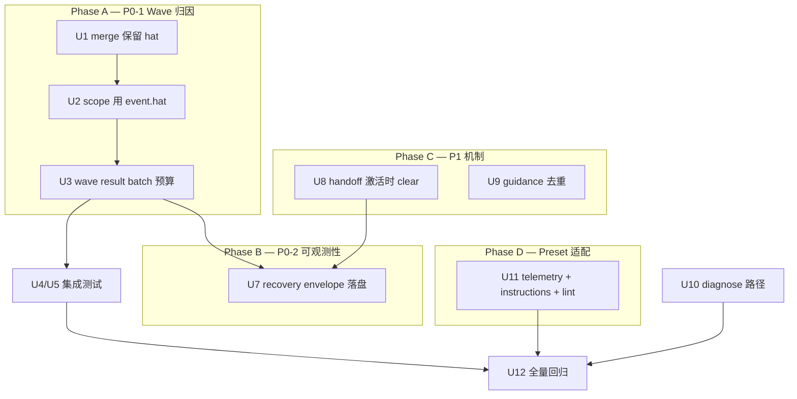

# fix: ce-executor-isolated wave 链路 + 诊断/可观测性全量修复

## Summary

以诊断报告 `docs/report/2026-06-13-ce-executor-isolated-wave-synthesizer-no-fire-diagnosis.md` 为 origin，**机制层兜底 + preset 适配**一并交付：

1. **P0-1（链路核心）**：wave merge 丢 `hat` + isolated scope 误用 `current_isolated_hat` → synthesizer 永不 fire
2. **P0-2 / P2-4（可观测性真空）**：scope drop / handoff timeout 只打 log，不进 `recovery.jsonl`（**drift.jsonl 本 incident 空为预期，不在此修**）
3. **P1-2（handoff 误报）**：consumer 长时运行期间 handoff deadline 未在 hat 激活时清除，导致假 timeout
4. **P1-4（guidance 重复）**：scratchpad 持久化无去重
5. **P1-1 / P2-2（preset 适配）**：executor 误 emit `build.done`、commit/checkbox 顺序 —— 强化 instructions，不改拓扑
6. **P2-1（diagnostics 路径）**：`ralph diagnose` / 文档明确 worktree session 解析；preset 默认开 runtime diagnosis

**P1-3**（progress.md 错位）为 P0-1 的级联症状，synthesizer 恢复后应自愈；U11 加轻量 preset 提醒。**P2-3**（DEC-004 agent artifact）不修改运行时产物，仅在 preset 加 worktree 测试说明。

---

## Diagnosis Verification（2026-06-13 复核）

| ID | 断言 | 复核 | 修复层 |
|----|------|------|--------|
| **P0-1** | 8× `review.dimension.done` merge 后 scope drop，synthesizer 0/8 | ✅ log L38–45 + `io.rs` 无 hat + `mod.rs:4788` 用 `current_isolated_hat` | 机制 U1–U3 |
| **P0-2** | recovery/drift.jsonl 全 0 行 | ✅ scope drop 只 `bus.publish(diagnostic)`，未 `record_recovery_envelope`；**drift 空为本 incident 预期**（无 U5 drift 阈值 breach），本计划只修 recovery | 机制 U7（recovery only） |
| **P1-1** | executor 6× `build.done` 落 jsonl 后被拒 | ✅ preset deny 生效，但 agent 仍尝试 | preset U11 |
| **P1-2** | handoff timeout 17m/4m | ✅ `expired()` 仅在 `process_output` 检查；`on_hat_activated` 仅在 jsonl publish 时调用，非 `build_prompt` | 机制 U8 |
| **P1-3** | progress.md `Active Wave: 空` | ✅ 级联：synthesizer/plan-gate 未跑 | P0-1 修后验证 + U11 提醒 |
| **P1-4** | scratchpad guidance 重复 2–3 次 | ✅ `persist_guidance_to_scratchpad` 无条件 append | 机制 U9 |
| **P2-1** | 主仓 vs worktree diagnostics 混淆 | ⚠️ `LoopContext::diagnostics_dir()` 已 worktree-local；空 recovery 主因是 U7 未写 + 未开 diagnosis | U7 + U10 + U11 |
| **P2-2** | commit checkbox 未勾 | agent 行为 | preset U11 |
| **P2-3** | DEC-004 根因可能不准 | agent artifact | 不修 decisions.md；U11 加 worktree 测试说明 |
| **P2-4** | handoff `task.resume` 不可见于 recovery | ✅ `process_output` handoff 分支未 `record_recovery_envelope` | 机制 U7 |

与 `docs/plans/2026-06-13-001-fix-wave-policy-gate-chain-plan.md` **正交**（policy reject 链 vs hat 归因链）。

---

## Problem Frame

一次 `ce-executor-isolated` worktree loop 在 wave 8/8 完成后死锁于 synthesizer，同时暴露 diagnostics 真空、handoff 假 timeout、guidance 重复等可观测性与 DX 问题。根因是 **基座机制未兑现 preset 契约**（provenance、recovery envelope、handoff 生命周期），而非 preset 拓扑配错。

策略：**机制修为主、preset 适配为辅** —— 不用 deny rule 堵洞，但 preset 要开观测、强化 agent 约束、跑验收。(see origin)

---

## Requirements Trace

| ID | 计划单元 |
|----|----------|
| P0-1 | U1, U2, U3, U4, U5, U6 |
| P0-2, P2-4 | U7 |
| P1-2 | U8 |
| P1-4 | U9 |
| P2-1 | U7, U10 |
| P1-1, P2-2, P1-3 | U11 |
| 全量回归 | U12 |
| 001-plan 正交 | 不改 policy gate 链 |

---

## Key Technical Decisions

### KTD-1～KTD-4（P0-1 wave 归因，不变）

- **KTD-1**：merge 写入 `"hat"`（worker provenance）
- **KTD-2**：isolated scope 有 `event.hat` 时用其校验
- **KTD-3**：同 `wave_id` result 批次豁免单 business-event 预算
- **KTD-4**：三层测试 + incident fixture

**不采用**：preset 加 `{review-coordinator, review.dimension.done}` deny（诊断方案 B）。

### KTD-5：scope drop / handoff escalation 必须写 recovery envelope

**决策**（`DiagnosisSource` 在实现前锁定，不新增 enum 值）：

| 路径 | Source | Outcome |
|------|--------|---------|
| isolated scope drop（`process_parse_result` ~4790） | `WorkflowGuard` | `escalated`（与 boundary_violation diagnostic 语义一致） |
| handoff escalation（`process_output` ~4193） | `StallRecovery` | `escalated` |

两处均调用 `record_recovery_envelope`，并保持现有 `event.isolation.boundary_violation` bus 双写。

**理由**：P0-2/P2-4 根因是只 warn + bus diagnostic；`ExecutionContract` 偏 payload/schema，不适合 scope 误归因。**drift.jsonl 不在本计划范围**——本 incident 未触发 drift 指标，空文件是预期。

### KTD-6：handoff deadline 在 consumer hat **激活时**清除

**决策**：在 isolated **`build_prompt` 入口**（即将执行的 `hat_id` 选定处，`mod.rs` ~3171 `last_active_hat_ids = vec![hat_id]` 附近）调用 `handoff_tracker.on_hat_activated(hat_id.as_str())`。**不在** `process_output` 里 `current_isolated_hat = Some(...)`（~4223）处 clear——那里记录的是**刚跑完**的 hat，不是即将运行的 consumer。保留 jsonl publish 路径上的 clear 作为双保险。

**理由**：P1-2 的 17m 不是 timeout 配错（默认 30s），而是 executor 单次 iteration 运行 16+ 分钟期间 deadline 从未清除——consumer 已 `build_prompt` 但仍被记 pending。

### KTD-7：guidance 去重在 persist + prompt 两层

**决策**：`persist_guidance_to_scratchpad` 跳过与文件尾部或本 batch 已见 payload 完全相同的 entry；`update_robot_guidance` 对 `robot_guidance` vec 去重。

**理由**：P1-4 是基座 append-only，与 Telegram/interact 重试无关。

### KTD-8：preset 适配 = 观测默认开 + agent 硬约束 + 验收，不改拓扑

**决策**：`ce-executor-isolated` 增加 `telemetry.runtime_diagnosis.enabled: true`（及 `write_artifacts`）；executor instructions 加 NEVER emit 清单；**同步 4 处**（见 U11 Files）；**不改** publishes/triggers/aggregate。

---

## High-Level Technical Design

---

## Scope Boundaries

**In scope**：上表全部 P0/P1/重要 P2；机制 + preset 适配；en/zh/schema preset 同步（telemetry + instructions，见 U11）；`scripts/ralph-zsh-plugin.zsh` 无需改（无 preset 重命名）。

**Out of scope**：
- preset 拓扑 patch（deny rule 堵洞、改 publishes/triggers）
- `enforce_wave_isolated_scope` dispatch 路径语义变更
- 修改 worktree 内 agent 运行时产物（decisions.md、progress.md 手工修）
- P2-3 对 DEC-004 内容的自动更正
- **drift.jsonl 写入/修复**（本 incident 未 breach drift 阈值；recovery 修好后 diagnose 仍可能显示 drift=0，属预期）

### Deferred to Follow-Up Work

- BDD scenario `wave-isolated-synthesizer.yml`（若 U6 fixture 已够则延后）
- `/ce-compound` 写入 `docs/solutions/integration-issues/`

---

## Phased Delivery

| Phase | 单元 | 交付标准 | PR 建议 |
|-------|------|----------|---------|
| A | U1–U6 | synthesizer 8/8 fire；incident fixture 绿 | **PR-1**（机制核心，优先合） |
| B | U7, U10 | 负例 scope drop / handoff 可见于 recovery.jsonl；diagnose 可定位 worktree session | **PR-2**（可观测性） |
| C | U8, U9 | 长 iteration 无假 handoff timeout；scratchpad 无重复 guidance | PR-2 或 PR-3 |
| D | U11 | preset check 绿；executor build.done 误 emit 率下降（靠 instruction + 既有 deny） | **PR-3**（preset） |
| E | U12 | `./scripts/run-tests.sh` 全绿 | 每 PR 跑子集；最终全矩阵 |

---

## Implementation Units

### U1. Merge 保留 worker hat provenance

**Goal**：wave merge 写入 main events file 时不再丢失 `hat`。

**Requirements**：P0-1, KTD-1

**Dependencies**：无

**Files**：
- `crates/ralph-cli/src/loop_runner/wave/io.rs`
- `crates/ralph-cli/src/loop_runner/wave/dispatcher.rs`

**Approach**：
- `merge_wave_results_to_events_file(..., default_source_hat: &str)`
- JSONL 写入 `"hat": event.source.as_deref().unwrap_or(default_source_hat)`
- synthetic failure 记录用 `default_source_hat`

**Test scenarios**：
- Happy path：merge 后每行含正确 `hat`
- Edge case：`source` 空 → 回退 `default_source_hat`
- Regression：duplicate index 警告行为不变

**Verification**：`cargo nextest run -p ralph-cli -- merge_wave`

---

### U2. Isolated scope 尊重 event.hat provenance

**Goal**：re-read 用 `event.hat` 做 scope 校验。

**Requirements**：P0-1, KTD-2

**Dependencies**：逻辑上 U1+U2 缺一不可（无 hat 则 scope 仍 drop）；**单测 RED 可在 JSONL/fixture 手写 `hat`，不阻塞于 U1 编译顺序**

**Files**：
- `crates/ralph-core/src/event_loop/mod.rs`（`process_parse_result` ~4761–4943）
- `crates/ralph-core/src/event_loop/tests/wave_result_isolated_scope.rs`（新建）

**Approach**：
- `scope_hat = event.hat.as_deref().map(HatId::new).unwrap_or(isolated_hat.clone())`；`isolated_publish_allowed(&scope_hat, topic)`
- **管道顺序（写死）**：同函数内 **isolated scope（~4761）→ origin guard（~4990）→ policy**。scope 先于 origin guard，单靠 origin 救不了 merge 丢 hat；U2 必须改 scope 层。实现后加组合测：`event.hat` 合法但 origin 拒 / policy 拒 的路径仍 fail-closed。

**Test scenarios**：
- Happy path：JSONL 含 `hat=dimension-reviewer` + `current_isolated_hat=review-coordinator` → accept
- Error path：无 hat → drop（证明 merge 写 hat 的必要性，可与 U1 联调）
- Error path：`hat=executor, topic=build.done` → drop
- Combo：`event.hat` 通过 scope 但 hat 未注册 → origin guard reject（scope 不越权代审）

**Verification**：`cargo nextest run -p ralph-core -- wave_result_isolated`

---

### U3. Wave result 批次豁免单 business-event 预算

**Goal**：同 `wave_id` 的 N 个 result 全部 accept。

**Requirements**：P0-1, KTD-3

**Dependencies**：U2

**Files**：同 U2

**Approach**：wave result 组（有 `wave_id`、非 dispatch trigger）KTD-2 通过后整批 accept，计一次 business budget

**Test scenarios**：
- Happy path：8× 同 wave_id → 8 accept
- Edge case：wave result + 普通 business event 同 batch → 后者仍受单 event 限制

**Verification**：同 U2 测试文件

---

### U4. ralph-core E2E：isolated merge + re-read → synthesizer

**Goal**：全路径证明 synthesizer pending 8/8。

**Requirements**：P0-1, KTD-4

**Dependencies**：U1–U3

**Files**：`wave_result_isolated_scope.rs`, `tests/mod.rs`

**Execution note**：先 RED 后 GREEN。

**Test scenarios**：
- Happy path：8/8 pending
- Edge path：7/8 不 premature activate
- Regression：8 行 hat=review-coordinator → 8 drop

**Verification**：`cargo nextest run -p ralph-core -- wave_result_isolated`

---

### U5. ralph-cli isolated wave 集成回归

**Goal**：扩展 `u3_wave_merge_*` 为 isolated 拓扑。

**Requirements**：P0-1, KTD-4

**Dependencies**：U1–U3

**Files**：`crates/ralph-cli/src/loop_runner/tests.rs` (~10758+)

**Test scenarios**：
- Happy path：isolated 2-worker wave → aggregator fire
- Regression：现有 non-isolated `u3_wave_merge_*` 仍 pass

**Verification**：`cargo nextest run -p ralph-cli --bin ralph -- u3_wave`

---

### U6. Incident fixture 回归

**Goal**：worktree 证据转 fixture，锁死 P0-1。

**Requirements**：诊断 §6.5

**Dependencies**：U1–U5

**Files**：`crates/ralph-core/tests/fixtures/wave-isolated-dimension-done/`

**Approach**：从 worktree 抽 8 行 anonymized JSONL + minimal hat YAML；replay assert 0 scope drop

**Verification**：fixture 测试 + checklist 项 1–3（见 U12）

---

### U7. Recovery envelope：scope drop + handoff escalation 落盘

**Goal**：P0-2 / P2-4 —— 反压点写入 `recovery.jsonl`，不只 stderr。

**Requirements**：P0-2, P2-4, KTD-5

**Dependencies**：无（可与 Phase A 并行，但 U12 前完成）

**Files**：
- `crates/ralph-core/src/event_loop/mod.rs`（isolated drop ~4790；handoff escalation ~4193）
- `crates/ralph-core/src/diagnosis/responder.rs`（如需新 source 映射）
- `crates/ralph-core/src/event_loop/tests/wave_result_isolated_scope.rs` 或 `topic_format_recovery.rs` 模式

**Approach**：
- isolated scope drop：`DiagnosisSource::WorkflowGuard`，outcome `escalated`，`record_recovery_envelope`（KTD-5）
- handoff escalation：`DiagnosisSource::StallRecovery`，outcome `escalated`，与 synthesized `task.resume` 关联
- 保持现有 `event.isolation.boundary_violation` bus 事件（双写）

**Patterns to follow**：`wave_isolated_scope.rs` diagnostics 测试；`topic_format_recovery.rs` recovery.jsonl 断言

**Test scenarios**（**与 U1–U3 happy path 分离**）：
- **负例 / 修前回归**：fixture 或单测故意 **无 `hat`**（或 `hat=review-coordinator`）→ 8× scope drop → recovery.jsonl ≥ 1 行，`ralph diagnose --session latest` 可见
- **Happy path（U1–U3 已绿）**：8× `hat=dimension-reviewer` merge+re-read → **0 scope drop**，recovery **不要求** scope 行（handoff 负例另测）
- handoff escalation（独立单测，mock 30s deadline）：consumer 从未 `build_prompt` → recovery 含 handoff/stall 语义
- Edge case：diagnostics disabled 时不 panic（no-op）

**Verification**：`cargo nextest run -p ralph-core -- recovery_envelope` 或扩展现有 isolation 测试

---

### U8. Handoff tracker：consumer 激活时清除 pending

**Goal**：P1-2 —— 长 iteration 期间不误报 handoff timeout。

**Requirements**：P1-2, KTD-6

**Dependencies**：无

**Files**：
- `crates/ralph-core/src/event_loop/mod.rs`（isolated **`build_prompt` 入口** ~3171 `last_active_hat_ids`，**非** `process_output` ~4223 `current_isolated_hat`）
- `crates/ralph-core/src/event_loop/tests/handoff_dispatch.rs`

**Approach**：在 isolated `build_prompt(hat_id)` 选定即将执行的 hat 时调用 `handoff_tracker.on_hat_activated(hat_id.as_str())`。`process_output` 末尾的 `current_isolated_hat = Some(completed_hat)` 仅记录**已完成** iteration，**禁止**在此处 clear handoff。

**Test scenarios**：
- Happy path：accept handoff → `build_prompt(executor)` → pending 清空 → 模拟长 iteration 后 `expired()` 空
- Regression：consumer 从未进入 `build_prompt` → 30s 后仍 escalate
- Regression：在 `process_output` 设置 `current_isolated_hat` **不应**清除 handoff pending
- Integration：对照 incident 时间线，executor 运行中不应产生 `task.resume` handoff timeout

**Verification**：`cargo nextest run -p ralph-core -- handoff_dispatch`

---

### U9. Human guidance scratchpad 去重

**Goal**：P1-4 —— 相同 guidance 不重复 append。

**Requirements**：P1-4, KTD-7

**Dependencies**：无

**Files**：
- `crates/ralph-core/src/event_loop/mod.rs`（`persist_guidance_to_scratchpad`, `update_robot_guidance`）
- `crates/ralph-core/src/event_loop/tests/`（新建 `guidance_dedup.rs` 或扩 hatless 测试）

**Approach**：
- persist 前：读 scratchpad 尾部或维护 session 内 `HashSet` 跳过相同 payload
- `update_robot_guidance`：extend 前去重

**Test scenarios**：
- Happy path：同 payload 连发 3 次 → scratchpad 1 条
- Edge case：不同 payload 仍各写一条
- Edge case：prompt 中 ROBOT GUIDANCE 编号正确

**Verification**：`cargo nextest run -p ralph-core -- guidance_dedup`

---

### U10. Diagnostics 路径与 worktree session 解析

**Goal**：P2-1 —— 操作者可从正确 workspace 找到 session。

**Requirements**：P2-1

**Dependencies**：U7（recovery 有内容才可 diagnose）

**Files**：
- `crates/ralph-core/src/diagnosis/reporter.rs`（若需 `--diagnostics-root` 与 loops.json workspace 对齐）
- `crates/ralph-cli/src/commands/diagnose.rs`（若有）
- `docs/guide/runtime-diagnosis.md`（worktree 段落，仅当行为变更时）

**Approach**：
- 确认 `EventLoop::new` 已用 `context.workspace()` 建 collector（`mod.rs:1008`）—— 若 worktree loop 仍写主仓，修 CLI `loop_context` 传递
- `ralph diagnose` 文档/帮助：worktree loop 用 `--diagnostics-root <worktree>/.ralph/diagnostics` 或从 `loops.json` workspace 字段推断

**Test scenarios**：
- Happy path：worktree `LoopContext` → diagnostics 文件落在 worktree `.ralph/diagnostics/`
- Happy path：`resolve_session(latest)` 在 worktree root 找到 U7 写入的 recovery

**Verification**：loop_runner 现有 diagnostics 测试 + 新 worktree path 单测

---

### U11. Preset 适配（非拓扑补丁）

**Goal**：机制兜底 + preset 可观测/agent 约束/验收。

**Requirements**：P1-1, P2-2, P1-3, KTD-8

**Dependencies**：U1–U3 完成后验收；U7 可与 telemetry 并行

**Files**（builtin preset 同步 **5 处**，无 rename 故 zsh 插件不改）：
- `presets/en/ce-executor-isolated.yml`
- `presets/zh/ce-executor-isolated-zh.yml`
- `presets/schemas/ce-executor-isolated.yml`
- `presets/manifest.yml`（`embedded:` 列表不变则仅内容 hash 变）
- `crates/ralph-cli/src/presets.rs`（`PRESETS` embedded content）
- `presets/index.json`（若对用户可见字段变）
- `CLAUDE.md` / `AGENTS.md`（无需改 preset 列表，无 rename）

**Approach**（**不改** publishes/triggers/deny topology）：
1. **Telemetry**：`telemetry.runtime_diagnosis: { enabled: true, write_artifacts: true, prompt_injection_enabled: true }`（或项目等价字段）
2. **Executor HARD RULES**（P1-1, P2-2）：
   - NEVER emit `build.done` / `test.done` / `lint.done` — 验证结果只进 `work.done` payload
   - 必须先 `git commit` 再 emit `work.done`；更新 `.agents/scratchpad/.../progress.md` checkbox
3. **Review-coordinator**（P1-3 轻量）：wave 开始后更新 progress `Active Wave: <wave_id>`；synthesizer 完成后清空
4. **Worktree testing note**（P2-3）：executor instructions 注明 worktree HEAD ≠ main repo clean HEAD
5. **验收**：`ralph preset check -H builtin:ce-executor-isolated`；evaluate-presets 或 dogfood 短 loop

**Test scenarios**：
- Happy path：preset lint 0 error
- Test expectation: none — preset YAML（靠 lint + dogfood）

**Verification**：`cargo run --bin ralph -- preset check -H builtin:ce-executor-isolated`

---

### U12. 全量回归矩阵

**Goal**：不引入回归；证据场景全 cover。

**Requirements**：用户约束

**Dependencies**：U1–U11

**Checklist**（实现者执行）：
1. `cargo nextest run -p ralph-core -- wave_result_isolated`
2. `cargo nextest run -p ralph-core -- wave_isolated_scope`
3. `cargo nextest run -p ralph-core -- handoff_dispatch`
4. `cargo nextest run -p ralph-core -- guidance_dedup`
5. `cargo nextest run -p ralph-cli --bin ralph -- u3_wave`（3 跑）
6. `cargo nextest run -p ralph-core -- wave_policy_rejection`（001-plan 回归）
7. `./scripts/run-tests.sh`
8. 可选 dogfood：worktree 短 loop，assert log 无 `hat=review-coordinator topic=review.dimension.done` drop

**Verification**：全部绿 + `/ce-compound` 记录 incident solution

---

## Risks & Dependencies

| 风险 | 缓解 |
|------|------|
| KTD-2 伪造 hat | origin guard + deny rules；merge 行由 orchestrator 写 |
| U7 双写 envelope 风暴 | responder dedup / 同 turn 合并 |
| U8 过早 clear handoff | 仅在 isolated **`build_prompt` ~3171** clear；**禁止**在 `process_output` ~4223；coordinator 模式不变 |
| preset telemetry 增磁盘 | `write_artifacts` 可配；默认开是为 ce-executor 生产可观测 |
| 与 001-plan 冲突 | 两计划都可能改 `process_parse_result` 后半段（policy rejection surfacing）；**实现前变基/合并 001 分支**，或约定 mod.rs 改动分区（scope ~4761 vs policy ~4990+）；U12 跑 `wave_policy_rejection` |
| U7 测与 U1–U3 期望冲突 | U7 用无 hat / 错 hat **负例**测 recovery；U1–U3 绿后 happy path **0 drop** |
| U8 落点误用 process_output | KTD-6 / U8 已锁定 `build_prompt` ~3171；code review 重点 |

---

## Sources & Research

- Origin: `docs/report/2026-06-13-ce-executor-isolated-wave-synthesizer-no-fire-diagnosis.md`
- Adjacent: `docs/plans/2026-06-13-001-fix-wave-policy-gate-chain-plan.md`
- Learnings: `docs/solutions/integration-issues/ce-executor-wave-emission-must-batch-in-single-emit-2026-06-09.md`
- Code: `io.rs`, `mod.rs` (scope/handoff/guidance), `handoff_tracker.rs`, `loop_context.rs`
- Evidence: worktree `events-20260613-012231.jsonl`, `ralph-2026-06-13T09-22-30-798-48392.log`

---

## Open Questions

- **U10**：若审计确认 worktree diagnostics 已正确，U10 缩为文档-only，不改代码。
- **001-plan 合并顺序**：若 001 未合入 main，本分支应先 rebase 001 再动 `mod.rs`，避免 scope/policy 双改冲突。
