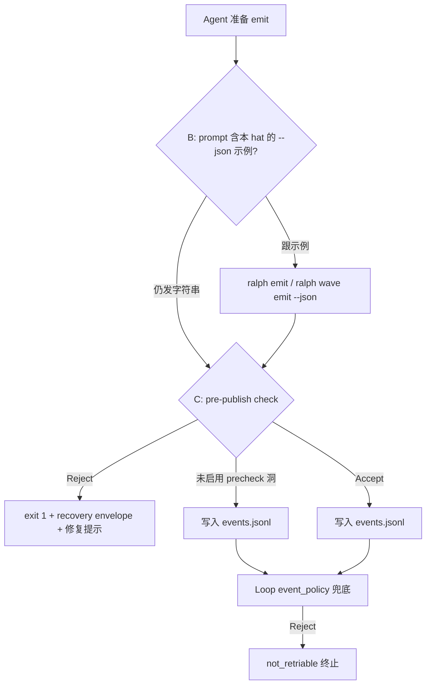

# Schema-Aware Emit Instructions + CLI Pre-Publish Check（B+C）实施计划

## 0. 策略拍板

用户选择 **B+C（最稳妥）**：

| 层 | 代号 | 作用 | 拦截点 |
|----|------|------|--------|
| **B** | Prompt 教对 | 每个 hat 的 prompt 只注入**自己 `publishes`** 的 `--json` 示例 | agent 读 prompt 时 |
| **C** | Pre-publish check | `ralph emit` / `ralph wave emit` **写入 events.jsonl 之前**跑 schema 校验，失败则 exit ≠ 0、**不落盘** | CLI emit + wave emit 路径 |
| **D** | 直写 jsonl 防护（软+硬） | preset / prompt 禁止旁路 + loop 读盘兜底（见 §4.6） | instructions + event_policy |
| （已有） | Loop read gate | `event_policy` 读 jsonl 时二次校验 | event loop |

**Pre-publish check** = 用户强调的「发之前再拦一道」：坏 payload **绝不能进 jsonl**，更不能等到 loop 读盘后以 `not_retriable` 杀掉整个 loop。

### 为什么 B  alone 不够

2026-06-15 事故里 coordinator 仍可能无视 prompt；且 `build_custom_hat` 的 `<summary>` 模板与 schema 矛盾。

### 为什么现有 C 没拦住这次事故

`ralph emit` 已有 policy precheck（`emit.rs:357-451`），但 loop 内 agent 子进程通常 **不带 `-H builtin:...`**，只读 `ralph.yml`。若 `ralph.yml` 未内联 `event_policy.schemas`，`resolve_policy_check_mode` 返回 `Skip` → 中文字符串直接落盘 → loop 读盘后才 `payload_contract_violation` + `not_retriable`。

集成测试用 `-H builtin:ce-executor-isolated emit ...` 能拦住，**生产路径（loop 子进程裸 `ralph emit`）与测试路径不一致**——这是 C 要补的洞。

---

## 1. 背景与目标

### 1.1 背景

2026-06-15 `ce-executor-isolated` iteration 1：`coordinator` 发 `work.ready`，payload 为中文长字符串，schema 要求 `json_object`，loop `not_retriable` 终止。

### 1.2 目标

建立 **两道主动防线 + 一道兜底**：



### 1.3 硬约束（用户拍板）

> **每个 hat 只能看到自己应该发的 payload JSON。**

- **B（prompt）**：`build_publish_emit_section` 只遍历 `hat.publishes`。
- **C（错误提示）**：pre-publish 拒绝时，fix hint 只展示 **当前 `RALPH_CURRENT_HAT` 对该 topic 有 publish 权限** 的 `--json` 模板；不得把其他 hat 的 topic 示例塞进错误信息（防越权学习）。

### 1.4 可靠性边界（诚实声明）

本计划对 **agent 经 `ralph emit` / `ralph wave emit` 发事件** 的主路径提供 B+C 硬保障；**不声称 100%**。残余边界见 §4.6、§11。

### 1.5 非目标

- 不改 loop 侧 `event_policy` 校验语义（保留兜底）。
- 不把消费侧 `schema_refs` 混进 emit 示例。
- 诊断 `field: null` 人性化（低优先级，另 PR）。
- 不为 `echo >> events.jsonl` 做内核级/filesystem 拦截（成本过高；用 §4.6 软约束 + loop 兜底）。

---

## 2. Schema 事实源

| 文件 | 角色 |
|------|------|
| `presets/en/ce-executor-isolated.yml` → `event_loop.event_policy.schemas` | **运行时事实源** |
| `presets/schemas/ce-executor-isolated.yml` | **参考副本**（须与内联字节一致；见 §4.5 Phase 3 lint）；顶部 hat→topic 映射表是权限边界对照 |
| `presets/zh/ce-executor-isolated-zh.yml` | 中文 preset，schema 与 en 对齐 |

B/C 均读 **`EventPolicyConfig.schemas`**（来自 preset 内联），运行时不读 `presets/schemas/*.yml` 磁盘。参考文件由 **CI lint 强制与内联一致**（复用 `ce-executor-wave` 已有测试模式，`presets.rs:3725-3743`）。

---

## 3. 现状与缺口

### 3.1 B 侧：`build_custom_hat` 教错

`instructions.rs:163` — 全局 `<summary>` 模板与 `json_object` schema 矛盾。

### 3.2 C 侧：precheck 存在但未闭合 loop 子进程路径

| 组件 | 现状 | 缺口 |
|------|------|------|
| `policy_check.rs` | `require_policy_check_for_cli_emit: true` 时 Enforce | 依赖 config 已合并 preset `event_policy` |
| `emit.rs` precheck | 校验 `args.payload` 原始字符串 | 未校验**序列化后**将写入 jsonl 的 `payload_value`（`looks_like_json` 分支之后） |
| `loop_runner/execution.rs` | 注入 `RALPH_CURRENT_HAT` 等 | **未注入** preset / hats source → 子进程 emit 拿不到 schema |
| `integration_emit_policy.rs` | `-H builtin:... emit` 可拒 | 与 loop 内 `ralph emit`（无 `-H`）行为不一致 |
| **`wave.rs`** | `resolve_policy_check_mode` + `validate_batch_against_config` | **与 emit.rs 同源 Skip 洞**；dimension-reviewer 等 wave worker 子进程裸 `ralph wave emit` 时 schema 可能未合并 |
| `loop_runner/wave/dispatcher.rs` | wave worker 注入 `RALPH_WAVE_*` / `RALPH_EVENTS_FILE` | **未注入** `RALPH_HATS_SOURCE`（与主 hat 路径同缺口） |
| Agent 旁路 | `echo`/`cat`/`heredoc` 直写 jsonl | **完全绕过 C**；仅靠 loop 读盘 gate（可能 `not_retriable`） |
| Schema 双份 | `presets/schemas/*.yml` vs preset 内联 | 仅人工 lockstep；`ce-executor-wave` 有对等测试，**`ce-executor-isolated` 尚无** |

### 3.3 Hat 可见性矩阵（B 与 C 共用）

| hat | prompt / 错误提示允许的 emit topics |
|-----|-------------------------------------|
| coordinator | `work.ready`, `work.failed` |
| executor | `work.done`, `work.failed` |
| plan-gate | `queue.advance`, `work.ready`, `plan.complete`, `plan.blocked` |
| … | （完整表见 `presets/schemas/ce-executor-isolated.yml` L21-32） |

---

## 4. 设计方案

### 4.1 共享模块：`emit_schema_hint`（ralph-core 新增）

抽一层 **单一事实源**，供 B（prompt）和 C（CLI 错误）复用，避免两处示例漂移：

```rust
// crates/ralph-core/src/emit_schema_hint.rs（新文件）

/// 为单个 topic 生成 copy-pasteable `ralph emit ... --json` 行。
pub fn format_emit_json_example(topic: &str, schema: &EventSchema) -> String { ... }

/// 为 hat 生成完整 §3 REPORT 块（B 用）。
pub fn build_publish_emit_section(hat: &Hat, schemas: &HashMap<String, EventSchema>) -> String { ... }

/// C 用：仅当 hat 在 publishes 里声明了 topic 时返回示例。
pub fn fix_hint_for_hat_topic(
    hat_id: &str,
    hat: &Hat,
    topic: &str,
    schema: &EventSchema,
) -> Option<String> { ... }
```

占位符规则见原 §4.3（required_fields 启发式；optional 字段单独注明）。

### 4.2 B：`InstructionBuilder` schema-aware

（与原计划相同，略）

- `InstructionBuilder::with_publish_schemas(...)`
- `EventLoop` 构造传入 `event_policy.schemas`
- `build_custom_hat` 用 `build_publish_emit_section` 替换 `<summary>` 模板
- 无 schema → 回退旧 summary 行为

### 4.3 C：Pre-publish check 三层加固

#### C1 — Loop 子进程必带 preset 上下文

**`loop_runner/execution.rs::inject_hat_execution_env`** 新增：

```text
RALPH_HATS_SOURCE=builtin:ce-executor-isolated   # 或 loop 启动时解析的 HatsSource 字符串
```

**`emit.rs` config 加载**：若 CLI 无 `-H` 但 env 有 `RALPH_HATS_SOURCE`，走 `load_config_for_preflight_sync(..., Some(&parsed))`，与 `ralph -H builtin:... emit` 等价合并 `event_policy`。

备选/叠加：`ralph.yml` 通过 `merge_hats_overlay` 已含完整 `event_policy` 时可不依赖 env——但 **env 注入是 loop 场景的硬保证**，不依赖用户 ralph.yml 是否抄全 preset。

#### C2 — 校验「将要落盘的 payload」

调整 `emit.rs` 顺序（关键）：

```
1. 解析 payload → payload_value（含 looks_like_json 逻辑）
2. pre-publish check：把 payload_value 序列化成校验输入（json_object 必须是 Object）
3. validate_event_with_hat(topic, serialized, policy, state, hat)
4. 通过后才 OpenOptions::append 写 jsonl
```

**今天的问题**：precheck 在步骤 1 之前跑 `args.payload`，且 check_mode 可能 Skip；即使跑了，也与最终写入的 `Value::String` 可能不同步。C2 保证 **校验对象 = 落盘对象**。

对 `json_object` schema：

- 落盘形态为 `Value::String`（非 `{` 开头的中文）→ **硬拒**，reason `payload_type_mismatch`
- 缺 required_fields → 拒，reason `missing_required_field`（agent 可修 payload 重试，不必杀 loop）

#### C3 — 失败输出：hat 作用域 fix hint

拒绝时 stderr（或 `--format json` 错误体）包含：

```text
Event rejected before write (pre-publish check).
Topic 'work.ready' requires JSON object payload.
Your hat 'coordinator' may publish: work.ready, work.failed

Fix — run exactly:
  ralph emit work.ready --json '{"plan_name":"...","plan_path":"...",...}'

Required fields: plan_name, plan_path, task_id, task_key, step, complexity
```

- 若 agent 试图发 `work.done` 但 hat 是 coordinator → 先被 `topic_deny_rules` / origin 拒；fix hint **不展示** `work.done` 示例。
- 写 `recovery.jsonl` envelope，`source: cli_emit`（已有 `write_cli_emit_recovery_envelope`）。

#### C4 — `require_policy_check_for_cli_emit` 在 loop 内必为 Enforce

验收：`RALPH_HATS_SOURCE` + `RALPH_CURRENT_HAT` 存在 + `.ralph/` 存在 → **不得 Skip**（除非显式 `--unsafe-no-policy-check` 且 preset 允许）。

**fail-closed 细则（写死，不留后门）：**

| 条件 | 行为 |
|------|------|
| `RALPH_HATS_SOURCE` 存在但解析失败 | `bail!`，**不得** Skip |
| preset / config 加载失败且 `.ralph/` 存在 | `bail!`（与现有「ralph.yml 坏掉则 fail closed」一致） |
| 无 loop 上下文、无 preset、无 `event_policy` | 允许 Skip（autoresearch / debug 兼容） |

`Skip` 分支保留 `tracing::info`（2026-06-14 报告 P2-2）。

#### C5 — `ralph wave emit` 与 `ralph emit` 共用 C1/C2/C4（**本计划必做，非可选项**）

`wave.rs` 与 `emit.rs` 均经 `policy_check.rs`；只修 `emit.rs` 会在 **dimension-reviewer → `review.dimension.done`** 等 wave 路径复发。

**实施要求：**

1. **配置加载**：抽 `resolve_emit_policy_config(workspace, cli_hats_source) -> Option<RalphConfig>`（或等价 helper），`emit.rs` 与 `wave.rs` **共用**；均读取 `RALPH_HATS_SOURCE`（CLI 无 `-H` 时）。
2. **C1 注入范围**：`inject_hat_execution_env`（主 hat）**与** `loop_runner/wave/dispatcher.rs` wave worker env 块 **均**写入 `RALPH_HATS_SOURCE`（值为 loop 启动时解析的 `HatsSource::label()`，如 `builtin:ce-executor-isolated`）。
3. **C2 落盘形态**：`wave emit` 在 batch 写入 candidate-events **之前**，对每个 payload 走与 `emit.rs` 相同的「序列化 → validate_event_with_hat」路径（`validate_batch_against_config` 内部对齐，或先 normalize 再验）。
4. **C3 fix hint**：wave 批量失败时，每条 violation 附带 `fix_hint_for_hat_topic`（按 `RALPH_CURRENT_HAT` + topic；wave topic 如 `review.dimension.done` 仅 dimension-reviewer 可见）。
5. **测试**：`integration_emit_policy.rs` 或新建 wave 集成测 — `RALPH_HATS_SOURCE` + `RALPH_WAVE_WORKER=1` + 坏 payload → exit ≠ 0，candidate-events 无脏行。

### 4.5 Schema 参考副本 lockstep（消灭双份维护漂移）

**问题**：`presets/schemas/ce-executor-isolated.yml` 与 `presets/en/ce-executor-isolated.yml` 内联 `event_policy.schemas` 人工同步，长期必分叉。

**方案（复用仓库已有先例）**：

`presets.rs` 中 `test_ce_executor_wave_reference_schema_matches_inline_schema`（L3725-3743）已证明模式可行。本计划 **照抄同一模式** 覆盖 `ce-executor-isolated`（及 `ce-executor-isolated-zh` 若内联 schemas 独立存在）。

```rust
// crates/ralph-cli/src/presets.rs — 新增
#[test]
fn test_ce_executor_isolated_reference_schema_matches_inline_schema() {
    // inline event_loop.event_policy.schemas
    // vs read_root_schema("ce-executor-isolated.yml")
    assert_eq!(inline_schemas, reference_schemas, "...");
}
```

**附加：`ralph preset check --strict`**（`preset_lint`）增加 `check_schema_reference_parity`：

- 对 manifest 中声明了 `presets/schemas/<name>.yml` 的 builtin preset，解析内联 schemas 与参考文件 **结构化相等**（topic 集合、`required_fields` 顺序无关但集合相等、`payload` 类型一致）。
- `presets check` 失败即 CI 红，**改 schema 必须同 PR 改两处**。

**编辑约定（写入 CONTRIBUTING / 计划附录）**：

1. 改 schema → 先改 `presets/en/<preset>.yml` 内联段（运行时事实源）
2. 同步 `presets/schemas/<preset>.yml` 参考副本（去掉文件头注释后 YAML 体与内联 schemas 段一致）
3. 同步 `presets/zh/*-zh.yml`（若适用）
4. `cargo nextest run -p ralph-cli --bin ralph -- ce_executor_isolated_reference_schema` 绿

不采用「从 preset 自动生成 reference 文件」作为首版（避免 build.rs 复杂度）；**lint 对等**即可闭环。

### 4.6 直写 jsonl 旁路（D 层 — 软约束 + 既有硬兜底）

**事实**：agent 用 `echo '...' >> .ralph/events.jsonl` / heredoc **完全绕过** CLI precheck（C 无效）。本计划 **不实现** filesystem 级拦截。

**三层缓解（均纳入本计划）：**

| 层 | 措施 | 落点 |
|----|------|------|
| **软 — prompt** | `build_custom_hat` §3 REPORT 增加硬句：`MUST NOT append or write to events.jsonl directly; use ralph emit / ralph wave emit only` | `instructions.rs` / `emit_schema_hint` 生成的 REPORT 块 |
| **软 — preset** | `ce-executor-isolated` 各 hat instructions「Event Publishing」段交叉引用同一句；review-coordinator 已有「Always re-run with ralph wave emit」类文案，统一措辞 | Phase 5 |
| **硬 — loop 兜底** | 保持 `event_policy` enforce；旁路写入的坏行仍被拒（现有行为）。**本计划不改为** `not_retriable` 降级——旁路属于违规操作，后果自负 | 不改语义，文档写明 |
| **可观测** | loop 读盘拒绝对 `payload_contract_violation` 的 recovery 消息区分 `provenance: direct_write`（若 jsonl 行无 `ralph emit` 典型字段且 hat 缺失）— **可选 P2**，首版仅在 §11 记录 | 非 P0 |

**验收**：AC-10 — coordinator prompt 含「禁止直写 jsonl」句；不新增 AC「拦截 echo」（做不到）。

---

## 5. 实施步骤

### Phase 0 — 共享 hint 模块 + 单测（0.5d）

1. 新增 `crates/ralph-core/src/emit_schema_hint.rs`
2. 表驱动测试：coordinator 只见 `work.ready`/`work.failed`；executor 只见 `work.done`；`fix_hint_for_hat_topic` 对越权 topic 返回 `None`

### Phase 1 — B 接线（0.5d）

1. `InstructionBuilder::with_publish_schemas`
2. `EventLoop` 传入 schemas
3. 替换 `build_custom_hat` must_publish 块
4. 更新 `instructions.rs` / `build_prompt.rs` 测试

### Phase 2 — C Pre-publish check：`ralph emit` + `ralph wave emit`（1.5d）

1. **共享 config helper**：`policy_check.rs` 或新模块 — `load_policy_config_for_cli_emit(workspace, cli_hats)`，读 `RALPH_HATS_SOURCE` + `ralph.yml` + optional `-H`
2. **C1**：`inject_hat_execution_env` + `wave/dispatcher.rs` worker env 注入 `RALPH_HATS_SOURCE`
3. **C2 emit**：`emit.rs` precheck 移到 payload 序列化之后
4. **C2 wave**：`wave.rs` batch 写入前对齐同一校验语义（共用 helper）
5. **C3**：`emit` / `wave` 拒绝对接 `fix_hint_for_hat_topic` + recovery envelope
6. **C4**：`resolve_policy_check_mode` fail-closed 细则（§4.3 C4 表）
7. **集成测试** `integration_emit_policy.rs`（及 wave 测）：
   - `RALPH_HATS_SOURCE` + 无 `-H` + 字符串 `work.ready` → exit ≠ 0，jsonl 无记录
   - 合法 `--json` → 落盘成功
   - `RALPH_HATS_SOURCE` + `RALPH_WAVE_WORKER=1` + 坏 `review.dimension.done` batch → exit ≠ 0
   - `RALPH_HATS_SOURCE` 非法字符串 → exit ≠ 0，不 Skip

### Phase 3 — preset_lint + schema 参考副本 parity（0.5d，P0）

1. **`check_publishes_have_schema`**：每个 `publishes` topic 必须在 `event_policy.schemas` 有定义（enforce preset）
2. **`check_schema_reference_parity`**（§4.5）：`presets/schemas/ce-executor-isolated.yml` ↔ 内联 schemas 结构化相等
3. **`presets.rs` 单元测试**：`test_ce_executor_isolated_reference_schema_matches_inline_schema`（镜像 wave 测试）
4. `ralph preset check -H builtin:ce-executor-isolated --strict` 纳入 CI / `run-tests.sh` 路径说明

### Phase 4 — 集成验证（0.5d）

```bash
cargo nextest run -p ralph-core -- emit_schema_hint
cargo nextest run -p ralph-core -- instructions
cargo nextest run -p ralph-core -- build_prompt
cargo nextest run -p ralph-cli --bin ralph -- policy_check
cargo nextest run -p ralph-cli --bin ralph -- cli_emit   # 若测试名不同则用 integration_emit_policy
```

手工：worktree 复现路径跑 coordinator 一轮，确认字符串 emit 被 CLI 拒、loop 不 `not_retriable`。

### Phase 5 — Preset 文案 + 直写 jsonl 软约束（0.25d，P1）

- coordinator / plan-gate 加「§3 REPORT 以 runtime 注入为准」
- 各 hat Event Publishing 段统一：**禁止直写 events.jsonl，必须 `ralph emit` / `ralph wave emit`**（§4.6）
- 评估删 executor 重复 `work.done` 示例减 token
- 若改 `ralph-tools-emit.md`：补充「旁路写入不被 precheck 保护」说明

---

## 6. 验收标准

| # | Given | When | Then |
|---|-------|------|------|
| AC-1 | coordinator 激活 | `build_prompt` | 仅含 `work.ready`/`work.failed` 的 `--json` 示例 |
| AC-2 | loop 内 `RALPH_HATS_SOURCE` + `RALPH_CURRENT_HAT=coordinator` | `ralph emit work.ready "中文..."` | exit ≠ 0；**jsonl 无该行**；recovery 有 `cli_emit` |
| AC-3 | 同上 | `ralph emit work.ready --json '{...}'` 字段齐全 | 落盘；loop 校验通过 |
| AC-4 | executor 子进程 | 字符串 `work.done` | CLI 拒；fix hint **不含** `work.ready` 示例 |
| AC-5 | 无 schema preset | `build_custom_hat` | 回退 summary 模板；precheck Skip 行为不变 |
| AC-6 | 合法 payload 经 C | loop 读盘 | 与改前一致，无回归 |
| AC-7 | wave worker：`RALPH_HATS_SOURCE` + `RALPH_WAVE_WORKER=1` + `RALPH_CURRENT_HAT=dimension-reviewer` | `ralph wave emit review.dimension.done` 缺字段 batch | exit ≠ 0；candidate-events 无脏行 |
| AC-8 | `RALPH_HATS_SOURCE=not-a-real-preset` | `ralph emit work.ready --json '{}'` | exit ≠ 0；不静默 Skip |
| AC-9 | 改内联 schema 不同步 reference 文件 | `ralph preset check --strict` 或 `presets.rs` 新测试 | CI 失败 |
| AC-10 | coordinator 激活 | `build_prompt` | 含「MUST NOT write/append events.jsonl directly」|

---

## 7. 风险与缓解（含评审三项）

| 风险 | 严重度 | 缓解（本计划内闭环） | 阶段 |
|------|--------|----------------------|------|
| **wave emit 与 emit 不同步** | 中 | **C5**：共用 config helper + worker env 注入 + wave 集成测 AC-7 | Phase 2 |
| **echo/heredoc 直写 jsonl 绕过 C** | 低 | **§4.6 D 层**：prompt/preset 禁止句 + loop 兜底；文档诚实声明非 100%；不假装能拦 shell | Phase 1+5 |
| **schema 参考副本与内联分叉** | 中（组织） | **§4.5**：`presets.rs` 对等测试 + `preset_lint::check_schema_reference_parity` + AC-9 | Phase 3 |
| B+C 示例两处维护 | 低 | 共享 `emit_schema_hint` 模块 | Phase 0 |
| hat 错误信息泄露其他 topic | 低 | `fix_hint_for_hat_topic` 校验 `hat.publishes` | Phase 0–2 |
| precheck 仍 Skip | 高 | C1 env + C4 fail-closed（含非法 `RALPH_HATS_SOURCE`） | Phase 2 |
| 缺字段 vs 类型错混为一谈 | 中 | 类型错 CLI 拒；不进 jsonl 故不触发 loop `not_retriable` | Phase 2 |
| Prompt 变长 | 低 | 每 topic 一行 bash + 字段表 | — |

---

## 8. 文件清单

| 文件 | 变更 |
|------|------|
| `crates/ralph-core/src/emit_schema_hint.rs` | **新增** 共享示例生成 |
| `crates/ralph-core/src/lib.rs` | export |
| `crates/ralph-core/src/instructions.rs` | B：schema-aware must_publish |
| `crates/ralph-core/src/event_loop/mod.rs` | 传入 schemas |
| `crates/ralph-cli/src/commands/emit.rs` | C2/C3：序列化后 precheck、fix hint |
| `crates/ralph-cli/src/wave.rs` | **C5**：与 emit 共用 config + 落盘前 batch 校验 |
| `crates/ralph-cli/src/policy_check.rs` | C4 fail-closed；**共享** `load_policy_config_for_cli_emit` |
| `crates/ralph-cli/src/loop_runner/execution.rs` | C1：主 hat 注入 `RALPH_HATS_SOURCE` |
| `crates/ralph-cli/src/loop_runner/wave/dispatcher.rs` | **C1**：wave worker 注入 `RALPH_HATS_SOURCE` |
| `crates/ralph-cli/tests/integration_emit_policy.rs` | emit + wave loop 子进程路径测试 |
| `crates/ralph-cli/src/presets.rs` | `test_ce_executor_isolated_reference_schema_matches_inline_schema` |
| `crates/ralph-core/src/preset_lint/` | `check_publishes_have_schema` + `check_schema_reference_parity` |
| `crates/ralph-core/data/ralph-tools-emit.md` / `ralph-tools-wave.md` | precheck 行为 + 禁止直写 jsonl |
| `presets/schemas/ce-executor-isolated.yml` | 与内联 lockstep（由 lint 强制） |

---

## 9. 工作量

| Phase | 内容 | 估时 | 优先级 |
|-------|------|------|--------|
| 0 | emit_schema_hint | 0.5d | P0 |
| 1 | B prompt | 0.5d | P0 |
| 2 | C pre-publish（emit + wave） | 1.5d | P0 |
| 3 | preset_lint + schema parity | 0.5d | **P0** |
| 4 | 集成验证 | 0.5d | P0 |
| 5 | preset 文案 + 直写 jsonl 软约束 | 0.25d | P1 |

**顺序**：0 → 1 ∥ 2（可并行）→ 3 → 4 → 5

**总估时**：约 **3–3.5d**

---

## 10. 与诊断报告选项对应

| 选项 | 本计划 |
|------|--------|
| A 只改 coordinator instructions | ❌ 不采用 |
| B schema-aware prompt | ✅ Phase 1 |
| C CLI 预检（emit + wave） | ✅ Phase 2（C1–C5） |
| Schema 参考副本 parity | ✅ Phase 3（§4.5） |
| 直写 jsonl 软约束 | ✅ §4.6 + Phase 5 |
| **B+C** | ✅ 本计划策略 |

**Pre-publish check** 即 C 的核心语义：**publish 之前、jsonl 写入之前**拦截（`ralph emit` **与** `ralph wave emit`），配合 B 降低犯错率，§4.6 约束旁路，loop `event_policy` 作最后兜底。

---

## 11. 已知边界（实施后仍成立）

| 场景 | 本计划是否覆盖 | 实际保障 |
|------|----------------|----------|
| agent 用 `ralph emit` / `ralph wave emit` | ✅ B+C | CLI 拒 + 不落盘 |
| agent 直写 `events.jsonl` | ❌ 不拦截 | §4.6 软约束 + loop 读盘拒（可能杀 loop） |
| 手工 `ralph emit` 无 loop 上下文、无 preset | 兼容 Skip | 与改前一致 |
| schema 只改一处文件 | ❌ 允许坏合并 | Phase 3 lint + AC-9 拒 |

**可靠性声明（实施后）**：对 ce-executor-isolated **主路径**（emit + wave emit）可达 **高可靠**；对 **故意旁路 shell 写盘** 仅 **中可靠**（靠教育与 loop 兜底），不在本计划声称 100%。
