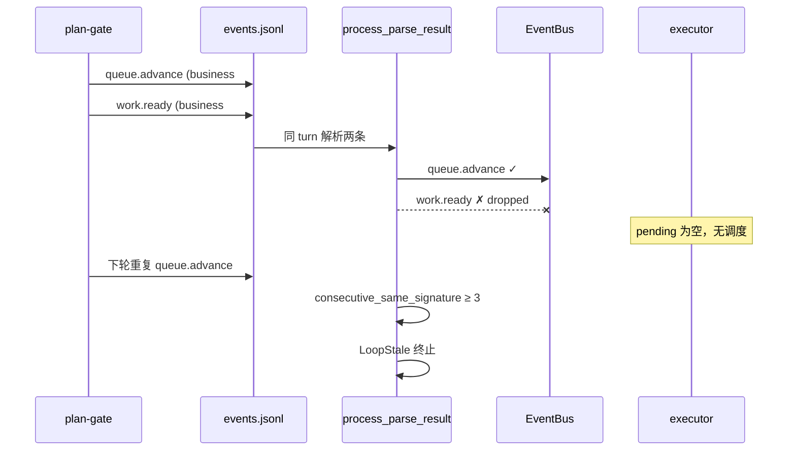
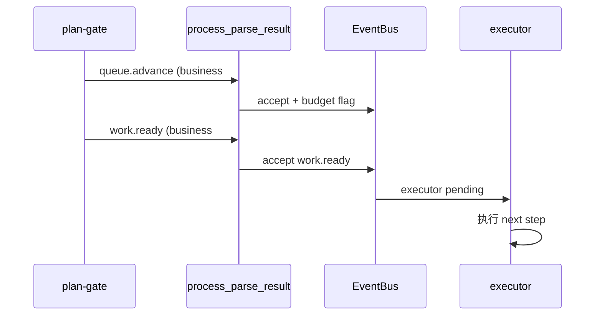

# fix: 放行 isolated mode 下 plan-gate 的 queue.advance + work.ready 双发布

## Summary

修复 isolated mode「每轮仅一个 business event」预算与 plan-gate Path A 双发布拓扑的不兼容：在事件循环中为 `queue.advance → work.ready` 增加 turn 预算白名单，并补齐运行时测试与 plan-gate `task_id` 加固，使 step 推进后 executor 能被可靠激活。

---

## Problem Frame

`ce-executor-isolated` preset 已按 2026-06-12 Path A 修复让 plan-gate 在同一 iteration 内双发布 `queue.advance` + `work.ready`（见 `presets/en/ce-executor-isolated.yml` plan-gate 段）。但 isolated mode 的 `process_events_from_jsonl` 在 `crates/ralph-core/src/event_loop/mod.rs` 仍强制执行每轮单 business event 预算，导致第二个事件 `work.ready` 被丢弃并发出 `event.isolation.boundary_violation` 诊断。

后果链路（见 origin 报告）：

1. `queue.advance` 进入 bus，但 executor 无法仅凭此事件获得完整执行上下文
2. `work.ready` 被丢弃，executor 不被调度
3. plan-gate 在后续 turn 重复相同签名
4. `consecutive_same_signature >= 3` 触发 `LoopStale`，loop 终止

附带问题：即使预算放行，`work.ready` 若携带占位符 `task_id`（如 `task-placeholder-step-02`），仍会被 execution contract / schema 拒绝（`recovery.jsonl` 中 `missing_required_field: task_id`）。

---

## Requirements

### 事件预算与双发布

- R1. 在 `execution_mode: isolated` 下，同一 turn 内 plan-gate 连续 emit 的 `queue.advance`（第一条 business event）与紧随其后的 `work.ready`（第二条 business event）**均须被 event bus 接受**，不得触发「extra business event dropped」。
- R2. 白名单**仅**覆盖有序对 `(queue.advance, work.ready)`：`work.ready` 必须是该 turn 内第二条 business event，且前一条已接受的 business event topic 为 `queue.advance`。
- R3. 其他 hat、其他 topic 组合、反向顺序（`work.ready` 先于 `queue.advance`）、或第三条及以后的 business event，**仍受原有单 event 预算约束**（与 `test_isolated_mode_accepts_only_first_business_event` 及 `isolated_boundary_violation` scenario 行为一致）。
- R4. `same_wave_continuation` 与 wave 批次例外逻辑**不得被破坏**；plan-gate 双发布路径通常无 `wave_id`，不应误用 wave 例外。
- R5. `check_default_publishes` Gate 2（`mod.rs` 中 `isolated_turn_business_event_accepted`）与 JSONL 路径的 sticky 预算标志**语义一致**：双发布接受后，该 turn 仍视为已消耗「step 推进」预算，不得再接受无关第三 business event。

### task_id 有效性

- R6. plan-gate 在 step advance 时 emit 的 `work.ready` 必须使用 task store 中**已注册**的 `task_id`；占位符 ID 仍应被 contract/schema 拒绝（行为不变），但 preset instructions 须消除 agent 使用占位符的路径。
- R7. plan-gate `work.ready` emit 须提供与 coordinator 同级的 **copy-pasteable** `ralph emit work.ready --json '{...}'` 示例，字段与 `event_policy.schemas.work.ready.required_fields` 一致。

### 可观测性与回归防护

- R8. 新增单元测试证明：isolated turn 内 `queue.advance` + `work.ready` 均进入 `seen_topics` / bus。
- R9. 新增 BDD scenario（或等价集成测试）证明：双发布后 executor hat 进入 pending，且 loop **不会**因同签名 `queue.advance` 连发 3 次而 stale 终止（在 mock 路径下可简化 payload）。
- R10. 现有 `isolated_boundary_violation` scenario **必须继续通过**（非白名单的第二 business event 仍被丢弃）。

### 文档

- R11. 更新 `docs/solutions/integration-issues/ce-executor-isolated-preset-dispatch-gap-plan-gate-executor-2026-06-12.md`，注明 Path A 依赖 isolated 预算例外，并链接本计划。

---

## Key Technical Decisions

- KTD-1 **采用方案 A（硬编码 topic pair 白名单）**：在 `process_parse_result` isolated 分支、紧邻 `same_wave_continuation` 判断处，增加 `is_dual_publish_step_handoff` 条件（`prev_accepted_topic == "queue.advance" && event.topic == "work.ready"`）。理由：当前唯一已知合法双发布对；改动面最小；与 AGENTS.md「避免无意义向后兼容包袱」一致。若未来出现更多 pair，再演进到配置化 `dual_publish_pairs`（origin 方案 B）作为 follow-up。
- KTD-2 **不采用方案 C（合并为单一 `step.advance` 事件）**：涉及 preset 拓扑、schema、consumer 全链路变更，超出本修复范围。
- KTD-3 **不采用 EventBus 高优先级抢占（origin Path B）**：无法解决预算层丢弃 `work.ready` 的问题，且会破坏 U4 fair scheduling 语义；仅作未来独立增强考虑。
- KTD-4 **task_id 加固走 preset instructions，不改 orchestrator task 自动注入**：orchestrator 不应替 agent 调用 `task ensure`；通过 HARD RULE + `--json` 示例 + 「emit 前必须 task list/show 校验」降低占位符率。
- KTD-5 **测试优先于 preset 文案**：先写 failing isolated 双发布测试（RED），再实现白名单（GREEN），最后调整 preset instructions。

---

## High-Level Technical Design

### 当前故障路径



### 目标路径



### 预算判定伪代码（方向性）

```text
on each business event in isolated turn:
  if control_or_diagnostic: accept (unchanged)
  if same_wave_continuation: accept (unchanged)
  if first_business_event_accepted:
    if prev_topic == "queue.advance" AND topic == "work.ready":
      accept  // NEW: step handoff pair
    else:
      drop + emit event.isolation.boundary_violation
  else:
    accept + set first_business_event_accepted
```

实现时从 `accepted` 切片取最后一条已接受 business event 的 topic，避免额外状态字段。

---

## Scope Boundaries

**In scope**

- `crates/ralph-core/src/event_loop/mod.rs` isolated 预算白名单
- 单元测试 + BDD scenario
- `presets/en/ce-executor-isolated.yml` plan-gate instructions 加固（含 zh 镜像若存在）
- solution 文档补充

**Out of scope**

- `dual_publish_pairs` 通用配置（方案 B）
- 合并 `step.advance` 单事件（方案 C）
- EventBus round-robin 抢占（Path B）
- 扩展 `RALPH_CONTROL_TOPICS`
- 让 executor 重新获得 `queue.advance` trigger

### Deferred to Follow-Up Work

- 若出现第二对合法 dual-publish（如其他 preset），再引入 `event_loop.dual_publish_pairs` 配置并迁移硬编码白名单
- 基于真实 loop replay fixture 的端到端 dogfood（非 mock BDD）

---

## System-Wide Impact

| 受影响方 | 影响 |
|---------|------|
| `ce-executor-isolated` 全部 plan-driven loop | step-02+ 推进恢复；U1 后不再 stale |
| isolated mode 其他 preset | 仅新增窄白名单；非 `(queue.advance, work.ready)` 行为不变 |
| U3 单 event 预算不变量 | 仍成立，仅增加一个文档化例外 |
| CI | 新增 `ralph-core` 测试；全量 `./scripts/run-tests.sh` |

---

## Risks & Dependencies

| 风险 | 缓解 |
|------|------|
| 白名单过宽，允许 agent 任意连发两个 business event | 严格限定 topic 序与 pair；保留第三条丢弃测试 |
| `work.ready` 仍带无效 `task_id` | R6/R7 preset 加固；contract 拒绝行为不变 |
| `check_default_publishes` 与 JSONL 预算漂移 | U1 验证 Gate 2；复用现有 `test_u3_p0_default_publishes_budget_exhausted_by_jsonl` |
| 中文 preset 与 en 漂移 | 若存在 `presets/zh/ce-executor-isolated.yml` 或 `*-zh.yml`，同步 instructions |

**依赖**：无外部服务；需熟悉 `event_loop/mod.rs` isolated 分支与 `review_step_state` 语义门（双发布接受后仍须满足 synth terminal 门，已有测试覆盖）。

---

## Implementation Units

### U1. Isolated 预算白名单：放行 queue.advance → work.ready

**Goal:** 实现 KTD-1，使 plan-gate 双发布在 runtime 层生效。

**Requirements:** R1, R2, R3, R4, R5

**Dependencies:** 无

**Files:**
- `crates/ralph-core/src/event_loop/mod.rs`
- `crates/ralph-core/src/event_loop/tests/payload_types.rs`（或新建 `plan_gate_dual_publish.rs`）

**Approach:**
- 在 isolated 分支 `first_business_event_accepted && !same_wave_continuation` 丢弃逻辑前，计算 `is_step_handoff_pair`：当前 event topic 为 `work.ready`，且 `accepted` 中最后一条 business event 的 topic 为 `queue.advance`。
- 将条件改为 `if first_business_event_accepted && !same_wave_continuation && !is_step_handoff_pair`。
- 接受 `work.ready` 后仍设置 `isolated_turn_business_event_accepted = true`（与首条 business event 一致），确保第三条 business event 被拒绝。
- 抽取 topic 常量或内联字符串与现有 `queue.advance` / `work.ready` 用法保持一致；可加简短模块级注释引用 origin 报告。

**Execution note:** 先扩展 `test_isolated_mode_accepts_only_first_business_event` 旁新建 **failing** 测试 `test_isolated_mode_accepts_queue_advance_work_ready_pair`，再实现白名单。

**Patterns to follow:**
- `same_wave_continuation` 例外模式（`mod.rs` ~5671）
- `is_orchestrator_control_topic` 绕过预算模式

**Test scenarios:**
- Happy path：同 turn JSONL 顺序 `queue.advance` → `work.ready`，两者均在 `seen_topics`。
- 反向顺序：`work.ready` → `queue.advance`，仅第一条被接受。
- 第三条拒绝：`queue.advance` → `work.ready` → `experiment.planned`，第三条丢弃。
- 非 pair：`queue.advance` → `work.done`，第二条丢弃。
- Wave 回归：复跑 `u6_incident_fixture_eight_dimension_done_all_accepted`（无行为变化）。

**Verification:** `cargo nextest run -p ralph-core -- queue_advance_work_ready` 与 `cargo nextest run -p ralph-core -- isolated_mode_accepts_only_first` 均通过。

---

### U2. BDD scenario：plan-gate 双发布不触发 stale

**Goal:** 用真实 scenario runner 证明双发布后 loop 有进展，防回归。

**Requirements:** R8, R9, R10

**Dependencies:** U1

**Files:**
- `crates/ralph-core/tests/scenarios/plan_gate_dual_publish_handoff.yml`（新建）
- `crates/ralph-core/tests/scenarios/isolated_boundary_violation.yml`（回归，不修改行为）

**Approach:**
- 定义最小 isolated topology：`plan-gate`（publishes `queue.advance`, `work.ready`）+ `executor`（triggers `work.ready`, publishes `work.done`）。
- Mock 响应 1：plan-gate 同 turn 输出 `<event topic="queue.advance">` 与 `<event topic="work.ready">`（payload 含合法 JSON / 必需字段）。
- Mock 响应 2：executor 输出 `work.done`。
- `expected.events` 包含 `queue.advance` 与 `work.ready`；`expected.iterations` ≥ 2；无 `loop_stale` / 提前终止。
- 保持 `isolated_boundary_violation.yml` 不变，全量 `cargo nextest run -p ralph-core --test scenarios` 通过。

**Patterns to follow:**
- `crates/ralph-core/tests/scenarios/isolated_boundary_violation.yml`

**Test scenarios:**
- Happy path：双发布均被 bus 接受，executor 被调度。
- Regression：`isolated_boundary_violation` 仍 `iterations: 2`，第二非白名单 event 仍丢弃。

**Verification:** `cargo nextest run -p ralph-core --test scenarios plan_gate_dual_publish` 与 `cargo nextest run -p ralph-core --test scenarios isolated_boundary` 通过。

---

### U3. plan-gate work.ready task_id 与 emit 示例加固

**Goal:** 降低占位符 `task_id` 导致的 contract 拒绝（origin §2.4）。

**Requirements:** R6, R7

**Dependencies:** U1（预算修复后此问题才暴露为主要阻塞）

**Files:**
- `presets/en/ce-executor-isolated.yml`（plan-gate instructions）
- `presets/schemas/ce-executor-isolated.yml`（若 instructions 镜像）
- `presets/zh/ce-executor-isolated-zh.yml` 或等价中文变体（若存在）
- `crates/ralph-cli/src/presets.rs`（仅当 embedded content 变更需同步）
- `presets/manifest.yml` / `presets/index.json`（仅当 preset 文件结构变更时；instructions 变更通常不需要）

**Approach:**
- 在 plan-gate `Dual-Publish Handoff` 段增加 **HARD RULE**：禁止 `task-placeholder-*` / 手写假 ID；emit 前必须 `ralph tools task list` 确认 next step 任务存在。
- 增加完整示例块（与 coordinator `work.ready` 示例风格一致）：

  ```bash
  ralph emit work.ready --json '{"plan_name":"...","plan_path":"...","task_id":"<from task ensure>","task_key":"...","step":"step-02","complexity":"medium"}'
  ```

- 明确：`task_id` 必须来自**上一条** `ralph tools task ensure` 输出或 `task list`，不得从 step 名推导。
- 若中英文 preset 双份维护，同步中文段。

**Patterns to follow:**
- coordinator hat 中 `ralph emit work.done --json` 示例（preset ~484 行）
- `docs/solutions/developer-experience/agent-execution-contract-gates-2026-06-03.md` 字段三层一致原则

**Test scenarios:**
- `cargo nextest run -p ralph-cli -- ce_executor_plan_gate` 或现有 WAC-U4 preset 断言仍通过。
- 手动：`ralph preset check -H builtin:ce-executor-isolated` 无 lint 错误。

**Verification:** preset lint 通过；instructions 中可见 `--json` 示例与 schema `required_fields` 对齐。

---

### U4. Solution 文档与机构知识更新

**Goal:** 防止后续仅改 preset 而忽略基础设施层。

**Requirements:** R11

**Dependencies:** U1

**Files:**
- `docs/solutions/integration-issues/ce-executor-isolated-preset-dispatch-gap-plan-gate-executor-2026-06-12.md`

**Approach:**
- 在 Path A 节后增加 **Infrastructure dependency** 小节：Path A 生效前提是 isolated turn 预算放行 `(queue.advance, work.ready)`。
- 链接本计划与 `docs/report/2026-06-15-plan-gate-dual-publish-blocking-diagnosis.md`。
- 在「What Didn't Work」补一条：「仅 preset 双发布、未改 mod.rs 预算 → work.ready 写入 JSONL 但被 bus 丢弃」。

**Test expectation:** none — 文档-only

**Verification:** 文档交叉引用可点击、路径为 repo-relative。

---

### U5. 全量回归验证

**Goal:** 确认无 isolated / event_loop 回归。

**Requirements:** R3, R5, R10

**Dependencies:** U1, U2, U3

**Files:** 无（验证步骤）

**Approach:**
- `cargo nextest run -p ralph-core -- isolated`
- `cargo nextest run -p ralph-core --test scenarios`
- `cargo nextest run -p ralph-core -- review_step`
- `cargo nextest run -p ralph-cli -- preset`（preset 相关子集）
- `./scripts/run-tests.sh`（发 PR 前）

**Test scenarios:**
- 上述命令 exit 0。

**Verification:** 全 workspace 测试绿（ralph-cli 串行组 + 其他包并行）。

---

## Acceptance Examples

- AE1. **Step 推进双发布**
  - **Given:** isolated mode，`plan-gate` 同 turn emit `queue.advance` 后 emit `work.ready`
  - **When:** `process_events_from_jsonl` 处理该 turn
  - **Then:** 两 topic 均出现在 `seen_topics`；无 `event.isolation.boundary_violation` 因预算丢弃 `work.ready`

- AE2. **非白名单第二 event 仍丢弃**
  - **Given:** isolated mode，strategist 同 turn emit `experiment.planned` + `experiment.ready`
  - **When:** scenario `isolated_boundary_violation` 运行
  - **Then:** 仅 `experiment.planned` 被接受；loop 行为与现有一致

- AE3. **有效 task_id 的 work.ready 激活 executor**
  - **Given:** U1+U3 已实施，mock plan-gate 双发布且 `task_id` 来自 task store
  - **When:** BDD scenario `plan_gate_dual_publish_handoff` 运行
  - **Then:** executor turn 执行；不因 `consecutive_same_signature` stale 终止

---

## Open Questions

无阻塞项。以下留 implementation 时确认：

- 中文 preset 是否存在独立 `ce-executor-isolated-zh.yml` 需同步（实施时 `glob presets/**/ce-executor-isolated*` 确认）。
- BDD scenario 最小 topology 是否需内联 `review.passed` synth terminal 前置事件（参考 `review_step_state` 语义门，可能在 scenario config 中用简化 hat 绕过）。

---

## Sources & Research

| 来源 | 用途 |
|------|------|
| `docs/report/2026-06-15-plan-gate-dual-publish-blocking-diagnosis.md` | Origin：根因、证据、方案 A/B/C |
| `docs/solutions/integration-issues/ce-executor-isolated-preset-dispatch-gap-plan-gate-executor-2026-06-12.md` | Path A 预设层修复与反模式 |
| `crates/ralph-core/src/event_loop/mod.rs` | 预算丢弃点 ~5678；Gate 2 ~4495 |
| `crates/ralph-core/src/event_loop/tests/payload_types.rs:89` | 单 event 预算测试模式 |
| `crates/ralph-core/tests/scenarios/isolated_boundary_violation.yml` | BDD 边界回归 |
| `presets/en/ce-executor-isolated.yml` plan-gate 段 | 已有 Dual-Publish HARD RULE |
| `docs/achieved/plan/2026-05-15-001-feat-isolated-hat-execution-mode-plan.md` | 原始单 event 预算设计意图 |
