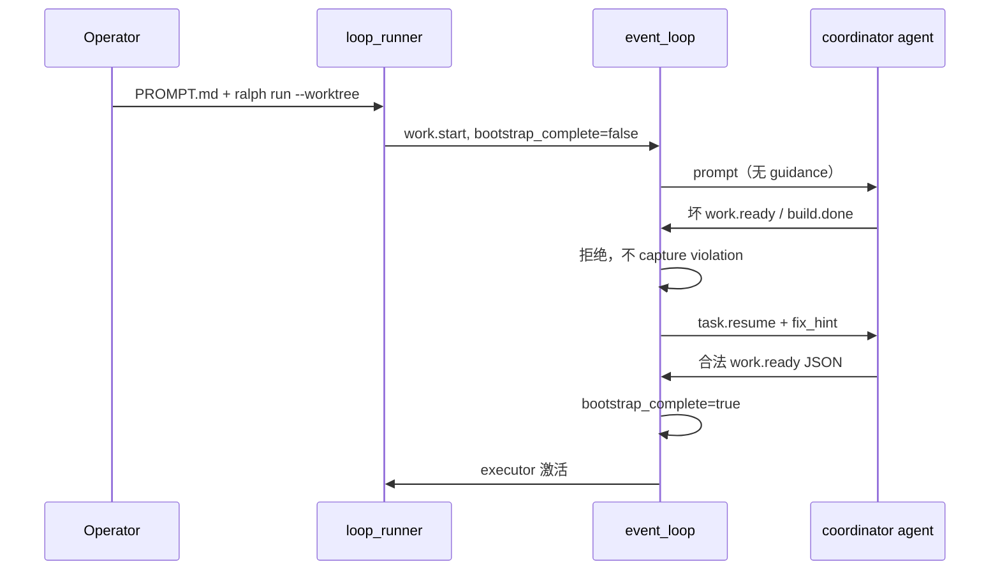

# feat: ce-executor-isolated 起跑恢复（bootstrap recovery）

> **Superseded** by [docs/plans/2026-06-16-002-feat-ce-executor-loop-stability-plan.md](2026-06-16-002-feat-ce-executor-loop-stability-plan.md)（统一 SSOT + 全 hat 恢复 + 诊断闭环）。勿按本计划实施。

## Overview

在 **不改变 operator 工作流**（`PROMPT.md` 一行指 plan + `ralph -H builtin:ce-executor-isolated run --worktree --reuse-worktree`）的前提下，让 coordinator 在 iteration 1 犯错时 **可恢复、有界重试**，并在起跑阶段 **屏蔽 human guidance 噪声**。改动集中在 `ralph-core` event loop / loop state、`ralph-cli` runner 终止门，以及 `ce-executor-isolated` preset 的 `topic_deny_rules` 补充。

本计划是 **小补丁**：复用 `task.resume`、`fix_hint_for_hat_topic`、`U2_REJECTION_RETRY_LIMIT`、`scope_violation_circuit_breaker`；不新增 hat、不改 9-hat 拓扑、不削弱 bootstrap 之后的 payload 契约硬度（见 origin R5）。

## Problem Frame

`ce-executor-isolated` loop 经常在 coordinator 起跑（`work.start` → `work.ready`）卡死：agent 以非 JSON 发 `work.ready`、或乱发 `build.done` / `debug.step`。现有 B+C precheck 减少但未消除犯错；一旦 loop 读盘拒绝，`runner.rs` 对 `payload_contract_violation` **立即 `not_retriable` 终止**（U6 契约），导致 executor 从未激活。Human guidance 在起跑期注入 prompt 会进一步把 agent 带偏（见 `docs/report/2026-06-16-loop-diagnostic-report.md`）。

Operator 期望：继续用整份 dev plan 启动，由 runtime 承担「第一枪打歪能爬起来」。

## Requirements Trace

| ID | 需求摘要 | 本计划对应单元 |
|----|----------|----------------|
| R1 | 定义 bootstrap 阶段 | Unit 1 |
| R2 | bootstrap 内 coordinator 拒绝不立即一枪毙命 | Unit 2 |
| R3 | 拒绝 → `task.resume` + hat-scoped `--json` 示例 | Unit 2 |
| R4 | 有界重试（3 次恢复，第 4 次终止） | Unit 2（复用 U2） |
| R5 | bootstrap 结束后保留现有 `PayloadContractViolation` 终止语义 | Unit 2 |
| R6–R8 | bootstrap 期 coordinator 不收 guidance；之后不变 | Unit 3 |
| R9–R10 | coordinator `build.done` / `debug.*` deny + 与恢复路径一致 | Unit 4 |
| SC1–SC5 | 验收标准 | 各单元 Test scenarios + 全 workspace nextest |

## Scope Boundaries

- 不修改 operator 启动命令或 `PROMPT.md` 格式。
- 不扩 coordinator `publishes` 以包容 `build.done`。
- 不全局降级非 bootstrap 的 payload 违规处理。
- 不做全量 skill 审计；`echo >> events.jsonl` 旁路仍靠 loop gate + 本恢复路径。
- 其他 preset 仅保证无回归，不做深度优化。

### Deferred to Separate Tasks

- 将 bootstrap 恢复模式推广到 executor / plan-gate 等其他 hat 的 payload 违规：需单独评估（origin 延迟项 Q5 延伸）。

## Context & Research

### Relevant Code and Patterns

| 区域 | 路径 | 现状 |
|------|------|------|
| Payload 违规 → 立即终止 | `crates/ralph-cli/src/loop_runner/runner.rs`（U6 块，`payload_contract_violation` 分支） | 写报告 + `TerminationReason::PayloadContractViolation` + `NotRetriable` |
| Policy 校验 + `capture_violation` | `crates/ralph-core/src/event_loop/mod.rs` `apply_event_policy_validation` | `RejectWithResume` 路径仍 `capture_violation`，runner 仍会因 `payload_contract_violation` 终止 |
| Isolated scope 恢复 + 熔断 | `crates/ralph-core/src/event_loop/mod.rs` isolated-scope 分支 | 已有 `task.resume` + `U2_REJECTION_RETRY_LIMIT` + `scope_violation_circuit_breaker_tripped` |
| 重试计数 | `crates/ralph-core/src/event_loop/loop_state.rs` | `U2_REJECTION_RETRY_LIMIT = 3`，`record_rejection_key` / `rejection_key_is_exhausted` |
| Emit 修复提示 | `crates/ralph-core/src/emit_schema_hint.rs` `fix_hint_for_hat_topic` | B+C 已有；CLI precheck 在用，loop `task.resume` 尚未统一接入 |
| Human guidance 注入 | `crates/ralph-core/src/event_loop/mod.rs` `build_prompt` isolated 路径 | `collect_robot_guidance()` + `prepend_scratchpad` |
| Topic deny（精确匹配） | `crates/ralph-core/src/event_policy.rs` `check_topic_deny_rules` | `rule.topic == topic`，**不支持** `debug.*` 通配（`TopicDenyRule` 文档写明 exact） |
| Topic 通配语义 | `crates/ralph-proto/src/topic.rs` `Topic::matches_str` | 订阅匹配已支持 `*`；可复用于 deny |
| Coordinator bootstrap 语义 | `crates/ralph-core/src/event_loop/review_step_state.rs` | 已有「coordinator bootstrap work.ready」注释，可对照 |
| Preset deny 示例 | `presets/en/ce-executor-isolated.yml` `topic_deny_rules` | 已有 `executor → build.done`；**无** coordinator deny |

### Institutional Learnings

- `docs/achieved/plan/2026-06-14-004-fix-coordinator-build-done-loop-plan.md`：isolated-scope 熔断与 `(hat, topic)` 计数已落地；本计划 **叠加** bootstrap payload 恢复，不重复造计数器。
- `docs/achieved/plan/2026-06-15-001-feat-schema-aware-hat-emit-instructions-plan.md`：B+C 已闭合子进程 precheck；验收须在含该改动的构建上进行。

### External References

- 无（本地模式充分）。

## Key Technical Decisions

- **Bootstrap 边界用 `LoopState` 标志，不用扫 events.jsonl**（origin 延迟项 #1）：`bootstrap_complete: bool`，loop 启动 / 发出 `work.start` 时置 `false`；**第一次** coordinator 的 `work.ready` 通过 policy 校验并进入 `validated_events` 时置 `true`。理由：O(1)、无竞态、与 iteration 无关。
- **Bootstrap payload 恢复 = 不 capture + runner 不终止**（origin R2/R5）：在 bootstrap 且 `hat=coordinator` 且 `topic=work.ready` 且违规为 `PayloadTypeMismatch`（含非 JSON 字符串）时，`apply_event_policy_validation` **跳过** `capture_violation`；`runner.rs` 增加守卫：若同一违规已被 bootstrap 恢复处理，**不**走 U6 终止路径。理由：保留 U6「Final 不覆盖 PayloadContractViolation」对非 bootstrap 场景不变。
- **恢复 payload 统一走 `fix_hint_for_hat_topic`**（origin R3）：`task.resume` 正文包含人类可读原因 + coordinator 允许的 `work.ready` / `work.failed` `--json` 示例 + 「禁止 build.done / debug.*」一句。理由：与 B+C 单一事实源一致，防 cross-hat 泄漏。
- **重试计数：按 violation 类别分 key，各 3 次**（origin 延迟项 #2）：isolated-scope 继续用现有 `"{hat}:{topic}:isolated_scope"`；bootstrap payload 用新 key `bootstrap:{hat}:work.ready:payload_type_mismatch`；topic-deny（coordinator `build.done`）用 `bootstrap:{hat}:{topic}:topic_denied`。第 4 次走现有 exhausted 终止（scope breaker 或新增 `BootstrapRecoveryExhausted` 终止原因，二选一在实现时选 **复用 `ScopeViolationCircuitBreakerTripped` 形状** 或 **新增专用 `TerminationReason`**——见 Unit 2）。**不**合并为单一计数桶，避免一种错误耗尽另一种的预算。
- **Guidance 隔离仅在 `coordinator` + `!bootstrap_complete`**（origin R6–R8）：isolated `build_prompt` 路径跳过 `collect_robot_guidance()`；`prepend_scratchpad` 对 coordinator 过滤 `### HUMAN GUIDANCE` 块。其他 hat / bootstrap 完成后行为不变。
- **`topic_deny_rules` 支持 Topic 通配**（origin 延迟项 #4）：`check_topic_deny_rules` 改为 `Topic::new(&rule.topic).matches_str(topic)`（hat_id 仍 exact）。preset 添加 `coordinator → build.done` 与 `coordinator → debug.*`。理由：比列举 `debug.step` 等更稳；与 `ralph-proto` 订阅语义一致。
- **Preset 同步四件套**：`presets/en/ce-executor-isolated.yml`、`presets/zh/ce-executor-isolated-zh.yml`、`crates/ralph-cli/src/presets.rs` 嵌入一致性、`presets/manifest.yml` 无需改（内容变、名不变）。

## Open Questions

### Resolved During Planning

- **Bootstrap 结束判定**：`LoopState.bootstrap_complete` 在首次合法 `work.ready` accept 时置 true。
- **计数分桶**：按 violation 类别分 key，各 3 次；不合并。
- **Guidance 过滤位置**：`build_prompt` + `prepend_scratchpad` 两处，仅 coordinator bootstrap。
- **`debug.*` deny**：扩展 `check_topic_deny_rules` 通配 + preset 规则；更新 `TopicDenyRule` 文档注释。

### Deferred to Implementation

- **终止原因枚举**：bootstrap 第 4 次失败是复用 `ScopeViolationCircuitBreakerTripped` 结构还是新增 `BootstrapRecoveryExhausted`——实现时选可读性更好者，须写入 `recovery.jsonl` + `summary.md`。
- **`RejectWithResume` 与 `capture_violation` 顺序**：实现时确认 bootstrap 分支在 `capture_violation` 之前短路，避免 runner 仍看到 `payload_contract_violation`。

## High-Level Technical Design

> *方向性指导，非实现规范。*



## Implementation Units

- [ ] **Unit 1: Bootstrap 阶段状态**

**Goal:** 在 `LoopState` 中可判定「是否在 coordinator 起跑阶段」。

**Requirements:** R1

**Dependencies:** 无

**Files:**
- Modify: `crates/ralph-core/src/event_loop/loop_state.rs`
- Modify: `crates/ralph-core/src/event_loop/mod.rs`（accept `work.ready` 时置位）
- Modify: `crates/ralph-cli/src/loop_runner/runner.rs`（loop 启动 / `work.start` 时重置）
- Test: `crates/ralph-core/src/event_loop/loop_state.rs`（现有 `#[cfg(test)]` 模块）

**Approach:**
- 新增 `pub bootstrap_complete: bool`，默认 `false`。
- `runner.rs` 在非 resume 冷启动、写入 `work.start` 前后确保 `bootstrap_complete = false`。
- `process_parse_result` / policy accept 路径：当 `event.hat == coordinator` 且 `event.topic == work.ready` 且 policy accept 时，设 `bootstrap_complete = true`。
- 暴露只读访问器 `fn is_bootstrap_phase(&self) -> bool` → `!bootstrap_complete`。

**Patterns to follow:**
- `scope_violation_circuit_breaker_tripped` 字段模式（`loop_state.rs`）

**Test scenarios:**
- Happy path：`bootstrap_complete` 初始 false；accept 合法 `work.ready` 后 true。
- Edge case：resume 重启 loop 时 bootstrap 状态按 runner 语义重置（与 `work.start` vs `task.resume` 一致）。

**Verification:**
- 单元测试覆盖状态转移；无行为变更直到 Unit 2/3 消费该标志。

---

- [ ] **Unit 2: Bootstrap payload 可恢复 + runner 终止门**

**Goal:** coordinator 在 bootstrap 期 `work.ready` payload 格式错误时，注入带 `fix_hint` 的 `task.resume`，不触发 U6 一枪毙命；第 4 次失败明确终止。

**Requirements:** R2, R3, R4, R5, SC2

**Dependencies:** Unit 1

**Files:**
- Modify: `crates/ralph-core/src/event_loop/mod.rs`（`apply_event_policy_validation`、`publish_policy_rejection_resume` 或邻近 helper）
- Modify: `crates/ralph-cli/src/loop_runner/runner.rs`（U6 payload 终止守卫）
- Modify: `crates/ralph-core/src/event_loop/rejection.rs`（可选：bootstrap 专用 resume 文案 helper）
- Test: `crates/ralph-core/src/event_loop/tests/`（新建 `bootstrap_recovery.rs` 或扩展现有 `termination.rs` / policy 测试）
- Test: `crates/ralph-cli/src/loop_runner/tests.rs`（bootstrap payload 不终止子集）

**Approach:**
- 新增 helper（命名实现时定，如 `bootstrap_payload_recovery_eligible`）：`!bootstrap_complete && hat==coordinator && topic==work.ready && finding` 为 `PayloadTypeMismatch`。
- 符合条件时：`RejectWithResume` + 增强 recovery payload（调用 `fix_hint_for_hat_topic` + registry 取 coordinator `Hat` + `event_policy.schemas`）；**不**调用 `capture_violation`。
- 用 `record_rejection_key("bootstrap:coordinator:work.ready:payload_type_mismatch")`；exhausted 时设置终止原因并 **不** 再注入 resume（对齐 U2）。
- `runner.rs`：若 `processed.payload_contract_violation` 存在但 event loop 已标记「本 turn 已 bootstrap 恢复」，跳过 U6 终止（或 event loop 根本不设置 `payload_contract_violation`——二选一，实现时保持单一来源）。
- **非 bootstrap** 或 **非 PayloadTypeMismatch**（如缺字段 after JSON parse）：仍走现有 U6 终止（R5）。

**Execution note:** 先写失败测试：bootstrap 下坏 `work.ready` → loop 不返回 `PayloadContractViolation`；第 4 次 → 终止。

**Patterns to follow:**
- Isolated-scope 分支 `build_task_resume_payload` + `with_target(coordinator)`（`event_loop/mod.rs` isolated-scope 段）
- `fix_hint_for_hat_topic`（`emit_schema_hint.rs`）
- `drift_integration.rs` `final_hint_never_replaces_payload_contract_violation` — **非 bootstrap** 测试须仍通过

**Test scenarios:**
- Happy path：bootstrap + 字符串 `work.ready` → `task.resume` 含 `--json` 示例；`payload_contract_violation` 为 None；loop 继续。
- Happy path：下一轮合法 JSON `work.ready` → accept + `bootstrap_complete=true`。
- Error path：连续 4 次坏 payload → 终止 + `recovery.jsonl` 含 hat/topic/次数。
- Integration：bootstrap 结束后 executor 发坏 `work.done` → **仍** `PayloadContractViolation` 终止（R5 回归）。
- Edge case：`work.failed` 合法 JSON 在 bootstrap 期 accept，不误置 bootstrap_complete（仅 `work.ready` 成功结束 bootstrap）。

**Verification:**
- SC2 场景自动化；`cargo nextest run -p ralph-core -- bootstrap` 与 `ralph-cli` 相关子集通过。

---

- [ ] **Unit 3: Bootstrap 期 coordinator 输入隔离**

**Goal:** bootstrap 阶段 coordinator prompt 不含 human guidance / scratchpad HUMAN GUIDANCE。

**Requirements:** R6, R7, R8, SC4

**Dependencies:** Unit 1

**Files:**
- Modify: `crates/ralph-core/src/event_loop/mod.rs`（`build_prompt` isolated 路径、`prepend_scratchpad` 或 scratchpad 过滤 helper）
- Test: `crates/ralph-core/src/event_loop/tests/guidance_dedup.rs` 或新建 `bootstrap_guidance.rs`

**Approach:**
- 当 `hat_id == coordinator && !bootstrap_complete`：
  - 跳过 `collect_robot_guidance()` 拼接到 prompt。
  - `prepend_scratchpad` 时剥离 `### HUMAN GUIDANCE` 段（可复用现有 scratchpad 解析逻辑，见 `mod.rs` ~3519 行附近 dedup 代码）。
- 保留：`work.start` events 上下文、instruction_builder schema-aware 块、plan 解析指令（R7）。
- `bootstrap_complete == true` 后 coordinator 与其他 hat 恢复现有 guidance 行为（R8）。

**Patterns to follow:**
- `guidance_dedup.rs` 测试与 scratchpad HUMAN GUIDANCE 解析

**Test scenarios:**
- Happy path：bootstrap + scratchpad 含 HUMAN GUIDANCE → coordinator prompt 不含该块。
- Happy path：`bootstrap_complete=true` 后同 scratchpad → guidance 可见。
- Edge case：executor hat 在 bootstrap 期仍可按现有规则收 guidance（若适用）。

**Verification:**
- SC4 字符串断言测试；无 coordinator 以外 hat 回归。

---

- [ ] **Unit 4: Coordinator topic deny + 通配匹配**

**Goal:** CLI precheck 与 loop gate 拒绝 coordinator 发 `build.done` / `debug.*`；拒绝走 bootstrap 恢复（与 scope violation 对齐，含 fix_hint 与计数）。

**Requirements:** R9, R10, SC3

**Dependencies:** Unit 1（bootstrap 判定）；Unit 2（恢复 payload 模式可复用）

**Files:**
- Modify: `crates/ralph-core/src/event_policy.rs`（`check_topic_deny_rules` 通配）
- Modify: `crates/ralph-core/src/config/event_policy.rs`（`TopicDenyRule` 注释）
- Modify: `presets/en/ce-executor-isolated.yml`
- Modify: `presets/zh/ce-executor-isolated-zh.yml`
- Test: `crates/ralph-core/src/event_policy.rs` `#[cfg(test)]`
- Test: `crates/ralph-cli/tests/integration_emit_policy.rs`（coordinator deny + `RALPH_HATS_SOURCE`）

**Approach:**
- `check_topic_deny_rules`：`rule.hat_id == hat_id` 且 `Topic::new(&rule.topic).matches_str(topic)`。
- Preset 追加：
  ```yaml
  - {hat_id: coordinator, topic: build.done}
  - {hat_id: coordinator, topic: debug.*}
  ```
- Bootstrap 期 coordinator topic_denied：`RejectWithResume`（或 Block→转 resume，与 preset `on_violation` 一致），payload 说明仅可发 `work.ready`/`work.failed` + fix_hint；计数 key `bootstrap:coordinator:{topic}:topic_denied`。
- 非 bootstrap coordinator deny：保持现有 policy 行为（通常 reject/hold，不特殊放宽）。

**Patterns to follow:**
- 现有 `executor → build.done` deny 测试（`test_topic_deny_rules_match_rejected`）
- `integration_emit_policy.rs` RALPH_HATS_SOURCE 路径

**Test scenarios:**
- Happy path：`check_topic_deny_rules(coordinator, debug.step)` 命中 `debug.*`。
- Happy path：CLI `ralph emit build.done` as coordinator + `RALPH_HATS_SOURCE` → exit ≠ 0。
- Error path：bootstrap 下 coordinator `debug.step` 3 次 → resume；第 4 次终止。
- Regression：`executor → build.done` deny 仍有效；`coordinator → work.ready` 不被 deny。

**Verification:**
- SC3；`ralph preset check -H builtin:ce-executor-isolated` 通过。

---

- [ ] **Unit 5: 端到端验收与文档**

**Goal:** 满足 SC1/SC5；builtin preset 嵌入一致。

**Requirements:** SC1, SC5

**Dependencies:** Units 1–4

**Files:**
- Modify: `crates/ralph-cli/src/presets.rs`（若嵌入 YAML 与 `presets/en` 不一致则同步）
- Test: `crates/ralph-core/tests/scenarios.rs`（可选：一条 bootstrap recovery scenario，若成本低）
- Verify: `presets/manifest.yml` 无需改名

**Approach:**
- 跑 `./scripts/run-tests.sh` 或等价 `cargo nextest run --workspace --exclude ralph-e2e` + `cargo test --doc`。
- 手工冒烟清单（写入 plan 验收备注，非自动化）：`PROMPT.md` 指向真实 plan + `ralph run --worktree --reuse-worktree`，观察 iteration 2 executor 激活。

**Test scenarios:**
- Integration：组合 scenario——`work.start` → 坏 `work.ready` → resume → 好 `work.ready` → bus 上 executor pending。
- Regression：全 workspace nextest 绿。

**Verification:**
- SC1/SC5 满足；无 AGENTS.md/CLAUDE.md 变更（无新 operator 命令）。

## System-Wide Impact

- **Interaction graph:** `apply_event_policy_validation` → `ProcessedEvents.payload_contract_violation` → `runner` 终止门；`build_prompt` → agent → jsonl → `process_parse_result` 闭环。
- **Error propagation:** bootstrap 错误不再升级为 `NotRetriable`；第 4 次失败仍 fail-closed。
- **State lifecycle:** `bootstrap_complete` 单次 loop 内存态；worktree 复用不影响（新 loop run 重置）。
- **API surface parity:** CLI `ralph emit` precheck 与 loop gate 同步受益于 deny 通配；无新 CLI 标志。
- **Unchanged invariants:** 非 bootstrap `PayloadContractViolation`；B+C `RALPH_HATS_SOURCE`；isolated fair scheduling；R1–R5 agent output governance（wave context、ephemeral 等）。

## Risks & Dependencies

| Risk | Mitigation |
|------|------------|
| 误将非 bootstrap payload 违规放行 | 严格 `bootstrap_complete` + coordinator + work.ready + PayloadTypeMismatch 四重守卫；R5 回归测试 |
| `capture_violation` 与 `RejectWithResume` 双路径竞态 | 实现时单一短路点；runner 双守卫 |
| deny 通配误伤合法 topic | `debug.*` 仅绑 coordinator；review 路径 topic 不受影响 |
| worktree 跑旧构建无 B+C | 验收说明写在 SC 前提（origin Dependencies） |

## Documentation / Operational Notes

- 无需改 operator 文档；可选在 `docs/guide/runtime-diagnosis.md` 加一句 bootstrap recovery 诊断码（**非必须**，实现 PR 自行判断）。
- Operator：bootstrap 期仍建议少发 guidance，但不再依赖自觉（R6 机制兜底）。

## Sources & References

- **Origin document:** `docs/brainstorms/2026-06-16-ce-executor-bootstrap-recovery-requirements.md`
- Diagnosis: `docs/report/2026-06-16-loop-diagnostic-report.md`, `docs/report/2026-06-15-ce-executor-isolated-work-ready-payload-contract-violation-diagnosis.md`
- Prior art: `docs/achieved/plan/2026-06-14-004-fix-coordinator-build-done-loop-plan.md`, `docs/achieved/plan/2026-06-15-001-feat-schema-aware-hat-emit-instructions-plan.md`
- Code: `crates/ralph-core/src/event_loop/mod.rs`, `crates/ralph-cli/src/loop_runner/runner.rs`, `crates/ralph-core/src/emit_schema_hint.rs`, `presets/en/ce-executor-isolated.yml`
