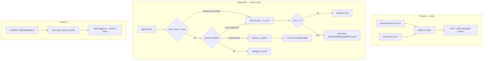

# feat: ce-executor-isolated Loop 稳定性（SSOT + 统一恢复 + 诊断闭环）

## Overview

在 **不改变 operator 工作流**（`PROMPT.md` 一行指 plan + `ralph -H builtin:ce-executor-isolated run --worktree --reuse-worktree`）的前提下，把四层散落能力闭合成一条链：

1. **A — Schema SSOT**：`presets/schemas/` build 注入，消灭双份漂移
2. **B — 统一可恢复 payload**：全 hat 格式类违规走 `task.resume` + `fix_hint`，3 次预算，不再被 U6 一枪毙命
3. **C — Bootstrap 输入隔离**：coordinator 起跑期屏蔽 guidance 噪声 + deny `build.done` / `debug.*`
4. **D — 诊断闭环**：worktree 诊断落盘 + loop 结束回写 session pointer + `ralph diagnose` 非空回退

本计划 **supersede** `docs/plans/2026-06-16-001-feat-ce-executor-bootstrap-recovery-plan.md`（bootstrap-only 范围过窄，且与统一需求 R-B5 冲突）。

## Problem Frame

Operator 跑 `ce-executor-isolated` 时 loop 常在 iteration 1 或中后期 **乱飘、卡死、一枪毙命**。根因不是缺功能，而是 **契约不同源、payload 错了必死、诊断看错地方**（见 origin 文档 Problem Frame）。

`ralph.yml` 已开启 `telemetry.runtime_diagnosis`；本计划补 **路径与行为闭环**，不重复开关 telemetry。

## Requirements Trace

| ID | 需求摘要 | 本计划单元 |
|----|----------|------------|
| R-A1–R-A4 | Schema SSOT + 四消费链同源 + preset check | Unit 1 |
| R-B1–R-B5 | 全 hat 可恢复 payload + 3 次预算 + fix_hint | Unit 2 |
| R-C1–R-C3 | Bootstrap guidance 隔离 + coordinator deny | Unit 3, Unit 4 |
| R-D1–R-D2 | worktree 诊断 + pointer + diagnose 回退 | Unit 5 |
| R-D3 | drift 职责不变；bootstrap 期抑制 Warning→guidance（Unit 3）；bootstrap 后 critical 注入回归 | Unit 3 + Unit 6 |
| SC1–SC5 | 验收标准 | 各单元 Test scenarios + 全 workspace nextest |

## Scope Boundaries

- 不修改 operator 启动命令或 `PROMPT.md` 格式。
- 不大改 9-hat 拓扑、不加新 hat、不扩大 `publishes` 包容 `build.done`。
- 不做 `echo >> events.jsonl` 内核级禁止（仍靠 precheck + loop gate + R-B）。
- 不做全量 skill 文档审计。
- drift 不替代 R-B 即时恢复；drift 保持中后期统计职责。

### Deferred to Separate Tasks

- 将 SSOT 机制推广到尚无 `presets/schemas/<name>.yml` 的其他 builtin preset：本计划以 `ce-executor-isolated` 为主验证，机制可复用但不在此计划逐 preset 迁移。
- `InvalidFieldValue` / `AllowedValueMismatch` 纳入可恢复类：实现时若 agent 高频触发再单独开任务；本计划默认 **不可恢复**（业务语义近似），写测试锁定行为。

## Context & Research

### Relevant Code and Patterns

| 区域 | 路径 | 现状 / 触点 |
|------|------|-------------|
| Schema 双份 | `presets/schemas/ce-executor-isolated.yml`, `presets/en/ce-executor-isolated.yml`, `crates/ralph-cli/build.rs` | build 只 copy `presets/en/`；schemas 标 DEPRECATED |
| Schema merge 语义 | `crates/ralph-core/src/config/ralph_config.rs` `resolve_schema_files` | file 先、inline 覆盖；builtin 无 on-disk anchor |
| Parity lint | `crates/ralph-cli/src/presets.rs`, `crates/ralph-core/src/preset_lint/schema_parity.rs` | 已有 reference vs inline 校验 |
| Policy 校验 | `crates/ralph-core/src/event_loop/mod.rs` `apply_event_policy_validation` | `RejectWithResume` 仍 `capture_violation` |
| Payload 终止 | `crates/ralph-cli/src/loop_runner/runner.rs` U6 块 | `payload_contract_violation` → `NotRetriable` |
| U2 熔断 | `crates/ralph-core/src/event_loop/loop_state.rs`, isolated-scope 分支 `mod.rs` | `U2_REJECTION_RETRY_LIMIT = 3` |
| fix_hint | `crates/ralph-core/src/emit_schema_hint.rs` | CLI precheck 在用；loop gate 未统一接入 |
| Guidance 注入 | `crates/ralph-core/src/event_loop/mod.rs` `build_prompt` | 无 bootstrap 门控 |
| Topic deny | `crates/ralph-core/src/event_policy.rs` `check_topic_deny_rules` | 精确匹配，无 glob |
| Topic glob | `crates/ralph-proto/src/topic.rs` `Topic::matches_str` | 订阅已用；deny 未用 |
| Bootstrap 语义 | `crates/ralph-core/src/event_loop/review_step_state.rs` | plan-gate `work.ready` 含 `reviewed_task_id` 已区分 |
| Session pointer | `crates/ralph-core/src/diagnostics/mod.rs`, `crates/ralph-cli/src/commands/diagnose.rs` | 仅 loop **启动**写 pointer；diagnose 无「非空 session」扫描 |
| Drift → guidance | `crates/ralph-core/src/drift/engine.rs` | bootstrap 期可能泄漏 guidance |

### Institutional Learnings

- `docs/solutions/developer-experience/agent-execution-contract-gates-2026-06-03.md`：schema / contract / instructions / read-state **四层字段集必须一致**；rejection 必须 targeted `task.resume` 回原 hat。
- `docs/solutions/integration-issues/ce-executor-isolated-preset-dispatch-gap-plan-gate-executor-2026-06-12.md`：`stall_recovery` 注入的 `task.resume` 若路由错误等于没恢复；drift 记录不等于 loop 会停。
- `docs/solutions/tooling-decisions/ralph-preset-embedded-compilation-2026-05-26.md`：`presets/manifest.yml` + `presets.rs` + build 是 preset 文件 SSOT；event schema SSOT 应沿用同一 build 注入模式。

### External References

- 无（本地模式与既有 B+C 计划充分）。

## Key Technical Decisions

- **SSOT 注入点选 `build.rs` merge**（origin Deferred #1）：在 copy `presets/en/<name>.yml` 后，若存在 `presets/schemas/<name>.yml`，解析其 `event_policy.schemas` 并 **deep-merge** 进 preset YAML（SSOT 为 base，preset 内残留 inline 块作为 override 直至清理完成）。生成 merged 文件写入 `$OUT_DIR/presets/` 供 `include_str!`。理由：与现有 embedded preset 管线一致；不恢复 runtime `schema_file` 相对路径（manifest 已禁止）。
- **可恢复 vs 不可恢复分表**（origin Deferred #2）：

  | 可恢复（R-B1） | 不可恢复（R-B2） |
  |----------------|------------------|
  | `PayloadTypeMismatch`（含非 JSON 字符串） | `plan_name` / task key 不一致 |
  | `MissingRequiredField` | duplicate terminal / completion guard |
  | `TopicDenied`（deny rules + isolated scope 越权，对齐 U2） | `InvalidFieldValue` / `AllowedValueMismatch`（本计划 deferred） |
  | — | 第 4 次同 `(hat, reason_class)` |

- **拆开「记录违规」与「终止 loop」**（origin Key Decision）：可恢复类 1–3 次走 `RejectWithResume` 时 **跳过** `capture_violation` / `finding_to_payload_contract_violation`；runner U6 **不**触发。第 4 次 exhausted：此时才 `capture_violation` 并终止，优先 `TerminationReason::RecoverablePayloadExhausted`（**非** U6 `NotRetriable`）。每次 recoverable reject 仍写 recovery envelope（`outcome: repeated`），避免 SC4「只有第 4 次才有 recovery 行」。
- **重试 key 按 `(hat, reason_class)` 分桶**（对齐 U2 语义）：`reason_class` 枚举如 `payload_type_mismatch` / `missing_required_field` / `topic_denied`；**不**合并为单桶。第 4 次（`retry_count > U2_REJECTION_RETRY_LIMIT`）终止，写清 hat / topic / 允许列表 / 次数。
- **Bootstrap 边界**（origin R-C + flow 分析）：`LoopState.bootstrap_complete: bool`；`false` 自 loop 发出 `work.start`；**仅** coordinator 的 `work.ready` **首次 policy accept** 且 payload **无** `reviewed_task_id` 时置 `true`。plan-gate 的 `work.ready`（含 `reviewed_task_id`）**不**触发 bootstrap 完成。coordinator 合法 `work.failed` accept → 置 `bootstrap_failed`（或等价标志）并 **终止 loop**（明确失败，非悬挂）。
- **Guidance 抑制三源**（R-C1 闭合 flow gap）：coordinator + `!bootstrap_complete` 时跳过 `collect_robot_guidance()`、过滤 scratchpad `### HUMAN GUIDANCE`、抑制 drift Warning 转 `human.guidance` 注入。
- **topic_deny glob**：`check_topic_deny_rules` 对 `rule.topic` 含 `*` 时用 `Topic::new(rule.topic).matches_str(topic)`；精确规则保持字面相等。
- **Session pointer 双写**（origin R-D1）：保留启动写 pointer（live diagnose）；**新增** loop 正常结束 / TUI 退出 / 可恢复终止时回写 **最终** session 路径。格式沿用 `{"session_path","written_at"}`；不引入数组（并发 worktree「最后写入 wins」，在 diagnose 文档化）。
- **Diagnose 回退链**（origin Deferred #3）：live `loops.json` entry → `diagnostics-session-pointer.json` → 扫描主仓 `.ralph/diagnostics/*/recovery.jsonl` 取最近非空 → 主仓默认；每步缺失时 emit warning。

## Open Questions

### Resolved During Planning

- **001 计划 R5「bootstrap 外仍 U6 终止」**：废弃；统一需求 R-B5 优先，全 hat 格式类可恢复。
- **SSOT 与 inline 过渡期**：Unit 1 完成后 preset 内联 `event_policy.schemas` 删为 stub 或整段移除；parity 测试改为「embed 必须等于 SSOT merge 结果」。
- **Bootstrap `work.failed`**：accept 后终止 loop，`TerminationReason` 沿用现有 plan-blocked / work-failed 语义，不无限重试。

### Deferred to Implementation

- 专用 `TerminationReason::RecoverablePayloadExhausted` vs 复用 `ScopeViolationCircuitBreakerTripped` 形状：实现时选 **新增专用 reason**（operator 可读性更好）。
- subprocess TUI parent/child schema 是否已同源：Unit 1 验收时实测；若分裂则补 child RPC 传 merged policy。

## High-Level Technical Design

> *This illustrates the intended approach and is directional guidance for review, not implementation specification. The implementing agent should treat it as context, not code to reproduce.*

## Implementation Units

- [ ] **Unit 1: Schema SSOT build 注入**

**Goal:** `presets/schemas/ce-executor-isolated.yml` 成为 authoring SSOT；embedded preset 的 `event_policy.schemas` 由 build 自动合并，四消费链读同一结果。

**Requirements:** R-A1, R-A2, R-A3, R-A4, SC3

**Dependencies:** None

**Files:**
- Modify: `crates/ralph-cli/build.rs`
- Modify: `presets/en/ce-executor-isolated.yml`（移除或 stub 内联 schemas 大块）
- Modify: `presets/schemas/ce-executor-isolated.yml`（更新文件头为 SSOT）
- Modify: `crates/ralph-cli/src/presets.rs`（parity 测试语义）
- Modify: `crates/ralph-core/src/preset_lint/schema_parity.rs`
- Test: `crates/ralph-cli/src/presets.rs`（现有 AC-9 / schema parity 测试）

**Approach:**
- build.rs：对每个 `presets/en/
.yml`，若存在 `presets/schemas/
.yml`，解析 YAML，将 `event_policy.schemas` deep-merge（SSOT base，preset inline override 仅过渡允许）。
- 输出 merged YAML 到 `OUT_DIR/presets/
.yml`；`PRESETS` `include_str!` 指向 merged 产物。
- 更新 `check_schema_reference_parity` / preset check：失败信息改为「重建以使 SSOT 生效」。
- 验证 B 层 `build_publish_emit_section`、C 层 `policy_check.rs`、loop `validate_event`、drift `required_fields_from_config` 均读合并后 config（无第二来源）。

**Patterns to follow:**
- `docs/solutions/tooling-decisions/ralph-preset-embedded-compilation-2026-05-26.md`
- `ralph_config::resolve_schema_files` merge 语义

**Test scenarios:**
- Happy path: 仅修改 SSOT 增加某 topic `required_fields` 字段 → `cargo build` 后 embedded preset 含新字段；`ralph preset check --strict` 通过。
- Edge case: SSOT 与 preset 残留 inline 冲突 → preset check 失败并指出冲突键。
- Integration: `fix_hint_for_hat_topic` / `validate_event` 对新增必填字段拒绝缺字段 emit（与 loop gate 一致）。

**Verification:**
- SC3 手动验收：只改 `presets/schemas/ce-executor-isolated.yml` + rebuild，prompt 示例、precheck、loop 校验、drift 字段集同步变化。

---

- [ ] **Unit 2: 统一可恢复 payload 契约（全 hat）**

**Goal:** 可恢复类违规注入 `task.resume` + schema-aware `fix_hint`，不置 `payload_contract_violation`，3 次内 loop 继续；第 4 次 fail-closed。

**Requirements:** R-B1–R-B5, SC1, SC2, SC5

**Dependencies:** Unit 1（fix_hint 与 gate 同源 schema）

**Files:**
- Modify: `crates/ralph-core/src/event_loop/mod.rs`（`apply_event_policy_validation`, `finding_to_payload_contract_violation`, `publish_policy_rejection_resume`）
- Modify: `crates/ralph-core/src/event_loop/rejection.rs`（`build_task_resume_payload` 接入 fix_hint）
- Modify: `crates/ralph-core/src/event_loop/loop_state.rs`（`reason_class` 分桶 key 辅助）
- Modify: `crates/ralph-cli/src/loop_runner/runner.rs`（U6 守卫）
- Modify: `crates/ralph-cli/src/loop_runner/hard_gate.rs`（recovery envelope outcome 与 U6 对齐）
- Test: `crates/ralph-core/src/event_loop/tests/event_policy.rs`
- Test: `crates/ralph-core/src/event_loop/tests/payload_types.rs`
- Test: `crates/ralph-cli/tests/ce_executor_recovery.rs`
- Test: `crates/ralph-core/tests/scenarios/ce_executor_recovery.yml`（扩展）

**Execution note:** 先为「coordinator 非 JSON `work.ready` 不终止」写 failing integration/场景测试，再改 `apply_event_policy_validation`。

**Approach:**
- 引入 `is_recoverable_policy_finding(finding) -> Option<ReasonClass>` 纯函数，映射表见 Key Technical Decisions。
- `RejectWithResume` 路径：若 recoverable → 跳过 `capture_violation`；调用 `fix_hint_for_hat_topic` + `record_rejection_key("{hat}:{reason_class}")`；exhausted 时才 capture + 终止。
- `task.resume` payload：人类可读原因 + hat-scoped `--json` 示例（禁止 cross-hat topic 泄漏）。
- runner U6：`NotRetriable` **仅**用于不可恢复类（`payload_contract_violation` 有值且非 exhausted-recoverable 路径）。exhausted recoverable 走专用 `TerminationReason::RecoverablePayloadExhausted` + recovery envelope `failed`/`escalated`。
- 每次 recoverable reject 写 recovery envelope（`source: payload_contract` 或复用 `workflow_guard`，`outcome: repeated`）。

**Patterns to follow:**
- isolated-scope U2 路径 `mod.rs:5574-5614`
- `emit_schema_hint::fix_hint_for_hat_topic`
- R5 `publish_policy_rejection_resume` 源 hat 路由

**Test scenarios:**
- Happy path: coordinator 非 JSON `work.ready` → `task.resume` 含 fix_hint，loop 继续，无 U6 终止。
- Happy path: executor 缺 `commit_count` 的 `work.done` → 同上（R-B5）。
- Edge case: 同 hat 先 3 次 `PayloadTypeMismatch` 再 3 次 `TopicDenied` → 各自第 4 次才终止（分桶）。
- Error path: `plan_name` 与 open task 不一致 → 立即 capture + 终止，无 resume。
- Error path: 第 4 次 recoverable 失败 → 终止 + recovery `failed`/`escalated` + 诊断含 hat/topic/次数。
- Integration: 直写 jsonl 旁路非 JSON → 与 CLI emit 失败相同恢复链。
- Integration: `processed.payload_contract_violation == None` 且 loop 未终止（runner 单源）。

**Verification:**
- SC1：3 次 coordinator 激活内合法 `work.ready`，executor 被激活。
- SC2：任意 hat 故意错 payload，3 次内 resume 可见，第 4 次明确终止。

---

- [ ] **Unit 3: Bootstrap 阶段门控与 guidance 隔离**

**Goal:** `work.start` 至首次合法 coordinator `work.ready` 期间，coordinator prompt 不注入 human guidance；bootstrap 状态机明确。

**Requirements:** R-C1, R-C2, SC1

**Dependencies:** None（`bootstrap_complete` 在 policy accept 路径置位；与 Unit 2 同 sprint 验收 SC1）

**Files:**
- Modify: `crates/ralph-core/src/event_loop/loop_state.rs`（`bootstrap_complete`, `bootstrap_failed`）
- Modify: `crates/ralph-core/src/event_loop/mod.rs`（`build_prompt`, `prepend_scratchpad`, `work.start` / accept 钩子）
- Modify: `crates/ralph-core/src/drift/engine.rs` 或 prompt 注入点（抑制 bootstrap drift→guidance）
- Test: `crates/ralph-core/src/event_loop/tests/guidance_dedup.rs`（扩展）
- Test: `crates/ralph-core/src/event_loop/review_step_state.rs`（bootstrap vs plan-gate 回归）

**Approach:**
- `bootstrap_complete` 默认 false；`work.start` 发布时复位。
- 首次 **coordinator** `work.ready` policy accept 且无 `reviewed_task_id` → `bootstrap_complete = true`。
- coordinator `work.failed` accept → `bootstrap_failed = true`，走现有终止路径。
- `build_prompt`：若 `hat == coordinator && !bootstrap_complete` → 跳过 robot guidance；`prepend_scratchpad` 过滤 `### HUMAN GUIDANCE` 块。
- drift critical finding 转 guidance 的路径加同一 bootstrap 守卫。
- `--continue` / suspend resume：`bootstrap_complete` 从 events 推导重建（与 `review_step_state` 一致），避免 scratch 状态漂移。

**Patterns to follow:**
- `review_step_state.rs` coordinator bootstrap 注释与测试

**Test scenarios:**
- Happy path: bootstrap 期预置 scratchpad HUMAN GUIDANCE + `human.guidance` 事件 → coordinator prompt 不含 guidance。
- Edge case: plan-gate `work.ready`（含 `reviewed_task_id`）→ `bootstrap_complete` 仍为 false。
- Edge case: bootstrap 完成后 guidance 恢复正常注入。
- Edge case: drift Warning 在 bootstrap 期不进入 coordinator prompt。
- Integration: `--continue` 从 events 重建 `bootstrap_complete`，coordinator prompt guidance 行为正确。

**Verification:**
- 诊断报告中的「南辕北辙」场景不再复现：iteration 1 coordinator prompt 无外部 guidance。

---

- [ ] **Unit 4: Coordinator topic_deny_rules（含 glob）**

**Goal:** coordinator 不得 emit `build.done`、`debug.*`；deny 走统一可恢复链。

**Requirements:** R-C3, R-B1（TopicDenied）

**Dependencies:** Unit 2

**Files:**
- Modify: `crates/ralph-core/src/event_policy.rs`（`check_topic_deny_rules`）
- Modify: `crates/ralph-core/src/config/event_policy.rs`（`TopicDenyRule` 文档）
- Modify: `presets/en/ce-executor-isolated.yml`（coordinator deny 规则）
- Test: `crates/ralph-core/src/event_policy.rs`（deny 单测）
- Test: `crates/ralph-core/tests/scenarios/four-p0-guards/u3-topic-deny-rule.yml`（扩展 glob）

**Approach:**
- `check_topic_deny_rules`：若 `rule.topic` 含 `*`，用 `Topic::matches_str`；否则保持精确相等。
- preset 增加：`hat_id: coordinator`, `topic: build.done` 与 `topic: debug.*`, `on_violation: RejectWithResume`（或与 executor `build.done` 一致）。
- 确认 `debug-resolver` hat emit `debug.step` **不被** coordinator deny 误伤。

**Test scenarios:**
- Happy path: coordinator `build.done` → deny + resume + fix_hint 列出允许 topics。
- Happy path: coordinator `debug.step` → deny（glob）。
- Edge case: `debug-resolver` 发 `debug.step` → accept。
- Integration: deny 与 isolated scope 越权共用 `topic_denied` reason_class 计数（行为对齐，key 可共享或分 topic 后缀——实现时二选一并写测试锁死）。

**Verification:**
- 诊断报告中的 `build.done` / `debug.step` isolated_scope 乱飘场景改为 coordinator 侧早拒 + 可恢复。

---

- [ ] **Unit 5: Worktree 诊断指针与 diagnose 回退**

**Goal:** worktree run 结束后 `ralph diagnose --session latest` 找到 **非空** session；死 worktree 指针有警告与回退。

**Requirements:** R-D1, R-D2, SC4

**Dependencies:** Unit 2（recovery 行写入）

**Files:**
- Modify: `crates/ralph-core/src/diagnostics/mod.rs`（`write_session_pointer` 复用）
- Modify: `crates/ralph-cli/src/loop_runner/runner.rs`（loop 结束 / cleanup 回写 pointer）
- Modify: `crates/ralph-cli/src/commands/diagnose.rs`（非空 session 扫描 + warnings）
- Test: `crates/ralph-cli/tests/diagnose.rs`

**Approach:**
- loop 终止路径（正常完成、recoverable exhausted、不可恢复终止、TUI 退出）调用 `write_session_pointer` 指向 **实际 workspace**（worktree 根）下最新 session 目录。
- `resolve_diagnostics_root_from_loops`：pointer / loops 路径不存在 → warning；回退扫描主仓 `.ralph/diagnostics/*/` 找最近修改且 `recovery.jsonl` 非空（或 `diagnosis-summary.json` 存在）的 session。
- 文档化：并发 worktree 时 pointer 为「最后完成 loop」；operator 可用 `--diagnostics-root` 覆盖。

**Test scenarios:**
- Happy path: mock worktree loop 写 recovery → 结束回写 pointer → 主仓 cwd `ralph diagnose --session latest` 展示 recovery 条目。
- Edge case: pointer 指向已删除 worktree → 警告 + 回退到非空 session。
- Edge case: reuse-worktree 清空 worktree diagnostics 后，旧 pointer  stale → diagnose 警告并找到本次 session（若已回写）。
- Error path: 仅启动写 pointer、loop iteration 1 早退 → 结束回写后 session 仍含 recovery 行（与 Unit 2 联合）。

**Verification:**
- SC4：worktree run 结束后 diagnose 非空 shell，含 recovery/drift 条目。

---

- [ ] **Unit 6: 端到端场景与文档收尾**

**Goal:** BDD/集成场景覆盖四阶段；supersede 001 计划；preset 四同步。

**Requirements:** SC5，全需求回归

**Dependencies:** Units 1–5

**Files:**
- Modify: `crates/ralph-core/tests/scenarios/ce_executor_recovery.yml`
- Modify: `docs/plans/2026-06-16-001-feat-ce-executor-bootstrap-recovery-plan.md`（`status: superseded`）
- Modify: `presets/index.json`（若 preset 描述变更）
- Modify: `CLAUDE.md` / `AGENTS.md`（Presets 段 SSOT 一句，若行为变更）

**Approach:**
- 扩展 `ce_executor_recovery.yml`：bootstrap 非 JSON → resume → 合法 `work.ready` → executor 激活；可选第二场景 executor 坏 `work.done` 恢复。
- 跑 `cargo nextest run --workspace --exclude ralph-e2e` + `cargo test --doc`。
- 将 001 计划 frontmatter `status` 改为 `superseded`，顶部链到本计划。

**Test scenarios:**
- Integration: BDD scenario 全绿。
- Regression: bootstrap 完成后 critical drift finding 仍注入 prompt（R-D3，`ralph.yml` 已开 `prompt_injection_enabled`）。
- Regression: 语义不可恢复违规（duplicate terminal）仍 fail-closed。
- Regression: `ralph preset check --strict -H builtin:ce-executor-isolated` 通过。

**Verification:**
- SC5 通过；001 计划明确 superseded。

## System-Wide Impact

- **Interaction graph:** `apply_event_policy_validation` → `ProcessedEvents` → `runner.rs` U6 / `hard_gate.rs` recovery envelope → `ralph diagnose` reporter；`build.rs` → embedded preset → `config_loader` → event loop + CLI precheck + drift engine。
- **Error propagation:** 可恢复类 **不得** 向 runner 传播 `payload_contract_violation`；不可恢复类保持现有 fail-closed。recovery envelope outcome 与 runner 终止决策一致，避免 operator 看到 `not_retriable` 但 loop 仍在跑。
- **State lifecycle risks:** `bootstrap_complete` 须在 `--continue` / suspend resume 时从 events 重建或持久化；实现时优先 **从 events 推导**（与 `review_step_state` 一致）避免 scratch 状态漂移。
- **API surface parity:** `ralph emit` / `ralph wave emit` precheck 与 loop gate 必须同源 schema（Unit 1）；subprocess TUI child 路径纳入验收。
- **Integration coverage:** runner + event loop 集成测试证明「resume 后 loop 不退出」；diagnose 集成测试证明 pointer 回写；单测不足以覆盖 U6 守卫。
- **Unchanged invariants:** 4+ hat isolated 强制、终态 authority、fair scheduling、R5 源 hat 路由、`ralph.yml` telemetry 开关、operator 启动命令。

## Risks & Dependencies

| Risk | Mitigation |
|------|------------|
| SSOT merge 破坏 preset check / embed 尺寸 | 渐进移除 inline schemas；parity 测试 gate CI |
| 可恢复路径过宽导致 agent 无限犯错 | 3 次硬预算 + 不可恢复类保持 fail-closed |
| Bootstrap 标志与 plan-gate `work.ready` 混淆 | `reviewed_task_id` 显式排除 + 单测 |
| subprocess TUI schema 分裂 | Unit 1 验收实测；必要时 child 传 policy hash |
| 并发 worktree pointer 覆盖 | 文档化 last-write-wins；可选 future：pointer 按 loop_id |
| 001 计划测试与 R-B5 冲突 | Unit 6 显式改写场景；废弃 bootstrap-only R5 |

## Documentation / Operational Notes

- 实现完成后更新 `presets/schemas/ce-executor-isolated.yml` 文件头（SSOT，build 注入）。
- `docs/guide/runtime-diagnosis.md` 可补一句 worktree pointer 回退行为（若与现文档不一致）。
- Operator 工作流无变更；稳定性来自 runtime。

## Phased Delivery

### Phase 1 — A（Unit 1）
Schema 同源是一切消费链前提；可先合并再删 inline。

### Phase 2 — B（Unit 2）
核心稳定性：拆开 capture 与终止。

### Phase 3 — C（Units 3–4）
Bootstrap 体验与 coordinator 噪声抑制。

### Phase 4 — D + 验收（Units 5–6）
可观测闭环与端到端验收。

## Sources & References

- **Origin document:** [docs/brainstorms/2026-06-16-ce-executor-loop-stability-requirements.md](docs/brainstorms/2026-06-16-ce-executor-loop-stability-requirements.md)
- **Supersedes:** [docs/plans/2026-06-16-001-feat-ce-executor-bootstrap-recovery-plan.md](docs/plans/2026-06-16-001-feat-ce-executor-bootstrap-recovery-plan.md)
- **Diagnostic report:** [docs/report/2026-06-16-loop-diagnostic-report.md](docs/report/2026-06-16-loop-diagnostic-report.md)
- Related code: `crates/ralph-core/src/event_loop/mod.rs`, `crates/ralph-cli/src/loop_runner/runner.rs`, `crates/ralph-cli/build.rs`, `crates/ralph-core/src/emit_schema_hint.rs`
- Learnings: `docs/solutions/developer-experience/agent-execution-contract-gates-2026-06-03.md`, `docs/solutions/integration-issues/ce-executor-isolated-preset-dispatch-gap-plan-gate-executor-2026-06-12.md`
