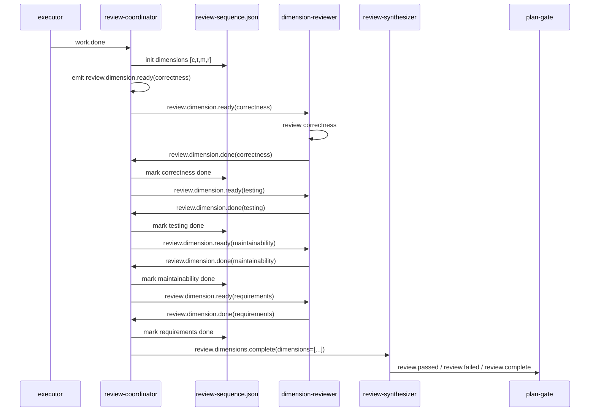

# ce-executor-serial preset — 无 wave 的串行 review 链路

## Overview

新增一个 builtin preset `ce-executor-serial`。它保留 `ce-executor-isolated` 的 plan-driven 工作流（coordinator → executor → fixer → debug-resolver → plan-gate → shipper → reporter），但把 **review 阶段从 wave 并行改成纯串行事件链**：

- `review-coordinator` 在 `work.done` / `fix.applied` 时初始化本次要审的 dimension 序列，写入状态文件，然后逐个 emit `review.dimension.ready`。
- `dimension-reviewer` 每次只审一个 dimension，emit `review.dimension.done` 或 `review.dimension.failed`。
- `review-coordinator` 收到 `review.dimension.done` / `review.dimension.failed` 后更新序列状态，再 emit 下一个 `review.dimension.ready`；全部维度完成后 emit `review.dimensions.complete`。
- `review-synthesizer` 由 `review.dimensions.complete` 触发，读取所有 findings 文件并给出 verdict。

整个链路不依赖 `wave_id`、`wave_total`、`wave_index`，也不调用 wave dispatcher；isolated 模式下的「单 turn 单 business event」边界天然成立，因为每个 turn 只推进一个 dimension。

> 该方案与 origin 文档 `2026-06-17-ce-executor-serial-review-requirements.md` 的假设不同：origin 仍保留 `review.wave.ready` 并期望 dispatcher `concurrency=1`。用户明确决策「彻底去掉 wave，直接串行执行」，因此本计划采用 review-coordinator 状态机方案。

---

## Problem Frame

`ce-executor-isolated` 的 review wave 在真实运行中频繁出现 worker 审错维度、维度丢失、超时等问题，最终触发 `plan.blocked(reason=dimension_reviewers_failed_to_converge)`，loop 无法完成。用户对 wave 并行机制失去信心，希望：

1. 新增一个 **无 wave** 的串行 review preset。
2. 一次只跑一个 dimension-reviewer，确定性推进。
3. 保证 schemas / payload 定义完整，能够通过 `ralph preset check --strict` 和 `run-tests.sh`。

---

## Requirements Trace

| 来源 | 需求 | 本计划如何满足 |
|------|------|----------------|
| Origin R1 | 新增 `ce-executor-serial` preset | U2 创建 `presets/en/ce-executor-serial.yml` |
| Origin R2 | review 阶段串行 | U2 去掉 `dimension-reviewer.concurrency`，改为触发 `review.dimension.ready` 后单实例执行 |
| Origin R3 | timeout 覆盖串行总耗时 | U2 保留 `dimension-reviewer.timeout: 1800`；失败时 `default_publishes: review.dimension.failed` 兜底 |
| Origin R4 | review-coordinator 仍 emit 一个「wave」（origin 语义） | 改为 emit 一串 `review.dimension.ready` + 最终 `review.dimensions.complete` |
| Origin R5 | dispatcher 识别 concurrency=1 | 不适用，无 dispatcher |
| Origin R6 | partial_deadline 不误杀 | 不适用，无 wave deadline |
| Origin R7 | worker 失败记录并继续 | `dimension-reviewer` emit `review.dimension.failed`；coordinator 继续下一个维度 |
| Origin R8 | synthesizer 等齐全部维度后激活 | coordinator 保证只 emit `review.dimensions.complete` 当 `review-sequence.json` 中全部维度都完成 |
| Origin R9 | 缺失维度时 synthesizer 能拿到 missing list | `review.dimensions.complete` payload 携带 `dimensions` 数组与每个维度状态 |
| Origin R10 | preset 清单 5 处同步 | U3 同步 manifest / presets.rs / index.json / zsh 补全 / AGENTS.md |
| Origin R11 | 中文变体可选 | 本计划 **推迟**，首版只提供英文 preset |
| Origin R12 | `run-tests.sh` 通过 | U6 验证 |
| Origin R13 | smoke/BDD scenario | U5 新增 BDD scenario |
| Origin R14 | `ralph preset check builtin:ce-executor-serial` 通过 strict | U4 / U6 验证 |
| 用户补充 | 彻底去掉 wave | U2 删除 `review.wave.ready`、`wave.worker.failed` 等 wave 语义；不依赖 dispatcher |
| 用户补充 | schemas / payload 写好 | U1 新建 schema SSOT，U2 中每个新 topic 都有 schema |

---

## Scope Boundaries

### 本次覆盖

- 新建 `ce-executor-serial` preset（英文）。
- 新建 schema SSOT `presets/schemas/ce-executor-serial.yml`。
- review-coordinator / dimension-reviewer / review-synthesizer 的拓扑与指令改造为串行无 wave。
- preset 清单 5 处同步（manifest.yml、presets.rs、index.json、zsh 补全、AGENTS.md）。
- 相关单元测试与 BDD scenario 更新。

### 本次不覆盖

- 不删除、不修改 `ce-executor-isolated` 并行 preset。
- 不改 wave dispatcher、wave detection、flow_lifecycle 等通用运行时。
- 不添加中文变体 `presets/zh/ce-executor-serial-zh.yml`（可后续单独 PR）。
- 不实现「incomplete-sequence gate」机制层兜底；串行失败由 `dimension-reviewer.default_publishes` 和 `progress-steward` 覆盖首版。

### Deferred to Follow-Up Work

- `presets/zh/ce-executor-serial-zh.yml`：等英文 preset 稳定后再翻译同步。
- 机制层 `incomplete_sequence_gate`：如果首版运行中发现 coordinator 卡住但无失败事件，再考虑添加类 wave gate 的序列超时兜底。

---

## Context & Research

### Relevant Code and Patterns

- `presets/en/ce-executor-isolated.yml` — 现有并行 preset 的完整拓扑与指令模板（see origin）。
- `presets/schemas/ce-executor-isolated.yml` — schema SSOT 格式与 build.rs 合并语义（`crates/ralph-cli/build.rs:148-186`）。
- `crates/ralph-cli/src/presets.rs` — embedded preset 数组与测试断言（`test_list_presets_returns_all` 等需要更新数量）。
- `presets/manifest.yml` / `presets/index.json` / `scripts/ralph-zsh-plugin.zsh` / `AGENTS.md` — 新增 public builtin 必须同步的 5 处。
- `crates/ralph-core/src/event_loop/mod.rs:6960-7037` — isolated 模式单 business event 边界；本方案天然符合（每 turn 推进一个 dimension）。
- `crates/ralph-core/src/event_loop/review_step_state.rs` — 现有 wave tracker 依赖 `review.wave.ready`；本方案不触发它，因此 plan-gate / progress 对 terminal 的判断仍通过 `synth_terminal` 字段工作。
- `crates/ralph-core/tests/scenarios/` — BDD scenario 格式（参考 `ce_executor_bootstrap_recovery.yml`）。

### Institutional Learnings

- `AGENTS.md` Presets & Hats 段：新增 builtin preset 必须同步 YAML、manifest、`presets.rs`、index.json、zsh 补全 5 处（含本文件更新）。
- `scripts/validate-builtin-presets.sh`：public preset 默认需要无 error/warning；只有 `autoresearch` / `debug` 有 topology 豁免。新 preset 应争取一次性通过。

---

## Key Technical Decisions

1. **串行推进由 review-coordinator 状态机负责，不新增 accumulator hat**
   - Rationale：减少 hat 数量与拓扑复杂度；review-coordinator 已经负责维度选择，把「下一个维度」逻辑放在这里最自然；isolated 单事件边界天然支持。
2. **无 wave dispatcher、无 wave_id**
   - Rationale：用户明确要去掉 wave；同时避免改造 isolated 边界或 flow_lifecycle。
3. **新增状态文件 `review-sequence.json`**
   - Rationale：review-coordinator 需要在多个 turn 之间记住 pending / done / failed 维度；文件是跨 turn 的最简单状态载体，与 `last_reviewed_sha` 模式一致。
4. **`dimension-reviewer` 增加 `review.dimension.failed` 与 `default_publishes`**
   - Rationale：单个 dimension 超时或崩溃时要有可观测事件，否则 coordinator 无法推进；利用 runner 已有的 `default_publishes` 兜底机制。
5. **Schema 使用独立 SSOT 文件，不与并行 preset 共享**
   - Rationale：新 preset 引入新 topic（`review.dimension.ready` / `.failed` / `.complete`），并行 preset 不需要；独立文件避免未来改动互相影响。
6. **中文变体推迟**
   - Rationale：先保证英文 preset 能跑通并进入 Tier-0 候选，再同步中文可减少翻译返工。

---

## Open Questions

### Resolved During Planning

- **Q: 是否需要新增 accumulator hat？**
  - A: 否。review-coordinator 触发 `review.dimension.done` / `review.dimension.failed` 后直接 emit 下一个 ready 或 complete。
- **Q: 单个 dimension 失败后的策略？**
  - A: 默认「继续」，把失败维度状态写入 sequence 文件并在 `review.dimensions.complete` payload 中标记；synthesizer 据此给出 fail verdict 或 plan.blocked。
- **Q: timeout / 卡住如何处理？**
  - A: `dimension-reviewer.timeout` 控制单实例上限；未 emit 时 `default_publishes: review.dimension.failed` 兜底。

### Deferred to Implementation

- **Q: `review.dimensions.complete` payload 中 dimensions 数组的精确字段？**
  - A: 实现时根据 synthesizer 实际读取需求确定，至少包含 `dimension`、`status`（`done` / `failed`）、`findings_file`、`reason`（失败时）。
- **Q: 是否需要为 serial preset 启用/复用 `incomplete_wave_gate`？**
  - A: 首版关闭；若实测 coordinator 长时间不推进且无失败事件，再评估是否添加序列级 gate。

---

## High-Level Technical Design

> *This illustrates the intended approach and is directional guidance for review, not implementation specification. The implementing agent should treat it as context, not code to reproduce.*



### ASCII 拓扑（完整 preset）

```text
                                          .ralph/agent/
                                          tasks.jsonl
                                               ^
                                               |
┌─────────────┐                                │
│   operator  │                                │
└──────┬──────┘                                │
       │ ralph run -H builtin:ce-executor-serial│
       v                                        │
┌─────────────┐    plan.complete      ┌──────────────┐
│ coordinator │ --------------------> │   plan-gate  │
│ (bootstrap) │ <-------------------- │   (gate)     │
└──────┬──────┘    plan.approved      └──────┬───────┘
       │                                      │
       │ plan.start / work.start              │
       v                                      │
┌─────────────┐                               │
│   executor  │                               │
│  (do work)  │                               │
└──────┬──────┘                               │
       │ work.done                             │
       v                                        │
┌─────────────────┐   review.dimension.ready   ┌─────────────────┐
│ review-         │ --------------------------> │  dimension-     │
│ coordinator     │                             │  reviewer       │
│ (owns review-   │ <-------------------------- │  (1 dim/turn,   │
│  sequence.json) │   review.dimension.done     │  no concurrency │
│                 │   review.dimension.failed   │  timeout 1800)  │
└───────┬─────────┘                             └─────────────────┘
        │                                              │
        │ review.dimensions.complete                   │
        v                                              │
┌─────────────────┐   reads review-sequence.json      │
│ review-         │   + findings-{dim}-{task}.json    │
│ synthesizer     │ <----------------------------------┘
│                 │
└───────┬─────────┘
        │ review.passed / review.failed
        v
┌─────────────┐
│  plan-gate  │  ── review.failed ──> fix loop
└──────┬──────┘
       │ plan.complete
       v
┌─────────────┐     ┌─────────────┐     ┌─────────────┐
│   shipper   │ --> │   reporter  │ --> │ report.done │
└─────────────┘     └─────────────┘     └─────────────┘

====================== 修复/兜底链路 ======================

   work.failed / review.failed / plan.blocked
              │
              v
        ┌─────────────┐    debug.task     ┌─────────────────┐
        │    fixer    │ <──────────────── │  debug-resolver │
        │ (apply fix) │                   │  (diagnose)     │
        └──────┬──────┘                   └─────────────────┘
               │ fix.applied
               └──────────────────────> review-coordinator
                                          (re-init sequence)
```

关键：每个箭头对应一次 isolated turn，因此每 turn 只有一个 business event，符合现有边界。

---

## Implementation Units

- [ ] U1. **新建 schema SSOT `presets/schemas/ce-executor-serial.yml`**

**Goal:** 为 `ce-executor-serial` 定义完整、可编译合并的 payload schema。

**Requirements:** R1, R13, 用户补充 schemas/payload

**Dependencies:** 无

**Files:**
- Create: `presets/schemas/ce-executor-serial.yml`
- Test: `crates/ralph-cli/src/presets.rs`（ indirectly 通过 build.rs merge + preset check）

**Approach:**
- 复制 `presets/schemas/ce-executor-isolated.yml` 的全部 topic schema 作为基线。
- 删除 `review.wave.ready`。
- 新增：
  - `review.dimension.ready`: required `[dimension, focus, depth, diff_base, intent_summary, changed_files, plan_name, task_id, task_key, step]`
  - `review.dimension.failed`: required `[dimension, reason, plan_name, task_id, task_key, step]`
  - `review.dimensions.complete`: required `[plan_name, task_id, task_key, step, dimensions]`；`dimensions` 为 json 数组，元素至少含 `dimension`、`status`；`findings_file` 为可选（成功维度必须有，失败/兜底维度可能没有）；失败时可选 `reason`。

> **Note:** `review.dimensions.complete` intentionally uses the plural `dimensions` because it is an aggregate event over the whole review sequence.

> **Note:** The `dimensions` array element shape (`dimension`, `status`, optional `findings_file`, optional `reason`) is enforced by agent prompt discipline and by the coordinator/synthesizer instructions, not by `EventSchema`, because the current `EventSchema` only validates top-level fields and has no nested array-element validation.

> **Note:** When copying the base schema from `ce-executor-isolated.yml`, the `review.passed.skip_reason` allowed values need a synthesizer-specific entry for the normal serial pass case; the serial preset will add `dimensions_complete` to the synthesizer's allowed `skip_reason` values, so a normal all-dimensions pass does not have to lie with `aggregate_timeout`.

- 删除不再使用的 `wave.worker.failed`（serial preset 不再 publish 该 topic）。

**Patterns to follow:**
- `presets/schemas/ce-executor-isolated.yml` 的 SSOT 结构与注释风格。
- `build.rs:148-186` 的 merge 语义（SSOT base + inline override）。

**Test scenarios:**
- Happy path: `RalphConfig::parse_yaml` 成功解析合并后的 preset，新 topic schema 存在。
- Edge case: `review.dimensions.complete` payload 缺少 `dimensions` 时被 event policy 拒绝。
- Error path: `review.dimension.failed` 缺少 `dimension` 时被 event policy 拒绝。

**Verification:**
- `cargo build -p ralph-cli` 成功（build.rs merge 不 panic）。
- `ralph preset check builtin:ce-executor-serial --strict` 中无 `missing_schema_for_published_topic` 类错误。

---

- [ ] U2. **新建 preset YAML `presets/en/ce-executor-serial.yml`**

**Goal:** 实现无 wave 串行 review 的完整 preset。

**Requirements:** R1–R9, 用户补充「去掉 wave」

**Dependencies:** U1

**Files:**
- Create: `presets/en/ce-executor-serial.yml`
- Test: `crates/ralph-cli/src/presets.rs`, BDD scenario U5

**Approach:**
1. 以 `presets/en/ce-executor-isolated.yml` 为模板复制。
2. 修改头部注释，说明 serial / no-wave 语义。
3. `event_loop.workflow_contract.incomplete_wave_gate.enabled: false`（无 wave）。
4. 清空 `event_loop.event_policy.schemas` 内联块，完全依赖 U1 的 SSOT（减少漂移）。同时更新 `event_loop.event_policy.topic_deny_rules`：删除从 `ce-executor-isolated.yml` 继承的、对本 preset 已过时的 `review.wave.ready` 拒绝规则；新增针对四个新 topic 的拒绝规则，确保只有所属 hat 能发布对应主题：
   - `review-coordinator` 允许发布 `review.dimension.ready`、`review.dimensions.complete`
   - `dimension-reviewer` 允许发布 `review.dimension.done`、`review.dimension.failed`
   - `ralph` 伪 hat 被拒绝发布上述四个新 topic
   与本次串行 review 无关的继承规则保持不变。
5. 改造 `review-coordinator`：
   - `triggers: [work.done, fix.applied, review.dimension.done, review.dimension.failed]`
   - `publishes: [review.dimension.ready, review.dimensions.complete]`
   - `terminal_events: [review.dimensions.complete]`
   - `obligations`：
     - `work.done`, `fix.applied` → `must_emit_any_of: [review.dimension.ready, review.dimensions.complete]`（无待审维度时直接 complete）。
     - `review.dimension.done` → `must_emit_any_of: [review.dimension.ready, review.dimensions.complete]`。
     - `review.dimension.failed` → `must_emit_any_of: [review.dimension.ready, review.dimensions.complete]`。
   - `instructions`：
     - 在 `work.done` / `fix.applied` 时初始化固定的 **4 维** 序列：`correctness`、`testing`、`maintainability`、`requirements`。v1 不根据 diff 自适应，序列长度始终为 4，并写入 `review-sequence.json`。
     - 每次触发时读取 sequence 文件，找到第一个 `pending` 维度 emit `review.dimension.ready`；如果全部完成则 emit `review.dimensions.complete`。
     - `review.dimensions.complete` payload 必须包含完整 `dimensions` 数组，数组长度与 sequence 初始长度一致。
     - 若读取 `review-sequence.json` 时发现 JSON 无效或文件损坏，emit `review.dimensions.complete`，其 `dimensions` 数组包含全部四个维度且每个维度 `status: failed`、`reason: sequence_corrupted`；`review-synthesizer` 会据此 emit `plan.blocked`。
5.5. **定义 `review-sequence.json` 状态文件 schema**
   - 顶层字段：`plan_name`（字符串）、`task_id`（字符串）、`task_key`（字符串）、`step`（字符串/数字）、`dimensions`（数组）。
   - `dimensions` 每个元素：`{ "dimension": 字符串, "status": "pending" | "done" | "failed", "findings_file"?: 字符串, "reason"?: 字符串 }`。
   - 写入策略：先写入临时文件，再 `rename` 到目标路径，保证原子性。
   - 损坏检测：读取时若 JSON 解析失败，视为 corruption，按上一条 recovery 规则处理（全部维度 `status: failed`、`reason: sequence_corrupted`）。
6. 改造 `dimension-reviewer`：
   - `triggers: [review.dimension.ready]`
   - `publishes: [review.dimension.done, review.dimension.failed]`
   - `terminal_events: [review.dimension.done, review.dimension.failed]`
   - 删除 `concurrency` 与 `aggregate`。
   - `timeout: 1800`
   - `instructions`：
     - 审单个 dimension，必须显式 emit `review.dimension.done` 或 `review.dimension.failed`；不再读取 wave env。
     - 若 hat 超时或崩溃且未显式 emit 任何事件，由现有 `missing_event_gate` / `progress-steward` 路径处理（不再通过 `default_publishes` 自动生成 `review.dimension.failed`）。`review-coordinator` 仍接受 `review.dimension.failed` 最小 payload（只含 `dimension` 与 `reason`）并继续推进。
7. 改造 `review-synthesizer`：
   - `triggers: [review.dimensions.complete]`
   - `publishes: [review.passed, review.failed, review.complete, plan.blocked]`
   - 删除 `aggregate` 块。
   - `instructions`：读取 `review-sequence.json` 和每个成功维度的 `findings-{dimension}-{task_id}.json`；对失败或缺失 `findings_file` 的维度，把 `reason` 当 findings 合并后给出 verdict。在 emit 任一 terminal verdict（`review.passed` / `review.failed` / `review.complete`）后，将 `last_reviewed_sha` 持久化到 `.agents/scratchpad/ce-executor/{plan_name}/last_reviewed_sha`，确保下一次 review 使用正确的 diff base。
8. 其他 hat（coordinator, executor, fixer, debug-resolver, plan-gate, shipper, reporter, progress-steward）保持与并行 preset 一致。

**Patterns to follow:**
- `presets/en/ce-executor-isolated.yml` 的指令结构、guardrails、topic_deny_rules。
- `crates/ralph-core/src/config/hat.rs` 中 `default_publishes` 必须属于 `publishes` 的规则。

**Test scenarios:**
- Happy path: `ralph preset check builtin:ce-executor-serial --strict` 通过。
- Edge case: `dimension-reviewer` 显式 emit `review.dimension.failed` 时，coordinator 继续下一个维度；若未 emit 任何事件，由 `missing_event_gate` / `progress-steward` 路径兜底并触发恢复。
- Error path: `review-coordinator` emit 的 `review.dimensions.complete` 若缺少 `dimensions` 会被 schema 拒绝。

**Verification:**
- `ralph preset check builtin:ce-executor-serial --strict` 返回 `passed: true`。
- `cargo nextest run -p ralph-cli presets` 通过。

---

- [ ] U3. **同步 preset 清单与补全**

**Goal:** 保证新 preset 在 manifest.yml、presets.rs、index.json、zsh 补全与 AGENTS.md 中同步（5 处）。

**Requirements:** R10

**Dependencies:** U2

**Files:**
- Modify: `presets/manifest.yml`
- Modify: `crates/ralph-cli/src/presets.rs`
- Modify: `presets/index.json`
- Modify: `scripts/ralph-zsh-plugin.zsh`
- Modify: `AGENTS.md`（更新 Presets & Hats 段 builtin preset 列表）

**Approach:**
- `presets/manifest.yml` 的 `embedded:` 列表追加 `ce-executor-serial`。
- `crates/ralph-cli/src/presets.rs` 的 `PRESETS` 数组追加 `EmbeddedPreset { name, description, content, public: true }`。
- `presets/index.json` 追加 public 条目（category: development）。
- `scripts/ralph-zsh-plugin.zsh` 的 `_RALPH_BUILTIN_HAT_VALUES` / `_RALPH_BUILTIN_HAT_DESCRIPTIONS` 追加。
- `AGENTS.md` 中 Presets & Hats 段 builtin preset 列表追加 `ce-executor-serial`。

**Patterns to follow:**
- 现有 `ce-executor-isolated`、`ce-executor-wave`、`debug`、`autoresearch` 的同步方式。

**Test scenarios:**
- Happy path: `cargo nextest run -p ralph-cli test_list_presets_returns_all` 期望数量变为 5。
- Edge case: `get_preset("ce-executor-serial")` 非空且 `public`。

**Verification:**
- `cargo nextest run -p ralph-cli` 通过。

---

- [ ] U4. **更新并新增 ralph-cli preset 测试断言**

**Goal:** 把新 preset 纳入 CI 与单元测试保护网。

**Requirements:** R12, R14

**Dependencies:** U3

**Files:**
- Modify: `crates/ralph-cli/src/presets.rs`（测试模块）
- Modify: `scripts/validate-builtin-presets.sh`（若新 preset 需要 topology 豁免则更新；否则保持不变）

**Approach:**
- 更新 `test_list_presets_returns_all` 断言数量（4 → 5）。
- 更新 `test_preset_names_returns_all_names`。
- 新增 `test_ce_executor_serial_has_report_done_completion_gate`：验证 `required_events == ["report.done"]`。
- 新增 `test_ce_executor_serial_synthesizer_triggers_on_dimensions_complete`：验证 `review-synthesizer.triggers == ["review.dimensions.complete"]`，不含 `review.dimension.done` / `review.wave.ready`。
- 新增 `test_ce_executor_serial_dimension_reviewer_default_failure`：验证 `default_publishes == Some("review.dimension.failed")` 且属于 `publishes`。
- 新增 `test_ce_executor_serial_root_preset_matches_embedded`：验证 `presets/en/ce-executor-serial.yml` + `presets/schemas/ce-executor-serial.yml` 与 embedded 二进制一致（参考 `test_ce_executor_root_preset_matches_embedded`）。

**Patterns to follow:**
- 现有 `test_ce_executor_required_events_is_report_done` 等测试风格。

**Test scenarios:**
- Happy path: 新断言通过。
- Error path: 若有人在 serial preset 中误加 `review.wave.ready`，测试失败。

**Verification:**
- `cargo nextest run -p ralph-cli --bin ralph -- presets` 通过。

---

- [ ] U5. **新增 BDD scenario 验证串行 review 链路**

**Goal:** 用一个轻量级 scenario 覆盖 serial review 的事件拓扑。

**Requirements:** R13

**Dependencies:** U2

**Files:**
- Create: `crates/ralph-core/tests/scenarios/ce_executor_serial_review.yml`

**Approach:**
- 配置最小化 hats：coordinator, executor, review-coordinator, dimension-reviewer, review-synthesizer, plan-gate, shipper, reporter。
- `mock_responses` 按 turn 提供：
  1. `work.done`
  2. `review.dimension.ready`（correctness）
  3. `review.dimension.done`（correctness）
  4. `review.dimension.ready`（testing）
  5. `review.dimension.done`（testing）
  6. `review.dimension.ready`（maintainability）
  7. `review.dimension.done`（maintainability）
  8. `review.dimension.ready`（requirements）
  9. `review.dimension.done`（requirements）
  10. `review.dimensions.complete`
  11. `review.passed`
  12. `plan.complete`
  13. `REVIEW_COMPLETE`
  14. `report.done`
  15. `LOOP_COMPLETE`
- `expected.iterations` 与 `expected.events` 按顺序断言关键 topic 出现且 `completion: true`。

**Patterns to follow:**
- `crates/ralph-core/tests/scenarios/ce_executor_bootstrap_recovery.yml` 的 mock response 格式。

**Test scenarios:**
- Happy path: scenario 完成且包含 `review.dimensions.complete` 与 `LOOP_COMPLETE`。
- Edge case: 若 scenario 中漏掉一个 `review.dimension.done`，断言 `review.dimensions.complete` 不出现。

**Verification:**
- `cargo nextest run -p ralph-core --test scenarios` 通过。

---

- [ ] U6. **全量验证**

**Goal:** 确保新 preset 不破坏 workspace 其他测试。

**Requirements:** R12

**Dependencies:** U1–U5

**Files:**
- 无新文件；运行脚本。

**Approach:**
1. `cargo build -p ralph-cli`（验证 build.rs merge）。
2. `ralph preset check builtin:ce-executor-serial --strict --format json`。
3. `./scripts/validate-builtin-presets.sh --strict`。
4. `./scripts/run-tests.sh`（或等价 `cargo nextest run --workspace --exclude ralph-e2e && cargo test --workspace --exclude ralph-e2e --doc`）。

**Test scenarios:**
- Integration: `ralph preset check` 通过 strict。
- Regression: 现有 `ce-executor-isolated` 测试仍然通过。

**Verification:**
- 所有命令退出码 0。

---

## System-Wide Impact

- **Interaction graph:**
  - 新增 topic `review.dimension.ready`、`review.dimension.failed`、`review.dimensions.complete` 进入事件总线。
  - `review-coordinator` 新增对 `review.dimension.done` / `review.dimension.failed` 的订阅；`review-synthesizer` 改为订阅 `review.dimensions.complete`。
- **Error propagation:**
  - `dimension-reviewer` 超时/崩溃 → 由 `missing_event_gate` / `progress-steward` 触发恢复（不再使用 `default_publishes` 自动生成事件）；显式 emit 的 `review.dimension.failed` 才会被 `review-coordinator` 消费并继续推进。
  - `review-coordinator` 若忘记 emit → `missing_event_gate` / `progress-steward` 兜底。
- **State lifecycle risks:**
  - `review-sequence.json` 可能因 agent 错误而损坏；coordinator 读取失败时 emit `review.dimensions.complete`（全部维度 `status: failed`、`reason: sequence_corrupted`），由 `review-synthesizer` 给出 `plan.blocked`。
  - `last_reviewed_sha` 在 `review-synthesizer` 发出 terminal verdict 后持久化，确保下一次 review 使用正确的 diff base。
- **API surface parity:**
  - 仅新增 builtin preset；CLI 接口无变化。
- **Integration coverage:**
  - BDD scenario 覆盖事件链路；preset check 覆盖拓扑与 schema；全量测试覆盖回归。
- **Unchanged invariants:**
  - `ce-executor-isolated` 并行 preset 的拓扑、schema、测试全部不变。
  - isolated 模式的单 business event 边界不变；serial 链路正是因为每 turn 只有一个业务事件才成立。

---

## Risks & Dependencies

| Risk | Mitigation |
|------|------------|
| `ralph preset check --strict` 对新 topology 报 WAC 错误 | 实现时逐项修复 lint finding；必要时参考 `presets/en/ce-executor-isolated.yml` 的 topic_deny_rules / obligations 配置。 |
| 串行维度过多导致 wall time 过长 | v1 固定 4 维；单 dimension timeout 1800s；4 维最坏 120min；用户接受串行即接受该 trade-off。 |
| `review-sequence.json` 状态漂移或损坏 | coordinator 每次读取时做 JSON 校验；损坏时 emit `review.dimensions.complete`（全部维度 `failed` + `reason: sequence_corrupted`），由 synthesizer 给出 `plan.blocked`。 |
| dimension-reviewer 超时/崩溃后无事件 | 由 `missing_event_gate` / `progress-steward` 路径兜底；正常失败仍由 dimension-reviewer 显式 emit `review.dimension.failed`。 |
| 与并行 preset 的 schema SSOT 复制未来产生漂移 | 独立 SSOT；后续若通用 topic schema 变更，需要手动同步两处。 |

---

## Documentation / Operational Notes

- 更新 `AGENTS.md` 中 builtin preset 列表（U3）。
- 新 preset 使用方式：
  ```bash
  ralph run -H builtin:ce-executor-serial -p "docs/plans/my-plan.md"
  ```
- 不建议把 `ce-executor-serial` 直接加入 `TIER_0_WAC_PRESETS`；待稳定运行后再晋升。

---

## Sources & References

- **Origin document:** `docs/brainstorms/2026-06-17-ce-executor-serial-review-requirements.md`
- **Related diagnosis:** `docs/report/2026-06-17-ce-executor-isolated-keen-fern-review-verdict-failed-diagnosis.md`
- **Base preset:** `presets/en/ce-executor-isolated.yml`
- **Base schema SSOT:** `presets/schemas/ce-executor-isolated.yml`
- **Build pipeline:** `crates/ralph-cli/build.rs`
- **Preset registry tests:** `crates/ralph-cli/src/presets.rs`
- **Isolated boundary:** `crates/ralph-core/src/event_loop/mod.rs`（single business event logic）
- **BDD scenarios:** `crates/ralph-core/tests/scenarios/`

## Deferred / Open Questions

### From 2026-06-17 review

- **Serial preset may not address real root cause** — Problem Frame (P1, product-lens, confidence 75)

  If workers reviewed wrong dimensions or timed out because of prompt ambiguity or model limits rather than wave dispatch itself, removing concurrency will still fail—just more slowly.

  <!-- dedup-key: section="problem frame" title="serial preset may not address real root cause" evidence="ce-executor-isolated 的 review wave 在真实运行中频繁出现 worker 审错维度、维度丢失、超时等问题" -->

- **Wall-time regression not quantified against 8-hour runtime cap** — Risks & Dependencies (P1, product-lens, confidence 75)

  Four dimensions each with a 30-minute timeout can consume two hours per plan step; for multi-step plans this competes with the preset's max_runtime_seconds: 28800 budget.

  <!-- dedup-key: section="risks dependencies" title="walltime regression not quantified against 8hour runtime cap" evidence="默认 4 维...单 dimension timeout 1800s；4 维最坏 120min" -->

- **Deferred incomplete-sequence gate leaves stall path unresolved** — Scope Boundaries (P1, product-lens, adversarial, confidence 100)

  The motivating problem was review not converging; the first version has no mechanism-layer gate for a stuck coordinator, relying only on default_publishes and progress-steward.

  <!-- dedup-key: section="scope boundaries" title="deferred incompletesequence gate leaves stall path unresolved" evidence="不实现「incomplete-sequence gate」机制层兜底；串行失败由 dimension-reviewer.default_publishes 和 progress-steward 覆盖首版" -->

- **New builtin preset adds cognitive load without evaluating simpler toggle** — Overview (P2, product-lens, confidence 75)

  Users will choose among ce-executor-isolated, ce-executor-wave, and ce-executor-serial; a separate preset is the heaviest way to express review concurrency=1.

  <!-- dedup-key: section="overview" title="new builtin preset adds cognitive load without evaluating simpler toggle" evidence="新增一个 builtin preset ce-executor-serial" -->

- **No success metrics or promotion criteria** — Problem Frame (P2, product-lens, confidence 75)

  The plan delays Tier-0 promotion until stable but provides no measurable definition of stable.

  <!-- dedup-key: section="problem frame" title="no success metrics or promotion criteria" evidence="保证 schemas / payload 定义完整，能够通过 ralph preset check --strict 和 run-tests.sh" -->

- **Default failure payload is low-signal and may bias synthesizer verdicts** — Implementation Units U2 (P2, product-lens, confidence 75)

  When a dimension reviewer times out or crashes, runner-generated review.dimension.failed may only contain dimension and reason, giving synthesizer no real findings.

  <!-- dedup-key: section="implementation units u2" title="default failure payload is lowsignal and may bias synthesizer verdicts" evidence="超时或被 runner 兜底时，生成的 review.dimension.failed 可能只含 dimension 与 reason" -->

- **Chinese variant deferred fragmenting preset parity** — Requirements Trace (P3, product-lens, confidence 75)

  Existing ce-executor-isolated has a Chinese variant; shipping serial preset only in English creates inconsistent experience.

  <!-- dedup-key: section="requirements trace" title="chinese variant deferred fragmenting preset parity" evidence="Origin R11 | 中文变体可选 | 本计划 推迟，首版只提供英文 preset" -->
