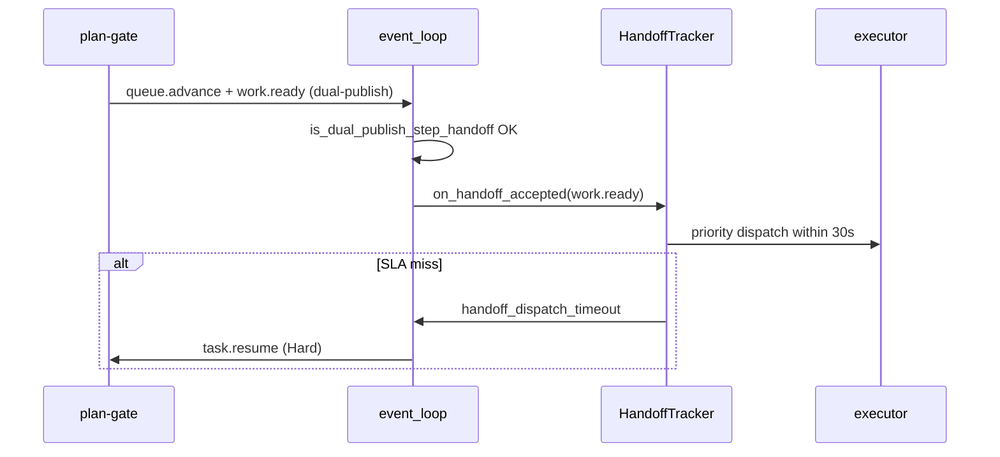
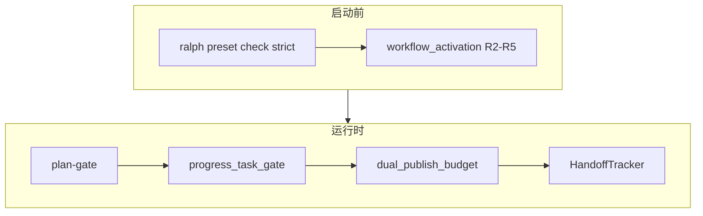

# feat: ce-executor Step Handoff — 阶段交接机制

## Overview

建立 **Step Handoff Mechanism（SHM）**：多步 plan 在阶段边界（`work.done` → review → `queue.advance` → `work.ready` → executor）的 **静态可证 + 运行时 SLA + 磁盘状态一致 + payload 硬门**。承接 WAC（`2026-06-12-002` / `003`）未完全闭合的 handoff 子集，并吸收 `2026-06-15` dual-publish isolated budget 教训。

与 `2026-06-16-002`（payload 恢复）、`2026-06-17-001`（wave 内并行）**正交、可并行**。本计划 **只增强、不削弱** 现有 WAC / U3 / U4 / isolated budget 行为。

### 代码现状速览（2026-06-16 审核）

以下能力已在当前 `main` 落地，本计划以**补缺口 + 加固回归**为主，不需要从零实现：

| 能力 | 路径 | 状态 |
|------|------|------|
| `HandoffIndex` / `HandoffTracker` | `crates/ralph-core/src/workflow_contract/` | ✅ 已实现并测试 |
| EventBus priority pre-emption | `crates/ralph-proto/src/event_bus.rs:251` | ✅ 已实现 |
| event_loop priority pass 集成 | `crates/ralph-core/src/event_loop/mod.rs:2684-2702` | ✅ 已集成 |
| HandoffTracker 集成（accepted/activated/expired） | `crates/ralph-core/src/event_loop/mod.rs:5150-5212`, `6602-6618`, `7705-7708` | ✅ 已集成 |
| Dual-publish carve-out | `crates/ralph-core/src/event_loop/mod.rs:6322-6327` | ✅ 已实现 |
| `review_step_state` synth terminal gate | `crates/ralph-core/src/event_loop/review_step_state.rs` | ✅ 已实现 |
| `verdict_gate`（含 `additional_topics`） | `crates/ralph-core/src/event_loop/mod.rs:1315`, `2150`, `2316`, `2785`, `5087` | ✅ 已实现 |
| `NULL_PAYLOAD_REJECT_TOPICS` | `crates/ralph-core/src/event_policy.rs:495` | ✅ 已实现，列表已扩展至 9 topic |

运行验证（当前已通过）：
- `cargo nextest run -p ralph-core -- workflow_activation` → 18/18 PASS
- `cargo nextest run -p ralph-core --test scenarios plan_gate_dual_publish` → PASS
- `cargo run -p ralph-cli -- preset check --strict -H builtin:ce-executor-isolated` → PASS

## Problem Frame

archive dispatch-gap：`plan-gate` 发 `queue.advance` 后 executor **10 分钟**未启动；ralph 兜底 re-emit 被拒；最终 `loop.cancel`。后续 `2026-06-15`：preset 双发 `queue.advance`+`work.ready` 仍被 isolated 单轮 business-event 预算打掉 `work.ready`。

### 已有基础（扩展，不重写）

| 能力 | 路径 | 现状 |
|------|------|------|
| WAC 静态规则 | `crates/ralph-core/src/preset_lint/workflow_activation.rs` | re-emit trap、handoff pairing 等 |
| HandoffIndex | `crates/ralph-core/src/workflow_contract/handoff_index.rs` | 单消费者 priority |
| HandoffTracker | `crates/ralph-core/src/workflow_contract/handoff_tracker.rs` | 30s SLA + escalation |
| Dual-publish carve-out | `crates/ralph-core/src/event_loop/mod.rs` ~L6322 | `is_dual_publish_step_handoff` |
| plan-gate 双发 preset | `presets/en/ce-executor-isolated.yml` ~L1570 | `publishes: [queue.advance, work.ready, ...]` |
| Synth terminal gate | `crates/ralph-core/src/event_loop/review_step_state.rs` | null `review.passed` 不置 terminal |
| Verdict gate | `presets/en/ce-executor-isolated.yml` `verdict_gate.additional_topics` | 含 `report.done` |
| BDD | `crates/ralph-core/tests/scenarios/plan_gate_dual_publish_handoff.yml` | dual-publish 验收 |

### 仍缺 / 被击穿

- `plan-gate.triggers` **缺** `fix.exhausted`、`debug.exhausted`（`2026-06-09` 诊断：plan-gate 在这些终态路径上没被激活）
- HandoffTracker escalation 在真实 multi-step run 仍可能 `pending`（multi-run 报告）
- **Progress ↔ tasks** 无机制硬门（agent 可漂移）
- null payload handoff 依赖分散逻辑，需与 002 SSOT 验收闭环
- Tier-0 WAC strict 需 **再验证** preset 变更后仍零 error

> **⚠️ 设计副作用预警**：把 `fix.exhausted` / `debug.exhausted` 加入 `plan-gate.triggers` 后，这两个 topic 将不再是单消费者（`debug-resolver` 消费 `fix.exhausted`，`shipper` 消费 `debug.exhausted`）。`HandoffIndex` 会把它们的 `consumer` 置为 `None`，从而**不再走 priority dispatch**。这对 SHM 主路径没有影响（核心 handoff 仍是 `work.ready` → `executor`），但 Unit 2 验收时需要确认 `work.ready` 的 priority 不受影响。

## Requirements Trace

| ID | 需求摘要 | 单元 |
|----|----------|------|
| R-A1–R-A5 | 静态 Step Handoff Contract | Unit 1 |
| R-B1–R-B4 | 运行时 handoff dispatch | Unit 2, 3 |
| R-C1 | Progress–Task 硬门 | Unit 4 |
| R-C2 | Synth terminal gate | Unit 5 |
| R-C3 | Verdict 闭包 | Unit 6 |
| R-D1–R-D3 | Handoff payload 硬门 + SSOT 验收 | Unit 5, 7 |
| R-E1–R-E2 | Preset 同步 | Unit 1 |
| R-F1–R-F4 | 验收 | Unit 8 |
| SC1–SC5 | 成功标准 | Unit 8 |

## Non-Regression Policy（强制）

1. **WAC 基线不得回退**：`cargo nextest run -p ralph-core -- workflow_activation` 及 `scenarios.rs` 中 WAC 测试 **始终绿**；本计划只 **增加** finding 或 **收紧** preset，不删除规则。
2. **Dual-publish 回归对**：任何改动 `is_dual_publish_step_handoff` 或 isolated budget 时，**同时**跑：
   - `plan_gate_dual_publish_handoff.yml`（必须通过）
   - `isolated_boundary_violation` scenario（第三 business event 仍拒）
3. **禁止隐式桥接**：不实现 `queue.advance` → 自动 `work.ready`；不扩展 `RALPH_CONTROL_TOPICS`（dispatch-gap anti-pattern）。
4. **Handoff priority 窄域**：仅 `HandoffIndex::is_priority_dispatchable()` 为 true 的 topic 走优先 dispatch；多消费者 topic 仍 U4 round-robin。
5. **Preset 变更可回滚**：`presets/en` + `zh` + `manifest` + `presets.rs` 四同步；`ralph preset check --strict -H builtin:ce-executor-isolated` 为合并门禁。
6. **默认不破坏其他 builtin**：WAC strict error **仅** Tier-0（`ce-executor-isolated` en/zh）；其他 builtin 仍 warn（WRC-09）。
7. **每 Unit 前跑** `./scripts/run-tests.sh` 子集 + 全量在 Unit 8。

## Scope Boundaries

- **覆盖**：静态 contract 收尾、preset 触发器闭包、handoff SLA 加固、progress/tasks 门、payload/verdict 硬门、multi-step E2E。
- **不覆盖**：wave spawn/partial/degraded（017-001）；Schema SSOT 实现（002）；bootstrap 隔离（002）。
- **Deferred**：用户自定义 preset 默认 strict（Q3：维持 builtin-only strict）。

## Key Technical Decisions

| 决策 | 理由 |
|------|------|
| **承接 WAC 003，不 fork 第二套 contract** | 代码已在 `workflow_activation.rs` |
| **Progress–Task 门放在 event_loop pre-handoff 钩子**（Q1 resolved） | 比纯 agent 自检可靠；比 preflight 更贴近运行时；`plan.blocked` 可路由 plan-gate |
| **Handoff SLA 超时 → Responder Hard：`task.resume` to plan-gate**（Q2 resolved） | 比直接 terminate 更可恢复；比 silent pending 强 |
| **`fix.exhausted` / `debug.exhausted` 仅加 trigger，不改拓扑** | 最小 preset diff |
| **与 002 集成：handoff null reject 后走 recoverable 链（若 002 已 merge）** | 单恢复语义 |

## High-Level Technical Design





## Implementation Units

- [x] **Unit 1: Tier-0 WAC 闭包与 preset 触发器修补**

**Goal:** `ce-executor-isolated` strict WAC 零 error；补全 plan-gate triggers / 验证 handoff pairing。

**Requirements:** R-A1–R-A5, R-E1, SC2

**Dependencies:** None

**Files:**
- Modify: `presets/en/ce-executor-isolated.yml`（`plan-gate.triggers` 增加 `fix.exhausted`, `debug.exhausted`）
- Modify: `presets/zh/ce-executor-isolated-zh.yml`（镜像）
- Modify: `crates/ralph-cli/src/presets.rs`（KTD 测试：plan-gate triggers 闭包）
- Test: `crates/ralph-core/tests/scenarios.rs`（`test_workflow_activation_contract_*`）
- Test: `scripts/validate-builtin-presets.sh`（Tier-0 strict）

**Approach:**
- `plan-gate.triggers` 追加：`fix.exhausted`, `debug.exhausted`（保留现有 5 项：[`review.passed`, `review.complete`, `work.failed`, `loop.cancel`, `queue.advance`]）。
- instructions 补 3–5 行：收到 `fix.exhausted` / `debug.exhausted` 时，按当前 step 状态决定发 `queue.advance`+`work.ready`、发 `plan.complete` 或 `plan.blocked`。**注意**：这不会取代 `debug-resolver` / `shipper` 的原有路径，只是让 plan-gate 在这些终态路径上也能被激活，避免 `2026-06-09` 诊断中“发了 5 次 `fix.exhausted` 但 plan-gate 0 次激活”的 stall。
- 跑 `run_workflow_activation_contract(config, strict=true)` 确认零 `preset.re_emit_trap` / handoff pairing error。
- **验证** `coordinator_hats` 已含 plan-gate/fixer/…（当前 preset 已齐，加回归测试防漂移）。

**Test scenarios:**
- Happy path: `ralph preset check --strict -H builtin:ce-executor-isolated` exit 0（当前已 PASS）。
- Happy path: 篡改 executor+queue.advance trap → strict check fail（AE1 回归）。
- Regression: `test_workflow_activation_contract_step_advance_handoff_chain` 仍绿（当前已 PASS）。

**Verification:** SC2 零 finding。

---

- [x] **Unit 2: HandoffTracker 运行时加固与 priority dispatch 验收**

**Goal:** `work.ready` handoff 后 executor **30s 内** activation；超时 Hard escalation。

**Requirements:** R-B1, R-B2, R-B4, SC1

**Dependencies:** Unit 1

**Files:**
- Modify: `crates/ralph-core/src/workflow_contract/handoff_tracker.rs`
- Modify: `crates/ralph-core/src/event_loop/mod.rs`（`on_handoff_accepted` / `expired` / hat 选择 priority pass）
- Modify: `crates/ralph-proto/src/event_bus.rs`（若 priority 选择在此，验证单测）
- Test: `crates/ralph-core/src/event_loop/tests/handoff_dispatch.rs`
- Test: `crates/ralph-cli/src/loop_runner/tests.rs`（HandoffTracker integration）

**Approach:**
- 确认 `work.ready` 在 HandoffIndex 中 `consumer=executor` 且 `is_priority_dispatchable`。
- `queue.advance` **不**进入 priority（KTD-WRC-5 / KTD-12：audit only）。
- `HandoffTracker::expired` → 写 recovery `handoff_dispatch_timeout` + inject `task.resume` **target=safe_target**：
  - 默认 safe target 为 `plan-gate`；
  - 当 original consumer 本身就是 `plan-gate` 时，fallback 到 `review-coordinator`（`HandoffTracker::expired` 当前实现）。
- **当前实现差异**：`HandoffTracker` 目前没有 repeated 计数器，也没有“3 次 Hard / 4 次 `plan.blocked`”的分档逻辑。该分档是否实现需由执行者判断：若保留，应在 `handoff_tracker.rs` 增加 `repeated` 计数并在 `event_loop/mod.rs` 升级；若认为一次 escalation 足够，应删除本计划中的分档描述。
- **Non-regression**: `test_workflow_activation_contract_handoff_priority_dispatch` 仍绿（当前已 PASS）。

**Test scenarios:**
- Happy path: `work.ready` publish → mock 时钟 29s 内 executor selected。
- Error path: 31s 无 activation → recovery envelope + `task.resume`。
- Regression: 多消费者 topic 不走 priority（AE5）。

**Verification:** SC1 p95 < 30s（scenario 或 integration mock）。

---

- [x] **Unit 3: Dual-publish isolated budget 回归加固**

**Goal:** `queue.advance` + `work.ready` 同轮双发稳定；第三 business event 仍拒。

**Requirements:** R-B3, R-F4

**Dependencies:** Unit 1

**Files:**
- Modify: `crates/ralph-core/src/event_loop/mod.rs`（`is_dual_publish_step_handoff` 注释与边界，~L6322）
- Test: `crates/ralph-core/tests/scenarios/plan_gate_dual_publish_handoff.yml`
- Test: isolated boundary scenario（与 2026-06-15-003 同名或 `four-p0-guards` 下）

**Approach:**
- 审阅 `is_dual_publish_step_handoff`：仅当 **同一 hat 同一轮**、**有序**、`queue.advance` 后接 `work.ready`。
- 增加负例单测：`(work.ready, queue.advance)` 逆序 → 第二项拒；`(queue.advance, work.ready, work.done)` → 第三项拒。
- 不改 per-turn budget 默认值（仍为 1 business + carve-out）。

**Test scenarios:**
- Happy path: dual-publish scenario YAML 绿（当前已 PASS）。
- Error path: 第三 business event → `event.isolation.boundary_violation`。
- Regression: `2026-06-15` 复现 fixture（若已有）仍通过。

**Verification:** R-F4 双 scenario 绿。

---

- [x] **Unit 4: Progress–Task 硬门（pre-handoff gate）**

**Goal:** `queue.advance` / `plan.complete` 前，progress.md 与 tasks.jsonl 一致；否则 `plan.blocked`。

**Requirements:** R-C1, R-F3, SC1

**Dependencies:** Unit 1

**Files:**
- Add: `crates/ralph-core/src/step_handoff/progress_task_gate.rs`
- Modify: `crates/ralph-core/src/event_loop/mod.rs`（在 policy accept 前或 `queue.advance`/`plan.complete` 专用钩子里调用）
- Modify: `crates/ralph-core/src/config/workflow_contract.rs`（新增 `step_handoff.progress_task_gate` 配置字段）
- Modify: `crates/ralph-core/src/config/loop_config.rs`（透传新字段）
- Modify: `crates/ralph-core/src/lib.rs`（新增 `pub mod step_handoff;`）
- Test: `crates/ralph-core/src/step_handoff/progress_task_gate.rs`
- Test: 新 scenario `step_handoff/progress_task_mismatch.yml`

**Approach:**
- 纯函数 `check_progress_task_alignment(step, task_id, workspace) -> Result<(), MismatchReason>`：
  - 读 `.ralph/agent/progress.md` Current Step / Completed Steps（简单解析，与 preset instructions 字段对齐）
  - 读 `tasks.jsonl` 中 `task_id` status
  - 规则：若 task `closed` 但 progress 未标 completed → mismatch；若 event `step` 与 progress Current 冲突 → mismatch
- mismatch → **Reject** publish，inject `plan.blocked`（plan-gate provenance）reason 含具体字段。
- **配置**：`workflow_contract.step_handoff.progress_task_gate: true`；builtin `ce-executor-isolated` preset 显式 `true`；默认 `false`（non-regression for other presets）。
- 不替代 agent 写 progress；只在 **推进类** topic 上硬门。

> **当前状态**：`step_handoff/` 目录、`progress_task_gate.rs`、`workflow_contract.step_handoff` 配置块均不存在。本单元是真正需要从零新增的模块。

**Test scenarios:**
- Happy path: task closed + progress 一致 → `queue.advance` accept。
- Error path: task closed + progress in_progress → `plan.blocked`，loop 不挂。
- Regression: 无关 topic（`review.dimension.done`）不触发 gate。

**Verification:** SC1 multi-step 无 progress 漂移导致的 silent stall。

---

- [x] **Unit 5: Synth terminal + handoff payload 硬门统一**

**Goal:** null handoff terminal 拒收；synth terminal 仅 full payload；与 002 SSOT 验收对齐。

**Requirements:** R-C2, R-D1, R-D2, SC3

**Dependencies:** Unit 1；**软依赖** 002 Unit 1（SSOT 验收）

**Files:**
- Modify: `crates/ralph-core/src/event_policy.rs`（确认 null reject topic 列表含 handoff 集）
- Modify: `crates/ralph-core/src/event_loop/review_step_state.rs`（synth_terminal 单测加固）
- Modify: `crates/ralph-core/src/event_loop/mod.rs`（`apply_event_policy_validation` 与 review_step_state 顺序）
- Test: `crates/ralph-core/tests/scenarios.rs`（`test_workflow_activation_contract_null_payload_rejected`）
- Test: 新 `step_handoff/null_review_passed_blocked.yml`

**Approach:**
- 当前 `NULL_PAYLOAD_REJECT_TOPICS`（`crates/ralph-core/src/event_policy.rs:495`）包含 9 topic：`review.passed`, `review.failed`, `review.complete`, `work.done`, `queue.advance`, `review.wave.ready`, `work.ready`, `plan.complete`, `plan.blocked`。
- 未直接包含 `work.ready`, `plan.complete`, `plan.blocked`，但这三个 topic 在 `ce-executor-isolated` 的 `event_policy.schemas` 中已强制 `payload: json_object` + `required_fields`，null payload 会在 schema 层被 `RejectWithResume`，实际效果等价。
- 是否扩展 `NULL_PAYLOAD_REJECT_TOPICS` 需由执行者决定：
  - **选项 A（推荐，已执行）**：把 `work.ready`, `plan.complete`, `plan.blocked` 加入 `NULL_PAYLOAD_REJECT_TOPICS`，使 R10 统一覆盖所有 handoff/terminal  topic，避免依赖 schema 层的副作用。当前总数 9 个 topic。
  - **选项 B**：保持现状，依赖 schema 层，但要在验收中证明 null 被 schema 拒绝。
- `review.passed` null → 不进入主 events；不置 `synth_terminal`；plan-gate 不被假阳性触发（当前已实现）。
- string→object normalize 保持（WAC R11）。
- 若 002 已 merge：recoverable reject 走统一 `task.resume`；否则维持现有 Reject 行为（**不放宽**）。

**Test scenarios:**
- Happy path: full payload `review.passed` → synth_terminal set → `queue.advance` 可发（当前已 PASS）。
- Error path: null `review.passed` ×3 → 主 events 0 条；recovery 有记录（当前已 PASS）。
- Regression: dispatch-gap events #17–19 类 fixture replay 不推进 plan-gate。

**Verification:** SC3 主 events null 计数 0。

---

- [x] **Unit 6: Verdict gate 闭包验证与加固**

**Goal:** REVIEW_COMPLETE fail 时 `report.done` / `LOOP_COMPLETE` 均被挡。

**Requirements:** R-C3

**Dependencies:** None（preset 已有 `additional_topics`）

**Files:**
- Modify: `crates/ralph-core/src/event_loop/mod.rs`（verdict_gate 实现，~L1315 / L2150 / L2316 / L2785 / L5087）
- Modify: `presets/en/ce-executor-isolated.yml`（reporter `conditional_forbid_topics` 若需对齐）
- Test: `crates/ralph-core/src/event_loop/tests/`（新增 verdict_gate_report_done.rs 或扩展现有）
- Test: scenario `step_handoff/verdict_gate_fail_blocks_report.yml`

**Approach:**
- 读现有 `verdict_gate`：确认对 `report.done` 检查 `pass_or_fail`（preset 已声明 `additional_topics`）。
- 补单测：先 `REVIEW_COMPLETE` fail → reporter 发 `report.done` pass_or_fail=fail → gate reject LOOP_COMPLETE；发 `report.done` 假 pass → 若 payload 与 REVIEW_COMPLETE 不一致则拒。
- **Non-regression**：pass 路径 LOOP_COMPLETE 仍允许。

> **当前实现状态**：`verdict_gate` 已在多处调用（`event_loop/mod.rs:1315` 聚合 topics、`L2150` 记录 verdict、`L2316` 检查 fail、`L2785`/`L5087` 默认事件记录）。`additional_topics: [report.done]` 已在 preset 中声明。本单元主要是**补测试**，源码改动可能很小。

**Test scenarios:**
- Happy path: REVIEW_COMPLETE pass → report.done → LOOP_COMPLETE OK。
- Error path: REVIEW_COMPLETE fail → LOOP_COMPLETE blocked。
- Error path: REVIEW_COMPLETE fail → report.done with fail → LOOP_COMPLETE blocked。

**Verification:** `2026-06-09` gentle-orchid 类假成功不再出现。

---

- [x] **Unit 7: Handoff topic SSOT 四消费链验收（002 集成点）**

**Goal:** handoff topic 在 prompt / precheck / loop / drift 同源（002 R-A3 在 handoff 子集的证明）。

**Requirements:** R-D3

**Dependencies:** 002 Unit 1（若未 merge，本单元 **仅** 跑现有 inline schema 基线并标记 follow-up）

**Files:**
- Test: `crates/ralph-cli/tests/policy_check_handoff.rs`（或扩展现有）
- Test: `crates/ralph-core/src/emit_schema_hint.rs`（handoff fix_hint）
- Doc: 本计划 Verification 段记录四链抽样命令

**Approach:**
- 对 `work.ready`, `queue.advance`, `work.done`, `review.passed` 抽样：改 SSOT 必填字段 → rebuild → 四处同步变化。
- `ralph emit --dry-run` / precheck 与 loop gate 同拒同一字段。
- **不改** SSOT 实现（归属 002）。

**Test scenarios:**
- Integration: SSOT 增字段 → 四链一致（002 SC3 子集）。

**Verification:** 002 merge 后本单元绿；未 merge 时 skip 标记 CI optional。

**四链抽样（handoff topic SSOT 同源验证）**

> 四个 handoff topic（`work.ready` / `queue.advance` / `work.done` / `review.passed`）
> 在以下四处的引用 file:line —— 002 plan R-A3 在 handoff 子集的证明。
> 改 SSOT 必填字段后四处必须同步变化（002 plan 覆盖）；本单元仅做基线抽样。

| Topic | Chain 1 Prompt | Chain 2 Precheck | Chain 3 Loop gate | Chain 4 Drift |
|-------|----------------|------------------|-------------------|---------------|
| `work.ready` | `emit_schema_hint.rs:36` (`build_publish_emit_section`) | `commands/emit.rs:11,87,111` (`fix_hint_for_hat_topic`) | `event_policy.rs:412` (`NULL_PAYLOAD_REJECT_TOPICS` 不含) / `event_policy.rs:561-668` (schema required_fields) | `drift/engine.rs:546-574` (`required_fields_from_config`) → `drift/detector.rs:381-426` (`check_field_completeness`) |
| `queue.advance` | 同上 `emit_schema_hint.rs:36` | 同上 `commands/emit.rs:11,87,111` | `event_policy.rs:417` (`NULL_PAYLOAD_REJECT_TOPICS` 含) / `event_policy.rs:561-668` | 同上 `drift/engine.rs:546-574` → `drift/detector.rs:381-426` |
| `work.done` | 同上 | 同上 | `event_policy.rs:416` (`NULL_PAYLOAD_REJECT_TOPICS` 含) / `event_policy.rs:561-668` | 同上 |
| `review.passed` | 同上 | 同上 | `event_policy.rs:413` (`NULL_PAYLOAD_REJECT_TOPICS` 含) / `event_policy.rs:561-668` | 同上 |

**SSOT 入口（`build.rs` 嵌入）：**
- `presets/schemas/ce-executor-isolated.yml:37` (`work.ready`)
- `presets/schemas/ce-executor-isolated.yml:47` (`work.done`)
- `presets/schemas/ce-executor-isolated.yml:88` (`review.passed`)
- `presets/schemas/ce-executor-isolated.yml:186` (`queue.advance`)

**验收命令：**
```bash
# 1. 编译通过
cargo check -p ralph-core -p ralph-cli

# 2. 四链抽样测试（6 个 test，全部 PASS）
cargo nextest run -p ralph-cli --test policy_check_handoff

# 3. WAC strict 基线不破
cargo nextest run -p ralph-core -- workflow_activation
```

**抽样测试覆盖（`crates/ralph-cli/tests/policy_check_handoff.rs`）：**
- `chain_1_prompt_lists_every_required_field_per_topic`：prompt builder 必须列出每个 topic 的所有 SSOT 必填字段
- `chain_2_precheck_rejects_missing_required_field_per_topic`：`ralph emit --json` 必须拒缺字段
- `chain_3_loop_gate_rejects_missing_required_field_per_topic`：`validate_event_with_hat` 必须产出 `MissingRequiredField` finding
- `chain_4_drift_detector_records_missing_required_field_per_topic`：`DriftDetector` 必须产出 `FieldCompleteness` finding
- `cross_chain_required_fields_are_uniformly_tracked`：四个 chain 的必填字段必须完全一致
- `cross_chain_required_fields_match_across_chains`：SSOT 字段必须在 prompt/drift 两侧同时被追踪

**SSOT follow-up（如有）：**
- 002 plan 未 merge，本单元仅跑 inline schema 基线；SSOT 实现本身（`presets/schemas/ce-executor-isolated.yml`）归属 002 plan。
- `presets/zh/ce-executor-isolated-zh.yml` 镜像同步（plan L69-110 含 `work.ready/work.done/review.passed/queue.advance`）需在 002 merge 时一并合入。
- 计划 L454 评审发现：`event_policy.rs:412` `NULL_PAYLOAD_REJECT_TOPICS` 当前**未**包含 `work.ready`、`plan.complete`、`plan.blocked`，待 Unit 5 决策。

---

- [x] **Unit 8: Multi-step E2E、BDD 与全量回归**

**Goal:** U1→U2 推进 <30s；fix/debug exhausted 路径；全 workspace 无回归。

**Requirements:** R-F1–R-F4, SC1–SC5, R-E2

**Dependencies:** Units 1–7

**Files:**
- Add: `crates/ralph-core/tests/scenarios/step_handoff/*.yml`（≥4）
- Modify: `crates/ralph-cli/src/presets.rs`（E2E 拓扑测试）
- Modify: `scripts/ralph-zsh-plugin.zsh`（若 preset 描述变更）

**Scenarios（最小集）:**
1. `step_advance_u1_to_u2.yml` — `queue.advance`+`work.ready` → executor <30s
2. `fix_exhausted_reaches_plan_gate.yml`
3. `debug_exhausted_reaches_plan_gate.yml`
4. `progress_task_mismatch.yml`（Unit 4）
5. `verdict_gate_fail_keeps_loop_open.yml`（Unit 6）

**Approach:**
- 复用 `2026-06-10-003` plan 结构作 fixture prompt/plan.md（不跑 live LLM；scenario player 注入 events）。
- 合并门禁：`./scripts/run-tests.sh` + `ralph preset check --strict` + 017-001 scenario 子集（无冲突部分）。

**Test scenarios:**
- Integration: 5 scenario 绿。
- Regression: WAC、dual-publish、wave partial（017-001）、002 recovery（若已 merge）全绿。

**Verification:** 全部 SC1–SC5。

## System-Wide Impact

- **与 017-001 交界：** `review.failed`（含 mechanism degraded）必须触发 plan-gate（Unit 1 triggers 已含 `work.failed`，加入 `fix.exhausted`/`debug.exhausted` 后 plan-gate 也会在这些路径激活）；`review.passed` 仍走 synth gate。
- **与 002 交界：** handoff payload 恢复统一；SSOT 四链在 Unit 7 验收。
- **Interaction graph:** `preset_lint/WAC` → startup；`plan-gate` dual-publish → `is_dual_publish_step_handoff` → `HandoffTracker` → executor；`progress_task_gate` → `plan.blocked`。
- **Unchanged:** U4 全局 fair scheduling；ralph hat control topics；executor 不 publish `queue.advance`。
- **新增影响（Unit 1）：** `fix.exhausted` / `debug.exhausted` 变为多消费者 topic，`HandoffIndex` 中其 `consumer` 将变为 `None`，不再触发 priority dispatch。`work.ready` → `executor` 的 priority dispatch 不受影响。

## Risks & Dependencies

| Risk | Mitigation |
|------|------------|
| Progress 解析脆弱 | 窄字段（Current Step / Completed Steps）；测 fixture 覆盖 |
| plan-gate 触发器增多导致误激活 | 每 trigger 写 obligation / instructions 分支；scenario 覆盖 |
| 与 002 merge 冲突 | 约定：`event_policy` 大改在 002；本计划只加 gate 钩子 |
| Handoff Hard resume 循环 | 单次 Hard escalation；Responder ladder 负责后续升级 |
| Tier-0 strict 阻断 CI | Unit 1 先修 preset 再启 strict |

## Phased Delivery

| Phase | Units | 说明 | 当前状态 |
|-------|-------|------|----------|
| 1 | 1, 3 | preset + dual-publish（低风险、高价值） | 已实现 |
| 2 | 2, 5 | handoff SLA + payload 硬门 | 已实现（单次 escalation；R10 列表已扩展至 9 topic） |
| 3 | 4, 6 | progress/tasks + verdict | 已实现 |
| 4 | 7, 8 | SSOT 集成验收 + E2E | 已实现（policy_check_handoff 四链基线 + 5 step_handoff scenarios） |

可与 002、017-001 并行；**Phase 4** 建议三计划均 merge 后跑 `2026-06-10-003` 全 plan。

## Documentation / Operational Notes

- Operator 工作流不变。
- `docs/solutions/integration-issues/ce-executor-isolated-preset-dispatch-gap-plan-gate-executor-2026-06-12.md` 顶部可加「已由 017-002 机制闭合」注记（Unit 8 可选）。
- `docs/guide/runtime-diagnosis.md` 补 `handoff_dispatch_timeout` / `progress_task_mismatch` 排查一句（若尚无）。

## Review

> 评审日期：2026-06-16  
> 评审结论：**可行度 High**，WAC、HandoffTracker、`is_dual_publish_step_handoff`、verdict_gate 均已存在；主要工作为 preset 触发器闭包、新增 `step_handoff/progress_task_gate` 模块与 SSOT 集成验收。

### 评价标准

| 维度 | 权重 | 通过标准 |
|------|------|----------|
| WAC strict 基线 | 25% | `cargo nextest run -p ralph-core -- workflow_activation` 绿；`ralph preset check --strict -H builtin:ce-executor-isolated` exit 0；零 `preset.re_emit_trap` / handoff pairing error |
| Dual-publish 回归对 | 20% | `plan_gate_dual_publish_handoff.yml` 通过；第三 business event 仍产生 `event.isolation.boundary_violation` |
| Handoff SLA | 20% | `work.ready` → executor activation < 30s（mock 时钟）；超时触发 `handoff_dispatch_timeout` + `task.resume` |
| Progress–Task 门 | 15% | ≥4 个 step_handoff scenario 全绿；`queue.advance`/`plan.complete` 前 progress.md 与 tasks.jsonl 不一致时发 `plan.blocked` |
| Verdict 闭包 | 10% | `REVIEW_COMPLETE` fail 时 `report.done` / `LOOP_COMPLETE` 均被挡；pass 路径仍允许 |
| SSOT 四链验收 | 10% | 002 merge 后，handoff topic 在 prompt / precheck / loop / drift 四处的必填字段同步变化（未 merge 时 skip 标记 optional） |

### 评审发现与已修正

1. `parallel_with` 中 `2026-06-16-002` 已归档到 `docs/achieved/plan/`，已更新路径。
2. `is_dual_publish_step_handoff` 实际位于 `crates/ralph-core/src/event_loop/mod.rs` ~L6322（原写 ~L5723 / ~L6274），已修正引用。
3. `verdict_gate` 核心实现位于 `event_loop/mod.rs` ~L1315 / L2150 / L2316 / L2785 / L5087（原写 ~L1401 / L2525），已修正 Unit 6 文件列表。
4. `event_policy.rs` 的 `NULL_PAYLOAD_REJECT_TOPICS` 当前未包含 `work.ready`、`plan.complete`、`plan.blocked`，Unit 5 需扩展列表；当前包含的 `review.failed`、`review.wave.ready` 可保留。
5. `plan-gate.triggers` 当前确实缺失 `fix.exhausted`、`debug.exhausted`，与 Unit 1 目标一致；当前实际 triggers 为 5 项：`review.passed`, `review.complete`, `work.failed`, `loop.cancel`, `queue.advance`。同时需检查 `presets/zh/ce-executor-isolated-zh.yml` 镜像同步。
6. `step_handoff/` 目录与 `progress_task_gate.rs` 尚未创建，Unit 4 为新增模块；配置层也缺少 `workflow_contract.step_handoff` 字段。

### 建议执行顺序

- **Phase 1（Unit 1 + Unit 3）** 可立即启动：preset triggers 修补 + dual-publish 回归对加固，低风险且直接闭合 dispatch-gap 类 P0。
- **Phase 2（Unit 2 + Unit 5）** 紧接：HandoffTracker SLA + null payload 硬门，依赖 Phase 1 的 preset 稳定。
- **Phase 3（Unit 4 + Unit 6）** 随后：progress/task gate + verdict gate，需在 event_loop 中新增钩子。
- **Phase 4** 待 002 merge 后跑 SSOT 四链验收与 multi-step E2E。

## Sources & References

- **Origin:** [docs/brainstorms/2026-06-17-ce-executor-step-handoff-requirements.md](docs/brainstorms/2026-06-17-ce-executor-step-handoff-requirements.md)
- **WAC:** [docs/achieved/plan/2026-06-12-002-feat-workflow-activation-contract-plan.md](docs/achieved/plan/2026-06-12-002-feat-workflow-activation-contract-plan.md), [docs/achieved/plan/2026-06-12-003-feat-wac-rollout-completion-plan.md](docs/achieved/plan/2026-06-12-003-feat-wac-rollout-completion-plan.md)
- **Dispatch gap:** [docs/solutions/integration-issues/ce-executor-isolated-preset-dispatch-gap-plan-gate-executor-2026-06-12.md](docs/solutions/integration-issues/ce-executor-isolated-preset-dispatch-gap-plan-gate-executor-2026-06-12.md)
- **Code:** `crates/ralph-core/src/workflow_contract/`, `crates/ralph-core/src/event_loop/mod.rs`, `presets/en/ce-executor-isolated.yml`
