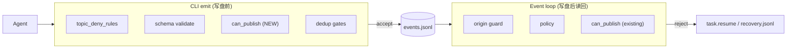

# ce-executor-serial 机制层恢复与 precheck 对齐（merry-lotus 后续）

## Summary

`ce-executor-serial` 在 merry-lotus run 中 U1 成功但 review 链在 correctness 第一维卡死。根因不是单个字段或单条 agent 失误，而是 **CLI 写盘前校验与 loop 运行时校验两套门不一致**，以及 **编排器把机器恢复伪装成 `human.guidance`**。本计划用最小机制改动统一「写盘前拒」路径、让编排器注入的 `task.resume` 自带 schema 合规 payload，并在 **未接入 Telegram 的 serial preset** 中剥离 `human.guidance` 工作流依赖。

---

## Problem Frame

### 触发事故（merry-lotus）

来源：`docs/report/2026-06-17-ce-executor-serial-merry-lotus-review-chain-stalled-diagnosis.md`

1. `executor` 误发 `debug.step` × 8 — **先写入 events.jsonl**，loop 运行时 `isolated_publish_allowed` / `can_publish` 才 drop。
2. `review-coordinator` 13s 内重复 `review.dimension.ready(correctness)` — 第二次被 isolated 单 turn 单 business event 规则 drop。
3. `dimension-reviewer` 沉默 → `missing_event_gate` 注入 **`human.guidance`**（自由文本）→ agent 理解偏、继续乱 emit。
4. loop 注入的 `task.resume` 缺 `reason` / `target_hat` → drift `field_completeness` 0%。
5. 最终 `loop.cancel`，review 链未闭。

### 机制缺口（修面不修点）

| 层级 | 写盘前（`ralph emit` precheck） | 运行时（event loop） | 后果 |
|---|---|---|---|
| Hat scope | `topic_deny_rules` + schema | `HatRegistry::can_publish` | 越权 topic 先落盘再 drop |
| 编排器恢复 | 无 | 直接 append / bus publish | 不合规 `task.resume` 事后才被 drift 发现 |
| 沉默 hat | `missing_event_gate` → `human.guidance` | `pending_recovery_hat` pin | 非结构化 steer，难闭环 |

`event_policy.rs` 注释将 `TopicDenied` 描述为含 isolated scope，但 **CLI 路径未调用 `can_publish`**，文档与实现脱节。

### `human.guidance` 定位（已对齐的产品决策）

- **保留用途**：真人 steer（Telegram RObot / operator 显式 `ralph emit human.guidance`）。
- **禁止用途**：runner / hard_gate 的自动化恢复通道。
- **`ce-executor-serial`**：当前 **未接入 Telegram**；`progress-steward` **不应** subscribe `human.guidance`；自动恢复走 `loop.stalled` → steward 与结构化 `task.resume`。

（见 `docs/solutions/developer-experience/agent-execution-contract-gates-2026-06-03.md`：`human.guidance` 不参与 hat 选择，单靠它无法驱动 publish obligation 闭环。）

---

## Requirements Trace

- **R1.** isolated 模式下，`ralph emit` 在写盘前必须使用与 loop 相同的 hat publish scope 判定（`can_publish`），拒绝的 event **不得**进入 events.jsonl。
- **R2.** 编排器构造并注入的 `task.resume` 必须满足 preset schema 的 `required_fields: [reason, target_hat]`（`presets/schemas/ce-executor-serial.yml`）。
- **R3.** `missing_event_gate` 与「声称 emit 但未写盘」的 hard gate **不得**再注入 `human.guidance`；改注入带 `reason` + `target_hat` 的 `task.resume`，并保留现有 `pending_recovery_hat` pin 行为。
- **R4.** `ce-executor-serial` preset：`progress-steward.triggers` 仅保留 `loop.stalled`；`human.guidance` schema 保留供 operator 手动 emit，但不进入 steward 工作流。
- **R5.** 变更必须有 targeted 测试；最终验证走 `cargo nextest run`（见 `CLAUDE.md` HARD RULE 1/2）。
- **R6（可选，同 PR 或 follow-up）。** `review.dimension.ready` 在 policy 层按 `(plan_name, step, task_id, dimension)` 幂等，第二发在 precheck 拒，避免 runtime 单-turn drop 黑盒。

---

## Scope Boundaries

### 在范围内

- `crates/ralph-cli/src/policy_check.rs` / `commands/emit.rs`：isolated scope precheck。
- `crates/ralph-core/src/event_loop/rejection.rs`：`build_task_resume_payload` 字段补齐。
- `crates/ralph-cli/src/loop_runner/hard_gate.rs`：automated recovery 改 `task.resume`。
- `presets/en/ce-executor-serial.yml` + `presets/schemas/ce-executor-serial.yml`：steward triggers / 注释。
- 相关单元测试与 characterization 测试更新。
- `docs/solutions/` 追加简短 learnings 条目（机制决策记录）。

### 不在范围内

- 10-hat 拓扑重构、`event_loop/mod.rs` 主循环大改。
- `ce-executor-isolated` wave 路径行为变更（除共享 precheck 受益外不主动改 preset）。
- Telegram / RObot 接入 serial preset。
- `loop.cancel` idempotency marker、diagnosis-summary 计数 bug、recovery.jsonl 启动清理（诊断报告 P2，另开任务）。
- preset 内 review-coordinator **指令级**幂等补丁（机制 dedup 优先于 prompt）。
- 追查 scratchpad 误引 `event_loop/mod.rs:5678` carve-out（文档澄清，非本 plan）。

### Deferred to Follow-Up Work

- `inject_wave_policy_rejection_guidance` 若仍写 `human.guidance`：wave preset 专用，serial 无 wave；可在 isolated wave 稳定性 follow-up 中与 U3 同一模式一并改。
- `diagnosis-summary.json` recovery/drift 计数未遍历实际文件（P1-3）。

---

## Context & Research

### 关键代码位置

|  Concern | 路径 |
|---|---|
| Runtime isolated scope | `crates/ralph-core/src/event_loop/mod.rs` — `isolated_publish_allowed` → `registry.can_publish` |
| CLI precheck 入口 | `crates/ralph-cli/src/commands/emit.rs` — `check_topic_deny_rules` + `validate_event_with_hat` |
| 共享 policy 模块 | `crates/ralph-cli/src/policy_check.rs` — `load_policy_config_for_cli_emit` |
| Hat publish 判定 | `crates/ralph-core/src/hat_registry.rs` — `can_publish` |
| task.resume payload 构造 | `crates/ralph-core/src/event_loop/rejection.rs` — `build_task_resume_payload` |
| missing-event hard gate | `crates/ralph-cli/src/loop_runner/hard_gate.rs` — `inject_missing_event_hard_gate_guidance`, `inject_hard_gate_guidance` |
| steward 配置 | `presets/en/ce-executor-serial.yml` — `progress-steward` |
| task.resume schema SSOT | `presets/schemas/ce-executor-serial.yml` |
| work.done dedup 模式（R6 模板） | `crates/ralph-core/src/event_policy.rs` — `validate_event_with_hat` 内 duplicate `work.done` |

### Institutional Learnings

- `docs/solutions/integration-issues/ce-executor-isolated-preset-dispatch-gap-plan-gate-executor-2026-06-12.md` — dispatch gap 与 ralph control topics；本次 serial 卡死 **不同根因**（precheck gap + human.guidance 误用），但「机制优先于编排补丁」原则一致。
- `docs/solutions/developer-experience/agent-execution-contract-gates-2026-06-03.md` — 不能只靠 `human.guidance` 驱动 recovery。
- `docs/solutions/2026-06-16-isolated-wave-stability-and-progress-steward.md` — steward / internal topics 历史；本 plan **收窄** serial preset 对 `human.guidance` 的依赖，不推翻 U5 internal topic allowlist。

---

## High-Level Technical Design

### 目标：单一写盘前门（Single Write Gate）

**原则**：agent 侧 business event 应在 precheck 层失败（非零退出 + recovery envelope），runtime 层仅处理 race、编排器合成事件、legacy 直写 jsonl 等边角。

### 恢复信号分层

| 信号 | 生产者 | 消费者 | serial preset |
|---|---|---|---|
| `human.guidance` | 真人 / operator 显式 emit | prompt `## ROBOT GUIDANCE`；isolated 可选 steward（**serial 不用**） | schema 保留，**不订阅** |
| `task.resume` | loop / hard_gate / policy rejection | 目标 hat（R5 路由） | **主恢复通道** |
| `loop.stalled` | stall detector | progress-steward | **steward 唯一自动唤醒** |

---

## Key Technical Decisions

1. **KTD-1：`can_publish` 接入 CLI，而非扩充 `topic_deny_rules` 列表。** `hat.publishes` 已是 SSOT；deny rules 仅作补充 deny。在 `validate_event_with_hat` 之前或之内增加 isolated 判定，需能访问 hat registry（自 `RalphConfig.hats` 构建轻量 registry 或复用现有 preflight 合并配置）。`execution_mode != isolated` 时跳过，避免影响 coordinator preset。

2. **KTD-2：hard_gate 改 `task.resume`，不改函数名。** `inject_missing_event_hard_gate_guidance` 等保留符号以减小 diff；更新 doc comment 与测试断言。Payload 最小集：`reason`（如 `missing_event` / `emit_claimed_but_not_written`）、`target_hat`（offending hat）、`allowed_topics`（可选，与 `build_task_resume_payload` 对齐）、`hint`（可选人类可读说明，非 schema 必填）。

3. **KTD-3：`build_task_resume_payload` 统一写 `reason` + `target_hat`。** `reason` 从 `rejection.violation` 或稳定 `reason_code` 映射；`target_hat` 从 `rejection.target_hat` 或 `source_hat`。编排器在 `publish_policy_rejection_resume` 与 isolated-scope rejection 路径注入前，对 payload 做 schema 校验（fail-closed log，不注入不合规事件）。

4. **KTD-4：serial preset steward 仅 `loop.stalled`。** 不删除 `human.guidance` schema（operator 仍可用）；同步 `presets/schemas/ce-executor-serial.yml` 注释。`build.rs` 合并后需 `cargo build -p ralph-cli` 刷新 embedded preset；更新 `crates/ralph-cli/src/presets.rs` 测试（若有 steward trigger 断言）。

5. **KTD-5：R6 幂等 optional。** 与 `work.done` dedup 同模式，优先级低于 U1–U4；若 U1 已阻止大部分越权 emit，R6 主要防 review-coordinator 重复 ready。可同 PR 或紧接 follow-up。

---

## Open Questions

### Resolved During Planning

- **Q1. 是否大改 event loop？** 否。public API 与主循环结构不动。
- **Q2. serial 是否接入 Telegram？** 否。`human.guidance` 不进入 steward triggers。
- **Q3. 是否靠 preset 指令修 review-coordinator 重复 ready？** 否。机制 dedup（R6）或 precheck 状态优于 prompt。
- **Q4. wave policy rejection guidance 是否本 plan 必改？** 否，deferred；serial 无 wave。

### Deferred to Implementation

- `can_publish` precheck 对 `ralph` pseudo-hat / control topics 的精确边界（对照 `event_origin::RALPH_CONTROL_TOPICS`）。
- `hint` 字段是否进入 schema SSOT 或保持 optional 非校验字段。

---

## Implementation Units

### U1. CLI precheck 对齐 `can_publish`（isolated scope）

**Goal:** agent emit 越权 topic 时在写盘前失败，与 runtime `isolated_publish_allowed` 行为一致。

**Requirements:** R1, R5

**Dependencies:** 无

**Files:**
- `crates/ralph-cli/src/policy_check.rs`
- `crates/ralph-cli/src/commands/emit.rs`
- `crates/ralph-core/src/hat_registry.rs`（如需暴露轻量 helper）
- `crates/ralph-cli/src/policy_check.rs` 内现有 tests
- `crates/ralph-core/tests/scenarios.rs`（可选集成 scenario）

**Approach:**
- 当 resolved config `event_loop.execution_mode == isolated` 且 emit 带 `hat`（`RALPH_CURRENT_HAT` / `--hat`）时，调用与 loop 等价的 `can_publish(hat, topic)`。
- 拒绝时：`record_cli_emit_rejection` + 非零退出 + 稳定 `reason_code`（如 `isolated_scope_violation` 或复用 `TopicDenied` bucket），message 指明 allowed publishes。
- `require_policy_check_for_cli_emit: true` 的 preset（含 `ce-executor-serial`）自动受益。

**Patterns to follow:** `check_topic_deny_rules` 在 `emit.rs` 的拒收路径；`isolated_publish_allowed` in `event_loop/mod.rs`。

**Test scenarios:**
- Happy path：`executor` emit `work.done` 合法 payload → precheck accept。
- Error path：`executor` emit `debug.step` → precheck reject，events 文件无新行，CLI exit ≠ 0。
- Edge：`hat` 缺失时 isolated precheck 行为（与现有 origin guard 一致：fail 或 skip，须在测试中固定一种）。
- Integration：加载 `builtin:ce-executor-serial` merged config 跑 emit 子集测试。

**Verification:** targeted `cargo nextest run -p ralph-cli -- isolated_scope`（或新增测试名子串）；无裸 `cargo test -p ralph-cli`。

---

### U2. `build_task_resume_payload` 补齐 schema 字段 + 注入前校验

**Goal:** 编排器注入的 `task.resume` 满足 `reason` + `target_hat`，drift 不再报 0% field completeness。

**Requirements:** R2, R5

**Dependencies:** 无（可与 U1 并行）

**Files:**
- `crates/ralph-core/src/event_loop/rejection.rs`
- `crates/ralph-core/src/event_loop/mod.rs`（`publish_policy_rejection_resume`、isolated-scope `task.resume` 注入点）
- `crates/ralph-core/src/event_loop/rejection.rs` 内 unit tests
- `crates/ralph-cli/tests/ce_executor_recovery.rs`（若覆盖 payload shape）

**Approach:**
- `build_task_resume_payload` 增加 `reason`（自 violation / stage 映射）与 `target_hat`（自 `rejection.target_hat` 或 `source_hat`）。
- 注入 `task.resume` 前调用 `validate_event("task.resume", payload, policy)`；不合规则不 bus publish（warn + recovery envelope）。

**Patterns to follow:** 现有 `build_task_resume_payload_includes_wave_context` 测试；schema in `presets/schemas/ce-executor-serial.yml`.

**Test scenarios:**
- Happy path：rejection 含 `target_hat=executor` → payload JSON 含 `reason` + `target_hat`。
- Error path：模拟缺 `target_hat` 的 rejection → 不注入 bus（或 fallback `non_retryable`，与现有 `UnknownHat` 语义一致）。
- Regression：R5 hard gate routing 测试仍通过（`event_loop/tests/r5_hard_gate_routing.rs`）。

**Verification:** `cargo nextest run -p ralph-core -- build_task_resume_payload`

---

### U3. hard_gate 自动化恢复改 `task.resume`（停用 `human.guidance`）

**Goal:** `missing_event_gate` 与「声称 emit 未写盘」路径注入结构化恢复，不再伪装人类指导。

**Requirements:** R3, R5

**Dependencies:** U2（payload 字段约定一致）

**Files:**
- `crates/ralph-cli/src/loop_runner/hard_gate.rs`
- `crates/ralph-cli/src/loop_runner/tests.rs`（`u4_inject_missing_event_*`、`test_missing_event_hard_gate` 等）
- `crates/ralph-cli/src/loop_runner/runner.rs`（调用点，通常无需改签名）

**Approach:**
- `inject_missing_event_hard_gate_guidance` / `inject_hard_gate_guidance`：写 `topic=task.resume`，payload 为 JSON object（`reason`, `target_hat`, `allowed_topics`, 可选 `hint`），`triggered` 设为目标 hat。
- 保留 `RecoveryDiagnosisEnvelope`（source `MissingEventGate`）与 `pending_recovery_hat` pin。
- **不**向 prompt 注入 `## ROBOT GUIDANCE` 伪人类文本作为主恢复手段（hint 可作为 payload 字段供 agent 读 event）。

**Patterns to follow:** `inject_fallback_event` / 现有 `task.resume` 结构化 recovery 测试（`loop_runner/tests.rs` U4 段注释）。

**Test scenarios:**
- Happy path：missing-event gate 触发 → events 文件含 `task.resume`，payload 解析含 `reason=missing_event`、`target_hat` 匹配 offending hat。
- Error path：无（gate 本身即错误恢复）。
- Integration：`pending_recovery_hat` 下一轮 `next_hat` 仍 pin 到源 hat（现有 U3 pin 测试更新断言 topic）。

**Verification:** `cargo nextest run -p ralph-cli --bin ralph -- u4_inject_missing_event`

---

### U4. `ce-executor-serial` preset 剥离 `human.guidance` 工作流

**Goal:** 无 Telegram 的 serial preset 不依赖 `human.guidance` 唤醒 steward；schema 仅服务 operator 显式 emit。

**Requirements:** R4, R5

**Dependencies:** 无（与 U3 语义一致，可同 PR）

**Files:**
- `presets/en/ce-executor-serial.yml`
- `presets/schemas/ce-executor-serial.yml`
- `crates/ralph-cli/src/presets.rs`（新增/更新 steward trigger 测试）
- `presets/manifest.yml` / `scripts/ralph-zsh-plugin.zsh` — **仅当** preset 名或公开列表变化时；本 U 只改 triggers，通常不需要。

**Approach:**
- `progress-steward.triggers`: `["loop.stalled"]` only。
- 注释说明：无 RObot/Telegram；operator 可用 `ralph emit human.guidance`，steward 不订阅。
- 可选：移除 inline `event_policy.schemas.human.guidance` 重复块，依赖 SSOT merge（与现有 `loop.stalled` 注释风格一致）。

**Test scenarios:**
- Happy path：`presets.rs` 断言 `progress-steward.triggers` 不含 `human.guidance`，含 `loop.stalled`。
- Regression：`ralph preset check builtin:ce-executor-serial` 仍通过。

**Verification:** `cargo nextest run -p ralph-cli -- ce_executor_serial`；`cargo build -p ralph-cli`（刷新 embedded preset）。

---

### U5.（可选）`review.dimension.ready` policy 层幂等

**Goal:** 重复 ready 在 precheck 拒绝，避免 runtime 单-turn drop。

**Requirements:** R6

**Dependencies:** U1（共享 `PolicyRuntimeState` 扩展）

**Files:**
- `crates/ralph-core/src/event_policy.rs`
- `crates/ralph-core/src/event_loop/tests/event_policy.rs`
- `crates/ralph-core/tests/scenarios.rs`（serial review chain scenario 可追加 case）

**Approach:**
- 仿 `work.done` dedup：key = `(plan_name, step, task_id, dimension)`，第二次 `review.dimension.ready` → `RejectWithResume` + 稳定 reason。

**Test scenarios:**
- Happy path：首次 ready accept；同 key 第二次 reject。
- Edge：不同 dimension 同 step → 均 accept（串行 walk 正常）。

**Verification:** `cargo nextest run -p ralph-core -- review.dimension.ready` 或 scenario 名子串。

---

## System-Wide Impact

- **ce-executor-isolated / 其他 isolated preset：** U1/U2/U3 为共享机制，isolated wave preset **受益**（越权 emit 更早失败）。行为变更：此前「先写盘再 drop」的 agent 将改为 CLI 直接失败——**预期改进**，需在 PR 说明中标注。
- **coordinator mode preset：** U1 在 `execution_mode != isolated` 时 no-op，无影响。
- **RObot/Telegram：** 不改动；真人 `human.guidance` 路径保留。
- **TUI / diagnose：** recovery.jsonl source 不变（`missing_event_gate`）；events.jsonl 中 automated recovery 行从 `human.guidance` 变为 `task.resume`，`ralph diagnose` 报告措辞可能需扫一眼，非必须改。

---

## Risks & Dependencies

| 风险 | 缓解 |
|---|---|
| CLI/loop 校验仍不一致（遗漏路径如 `ralph wave emit`） | U1 走 `policy_check` 共享模块；wave emit 已在同模块，serial 无 wave 但代码路径一并覆盖 |
| 测试依赖旧 `human.guidance` 断言 | U3 明确列出需改的 characterization 测试 |
| embedded preset 与 YAML 漂移 | U4 后跑 `presets.rs` merge 测试 + `cargo build` |
| 改动面扩大到大 refactor | 严格限定 4+1 units；不动 loop 主循环 |

**前置：** 无。可与 `2026-06-17-001` stall detector 修复并行，注意 merge 时 `hard_gate.rs` / `mod.rs` 冲突。

---

## Verification Strategy（计划级，非命令脚本）

1. **开发中：** 每 U 完成后跑 targeted nextest（见各 U Verification）。
2. **PR 合并前：** `./scripts/run-tests.sh` 或等价 full workspace nextest + doctest。
3. **Dogfood（可选）：** 在 worktree 重跑 `builtin:ce-executor-serial` 小 step，确认 review 链 correctness 维可启动；对比 merry-lotus events 不再出现 `executor→debug.step` 落盘。

---

## Documentation

- 追加 `docs/solutions/integration-issues/ce-executor-serial-precheck-recovery-alignment-2026-06-17.md`（简短：根因、KTD、验证命令引用）。
- **不**改 `CLAUDE.md` / `AGENTS.md` 除非新增永久规则（本 plan 不强制）。
- 诊断报告 `docs/report/2026-06-17-ce-executor-serial-merry-lotus-review-chain-stalled-diagnosis.md` 可在 PR 中加「见 plan 003」交叉链接（可选）。

---

## Sources & Research

- `docs/report/2026-06-17-ce-executor-serial-merry-lotus-review-chain-stalled-diagnosis.md` — 主 origin
- `docs/brainstorms/2026-06-17-ce-executor-serial-review-requirements.md` — serial preset 动机（并行 wave 失去信心）
- `docs/plans/2026-06-17-002-feat-ce-executor-serial-review-plan.md` — preset 落地计划
- 会话对齐：修面不修点、precheck 优于 runtime error、human.guidance 仅给人、不大改
