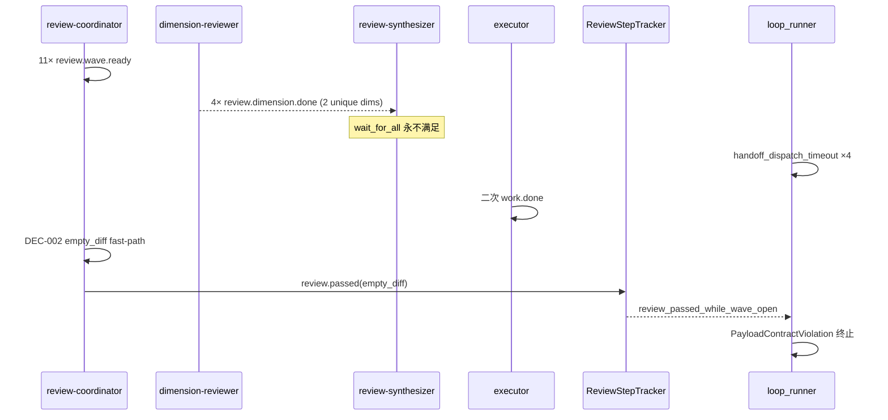
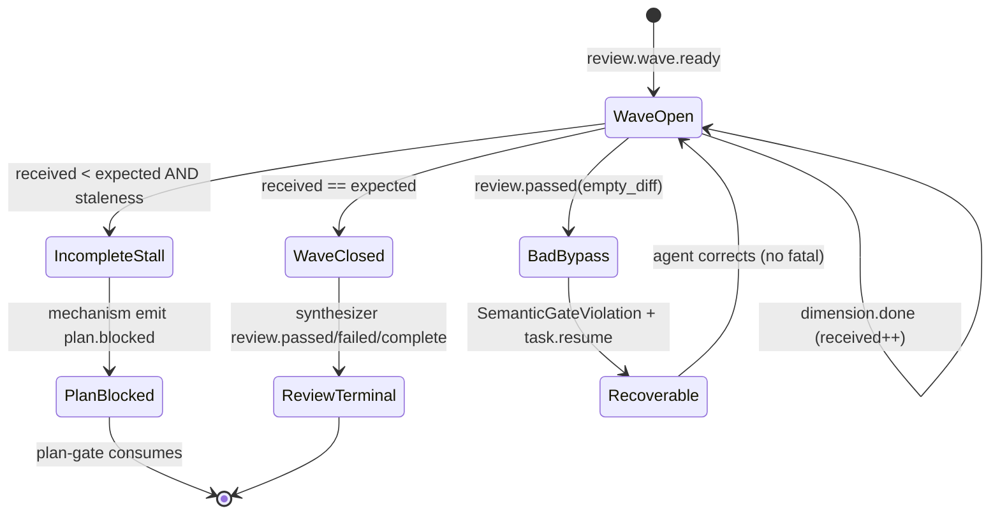

# fix: ce-executor wave stall 与 empty_diff bypass 闭环

## Summary

在 `2026-06-17-001` flow-reliability dogfood（worktree `zippy-sparrow`）中，11 维 review wave 只收回 4 维 → `review-synthesizer` 永不 fire → stall/handoff 升级后 `review-coordinator` 误走 `empty_diff` 捷径 → `ReviewStepTracker` 正确拒收 `review_passed_while_wave_open`，但 loop 以 **`PayloadContractViolation` 致命终止**。

本计划是 **诊断报告 P0/P1 的落地切片**：优先补上「wave 没收齐时的机制收摊」与「semantic gate 可恢复、不误杀 loop」，并封堵 duplicate `work.done` / 过早 `last_reviewed_sha` 两条旁路。与 `2026-06-17-001` **正交增强**——不重复 Unit 1 已落地的 `FlowLifecycleRegistry`，而是把 dogfood 暴露的 **缺口** 收成可测的硬门。

**Ship 分级（评审修订）**

| Tier | Phase | 解除症状 |
|------|-------|----------|
| Hotfix | 1（U1+U2 同批，禁止单 U1） | loop 不因 empty_diff bypass fatal |
| MVP | 1–2（+U4+U5） | stall 有收摊 + 输入侧旁路封堵 |
| 完整 P0 | 1–3（+U3） | preset/routing 对齐 |
| 回归锁定 | 4（U6） | zippy-sparrow 不再复现 |

> **范围声明**：6 Unit 体量接近 mini-feat；与 001 U5/U7/U8 有重叠，下文「001 合并契约」避免双路径。本计划保证 **loop 不 fatal + 有合法收摊**，**不**保证 11/11 维 worker 全跑完（P1-1 去重 defer 至 001 Unit 4）。

## Problem Frame

### 谁在受影响

Operator 用 `ce-executor-isolated` 跑多步 plan 时，review wave 在 **部分维度完成** 后卡住；recovery 把错误 hat 拉回，agent 试图用 `review.passed(empty_diff)` 收尾，loop 直接死掉而非进入 `plan.blocked` / degraded 合法出口。

### 失败链（已用产物验证）

### 根因分层

| 层级 | 问题 | 归因 |
|------|------|------|
| 上游 | 4/11 维后 synthesizer 不 fire，无机制 `plan.blocked` | 机制缺口（U6 仅 preset 文案） |
| 触发 | stall → task.resume 激活 review-coordinator，走 empty_diff | 编排 + 机制 routing |
| 直接死因 | semantic gate 拒收后 **fatal** 终止 | 机制（错误分级 + 无 degraded 出口） |
| 加剧 | 二次 `work.done`、`last_reviewed_sha` 过早写入 | 机制 + agent |

### 与 `2026-06-17-001` 的关系

| 001 单元 | 本计划 |
|----------|--------|
| Unit 1 FlowLifecycleRegistry | **假定已落地**（dogfood U1）；本计划消费其 phase 查询 |
| Unit 5 DegradedCompletionRouter | **本计划 U2 提前落地 incomplete 子集**（见下表）；全窗口 timeout 仍归 001-U5 |
| Unit 7 Aggregator handoff SLA | **001-U7 前置**：handoff 须在 wave merge 后注册，非 per-dimension；**本计划 U3** 收紧 stall 后路由 |
| Unit 8 Wave stall 升级 | **本计划 U3** 独占 handoff/stall 计数 ladder（3 次 → 调 U2） |
| Unit 9 BDD | **本计划 U6 增加 zippy-sparrow replay** |

### 001 合并契约（评审修订）

| 场景 | 003 负责 | 001 负责 | terminal |
|------|----------|----------|----------|
| incomplete + staleness（80% aggregate，无新 dimension） | U2 | — | `plan.blocked(reason=dimension_reviewers_failed_to_converge)` → **shipper** |
| handoff/stall 升级（1–2 次 resume，第 3 次收摊） | U3 → U2 | U7/U8 共享 router trait | 同上 |
| 全窗口 aggregate timeout 耗尽 | — | Unit 5 DegradedCompletionRouter | `review.failed(skip_reason=aggregate_timeout)` |
| per-dimension handoff 30s 噪声 | **不修**（001-U7 先改注册点） | U7 | — |

## Requirements Trace

| ID | 需求摘要 | 来源 | 单元 |
|----|----------|------|------|
| R-F1 | wave 未闭合时拒收 `review.passed`，且 **可恢复**（非 fatal） | 诊断 P0-1 | U1 |
| R-F2 | `received < wave_total` 时机制层 emit 合法 terminal（`plan.blocked` 或 `review.failed`） | 诊断 P0-2；origin R-A5 | U2 |
| R-F3 | stall/handoff 升级不得把 review-coordinator 引向 empty_diff 收尾 | 诊断 P0-3 | U3 |
| R-F4 | 同 `task_id` 二次 `work.done` 拒收 | 诊断 P1-2 | U4 |
| R-F5 | `last_reviewed_sha` 仅在 wave 闭合后 persist；empty_diff 需 `wave_closed` | 诊断 P2-3；preset L742-748 | U5 |
| R-F6 | zippy-sparrow 类事件片段 replay 回归 | 诊断 §6.4；origin R-E2 | U6 |
| SC-F1 | 4/11 维 stall 后 loop **不** 以 `PayloadContractViolation` 终止 | 诊断 TL;DR | U1–U3 |
| SC-F2 | 机制 emit 的 terminal 能被 `plan-gate` 消费（schema + publishes 合法） | isolated U3 | U2 |
| SC-F3 | `./scripts/run-tests.sh` 全绿 | 001 Non-Regression | U6 |

## Non-Regression Policy

1. **先锁行为再改代码**：每个单元第一步 characterization test；断言只增不减。
2. **不变式**（与 001 §Non-Regression 一致）：
   - U3 isolated 终态 authority
   - U4 fair scheduling
   - `review-coordinator` 不得发 `review.passed(skip_reason=aggregate_timeout)`（保持 `event_policy.rs` 拒收）
   - WAC payload 硬门
3. **禁止**：为绿测试放宽 isolated scope、禁用 semantic gate、ralph hat 常规发 business terminal。
4. **测试入口**：`cargo nextest run` 系列；`ralph-cli` 子集走 cli-serial。

## Scope Boundaries

**覆盖**

- `ReviewStepTracker` semantic gate 分级与 recoverable 路径
- incomplete wave 机制收摊（早于 1800s 全量 aggregate timeout）
- stall/handoff 后 routing 与 preset empty_diff 硬条件
- duplicate `work.done` 拒收
- `last_reviewed_sha` 写入时机
- zippy-sparrow replay fixture + 2 个新 scenario

**不覆盖**

- 001 Unit 2 spawn 保证、Unit 3 TimeoutReconciler 全量、Unit 6 GateWaveMutex 全量（可并行，非本计划阻塞项）
- 017-002 step handoff（`queue.advance`→executor）
- dimension-reviewer worker 质量（文件名/task_id 错写）——仅 preset 文案加固，无 Rust 强制

### Deferred to Follow-Up Work

- `SemanticGateViolation` 在 `ralph diagnose` JSON 的专用展示字段（本计划只修 envelope kind）
- `diagnosis-summary.json` `recovery_count` 与 recovery.jsonl 行数对账（诊断 P2-5）
- wave_index 维度去重派发（诊断 P1-1，001 Unit 4 部分重叠）— **不阻塞 dogfood 复现**（U2 兜底收摊），但 **不保证 wave 完整度**

## Key Technical Decisions

| 决策 | 理由 |
|------|------|
| **incomplete wave 默认机制出口：`plan.blocked(reason=dimension_reviewers_failed_to_converge)`** | preset 已要求 synthesizer U6；`review-synthesizer.publishes` 含 `plan.blocked`；比 `review.failed` 更贴合「维度没收齐」语义（001 Unit 5 的 `review.failed` 保留给 **aggregate timeout 全窗口耗尽**） |
| **partial staleness 阈值：80% `aggregate_timeout_secs` 且 unique `received < expected`** | 与 `wave_detection.rs` / 001 Unit 4 注释一致；**不含** per-dimension `handoff_dispatch_timeout`（`wait_for_all` 下 30s handoff 噪声不是 stall 信号） |
| **handoff/stall 触发归 U3，不归 U2** | zippy-sparrow ~9min 来自 4× handoff 堆积，非 80%×1800s=1440s staleness；U2 仅 staleness + `last_dimension_at` 无增长 |
| **`review_passed_while_wave_open` → `RecoverableRejection` + `SemanticGateViolation`** | 守门保持 fail-closed，但 loop 继续；agent 收到 `task.resume` 指向 review-coordinator 且 hint 禁止 empty_diff |
| **duplicate `work.done` → `RecoverableRejection`** | 不 fatal；hint 引导 `queue.advance` / 等待 wave terminal |
| **`last_reviewed_sha` 闭合条件：`ReviewStepTracker` 中 `open_wave_id` 清空** | 与 tracker 单一事实源对齐，不另建 SHA 状态机 |
| **机制 emit 使用 `review-synthesizer` hat provenance，`Event::with_target("shipper")`** | `plan-gate.triggers` **不含** `plan.blocked`；shipper 已 `triggers: [plan.complete, plan.blocked, debug.exhausted]` |
| **`inject_review_aggregate_timeouts` 仅保留全窗口耗尽路径** | incomplete+staleness 由 U2 短路；inject 文案对齐 `review.failed(aggregate_timeout)`，禁止建议 coordinator 发 aggregate_timeout 型 `review.passed` |
| **U1 semantic gate 不计入 `U2_REJECTION_RETRY_LIMIT`** | 否则 Phase 1 单 U1 时 4 次 empty_diff 仍 `RecoverablePayloadExhausted` fatal |

## High-Level Technical Design

**机制 vs 编排分工**

| 卡点 | 机制（Rust） | 编排（preset） |
|------|----------------|----------------|
| wave 没收齐 | staleness watcher emit `plan.blocked` | synthesizer U6 文案与机制一致 |
| empty_diff 旁路 | semantic gate recoverable | empty_diff 加 `wave_closed` 条件 |
| 二次 work.done | event_policy dedup | executor 指令「禁止重发」 |
| last_reviewed_sha | runner 仅在 wave closed 后写 marker | coordinator 指令对齐 |

## Implementation Units

### U1. Semantic gate 分级与可恢复拒收

**Goal:** `review_passed_while_wave_open` 不再误标为 `AllowedValueMismatch` 致命终止；守门仍 fail-closed。

**Requirements:** R-F1, SC-F1

**Dependencies:** None

**Files:**

- Modify: `crates/ralph-core/src/event_policy.rs`（新增 `ViolationType::SemanticGateViolation`）
- Modify: `crates/ralph-core/src/event_loop/review_step_state.rs`（`check_semantic_gates` 使用新 violation 类型）
- Modify: `crates/ralph-core/src/event_loop/mod.rs`（`finding_to_payload_contract_violation` 映射；`capture_violation` recoverable 分界）
- Modify: `crates/ralph-cli/src/loop_runner/payload_contract_gate.rs`（`error_type: semantic_gate_violation`）
- Modify: `crates/ralph-cli/src/loop_runner/runner.rs`（semantic gate 不触发 `TerminationReason::PayloadContractViolation`）
- Test: `crates/ralph-core/src/event_loop/review_step_state.rs`（`mod tests`）
- Test: `crates/ralph-core/src/event_loop/tests/event_policy.rs`

**Approach:**

- 新增 `ViolationType::SemanticGateViolation { gate, context }`；`review_passed_while_wave_open` 走此类型，**不再**伪造 `InvalidFieldValue { field: "skip_reason" }`。
- `PayloadContractViolationKind::SemanticGateViolation` 独立映射；diagnostics JSON `field` 为 `gate` 名，非 `skip_reason`。
- 将 `review_passed_while_wave_open` 划入 **recoverable** 集合，且 **不计入** `U2_REJECTION_RETRY_LIMIT`（独立 bucket）：emit `task.resume` 到 `review-coordinator`，`expected_action` 明示「wave 未闭合，禁止 empty_diff；等待机制 plan.blocked 或补全维度」。
- 同 iteration 若 U2 已 emit `plan.blocked`，跳过对同一 wave 的 semantic_gate recoverable resume（顺序见 U2）。
- **Non-regression**：`plan_complete_rejected_without_synth_terminal`、coordinator 拒 `aggregate_timeout` 单测保持绿。

**Execution note:** 先改 `review_step_state.rs` 单测断言 violation 类型，再改 mapping 与 runner 终止分支。

**Test scenarios:**

- Happy path（守门仍生效）：coordinator 在 `open_wave_id` 存在时 emit `review.passed(empty_diff)` → `SemanticGateViolation`，事件 **不** 进 bus。
- Error path（不 fatal）：同上场景 → runner **不** 返回 `PayloadContractViolation`；下一 iteration 可继续。
- Regression：`finding_to_payload_contract_violation` 对真实 `skip_reason` allowed_values  mismatch 仍 fatal。
- Integration：`payload-contract-error.json` 中 `error_type` 为 `semantic_gate_violation`，`payload_excerpt` 仍含真实 `skip_reason=empty_diff`（便于审计）。

**Verification:** `cargo nextest run -p ralph-core -- review_passed_while_wave_open`；`cargo nextest run -p ralph-core -- semantic_gate`。

---

### U2. Incomplete wave 机制收摊（staleness → plan.blocked）

**Goal:** `received < wave_total` 且超过 staleness 窗口时，**机制** emit `plan.blocked`，不依赖 synthesizer agent。

**Requirements:** R-F2, SC-F1, SC-F2

**Dependencies:** U1（避免 emit 后又被 fatal gate 误杀）；**001-U7 handoff 注册语义**（wave merge 后注册，非 per-dimension——可与 003 并行，但 U2 触发逻辑不得依赖当前 per-dim handoff）

**Files:**

- Add: `crates/ralph-core/src/flow_lifecycle/incomplete_wave_gate.rs`（扩展现有 `flow_lifecycle.rs` 模块，非新目录——评审修订）
- Modify: `crates/ralph-core/src/event_loop/mod.rs`（`run_iteration` / `inject_review_aggregate_timeouts` 前调用 `maybe_emit_incomplete_wave_blocked`）
- Modify: `crates/ralph-core/src/event_loop/review_step_state.rs`（暴露 `open_waves_needing_intervention(staleness)`）
- Modify: `presets/en/ce-executor-isolated.yml`（U6 文案注明「机制层已 enforcement，agent 勿重复 emit」）
- Modify: `presets/schemas/ce-executor-isolated.yml`（若 `plan.blocked` schema 需 `wave_id` 字段则同步）
- Test: `crates/ralph-core/src/event_loop/review_step_state.rs`
- Test: `crates/ralph-core/tests/scenarios/flow_reliability/incomplete_wave_plan_blocked.yml`（新建）

**Approach:**

- **单 iteration 固定顺序**（评审修订）：`maybe_emit_incomplete_wave_blocked` → `handoff_tracker.expired()` drain → process JSONL → policy validation（U1）。
- 每 iteration 扫描 `ReviewStepTracker` 中 `wave_open` 的 step：
  - 若 `now - last_dimension_at > 0.8 * aggregate_timeout_secs`（**仅 staleness**，不含 handoff timeout）；
  - 且 **unique** `dimensions_received.len() < wave_expected`；
  - 且 `flow_lifecycle` phase ∉ `{WorkersActive, Spawning}`（或已 reconcile/cancel 活跃 worker）；
  - 则机制 publish `plan.blocked`（hat=`review-synthesizer`，`Event::with_target("shipper")`），payload 含 `reason=dimension_reviewers_failed_to_converge`、`wave_id`、`expected`、`received`（unique 计数）、`missing_dimensions`。
- **U3 第 3 次 handoff/stall escalation 调用本函数**——U2 不因单次 handoff timeout 独立触发（与 U3 互斥，评审修订）。
- emit 后关闭 tracker wave（或转 `Failed` phase），防止重复 emit；若 U2 已 emit，U1 不对同 wave 再发 recoverable resume。
- **与 001 Unit 5 分界**：本单元处理 **incomplete + stall**；全窗口 aggregate timeout 仍由 001 `DegradedCompletionRouter` 发 `review.failed(aggregate_timeout)`（可后续合并）。
- 配置：`workflow_contract.incomplete_wave_gate.enabled` 默认 **true** for `ce-executor-isolated`；全局默认 false。

**Test scenarios:**

- Covers SC-F1：模拟 11 维 wave、4 维 done、压缩时钟过 staleness → 恰好 1 条 `plan.blocked`，**无** `PayloadContractViolation`。
- Happy path：11/11 done → **不** emit `plan.blocked`；synthesizer 正常 pending。
- Error path：机制 `plan.blocked` payload 缺字段 → event_policy 拒收（应先有 schema 单测）。
- Regression：`inject_review_aggregate_timeouts` 在 wave 已 closed 时不 double-emit。

**Verification:** scenario `incomplete_wave_plan_blocked.yml` 绿；手动 grep events 无 L21 类 `review.passed(empty_diff)` 终止链。

---

### U3. Stall/handoff 路由与 empty_diff 旁路封堵

**Goal:** `handoff_dispatch_timeout` 升级后，不激活「重发 work.done → empty_diff」路径；stall 3 次触发 U2 或 degraded，而非 coordinator 收尾。

**Requirements:** R-F3, SC-F1

**Dependencies:** U2（第 3 次 escalation 调 U2）；**001-U7**（handoff 注册点，见合并契约）

**Files:**

- Modify: `crates/ralph-core/src/event_loop/mod.rs`（`inject_fallback_event` / stall_recovery 分支；`publish_policy_rejection_resume` wave 上下文）
- Modify: `presets/en/ce-executor-isolated.yml`（L735-748 empty_diff HARD RULE 增加 `wave_closed` + `received == wave_total`）
- Modify: `presets/zh/ce-executor-isolated-zh.yml`（若存在镜像段）
- Modify: `crates/ralph-cli/src/presets.rs`（builtin 内容同步）
- Test: `crates/ralph-core/src/event_loop/tests/recovery_envelope_u7_u8.rs`
- Test: `crates/ralph-cli/src/loop_runner/tests.rs`（cli-serial，新测 `empty_diff_rejected_when_wave_incomplete`）

**Approach:**

- preset empty_diff 条件扩展（AND）：
  - `open_wave_id` 为 none（tracker 语义）
  - `received_count == wave_total`（若存在 active wave 记录）
  - 保留原四条件 `commit_count==0 && changed_lines==0 && ...`
- stall_recovery / `handoff_dispatch_timeout` 对 `consumer=review-synthesizer`（**独占 escalation ladder**，U2 不并行触发）：
  - 第 1–2 次：现有 `task.resume` → **review-synthesizer**（保持）
  - 第 3 次：调用 U2 `maybe_emit_incomplete_wave_blocked`，**不** 路由 executor 重发 `work.done`
  - 与 001-U8 共享 `stall_recovery_counts` 分桶（`flow:review-synthesizer`），避免双计数器
- `publish_policy_rejection_resume` 在 wave_open 时对 `work.done` 重发增加 hint：「wave 进行中，禁止 empty_diff / 禁止重复 work.done」。
- preset confidence 协议补一句：**wave-open 决策需 confidence >90 或 emit plan.blocked**（文案级，机制由 U1/U2 兜底）。

**Test scenarios:**

- Happy path：正常 empty diff（真无 commit、无 open wave）→ `review.passed` 仍接受。
- Error path：open wave + empty_diff → U1 recoverable + U2 最终 plan.blocked。
- Regression：stall_recovery 非 synthesizer consumer 行为不变。

**Verification:** `cargo nextest run -p ralph-cli --bin ralph -- empty_diff_rejected_when_wave_incomplete`。

---

### U4. Duplicate work.done 拒收

**Goal:** 同 `(loop_id, task_id)` 第二次 `work.done` 不进入事件流。

**Requirements:** R-F4

**Dependencies:** None（可与 U1 并行）

**Files:**

- Modify: `crates/ralph-core/src/event_loop/loop_state.rs`（`work_done_seen_tasks: HashSet<String>`）
- Modify: `crates/ralph-core/src/event_policy.rs` 或 `event_loop/mod.rs::apply_event_policy_validation`（重复检测）
- Test: `crates/ralph-core/src/event_policy.rs`
- Test: `crates/ralph-core/src/event_loop/tests/execution_contract.rs`（若已有）

**Approach:**

- Dedup key：`(plan_name, step, task_id)`（**非** 仅 `task_id`）。
- 第一次合法 `work.done` 接受后记入 set；在 `queue.advance`、`review.failed`、`fix.applied` 或 step 关闭时 prune 对应 step bucket（fix-round 允许同 step 合法重发）。
- 第二次同 key → `RecoverableRejection`，hint 区分 `duplicate_stall_bypass` vs `duplicate_same_step`。
- **不** fatal；对齐 U1 recoverable 哲学。

**Test scenarios:**

- Happy path：首次 `work.done` 接受。
- Error path：zippy-sparrow L20 同类 payload 第二次拒收。
- Edge case：`queue.advance` 后新 step 同 task_id 不同 step key → 仍接受（key 含 step）。

**Verification:** `cargo nextest run -p ralph-core -- duplicate_work_done`。

---

### U5. last_reviewed_sha 闭合后持久化

**Goal:** wave emit 后、aggregator 未闭合前 **不写** `last_reviewed_sha`；empty_diff 判定不依赖过早 SHA。

**Requirements:** R-F5

**Dependencies:** None（`ReviewStepTracker.open_wave_id` 即可判定；U2 emit plan.blocked 关闭 wave 为补充路径，非硬依赖）

**Files:**

- Modify: `presets/en/ce-executor-isolated.yml`（L917-940 persist 段：仅 `review.passed` / wave **Closed** 后）
- Modify: `crates/ralph-cli/src/loop_runner/` 中 persist marker 逻辑（搜 `last_reviewed_sha` / `.ralph-enforce` 相关）
- Modify: `crates/ralph-core/src/event_loop/review_step_state.rs`（可选：`on_wave_closed` hook 通知 runner）
- Test: `crates/ralph-cli/src/loop_runner/tests.rs`（cli-serial）

**Approach:**

- 将「Persist last_reviewed_sha After Terminal Event」限定为：
  - `review.passed` / `review.complete` / `review.failed`（verdict 路径），或
  - `ReviewStepTracker` 报告 wave closed（`open_wave_id` 清空且 received==expected），**非** `review.wave.ready` emit 后。
- review-coordinator 指令与 `context.md` 字段说明同步。
- **Non-regression**：真 empty diff（无 commit、wave closed）仍写 SHA。

**Test scenarios:**

- Happy path：wave 全闭合 + review.passed → SHA 写入。
- Error path：仅 wave.ready + 4/11 dim → **不** 写 SHA；DEC-002 类推理缺燃料。
- Regression：增量 review 仍可用 `last_reviewed_sha` 作 base（闭合后）。

**Verification:** 单测 + preset lint；`ralph preset check -H builtin:ce-executor-isolated`。

---

### U6. Replay 回归与 BDD 场景

**Goal:** zippy-sparrow 失败模式不再复现；与 001 Unit 9 场景库对齐。

**Requirements:** R-F6, SC-F3

**Dependencies:** U1–U5

**Files:**

- Add: `crates/ralph-core/tests/fixtures/flow_reliability/zippy-sparrow-4of11-stall.jsonl`（匿名化 21 行片段）
- Add: `crates/ralph-core/tests/scenarios/flow_reliability/review_passed_while_wave_open.yml`
- Add: `crates/ralph-core/tests/scenarios/flow_reliability/incomplete_wave_plan_blocked.yml`（若 U2 未建）
- Modify: `docs/guide/runtime-diagnosis.md`（`semantic_gate_violation` + `plan.blocked` mechanism 段）
- Modify: `CLAUDE.md` / `AGENTS.md`（Agent Output Governance 补一句 incomplete wave 机制收摊）

**Approach:**

- 从诊断报告 events L5-21 构造最小 replay；断言增强后（**AND**，非 OR）：
  - **无** `TerminationReason::PayloadContractViolation`
  - **有** `plan.blocked` 且 `reason=dimension_reviewers_failed_to_converge`
  - **无** `review.passed(empty_diff)` 进 bus
  - `missing_dimensions` 覆盖未完成的 unique 维度（zippy 场景 ≥7）
- 另建 positive scenario：11/11 正常闭合 → synthesizer fire，无 plan.blocked。
- scenario 使用 mock clock 压缩 staleness，避免 1800s 实等。
- 合并门禁：`./scripts/run-tests.sh` + `cargo nextest run -p ralph-core --test scenarios flow_reliability`。

**Test scenarios:**

- Replay：4/11 stall → plan.blocked，loop 继续或有序终止（非 contract violation）。
- Scenario：`review_passed_while_wave_open.yml` — coordinator empty_diff while open → recoverable。
- Regression：`four-p0-guards/*` 全绿。

**Verification:** SC-F3；`ralph preset check --strict -H builtin:ce-executor-isolated`。

---

## System-Wide Impact

- **Event loop：** `apply_event_policy_validation` recoverable 集合扩大；`run_iteration` 增加 incomplete wave 扫描。
- **shipper：** 机制 `plan.blocked` 路由 `Event::with_target("shipper")`（`plan-gate.triggers` 不含 `plan.blocked`，不可假定 plan-gate 会消费）。
- **Diagnostics：** `payload-contract-error` 新 `semantic_gate_violation`；`recovery.jsonl` 新 `incomplete_wave_gate` source（可选）。
- **与 001 并行：** U2 为 001 Unit 5 前置子集；001 Unit 5 落地后可删重复逻辑，保留单一 `DegradedCompletionRouter`。

## Risks & Dependencies

| Risk | Mitigation |
|------|------------|
| recoverable 过多导致 agent 死循环 | semantic_gate 不计 retry budget；U2 staleness 后机制 terminal；U3 第 3 次 escalation |
| U2 handoff≥1 误杀正常 wave | **已删除**该触发器；handoff 归 U3 ladder |
| Phase 1 单 U1 仍 fatal | **禁止**单 U1 merge；U1+U2 同 PR |
| 机制 plan.blocked 与 agent 重复 emit | tracker 关 wave + idempotency_key |
| preset 四条件与 tracker 状态不一致 | 机制为准；preset 文案跟随 |
| ralph-cli 测试 flake | cli-serial；mock clock |
| 与 001/002 文件冲突 | 本计划主改 `review_step_state.rs`、`event_policy.rs`、`event_loop/mod.rs` |

## Phased Delivery

| Phase | Units | 产出 | 解除症状 |
|-------|-------|------|----------|
| **1** | **U1 + U2**（同 PR，禁止单 U1） | semantic gate 不 fatal + staleness 收摊 | loop 不死 + 有 plan.blocked 出口 |
| **2** | U4, U5 | dedup work.done + SHA 时机 | 堵住 L20 / DEC-002 燃料（早于 preset） |
| **3** | U3 | preset + stall routing ladder | empty_diff 旁路封堵 |
| **4** | U6 | replay + scenarios | 回归锁定 |

**建议合并顺序：** Phase 1 必须 U1+U2 同批；Phase 2 可并行 U4+U5；Phase 3–4 顺序执行。

## Open Questions

| 问题 | 状态 | 处理 |
|------|------|------|
| incomplete 用 `plan.blocked` 还是 `review.failed`？ | **已决** | 本计划 U2 用 `plan.blocked`；aggregate 全超时留给 001 Unit 5 |
| semantic gate recoverable 是否影响 CI exit code？ | **已决** | 不计入 fatal；`SemanticGateViolation` 不触发 exit 2 |
| `plan.blocked` payload 是否需新 schema 字段 `wave_id`？ | 实现时读 `event_policy` | U2 单测锁定；额外字段允许，schema 仅 require `reason` |
| U2 与 per-dimension handoff 语义冲突？ | **已决** | U2 仅 staleness；handoff 归 U3；001-U7 改注册点 |
| Phase 1 能否单发 U1？ | **已决** | **禁止**；须 U1+U2 同 PR |
| 机制 plan.blocked 路由 plan-gate 还是 shipper？ | **已决** | **shipper**（plan-gate 无 trigger） |

## Sources & Research

- **Origin diagnosis:** [docs/report/2026-06-17-ce-executor-isolated-flow-reliability-plan-loop-synthesizer-stall-diagnosis.md](docs/report/2026-06-17-ce-executor-isolated-flow-reliability-plan-loop-synthesizer-stall-diagnosis.md)
- **Parent plan:** [docs/plans/2026-06-17-001-feat-ce-executor-flow-reliability-plan.md](docs/plans/2026-06-17-001-feat-ce-executor-flow-reliability-plan.md)
- **Requirements:** [docs/brainstorms/2026-06-17-ce-executor-flow-reliability-requirements.md](docs/brainstorms/2026-06-17-ce-executor-flow-reliability-requirements.md)
- **Code anchors:** `crates/ralph-core/src/event_loop/review_step_state.rs`, `crates/ralph-core/src/event_policy.rs`, `crates/ralph-core/src/event_loop/mod.rs`, `crates/ralph-cli/src/loop_runner/runner.rs`, `presets/en/ce-executor-isolated.yml`
- **Learnings:** `docs/solutions/integration-issues/ce-executor-wave-emission-must-batch-in-single-emit-2026-06-09.md`, `docs/solutions/integration-issues/ce-executor-isolated-preset-dispatch-gap-plan-gate-executor-2026-06-12.md`
