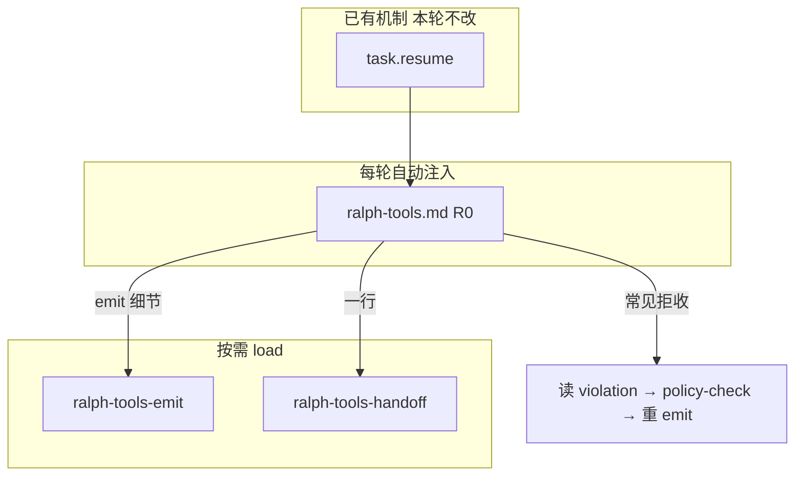

# feat: ralph-core/data agent 文档闭环（loop 纠偏）

## Summary

在 **近两个月机制已落地**（`task.resume`、WAVE CONTEXT、step handoff gate、incomplete wave `plan.blocked` 等）的前提下，补 **agent 每轮可见** 的修复说明书：P0 改 `ralph-tools.md`（`task.resume` 解码）；P1 扩展按需 emit/handoff skill；P2 扩展 `runtime-diagnosis.md`。**不改 runtime**；与 Plan B（017-005）分 PR。

---

## Problem Frame

编排器拒收后通常 **loop 继续**（`task.resume` 已注入 PENDING EVENTS），但 agent **重复犯同类错**——因 `crates/ralph-core/data/ralph-tools.md` 未教如何读 `violation` / `required_fields`，错误表还暗示 `--unsafe-no-policy-check`。

| 已有机理（本轮不改） | 仍缺什么 |
|---------------------|----------|
| `build_task_resume_payload` + 路由回源 hat | 自动注入段教 agent 解码与修复顺序 |
| `append_fix_hint_if_recoverable` | 与 R0 文案对齐，不重复发明字段 |
| Governance 段（WAVE / ephemeral / R4） | handoff / `progress_task_mismatch` 仅一行指针 |
| `ralph-tools-emit` 按需深参考 | null-payload 9 topic、policy-check 边界未全 |

**用户目标**：payload 错了或钻空子后，**主要靠已注入的 `ralph-tools.md` 自救**；handoff 深参考 **维持按需 load**。

---

## Requirements

| ID | 摘要 | 优先级 | 单元 |
|----|------|--------|------|
| R0, R0b | `ralph-tools.md`：`task.resume` 解码 + 去 unsafe 误导 | P0 | U1 |
| R1 | `*.rs:NN` 行号审计 | P0 | U1 |
| R2–R5 | `ralph-tools-emit.md` 通用 emit/policy | P1 | U2 |
| R6–R9 | `ralph-tools-handoff.md` + registry + 速查表 | P1 | U3, U4 |
| R10–R12 | `runtime-diagnosis.md` + data 短链 | P2 | U5 |
| R13 | `.claude/skills` symlink | P3 可选 | U6 |
| R14 | tasks/memories/cmdref 仅冲突时触达 | P3 | U6 |

追溯 origin F1–F4、AE0–AE5、SC1–SC5。

---

## Key Technical Decisions

| 决策 | 理由 |
|------|------|
| KTD1 — **文档与机制分 PR** | Plan B 改 runtime；本计划只改 `data/` + guide，review 边界清晰 (see parallel_with 017-005) |
| KTD2 — **R0 在 `ralph-tools.md` 自动注入** | 每轮可见 ROI 最高；handoff skill **不能替代** (see origin) |
| KTD3 — handoff **按需 load** | 不 patch preset；不扩 `prepend_auto_inject_skills` 白名单 |
| KTD4 — 禁止 bypass 文档 | `allow_unsafe_cli_emit: false` preset 与文档一致 |
| KTD5 — `ralph-tools.md` ≤200 行 | token 预算；R0 与 Governance 去重压缩 |
| KTD6 — **三层验收 Tier 1+2 进 CI** | Tier 3 人工 checklist 不进 CI（见下） |

---

## Verification Tiers（验收分级）

### Tier 1 — CI 硬门（必做）

| 检查 | 命令 / 位置 |
|------|-------------|
| 行数预算 | `wc -l crates/ralph-core/data/ralph-tools.md` ≤ 200 |
| 行号审计 | `grep` + `sed -n` 复核 data 内所有 `*.rs:NN` |
| 内容锚点 | `skill_registry` 或 `integration_agent_reference` 断言 builtin `ralph-tools` 含 `收到 task.resume`、`required_fields`、`--policy-check`；**不含**「policy check failed → 首选 unsafe」 |
| CLI 冒烟 | `ralph emit --help`；`ralph tools skill list` / `load ralph-tools-handoff` |
| 回归 | `cargo nextest run -p ralph-core -- skill_registry`；`cargo nextest run -p ralph-cli --bin ralph -- integration_agent_reference` |

### Tier 2 — 运行时注入链（必做，1 条）

新建 `crates/ralph-core` 单测（建议 `event_loop/tests/agent_tools_injection.rs` 或扩展现有 `event_loop` 测试模块）：

- **Given：** 最小 `RalphConfig`（`memories.enabled` 或 `tasks.enabled` 为 true）、`EventLoop::initialize`
- **When：** `build_prompt` 对任意 active hat
- **Then：** 返回 prompt 含 `<ralph-tools-skill>` 且含 R0 锚字符串（如 `收到 task.resume`）

证明：**编译进二进制的文档会进入 prompt**，不只文件内容正确。

### Tier 3 — 人工 dogfood（可选，合并前勾选）

维护者 checklist（**不写进 CI**）：

- [ ] 故意缺字段 `ralph emit work.ready`，确认 stderr / R0 指引走 `--policy-check`
- [ ] loop 内出现 `task.resume`，肉眼确认 PENDING EVENTS + 注入段可同时读到
- [ ] handoff 复杂 violation 时，`skill load ralph-tools-handoff` 可加载

---

## High-Level Technical Design

---

## Implementation Units

### U1. `ralph-tools.md` R0 自动纠偏 + 行号审计

**Goal:** agent **不 load skill** 也能纠偏常见 `task.resume`（R0, R0b, R1, SC1, SC5, AE0）。

**Requirements:** R0, R0b, R1, SC1, SC5, AE0, AE1

**Dependencies:** 无

**Files:**

- `crates/ralph-core/data/ralph-tools.md`
- `crates/ralph-core/data/ralph-tools-wave.md`（行号若涉及）

**Approach:**

1. 新增 `## 收到 task.resume 时`（约 15–25 行）：在 PENDING EVENTS 找 JSON；读 `stage` / `topic` / `violation` / `required_fields` / `allowed_topics`；顺序为补 payload → `ralph emit <topic> --policy-check -j '...'` → 重试；**禁止** `--unsafe-no-policy-check`、直写 `events.jsonl`。
2. handoff 类 violation 一行 + `ralph tools skill load ralph-tools-handoff`；可选一行 `ralph diagnose` / guide 链接。
3. R0b：改「通用错误恢复」表 — `policy check failed` / `policy validation failed` → 读 `validation_errors` + `--policy-check`。
4. R1：修正注入段行号为 `event_loop/mod.rs` 当前 `prepend_auto_inject_skills` / ralph-tools 注入块（约 4858–4896）；同步 `skill_cli.rs`、`emit_path.rs`、`wave.rs`、`hats.rs` 等引用。
5. 与 Agent Output Governance 去重：wave/ephemeral/R4 保留；handoff 长文不进 R0。

**Patterns to follow:** `build_task_resume_payload` 字段名（`crates/ralph-core/src/event_loop/rejection.rs`）；现有 WAVE CONTEXT 块风格。

**Test scenarios:**

- Covers AE0. `skill_registry` 或锚点测试：内容含 `required_fields`、`--policy-check`、无 unsafe 首选表述。
- Covers AE1. sed 行号表全部通过。
- Happy path: `wc -l` ≤ 200。
- Edge: R0 + Governance 合并后仍 ≤ 200（必要时压缩 Decision Journal 或表格行）。

**Verification:** Tier 1 行数 + sed；Tier 2 在 U6 落地。

---

### U2. 扩展 `ralph-tools-emit.md`

**Goal:** 按需 emit 深参考（R2–R5）。

**Requirements:** R2, R3, R4, R5, AE2, AE5

**Dependencies:** U1（交叉引用一致）

**Files:**

- `crates/ralph-core/data/ralph-tools-emit.md`

**Approach:**

1. `NULL_PAYLOAD_REJECT_TOPICS` 当前 9 topic 表（以 `event_policy.rs` 为准）。
2. 通用 `task.resume` / CLI 修复表（细于 R0）；文首指向「速查见 ralph-tools 自动注入段」。
3. isolated `publishes` 越权规则。
4. 显式写明：`--policy-check` **不覆盖** `progress_task_gate`（完整预检见 Plan B 017-005）。
5. 去除 emit 文档 unsafe 误导；文末 diagnosis 短链占位。

**Test scenarios:**

- Covers AE2. `integration_agent_reference` 加载 emit skill 仍含关键恢复表。
- Error path: `ralph emit --help` 参数与文档表一致（`bash scripts/check-cli-doc-drift.sh` 非 strict 冒烟）。

**Verification:** Tier 1 help + integration 子集。

---

### U3. 新建 `ralph-tools-handoff.md` + registry

**Goal:** ce-executor handoff 深参考（R6–R7, SC4, AE3）。

**Requirements:** R6, R7, R9, SC4, AE3

**Dependencies:** U1

**Files:**

- `crates/ralph-core/data/ralph-tools-handoff.md`（新建）
- `crates/ralph-core/src/skill_registry.rs`

**Approach:**

- 文首：**loop 内先读自动注入 R0；本文档供 load 后深查**。
- 覆盖：handoff topic 归属、`progress_task_gate` / `progress_task_mismatch`、`trigger_multi_consumer_topics` 概念、`plan.blocked` / `handoff_dispatch_timeout` / `review_passed_while_wave_open` 一行修复路径 + 校验命令。
- `register_builtin("ralph-tools-handoff", ...)`；**不**加入 auto-inject 白名单。

**Test scenarios:**

- Covers AE3. `cargo nextest run -p ralph-core -- skill_registry` 含 handoff；`integration_agent_reference` list/load 含锚点。

**Verification:** Tier 1 registry + integration。

---

### U4. `ralph-tools.md` 速查表收尾

**Goal:** R8 与 U1 指针一致。

**Requirements:** R8

**Dependencies:** U1, U3

**Files:**

- `crates/ralph-core/data/ralph-tools.md`

**Approach:** 速查表增加 `Step handoff / ce-executor` → `ralph tools skill load ralph-tools-handoff`；核对行数。

**Test scenarios:** Happy path: `wc -l` ≤ 200；list 含 handoff。

**Verification:** Tier 1。

---

### U5. 扩展 `runtime-diagnosis.md` 与短链

**Goal:** R10–R12, AE4（人类 / diagnose 深路径）。

**Requirements:** R10, R11, R12, AE4

**Dependencies:** U2, U3

**Files:**

- `docs/guide/runtime-diagnosis.md`
- `crates/ralph-core/data/ralph-tools-emit.md`
- `crates/ralph-core/data/ralph-tools-handoff.md`

**Approach:** §12.1 `emit rejection → task.resume → 修复` 决策树；emit/handoff 文末链到 guide；R0 一行链到 guide。handoff 机制诊断细节与 017-005 对齐处写「见 guide §…」避免重复。

**Test scenarios:** Covers AE4. grep 双向链接存在。

**Verification:** 人工读通 F4。

---

### U6. Tier 2 注入测试 + 集成收尾

**Goal:** SC1–SC5；R13 可选。

**Requirements:** SC1–SC5, R5, R14, R13（可选）

**Dependencies:** U1–U5

**Files:**

- `crates/ralph-core/src/event_loop/tests/agent_tools_injection.rs`（新建，或并入邻接测试模块）
- `crates/ralph-cli/tests/integration_agent_reference.rs`
- **（可选）** `.claude/skills/ralph-tools-handoff/SKILL.md` symlink

**Approach:**

1. **Tier 2：** `build_prompt` 断言含 R0 锚点（见 Verification Tiers）。
2. 扩展 `integration_agent_reference`：handoff list/load；`ralph-tools` 锚点（若 U1 未覆盖）。
3. 全量 Tier 1 回归；`bash scripts/check-cli-doc-drift.sh`；sed 归档表写入 PR 描述。
4. R13 symlink 仅维护者需要时做。

**Test scenarios:**

- Integration: `EventLoop::build_prompt` 输出含 `<ralph-tools-skill>` 与 `收到 task.resume`。
- Regression: `cargo nextest run --workspace --exclude ralph-e2e`（合并前）。

**Verification:** Tier 1 + Tier 2 全绿；Tier 3 checklist 可选勾选。

---

## Scope Boundaries

### In scope

- U1–U6；Tier 1 + Tier 2 为合并硬门。

### Deferred to Follow-Up Work

- CI 自动 doc ↔ `--help` strict 门禁
- `ralph hats show` 暴露 multi-consumer（017-005 或更后）
- preset instructions 内嵌 load handoff
- R13 symlink（U6 未做时）

### Outside this product's identity

- 改编排机制（属 017-005）
- 复制 preset instructions 全文
- 强制 IDE symlink

---

## Risks & Dependencies

| 风险 | 缓解 |
|------|------|
| R0 + Governance 超 200 行 | 合并重复、压缩表格；handoff 细节只留一行 |
| 与 017-005 文档重复 | emit 文档写明 policy-check 边界；guide 互链分工 |
| 行号再次漂移 | R1 sed 表 + CLAUDE 反向验证规则 |

**依赖：** `rejection.rs` payload 形状；017-002/003 机制行为以当前 `main` 为准。

---

## Sources & Research

- `docs/brainstorms/2026-06-17-ralph-core-data-ce-executor-sync-requirements.md`
- `docs/report/2026-06-16-systematic-review-of-recent-fixes.md`
- `docs/code-review-2026-06-17-002.md` finding #19
- `crates/ralph-core/src/event_loop/mod.rs` — `prepend_auto_inject_skills`、ralph-tools 注入
- `crates/ralph-core/src/skill_registry.rs` — builtin 注册模式
- `crates/ralph-cli/tests/integration_agent_reference.rs` — list/load 测试模式

---

## Open Questions

**Deferred to Implementation**

- R0 插入位置：紧接「核心规则」之后 vs 并入「通用错误恢复」之前 — 选扫读最快处。
- Tier 2 测试挂 `event_loop/tests/` 新文件 vs 扩展现有模块 — 选依赖最少的 setup。
