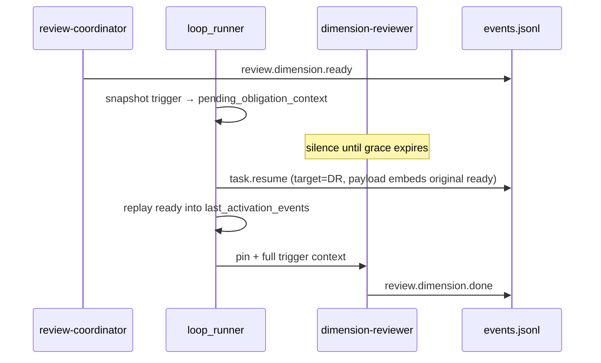

# fix: ce-executor-serial noble-peacock review 链死锁与恢复机制缺口

## Summary

`ce-executor-serial` 在 noble-peacock run 中 U1 真实落地后，review 链在 correctness 第一维即死锁并最终 `loop.cancel`。根因不是 isolated 事件泄漏，而是 **三套机制缺口叠加**：CLI 写盘前 `hat=None` 绕过 scope/schema 专检、**per-iteration** `missing_event_gate` 与长跑 reviewer 时钟冲突、recovery 注入后 **trigger 上下文丢失** 导致 dimension-reviewer 无法自愈。本计划在 plan 003（merry-lotus 后续）已落地部分之上，补齐 noble-peacock 暴露的 P0/P1 缺口，并附可执行的验收标准与测试矩阵。

---

## Problem Frame

### 事故回放（noble-peacock）

来源：`docs/report/2026-06-17-ce-executor-serial-noble-peacock-review-chain-stalled-diagnosis.md`

| 时间线 | 事件 | 状态 |
|--------|------|------|
| iter 1 | executor `work.done`（U1 commit `e8df619`） | ✅ |
| iter 2–3 | executor 26 次越权 probe，24 次 CLI reject，**2 条** `review.passed(plan_name="p")` **写入 jsonl** | ❌ |
| iter 2 | review-coordinator `review.dimension.ready(correctness)` | ✅ |
| ~49s 后 | `missing_event_gate` → orchestrator `task.resume` | ⚠️ |
| iter 5 | dimension-reviewer 仍 0 emit → ralph `loop.cancel` | ❌ |

### 与 plan 003 的关系

plan 003（`docs/achieved/plan/2026-06-17-003-fix-ce-executor-serial-precheck-recovery-gates-plan.md`）已落地 U1–U5 主体代码，但 noble-peacock 证明 **仍有结构性缝隙**：

| plan 003 单元 | 声称状态 | noble-peacock 实测 |
|---------------|----------|-------------------|
| U1 `check_isolated_scope` | 已落地 | `hat=None` 时 **no-op**，2/26 漏拦 |
| U2 `task.resume` schema | `reason`+`target_hat` 已补 | hard_gate 路径 **无 `stage`**；更关键的是 **无 top-level `target` + trigger 上下文丢失** |
| U3 hard_gate → `task.resume` | 已落地 | 注入后 dimension-reviewer **无法二次激活产出** |
| U4 steward triggers | 已收窄 | 未单独验证 |
| diagnosis-summary | **P2 defer** | `recovery_count: 0` 硬编码，与顶层 `recovery.jsonl` 分裂 |

### 调试结论（纳入本 plan 前提）

1. **executor 乱 emit**（`build.done` / `debug.step` / `review.passed`）主因是 **prompt 污染**（instructions 反向提及 forbidden topic、`memories.md`、`ralph-tools.md`），不是 isolated 事件流泄漏。24/26 已被 CLI 拦截；本 plan **不**把 prompt 清理列为实施单元，defer 到 follow-up。
2. **`task.resume` 缺 `stage`** 不是 schema 阻断（SSOT 仅要求 `reason`+`target_hat`）；真正阻断是 **routing + `last_activation_events` 丢失 `review.dimension.ready`**。
3. **`hat.timeout: 1800`** 在 preset 文档中存在，**主 loop runner 不读取**；missing_event_gate 在 **每个 iteration 结束** 判定，与 1800s 是两套时钟。

---

## Requirements

- **R1.** isolated 模式下，业务 topic 的 `ralph emit` 在 **无 provenance（`--hat` / `RALPH_CURRENT_HAT` 皆缺）** 时必须在写盘前 fail-closed，不得依赖 runtime origin guard 事后清理。
- **R2.** isolated 模式下，即使 `hat=None`，`hat_allowed_values` 等对 hat 敏感的 schema 规则也不得跳过；`executor` + `review.passed` + `skip_reason=aggregate_timeout` 必须在 CLI 边界拒绝。
- **R3.** `missing_event_gate` 不得在长跑 obligation hat（如 `dimension-reviewer`）的首轮沉默后 **立即**（~1 iteration）触发；应 defer 到与 adapter idle timeout 或显式 grace 对齐的可配置下限。
- **R4.** `missing_event_gate` 注入的 `task.resume` 必须：(a) 带 **top-level `target`** 路由到 offending hat；(b) 保留或重放激活 trigger（`review.dimension.ready` payload）到 `last_activation_events`，使 dimension-reviewer 下一轮能按原上下文 emit terminal。
- **R5.** `enrich_task_resume_payload`（hard_gate 路径）应补齐与 policy rejection 路径一致的 **`stage`** 字段（值为 `missing_event`），便于 drift 与 operator 排查；**不**将 `stage` 加入 preset schema required_fields。
- **R6.** `diagnosis-summary.json` 的 `recovery_count` / `recovery_journal_path` 必须反映 **实际 recovery 活动**，合并或索引 workspace 层 `.ralph/recovery.jsonl` 与 session 层 `diagnostics/<session>/recovery.jsonl`。
- **R7.** plan 文档 frontmatter 与 `tasks.jsonl` 闭合状态不得长期漂移；提供 **机制层可检测** 的校验（doctor/preflight），并在 `ce-executor-serial` coordinator 指令中强制同步义务。
- **R8.** 所有行为变更须有 targeted 测试；最终验证走 `./scripts/run-tests.sh`（nextest + doctest，见 `CLAUDE.md` HARD RULE 1/2）。

---

## Key Technical Decisions

| ID | 决策 | 理由 |
|----|------|------|
| KTD-1 | isolated + business topic + `hat=None` → **CLI reject**（非 defer runtime） | `check_isolated_scope` L423-425 的 no-op 是 noble-peacock 漏拦根因；fail-closed 优于事后 drop |
| KTD-2 | 优先在 `emit.rs` 启用 preset 已有 `require_emit_provenance`；isolated 模式对 business topic **默认等价于 require provenance** | 复用现有 config 字段，避免新 flag  proliferation |
| KTD-3 | missing_event defer 用 **`HatActivationClock`**（per-hat 首次激活时间戳 + grace）而非读 `hat.timeout` | 主 runner 不读 hat.timeout；adapter timeout 已存在但粒度不同；新时钟专用于 gate defer |
| KTD-4 | grace 默认 `min(adapter_idle_timeout_secs * 0.3, 540)`，serial preset 可对 `dimension-reviewer` override | 对齐诊断报告「≥ timeout×0.3」建议，540s floor 防止极短 adapter 配置误触 |
| KTD-5 | recovery 修复采用 **`Event::with_target` + `replay_trigger_to_activation_state`** 双轨 | 仅 pin `pending_recovery_hat` 不够；dimension-reviewer triggers 不含 `task.resume` |
| KTD-6 | diagnosis 采用 **双路径索引**（summary 列出两个 journal + 合并 count）而非搬迁 CLI journal | 避免破坏已有 CLI reject 工具链与外部 grep 习惯 |
| KTD-7 | plan frontmatter 用 **`ralph doctor plan-sync`** 校验 + coordinator 指令义务，不做 orchestrator 自动改 docs/ | 自动写 plan 文件越界；检测 + 明确 backpressure 符合 Ralph 十诫 |

---

## Scope Boundaries

### 在范围内

- `crates/ralph-cli/src/policy_check.rs`、`commands/emit.rs`：provenance fail-closed + hat_allowed_values 无 hat 路径
- `crates/ralph-cli/src/loop_runner/hard_gate.rs`、`runner.rs`：gate defer、recovery routing、diagnosis seed
- `crates/ralph-core/src/event_loop/loop_state.rs`：activation clock 状态
- `crates/ralph-core/src/event_loop/rejection.rs`：`enrich_task_resume_payload` 补 `stage`
- `crates/ralph-core/src/diagnostics/`、`diagnosis/reporter.rs`：summary 计数
- `presets/en/ce-executor-serial.yml`：dimension-reviewer gate grace override（可选）
- `crates/ralph-cli/src/doctor.rs`（或等价入口）：plan frontmatter 漂移检测
- 集成测试、BDD scenario、noble-peacock replay fixture
- `docs/solutions/` 追加 learnings 条目

### 不在范围内

- Plan 003 U2 大文件拆分（12k 行 `tests.rs`）——运营/计划层面，另开 plan
- executor prompt 污染清理（`memories.md` / `ralph-tools.md` 降噪）
- `inject_wave_policy_rejection_guidance` 改 `human.guidance`（wave preset 专用，plan 003 defer）
- Telegram / RObot 接入 serial preset
- 10-hat 拓扑重构

### Deferred to Follow-Up Work

- prompt 污染系统性清理（forbidden topic 从 executor instructions 反引号列表移除）
- `ralph wave emit` 与 serial emit provenance 一致性审计
- noble-peacock worktree 一次性 frontmatter 手改（本 plan 仅提供检测 + plan 003 状态更新指引）

---

## High-Level Technical Design

### 目标架构：写盘前门 + 时钟对齐的 recovery

```mermaid
flowchart TD
    subgraph cli [CLI Single Write Gate]
        A[ralph emit] --> B{isolated + business topic?}
        B -->|yes| C{provenance present?}
        C -->|no| D[reject: missing_provenance]
        C -->|yes| E[check_isolated_scope + hat_allowed_values]
        E --> F{pass?}
        F -->|no| G[reject → recovery.jsonl cli_emit]
        F -->|yes| H[write events.jsonl]
    end

    subgraph loop [Loop Runner]
        I[hat activated] --> J[record activation_at]
        J --> K[iteration end]
        K --> L{within grace?}
        L -->|yes| M[skip missing_event_gate]
        L -->|no| N{obligation satisfied?}
        N -->|no| O[inject task.resume with target + replay trigger]
        O --> P[pending_recovery_hat pin]
        P --> Q[next iter: DR sees ready context]
    end

    subgraph diag [Diagnostics]
        R[CLI recovery.jsonl] --> T[merge count]
        S[session recovery.jsonl] --> T
        T --> U[diagnosis-summary.json]
    end
```



### 时钟模型（澄清误解）

| 时钟 | 控制方 | noble-peacock 值 | 本 plan 处理 |
|------|--------|------------------|------------|
| Iteration 边界 | loop_runner | ~49s 即 gate | **defer** via HatActivationClock |
| Adapter idle | `ralph.yml` / backend | 300–900s | grace 计算输入 |
| hat.timeout | preset YAML | 1800s（未接线） | **不**假装已生效；文档注释澄清 |
| stall_recovery | progress-steward | 多 iter 无 business | 保持现有路径 |

### Recovery 上下文保留



---

## Acceptance Examples

### AE1. CLI 不再漏拦 executor review.passed

- **Covers:** R1, R2
- **Given:** isolated preset、`RALPH_CURRENT_HAT` 未设置、`--hat` 未传
- **When:** `ralph emit review.passed --json '{"plan_name":"p","task_id":"t",...,"skip_reason":"aggregate_timeout"}'`
- **Then:** 命令非零退出；stderr 含 `missing_provenance` 或 `isolated_scope_violation`；`events.jsonl` **无**该行；`.ralph/recovery.jsonl` 新增 `source=cli_emit` 条目

### AE2. dimension-reviewer 首轮慢但不立即被 gate 杀

- **Covers:** R3
- **Given:** `review.dimension.ready(correctness)` 已 emit，dimension-reviewer 激活，adapter timeout 未到期，grace 内
- **When:** 第一个 iteration 结束且 agent 0 emit
- **Then:** `missing_event_gate` **不**触发；`recovery.jsonl` 无 `source=missing_event_gate` 条目

### AE3. grace 到期后 recovery 可自愈

- **Covers:** R4, R5
- **Given:** grace 已过期，dimension-reviewer 仍 0 emit
- **When:** iteration 结束触发 gate
- **Then:** `task.resume` 带 top-level `target=dimension-reviewer`；payload 含 `reason`+`target_hat`+`stage=missing_event`；**下一轮** dimension-reviewer emit `review.dimension.done`；review 链继续向 testing 维推进

### AE4. 诊断不再失明

- **Covers:** R6
- **Given:** 一次 run 产生 3 条 `cli_emit` reject + 1 条 `missing_event_gate`
- **When:** loop 终止写 `diagnosis-summary.json`
- **Then:** `recovery_count >= 4`；`recovery_journal_path` 或 `notes` 列出双路径；`ralph diagnose --session latest` 报告非零 recovery

### AE5. plan frontmatter 漂移可检测

- **Covers:** R7
- **Given:** plan frontmatter `status: stalled-after-U1` 但 `tasks.jsonl` 中对应 U1 task 已 `closed`
- **When:** `ralph doctor plan-sync`（或等价子命令）
- **Then:** 非零退出或 warning；输出指明 frontmatter 与 task store 不一致及建议状态

---

## Implementation Units

### U1. CLI provenance fail-closed（R1, R2）

**Goal:** 堵住 `hat=None` 绕过 `check_isolated_scope` 与 `hat_allowed_values` 的漏拦路径。

**Dependencies:** 无

**Files:**
- `crates/ralph-cli/src/policy_check.rs`
- `crates/ralph-cli/src/commands/emit.rs`
- `crates/ralph-core/src/event_policy.rs`（如需无 hat 时的 fail-closed 分支）
- `presets/en/ce-executor-serial.yml`（显式 `require_emit_provenance: true`）
- `crates/ralph-cli/tests/integration_emit_policy.rs`

**Approach:**
1. 新增 `check_emit_provenance(hat, topic, config)`：isolated 模式下，topic 属于 business topics（非 `RALPH_CONTROL_TOPICS`、非 orchestrator internal）且 `hat=None` → `ValidationError { reason_code: "missing_provenance" }`。
2. `emit.rs` 在现有 policy 块之前调用；与 preset `require_emit_provenance` 对齐——isolated 默认等价开启。
3. 补充：`validate_event_with_hat` 在 `hat=None` 时对含 `hat_allowed_values` 的字段走 **最严格** 分支（拒绝所有 hat-specific allowed value），或要求 provenance 后才进入 hat_allowed 校验。
4. preset 显式设置 `event_policy.require_emit_provenance: true`（与 `require_policy_check_for_cli_emit` 并列文档化）。

**Patterns to follow:**
- plan 003 U1 `check_isolated_scope` 模式
- `integration_emit_policy.rs` 现有 `test_emit_isolated_mode_rejects_coordinator_aggregate_timeout`

**Test scenarios:**

| # | 类别 | 场景 |
|---|------|------|
| T1.1 | Happy path | executor + `--hat executor` + 合法 `work.done` → 写盘成功 |
| T1.2 | Error | isolated + 无 hat + `review.passed` + `aggregate_timeout` → reject，jsonl 无行（**Covers AE1**） |
| T1.3 | Error | isolated + 无 hat + `build.done` → `missing_provenance` 或 `topic_denied` |
| T1.4 | Edge | isolated + `hat=ralph` + `loop.cancel` → 仍允许（control topic 豁免） |
| T1.5 | Integration | 有 `RALPH_CURRENT_HAT=executor` 时 `debug.step` → `isolated_scope_violation`（回归 plan 003） |
| T1.6 | Integration | coordinator + `review.passed` + `empty_diff` + hat 正确 → 允许（不应误杀合法路径） |

**Verification:**
- `cargo nextest run -p ralph-cli -- isolated_scope`
- `cargo nextest run -p ralph-cli -- test_emit_ce_executor_serial`
- AE1 手动冒烟通过

---

### U2. HatActivationClock 与 missing_event_gate defer（R3）

**Goal:** 防止 dimension-reviewer 等长跑 hat 在首个 iteration 沉默时被 ~49s 误杀。

**Dependencies:** 无（可与 U1 并行）

**Files:**
- `crates/ralph-core/src/event_loop/loop_state.rs`
- `crates/ralph-cli/src/loop_runner/hard_gate.rs`
- `crates/ralph-cli/src/loop_runner/runner.rs`
- `presets/en/ce-executor-serial.yml`（可选 per-hat `missing_event_grace_secs`）
- `crates/ralph-cli/src/loop_runner/tests.rs`

**Approach:**
1. `LoopState` 增加 `hat_activation_started_at: HashMap<String, DateTime<Utc>>`；hat 被选中执行 agent 时写入/刷新。
2. `should_gate_missing_events` 增加参数或读取 state：若 `now - activation_started < grace_secs` → return false。
3. grace 解析顺序：`hat.missing_event_grace_secs` → preset 默认 → `min(adapter_idle * 0.3, 540)`。
4. serial preset 为 `dimension-reviewer` 设置 `missing_event_grace_secs: 540`（与诊断建议一致）。
5. 与 `flow_lifecycle` wave mutex 逻辑正交：serial 无 wave，但保持现有 wave 豁免不变。

**Technical design（方向性）:**

```
fn missing_event_grace(hat_id, config, adapter_idle) -> Duration
fn should_gate_missing_events(...) -> bool {
    if within_grace(hat_id) { return false }
    // existing obligation / legacy logic
}
```

**Test scenarios:**

| # | 类别 | 场景 |
|---|------|------|
| T2.1 | Happy path | grace 内 0 emit → gate 不触发（**Covers AE2**） |
| T2.2 | Edge | grace 边界 `activation + grace - 1s` → 不触发 |
| T2.3 | Edge | grace 边界 `activation + grace + 1s` + 0 emit → 触发 |
| T2.4 | Integration | wave obligation pending 时仍不 gate（回归 `test_wave_policy_rejection_skips_missing_event_gate`） |
| T2.5 | Error | agent emit 被 policy reject → `agent_wrote_any_valid_or_rejected=true` → 不 gate（回归现有测） |

**Verification:**
- `cargo nextest run -p ralph-cli --bin ralph -- missing_event_gate`
- `cargo nextest run -p ralph-cli --bin ralph -- grace`

---

### U3. Recovery routing：target + trigger 上下文重放（R4, R5）

**Goal:** missing_event_gate 注入后 dimension-reviewer 能带着 `review.dimension.ready` 上下文完成 emit。

**Dependencies:** U2（gate 触发时点正确后才有意义；可先做 U3 逻辑再合 U2）

**Files:**
- `crates/ralph-cli/src/loop_runner/hard_gate.rs`
- `crates/ralph-cli/src/loop_runner/runner.rs`
- `crates/ralph-core/src/event_loop/rejection.rs`
- `crates/ralph-core/src/event_loop/mod.rs`（`effective_regular_events` / activation snapshot）
- `crates/ralph-core/src/event_loop/tests/r5_hard_gate_routing.rs`
- `crates/ralph-cli/tests/ce_executor_recovery.rs`

**Approach:**
1. `inject_missing_event_hard_gate_guidance` 写入 JSONL 时增加 top-level `"target": "<hat>"`（与 `Event::with_target` 语义一致）。
2. hat 激活时，将 triggering event(s) 快照到 `LoopState.pending_obligation_triggers: Vec<Event>`；gate 触发时把原 `review.dimension.ready` payload 嵌入 `task.resume` 的 `original_trigger_topic` / `original_trigger_payload`（复用 `build_task_resume_payload` 字段形状）。
3. `enrich_task_resume_payload` 增加 `stage: "missing_event"` 可选参数或专用 wrapper。
4. runner 在 pin `pending_recovery_hat` 后调用 `replay_obligation_triggers_to_activation_state`，确保 `last_activation_events` 含 `review.dimension.ready`。
5. 评估是否为 dimension-reviewer 增加 `task.resume` trigger（**备选**，优先 trigger 重放以避免扩大 hat 订阅）。

**Patterns to follow:**
- `build_task_resume_payload` 的 `original_trigger_*` 字段（`rejection.rs`）
- R5 `publish_policy_rejection_resume` 的 `Event::with_target` 路由

**Test scenarios:**

| # | 类别 | 场景 |
|---|------|------|
| T3.1 | Happy path | gate 后下一 iter DR emit `review.dimension.done` → 无二次 gate（**Covers AE3**） |
| T3.2 | Integration | `task.resume` JSONL 行含 top-level `target=dimension-reviewer` |
| T3.3 | Integration | payload 含 `stage=missing_event`、`reason`、`target_hat` |
| T3.4 | Edge | 多 trigger 快照时仅重放 obligation 匹配的 ready 事件 |
| T3.5 | Error | enrich 失败时不写不合规 JSONL（fail-closed） |
| T3.6 | Integration | `r5_hard_gate_routing` 回归：reject resume 仍路由源 hat |

**Verification:**
- `cargo nextest run -p ralph-core -- r5_hard_gate`
- `cargo nextest run -p ralph-cli -- u3_inject_hard_gate`
- `cargo nextest run -p ralph-cli -- ce_executor_recovery`

---

### U4. diagnosis-summary recovery 聚合（R6）

**Goal:** 终止诊断不再报告 `recovery_count: 0` 当顶层已有 26 条 cli_emit reject。

**Dependencies:** U1–U3（有机制 envelope 后合并更有意义，但可独立）

**Files:**
- `crates/ralph-cli/src/loop_runner/runner.rs`（`build_termination_diagnostics`）
- `crates/ralph-core/src/diagnostics/mod.rs`
- `crates/ralph-core/src/diagnosis/reporter.rs`
- `crates/ralph-cli/tests/diagnose.rs`
- `crates/ralph-core/src/diagnostics/integration_tests.rs`

**Approach:**
1. 抽取 `count_recovery_entries(workspace_root, session_id) -> (workspace_count, session_count)`。
2. `DiagnosisSummary.recovery_count = workspace_count + session_count`。
3. `recovery_journal_path` 改为数组或 `notes` 追加：`workspace: .ralph/recovery.jsonl`，`session: .ralph/diagnostics/{id}/recovery.jsonl`。
4. `ralph diagnose` reporter 可选读取双路径（若 session 路径为空则 fallback workspace）。

**Test scenarios:**

| # | 类别 | 场景 |
|---|------|------|
| T4.1 | Happy path | 3 cli_emit + 1 missing_event_gate → `recovery_count == 4`（**Covers AE4**） |
| T4.2 | Edge | 无 recovery 文件 → count 0，不 panic |
| T4.3 | Integration | `ralph diagnose --format json` 输出非零 recovery_count |
| T4.4 | Edge | 仅 workspace 有数据、session 空 → 仍计数 workspace |

**Verification:**
- `cargo nextest run -p ralph-cli -- diagnose`
- `cargo nextest run -p ralph-core -- diagnosis_summary`

---

### U5. Plan frontmatter 漂移检测与 coordinator 义务（R7）

**Goal:** plan 003 `status: stalled-after-U1` 类漂移可被机制发现，而非依赖人读报告。

**Dependencies:** 无

**Files:**
- `crates/ralph-cli/src/doctor.rs`
- `presets/en/ce-executor-serial.yml`（coordinator instructions）
- `docs/plans/2026-06-10-003-refactor-event-loop-and-loop-runner-tests-split-plan.md`（一次性状态更新）
- `crates/ralph-cli/tests/doctor.rs`（或新建）

**Approach:**
1. 新增 `ralph doctor plan-sync [--plan PATH]`：
   - 读 plan YAML frontmatter `status` / `units` 声明
   - 读 `.ralph/agent/tasks.jsonl` 中同 `plan_name` 的 open/closed
   - 规则示例：所有标记 closed 的 unit 在 frontmatter 不应仍为 `stalled-after-U*`；存在 open task 时不应为 `completed`
2. coordinator instructions 增加 **HARD RULE**：每次 `work.done` 关闭 unit 后，必须更新 plan frontmatter `status` 字段（列出允许的状态枚举）。
3. 实施时顺手将 plan 003 frontmatter 更新为 `u1-closed-u2-splitting-pending`（一次性，非机制）。

**Test scenarios:**

| # | 类别 | 场景 |
|---|------|------|
| T5.1 | Error | frontmatter stalled + task closed → doctor 报错（**Covers AE5**） |
| T5.2 | Happy path | frontmatter 与 tasks 一致 → exit 0 |
| T5.3 | Edge | 无 plan 文件 → 明确错误信息 |
| T5.4 | Edge | 无 tasks.jsonl → skip 或 warn（不 crash） |

**Verification:**
- `cargo nextest run -p ralph-cli -- doctor`
- `ralph doctor plan-sync` 对 plan 003 修复后 exit 0

---

### U6. 端到端验收：BDD + noble-peacock replay fixture（R8）

**Goal:** 将 AE1–AE5 固化为 CI 可跑回归，防止 merry-lotus / noble-peacock 三次复现。

**Dependencies:** U1, U2, U3, U4, U5

**Files:**
- `crates/ralph-core/tests/scenarios/ce_executor_serial_review.yml`（扩展 silent reviewer 恢复用例）
- `crates/ralph-core/tests/fixtures/noble-peacock-review-stall/`（新建 replay JSONL）
- `crates/ralph-cli/tests/integration_emit_policy.rs`
- `docs/solutions/integration-issues/ce-executor-serial-noble-peacock-recovery-2026-06-17.md`（新建 learnings）

**Approach:**
1. 从 noble-peacock 事件流抽取最小复现序列（ready → silence → resume → done），录制为 smoke replay fixture。
2. BDD scenario 增加变体 `ce_executor_serial_review_silent_reviewer_recovers`：模拟 DR 首轮沉默、次轮 done。
3. 新增 `test_noble_peacock_executor_review_passed_never_lands` 集成测试（U1 回归）。
4. 文档化验收命令块（非测试代码复制）。

**Test scenarios:**

| # | 类别 | 场景 |
|---|------|------|
| T6.1 | Integration | `cargo nextest run -p ralph-core --test scenarios ce_executor_serial` 全绿 |
| T6.2 | Smoke | replay noble-peacock fixture：修复前 stall、修复后过 correctness 维 |
| T6.3 | Regression | 3× `cargo nextest run -p ralph-cli --bin ralph -- missing_event` 无 flake |
| T6.4 | CI gate | `./scripts/run-tests.sh` 全 workspace 通过 |

**Verification:**
- `./scripts/run-tests.sh`
- 全部 Acceptance Examples AE1–AE5 有对应自动化测试或 documented manual step

---

## Risks & Dependencies

| 风险 | 影响 | 缓解 |
|------|------|------|
| provenance 强制过严阻断合法 operator emit | 无 hat 手动 emit 失败 | `ralph` control topic 豁免；doctor 文档说明 `--hat` 必填 |
| grace 过长掩盖真 stall | 链沉默 30min+ | progress-steward `loop.stalled` 仍为兜底；grace 上限 clamp |
| trigger 重放与 R5 单-turn 规则冲突 | 双 business event | 重放仅进入 activation state，不二次写 jsonl |
| ralph-cli 测试 flake | CI 红 | 遵守 cli-serial；flake 时 `RALPH_BASELINE_SERIAL=1` |
| plan 003 frontmatter 手改冲突 | 并行 run 漂移 | U5 检测 + 一次性更新 |

---

## System-Wide Impact

- **开发者：** `ralph emit` 在 isolated 无 hat 时更严格；需确保 subagent 总设 `RALPH_CURRENT_HAT`。
- **Operator：** `ralph diagnose` / `diagnosis-summary.json` 数字可信；`ralph doctor plan-sync` 新入口。
- **Preset 作者：** 可选 `missing_event_grace_secs` per hat。
- **CI：** 新增集成测试略增 ralph-cli 串行时间；无 API breaking change。

---

## Phased Delivery

| 阶段 | 单元 | 交付物 | 可独立合并 |
|------|------|--------|------------|
| Phase A | U1 | CLI 不再漏拦 | ✅ |
| Phase A | U2 + U3 | review 链可自愈 | 建议同 PR（同属 recovery） |
| Phase B | U4 | 诊断计数正确 | ✅ |
| Phase B | U5 | frontmatter 检测 | ✅ |
| Phase C | U6 | E2E 回归 + learnings | 依赖 A+B |

---

## Open Questions

| # | 问题 | 状态 | 处理 |
|---|------|------|------|
| Q1 | dimension-reviewer 是否应订阅 `task.resume`？ | Deferred | U3 优先 trigger 重放；若仍失败再加 trigger |
| Q2 | grace 是否应读 `hat.timeout` 接线主 runner？ | Deferred | 本 plan 用 HatActivationClock；接线 hat.timeout 为 follow-up |
| Q3 | workspace recovery.jsonl 是否应搬迁到 session 目录？ | Resolved | KTD-6：双路径索引，不搬迁 |

---

## Sources & Research

- `docs/report/2026-06-17-ce-executor-serial-noble-peacock-review-chain-stalled-diagnosis.md` — 主 origin
- `docs/achieved/plan/2026-06-17-003-fix-ce-executor-serial-precheck-recovery-gates-plan.md` — 前序修复
- `docs/solutions/integration-issues/ce-executor-serial-precheck-recovery-alignment-2026-06-17.md` — 机制决策 SSOT
- `crates/ralph-cli/src/policy_check.rs` — `check_isolated_scope` hat=None no-op
- `crates/ralph-cli/src/loop_runner/hard_gate.rs` — missing_event_gate
- `crates/ralph-cli/src/loop_runner/runner.rs` — `recovery_count: 0` 硬编码
- `crates/ralph-core/src/event_loop/rejection.rs` — payload 构造
- `crates/ralph-core/tests/scenarios/ce_executor_serial_review.yml` — BDD 基线
