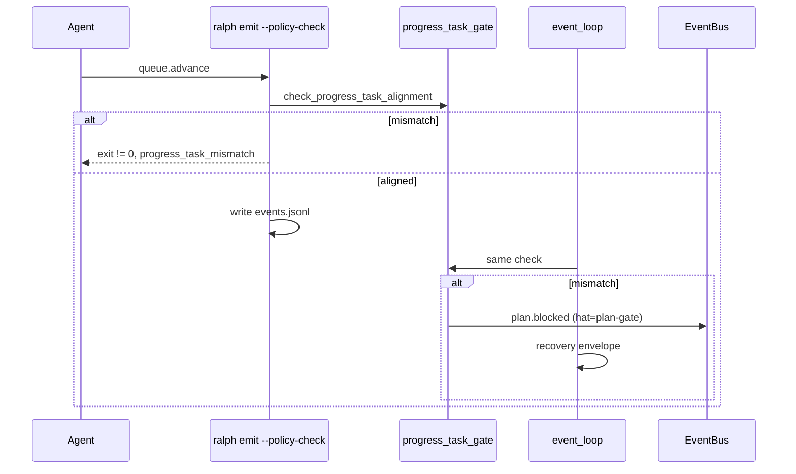

# fix: Agent 恢复链机制边角（CLI 预检与诊断对齐）

## Summary

补 **文档教不了** 的三处机制边角：CLI `--policy-check` 与 `progress_task_gate` 对齐、`plan.blocked` 注入 provenance 修正、诊断 topic 白名单 + guide 排查段。与 **017-004（仅 data/guide）分 PR**。不重复 017-003 wave stall 或 preset triggers（`fix.exhausted` / `debug.exhausted` 已在 preset）。

---

## Problem Frame

017-002 落地后，code review 仍留缝隙：

| 编号 | 问题 | 影响 |
|------|------|------|
| #21 | CLI policy-check 不接 step handoff gate | agent CLI 预检通过、loop 仍拒 |
| #1 | gate 注入 `plan.blocked` 源 hat 非法 | origin guard 二次拒收 |
| #2 | `event.step_handoff.gate_rejected` 非白名单 | 诊断事件被 isolated budget 丢 |
| #6 | 非 JSON payload gate 静默通过 | 错误格式不被拦 |
| #18 | guide 缺 handoff stall 排查 | operator 难定位 |

**已闭合（本计划不重复）**：`progress_task_gate` → `recovery.jsonl`（`mod.rs` review fix #4）；`plan-gate.triggers` 已含 exhausted 路径。

---

## Requirements

| ID | 摘要 | 单元 |
|----|------|------|
| R-A1–R-A3 | CLI 与 progress gate 同源预检 | U1 |
| R-B1 | guide handoff 排查段 | U2 |
| R-B2 | 诊断 topic 白名单 | U2 |
| R-C1 | `plan.blocked` provenance | U3 |
| R-C2 | 非 JSON payload fail-closed | U3 |
| R-D1–R-D3 | 测试 + preset check | U4 |

---

## Key Technical Decisions

| 决策 | 理由 |
|------|------|
| KTD1 — 预检复用 `check_progress_task_alignment` | 与 loop gate 同源，避免第二套规则 |
| KTD2 — CLI 预检 **opt-in 于 policy-check 路径** | 仅在 `--policy-check` / enforce 时跑；不改变默认 skip 行为 |
| KTD3 — `plan.blocked` 固定 `hat=plan-gate` | preset 唯一合法 publisher；gate 触发 hat 只作 payload 上下文 |
| KTD4 — 与 017-004 分 PR | 文档 plan 可先发；机制边角独立 review |

---

## High-Level Technical Design

---

## Implementation Units

### U1. CLI policy-check 接入 progress gate

**Goal:** R-A1–R-A3, SC1

**Requirements:** R-A1, R-A2, R-A3, R-D1

**Dependencies:** 无（依赖 017-002 gate 已存在）

**Files:**

- `crates/ralph-cli/src/policy_check.rs`
- `crates/ralph-core/src/step_handoff/progress_task_gate.rs`（导出复用入口，若需 `pub`）
- `crates/ralph-cli/tests/policy_check_handoff.rs`（扩展）

**Approach:**

1. 在 `validate_topic_payload_against_config` 之后（或 batch 路径等价处），当 topic ∈ `GATED_TOPICS` 且 workspace 可解析时，调用 `check_progress_task_alignment`。
2. 失败返回 `ValidationError { reason_code: "progress_task_mismatch", ... }`，与 loop `plan.blocked` reason 字符串对齐。
3. 文档注释指向 017-004 emit skill「CLI 不覆盖」段落 — 本单元落地后 **更新** 该表述为「017-005 后已覆盖 gated topics」。

**Patterns to follow:** `policy_check_handoff.rs` 四消费链结构；`progress_task_gate.rs` 现有 `GateDecision`。

**Test scenarios:**

- Happy path: aligned progress + tasks，`queue.advance` policy-check 通过。
- Error path: 故意 drift progress，`ralph emit --policy-check` 非零且含 `progress_task_mismatch`。
- Edge: topic 非 gated 时不额外调用 gate。
- Integration: 与 loop gate 同一 fixture workspace 双检结果一致。

**Verification:** `cargo nextest run -p ralph-cli -- policy_check_handoff`；扩展用例绿。

---

### U2. 诊断白名单 + guide 排查段

**Goal:** R-B1, R-B2, SC2

**Requirements:** R-B1, R-B2

**Dependencies:** U3（reason 字符串稳定后写 guide）

**Files:**

- `crates/ralph-core/src/event_loop/mod.rs`（`ORCHESTRATOR_DIAGNOSTIC_TOPICS` 或等价白名单）
- `docs/guide/runtime-diagnosis.md`

**Approach:**

1. 将 `event.step_handoff.gate_rejected` 加入 orchestrator 诊断白名单（finding #2）。
2. guide 新增小节：`handoff_dispatch_timeout`（recovery.jsonl 特征）与 `progress_task_mismatch`（progress vs tasks）症状 → 证据路径 → 修复（对齐 progress/tasks；**不** empty_diff bypass）。与 017-004 U5 互链，避免重复长文。

**Test scenarios:**

- Happy path: gate 拒绝后 diagnostic 事件不被 per-turn drop（单测或 scenario 断言 events 含 diagnostic topic）。
- Error path: guide grep 含两 reason 关键字。

**Verification:** 相关单测 + 人工读 guide。

---

### U3. Gate 注入 provenance + 非 JSON fail-closed

**Goal:** R-C1, R-C2, SC3

**Requirements:** R-C1, R-C2

**Dependencies:** 无

**Files:**

- `crates/ralph-core/src/event_loop/mod.rs`（`apply_step_handoff_gate`、`extract_step_and_task_id`）
- `crates/ralph-core/src/step_handoff/progress_task_gate.rs`（若需）

**Approach:**

1. `plan.blocked` 注入统一 `hat: plan-gate`（或 `Event::with_target(plan-gate)`），payload 保留触发上下文（原 event hat / topic）。
2. `extract_step_and_task_id`：非 JSON / 解析失败 → gate 返回 `Misaligned` 或等价拒收，**禁止** `(None, None)` 惰性通过（finding #6 最小修复）。

**Patterns to follow:** 其他 `plan.blocked` 注入路径的 JSON object payload 形态（017-002 review finalize）。

**Test scenarios:**

- Error path: executor 触发 gate 时 `plan.blocked` 以 plan-gate provenance 被 origin 接受。
- Error path: 畸形 payload 触发 gate 拒收，不写主事件流。
- Regression: `progress_task_mismatch` BDD scenario 仍绿。

**Verification:** `cargo nextest run -p ralph-core --test scenarios progress_task`；相关单测。

---

### U4. 回归与 preset 门禁

**Goal:** R-D2, R-D3

**Requirements:** R-D2, R-D3

**Dependencies:** U1–U3

**Files:**

- （无新文件，跑现有测试）

**Approach:**

1. `./scripts/run-tests.sh` 或 `cargo nextest run --workspace --exclude ralph-e2e`。
2. `cargo test --doc`。
3. `cargo run -p ralph-cli -- preset check --strict -H builtin:ce-executor-isolated`。

**Test scenarios:**

- Integration: 全 workspace 绿；handoff / dual-publish scenarios 无回归。

**Verification:** 上述命令全绿。

---

## Scope Boundaries

### In scope

- U1–U4；与 017-004 并行、分 merge。

### Deferred to Follow-Up Work

- `ralph hats show` 输出 `trigger_multi_consumer_topics`（finding #20）
- `trigger_multi_consumer_topics` typo 校验（finding #3）
- `diagnosis-summary.json` recovery_count 对账（systematic review P2-5）

### Outside scope

- `ralph-tools.md` R0（017-004）
- Wave / flow lifecycle 新机制

---

## Risks & Dependencies

| 风险 | 缓解 |
|------|------|
| CLI 预检需 workspace progress/tasks 文件 | 与 emit 相同 workspace 解析；缺失时与 loop cold-start 语义对齐 |
| 双检与 loop 行为漂移 | 共用 `check_progress_task_alignment` 单函数 |
| 017-004 已写「policy-check 不覆盖 gate」 | U1 完成后同步改 emit 文档一句 |

---

## Sources & Research

- `docs/brainstorms/2026-06-17-agent-recovery-mechanism-gaps-requirements.md`
- `docs/code-review-2026-06-17-002.md` findings #1, #2, #6, #18, #21
- `crates/ralph-cli/src/policy_check.rs`
- `crates/ralph-core/src/step_handoff/progress_task_gate.rs`
- `crates/ralph-core/src/event_loop/mod.rs` — `apply_step_handoff_gate`
