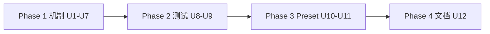
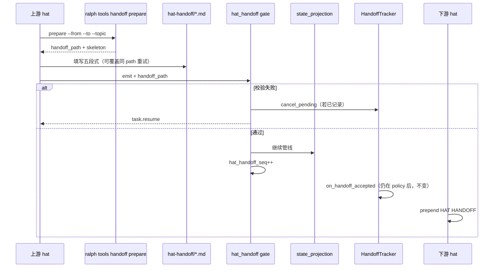

# feat: Isolated 模式 hat→hat roadmap handoff（修订版）

## Summary

在 `execution_mode: isolated` 下新增 **roadmap 交接文件**机制：上游 hat 通过 `ralph tools handoff prepare` 获得确定性路径与序号，写入全局五段式 Markdown 后 emit（payload 带 `handoff_path`）；机制层校验结构、路径、R15 topic 约束；下游 `build_prompt` 注入 `## HAT HANDOFF`（fail-closed）。微观 ping-pong 边与 **自环边**（`from_hat == to_hat`）豁免。**分两阶段交付 preset**：机制 PR 默认 `enabled: false`；E2E 全绿后再对 `ce-executor-*` 开启。

---

## Problem Frame

Isolated 模式 hat 切换缺少统一的简短导航地图；下游依赖长 preset 指令重复「去读某文件」，易漏读、浪费 token。Origin 已锁定全局单模板与 `## next` 三行契约。

**首版计划（v1）对抗性审查暴露的阻塞项**（本修订必须消除）：

1. **seq 写盘 vs accept 递增** 无操作契约 — agent 无法正确命名文件  
2. **BDD harness 不支持 prompt 断言** — AE1/F2 无法 E2E 验收  
3. **R15 被 defer** — 与 origin 硬要求冲突  
4. **HandoffTracker 全局后移** — 爆炸半径过大且与 WAC 注释矛盾  
5. **U6 过早 `enabled: true`** — 真实 loop 会全宏观边拒收  
6. **`queue.advance` 自环** — plan-gate 双发场景未定义哪条边需要 handoff  
7. **注入 fail-open stub** — 违背 R4 fail-closed  

---

## Requirements

需求 ID 与 origin 对齐；括号内为修订版追加的验收口径。

### 机制与配置

- R1. `event_loop.hat_handoff.enabled` 默认 **false**；仅 isolated 且开启时生效。
- R2. **宏观边** = `HandoffIndex::consumer_of(topic).is_some()` ∧ `from_hat ≠ to_hat`（排除自环）∧ ∉ 豁免列表；内置豁免 `review.dimension.ready|done|failed`；`exempt_topics` 可追加；`macro_topics` 可扩展。
- R3. 路径 `.ralph/agent/hat-handoff/{iteration}-{seq}-{from_hat}-{to_hat}.md`；`seq` 由 **allocator** 定义（见 KTD-13）；**accept 后** `hat_handoff_seq++`；同路径拒收重试允许覆盖（见 KTD-14）。
- R4. 宏观边 payload 含可读 `handoff_path`；缺字段/路径/结构/R15 违规 → 硬门拒收 + `task.resume`。
- R5. 注入 `## HAT HANDOFF`；超 `max_bytes` 截断时 **完整保留 `## next`**。
- R6. 注入块含 `from_hat`、`to_hat`、`handoff_path`。

### 全局单模板

- R7–R12. 同 origin（五段标题、占位符、各节语义）。
- R13–R16. `## next` 契约；**R15/R16 首期必须实现**（非 phase-2）。

### 与现有机制

- R17. 不替代 `HandoffTracker` SLA、`step_handoff`、`## ORCHESTRATOR CONTEXT`、`## WAVE CONTEXT`、loop 结束 `handoff.md`。
- R18. 更新 `ralph-tools-handoff.md` 含 roadmap 拒收修复路径。
- R19. **`ralph tools handoff prepare`** 为推荐写盘入口（薄封装，非唯一路径）。

### 流程与验收

- F1–F3、AE1–AE4 同 origin；AE1 **必须**有 prompt 级 E2E（U8+U9）。

---

## Key Technical Decisions

| ID | 决策 | 理由 |
|----|------|------|
| KTD-1 | `HatHandoffConfig` on `EventLoopConfig`，默认 `enabled: false` | 与 `ephemeral_isolation` 同级 opt-in |
| KTD-2 | 宏观边 = 唯一消费者 topic ∧ **非自环** ∧ 非豁免 | `queue.advance` plan-gate 自环是 audit 信号，非跨角色 handoff；真实跨角色边是 `work.ready` 等 |
| KTD-3 | `handoff_path`：**机制 gate** 宏观边必填；schema 仅 optional 文档字段 | 避免微观边 schema 污染 |
| KTD-4 | hat_handoff gate 在 **state_projection 之前** | 防止 projection 后拒收导致 ledger 漂移 |
| KTD-5 | **不移动** `HandoffTracker::on_handoff_accepted` 记录点；hat_handoff **拒收时**对同 batch 已记录 pending 调用 `cancel_pending(event_id)` | 保留 WAC 已验证的 policy-accept 时刻与 SLA 语义；仅消除 phantom pending |
| KTD-6 | 注入顺序：`WAVE CONTEXT` → `HAT HANDOFF` → `ORCHESTRATOR CONTEXT` → … | R1 wave 最顶；导航块聚类 |
| KTD-7 | `max_bytes` 默认 2048；截断保留完整 `## next` | R5 |
| KTD-8 | path jail：repo 相对、规范化、拒绝 `..` 逃逸 | 安全 |
| KTD-9 | plan-gate 双发：`work.ready` **必须** handoff（→ executor）；`queue.advance` **豁免**（自环 + 已在 KTD-2 排除） | 对齐 preset KTD-12 双发语义；不强迫写 plan-gate→plan-gate 废话 handoff |
| KTD-10 | 拒收 → `task.resume`（`target_hat` = emit hat，`reason_code=hat_handoff_*`） | 不用 `human.guidance` |
| KTD-11 | **两阶段 preset**：PR-1 机制 `enabled: false`；PR-2（U11）E2E 绿后 `ce-executor-isolated` + `serial` 开启 | 避免 merge 即 stall |
| KTD-12 | `LoopState.hat_handoff_seq`：iteration 变更时重置为 0 | R3 多轮不覆写 |
| **KTD-13** | **seq 分配**：`prepare` 返回 `path = …/{iteration}-{hat_handoff_seq+1}-{from}-{to}.md`；gate accept 校验文件名 `seq == hat_handoff_seq + 1`；accept 后 `seq++` | 解决写盘/递增鸡生蛋；agent 不手猜 seq |
| **KTD-14** | **同路径重试**：拒收后允许覆盖**同一** `handoff_path` 文件；禁止用已 accept 的 seq 写新内容 | 平衡 R3 不覆写历史与拒收可修复 |
| **KTD-15** | **R15 校验**：解析 `## next` 动作行中的 `` `topic` `` / `emit <topic>` 字面量；须在下游 hat `publishes` 内 | origin 硬要求；首期必做 |
| **KTD-16** | **注入 fail-closed**：文件不可读 / path 与 pending 不一致 → **不注入** + 发 `event.hat_handoff.inject_failed` diagnostic | 禁止 stub 糊弄 |
| **KTD-17** | **BDD 扩展** `expected.prompt_contains`：`{ hat, substrings[] }` | AE1 可 E2E |
| **KTD-18** | `review.wave.ready`：宏观边需 handoff；`## next` 指引「按 ASSIGNED DIMENSION 评审」；**不测** per-worker 不同 next | 单文件扇出 N 次为已知限制；文档写明 |

---

## Phased Delivery



| Phase | 内容 | preset `enabled` | 可合并标准 |
|-------|------|------------------|------------|
| 1 | 配置、allocator、validator、gate、inject、CLI | false | `ralph-core` + `ralph-cli` 单测绿 |
| 2 | harness 扩展 + BDD | false | scenarios + 注入单测绿 |
| 3 | instructions + 开启 flag | **true**（仅 ce-executor 系列） | 全量 `./scripts/run-tests.sh` |
| 4 | ralph-tools-handoff.md | true | 行号反向验证 + 冒烟 |

---

## High-Level Technical Design

### 端到端序列



### `process_parse_result` 顺序（修订）

```
origin guard → topic format → event policy
→ [HandoffTracker.on_handoff_accepted]   ← 保持现状（KTD-5）
→ state machine
→ hat_handoff gate                       ← 新增（projection 前，KTD-4）
→ state_projection
→ step_handoff gate
→ workflow guard → execution_contract
→ publish
```

**HandoffTracker 拒收清理**：hat_handoff gate 拒收时，对当前 batch 中已 `on_handoff_accepted` 的同一 `(ts, topic)` 调 `cancel_pending`（KTD-5）。需验证 `HandoffTracker` 暴露 cancel API 或等价 map remove。

### 宏观边解析

```text
macro_topic(topic) :=
  enabled
  ∧ isolated
  ∧ consumer_of(topic).is_some()
  ∧ publisher_hat(event) ≠ consumer_of(topic)    // 非自环
  ∧ topic ∉ (DEFAULT_EXEMPT ∪ config.exempt_topics)
  ∨ topic ∈ config.macro_topics

DEFAULT_EXEMPT := review.dimension.{ready,done,failed}
// 隐式：queue.advance 当 from=to=plan-gate 时由自环规则排除
```

### Allocator API（KTD-13）

```text
prepare(from_hat, to_hat, topic) -> PrepareResult {
  handoff_path: ".ralph/agent/hat-handoff/{iter}-{seq}-{from}-{to}.md"
  seq: hat_handoff_seq + 1
  iteration: state.iteration
  skeleton: "# Handoff: …\n## context\n无\n…"   // 五段标题 + 占位符
}

gate 校验：
  parse_filename(path).seq == hat_handoff_seq + 1
  parse_filename(path).iteration == state.iteration
  parse_filename(from,to) 与 consumer_of(topic)、emit hat 一致
```

**ORCHESTRATOR CONTEXT 补充字段**（U2）：在 `enabled` 时追加一行 `hat_handoff_next_seq: {seq+1}` 与 `hat_handoff_dir`，供不调用 prepare 的 agent 只读对齐（prepare 仍为推荐路径）。

---

## Scope Boundaries

### Deferred for later

- 自动 `git diff` 生成 `## changed`
- Coordinator 模式 handoff
- `ralph diagnose` 专节 / 历史索引 UI
- orphan 文件自动清理（仅文档建议定期 `ralph loops clean`）
- per-worker 不同 `review.wave.ready` handoff
- 总 prepend token 预算合并器

### Outside this product's identity

- Per-preset 不同模板
- handoff 替代 payload 业务字段
- 微观 ping-pong 强制 handoff

---

## System-Wide Impact

- **Agent**：宏观边 emit 前 `ralph tools handoff prepare` → 填模板 → emit；拒收读 `task.resume` + 可选 load `ralph-tools-handoff`
- **Preset 维护者**：宏观边 publisher instructions 增加 prepare 流程（U10 草稿 / U11 启用）
- **HandoffTracker**：仅新增 cancel 路径；**不改变** accept 时机与 SLA 计时起点
- **测试**：`ralph-cli` 串行 nextest；scenarios 顺序跑

---

## Risks & Dependencies

| 风险 | 缓解 |
|------|------|
| policy accept 后 hat_handoff reject → phantom pending | KTD-5 `cancel_pending` + U5 测试 T9 |
| projection 前 gate 通过、execution_contract 后失败 → ledger 已变 | U9 场景 `contract_after_handoff.yml`（T8）；文档说明非 handoff 职责 |
| prepare 与 emit 之间 iteration 跳变 | gate 校验 `iteration` 字段；不匹配拒收 |
| 动作行 NLP 误判 | U3 仅结构 + 明确反模式表；R15 只做 **topic 字面量** 抽取 |
| wave 扇出同文件 | KTD-18 文档 + preset instructions |
| Schema 双写 | `presets/schemas/` lockstep |

---

## Test Matrix

| ID | 场景 | 层级 | 覆盖 |
|----|------|------|------|
| T1 | executor `work.done` 合格 handoff → review-coordinator prompt 含 HAT HANDOFF + 动作行 | BDD+U8 | AE1, F2 |
| T2 | `## next` 缺阻塞 → 拒收 | BDD | AE2 |
| T3 | `review.dimension.ready` 无 path → 通过 | BDD | AE3, F3 |
| T4 | 同 iteration 两次宏观 accept → seq 1、2 两文件 | BDD | AE4 |
| T5 | plan-gate 双发：仅 `work.ready` 要 handoff；`queue.advance` 无 path 通过 | 集成+ BDD | KTD-9 |
| T6 | 双发顺序错误（仅 advance 无 ready handoff） | 集成 | carve-out |
| T7 | `work.done` handoff reject → task **未** closed（projection 未跑） | 集成 | KTD-4 |
| T8 | handoff OK → execution_contract reject → executor task.resume | BDD | ledger 边界 |
| T9 | policy accept → hat_handoff reject → Tracker 无 pending | 单元 | KTD-5 |
| T10 | serial `review.dimensions.complete` 要 handoff；`dimension.done` 豁免 | BDD | R2 serial |
| T11 | `review.wave.ready` 要 handoff；worker prompt 含同块 | U8+单测 | KTD-18 |
| T12 | multi-consumer topic 不要求 handoff | 单元 | HandoffIndex |
| T13 | 超 2KB 截断但 `## next` 完整 | 单测 inject | KTD-7 |
| T14 | CLI `--policy-check` 与 runtime reason_code 一致 | ralph-cli | U7 |
| T15 | `enabled: false` 无 path 仍 emit | 单元+BDD | R1 |
| T16 | path `../` 逃逸拒收 | 单元 | KTD-8 |
| T17 | 多 pending 两 path → 注入 deterministic | 单测 inject | U6 |
| T18 | next 动作行 `emit queue.advance` 给 executor → 拒收 | 单元 gate | R15 |
| T19 | prepare → 拒收 → 同 path 覆盖 → accept | 集成 | KTD-14 |
| T20 | feature off：HandoffTracker/SLA 测试零行为变化 | 回归 | R17 |

---

## Implementation Units

### U1. 配置与宏观边解析

**Goal:** `HatHandoffConfig` + `macro_edges::requires_handoff(topic, from_hat, index, config)`.

**Requirements:** R1, R2

**Dependencies:** 无

**Files:**
- Create: `crates/ralph-core/src/hat_handoff/mod.rs`, `crates/ralph-core/src/hat_handoff/macro_edges.rs`
- Modify: `crates/ralph-core/src/config/loop_config.rs`, `crates/ralph-core/src/lib.rs`
- Test: `crates/ralph-core/src/hat_handoff/macro_edges.rs`

**Approach:**
- `HatHandoffConfig { enabled, macro_topics, exempt_topics, max_bytes }`，`max_bytes` default 2048。
- 宏观判定含 **自环排除**（KTD-2）与 DEFAULT_EXEMPT。
- `LoopState.hat_handoff_seq: u32`；iteration 变更时 reset（`loop_state.rs`）。
- `LoopContext::hat_handoff_dir()`。

**Test scenarios:**
- `work.ready`：plan-gate → executor → **需要**
- `queue.advance`：plan-gate → plan-gate → **不需要**（自环）
- `review.dimension.ready` → **不需要**（豁免）
- `enabled: false` → 全 false
- `macro_topics` 显式加入被 wildcard 隐藏的 topic

**Verification:** 单元测试绿；配置 round-trip。

---

### U2. Seq 分配器 + `ralph tools handoff prepare`

**Goal:** 实现 KTD-13/KTD-14；agent 确定性获得 `handoff_path` 与 skeleton。

**Requirements:** R3, R19

**Dependencies:** U1

**Files:**
- Create: `crates/ralph-core/src/hat_handoff/allocator.rs`, `crates/ralph-cli/src/tools/handoff.rs`
- Modify: `crates/ralph-cli/src/tools.rs`, `crates/ralph-core/src/runtime_state.rs`（ORCHESTRATOR CONTEXT 字段）
- Modify: `crates/ralph-core/data/ralph-tools.md`（新子命令条目）
- Test: `crates/ralph-core/src/hat_handoff/allocator.rs`, `crates/ralph-cli/src/tools/handoff.rs`

**Approach:**
- `HatHandoffAllocator::prepare(ctx, from, to, topic) -> PrepareResult`。
- `seq = hat_handoff_seq + 1`；写 skeleton 文件（若不存在）或 `--force` 覆盖**同一 seq 路径**。
- CLI：`ralph tools handoff prepare --from F --to T [--topic TOPIC] [--force]` 打印 path（stdout）并写 skeleton。
- `RuntimeStateSnapshot` 在 enabled 时增加 `hat_handoff_next_seq`、`hat_handoff_dir`（只读提示）。

**Execution note:** 先写 allocator 单测（含 iteration/seq 边界），再接 CLI。

**Test scenarios:**
- prepare 两次不 emit：同一 seq（未 accept）
- accept 后 prepare：seq+1
- iteration++：seq 重置为 1
- filename 解析往返
- T19：拒收后 `--force` 同 path 覆盖

**Verification:** `ralph tools handoff prepare --help`；allocator 单测绿。

---

### U3. 结构校验器 `HatHandoffValidator`

**Goal:** R7–R16 结构部分 + 动作行反模式（不含 R15 topic）。

**Requirements:** R7–R14, R16（结构）

**Dependencies:** U1

**Files:**
- Create: `crates/ralph-core/src/hat_handoff/validator.rs`
- Test: `crates/ralph-core/src/hat_handoff/validator.rs`

**Approach:**
- 固定五段 `##` 标题顺序；占位符 `无|未验证|不适用`。
- `## next`：恰好一行 `**动作**:`、一行 `**阻塞**:`；可选一行 `**先读**:`。
- **反模式拒收**（非 NLP）：动作仅为「继续/处理/review」等无宾语；`**动作**: 按 preset`。
- 备注 >15 词拒收。

**Test scenarios:**
- AE1 合格样例 → Ok
- AE2「继续处理」→ Err
- 两行 next（动作+阻塞）→ Ok
- 缺 `## verify` 标题 → Err

**Verification:** fixture 驱动单测全绿。

---

### U4. R15 topic 校验 `validate_next_action_topics`

**Goal:** KTD-15 首期落地。

**Requirements:** R15, R16

**Dependencies:** U3, U1

**Files:**
- Create: `crates/ralph-core/src/hat_handoff/publishes_check.rs`
- Test: `crates/ralph-core/src/hat_handoff/publishes_check.rs`

**Approach:**
- 从动作行抽取 `` `topic.name` ``、`emit topic.name`（小写正则集，可扩展）。
- 对照 `config.hats[downstream].publishes`（downstream = `consumer_of(emit_topic)`）。
- 无抽取到 topic 时：**仅**结构校验通过即可（不误杀「读 X 后对照 Y」类动作）。
- 抽取到 topic 且不在 publishes → `HatHandoffViolation::IllegalEmitTopic`。

**Test scenarios:**
- T18：executor next 写 emit queue.advance → Err
- review-coordinator next 写 emit review.wave.ready → Ok
- 纯阅读动作无 topic 字面量 → Ok

**Verification:** T18 单测；与 U3 组合测试。

---

### U5. 运行时门 `apply_hat_handoff_gate` + Tracker cancel

**Goal:** 宏观边校验；拒收 task.resume；accept 递增 seq；KTD-5 cancel。

**Requirements:** R4, F1, R17

**Dependencies:** U1–U4

**Files:**
- Create: `crates/ralph-core/src/hat_handoff/gate.rs`
- Modify: `crates/ralph-core/src/event_loop/mod.rs`, `crates/ralph-core/src/workflow_contract/handoff_tracker.rs`（`cancel_pending`）
- Test: `crates/ralph-core/src/event_loop/tests/hat_handoff_gate.rs`

**Approach:**
- 插入点：**state machine 之后、state_projection 之前**（KTD-4）。
- 校验链：macro 判定 → payload `handoff_path` → jail → 文件名 seq/iteration/from/to → validator → U4 publishes_check。
- Accept：`hat_handoff_seq += 1`。
- Reject：`task.resume` + envelope；对 `format!("{}:{}", ts, topic)` 调 `cancel_pending`（KTD-5）。
- **不移动** `on_handoff_accepted` 循环。

**Test scenarios:**
- T7：work.done reject before projection → tasks 不变
- T9：Tracker cancel
- T5/T6 双发
- T16 path 逃逸
- T15 enabled false
- T20：enabled false 跑现有 `handoff_dispatch` 测试快照不变

**Verification:** `cargo nextest run -p ralph-core -- hat_handoff_gate`；HandoffTracker 回归绿。

---

### U6. 注入 `prepend_hat_handoff`（fail-closed）

**Goal:** F2、R5–R6、KTD-16。

**Requirements:** R5, R6, F2

**Dependencies:** U1, U3

**Files:**
- Create: `crates/ralph-core/src/hat_handoff/inject.rs`
- Modify: `crates/ralph-core/src/event_loop/mod.rs`
- Test: `crates/ralph-core/src/event_loop/tests/hat_handoff_injection.rs`

**Approach:**
- 插入：`prepend_wave_context` 后、`prepend_orchestrator_context` 前。
- 从 **filter 前** pending 取触发本次 activation 的宏观事件 `handoff_path`。
- 读盘 → 截断（保留完整 `## next`）→ 格式化块。
- 失败：**不注入**；`bus.publish(event.hat_handoff.inject_failed)`（KTD-16）。
- coordinator / ralph / `enabled: false` → no-op。

**Test scenarios:**
- T1 内容（单测层）
- T13 截断
- T17 多 pending
- 文件缺失 → 无 HAT HANDOFF 块 + diagnostic

**Verification:** 注入单测绿。

---

### U7. CLI `policy_check` 镜像

**Goal:** emit 边界与 runtime 同语义（T14）。

**Requirements:** R4, R18

**Dependencies:** U3, U4, U5（共享 gate 纯函数）

**Files:**
- Modify: `crates/ralph-cli/src/policy_check.rs`, `crates/ralph-cli/src/commands/emit.rs`
- Test: `crates/ralph-cli/src/policy_check.rs`

**Approach:**
- `check_hat_handoff_gate(...)` 调用 `hat_handoff::gate::evaluate_event(...)` 纯函数提取。
- reason_code 字符串 SSOT 在 `ralph-core` 常量。

**Verification:** `cargo nextest run -p ralph-cli --bin ralph -- hat_handoff` 绿。

---

### U8. BDD harness：`prompt_contains` 断言

**Goal:** KTD-17；使 AE1 可 E2E。

**Requirements:** AE1, F2

**Dependencies:** U6（逻辑可先 mock prompt）

**Files:**
- Modify: `crates/ralph-core/tests/scenarios.rs`
- Test: 现有 scenario 回归不受影响

**Approach:**
- 扩展 `ExpectedYaml`：
  ```yaml
  prompt_contains:
    - hat: review-coordinator
      substrings: ["## HAT HANDOFF", "**动作**:", "**阻塞**:"]
  ```
- 在 `build_prompt(&hat)` 后捕获返回字符串（改 harness 保存 `last_prompts: HashMap<HatId, String>` 或直接从 `build_prompt` 返回值断言）。
- 仅当 YAML 声明时断言；默认行为不变。

**Test scenarios:**
- 无 `prompt_contains` 的旧 scenario 仍绿
- 新字段缺 `hat` → 解析错误测试

**Verification:** 跑一个最小 fixture scenario 验证 harness。

---

### U9. BDD 场景包

**Goal:** 测试矩阵 T1–T8、T10、T15。

**Requirements:** AE1–AE4, F1–F3

**Dependencies:** U5, U6, U8

**Files:**
- Create: `crates/ralph-core/tests/scenarios/hat_handoff/macro_handoff_inject.yml`
- Create: `crates/ralph-core/tests/scenarios/hat_handoff/next_rejected.yml`
- Create: `crates/ralph-core/tests/scenarios/hat_handoff/micro_edge_exempt.yml`
- Create: `crates/ralph-core/tests/scenarios/hat_handoff/dual_seq_files.yml`
- Create: `crates/ralph-core/tests/scenarios/hat_handoff/dual_publish_work_ready_only.yml`
- Create: `crates/ralph-core/tests/scenarios/hat_handoff/contract_after_handoff.yml`
- Modify: `crates/ralph-core/tests/scenarios.rs`（注册 glob）

**Approach:**
- fixture 预置 handoff 文件 + `hat_handoff.enabled: true` 最小 hat 拓扑。
- `macro_handoff_inject.yml`：断言 `prompt_contains`（T1）。
- `dual_publish_work_ready_only.yml`：T5。
- `contract_after_handoff.yml`：handoff 过、contract 败、executor 仍激活（T8）。
- 各场景 `absent_events` / `expected.events` 对齐。

**Verification:** `cargo nextest run -p ralph-core --test scenarios hat_handoff` 绿。

---

### U10. Preset 指令草稿（`enabled: false`）

**Goal:** 写好 agent 操作说明，**不开启** flag。

**Requirements:** R19, A4

**Dependencies:** U2

**Files:**
- Modify: `presets/en/ce-executor-isolated.yml`, `presets/zh/ce-executor-isolated-zh.yml`
- Modify: `presets/en/ce-executor-serial.yml`, `presets/zh/ce-executor-serial-zh.yml`（若存在）
- Modify: 宏观边 publisher hat `instructions`（executor、review-coordinator、plan-gate、review-synthesizer 等）

**Approach:**
- **不设置** `hat_handoff.enabled: true`（或显式 `false`）。
- instructions 增加统一块（中文 preset 用中文）：
  1. `ralph tools handoff prepare --from <self> --to <consumer> --topic <topic>`
  2. 编辑返回 path 的五段模板
  3. emit 时 payload 带 `handoff_path`
  4. plan-gate 双发：**仅 `work.ready` 需要 handoff**（KTD-9）
- `review.wave.ready`：next 动作模板示例（KTD-18）。

**Verification:** preset lint 绿；机制未开启故不影响现有 E2E。

---

### U11. Preset 开启（Phase 3）

**Goal:** KTD-11；U9 全绿后 `enabled: true`。

**Requirements:** R1, Success Criteria

**Dependencies:** U9, U10

**Files:**
- Modify: 同上 preset + `presets/schemas/*.yml` optional `handoff_path` 字段文档

**Approach:**
- `event_loop.hat_handoff.enabled: true`
- schemas 宏观 topic 增加 optional `handoff_path` 描述；**不**加入 `required_fields`

**Verification:** 全量 `./scripts/run-tests.sh`；手动冒烟 `ralph tools handoff prepare` + mock emit。

---

### U12. 文档与反向验证

**Goal:** R18；拒收修复路径。

**Requirements:** R18

**Dependencies:** U5, U7

**Files:**
- Modify: `crates/ralph-core/data/ralph-tools-handoff.md`, `crates/ralph-core/data/ralph-tools.md`

**Approach:**
- 新 §「roadmap hat-handoff」：prepare 流程、五段模板、next 三行、拒收 reason_code 表、`task.resume` 修复顺序。
- `sed -n` 复核 `xxx.rs:NN-MM` 行号引用。
- 冒烟：`ralph tools handoff prepare --help`。

**Verification:** 文档引用与代码一致；handoff skill 仍 **不** auto-inject。

---

## Acceptance Examples

| ID | 验收 | 验证单元 |
|----|------|----------|
| AE1 | executor `work.done` + 合格 handoff → review-coordinator prompt 含可解析 `## next` | U8+U9 T1 |
| AE2 | next 仅「继续处理」→ 拒收 + task.resume | U9 `next_rejected.yml` |
| AE3 | `review.dimension.ready` 无 path → 通过 | U9 `micro_edge_exempt.yml` |
| AE4 | 同 iteration 两次宏观 handoff → 两个 seq 文件 | U9 `dual_seq_files.yml` |

---

## Open Questions（均已决议）

| 问题 | 决议 |
|------|------|
| seq 谁分配？ | KTD-13：`prepare` + gate 文件名校验 |
| 拒收能否覆盖文件？ | KTD-14：同 path 可覆盖 |
| R15 首期做不做？ | **做**（U4，topic 字面量级） |
| HandoffTracker 后移？ | **不做**；仅 cancel（KTD-5） |
| preset 何时开启？ | U11，U9 后（KTD-11） |
| queue.advance 要 handoff 吗？ | **不要**（自环 + KTD-9） |
| BDD 如何测 prompt？ | U8 `prompt_contains` |

---

## Sources / Research

- Origin: `docs/brainstorms/2026-06-18-isolated-hat-handoff-requirements.md`
- `presets/en/ce-executor-isolated.yml` — plan-gate 双发、queue.advance 自环注释（L1797–1806）
- `crates/ralph-core/src/event_loop/mod.rs` — `process_parse_result`、HandoffTracker L7503
- `crates/ralph-core/src/workflow_contract/handoff_index.rs`
- `crates/ralph-core/tests/scenarios.rs` — harness 扩展点
- `docs/solutions/developer-experience/wac-rollout-tiered-gates-2026-06-12.md`
- `docs/solutions/integration-issues/ce-executor-serial-precheck-recovery-alignment-2026-06-17.md`
- 对抗性审查记录：2026-06-18 会话（seq/BDD/R15/Tracker/preset 自环）
