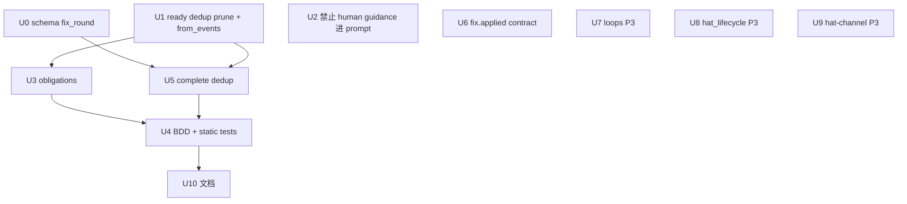

# fix: ce-executor-serial perky-maple 编排缺口(fix→re-review / executor 探针 / dedup / contracts)

## Summary

修复 `ce-executor-serial` 在 perky-maple run 中暴露的**编排层缺口**:fix 后无法合法 re-review(policy dedup 过严)、executor 在 human guidance 注入后盲试 emit(135 次 recovery 噪声)、fixer `commit_count` 与 git 时序错位、review-coordinator 结构性允许 complete 捷径、以及 hat_lifecycle / hat-channel 可观测性债务。

**架构纠正(经对抗性审查确认)**:诊断报告 P1-1「给 plan-gate 加 `fix.applied` / `review.failed` triggers」与 KTD3(`docs/achieved/plan/2026-06-02-004-fix-ce-executor-plan-gate-plan.md`)矛盾,且 perky-maple 时间线证明 loop **从未到达 `review.passed`**——plan-gate 无合法 dispatch 机会。卡死根因是 **re-review dedup**,不是 plan-gate trigger 缺口。**禁止**同时做 plan-gate trigger fix + dedup prune(会跳过 re-review 直接推进)。

U1 scaffold 代码产出(`32555b75` + `5ded762e`)已落盘;本计划只修 orchestration,不重做 U1 业务。

## Adversarial Review Summary (2026-06-18)

对抗性审查结论:**KTD1 正确**;原计划 U1/U3/U5/U6 存在 CRITICAL 实现假设错误,已在本修订版修正。

| 级别 | 原问题 | 修订 |
|---|---|---|
| **CRITICAL** | U1 误提 `loop_state.rs` prune(lifetime set 不在此) | 仅改 `PolicyRuntimeState` + `from_events` replay |
| **CRITICAL** | `from_events` replay 只 insert 不 prune,loop 重启后仍卡 | U1 必须同步改 `from_events` |
| **CRITICAL** | U3 `conditional_must_emit` 在 `fix.applied` 上**允许** `review.dimensions.complete`(L777-785) | U3 改 obligations,非仅 instructions |
| **CRITICAL** | U5 dedup key 用 `fix_round` 但 schema 无该字段 | U0 schema 先加 `fix_round` |
| **CRITICAL** | U6 虚构 `require_git_change.mode: strict` | 改为 `commit_only` + payload 校验 |
| **HIGH** | R2「噪声归零」不可验证 | **已修订 R2**:验收改为 prompt 不含 guidance + 无探针模式 |
| **HIGH** | 原 U2 仅 instructions 妥协,agent 仍看见 guidance | **已修订 U2**:`suppress_human_guidance` 运行时屏蔽,删除 U2b |
| **HIGH** | U5 与 U1 耦合但未声明依赖 | sequencing 补 U1→U5 |
| **HIGH** | serial preset 无 plan-gate 负向测试 | U4 增 `test_ce_executor_serial_plan_gate_must_not_listen_to_fix_applied` |
| **MEDIUM** | U7 scope creep | 降为 P3,不阻塞 LOOP_COMPLETE |
| **MEDIUM** | BDD 参考场景未 assert `work.ready` | U4 显式断言双发 |

## Problem Frame

### 现象(perky-maple,2026-06-18)

| 阶段 | 现象 | 报告 ID |
|---|---|---|
| executor 探针 | human guidance 后 135 次 policy 拒,~20min 浪费 | P1-2 |
| 首轮 review | 4 维走完 → `review.failed` → `fix.applied` | 正常 |
| fix 后卡死 | `review.dimension.ready` dedup 拒(2×) → HARD GATE spiral → 用户 abort | P1-3, P2-4, P2-5 |
| plan 未推进 | 无 `queue.advance` / `LOOP_COMPLETE` | **表象**;根因是未产生 `review.passed`(非 plan-gate 缺 trigger) |
| commit 错位 | `fix.applied` 报 `commit_count=0`,git `5ded762e` ~25min 后落盘 | P2-3 |
| 重复 emit | 5× `review.dimensions.complete`,2× maintainability `done` | P2-1, P2-2 |
| 运维 | abort 后 `loops.json` stale | P2-6 |
| 信息 | hat_lifecycle WARN; hat-channel 0 bytes | 信息-1, 信息-2 |

### 根因分层(修订)

1. **P1-3(policy)**: `review.dimension.ready` dedup key=`{plan}::{step}::{task}::{dim}` 不含 `fix_round`;`fix.applied` accept 时未 prune `PolicyRuntimeState.review_dimension_ready_seen_keys`;`from_events` replay 亦不 prune。
2. **P1-2(机制)**: `human.guidance` 自由文本被注入**所有 hat** 的 prompt(scratchpad `### HUMAN GUIDANCE` + `## ROBOT GUIDANCE`);executor 收到后盲试 emit。**结论:ce-executor-serial 不要 human guidance 进 prompt,不是加 instructions 教 agent 忍**。
3. **P2-3(contract)**: `fix.applied` 不在 `execution_contracts.rules`;允许 `commit_count=0` 与 uncommitted diff 并存。
4. **P2-1/2(structural)**: `review-coordinator` obligations 在 `fix.applied` 上允许 `review.dimensions.complete` 捷径(`ce-executor-serial.yml:777-785`);agent 误用导致第 5 次 complete。
5. **P1-1 误判(报告)**: plan-gate 按 KTD3 **故意**不监听 `fix.applied`;perky-maple 需 U1+U3 恢复 re-review→`review.passed`→plan-gate 路径。

### 不在范围

- 不重跑 plan 003 U1 scaffold 业务
- 不改 isolated 1-per-turn 预算
- **不**给 plan-gate 加 `fix.applied` / `review.failed` triggers
- **ce-executor-serial 禁止 human guidance 进入 agent prompt**(U2);非「教 agent 忍 guidance」
- 不 merge worktree 回 main
- U7/U9 不阻塞 release(见各 U 优先级)

## Requirements

### R1. fix→re-review 链路可走通

`fix.applied`(fix_round≥1) 后,review-coordinator 可合法重发 `review.dimension.ready`,走完 4 维后 `review.passed` 唤醒 plan-gate。

### R2. ce-executor-serial 不消费 human guidance

`ce-executor-serial` 下**任意 hat** 的 prompt 不得含 `### HUMAN GUIDANCE` 块或 `## ROBOT GUIDANCE` 段(含 executor)。TUI/Telegram 仍可 emit `human.guidance` 写 scratchpad/事件备查,但**不得**经 `prepend_scratchpad` / `robot_guidance` 注入本轮 agent。

验收:replay perky-maple 04:54 注入后,executor 下一轮 prompt 快照无 guidance 文本 → 无 6×22 探针拒模式。

### R3. fix.applied 与 git 一致

`fix.applied` 须 `commit_count≥1` **且** `require_git_change.mode: commit_only` 通过;否则 RejectWithResume + 可读 hint。

### R4. 重复 complete 可预测拒绝

同 `(plan,step,task,fix_round)` 第二次 `review.dimensions.complete` → policy RejectWithResume(非 silent extra-business drop)。

### R5. preset 拓扑与 KTD3 一致

- plan-gate **不**监听 `fix.applied`/`review.failed`
- `fix.applied` obligations **仅**允许 `review.dimension.ready`(禁止 complete 捷径)
- executor 保留 `## ISOLATED MODE HARD RULES`(emit 白名单 SSOT;与 U2 guidance 屏蔽独立)

### R6. BDD + 静态测试回归

新增 serial fix→re-review 场景;`ce_executor_serial_review` happy path 仍绿;新增 serial plan-gate 负向断言。

### R7. 可观测性(P3,非阻塞)

hat_lifecycle WARN 上下文;hat-channel 路由或 documented limitation。

## Key Technical Decisions

### KTD1. 否决 plan-gate trigger fix;修 dedup prune(对抗性审查确认)

**选择**: `fix.applied` policy-accept 时 prune `PolicyRuntimeState.review_dimension_ready_seen_keys` 匹配 `{plan}::{step}::{task}::` 前缀;**同步**改 `PolicyRuntimeState::from_events` 遇 `fix.applied` 执行同等 prune。

**理由**: perky-maple 事件流 06:15 fix.applied → 06:19/06:25 ready 被拒 → 从未 review.passed;加 plan-gate trigger 会违反 KTD3 并可能跳过 re-review。

**防御**: 新增 `test_ce_executor_serial_plan_gate_must_not_listen_to_fix_applied`(现有负向断言在 isolated/wave,serial 需独立覆盖)。

**不选**: dedup key 加 `fix_round` 后缀(blast radius 大);plan-gate 听 `fix.applied`(架构回退)。

### KTD2. ce-executor-serial **禁止** human guidance 进 prompt(不是教 agent 忍)

**产品决定**:perky-maple 证明 free-text guidance 对 emit 契约型 hat 有害;**不在 serial preset 里保留「收到 guidance 后仍正常 emit」这条路径**。

**选择**:
1. `presets/en/ce-executor-serial.yml` 增加 `event_loop.suppress_human_guidance: true`(或等价 hat 级 denylist,默认 **全部 hats**)。
2. `event_loop/mod.rs` 在 `update_robot_guidance` / `apply_robot_guidance` / `prepend_scratchpad` 三处:若 suppress 生效,**跳过** guidance 注入(复用现有 `filter_human_guidance_blocks`,模式同 `coordinator_bootstrap_gate_closed`)。
3. `progress-steward` 已不订阅 `human.guidance`(U4 2026-06-17-003) — 保持一致。

**不选**:
- ❌ 仅在 executor.instructions 写「guidance 不改变 emit 契约」(agent 仍会看到 guidance 并误读)
- ❌ 条件性 U2b「smoke 失败再过滤」(必须默认关闭,非 opt-in)

**保留**:全局 `human.guidance` topic + scratchpad 持久化可留作审计;与「不进 prompt」不矛盾。

### KTD3. complete dedup 前必须先有 schema `fix_round`

在 `presets/schemas/ce-executor-serial.yml` 为 `review.dimensions.complete` 加 `fix_round` 必填;coordinator emit 时携带当前 fix_round;dedup key=`{plan}::{step}::{task}::{fix_round}`。

fix.applied prune 时清除该 step/task 下所有 fix_round 的 complete keys(或仅当前 fix_round,实现时二选一并写测试)。

### KTD4. `fix.applied` contract 用 `commit_only`,非虚构 `strict`

```yaml
fix.applied:
  require_payload_fields: [plan_name, task_id, task_key, step, fix_round, applied_count, failed_count, commit_count, changed_lines]
  require_git_change:
    mode: commit_only
```

顺带修 `execution_contract.rs` 硬编码 `work.done` 错误文案为动态 `topic`(U6 范围)。

`diff_or_commit` **不够**:perky-maple 有 uncommitted diff 但 payload 谎报 `commit_count=0`。

### KTD5. 测试入口强制 nextest

最终 `./scripts/run-tests.sh`。

## Implementation Units

### U0. schema:`review.dimensions.complete` 增加 `fix_round`

- **Goal**: 为 U5 dedup 提供 SSOT 字段
- **Requirements**: R4, R5
- **Dependencies**: 无(阻塞 U5)
- **Files**:
  - `presets/schemas/ce-executor-serial.yml`
  - `presets/en/ce-executor-serial.yml`(inline schema 过渡层,若有重复则清)
- **Approach**: `review.dimensions.complete.required_fields` 加 `fix_round`;coordinator instructions 要求 complete payload 含当前 fix_round。
- **Verification**: `cargo nextest run -p ralph-cli --bin ralph -- schema`

### U1. `fix.applied` prune `review_dimension_ready` + `from_events` 对称

- **Goal**: fix_round≥1 后可重发 `review.dimension.ready`
- **Requirements**: R1, R5
- **Dependencies**: 无
- **Files**:
  - `crates/ralph-core/src/event_loop/mod.rs`(`fix.applied` accept arm ~7559)
  - `crates/ralph-core/src/event_policy.rs`(`prune_review_dimension_ready_bucket` helper + `from_events` ~331-355)
- **Approach**:
  1. 新增 `prune_review_dimension_ready_bucket(state, plan, step, task_id)` — 从 `review_dimension_ready_seen_keys` 移除前缀 `{plan}::{step}::{task_id}::` 的所有 key。
  2. 在 `mod.rs` `fix.applied` accept 分支调用(与 `prune_work_done_bucket` 并列)。
  3. **`from_events`**: replay 到 `fix.applied` 时执行同等 prune(防 loop 重启/rehydrate 复现卡死)。
  4. **不修改 `LoopState`** — dedup set 仅存在于 `PolicyRuntimeState`。
  5. **对称性补洞(可选同 U1)**: `prune_work_done_bucket` 时同步 prune `policy_state.work_done_seen_keys` 同前缀(现有缺口,加回归测试)。
- **Test scenarios**(新建):
  - `review_dimension_ready_dedup_rejects_second_emit` 仍绿
  - **新建** `fix_applied_prunes_dimension_ready_dedup` — accept fix.applied 后同 dim ready accept
  - **新建** `from_events_fix_applied_prunes_dimension_ready_replay`
  - 用真实 fix.applied payload 形状(`step` 字段,非 `completed_step`)
- **Verification**:
  ```bash
  cargo nextest run -p ralph-core -- review_dimension_ready
  cargo nextest run -p ralph-core -- fix_applied_prunes
  ```

### U2. ce-executor-serial 禁止 human guidance 注入 prompt

- **Goal**: serial preset 下 agent **看不到** human guidance,从根源消除 perky-maple 式探针
- **Requirements**: R2, R5
- **Dependencies**: 无
- **Files**:
  - `presets/en/ce-executor-serial.yml`(`event_loop.suppress_human_guidance: true` 或 hat denylist)
  - `presets/zh/ce-executor-serial-zh.yml`
  - `presets/schemas/ce-executor-serial.yml`(若 schema 校验 event_loop 字段)
  - `crates/ralph-core/src/config/loop_config.rs`(解析新字段)
  - `crates/ralph-core/src/event_loop/mod.rs`(`build_prompt` / `prepend_scratchpad` / `update_robot_guidance` 路径)
  - `crates/ralph-core/src/event_loop/mod.rs` tests(新建 suppress 用例)
- **Approach**:
  1. preset 声明 `suppress_human_guidance: true`(serial 全 hat 生效;与 progress-steward 不消费 guidance 一致)。
  2. `mod.rs`:当 suppress 时 — 不调用 `update_robot_guidance`/`apply_robot_guidance`;`prepend_scratchpad` 对活跃 hat 走 `filter_human_guidance_blocks`;isolated 路径 `collect_robot_guidance` 返回空。
  3. **仍允许** TUI/Telegram 写 `human.guidance` 到 events.jsonl + scratchpad(审计备查),只是**不进本轮 prompt**。
  4. executor 保留 `## ISOLATED MODE HARD RULES`(白名单/plan_name/aggregate_timeout) — 这是 emit 契约 SSOT,**不是** guidance 妥协方案。
- **Test scenarios**:
  - **新建** `suppress_human_guidance_strips_scratchpad_and_robot_guidance` — 注入 guidance 后 executor prompt 不含 `Focus on error handling`
  - **新建** `suppress_human_guidance_does_not_drop_non_guidance_scratchpad` — `## NOTES` 等内容仍注入
  - perky-maple replay:04:54 guidance 后 executor 轮次 recovery 无批量探针拒
- **Verification**:
  ```bash
  cargo nextest run -p ralph-core -- suppress_human_guidance
  cargo nextest run -p ralph-cli --bin ralph -- preset
  ```

### U3. review-coordinator:obligations 禁 complete 捷径 + instructions

- **Goal**: 消除 fix 后第 5 次裸 `review.dimensions.complete`
- **Requirements**: R1, R5
- **Dependencies**: U1
- **Files**:
  - `presets/en/ce-executor-serial.yml`(`review-coordinator.obligations` L777-785, instructions)
  - `presets/zh/ce-executor-serial-zh.yml`
- **Approach**:
  1. **`fix.applied` 的 `must_emit_any_of` 改为仅 `["review.dimension.ready"]`** — 删除 `review.dimensions.complete` 选项(结构性修复,非仅 prose)。
  2. `work.done` / `review.dimension.done` 路径可保留 complete(空 diff fast path 等既有语义)。
  3. instructions:fix.applied → 重置 review-sequence → 从 correctness 发 ready。
  4. dimension-reviewer:「每 activation 只 emit 一次 `review.dimension.done`」。
- **Test scenarios**:
  - **新建** `test_ce_executor_serial_review_coordinator_fix_applied_must_not_allow_complete`
- **Verification**: `cargo nextest run -p ralph-cli --bin ralph -- serial_review_coordinator`

### U4. BDD + 静态测试:fix→re-review→plan-gate

- **Goal**: 端到端证明 fix 后链路闭环
- **Requirements**: R1, R6
- **Dependencies**: U0, U1, U3, U5
- **Files**:
  - `crates/ralph-core/tests/scenarios/ce_executor_serial_fix_applied_rereview.yml`(新建,`max_iterations: ~30`)
  - `crates/ralph-cli/src/presets.rs`(新建 serial plan-gate 负向测试)
- **Approach**:
  1. BDD 场景(桩事件,无 live agent):
     - 首轮: work.done → 4×(ready→done) → complete(fix_round=0) → review.failed → fix.applied(fix_round=1)
     - 次轮: 4×(ready→done) → complete(fix_round=1) → review.passed → **queue.advance + work.ready** 双发
  2. **必做 negative**: 无 U1 prune 时(独立 scenario 或 feature flag)ready dedup 拒 — 证明 U1 存在意义
  3. 拆分断言:单 step 末 → `plan.complete`;多 step → `queue.advance`+`work.ready`(勿混用参考场景 L177-188)
  4. 静态:`test_ce_executor_serial_plan_gate_must_not_listen_to_fix_applied`
- **Verification**:
  ```bash
  cargo nextest run -p ralph-core --test scenarios ce_executor_serial_fix_applied
  cargo nextest run -p ralph-cli --bin ralph -- serial_plan_gate
  ```

### U5. `review.dimensions.complete` policy dedup

- **Goal**: 重复 complete → RejectWithResume;消除 drift 误报
- **Requirements**: R4
- **Dependencies**: **U0, U1**
- **Files**:
  - `crates/ralph-core/src/event_policy.rs`
- **Approach**:
  1. 新增 `review_dimensions_complete_seen_keys`。
  2. key=`{plan}::{step}::{task}::{fix_round}`(fix_round 来自 payload,缺省 0)。
  3. 同 fix_round 第二次 complete → RejectWithResume(带 recovery hint,非 silent drop)。
  4. U1 prune 时清除同 step/task 的 complete keys(与 ready prune 同触发点)。
- **Test scenarios**:
  - 同 fix_round 第二次 complete 拒
  - fix.applied prune 后 fix_round=1 的 complete accept
  - **不**期望「同 fix_round fix 后再 complete」— fix 后应先走 ready 序列
- **Verification**: `cargo nextest run -p ralph-core -- dimensions_complete_dedup`

### U6. `fix.applied` execution contract

- **Goal**: 挡住 `commit_count=0` 谎报
- **Requirements**: R3
- **Dependencies**: 无
- **Files**:
  - `presets/en/ce-executor-serial.yml`(`execution_contracts.rules.fix.applied`)
  - `presets/en/ce-executor-serial.yml`(`fixer.instructions`)
  - `crates/ralph-core/src/execution_contract.rs`(动态化错误文案 ~299,618)
- **Approach**:
  1. 按 KTD4 加 `fix.applied` rule(`commit_only`)。
  2. fixer instructions:先 `git commit`,再 emit;`commit_count` 填真实值。
  3. 修 contract 错误 message 用 `event.topic` 替代硬编码 `work.done`。
- **Test scenarios**:
  - 无新 commit 时 fix.applied reject
  - commit 后 accept
- **Verification**: `cargo nextest run -p ralph-core -- execution_contract`

### U7. abort 后 loops.json 清理 — **P3,不阻塞 release**

- **Goal**: 减少 stale PID 误导
- **Requirements**: —
- **Dependencies**: 无
- **Files**:
  - `crates/ralph-cli/src/loop_runner/runner.rs`(RpcDispatcher Abort / SIGTERM 路径)
  - `crates/ralph-cli/src/loop_runner/mod.rs`(`LoopRegistry`)
- **Approach**:
  1. 先定位 Abort 路径是否调用 `LoopRegistry::unregister`。
  2. 若缺失,abort 时移除 `loops.json` 条目。
  3. 短期运维:`ralph loops clean` 仍文档化。
- **Verification**: 新建 integration test `loop_abort_clears_registry` 或 defer

### U8. hat_lifecycle WARN 可观测性 — **P3**

- **Files**: `crates/ralph-core/src/hat_lifecycle.rs`
- **Approach**: WARN 路径加 `activation_key`, `hat_id`, debug 上下文;不改状态机除非发现真 bug。

### U9. hat-channel — **P3,可降级文档**

- **Files**: `crates/ralph-cli/src/loop_runner/hat_channel.rs`
- **Approach**: 先确认 perky-maple 是否 `prepare_hat_channel` 被调用;再决定修路由或记 known limitation。

### U10. 文档与报告纠偏

- **Dependencies**: U1–U6 完成后
- **Files**:
  - `docs/report/2026-06-18-003-perky-maple-loop-link-diagnosis.md`
  - `docs/solutions/integration-issues/ce-executor-serial-fix-applied-rereview-dedup-2026-06-18.md`(新建)
- **Approach**:
  1. 报告 §6 P1-1 标注「KTD1 否决 + 根因实为 P1-3」。
  2. §2.2 步 30 改为「缺失 review.passed(因 re-review dedup)」而非「plan-gate 未 dispatch」。
  3. §7「无 preset 编排 bug」与 P1-1 矛盾 — 改为「无 ralph 基座 bug;有 preset obligations + policy 缺口」。
  4. learning 加反模式:「勿给 plan-gate 加 fix.applied」。
  5. FAQ:merry-lotus/noble-peacock 报告 P1-1 同为误判。

## Sequencing



**BLOCKING 关键路径**: U0 → U1 → U3 → U5 → U4 → `./scripts/run-tests.sh`

U2/U6 可与 U1 并行。U7/U8/U9 不纳入 LOOP_COMPLETE 门禁。

## Acceptance Examples

| ID | Given | When | Then |
|---|---|---|---|
| AE1 | fix.applied(fix_round=1) 已 accept | review-coordinator 发 correctness ready | policy accept,非 duplicate |
| AE2 | TUI 注入 human guidance + serial preset suppress | 下一轮 executor prompt build | prompt **不含** guidance 文本;无 6×22 探针拒 |
| AE3 | fixer 未 commit | emit fix.applied | contract reject;hint 含 commit |
| AE4 | 同 fix_round 第二次 dimensions.complete | CLI emit | RejectWithResume + recovery hint |
| AE5 | re-review 后 review.passed | plan-gate dispatch | queue.advance **且** work.ready(双发) |
| AE6 | fix.applied trigger | plan-gate | **不** dispatch(plan-gate 负向测试) |
| AE7 | from_events replay 含 fix.applied | 后续 ready emit | accept(非 replay 卡死) |

## Risks

| 风险 | 缓解 |
|---|---|
| prune 过宽 | 仅绑 `fix.applied` accept + from_events;前缀精确到 task_id |
| obligations 改坏 empty-diff fast path | `work.done` 路径仍允许 complete;仅 `fix.applied` 收窄 |
| commit_only 过严 | fixer instructions + 清晰 reject hint |
| BDD 过长 | 桩事件;max_iterations ~30 |

## Verification Plan

### 开发中

```bash
cargo nextest run -p ralph-core -- review_dimension_ready
cargo nextest run -p ralph-core -- fix_applied_prunes
cargo nextest run -p ralph-core -- dimensions_complete_dedup
cargo nextest run -p ralph-core -- execution_contract
cargo nextest run -p ralph-cli --bin ralph -- preset
cargo nextest run -p ralph-core --test scenarios ce_executor_serial_fix_applied
```

### 最终

```bash
./scripts/run-tests.sh
```

### 手工 smoke(可选)

1. `ralph loops clean`
2. perky-maple worktree 重跑 step-01→02,验证 fix 后 re-review→queue.advance
3. TUI 注入 human guidance → 确认 executor prompt 无 guidance 且 recovery 无探针风暴

## Traceability Matrix (修订)

| 报告项 | 计划 U | 处理方式 |
|---|---|---|
| P1-1 plan-gate triggers | U4+U10 | **KTD1 否决**;加负向测试 AE6 |
| P1-2 executor 探针(human guidance) | U2 | **禁止 guidance 进 serial prompt**;非 instructions 妥协 |
| P1-3 dedup 阻断 re-review | U1 | prune + from_events |
| P2-1 重复 complete | U0+U5+U3 | schema + dedup + obligations |
| P2-2 重复 done | U3 | instructions |
| P2-3 commit_count=0 | U6 | commit_only contract |
| P2-4 duplicate ready | U1+U3 | prune + obligations |
| P2-5 HARD GATE spiral | U1–U5 | 组合 |
| P2-6 loops.json stale | U7 | P3 |
| 信息-1/2 | U8/U9 | P3 |
