# refactor: Remove ralph-telegram crate and RobotService / human.interact path (keep human.guidance)

## Summary

Delete the `ralph-telegram` workspace crate and every consumer that exists solely to drive it: the `Bot` and `tools interact` CLI subcommands, the `RObot` config block, the `RobotService` / `DaemonAdapter` / `CheckinContext` / `StartLoopFn` traits, the `human.interact` and `human.response` events (and the `is_trusted_human_response` / `TRUSTED_HUMAN_RESPONSE_SOURCE` machinery) plus the pre/post `human.interact` hook stages, the `TelegramTokenCheck` preflight, the `TelegramSendError` diagnostic variant, the zsh completions, the `ralph.bot.yml` example preset, and the relevant user-guide pages. The `.ralph/stop-requested` and `.ralph/restart-requested` signal-file mechanism is preserved because `ralph loops stop` writes the same files. The `human.guidance` event and the `task.resume` recovery channel are **not** removed: `human.guidance` is a built-in event produced by the runtime diagnosis engine (`drift/engine.rs::check_final_human_guidance`) and consumed by the recovery responder, totally independent of Telegram; deleting it would break drift recovery, the A3 3-strike escalation, the correction module, and ~25 unit tests + 5 BDD scenarios. After this lands, the workspace ships 8 crates (was 9), the doctest run is one crate shorter, and no runtime path asks for human-in-the-loop response (but internal recovery and operator guidance channels still work).

## Problem Frame

`ralph-telegram` was the single human-in-the-loop channel Ralph ever shipped; it owns the `human.interact` / `human.response` event family and the `RobotService` / `DaemonAdapter` abstractions. The product direction is to retire human-in-the-loop entirely (no replacement channel planned), so the entire telegram-specific surface becomes dead weight. Because the crate is wired into `Cargo.toml`, `ralph-cli`, `ralph-core` config / preflight / diagnostics, the zsh plugin, several Cursor rules, and ~12 user-facing docs, deleting the folder is the easy part; the regression surface is the surrounding plumbing. This plan enumerates every consumer so the deletion lands in a single PR with no follow-up cleanups and no behavioral drift, while explicitly **preserving `human.guidance` and `task.resume` because they are the runtime diagnosis / recovery channel, not a human-in-the-loop channel**.

## Requirements

### Compile & workspace

- R1. `crates/ralph-telegram/` directory is removed; no file under it remains in the working tree.
- R2. `Cargo.toml` no longer lists `ralph-telegram` as a workspace member, no longer declares the `ralph-telegram` workspace dependency, and no longer declares the `teloxide` workspace dependency. `Cargo.lock` regenerates without `ralph-telegram`, `teloxide`, `teloxide-core`, or `teloxide-macros`.
- R3. `crates/ralph-cli/Cargo.toml` no longer depends on `ralph-telegram`. `cargo check --workspace` succeeds with 8 crates.

### CLI surface

- R4. `ralph bot` and its five subcommands (`onboard`, `status`, `test`, `token`, `daemon`) are removed from clap and from `crates/ralph-cli/src/main.rs` and `crates/ralph-cli/src/bot.rs`.
- R5. `ralph tools interact` subcommand is removed from `crates/ralph-cli/src/tools.rs` and `crates/ralph-cli/src/interact.rs` is deleted.
- R6. `ralph --help`, `ralph run --help`, and `ralph tools --help` no longer mention Telegram, the bot, or `tools interact`.

### ralph-core configuration & preflight

- R7. The `RObot` / `RobotConfig` block in `crates/ralph-core/src/config/` is removed: `config/robot.rs` is deleted, and the `robot` field on `RalphConfig` (`config/mod.rs:225-227`) is removed. The `telegram` sub-block and its `TelegramBotConfig` type are removed with it.
- R8. `preflight::TelegramTokenCheck` and the raw-reqwest `telegram_get_me` helper are removed from `crates/ralph-core/src/preflight.rs`; the default check list no longer includes `telegram` and the `preflight.skip` example no longer lists `telegram` alongside `git`. Existing user `ralph.yml` files that still carry `features.preflight.skip: ["telegram", ...]` parse with an `unknown check` warning rather than failing (the unknown-name path is the existing behaviour for any unknown skip entry), so user configs are not breaking.
- R9. `DiagnosticError::TelegramSendError` is removed from `crates/ralph-core/src/diagnostics/errors.rs`; no caller remains.

### ralph-core event loop & origin guard

- R10. `ralph-proto::RobotService` and `ralph-proto::DaemonAdapter` traits plus `CheckinContext` / `StartLoopFn` are removed from `ralph-proto/src/robot.rs` and `ralph-proto/src/daemon.rs`; their `pub use` re-exports are removed from `ralph-proto/src/lib.rs`.
- R11. The `RobotService` injection point in the event loop is removed: `set_robot_service` / `robot_service: Option<Box<dyn RobotService>>` / `human_interact_context: Option<Value>` / `pending_human_interact_context_in_jsonl` / `parse_human_interact_context` / `build_checkin_context` in `crates/ralph-core/src/event_loop/mod.rs` are all removed. The `human.interact` blocking loop at `event_loop/mod.rs:8615-8798` is removed. The `human_interact_context` field on `ProcessedEvents` (consumed by `loop_runner/runner.rs:3413-3440,3954-3973` and `loop_runner/late_events.rs:37,43`) is removed; the `late_events` path no longer keys on this field. The `inject_robot_skill` method (gated by `config.robot.enabled`) is removed. The check-in dispatch path at `event_loop/mod.rs:5783-5795` is removed.
- R12. `validate_human_interact_payload` / `HumanInteractValidation` in `crates/ralph-core/src/event_origin.rs` are removed, and `TRUSTED_HUMAN_RESPONSE_SOURCE` is removed. The `human.interact` entry is removed from `RALPH_CONTROL_TOPICS` and from `is_orchestrator_control_topic`. The `human.guidance` entry is **preserved** (the runtime diagnosis engine's recovery channel — see KTD-2). The `human.response` entry is also **removed** from `RALPH_CONTROL_TOPICS` and from `is_orchestrator_control_topic`: its only publisher in this codebase was the deleted `ralph-telegram/src/handler.rs:66` and the deleted `event_loop/mod.rs:8742` blocking-loop write, and its only consumer is the removed `is_trusted_human_response` helper plus the `event_policy::check_completion_honored` test that becomes vacuous. The origin-guard `is_trusted_human_response` helper is removed. The `event_loop::is_restart_request_event` at `event_loop/mod.rs:6182-6184` (which matches `human.response | user.prompt`) is also deleted because both topics have no remaining publisher after R4-R5; the restart-signal path at `event_loop/mod.rs:1492-1504` is file-based and independent, so the deletion is safe (R15).
- R13. The pre-hook and post-hook stages `PreHumanInteract` and `PostHumanInteract` are removed from `crates/ralph-core/src/config/hooks.rs`; the supported-phase-events list in `crates/ralph-core/src/config/error.rs:50` no longer mentions `pre.human.interact` / `post.human.interact`. Other hook stages are untouched.
- R14. `loop_state::is_system_topic` continues to contain `human.guidance` (preserved recovery channel); both `human.interact` and `human.response` are removed from the list (R12). `last_checkin_at` is removed from `LoopState` because the only consumer was `RobotService` check-ins. The `event_loop/mod.rs:3151-3154, 3260-3263, 3474` `partition(|e| e.topic.as_str() == "human.guidance")` calls are **preserved** (they route the recovery channel to the late-event path); the equivalent `"human.response"` arm in those partition closures (if any) is removed.
- R15. `.ralph/stop-requested` and `.ralph/restart-requested` signal-file checks remain in `event_loop/mod.rs:1492-1504` so `ralph loops stop` keeps working; the doc comment that names Telegram as the source is rewritten to say "external CLI".

### Test fixtures

- R16. `crates/ralph-core/src/event_loop/tests/robot_skill.rs` is deleted; the `_: Option<&ralph_proto::CheckinContext>` parameter at `event_loop/tests/common/mod.rs:196, 224` is dropped to `()`.
- R17. `crates/ralph-core/src/event_loop/tests/human_timeout.rs` is deleted; its `human.interact` JSONL fixtures have no remaining consumer.
- R18. `ralph.bot.yml` at the repository root is deleted; it is the only example preset that publishes `human.interact` / `human.response`.

### Release & CI

- R19. `.github/workflows/release.yml` removes the `publish_crate ralph-telegram` step and rewrites the publish-order comment to `ralph-proto -> ralph-core -> ralph-api -> ralph-adapters, ralph-tui -> ralph-cli`.

### Docs, rules, completions, lessons

- R20. `docs/guide/telegram.md` is deleted.
- R21. `.cursor/rules/feature-flags.mdc` `globs:` no longer contains `**/crates/ralph-telegram/**/*.rs`; the rule's `description:` and body rewrite Telegram-specific guidance to "human-in-the-loop is retired" wording (or the file is renamed/replaced if it has no remaining scope).
- R22. `.cursor/rules/architecture-modules.mdc` drops the `ralph-telegram` crate map entry and the `.ralph/telegram-state.json` mention.
- R23. `scripts/ralph-zsh-plugin.zsh` removes the `bot` entry from the top-level command array, the `interact` entry from `_RALPH_TOOLS_COMMANDS`, and the entire `_RALPH_BOT_CMDS` array; the description strings that mention Telegram are replaced with generic placeholders or removed.
- R24. `docs/api/security.md` removes the `TelegramService::bot_token_masked` and `escape_html` examples; the `docs/reference/troubleshooting.md` `RObot.telegram.bot_token` section is removed; `docs/guide/{cli-reference,configuration,project-usage,index,advanced/index,advanced/testing}.md` lose every Telegram reference. **The `RObot` "human-in-the-loop" section in `docs/guide/project-usage.md:509-519` is rewritten to point readers at the runtime diagnosis engine's `human.guidance` / `task.resume` channel**, because the recovery guidance story is still true and users with stale links must not land on a 404.
- R25. `CLAUDE.md` and `AGENTS.md` keep their content identical: the parallel/serial speed-table "其他 7 个包" wording becomes "其他 6 个包", the crate map drops `ralph-telegram`, and the `.ralph/telegram-state.json` "do not hand-edit" rule is removed. The `human.guidance` / `task.resume` mention in the runtime contract is preserved.
- R26. The data files `crates/ralph-core/data/ralph-tools.md`, `crates/ralph-core/data/ralph-tools-cmdref.md`, and `crates/ralph-core/data/robot-interaction-skill.md` lose every Telegram reference; the `tools interact` and `bot` command rows in the ralph-tools tables are removed. `robot-interaction-skill.md` is deleted entirely (its content is Telegram-flavored and now dead). The `human.guidance` mention in the runtime contract doc comment is preserved.
- R27. `docs/solutions/test-failures/reqwest-no-proxy-loopback-test-failures.md` removes `ralph-telegram` from its frontmatter `related_components` and from the Related Issues备查清单. `docs/solutions/integration-issues/ce-executor-serial-precheck-recovery-alignment-2026-06-17.md` rewrites the "Telegram RObot" wording to "human/operator emit" since the lesson still applies. The lesson's logic about `task.resume` replacing `human.guidance` for automated recovery is unchanged.
- R28. `docs/achieved/`, `docs/handoff/`, `docs/brainstorms/`, `docs/plans/`, `docs/superpowers/`, `specs/`, and `docs/06-analysis/` files that mention Telegram remain unchanged (they are archived historical artifacts and rewriting them would corrupt git blame). The list of those files is captured in the Sources & Research section of this plan so reviewers can decide case-by-case whether to add a tombstone note.

### Verification

- R29. `cargo nextest run -p ralph-proto -p ralph-core -p ralph-adapters -p ralph-tui -p ralph-cli -p ralph-api -p ralph-bench -p ralph-e2e` is green; `cargo nextest run -p ralph-cli --bin ralph --` (serial profile, per HARD RULE 1 in `CLAUDE.md` because `loop_runner/tests.rs` touches process-global Mutexes) is green; `cargo test --workspace --exclude ralph-e2e --doc` is green.
- R30. `cargo clippy --workspace --all-targets -- -D warnings` is green; `cargo fmt --all --check` is clean.
- R31. `cargo publish --dry-run -p ralph-cli` succeeds; `cargo metadata --no-deps --format-version 1 | jq '.workspace_members | length'` reports 8.
- R32. `rg -n 'telegram|Telegram|teloxide' --hidden` in the working tree matches only: (a) `docs/achieved/...` and other archived paths, (b) `Cargo.lock` until the next `cargo build` regenerates it, and (c) the explicit exclusion list in `.gitignore` if any. No source file, doc, rule, or completion contains a live reference. `rg -n 'human\.guidance' crates/` continues to match the drift engine, correction module, hatless_ralph guidance injection, and related tests — that channel is preserved. `rg -n 'human\.response' crates/` returns no live matches (both publisher and meaningful consumer are gone).
- R33. Targeted smoke: a `ralph run --mock` invocation in a scratch workspace writes no `human.interact` events to `events.jsonl` (asserted via `rg -c 'human\.interact' .ralph/events.jsonl` = 0) and the recovery path is preserved (a synthetic Warning that crosses the 3-strike threshold still publishes `human.guidance` to the bus, asserted via `rg -c '"topic":"human.guidance"' .ralph/events.jsonl` >= 1).
- R34. `rg -n 'ralph\.bot\.yml' .` returns no matches outside `docs/achieved/`. BDD scenarios under `crates/ralph-core/tests/scenarios/` are audited: `rg -n 'ralph\.bot\.yml' crates/ralph-core/tests/scenarios/` must report 0 (no scenario depends on the file).

## Key Technical Decisions

- **KTD-1. Delete the `RobotService` / `DaemonAdapter` traits instead of leaving them as abstract ports.** Leaving a trait with zero implementations forces every future contributor to decide whether to fill it or kill it; the project's direction is to retire human-in-the-loop, so keeping the trait is YAGNI. Cost: removes the only consumer of `CheckinContext` / `StartLoopFn`, which are also deleted.
- **KTD-2. Delete `human.interact` and `human.response`; preserve `human.guidance` and `task.resume`.** `human.interact` is exclusively produced by the `ralph.bot.yml` preset and consumed by the robot-service blocking loop; both are deleted. `human.response`'s only publishers in this codebase are the deleted `ralph-telegram/src/handler.rs:66` and the deleted `event_loop/mod.rs:8742` blocking-loop write, and its only meaningful consumer is the removed `is_trusted_human_response` helper plus the `event_loop::is_restart_request_event` restart-payload detector (whose `user.prompt` arm loses its companion `tools interact` command in R5, so the detector has no surviving match). Deleting `human.response` from the topic namespace is therefore safe. `human.guidance` is produced by **two unrelated sources**: the runtime diagnosis engine (`drift/engine.rs:check_final_human_guidance`, used by the A3 3-strike escalation) and the correction module (`correction/mod.rs:maybe_escalate_to_human_guidance`). It is consumed by the recovery responder, `hatless_ralph` guidance injection, and the progress-steward hat. Deleting it would break the recovery story that `2026-06-17-003` and `2026-06-18-001` plans carefully built up. `task.resume` is the recovery channel and is untouched. The restart-signal path at `event_loop/mod.rs:1492-1504` is file-based and independent of any `human.*` event, so the deletion of the `human.response | user.prompt` restart detector is safe (R15).
- **KTD-3. Preserve `.ralph/stop-requested` / `.ralph/restart-requested` signal-file mechanism.** `ralph loops stop` writes these files; removing the check would break the existing `ralph loops stop` flow. The mechanism is not Telegram-specific in the runtime path even though the original producer was the Telegram `/stop` slash command.
- **KTD-4. Delete the `ralph.bot.yml` example preset at the repository root.** It was the only sample that exercised `human.interact` / `human.response`; keeping it would require a non-trivial rewrite and the rewrite is out of scope for "delete the feature".
- **KTD-5. Archive references in `docs/achieved/`, `docs/handoff/`, `docs/brainstorms/`, `docs/plans/`, `docs/superpowers/`, `specs/`, `docs/06-analysis/`, `docs/solutions/`, and `docs/achieved/brainstorms/` are NOT rewritten in this PR.** They are historical artifacts. The Sources & Research section enumerates them so a follow-up cleanup PR can choose to add tombstone notes. Touching them in the same PR dilutes the diff and corrupts `git blame` for historical readers.
- **KTD-6. `.cursor/rules/feature-flags.mdc` is rewritten in this PR, not deferred.** The rule's `globs:` field references the deleted `crates/ralph-telegram/` path; a dangling glob silently breaks Cursor's rule loading. The default is to keep the file at its current path and rewrite the body to drop every Telegram/RObot reference (U10). The RObot section of the rule is deleted; the parallel-loops / waves / smoke / e2e / presets sections are preserved. Renaming the file to `workflow-patterns.mdc` is acceptable when the implementer wants to shrink the rule's scope; if renamed, `rg -n 'feature-flags' .cursor/ docs/` must be run to find and update any cross-references before the rename lands.
- **KTD-7. `ralph-core/src/event_loop/tests/human_timeout.rs` is deleted, not rewritten.** The file exists only to test the `human.interact` JSONL round-trip; once R11 removes the producer and the consumer, the fixture has no purpose.
- **KTD-8. `human_interact_context` field on `LoopState` and `ProcessedEvents` is deleted, not preserved.** It existed only to ferry the question/outcome metadata between the JSONL reader, the event loop blocking path, and the `loop_runner` late-event handler. With the blocking path gone, the field has no producer and no consumer; the only honest move is to delete it. This cascades into `loop_runner/runner.rs:3413-3440,3954-3973` and `loop_runner/late_events.rs:37,43` (the `processed.human_interact_context.is_some()` gates), but the late-event handler still works because it only needs to know whether the iteration had a human-interact event; with the producer gone, the gate is always false and the late-event path falls through cleanly.
- **KTD-9. `is_system_topic("human.guidance")` is kept on the `loop_state::is_system_topic` list; `is_system_topic("human.interact")` and `is_system_topic("human.response")` are removed.** `human.guidance` is the recovery channel and the partition logic at `event_loop/mod.rs:3151-3154, 3260-3263, 3474` (which uses this list to route human.* events to the late-event path) must continue to recognise it. `human.interact` and `human.response` are removed (R12, R14).
- **KTD-10. `RobotService`-tied user-config migration is left to the user.** A user with an existing `ralph.yml` that declares `RObot:` will see the field rejected as unknown on the next run. The `ralph bot onboard` wizard that wrote that field is also deleted, so users have no in-tree migration tool. The Documentation / Operational Notes section below calls this out so a follow-up PR can add a small migration helper if users complain; the deletion itself is not blocked on that.

## Implementation Units

### U1. Remove the `ralph-telegram` crate and its workspace wiring

- **Goal:** The `crates/ralph-telegram/` directory is gone; the workspace no longer compiles or links the crate; `Cargo.lock` regenerates without `teloxide*`.
- **Requirements:** R1, R2, R3.
- **Files:**
  - delete `crates/ralph-telegram/` (11 files: `Cargo.toml`, `README.md`, `src/lib.rs`, `src/bot.rs`, `src/service.rs`, `src/daemon.rs`, `src/handler.rs`, `src/state.rs`, `src/commands.rs`, `src/error.rs`, `src/loop_lock.rs`)
  - `Cargo.toml` (remove `crates/ralph-telegram` from `members`, remove the `ralph-telegram` workspace dependency, remove the `teloxide` workspace dependency, remove the `# Telegram bot framework` comment)
  - `crates/ralph-cli/Cargo.toml` (remove `ralph-telegram.workspace = true`)
- **Approach:** Land U1 and U2 in a single commit to keep `cargo check` green at every step.
- **Verification:** `cargo metadata --no-deps --format-version 1 | jq '.workspace_members'` shows 8 crates; `rg -n 'teloxide|ralph[-_]telegram' Cargo.toml` returns no matches; `rg -n 'telegram|Telegram' Cargo.toml | grep -v members | grep -v 'ralph-telegram =' | grep -v 'teloxide'` returns no matches (this audit also confirms `[workspace.metadata.dist]` does not reference telegram).
- **Test scenarios:**
  - happy path: `cargo build --workspace` succeeds; no `error[E0432]: unresolved import 'ralph_telegram'` errors.
  - edge: `rg -n 'ralph_telegram|teloxide' crates/` returns no matches before U2 lands; succeeds because the only consumers are in U2.

### U2. Delete the `Bot` and `tools interact` CLI subcommands

- **Goal:** The `ralph bot` and `ralph tools interact` subcommands are gone from clap and from the zsh completions; the helper modules that drove them are removed.
- **Requirements:** R4, R5, R6, R23.
- **Files:**
  - delete `crates/ralph-cli/src/bot.rs`
  - delete `crates/ralph-cli/src/interact.rs`
  - `crates/ralph-cli/src/main.rs` (remove the `Bot(bot::BotArgs)` arm at lines 159-160, remove `mod bot;` and `mod interact;` declarations)
  - `crates/ralph-cli/src/tools.rs` (remove the `Interact` subcommand definition at line 39 and the `Interact` arm in the dispatch match)
  - `scripts/ralph-zsh-plugin.zsh` (remove the `"bot:Manage Telegram bot setup and testing"` line at 115, the `"interact:Interact with human via Telegram"` line at 127, the entire `_RALPH_BOT_CMDS=...` block at 190-196)
  - `scripts/test_cli_doc_drift.py` (remove the "Send a non-blocking progress message via Telegram" assertion at line 184 or rewrite it as a no-op)
- **Approach:** Read each module before deleting to confirm no other crate imports it (`rg -n 'crate::bot::|crate::interact::|cli::bot::|cli::interact::'`); the only consumer is `main.rs` for `bot` and `tools.rs` for `interact`.
- **Verification:** `cargo run -p ralph-cli -- --help` shows no `bot` entry; `cargo run -p ralph-cli -- tools --help` shows no `interact` entry.
- **Test scenarios:**
  - happy path: `cargo run -p ralph-cli -- --help 2>&1 | grep -c '^  bot$'` is 0.
  - happy path: `cargo run -p ralph-cli -- tools --help 2>&1 | grep -c '^  interact$'` is 0.
  - edge: the `Bash completion installed via scripts/ralph-zsh-plugin.zsh` flow still loads; `compadd` errors out with no `bot`/`interact` group.

### U3. Strip `ralph-cli` robot / daemon wiring

- **Goal:** The `create_robot_service` function and the `set_robot_service` call site are removed; the `start_loop` and `runner` modules no longer mention Telegram.
- **Requirements:** R11 (caller side).
- **Files:**
  - `crates/ralph-cli/src/loop_runner/start_loop.rs` (remove the `create_robot_service` function at lines 112-153, remove the "Telegram" wording from the doc comment at lines 7-8 and 30-32, remove the now-unused `RalphConfig` import if no other consumer remains)
  - `crates/ralph-cli/src/loop_runner/runner.rs` (remove the `// Inject robot service (Telegram) for human-in-the-loop communication` comment at line 924, remove the `create_robot_service` call at line 929, and remove the `human_interact_context`-shaped data plumbing in the late-event handler at lines 3413-3440 and 3954-3973 — the late-event handler now keys on a different signal, e.g., the bus partition or a counter)
  - `crates/ralph-cli/src/loop_runner/late_events.rs` (remove the `processed.human_interact_context.is_some()` gates at lines 37 and 43)
- **Approach:** This unit is sequenced after U1 so the `ralph-telegram` crate is already gone, and lands in the same commit as U4 (which removes the `RobotService` trait). U3 removes the `create_robot_service` function body and the `set_robot_service` call site; U4 removes the `RobotService` field and the `set_robot_service` method on the same commit. The intermediate state where `create_robot_service` exists but the `RobotService` trait does not is not compiled between commits, so there is no window for `cargo check` to fail.
- **Verification:** `rg -n 'Telegram|telegram' crates/ralph-cli/src/` returns no matches; `rg -n 'human_interact_context' crates/ralph-cli/src/` returns no matches.
- **Test scenarios:**
  - happy path: `cargo nextest run -p ralph-cli --bin ralph` is green (serial profile per `CLAUDE.md` HARD RULE 1).
  - edge: a `cargo run -p ralph-cli -- run --mock` smoke does not emit any `human.interact` to the JSONL (assert via `rg -c 'human\.interact' .ralph/events.jsonl` is 0 in the test workspace).

### U4. Remove `RobotService` / `DaemonAdapter` traits and the event-loop injection point

- **Goal:** `ralph-proto` no longer exposes human-in-the-loop abstractions; the event loop no longer carries a robot service field, a check-in field, a human-interact wait loop, or a human_interact_context field; but it keeps the human.guidance recovery path and the human.response generic response topic intact.
- **Requirements:** R10, R11, R12, R14.
- **Files:**
  - delete `crates/ralph-proto/src/robot.rs`
  - delete `crates/ralph-proto/src/daemon.rs`
  - `crates/ralph-proto/src/lib.rs` (remove `pub mod robot;` and `pub mod daemon;` plus their `pub use` re-exports at lines 18, 26, 35; remove the now-unused `RobotService` / `DaemonAdapter` / `CheckinContext` / `StartLoopFn` mentions in any module-level doc)
  - `crates/ralph-core/src/event_loop/mod.rs`:
    - remove the `use ralph_proto::CheckinContext` import (line 63) and any `RobotService` import
    - remove the `set_robot_service` method (lines 922-924) and the `robot_service: Option<Box<dyn RobotService>>` field (line 344)
    - remove the `human_interact_context: Option<Value>` field on `LoopState` (lines 84-86, 105, 6448) and on `ProcessedEvents` (the field declared alongside the other processed-event metadata)
    - remove `pending_human_interact_context_in_jsonl` (lines 2368-2382) and `parse_human_interact_context` (line 6155) and the `build_checkin_context` helper (lines 6039-6057) and the `inject_robot_skill` method (lines 4416-4428) and the check-in dispatch at lines 5783-5795
    - remove the human-interact blocking loop at lines 8615-8798 in its entirety (and the `DiagnosticError::TelegramSendError` branch it raises) — note that the surrounding `let mut response_event = None;` at line 8618 is part of the deleted block; do not leave it dangling
    - remove the `human_interact_context` write at `mod.rs:9070` (the metadata injection in the processed-event pipeline)
    - rewrite the doc comment at line 165 ("Restart requested via Telegram `/restart` command") to "Restart requested via the .ralph/restart-requested signal file (written by `ralph loops stop` or external tooling)"
    - rewrite the doc comment at line 4428 to drop the `human.interact` reference (the `inject_robot_skill` doc)
  - `crates/ralph-core/src/event_loop/loop_state.rs` (remove `last_checkin_at: Option<Instant>` at lines 200-202; remove **only** the `human.interact` entry from the `is_system_topic` list at lines 1310-1313 — `human.guidance` and `human.response` stay)
  - `crates/ralph-core/src/event_origin.rs`:
    - remove `human.interact` (line 36) and `human.response` (line 37) from `RALPH_CONTROL_TOPICS`; **keep** `human.guidance` (line 38)
    - remove the `human.interact` arm of `is_orchestrator_control_topic` (line 78); keep the `human.guidance` arm
    - remove `TRUSTED_HUMAN_RESPONSE_SOURCE = "robot-trusted"` (line 199) and the `is_trusted_human_response` helper (lines 196-217) and any `TrustedHumanResponse` doc/test that depends on it
    - remove the `validate_human_interact_payload` function and `HumanInteractValidation` enum (lines 218-265) and the `make_event("human.interact", ...)` test cases (lines 560, 654-708, 835) and the `make_event("human.response", ...)` test case at line 1118 — **but** keep the `make_event("human.guidance", ...)` test case at line 1295 (recovery channel still tested)
    - remove the `human.response` arm from the `is_restart_request_event` helper at `event_loop/mod.rs:6182-6184` (the helper itself is also deleted if both `human.response` and `user.prompt` lose their publishers — confirm with the implementer by reading the `is_restart_request_event` call sites; if no surviving publisher, the helper is deleted; if `user.prompt` has a surviving publisher, the helper is rewritten to match only `user.prompt`)
  - `crates/ralph-core/src/lib.rs` (remove the `pub use event_origin::validate_human_interact_payload` and the `HumanInteractValidation` re-exports at line 136-138; keep `RALPH_CONTROL_TOPICS` and the `is_orchestrator_control_topic` re-exports)
  - `crates/ralph-proto/src/event_bus.rs` (rewrite the `bus.publish(Event::new("human.interact", "question"))` test at line 397 and the `bus.publish(Event::new("human.response", "hello"))` test at line 398 to use a generic topic like `system.tick`; the rest of the file is untouched)
  - `crates/ralph-proto/src/topics.rs` (no change — `HUMAN_GUIDANCE` constant stays because the recovery channel still uses it; remove only the `HUMAN_INTERACT` constant if present, and remove only the `HUMAN_INTERACT` arm of `is_orchestrator_control` if present — confirm with `rg -n 'HUMAN_INTERACT' crates/ralph-proto/src/topics.rs` before editing)
  - `crates/ralph-core/src/event_policy.rs` (remove the `assert!(is_system_topic("human.interact"))` at line 2328; **remove** the `assert!(is_system_topic("human.response"))` at line 2329; **keep** the `assert!(is_system_topic("human.guidance"))` at line 2330; **remove** the `check_completion_honored("human.response", ...)` at line 2066 — the assertion is at line 2057-2069 in `test_check_completion_honored_allows_unrelated_events`, the function body is preserved but the `human.response` arm is deleted; **keep** the `check_topic_deny_rules("human.guidance", ...)` at line 2795; **keep** the `is_null_payload_rejected_topic("human.guidance")` at line 4489)
  - `crates/ralph-core/src/event_loop/mod.rs:3151-3154, 3260-3263, 3474` (the `partition(|e| e.topic.as_str() == "human.guidance")` calls): **no change** — the recovery channel still needs to be partitioned. If any of these closures also partition on `"human.response"`, that arm is removed; the closures are not deleted because `human.guidance` still needs them.
  - `crates/ralph-core/src/event_loop/mod.rs:2183, 3794-3854, 3985` (recovery / guidance dedup paths): **no change** — these run on `human.guidance` and remain
- **Approach:** Land U4 and U5 together: removing `RobotService` and `preflight::TelegramTokenCheck`/`TelegramSendError` share the same commit because the diagnostic variant becomes unused the moment the event loop stops calling it.
- **Verification:** `rg -n 'RobotService|CheckinContext|StartLoopFn|DaemonAdapter|human_interact_context|validate_human_interact_payload|HumanInteractValidation|TRUSTED_HUMAN_RESPONSE_SOURCE|is_trusted_human_response|human\.response' crates/ralph-core/src crates/ralph-proto/src crates/ralph-cli/src` returns no matches. `rg -n 'human\.guidance' crates/ralph-core/src crates/ralph-proto/src` continues to match the drift engine, correction module, hatless_ralph guidance injection, and related tests — those are the preserved channels.
- **Test scenarios:**
  - happy path: `cargo nextest run -p ralph-proto -p ralph-core` is green.
  - happy path: a `ralph run --mock` smoke emits no `human.interact` topic in `events.jsonl` but does emit `human.guidance` when a Warning crosses the 3-strike threshold (assert via `rg -c '"topic":"human.guidance"' .ralph/events.jsonl` >= 1).
  - edge: `loop_runner/tests.rs` and `loop_runner/runner.rs` tests still pass after the `create_robot_service` import and the `human_interact_context` gates are dropped.

### U5. Remove `RObot` config, preflight Telegram check, and `TelegramSendError`

- **Goal:** The `RObot` config block, the preflight Telegram token check, and the `TelegramSendError` diagnostic variant are gone.
- **Requirements:** R7, R8, R9, R13.
- **Files:**
  - delete `crates/ralph-core/src/config/robot.rs` (127 lines)
  - `crates/ralph-core/src/config/mod.rs` (remove the `RObot` / `RobotConfig` field at lines 225-227, the `pub use robot::RobotConfig` at line 65, the `robot: RobotConfig::default()` at line 302, and the `RObot config error` line at `config/error.rs:45`; the remaining validation lines around 301-302 are also trimmed)
  - `crates/ralph-core/src/config/hooks.rs` (remove the `PreHumanInteract` / `PostHumanInteract` variants and their `serde` rename at lines 96-98, 120-121, 144-145; **keep** the other hook stages including any `PreRecovery` / `PostRecovery` / `PreCorrection` variants that may exist)
  - `crates/ralph-core/src/config/error.rs` (remove the `pre.human.interact` / `post.human.interact` strings at line 50)
  - `crates/ralph-core/src/config/ralph_config.rs` (remove the `TelegramBotConfig` import at line 804; remove the `config.robot.telegram` test block at lines 2325-2513; rewrite the `skip: ["telegram", "git"]` example at lines 848-859 to `skip: ["git"]` and update the assertion to match; remove the `Validate RObot config` comment at line 215 and the related validate call if any; **keep** all `human.guidance` / `task.resume` / `loop.stalled` references)
  - `crates/ralph-core/src/config/loop_config.rs` (rewrite the "human guidance, Telegram commands, etc." doc at line 163 to "human guidance and recovery commands" and the "TUI / Telegram ingestion is unchanged" doc at lines 311-315 to drop the Telegram reference; **keep** all `human.guidance` / `suppress_human_guidance` / `task.resume` references)
  - `crates/ralph-core/src/config/features.rs` (rewrite the `skip: ["telegram"]` example in the doc comment at line 34 to drop the `telegram` mention)
  - `crates/ralph-core/src/preflight.rs` (remove the `Box::new(TelegramTokenCheck)` registration at line 113; remove the `checks.push(Box::new(TelegramTokenCheck))` arm at line 144; delete the `struct TelegramTokenCheck` and its `name() = "telegram"` body at lines 580-606; delete the `struct TelegramBotInfo` / `telegram_get_me(token)` helper at lines 1069-1106; delete the `telegram_check_skips_when_disabled` test at lines 1489-1498)
  - `crates/ralph-core/src/diagnostics/errors.rs` (remove the `TelegramSendError { operation, error, retry_count }` variant at lines 41-45, 56, 67, 105-112)
  - `crates/ralph-core/src/drift/engine.rs` (**no functional change** — `check_final_human_guidance` continues to publish `human.guidance`; only the doc comment "(a) be visible to RObot / Telegram" at lines 372-373 and the comment block at lines 399-402 are rewritten to drop the "RObot / Telegram relay operators" wording; the `Event::new("human.guidance", payload)` write at line 403 is **preserved**)
  - `crates/ralph-core/src/runtime_contract.rs` (rewrite the "human.guidance is produced by the RObot (Telegram) channel" doc at lines 362-366 to "human.guidance is produced by the runtime diagnosis engine as a recovery channel"; **keep** the `"human.guidance"` entry in `LOOP_RUNNER_INTERNAL_TOPICS` at line 366)
  - `crates/ralph-core/src/preset_lint/workflow_activation.rs` (no change — `RUNNER_INJECTED_TRIGGERS = ["loop.stalled", "human.guidance", "task.resume"]` at line 583 stays as-is)
- **Approach:** Land U4 and U5 in one commit to keep `cargo check` green.
- **Verification:** `rg -n 'RobotConfig|TelegramBotConfig|TelegramTokenCheck|TelegramSendError|PreHumanInteract|PostHumanInteract' crates/` returns no matches. `rg -n 'human\.guidance' crates/ralph-core/src` continues to match the drift engine, correction module, hatless_ralph guidance injection, and the `runtime_contract.rs::LOOP_RUNNER_INTERNAL_TOPICS` list — those are preserved. `rg -n 'human\.response' crates/ralph-core/src` returns no live matches.
- **Test scenarios:**
  - happy path: `cargo nextest run -p ralph-core` is green.
  - happy path: `cargo run -p ralph-cli -- preflight --config /tmp/empty.yml` exits 0 and does not name `telegram` in the output.
  - happy path: a config file with a `RObot:` block parses with an `unknown field` warning instead of a structured error (this is the existing behaviour for unknown top-level fields in `ralph_config.rs`).
  - happy path: the existing `tests/scenarios/serial_lint/serial_lint_3_steward_guidance_exempt.yaml` and other `human.guidance` BDD scenarios still pass because the topic and the recovery path are preserved.
  - edge: a `cargo run -p ralph-cli -- run --mock` smoke that exercises a synthetic Warning and crosses the 3-strike threshold still publishes `human.guidance` to the bus (assert via `rg -c '"topic":"human.guidance"' .ralph/events.jsonl` >= 1).

### U6. Delete the test fixtures that exercise only the removed surface

- **Goal:** `robot_skill.rs` and `human_timeout.rs` are removed; the `CheckinContext` reference in the shared test common module is dropped; tests that asserted on `human.interact` context are rewritten to assert on a generic topic or deleted.
- **Requirements:** R16, R17, R18.
- **Files:**
  - delete `crates/ralph-core/src/event_loop/tests/robot_skill.rs`
  - delete `crates/ralph-core/src/event_loop/tests/human_timeout.rs`
  - `crates/ralph-core/src/event_loop/tests/common/mod.rs` (drop the `MockRobotService` struct at line 176, the `RestartRequestRobotService` struct at line 209, their `impl ralph_proto::RobotService` blocks at lines 181 and 211, and the `_: Option<&ralph_proto::CheckinContext>` parameter at lines 196, 224; if any helper function depends on these services, the dependency is dropped or replaced with a no-op stub)
  - `crates/ralph-core/src/event_loop/tests/isolated_complex_regression.rs` (rewrite the doc at line 11 and the test at line 643 that referenced `human.guidance` injection via robot service to a comment that the recovery channel is still under test, but use a non-`human.interact` trigger; **keep** the `e.topic.as_str() != "human.guidance"` filter at line 589 and the assertion at line 720 that depends on the topic)
  - `crates/ralph-core/src/event_loop/tests/origin_guard.rs` (rewrite the `write_event_to_jsonl("human.interact", ...)` test at lines 225-235 to use a generic topic; **keep** the `write_event_to_jsonl("human.guidance", ...)` at line 702 and the `task.resume` test at line 425)
  - `crates/ralph-core/src/event_loop/tests/default_publishes.rs` (rewrite the `processed.human_interact_context.is_none()` assertions at lines 162 and 255 and the `pending_human_interact_context_in_jsonl` test at line 175 — the field is gone; replace with a generic assertion that the metadata field is empty)
  - `crates/ralph-cli/src/loop_runner/tests.rs` (rewrite the `.pending_human_interact_context_in_jsonl()` call at line 2147, the `.human_interact_context` reads at lines 2183, 9122, 9184, 9204, 10598, 10723; the field is gone, so either the tests are deleted if they only exercise the human-interact path or they are rewritten to assert the no-human-interact state)
  - `crates/ralph-cli/src/loop_runner/runner.rs` (lines 3413-3440 and 3954-3973 already cleaned in U3)
- **Approach:** Audit each test file with `rg -n 'human\.interact|CheckinContext|RobotService|TRUSTED_HUMAN' crates/ralph-core/src/event_loop/tests/ crates/ralph-cli/src/loop_runner/tests.rs` before deleting; if a test still has value after the topic rename, keep it.
- **Verification:** `rg -n 'human\.interact|CheckinContext|RobotService|TRUSTED_HUMAN_RESPONSE_SOURCE|human\.response' crates/ralph-core/src/event_loop/tests/ crates/ralph-cli/src/loop_runner/` returns no matches. `rg -n 'human\.guidance' crates/ralph-core/src/event_loop/tests/ crates/ralph-cli/src/loop_runner/` continues to match the recovery-channel tests — those are preserved.
- **Test scenarios:**
  - happy path: `cargo nextest run -p ralph-core` is green; `cargo nextest run -p ralph-cli --bin ralph` is green (serial profile).
  - happy path: the BDD scenarios under `crates/ralph-core/tests/scenarios/` that mention `human.guidance` (`serial_lint_3_steward_guidance_exempt.yaml` and the drift / recovery / correction scenarios) still pass; the scenarios that mention `human.interact` are inspected and either deleted (if they only test the removed path) or rewritten (if they exercise shared helpers).

### U7. Delete the `ralph.bot.yml` example preset

- **Goal:** The repository root no longer carries a `ralph.bot.yml` that publishes `human.interact` / `human.response`; the docs that referenced it lose their pointers; the BDD scenario directory is audited to confirm no scenario depends on the file.
- **Requirements:** R18, R24, R34.
- **Files:**
  - delete `ralph.bot.yml` at the repository root
  - `docs/guide/project-usage.md` (remove the `ralph.bot.yml` references at line 655 and any other mentions — confirm with `rg -n 'ralph\.bot\.yml|ralph_bot_yml' docs/`)
  - `docs/guide/index.md` (remove the cross-link if it points to `ralph.bot.yml` or to a section that depended on it)
  - audit `crates/ralph-core/tests/scenarios/` and `crates/ralph-core/tests/scenarios/serial_lint/` for any `ralph.bot.yml` reference (`rg -n 'ralph\.bot\.yml' crates/ralph-core/tests/scenarios/`) — none expected, but if found, the scenario is updated or deleted in this unit
- **Approach:** Confirm no test fixture or BDD scenario loads `ralph.bot.yml` before deleting.
- **Verification:** `rg -n 'ralph\.bot\.yml' .` returns no matches outside `docs/achieved/`. `rg -n 'ralph\.bot\.yml' crates/ralph-core/tests/scenarios/` returns no matches.
- **Test scenarios:**
  - happy path: `rg -n 'ralph\.bot\.yml' .` is empty outside `docs/achieved/`.
  - edge: BDD scenario under `tests/scenarios/` that loads `ralph.bot.yml` (none expected, but verify) is updated or deleted.

### U8. Rewire the release workflow and the data-file skill docs

- **Goal:** `release.yml` no longer publishes `ralph-telegram`; the ralph-tools / ralph-tools-cmdref / robot-interaction-skill data files no longer document Telegram.
- **Requirements:** R19, R26.
- **Files:**
  - `.github/workflows/release.yml` (remove the `publish_crate ralph-telegram` step at line 322; rewrite the publish-order comment at line 301 from `ralph-proto -> ralph-telegram -> ralph-core -> ralph-api -> ralph-adapters, ralph-tui -> ralph-cli` to `ralph-proto -> ralph-core -> ralph-api -> ralph-adapters, ralph-tui -> ralph-cli`)
  - `crates/ralph-core/data/ralph-tools.md` (remove the `| \`ralph tools interact\` | Telegram 通知 |` row at line 46)
  - `crates/ralph-core/data/ralph-tools-cmdref.md` (remove the `通过 Telegram 与人交互(进度更新、通知)` description at line 75; remove the `🔴 \`ralph tools interact progress\` 是非阻塞的;如果需要阻塞等待人类回复,使用 \`ralph emit human.interact\`` paragraph at line 101; remove the `| \`ralph bot\` | 启动 Telegram bot |` row at line 172)
  - delete `crates/ralph-core/data/robot-interaction-skill.md` (the whole file is a Telegram-flavored teaching for `human.interact` / `human.guidance`; `human.interact` is gone and the file is no longer referenced by `inject_robot_skill` after U4)
- **Approach:** Use `rg -n 'telegram|Telegram' crates/ralph-core/data/` to confirm zero matches after edits.
- **Verification:** `rg -n 'telegram|Telegram|human\.interact|ralph bot' crates/ralph-core/data/` returns no matches; `cat .github/workflows/release.yml | rg -n 'ralph-telegram'` returns no matches.
- **Test scenarios:**
  - happy path: `scripts/test_cli_doc_drift.py` is green (the assertion at line 184 is removed in U2, so it no longer references Telegram).
  - edge: the `ralph.bot.yml` example in `docs/guide/project-usage.md` line 655 is also removed in U7; this unit does not touch it.

### U9. Update the user-facing docs and the lessons

- **Goal:** The user-facing guide, configuration reference, troubleshooting page, security page, and the two affected `docs/solutions/` lessons no longer reference Telegram; the runtime-diagnosis `RObot`/`human.guidance` story stays correctly documented.
- **Requirements:** R20, R24, R27.
- **Files:**
  - delete `docs/guide/telegram.md`
  - `docs/api/security.md` (remove the `ralph_telegram::TelegramService::bot_token_masked` and `ralph_telegram::escape_html` examples at lines 8-9, 44, 66; replace with the next-best example or trim the section)
  - `docs/guide/cli-reference.md` (remove `telegram` from the `preflight skip` value list at line 146; remove the `ralph bot` command block at line 423; remove the `ralph tools interact` command block at line 505)
  - `docs/guide/configuration.md` (remove `telegram` from the preflight skip list at line 584)
  - `docs/guide/project-usage.md` (remove the `post.loop.complete` hook example Slack/Telegram mention at line 305; rewrite the `RObot` section at lines 511-519 to point readers at the runtime diagnosis engine's `human.guidance` / `task.resume` channel — the recovery guidance story is still true and users with stale links must not land on a 404; remove the `ralph.bot.yml` reference at line 655 [also in U7]; remove the Telegram子节 at lines 883-886; remove the `.ralph/telegram-state.json` line at line 903; remove the Telegram troubleshooting line at line 981)
  - `docs/guide/index.md` (remove the "Telegram Integration" doc link at line 15)
  - `docs/advanced/index.md` (remove the `ralph-telegram/` crate tree entry at line 41)
  - `docs/advanced/testing.md` (remove the mock Telegram server section at lines 220-236)
  - `docs/reference/troubleshooting.md` (remove the `RObot.telegram.bot_token` section at lines 222-225; **keep** the broader `RObot Config` / `R0bot` troubleshooting context if it references the runtime diagnosis engine)
  - `docs/solutions/test-failures/reqwest-no-proxy-loopback-test-failures.md` (remove `ralph-telegram` from the `related_components` frontmatter list at line 29; remove the `ralph-telegram:本地 mock HTTP server` line at line 134)
  - `docs/solutions/integration-issues/ce-executor-serial-precheck-recovery-alignment-2026-06-17.md` (rewrite the "Telegram RObot" wording at lines 47-49 to "human/operator emit"; the lesson's logic is unchanged)
- **Approach:** Use `rg -n 'telegram|Telegram|TelegramService|escape_html' docs/` after edits to confirm only archived paths remain.
- **Verification:** `rg -n 'telegram|Telegram' docs/guide/ docs/api/ docs/reference/` returns no matches; `rg -n 'telegram|Telegram' docs/solutions/test-failures/ docs/solutions/integration-issues/` returns no matches. `rg -n 'human\.guidance' docs/guide/ docs/api/ docs/reference/ docs/solutions/` continues to match the recovery-channel references — those are preserved.
- **Test scenarios:**
  - happy path: `mkdocs build --strict` (if mkdocs is the doc toolchain; verify with `ls mkdocs.yml`) is green.
  - edge: any `docs/guide/` cross-link that used to point at `telegram.md` is removed or rewritten.

### U10. Update `CLAUDE.md` / `AGENTS.md` and the Cursor rules

- **Goal:** The workspace-level rules and the rule files loaded by Cursor no longer mention Telegram; the `human.guidance` / `task.resume` recovery story is preserved.
- **Requirements:** R21, R22, R25.
- **Files:**
  - `CLAUDE.md` and `AGENTS.md` (identical edits, then `cp CLAUDE.md AGENTS.md` per the workspace sync rule): change the parallel/serial speed-table "其他 7 个包" wording to "其他 6 个包" and update the package list; remove `ralph-telegram` from the crate map; remove the `.ralph/telegram-state.json` "do not hand-edit" rule; **keep** any `human.guidance` / `task.resume` / recovery-channel references)
  - `.cursor/rules/architecture-modules.mdc` (remove the `ralph-telegram` line at line 18 and the `ralph-telegram/` module-path mention at line 74; remove the `.ralph/telegram-state.json` mention at line 96)
  - `.cursor/rules/feature-flags.mdc` (remove the `**/crates/ralph-telegram/**/*.rs` glob at line 3; rewrite the rule's body to drop "Telegram" guidance — the "RObot (Human-in-the-Loop)" section at line 96 is removed entirely because its only consumer was the deleted `ralph-telegram` crate; the parallel-loops / waves / smoke / e2e / presets sections are preserved; or rename the file to `workflow-patterns.mdc` and reduce its scope to parallel loops / waves / smoke / e2e / presets)
  - `code-base-summary.md` (remove the `ralph-telegram` mention at lines 46-48, 104, 156-158)
- **Approach:** Run `cp CLAUDE.md AGENTS.md` after editing so they stay identical per the workspace's hard rule; the rule loader reloads on file change so no further action is needed.
- **Verification:** `diff CLAUDE.md AGENTS.md` is empty; `rg -n 'telegram|Telegram' .cursor/rules/` returns no matches; `rg -n 'telegram|Telegram' CLAUDE.md AGENTS.md` returns no matches. `rg -n 'human\.guidance|task\.resume' .cursor/rules/ CLAUDE.md AGENTS.md` continues to match the recovery-channel references — those are preserved.
- **Test scenarios:**
  - happy path: `rg -n 'ralph-telegram' .cursor/rules/ CLAUDE.md AGENTS.md` returns no matches.
  - edge: `.cursor/rules/feature-flags.mdc` is loaded by Cursor; the renamed file (if the implementer chooses to rename) must be referenced from any consumer that previously loaded it. Verify with `rg -n 'feature-flags' .cursor/ docs/` before renaming.

### U11. Final verification pass

- **Goal:** All R29-R34 acceptance criteria are checked off; the diff is one PR.
- **Requirements:** R29, R30, R31, R32, R33, R34.
- **Files:** no source changes; only the verification commands run.
- **Approach:** Run the four checks in order; if any fails, return to the relevant unit and fix.
  1. `./scripts/run-tests.sh` (full workspace; this is the canonical green per `CLAUDE.md` HARD RULE 1, which forces the `ralph-cli` serial profile because of `loop_runner/tests.rs` process-global Mutexes).
  2. `cargo clippy --workspace --all-targets -- -D warnings` and `cargo fmt --all --check`.
  3. `cargo publish --dry-run -p ralph-cli` and `cargo metadata --no-deps --format-version 1 | jq '.workspace_members | length'` (must report 8).
  4. `rg -n 'telegram|Telegram|teloxide' --hidden` and `rg -n 'ralph[-_]telegram' .` against the working tree; the only allowed matches are under `docs/achieved/`, `docs/handoff/`, `docs/brainstorms/`, `docs/plans/`, `docs/superpowers/`, `specs/`, `docs/06-analysis/`, and `Cargo.lock` (until the next `cargo build`).
  5. `rg -n 'human\.interact' .` must return no live matches; `rg -n 'human\.guidance' crates/ docs/guide/ .cursor/rules/ CLAUDE.md AGENTS.md` must return the expected matches (drift engine, correction module, hatless_ralph, runtime contract, recovery-channel docs).
  6. A `ralph run --mock` smoke in a scratch workspace: `events.jsonl` contains zero `human.interact` events; a synthetic Warning that crosses the 3-strike threshold still produces at least one `human.guidance` event.
- **Verification:** All six steps return 0; the PR description cites the R-IDs it covers and explicitly calls out the `human.guidance` / `task.resume` preservation so reviewers do not assume a deeper deletion.
- **Test scenarios:**
  - happy path: every script under `scripts/run-tests.sh` passes; the run finishes in less time than the 2026-06-21 baseline because one fewer empty-doctest crate is in the suite.
  - edge: if `cargo publish --dry-run` complains about `Cargo.lock` mismatch, run `cargo build` first; the lock regenerates and the second `cargo publish --dry-run` passes.

## High-Level Technical Design

The deletion is mechanical but the touch surface is wide. The dependency graph below shows the load-bearing relationships; every node is a unit in the plan.

```mermaid
flowchart TB
  subgraph workspace["workspace (9 → 8 crates)"]
    TG["crates/ralph-telegram/<br/>(delete entire crate)"]
    CLI["crates/ralph-cli"]
    CORE["crates/ralph-core"]
    PROTO["crates/ralph-proto"]
    WST["Cargo.toml / Cargo.lock<br/>(regenerate lock)"]
  end
  subgraph cliSurface["CLI surface (delete)"]
    BOT["src/bot.rs + Bot subcommand"]
    INT["src/interact.rs + tools interact"]
    ZSH["scripts/ralph-zsh-plugin.zsh<br/>(bot / interact / _RALPH_BOT_CMDS)"]
  end
  subgraph coreCore["ralph-core logic (delete only telegram-specific)"]
    CFG["config/robot.rs (RObot)"]
    PRE["preflight::TelegramTokenCheck"]
    EVT["event_loop human.interact + human.response<br/>+ set_robot_service + build_checkin_context<br/>+ inject_robot_skill + check-in dispatch<br/>+ is_restart_request_event"]
    ORG["event_origin::validate_human_interact_payload<br/>+ is_trusted_human_response<br/>+ TRUSTED_HUMAN_RESPONSE_SOURCE<br/>(keep human.guidance)"]
    DIA["diagnostics::TelegramSendError"]
    HK["config/hooks::Pre/PostHumanInteract<br/>(keep other stages)"]
  end
  subgraph coreKeep["ralph-core logic (preserved)"]
    GUID["event_loop human.guidance path<br/>(drift engine + correction module<br/>+ hatless_ralph guidance injection<br/>+ partition in process_events)"]
    TR["event_loop task.resume path<br/>(hard recovery event)"]
  end
  subgraph protoCore["ralph-proto abstractions (delete)"]
    RS["robot::RobotService + CheckinContext"]
    DA["daemon::DaemonAdapter + StartLoopFn"]
  end
  subgraph tests["tests (delete or rewrite)"]
    RSK["event_loop/tests/robot_skill.rs"]
    HTM["event_loop/tests/human_timeout.rs"]
    EY["ralph.bot.yml (repo root)"]
    TS["default_publishes.rs / late_events.rs /<br/>origin_guard.rs (rewrite human.interact tests)"]
  end
  subgraph docsRules["docs / rules (rewrite)"]
    CL["CLAUDE.md / AGENTS.md"]
    AR["architecture-modules.mdc"]
    FF["feature-flags.mdc"]
    GD["docs/guide/telegram.md + 5 other guides"]
    SOL["docs/solutions/{test-failures,integration-issues}/*"]
    DATA["data/ralph-tools*.md + robot-interaction-skill.md"]
    REL[".github/workflows/release.yml"]
  end
  TG --> WST
  CLI -->|U2/U3| BOT
  CLI -->|U2/U3| INT
  ZSH -.->|U2| BOT
  CFG -->|U5| CLI
  PRE -->|U5| CORE
  EVT -->|U4| CLI
  EVT -->|U4| RS
  EVT -->|U4| HTM
  EVT -->|U4| TS
  ORG -->|U4| EVT
  DIA -->|U5| EVT
  HK -->|U5| EVT
  RS -->|U4| PROTO
  DA -->|U4| PROTO
  RSK -->|U6| CFG
  EY -->|U7| EVT
  CL -->|U10| TG
  AR -->|U10| TG
  FF -->|U10| TG
  GD -->|U9| TG
  SOL -->|U9| TG
  DATA -->|U8| TG
  REL -->|U8| WST
  GUID -.->|U4 untouched| CORE
  TR -.->|U4 untouched| CORE
```

Reading the diagram: every box on the right is a consumer of the deleted `ralph-telegram` crate. The preserved boxes (`human.guidance` path, `task.resume` path) are explicitly drawn on the right edge with dotted lines to make the "do not delete" boundary visible. Cutting the top of the tree (`TG` + `WST`) without cutting the leaves causes compile errors. Cutting the leaves without cutting the top leaves a workspace with a crate that no crate imports. The plan numbers the units so the top (`U1`) lands first, the leaves (`U2`-`U10`) land in dependency order, and `U11` is the green gate that also verifies the preserved channels still work.

## Scope Boundaries

### Deferred to Follow-Up Work

- Tombstone notes on archived docs (`docs/achieved/`, `docs/handoff/`, `docs/brainstorms/`, `docs/plans/`, `docs/superpowers/`, `specs/`, `docs/06-analysis/`). Out of scope for this PR; a follow-up cleanup PR can decide per-file whether to add a "this references a removed crate" notice.
- A `docs/solutions/architecture-patterns/2026-06-25-telegram-crate-removal-synchronization-checklist.md` learning that captures the 9-step "delete a top-level crate" checklist. Out of scope; the sources for such a doc are already captured in the Sources & Research section of this plan.
- The `docs/achieved/plan/2026-05-31-004-feat-agent-operation-guard-plan.md` P5 unit (the seven `human_response_forged_jsonl_ignored_when_telegram_active` tests and the `cargo test -p ralph-telegram human_response` verification command). The plan is in `achieved/`; touching it would rewrite history. A follow-up could move the whole plan to a `retired-features/` subdirectory.
- A migration helper for users with an existing `ralph.yml` that declares a `RObot:` block. KTD-10 makes this a follow-up; users will see the field rejected as unknown on the next run, but no in-tree tool helps them strip the block.

### Outside this product's identity

- A replacement human-in-the-loop channel (Slack, WebSocket, CLI). The direction is to retire human-in-the-loop, not to re-implement it. If a future product decision reverses that, the `RobotService` / `DaemonAdapter` traits can be reintroduced.
- Live multi-user collaboration. The events `human.interact` / `human.response` are gone, and the diagnostic infrastructure for trusting a remote operator's response goes with them.
- The `human.guidance` and `task.resume` recovery channels. These are runtime diagnosis primitives, not human-in-the-loop channels; they survive this PR by design (KTD-2, KTD-9).

## Risks & Dependencies

- **R-1. Compile-chain breakage if units land out of order.** The most fragile order is U1 → U2 → U3 → U4 → U5 → U6 → U7 → U8 → U9 → U10 → U11. U1 must precede U2-U3 because removing the `Bot`/`tools interact` arms that import `ralph_telegram::*` is required before the crate is gone. U4 and U5 must land together because `TelegramSendError` becomes dead the moment U4 removes its only call site. U11 is the green gate; it cannot pass until all preceding units are in.
- **R-2. Archived-doc wording drift.** `docs/achieved/brainstorms/2026-05-31-agent-operation-guard-requirements.md` (R25-R28) and `docs/achieved/plan/2026-05-31-004-feat-agent-operation-guard-plan.md` (P5) still describe Telegram in detail. This is a KTD-5 decision; the risk is that a future contributor assumes the docs are out-of-date and rewrites them, breaking git blame. A tombstone note in `docs/achieved/README.md` (out of scope per the Deferred list) is the recommended mitigation.
- **R-3. Accidental removal of `human.guidance` would break drift / recovery / correction.** KTD-2 and KTD-9 explicitly preserve this topic and the partition logic that uses it. U4 and U5 each have an explicit "no change" call-out for the `human.guidance` write in `drift/engine.rs:403`, the `"human.guidance"` entry in `LOOP_RUNNER_INTERNAL_TOPICS`, and the `is_system_topic("human.guidance")` and `check_topic_deny_rules("human.guidance", ...)` and `is_null_payload_rejected_topic("human.guidance")` assertions. U5's test scenario explicitly asserts the smoke-test preserves the recovery channel. This is the highest-impact preservation: deletion would break `crates/ralph-core/src/correction/mod.rs:1166`, `crates/ralph-core/src/drift/engine.rs:757,856,863,902,951`, `crates/ralph-core/src/hatless_ralph.rs:2784,2809`, the 25+ unit tests in `event_loop/tests/{guidance_dedup,execution_contract,replay_light_integration,isolated_complex_regression,origin_guard,progress_steward,stale_breaker,loop_context,initialization,human_timeout}.rs` that assert guidance behaviour, and the BDD scenarios `serial_lint_3_steward_guidance_exempt.yaml` and `correction_three_escalation.yml`.
- **R-4. `Cargo.lock` re-generation churn.** `cargo build` after U1 will rewrite `Cargo.lock` to drop `ralph-telegram`, `teloxide`, `teloxide-core`, `teloxide-macros`. Reviewers should expect a lock diff of ~200 lines; the diff is correct and must not be hand-edited.
- **R-5. Pre-commit hooks reject the PR.** The workspace has pre-commit hooks per `CLAUDE.md`; a multi-thousand-line diff across 8 crates and ~30 docs is a high-risk candidate for hook failure. The implementer should run `cargo fmt` and `cargo clippy` locally before pushing (U11) and split the PR if the hooks complain.
- **R-6. Doc cross-link rot.** `docs/guide/telegram.md` removal can break cross-links from `docs/guide/index.md`, `docs/guide/project-usage.md`, `docs/advanced/index.md`, and `docs/advanced/testing.md`. The `rg` sweep in U9 catches the obvious references; a `mkdocs build --strict` (if mkdocs is wired) catches the cross-links. KTD-2 + R24 add the rewrite of the `RObot` section in `docs/guide/project-usage.md:511-519` to point at `human.guidance` / `task.resume` so users with stale links land on a true story, not a 404.
- **R-7. User config breakage for existing `ralph.yml` users.** A user with `RObot:` in their `ralph.yml` will see the field rejected as unknown after this PR. KTD-10 makes this acceptable for the deletion itself; a follow-up migration helper is a separate concern. The PR description must call this out so users are not surprised.

## Documentation / Operational Notes

- The PR description must call out: the 9-crate → 8-crate change, the `Cargo.lock` diff, the `release.yml` publish order change, the `CLAUDE.md` / `AGENTS.md` wording change, the **preservation** of `human.guidance` and `task.resume` (so reviewers do not assume a deeper deletion), and the user-config impact for `ralph.yml` files that declare `RObot:`. Reviewers who skim the PR need to see these in the description, not buried in the diff.
- A post-merge note in `.ralph/agent/memories.md` (handled by the standard `ce-compound` flow, not by this plan) is the right place for "human-in-the-loop retired, recovery channel preserved" tribal knowledge.
- The `Cargo.toml` workspace member list shrinks; downstream forks (e.g., a private distribution) need a one-line patch to drop the `ralph-telegram` member if they had vendored it. The release plan `docs/superpowers/plans/2026-06-05-private-v0.1.0-release.md` line 142 already lists `ralph-telegram` as a private release dep; a follow-up must update it (out of scope per KTD-5).
- BDD scenarios under `crates/ralph-core/tests/scenarios/` that publish `human.guidance` continue to pass because the topic survives. The implementer must run `cargo nextest run -p ralph-core --test scenarios` after U4-U6 to confirm the scenarios that mention `human.guidance` (e.g., `serial_lint_3_steward_guidance_exempt.yaml`, `correction_three_escalation.yml`) still pass; any scenario that mentions `human.interact` is inspected and either deleted (if it only tests the removed path) or rewritten (if it exercises shared helpers).
- The `loop_runner/tests.rs` process-global Mutexes and 500ms sleeps (per `CLAUDE.md` HARD RULE 1) mean the `ralph-cli` package must always run in the `cli-serial` nextest profile. The implementer must NOT relax this constraint as part of this PR; the test changes in U3 and U6 must keep the existing serial profile working.

## Sources & Research

- `crates/ralph-telegram/` directory audit (9 .rs files + Cargo.toml + README.md). Each module's responsibility is listed in the researcher output: `bot.rs` (638 lines, `BotApi` trait + `TelegramBot`), `service.rs` (1690+ lines, `TelegramService` lifecycle), `daemon.rs` (263+ lines, `TelegramDaemon`), `handler.rs` (313+ lines, `MessageHandler`), `state.rs` (158+ lines, `StateManager`), `commands.rs` (1192+ lines, slash command parser), `error.rs` (43+ lines, `TelegramError`), `loop_lock.rs` (56+ lines, `LOOP_LOCK_FILE`).
- `ralph-cli` consumers (Cargo.toml:37, src/main.rs:159-160, src/bot.rs entire, src/interact.rs entire, src/tools.rs:39, src/loop_runner/start_loop.rs:7-8,30-32,112-153, src/loop_runner/runner.rs:924-929, src/loop_runner/late_events.rs:37,43, src/loop_runner/runner.rs:3413-3440,3954-3973, src/loop_runner/tests.rs:2147,2183,9122,9184,9204,10598,10723).
- `ralph-core` consumers (config/robot.rs entire, config/mod.rs:65,225-227,301-302, config/ralph_config.rs:215,804,848-859,2325-2513, config/loop_config.rs:163,299-314,359, config/features.rs:34, config/error.rs:45,50, config/hooks.rs:96-98,120-121,144-145, preflight.rs:113,144,580-606,1069-1106,1489-1498, event_origin.rs:36-38,78,196-217,218-265,560,654-708,835,1295, event_loop/mod.rs:63,84-86,105,165,344,922-924,1492-1504,2183,2371-2382,3154,3263,3474,3520,3561,3794-3854,3985,4281,4289,4416-4428,5783-5795,6039-6057,6155,6448,8615-8798,9070,9099,9381, event_loop/loop_state.rs:200-202,432,898,1264,1310-1313, diagnostics/errors.rs:41-45,56,67,105-112, drift/engine.rs:98,321,341-407,757,856,863,897,902,914,951, runtime_contract.rs:362-366, lib.rs:136-139, hatless_ralph.rs:308,374,2784,2809, correction/mod.rs:86,91,348,546,706,1166, event_origin.rs:1118,1122, event_loop/tests/robot_skill.rs entire, event_loop/tests/human_timeout.rs entire, event_loop/tests/common/mod.rs:176,181,196,209,211,224, event_loop/tests/origin_guard.rs:225-235,425,669,702, event_loop/tests/default_publishes.rs:162-256, event_loop/tests/isolated_complex_regression.rs:11,589,643,720,743, event_loop/tests/guidance_dedup.rs entire, event_loop/tests/execution_contract.rs:258,401,421,441, event_loop/tests/replay_light_integration.rs:374,408,541,549,634,833,854, event_loop/tests/progress_steward.rs:87, event_policy.rs:2066,2326-2330,2795,4489, skill_registry.rs:22, preset_lint/workflow_activation.rs:583,607, config/ralph_config.rs:1619, data/ralph-tools.md:46, data/ralph-tools-cmdref.md:75,101,172, data/robot-interaction-skill.md entire).
- `ralph-proto` consumers (src/lib.rs:18,26,35, src/robot.rs entire, src/daemon.rs entire, src/event_bus.rs:397-399, src/topics.rs:41,53-56).
- `Cargo.toml` and `Cargo.lock` (workspace members line 11; workspace deps line 158; teloxide dep line 162; Cargo.lock lines 2832, 2912, 2924, 4042-4098).
- `.github/workflows/release.yml:301, 322`.
- `.config/nextest.toml` (no telegram entry — the file is generic; no change required).
- `scripts/ralph-zsh-plugin.zsh:115, 127, 191-196`. `scripts/test_cli_doc_drift.py:184`.
- `.cursor/rules/architecture-modules.mdc:18, 74, 96`. `.cursor/rules/feature-flags.mdc:2, 3, 7, 96, 104, 128-130`.
- `CLAUDE.md` and `AGENTS.md` lines 13, 81, 90, 190 (the parallel/serial speed table, the crate map, and the `.ralph/telegram-state.json` hand-edit prohibition).
- `code-base-summary.md:46-48, 104, 156-158`. `IMPLEMENTATION_PLAN.md`, `HANDOFF.md`, `ux-findings.md` (none reference Telegram, verified by the research).
- `ralph.bot.yml` (repository root; the only example preset that publishes `human.interact` / `human.response`).
- `docs/guide/telegram.md` (entire; user-facing). `docs/guide/cli-reference.md:146, 423, 505`. `docs/guide/configuration.md:584`. `docs/guide/project-usage.md:305, 509-519, 655, 883-886, 903, 981`. `docs/guide/index.md:15`. `docs/advanced/index.md:41`. `docs/advanced/testing.md:220-236`. `docs/reference/troubleshooting.md:212-231`. `docs/api/security.md:8-9, 44, 66`. `docs/superpowers/plans/2026-06-05-private-v0.1.0-release.md:113, 142, 300-301`.
- Lessons that are updated in this PR: `docs/solutions/test-failures/reqwest-no-proxy-loopback-test-failures.md:29, 134`; `docs/solutions/integration-issues/ce-executor-serial-precheck-recovery-alignment-2026-06-17.md:47-49`. Lessons that are archived (KTD-5): `docs/solutions/developer-experience/run-tests-doctest-timeout-and-skip-empty-crates-2026-06-21.md` (it becomes a happy footnote: one fewer empty doctest crate).
- Archived artifacts that are NOT rewritten (KTD-5, listed for reviewer awareness): `docs/achieved/brainstorms/2026-05-31-agent-operation-guard-requirements.md:31, 70-199`, `docs/achieved/plan/2026-05-31-004-feat-agent-operation-guard-plan.md:283-313, 510-512, 566`, `docs/achieved/plan/2026-06-17-003-fix-ce-executor-serial-precheck-recovery-gates-plan.md`, `docs/achieved/plan/2026-06-17-004-fix-ce-executor-serial-noble-peacock-review-chain-plan.md:102`, `docs/achieved/plan/2026-06-18-004-fix-ce-executor-serial-perky-maple-orchestration-gaps-plan.md:77, 206`, `docs/achieved/plan/2026-06-02-001-fix-agent-reference-validation-plan.md` (no Telegram content), `docs/achieved/report/2026-06-10-code-review-preset-static-lint-hat-lifecycle-contract.md:75`, `docs/achieved/report/2026-06-20-001-feat-serial-preset-precheck-as-linter-plan.md:145`, `docs/achieved/report/2026-06-23-004-fix-ce-executor-serial-mechanism-close-loop-plan.md:60, 510`, `docs/achieved/brainstorms/ralph-knowledge-curation-requirements.md:66-188`, `docs/achieved/brainstorms/2026-06-11-ce-executor-hat-impersonation-deep-guard-requirements.md:155`, `docs/achieved/plan/2026-06-09-002-fix-ce-executor-four-p0-guards-plan.md:304`, `docs/achieved/plan/2026-06-03-002-refactor-split-large-files-plan.md:417`, `docs/achieved/plan/2026-06-17-004-fix-ce-executor-serial-recovery-and-reviewer-scope-plan.md:449`, `docs/brainstorms/2026-06-20-serial-preset-precheck-as-linter-requirements.md:372`, `docs/plans/2026-06-18-001-fix-ce-executor-serial-recovery-handoff-plan.md:678, 704, 728`, `docs/handoff/2026-06-17-004-ralph-core-data-doc-sync-pr-brief.md:62`, `specs/add-hooks-to-ralph-orchestrator-lifecycle/requirements.md:69`, `specs/add-hooks-to-ralph-orchestrator-lifecycle/research/02-config-and-execution-model.md:9`, `specs/add-hooks-to-ralph-orchestrator-lifecycle/research/03-operator-resume-surface.md:16-18, 122`, `specs/pi-agent-support/research/03-rpc-mode-analysis.md:43, 47, 74`, `docs/06-analysis/hooks-mutation-baseline-2026-03-01-survivors.txt:102-106`.
