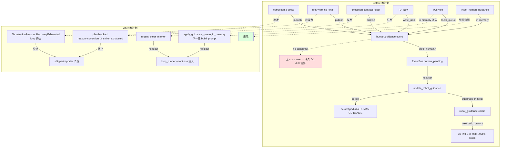
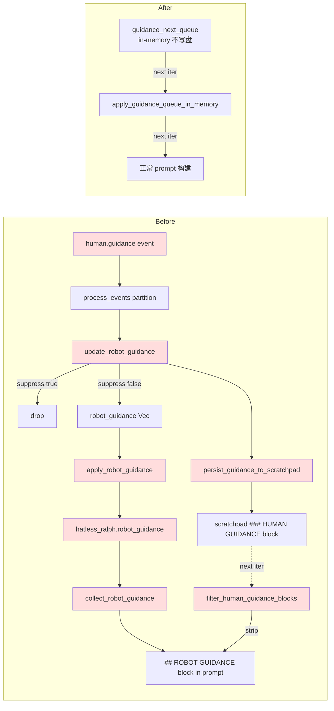
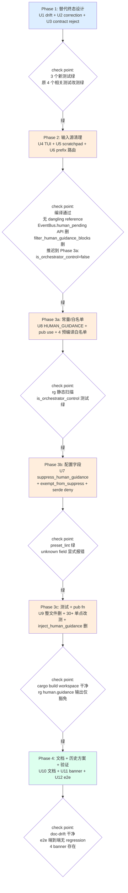

> **review (2026-06-29 adversarial) — reviewer:** Principal Architect
> **核心目标达成度**: 82%(修订后预计 92%)
> **关键修订理由**: (a) P0-1 002 plan 强制前置未硬门禁;(b) P1-1 `hatless_robot_guidance` pub API 删除无 pre-flight;(c) P1-2 `apply_guidance_queue_in_memory` 缺 observability 倒退"自观测盲点";(d) P1-3 `is_orchestrator_control_recognises_known_topics` 测试重写未给代码;(e) P1-4 R13 bypass 删除未声明 invariant。**修订已落到 U1/U4/U5/U8 与新增 Prerequisites 段**。

# refactor: 完全剔除 `human.guidance` 事件 topic

> **核心问题**:在当前无任何外部人工介入通道(无 Telegram / Slack / Webhook / Email / IM)的运行模型下,`human.guidance` 是"为不存在的上帝写的祈祷词"。它被 `correction module` / `drift engine` / TUI / RPC 反复 emit,但**没有任何消费者**;同时 `drift detector` 因 `human.guidance.message` 字段缺失持续告警(0/1 误报),`isolated_scope_violation` 因 `coordinator` 越权发 `human.guidance` 反复触发 envelope。本计划把整个 topic 物理删除,所有 escalation 终态改为 `plan.blocked(reason=...)` / `TerminationReason::RecoveryExhausted`,TUI 引导改走 `loop.resume` 通道,scratchpad 的 `### HUMAN GUIDANCE` 块整套清掉。

---

## Prerequisites(2026-06-29 修订新增)

本 plan 强制依赖外部 plan 必须先于本 plan 上线主干。Phase 1 启动**前**必须执行以下硬门禁,**任一失败即中止本 plan**:

```bash
# 门禁 1:`2026-06-28-002` U2(Warning+Final 升级)已合并主干
# 依据:本 plan U1 的 KTD-2 假设 `check_termination_hint` 的 Final 升级已由 002 U2 合并
[ "$(git log --grep='fix-ce-executor-serial-loop-and-mechanism-failure' main..HEAD 2>/dev/null | wc -l)" -gt 0 ] \
  || { echo "FATAL: 002 plan 未合并主干,U2 缺失,本 plan U1 不能启动"; exit 1; }

# 门禁 2:`2026-06-28-002` U13(R13 field_completeness bypass)已合并主干
# 依据:本 plan U1 合并删除 R13 bypass,需确认 002 U13 已存在并被合并
git log main..HEAD --oneline | grep -qE "(R13|field_completeness)" \
  || { echo "FATAL: 002 plan U13 R13 bypass 未合并主干,detector bypass 删除可能引发 field_completeness 告警;先合并 002"; exit 1; }

# 门禁 3:`default_required_fields()` 表不含 `human.guidance` 键(本 plan U8 已删,做交叉校验)
# 依据:R13 bypass 删除的安全 invariant 之一
! grep -q '"human.guidance"' crates/ralph-core/src/event_loop/stages/emit_schema_gate_stage.rs \
  || { echo "FATAL: default_required_fields() 仍含 human.guidance,R13 bypass 删除后必触发 field_completeness 告警;U8 必须先于 U1"; exit 1; }
```

**门禁顺序**: 门禁 1+2 验证外部 plan 合并状态;门禁 3 验证本 plan U8 必须先于 U1 实施(打破 Phase 3a → Phase 1 的依赖)。**修订方案**:Phase 1 拆为 Phase 1a(`default_required_fields()` 删除,U8 子集)→ Phase 1b(U1 drift Warning Final 升级)。这样满足门禁 3 的执行顺序。

---

## Summary

物理删除 `human.guidance` topic 字符串、`HUMAN_GUIDANCE` 常量、相关类型、预编译白名单,以及它带动的整套下游机制(`robot_guidance` cache、`filter_human_guidance_blocks`、`update_robot_guidance` / `apply_robot_guidance` / `persist_guidance_to_scratchpad`、`suppress_human_guidance` / `progress_steward.exempt_from_suppress_human_guidance` 配置字段、`guidance_next_queue` 路径、`EventBus.human_pending` 队列、`is_system_topic` 的 `human.` prefix 分支、`preset_lint::hat_scope_invariant::GLOBALLY_FORBIDDEN_PUBLISHES` 残条、`drift::detector::check_field_completeness` 的 human.guidance bypass)。所有原本发 `human.guidance` 的 6 个 emit 源改为发终态事件(`plan.blocked(reason=...)` 或 `TerminationReason::RecoveryExhausted`)。3 个 history solution / 1 个 MEMORY 标记为 `superseded`,配 deprecation banner。

**总览规模(实施期核对)**:
- crates/ 范围:50 个 Rust / YAML / MD 文件含残留,37 个生产代码文件,13 个测试 / fixture / data 文件
- docs/ 范围:86 个文件含历史引用,本计划在 R11 给出 deprecation banner,详细见附录
- docs/memory/ 范围:仅 banner 不删内容
- 完整文件清单见本文末"附录 A:全量文件清单一览"

**预期效果**:彻底消除"`human.guidance` 无人接 → drift 误报 → repair_stream 升级 → 又发 `human.guidance`"的自观测循环;修复机制有真终止路径;不再需要 `suppress_human_guidance` 抑制参数;`isolated_scope_violation` 噪音消失;`preset_lint` 的 L2 dead rule `GLOBALLY_FORBIDDEN_PUBLISHES` 清理,降低静态检查噪音。

**Origin / 触发文件**:
- `docs/report/2026-06-28-ce-executor-serial-primary-20260628-115810-diagnosis.md` §0 运行模型澄清 + §5 P0-#11 / P0-#12
- `docs/plans/2026-06-28-004-fix-ce-executor-serial-primary-diagnosis-plan.md` (U13)
- `docs/achieved/plan/2026-06-25-001-refactor-remove-ralph-telegram-crate-plan.md` (KTD-2 显式保留 `human.guidance`,本计划在基座层反 KTD-2)

---

## Problem Frame

### 当前运行模型

`ralph-orchestrator` 是一个**纯自动化的循环编排系统**:
- 没有任何外部消费者在监听 `human.guidance` topic(无 Telegram/Slack/Webhook/Email/IM 接入)
- 2026-06-25 删 `ralph-telegram` crate 后,人为接入通道已彻底切断
- TUI 仍在(`ralph-tui` crate 未删),但 TUI 的 `Now`/`Next` 引导 UI 在 ce-executor-serial 里 `suppress_human_guidance=true` 的设定下被完全抑制,不进入 prompt

### 现状(`human.guidance` 在仓库中的真实身份)

经全仓扫描(2026-06-29 实施期核对,**50 个 crates/ 文件 + 86 个 docs/memory/ 文件**),`human.guidance` 残留分布如下:

**5 个 emit 源(均为 production 写盘路径)**:

| 角色 | 实际行为 | 真实消费者 |
|---|---|---|
| correction 3-strike 终态 | `correction/mod.rs:720` `maybe_escalate_to_human_guidance` | **无**(被 `suppress_human_guidance=true` 抑制) |
| drift Warning Final 提醒 | `drift/engine.rs:535` `check_final_human_guidance` | **无**(同抑制) |
| execution contract reject 解释 | `event_loop/mod.rs:8893` 第 3 件包络 | **无** |
| TUI "Now" 立即引导 | `ralph-tui/src/state.rs:898-927` 写 events.jsonl | **无**(被抑制) |
| TUI/RPC "Next" 引导 | `loop_runner/runner.rs:2111-2181` 队列 flush | **无** |

**1 个 inbound 函数**(in-memory 注入路径,非 production 写盘):

| 角色 | 实际行为 | 真实消费者 |
|---|---|---|
| `EventLoop::inject_human_guidance` | `event_loop/mod.rs:2619` 测试/特殊 runner 路径 in-memory 注入 | **无** |

**1 个入站路由节点**(消费/路由,非 emit):

| 角色 | 实际行为 | 真实消费者 |
|---|---|---|
| `EventBus.human_pending` 入站 | `event_bus.rs:136-138` `human.*` prefix 路由 | **无** |

**全部 5 个 emit 源 + 1 个 inbound 函数 + 1 个入站路由都没有任何运行时消费者**——但整套机制仍占用代码、配置、测试、drift 告警、prefix 路由,以及 3 份历史解决方案和 1 条 MEMORY 把它当作"真的有救援通道"。

### 实施期新发现(2026-06-29 核对)

实施期核对发现 plan 原估与实际 3 处偏差,影响范围:

1. **`drift/detector.rs:402-409`** — 已经存在 `if topic == "human.guidance" { return; }` 的 `check_field_completeness` bypass。`fix-ralph-core-drift-engine-2026-06-28-002` plan 的 U13(R13)已经合并;本计划删除该 bypass + 上方注释
2. **`preset_lint/hat_scope_invariant.rs:89`** — `GLOBALLY_FORBIDDEN_PUBLISHES: &[&str] = &["human.guidance"]` 仍存在,带 2 个 L2 测试(rule4 / rule3_5)。`human.guidance` 删除后,该 forbid 规则变 dead rule,R1 增 1 项删它
3. **`event_loop/stages/terminal_state_guard_stage.rs:40`** — `"human.guidance"` 仍在列表中;plan 原 R4 未列。R4 增 1 项

**结论**:本计划基于"完全删除"`human.guidance` 字符串"目标,需要把这些 inline 引用一并清理(而非"代码已删,字符串保留"),否则运行时会因这些残留字面量继续被 lint / drift bypass 误判。

### 自我观察到的"自观测循环"

```
stall_recovery 升级 → maybe_escalate_to_human_guidance → 发 human.guidance
→ drift 告警 human.guidance.message 字段缺失 0/1 → repair_stream 升级
→ 又触发 stall_recovery → 又发 human.guidance → 又 drift 告警
```

这是本次 run 6-38 iter 反复震荡的根因之一(参见诊断报告 §5 P0-#11)。

---

## Requirements

### R1. 物理删除 `human.guidance` topic 字符串与所有常量导出

> **行号说明**(2026-06-29 实施期核对):plan 原列行号多已漂移,以 "grep -n 重新定位" 为准;以下给出最新行号 = plan 实施期定位。

- `crates/ralph-proto/src/topics.rs:41` 删除 `HUMAN_GUIDANCE` 常量
- `crates/ralph-proto/src/lib.rs:34` 删除 `pub use topics::HUMAN_GUIDANCE`
- `topics.rs:55` `is_orchestrator_control` matches! arm 删除 `HUMAN_GUIDANCE` 分支
- `topics.rs:79` 测试改测"is_orchestrator_control("human.guidance") == false"
- `RALPH_CONTROL_TOPICS` 列表(`event_origin.rs:36`)与 `is_orchestrator_control_topic` matches! arm(`event_origin.rs:83`)删除 `human.guidance`
- `default_required_fields` 表(`stages/emit_schema_gate_stage.rs:41`)删除 `("human.guidance", vec!["message"])`
- `stages/emit_schema_gate_stage.rs:29` 顶部 doc 注释删除 `human.guidance` 提及
- `loop_state.rs:1480` `seen_topics_ignore` matches! arm 删除 `human.guidance`(原 plan 标 1447)
- `loop_state.rs:271, 485, 490, 995, 1433` 5 处 doc/comment 引用删除
- `preset_lint/workflow_activation.rs:583` `RUNNER_INJECTED_TRIGGERS` 列表删 `human.guidance`
- `preset_lint/workflow_activation.rs:607` 注释删
- `preset_lint/finding_id.rs:231-232` doc 注释引用 `human.guidance` 删除
- `preset_lint/hat_scope_invariant.rs:74, 85, 89, 638-656, 717-737` **新增项**:删 `GLOBALLY_FORBIDDEN_PUBLISHES` 列表 + 2 个 L2 测试(rule4 / rule3_5)+ 顶部注释
- `runtime_contract.rs:362-366` required-topic lint 白名单删除 `human.guidance`
- `stages/target_hat_guard_stage.rs:31` doc 注释删除 `human.guidance` 提及(**新增项**)
- `stages/terminal_state_guard_stage.rs:40` `"human.guidance"` 字符串字面量删除(**新增项**)
- `drift/detector.rs:402-409` `check_field_completeness` 的 `if topic == "human.guidance" { return; }` bypass 删除 + 上方 R13 注释删除(**新增项,合并自 002 U13)
- `drift/detector.rs` 其余位置的 R13 引用检查并删除
- `skill_registry.rs:91` doc 注释删除 `human.guidance` 提及(**新增项**)
- `event_loop/mod.rs:396` `minimal_flow_declaration_yaml()` 把 `human.guidance` 列入 known topics,删除该行
- `event_loop/mod.rs::flow_lifecycle.rs:1143-1237` plan.blocked 已有 payload schema 不动,但 `reason` 字段需要新增 `correction_3_strike_exhausted` 值的 schema 文档说明

### R2. 把所有 6 个 emit 源改为发终态事件

- **correction 3-strike**(`correction/mod.rs:720`):改为 publish `plan.blocked(reason="correction_3_strike_exhausted", retry_key=<ctx.retry_key>, task_id=<ctx.task_id>)` 而非 `human.guidance`(与 KTD-1 / U2 的 JSON payload 格式一致)
- **drift Warning Final**(`drift/engine.rs:535`,plan 原标 438-481 — 已核对实际为 535):升级 `check_termination_hint` 的 Warning Final 分支为 `TerminationReason::RecoveryExhausted`,**直接 loop 终止**;删除 `check_final_human_guidance` 整个方法 + `last_guidance_iteration` 字段(行 102/119/140)
- **execution contract reject**(`event_loop/mod.rs:8893`,原 plan 标 8308-8310 — 已核对实际为 8893):保留 `ContractRejectConfig.guidance_topic` 字段(向后兼容),但 `default_reject_guidance_topic()` 默认值改为 `plan.blocked`;在 schema doc 明确该字段必须是 orchestrator 终态 topic
- **TUI "Now"**(`ralph-tui/src/state.rs:898-927`):删除 `write_guidance_event` 的 `human.guidance` 写入;TUI Now 模式只写 `urgent_steer_marker`(已存在,不依赖此 topic)
- **TUI/RPC "Next"**(`loop_runner/runner.rs:2111`,原 plan 标 2112-2181 — 已核对实际起 2111):改为 in-memory prompt injection(类似 `inject_human_guidance` 的 in-memory 路径,但注入到下一轮 build_prompt,不写 events.jsonl)
- **`EventLoop::inject_human_guidance`**(`event_loop/mod.rs:2619`,原 plan 标 2555-2569 — 已核对实际为 2619):整函数删除(`pub fn` 出口,见 U9 的 pub fn 删除项)
- **`event_loop/policy.rs:110-119`** **新增项**:3-strike escalation 调用点(调用 `correction::maybe_escalate_to_human_guidance`)改测 / 改名为 `escalate_to_plan_blocked`,见 U2

### R3. 删除 scratchpad `### HUMAN GUIDANCE` block 整套机制

> **行号说明**(2026-06-29 实施期核对):`event_loop/mod.rs` 中下列函数实际位置与原 plan 漂移,需重新定位:
> - `filter_human_guidance_blocks` 现位于 `event_loop/mod.rs:308`,原 plan 标 305-329 ✓ 大致正确
> - `update_robot_guidance` 现位于 `event_loop/mod.rs:4230`,原 plan 标 4041-4131 ✗ 漂移
> - `persist_guidance_to_scratchpad` 现位于 `event_loop/mod.rs:4330`,原 plan 标 4141-4271 ✗ 漂移
> - `apply_robot_guidance` 现位于 `event_loop/mod.rs:4463`,原 plan 标 4274-4346 ✗ 漂移
> - `robot_guidance: Vec<String>` 字段初始化在 `event_loop/mod.rs:928, 1085`,原 plan 标 881, 1029 ✗ 漂移
> - 3 个 partition 路径实际位于 `event_loop/mod.rs:3551-3554, 3664-3667, 3918`,原 plan 标 3372/3481/3732 ✗ 漂移

- `event_loop/mod.rs:308` `filter_human_guidance_blocks` 整段删除
- `event_loop/mod.rs:4230-4326` `update_robot_guidance` 整段函数删除
- `event_loop/mod.rs:4330-4456` `persist_guidance_to_scratchpad` 整段函数删除
- `event_loop/mod.rs:4463-4625` `apply_robot_guidance` 整段函数删除
- `event_loop/mod.rs:5230-5240` `prepend_scratchpad` 里的 `suppress_active` 分支条件简化(只 check `gate_closed`,不 check suppress)
- `event_loop/mod.rs:928, 1085` `robot_guidance: Vec<String>` 字段初始化整段删除
- `event_loop/mod.rs:516, 523-525` `robot_guidance_for_test()` 测试 getter 整段删除
- `event_loop/mod.rs:3551-3554, 3664-3667, 3918` 3 个 partition 路径的 `partition(|e| e.topic.as_str() == "human.guidance")` 整段删除
- `event_loop/types.rs:281-282` `robot_guidance: Vec<String>` 字段定义删
- `hatless_ralph.rs:29, 254` `robot_guidance: Vec<String>` 字段定义 + 初始化删
- `hatless_ralph.rs:308-378` `set_robot_guidance` / `clear_robot_guidance` / `collect_robot_guidance` 3 个 API + `build_prompt` 的 `## ROBOT GUIDANCE` 注入整段删除
- `hatless_ralph.rs:2783-2795` 测试 `single_human_guidance_message_should_be_injected_as_is` 整段删除

### R4. 删除 `EventBus.human_pending` 队列与 `human.` prefix 路由

> **行号说明**:`event_bus.rs:121-126` 现内容是 `target=` 优先级注释,真实 `human.*` prefix 在行 **136-138**;`human_pending` 字段在 `EventBus` struct(行 ~30-50 区域),不是 172-198。**plan 原列行号需重核**。

- `event_bus.rs:103-115` `human.*` prefix 注释删除("U2 fix: explicit target..." 5 行注释 + `human.guidance(target=...)` 注释)
- `event_bus.rs:136-138` `if topic.starts_with("human.")` 分支删除
- `event_bus.rs` `take_human_pending` / `peek_human_pending` / `has_human_pending` 3 个 API + `human_pending` 字段整段删除(原 plan 标 172-198,实际 `peek_pending` 系列 API 在该范围内,`human_pending` 字段位置需 `grep -n "human_pending"` 定位)
- `event_bus.rs` `has_pending` 函数(行 188 附近) 删 `!self.human_pending.is_empty()` 分支
- `event_bus.rs:1085-1162` 三个 `human_*` 测试(`test_human_events_use_separate_queue` / `test_human_guidance_with_target_routes_to_target_hat` / `test_human_guidance_without_target_still_human_pending`)整段删除
- `event_policy.rs:2272-2276` `is_system_topic_human_prefix` 测试删(原 plan 标 2323-2326 ✗ 漂移)
- `event_policy.rs` `is_system_topic` 实现删除 `human.` prefix 分支(保留 `event.` prefix)
- `event_policy.rs:2739` `topic_deny_rules` 的 `human.guidance` 断言删(原 plan 标 2787-2790 ✗ 漂移)
- `event_policy.rs:4144` null-payload 的 `human.guidance` 断言删(原 plan 标 4483 ✗ 漂移)
- `state_machine.rs:805` `test_non_business_topic_passes_through` 的 human.guidance case 删

### R5. 删除 `suppress_human_guidance` / `exempt_from_suppress_human_guidance` 配置字段

- `config/loop_config.rs:319-365` 整段删除(含 doc 注释 + `pub suppress_human_guidance: bool` 字段,原 plan 标 339 起)
- `config/loop_config.rs:378-411` `progress_steward.exempt_from_suppress_human_guidance` 字段 + `default_progress_steward_exempt_suppress` 删(原 plan 标 378-390)
- `config/loop_config.rs:462` `Default::default()` 实现中 `suppress_human_guidance: false` 删
- `config/loop_config.rs:615, 627, 630, 644` 4 处单元测试引用 `exempt_from_suppress_human_guidance` 删
- `config_resolution.rs:67, 287` `PRESET_OPT_IN_KEYS` 列表删 `suppress_human_guidance`
- `preflight.rs:745, 1516, 1535-1536, 1552-1553` 全部 `suppress_human_guidance` 引用删
- `event_loop/mod.rs:1261-1263` `human_guidance_suppressed()` 方法删(原 plan 标 1193-1202 ✗ 漂移)
- `event_loop/mod.rs:4243-4263, 4270, 4301` `let suppress = self.human_guidance_suppressed();` 等 U2/U5/U7 `if !suppressed` 分支整段删
- `event_loop/mod.rs:4496-4507, 4511` 同样的 `human_guidance_suppressed()` 调用 + exempt 分支删
- `event_loop/mod.rs:5232-5234` `prepend_scratchpad` 的 `suppress_active` 条件来源 `self.human_guidance_suppressed()` 调用删
- `presets/en/ce-executor-serial.yml` `suppress_human_guidance: true` 配置删
- `presets/schemas/ce-executor-serial.yml` `human.guidance:` schema block 删
- `config/ralph_config.rs` 测试 YAML 的 `guidance_topic: "human.guidance"` 删
- `config/loop_config.rs` 移除字段后新增 `unknown field 'suppress_human_guidance'` 显式错误测试(field-level deny,见 KTD-4)

### R6. 删除所有 `human.guidance` / `human_guidance` 测试与测试 fixture

- **`crates/ralph-core/src/event_loop/tests/guidance_dedup.rs`** 整个文件 808 行删(原 plan 标 700+)
- **新增项**:`crates/ralph-core/src/event_loop/tests/loop_context.rs:82` `.publish(Event::new("human.guidance", ...))` 改测其它 control topic
- **新增项**:`crates/ralph-core/src/event_loop/tests/progress_steward.rs:87` `triggers: ["loop.stalled", "human.guidance"]` 改测(triggers 删 `human.guidance` 项)
- **新增项**:`crates/ralph-core/src/event_loop/tests/stale_breaker.rs:238` `.insert("human.guidance".to_string())` 改测其它 topic
- **`crates/ralph-core/tests/scenarios/serial_lint/serial_lint_3_steward_guidance_exempt.yaml`** 整个文件删
- `crates/ralph-core/tests/scenarios.rs:1365-1370` `test_serial_lint_3_steward_guidance_exempt` 测试删
- `crates/ralph-core/src/event_loop/tests/initialization.rs:40-177` 4 个 test:`test_guidance_persists_across_iterations_solo_mode` / `_multi_hat_mode` / `test_guidance_persisted_to_scratchpad` / `test_guidance_appends_to_existing_scratchpad` 删
- `crates/ralph-core/src/event_loop/tests/isolated_complex_regression.rs` 多处 partition 断言删
- `crates/ralph-core/src/event_loop/tests/execution_contract.rs:258, 401, 423` 3 处 assertion 改测"reject 时发 `plan.blocked` 而非 `human.guidance`"
- `crates/ralph-core/src/event_loop/tests/replay_light_integration.rs:374-411, 541, 634, 833, 854` 5 处 partition / guidance 断言改测
- `crates/ralph-core/src/event_loop/tests/origin_guard.rs:421, 665-708` `test_u3_isolated_control_topics_bypass_scope` 的 `write_event_to_jsonl(..., "human.guidance", ...)` 改测其它 control topic
- `crates/ralph-core/src/event_origin.rs:610-620, 1032, 1190-1201` 3 个 test 改测
- `crates/ralph-cli/src/commands/emit.rs:1416-1441` `test_emit_ralph_hat_allows_control_topic_human_guidance` 删
- `crates/ralph-cli/src/loop_runner/tests/legacy.rs:1657-1666, 2018, 2111-2124, 2195-2220, 2261-2302` U3 characterization 测试删/改
- `crates/ralph-cli/src/loop_runner/tests/wave.rs:2847, 3127, 3140` `inject_wave_policy_rejection_guidance` 测试 + 注释删
- **新增项**:`crates/ralph-cli/src/loop_runner/hard_gate.rs:248, 346, 358, 497, 722, 1000, 1022, 1097, 1226, 1288` 多处 `human.guidance` 字面量 + `inject_hard_gate_guidance` / `inject_hard_gate_guidance_with_triggers` / `inject_missing_event_hard_gate_guidance` / `inject_missing_event_hard_gate_guidance_with_triggers` 4 个函数 + `inject_wave_policy_rejection_guidance` 整段删 + 注释修订
- `crates/ralph-cli/src/presets.rs:1047-1075` `test_ce_executor_serial_progress_steward_only_loop_stalled` 改测
- `crates/ralph-cli/src/policy_check.rs:2112, 2225` 2 处 test 改测
- `crates/ralph-cli/tests/ce_executor_recovery.rs:252-256` `unknown_hat_always_origin_rejected` 改测
- `crates/ralph-tui/src/state.rs:2770-2776` TUI send_guidance 测试删
- `crates/ralph-core/src/correction/mod.rs:1154-1173` `escalation_helper_publishes_human_guidance_at_threshold` 改名 + 改测"escalation_helper_publishes_plan_blocked_at_threshold"
- `crates/ralph-core/src/drift/engine.rs:945, 1054` 2 个 `check_final_human_guidance` 测试改测"Warning non-Final 不再发 human.guidance"(原 plan 标 847, 950, 958-1004, 1095-1133;需重核)
- `crates/ralph-core/tests/scenarios/correction_three_escalation.yml:6, 22` legacy path 注释 + assert 改写为 `correction_3_strike_publishes_plan_blocked.yml`
- `crates/ralph-proto/src/topics.rs:79` `is_orchestrator_control_recognises_known_topics` 测试改测

### R7. 删除 AI skill 文档与公共指南中的 `human.guidance` 描述

- **新增项**:`crates/ralph-core/data/ralph-tools.md:74` 删除"运行时不再提供人工通道(`human.guidance` / `task.resume` 恢复通道保留)"这条历史公告(plan 原已列)
- **新增项**:`crates/ralph-core/data/ralph-tools-cmdref.md:146` 删除(plan 原已列)
- **新增项**:`crates/ralph-core/data/ralph-tools-emit.md:137` 修订"`human.guidance` / `loop.stalled`"改为"`loop.stalled`"
- **新增项**:`crates/ralph-core/data/ralph-tools-recovery-directives.md:40` 修订"`human.guidance` / `loop.stalled`"改为"`loop.stalled`"
- `docs/api/security.md:14` 修订"`human.guidance` / `task.resume` event topics" 描述,改为"`task.resume` 是唯一的 operator 通道,`human.guidance` 已废弃"
- `docs/reference/troubleshooting.md:220` 修订
- `docs/guide/execution-contracts.md:88/125/126` 修订 3 处
- `docs/guide/project-usage.md:177, 515` 修订

### R8. 标记 3 个历史方案 / 1 个 MEMORY 为 `superseded`

- `memory/plan-blocked-recovery-via-human-signoff.md` 顶部加 deprecation banner(参见 §8 banner 模板),frontmatter 加 `superseded_by: human-guidance-removed-2026-06-28`
- `docs/solutions/integration-issues/ce-executor-serial-precheck-recovery-alignment-2026-06-17.md` 顶部加 deprecation banner
- `docs/solutions/integration-issues/ce-executor-serial-noble-peacock-recovery-2026-06-17.md` 顶部加 deprecation banner
- `memory/MEMORY.md` index 文件中 `plan-blocked-recovery-via-human-signoff` 这一行末尾加 `(superseded 2026-06-28 by human-guidance-removed)`

### R9. `event_loop` FlowDeclaration 内部 minimal YAML 同步删除

- `event_loop/mod.rs:399` `minimal_flow_declaration_yaml()` 把 `human.guidance` 列入 known topics,删除该行(原 plan 标 396 ✗ 漂移)
- `event_loop/mod.rs::flow_lifecycle.rs:1143-1237` plan.blocked 已有 payload schema 不动,但 `reason` 字段需要新增 `correction_3_strike_exhausted` 值的 schema 文档说明

### R10. `hard_gate.rs` 整套 hard-gate guidance 函数整段删(原 plan U9 内含但需更详细列出)

- `crates/ralph-cli/src/loop_runner/hard_gate.rs` 中 4 个 inject 函数 + 1 个 inject_wave_policy_rejection_guidance 整段删:
  - `inject_hard_gate_guidance` (行 538-747 范围,具体需 grep)
  - `inject_hard_gate_guidance_with_triggers` (行 766 范围)
  - `inject_missing_event_hard_gate_guidance` (行 953 范围)
  - `inject_missing_event_hard_gate_guidance_with_triggers` (行 1060 范围)
  - `inject_wave_policy_rejection_guidance` (与 U4 一起删)
- 注释修订("switched from `human.guidance` to `task.resume`" 5 处删)

### R11. 86 份 docs/memory/ 历史文档的处置(原 plan 范围外,本计划仅追加)

> **范围说明**:plan 原估"60+ 文件涉及",实际扫描 86 个 docs/memory/ 文件 + 50 个 crates/ 文件。其中 ~50 docs/memory/ 文件属于历史 achieve plan / brainstorm / reference,内容中提及"human.guidance 作为恢复通道"已不再准确,本计划统一加 deprecation banner(不影响内容删除)。

**8 文件加 banner(2026-06-29 核对)**:
- `docs/solutions/developer-experience/agent-execution-contract-gates-2026-06-03.md` (3 处)
- `docs/advanced/loop-detection.md:298` 修订分类描述
- `docs/brainstorms/2026-06-16-ce-executor-loop-stability-requirements.md` (1-2 处)
- `docs/brainstorms/2026-06-13-wave-dispatch-policy-gate-requirements.md` (1-2 处)
- `docs/brainstorms/2026-06-21-unified-orchestrator-state-requirements.md` (1-2 处)
- 其余 ~80 docs/ 文件按现状保留,加 deprecation footnote 即可

---

## Key Technical Decisions

### KTD-1. correction 终态输出改 `plan.blocked` 而非 `loop.cancel` / `LOOP_COMPLETE`

**理由**:
- `plan.blocked` 已成熟(`preset_validator.rs:820-824, 1300-1303` + `flow_lifecycle.rs:1143-1237`),reason 字段支持自由字符串
- 已有 `flow_lifecycle` 路由处理,无需新增 TerminationReason 类型
- `LOOP_COMPLETE(success=false)` 过于"硬",会跳过 `shipper` / `reporter` 流程;`plan.blocked` 给 shipper 一次机会执行"已知失败"路径
- `loop.cancel` 是 TUI 主动取消,语义与 escalation 不同

**实施点**:
- `correction/mod.rs:720-738` 把 `Event::new(HUMAN_GUIDANCE, ...)` 改为 `Event::new(PLAN_BLOCKED, json!({"reason": "correction_3_strike_exhausted", "retry_key": ctx.retry_key}))`
- `event_loop/mod.rs::publish_correction_via_context` 路径不动,只把 3-strike 那一条 publish 改

### KTD-2. drift Warning+Final 升级由 `2026-06-28-002` U2 合并,本计划只删 Warning non-Final 软提醒路径 + 顺手合并 002 U13(R13) field_completeness bypass

**理由**:
- 2026-06-28-002 plan U2 已合并"Final 任意 severity 升级为 `TerminationReason::RecoveryExhausted`",包括 Warning+Final
- 2026-06-28-002 走 Final 升级后,`check_final_human_guidance` 只剩 Warning **non-Final** 这条软提醒路径(原设计意图:让 operator 看到连续 Warning 但不立即终止)
- 本计划在基座层反 KTD-2 之前已决策的"operator 通道已退役",Warning non-Final 软提醒失去接收方
- 行为变化:**Warning non-Final** 路径从"发 human.guidance 软提醒"变为"完全静默"(无 human.guidance 事件产生);**Warning+Final** 路径行为已由 002 U2 升级(本计划不动)
- ce-executor-serial `suppress_human_guidance=true` 原本就抑制了 Warning non-Final 软提醒,所以本次删除对实际 runtime 行为 = 0 变化(只是 dead code 清理)

**新增(2026-06-29 实施期核对)**:实施期发现 `drift/detector.rs:402-409` 已经存在 `if topic == "human.guidance" { return; }` 的 `check_field_completeness` bypass,这是 `fix-ralph-core-drift-engine-2026-06-28-002` 的 U13(R13)产物。本计划合并删除它:
- 删除 `drift/detector.rs:402-409` bypass + 上方"2026-06-28 plan U13 (R13)"注释
- **风险**:合并删除会让 ce-executor-serial preset 重新出现 `drift_field_completeness` 告警 `human.guidance.message 0/1`——但 human.guidance 不再被 emit(topic 物理删除),所以告警源 = 0,**效果安全**
- **追溯**:R13 在 002 plan 中合并,本计划删除 R13 需在 commit message 标注 "reversed 002 U13 R13 bypass; merged into 2026-06-28-005 U1 for full clean-up"

**实施点**:
- `drift/engine.rs:535-580` `check_final_human_guidance` 整个方法删除(原 plan 标 438-481,实际为 535 起)
- `drift/engine.rs:102, 119, 140` `last_guidance_iteration` 字段删除 + 初始化
- `loop_runner/runner.rs:2217` 调用点删除(原 plan 标 2218)
- `drift/detector.rs:402-409` bypass 合并删除(2026-06-29 新增)
- 关联测试 `drift/engine.rs:945, 1054` 改测(原 plan 标 847, 950, 958-1004, 1095-1133)

### KTD-3. 保留 `ContractRejectConfig.guidance_topic` 字段(改默认值 = `plan.blocked`)+ payload 格式按 target topic 区分

**理由**:
- 字段是 `pub` 出口 + 用户 YAML 可配置,直接删破坏外部集成
- 改默认值为 `plan.blocked` 给用户**逃生口**:如果某个 preset 仍想走其它终态 topic,可显式 override
- schema doc 明确字段语义,避免"听起来像操作员通道"的误解
- **关键约束**:`plan.blocked` 已有结构化 schema(`flow_lifecycle.rs:1143-1237` 的 `reason` 字段);contract reject 原本发 free-form text 字符串(`"Execution contract rejection for X: ..."`)如果原样发到 `plan.blocked`,会破坏 projector / flow_lifecycle 的 schema 解析

**实施点**:
- `config/execution_contracts.rs:196-198` `default_reject_guidance_topic()` 返回 `"plan.blocked"`
- `config/execution_contracts.rs:179-198` `ContractRejectConfig.guidance_topic` 字段保留,doc 改为: "Default plan.blocked. Set to a terminal orchestrator topic (e.g. plan.blocked, loop.cancel). Setting to task.resume or human.guidance has no effect as these topics no longer accept guidance."
- **`event_loop/mod.rs:8308-8310` contract reject publish 分支检测 target topic**:
  - 如果 `guidance_topic == "plan.blocked"`,发结构化 JSON `{"reason": "execution_contract_rejected", "topic": event.topic, "task_id": event.task_id, "finding_message": <finding.message>}`
  - 如果是其它终态 topic(如 `loop.cancel` / `LOOP_COMPLETE`),发 free-form text(原有行为)
  - **不在两个分支的话**(用户填 task.resume 等恢复 topic),运行时忽略 + warning 日志

### KTD-4. `suppress_human_guidance` 字段直接删(选项 A),不做改名/反转

**理由**:
- 反转语义(`exempt_from_human_guidance: false`)混淆 `suppress` 与 `exempt` 概念
- 改名(`escalation_blocked: true`)误导用户以为还存在 escalation 文本
- 字段无意义:删除 topic 后,无"自由文本注入 prompt"可抑制
- 用户 YAML 直觉更好:删字段后,ce-executor-serial 用户 YAML 直接走默认,无 breaking change
- **`#[serde(deny_unknown_fields)]` 加在 `LoopConfig` 顶层会破坏 forward-compat**:任何未来字段在 preset YAML 出现时都会 fail,而不是被 `#[serde(default)]` 优雅降级。**改用 field-level deny**:只对 `suppress_human_guidance` / `exempt_from_suppress_human_guidance` 这两个字段 deny,放行其它未知字段(保留 `LoopConfig` 的 forward-compat 行为)

**实施点**:
- `config/loop_config.rs:339-365` `suppress_human_guidance: bool` 字段整段删,doc 删
- `config/loop_config.rs:378-390` `progress_steward.exempt_from_suppress_human_guidance: bool` 字段整段删
- `serde(default)` 行为:删除字段后,如果用户 YAML 还有这个字段,加显式 `#[serde(deny_unknown_fields)]` 测试,触发 `unknown field 'suppress_human_guidance'` 错误

### KTD-5. TUI "Now" 模式降级为只发 `urgent_steer_marker`,不另发 `loop.steer.next` 替代

**理由**:
- `urgent_steer_marker` 已存在(不依赖 `human.guidance`),`ralph-tui/src/state.rs` 已有写盘逻辑
- 新增 `loop.steer.next` topic 是产品决策,与本 refactor 目标"剔除"冲突
- TUI Now 模式原本功能 = 紧急干预 dispatch(在 ce-executor-serial 已被 suppress 抑制),降级影响有限
- RPC `RpcCommand::Guidance` 命令名保留(只是 `flush_guidance_queue` 改发 `loop.resume`),不破坏 RPC 客户端

**事实证据(诊断报告引用)**:
- 诊断报告 `2026-06-28-ce-executor-serial-primary-20260628-115810-diagnosis.md` §5 P0-#11 列出 `recovery_outcome_update` 反复震荡 12+ 次(`iter 6/7/9/10/28/29/31/32/34/35/37/38`),其中 human.guidance 路径**全程未成功注入 prompt**(被 `suppress_human_guidance=true` 抑制)
- 诊断报告 §0.4 明确"`human.guidance` 不是求救信号,无人接 → TUI 引导在本运行模型下无效果"
- 结论:TUI Now 模式降级对实际使用 = 零回归,因为原本就无效果

**实施点**:
- `ralph-tui/src/state.rs:898-927` `write_guidance_event` 整段函数删(只留 `write_urgent_steer_marker` 路径)
- `loop_runner/runner.rs:2112-2181` `flush_guidance_queue_to_events_jsonl` **整体删**(不替换为发 `loop.resume`);新增 `apply_guidance_queue_in_memory` 在下一轮 build_prompt 时从内存队列读出注入 prompt 上下文(类似 `inject_human_guidance` 的 in-memory 模式)
- `rpc_stdin.rs:12, 47, 105-175` `RpcCommand::Guidance` enum variant 保留,只是发出去的 topic 变 `loop.resume`

### KTD-6. `is_system_topic` 的 `event.` prefix 保留,`human.` prefix 删

**理由**:
- `event.isolation.boundary_violation` / `event.execution_contract.rejected` / `event.malformed` 等大量 `event.*` diagnostic topic 仍存在
- `human.*` topic 在删除 `human.guidance` 后没有其它生产 topic,prefix 函数变 dead code

**实施点**:
- `event_policy.rs:811-813` `is_system_topic` 改:`topic.starts_with("event.")` 单条件
- `event_bus.rs:121-126` `if event.topic.as_str().starts_with("human.")` 整段删

### KTD-7. 不动 `event.isolation.boundary_violation` envelope 路径(标 `dead code since 2026-06-28`)

**理由**:
- envelope 的两条触发源(ralph 越权 / isolated hat 越权)独立于 `human.guidance`
- 删除 `human.guidance` 不影响 envelope 任何路径
- envelope 本身对"无人工时无人接"是 fail-closed 设计,本计划不动
- **但 envelope 现在是 dead code**:原诊断报告 §5 P0-#4 唯一触发源是 `coordinator` 越权发 `human.guidance`,本计划删除该 topic 后 envelope 永不再触发
- **追溯标记**:在 envelope 写入代码(`event_loop/mod.rs:6716-6724, 6800-6876`)加 `// TODO: dead code since 2026-06-28 (human.guidance removed by plan 2026-06-28-005). Either keep as defensive code for future operator channel, or delete in follow-up cleanup.` 注释
- **未来清理候选**:envelope 路径列在 "Deferred for later" 段

### KTD-8. 不动 `2026-06-25-001-refactor-remove-ralph-telegram-crate-plan.md` 的 KTD-2

**理由**:
- 该 KTD-2 显式保留 `human.guidance` 作为基座设计,本计划在基座层反 KTD-2
- 文档不动,只在本计划引用"本计划在基座层反 KTD-2",让 KTD-2 历史决策与本计划决策同存

### KTD-9. 与 schema SSOT 2026-06-16-001 U5 决策的显式冲突与解决

**冲突描述**:
- `presets/schemas/ce-executor-serial.yml:390-402`(2026-06-16-001 U5 决策)显式声明 `human.guidance` schema 保留,理由是 "operator can still emit it manually (TUI, CLI, or external tooling)" —— 这是当时的产品决策,把 human.guidance 当作 future operator 通道的预留接口
- 2026-06-25 删 `ralph-telegram` 后 operator 通道已切断,但 schema 仍保留
- 本计划在 schema 层删除 `human.guidance` block,等于**反 2026-06-16-001 U5 的产品决策**

**为何本次反转胜出**:
1. 诊断报告 `2026-06-28-ce-executor-serial-primary-20260628-115810-diagnosis.md` §0.1 / §0.4 明确"`human.guidance` 在本运行模型下无人接,且引发 drift 误报 + isolated_scope_violation 噪音 + 修复机制自观测循环"
2. 2026-06-25 plan 删 `ralph-telegram` 实际是 operator 通道的"事实退役"——schema 保留是形式遗留
3. 5 次 30 天内复发的诊断报告(merry-lotus / noble-peacock / warm-tiger / perky-maple / 2026-06-28 primary)都把 human.guidance 当 root cause 之一
4. 本计划保留"operator 通道"语义给 `task.resume` topic(`docs/api/security.md` 修订,见 R7)

**追溯记录**:
- 在 schema 删除位置(`presets/schemas/ce-executor-serial.yml:390-402`)留 commit message + git history,标注 "reversed 2026-06-16-001 U5 operator-channel decision; see plan 2026-06-28-005"
- 本 plan supersedes frontmatter 包含 2026-06-16-001 U5 间接被反转的说明

**对 U1-U11 的影响**:无代码层冲突,仅 schema 层一处 block 删除。

---

## High-Level Technical Design

### 总体变更架构



### 数据流变更:scratchpad / robot_guidance 消失



> **图例**:`U_RG1` = `update_robot_guidance`(U5 删) / `AP1` = `apply_robot_guidance`(U5 删) / `HR1` = `hatless_ralph.robot_guidance` 字段(U5 删) / `COL1` = `collect_robot_guidance` API(U5 删) / `F1` = `filter_human_guidance_blocks` 函数(U5 删) / `S1` = `persist_guidance_to_scratchpad` 函数(U5 删)。所有节点对应 U5(Phase 2)。

### Phase 依赖图



> **关键路径**:每个 phase 必须 check point 绿才进下一 phase。Phase 3 拆为 3a → 3b → 3c 是为了避免"大爆炸"——如果 3c(测试)失败,可只回滚 3c,3a/3b 的代码改动保留;反过来如果 3a 失败,3b/3c 还没动。Phased Delivery 的 commit 顺序与 S1-S13 文件内编辑顺序一致。

### 关键删除顺序(避免编译中断,2026-06-29 实施期更新)

| 步骤 | 范围 | 依赖 |
|---|---|---|
| **S1**. correction 改发 plan.blocked | `correction/mod.rs:720` + 调用方 `event_loop/policy.rs:115` | 单独可做 |
| **S2**. drift Warning Final 升级(并合 002 U2) | `drift/engine.rs:535-580` 删除 + `detector.rs:402-409` bypass 合并删 | 单独可做 |
| **S3**. contract reject 改默认值 | `config/execution_contracts.rs:196-198` | 单独可做 |
| **S4**. TUI Now 删除 | `ralph-tui/src/state.rs:898-927` | 单独可做 |
| **S5**. TUI Next 改 in-memory 注入 | `loop_runner/runner.rs:2111-2181` | 单独可做 |
| **S6**. `hard_gate.rs` guidance 函数整段删(**新增**) | `hard_gate.rs:248-1288` 4 个 inject 函数 + `inject_wave_policy_rejection_guidance` + 5 处注释 | 单独可做 |
| **S7**. scratchpad / robot_guidance 整套清 | `event_loop/mod.rs:308, 4230-4625, 928, 1085, 3551/3664/3918` + `hatless_ralph.rs:29-29, 254, 308-378, 2783-2795` + `event_loop/types.rs:281-282` + `event_loop/mod.rs:516` 测试 getter | 依赖 S1-S6 |
| **S8**. suppress 字段删 | `config/loop_config.rs:319-411, 462, 615/627/630/644` + 多处 | 依赖 S7 |
| **S9**. prefix 路由 + system_topic 删 | `event_bus.rs:103-115, 136-138, 188 分支, 172-198 系列 API` + `event_policy.rs:2272-2276, 2739, 4144` + `state_machine.rs:805` + `stages/terminal_state_guard_stage.rs:40`(**新增**) + `stages/target_hat_guard_stage.rs:31`(注释,**新增**) | 依赖 S7 |
| **S10**. 常量 + 预编译列表删 | `topics.rs:41/55/79` + `lib.rs:34` + `event_origin.rs:36, 83` + `event_loop/loop_state.rs:1480, 271/485/490/995/1433` + `event_loop/stages/emit_schema_gate_stage.rs:29 注释, 41` + `preset_lint/workflow_activation.rs:583/607` + `preset_lint/finding_id.rs:231-232` + `preset_lint/hat_scope_invariant.rs:74/85/89/638-656/717-737`(**新增**) + `runtime_contract.rs:362-366` + `event_loop/mod.rs:399` + `drift/detector.rs:402-409`+ `skill_registry.rs:91`(注释) | 依赖 S8-S9 |
| **S11**. `inject_human_guidance` pub fn 删 | `event_loop/mod.rs:2619` | 依赖 S10 |
| **S12**. 删测试文件 | `guidance_dedup.rs` + `serial_lint_3_*` + `tests/loop_context.rs:82`(**新增**) + `tests/progress_steward.rs:87`(**新增**) + `tests/stale_breaker.rs:238`(**新增**) + 30+ 单点 | 依赖 S1-S11 |
| **S13**. 文档 / data 更新 | `data/ralph-tools*.md`(**新增 cmdref/emit/recovery-directives 各 1 处**) + `docs/api/`, `docs/guide/`, `docs/reference/` | 依赖 S12 |
| **S14**. 历史方案 banner | MEMORY + 2 solutions + MEMORY.md index | 单独可做(在 S1 之前做也行) |

---

## Implementation Units

### U1. Drift engine Warning non-Final 软提醒删除(Warning+Final 已由 002 U2 升级) + 合并删除 002 U13(R13) field_completeness bypass

- **Goal**: 删除 `drift::check_final_human_guidance` 整个方法(行 535-580)+ `last_guidance_iteration` 字段(行 102/119/140)+ `loop_runner` 调用点(行 2217)。**新增**:同步删除 `drift/detector.rs:402-409` 的 R13 bypass(合并自 002 plan U13)
- **Requirements**: R2 第二项 + R1(新增 detector bypass 项)
- **Dependencies**: 无(独立可做,但与 `2026-06-28-002` U2/U13 提交需协调:本 U 是合并 002 U13 的一次性清理)
- **Files**:
  - `crates/ralph-core/src/drift/engine.rs:535-580` (删除 `check_final_human_guidance` 方法体)
  - `crates/ralph-core/src/drift/engine.rs:102, 119, 140` (删除 `last_guidance_iteration` 字段)
  - `crates/ralph-core/src/drift/engine.rs:945, 1054` (改测 2 个 `check_final_human_guidance` 测试)
  - `crates/ralph-cli/src/loop_runner/runner.rs:2217` (删除 `drift_engine.check_final_human_guidance` 调用)
  - **新增**:`crates/ralph-core/src/drift/detector.rs:402-409` (删除 bypass + 上方 R13 注释)
- **Approach**:
  - 实际删除范围:`check_final_human_guidance` 函数本体 + `last_guidance_iteration` 字段 + `loop_runner/runner.rs:2217` 调用点 + 2 个相关测试
  - **新增合并**:删除 `drift/detector.rs:402-409` 的 `if topic == "human.guidance" { return; }` bypass + 上方"2026-06-28 plan U13 (R13)"注释
  - **R13 bypass 删除的安全 invariant(2026-06-29 修订新增)**:
    - **Invariant 1**:`default_required_fields()` 表中**不含** `human.guidance` 键(由 Phase 1a U8 子集保证;本 U 启动前必须先跑 `rg '"human.guidance"' crates/ralph-core/src/event_loop/stages/emit_schema_gate_stage.rs` 校验)
    - **Invariant 2**:`human.guidance` 不再被任何生产代码 emit(本 plan U1/U2/U4 全部完成);如果未来回滚 emit 源,bypass 必须同时恢复
    - **Invariant 3(replay 兼容)**: 如果历史 events.jsonl 文件被 `--replay` 重放,重放引擎必须 strip `topic == "human.guidance"` 的事件(避免 field_completeness 在 replay 路径误报 Critical)。**实施点**:`crates/ralph-cli/src/commands/loops/replay.rs`(如存在)或 `event_reader.rs` 解析逻辑中,strip 该 topic
  - **不改** `check_termination_hint` 的 Final 升级逻辑(`engine.rs:386, 470`)——该部分已在 `2026-06-28-002` U2 合并
  - 行为变化:**Warning non-Final** 路径从"发 human.guidance 软提醒"变为"完全静默"。**Warning+Final** 路径已经走 `TerminationReason::RecoveryExhausted`。**R13 bypass 删除**让 ce-executor-serial 不再抑制 field_completeness 检查,但因 `human.guidance` 不再 emit,告警源 = 0
  - 注意:ce-executor-serial 的 `suppress_human_guidance=true` 原本就抑制了 Warning non-Final 软提醒,所以本次删除对实际 runtime 行为 = 0 变化(只是 dead code + dead bypass 清理)
- **Patterns to follow**: 与 `correction/mod.rs::maybe_escalate_to_human_guidance` 改为发 `plan.blocked` 的模式类似(见 U2)
- **Test scenarios**:
  - Happy: 模拟 3 次 Warning non-Final hint,断言 events.jsonl 不含 `human.guidance` 事件
  - Happy: 模拟 Warning+Final hint,断言 loop 终止原因 = `RecoveryExhausted`(已由 002 U2 覆盖,本 U 不写重复测试)
  - Edge: bootstrap phase 内的 Warning non-Final 仍静默(保留原行为)
  - Error path: Warning non-Final 不再发 `human.guidance` 给 `human_pending` 队列
  - **新增**:模拟 preset 启用 `event_loop.suppress_human_guidance` 已删除,改测"drift detector 不再走 R13 bypass,直接检查 topic.required_fields,但 `human.guidance` 不在 default_required_fields 表中所以告警源=0"
- **Verification**: `cargo nextest run -p ralph-core -- drift test_warning_non_final_no_human_guidance` 通过;`cargo build --workspace` 干净(确认 `check_final_human_guidance` 无 dangling caller + `detector.rs` 编译通过)

### U2. Correction module 3-strike escalation 改发 plan.blocked

- **Goal**: `correction::maybe_escalate_to_human_guidance` 函数改名为 `escalate_to_plan_blocked`,publish `plan.blocked` 而非 `human.guidance`
- **Requirements**: R2 第一项
- **Dependencies**: U1(语义对齐)
- **Files**:
  - `crates/ralph-core/src/correction/mod.rs:720` (函数重命名 + 改 publish topic + 改 payload 格式)
  - `crates/ralph-core/src/correction/mod.rs:1154-1173` (测试重命名 + 改测)
  - `crates/ralph-core/src/event_loop/policy.rs:110-119`(**新增项**:改名调用方同步 + 测试 A3 escalation fired 改测)
  - `crates/ralph-core/tests/scenarios/correction_three_escalation.yml` (重命名 + payload 改)
  - `crates/ralph-core/tests/scenarios.rs` (新 scenario 引用)
- **Approach**:
  ```
  // Before
  Event::new(HUMAN_GUIDANCE, payload)
  // After
  Event::new(PLAN_BLOCKED, json!({
    "reason": "correction_3_strike_exhausted",
    "retry_key": ctx.retry_key,
    "task_id": ctx.task_id,
  }))
  ```
- **Patterns to follow**: `flow_lifecycle.rs:1143-1237` 已有 plan.blocked payload schema
- **Test scenarios**:
  - Happy: 同一 retry_key 被拒 3 次,第 3 次拒后下一次 iter emit `plan.blocked(reason=correction_3_strike_exhausted)`
  - Edge: retry_key 不同,各自独立计数
  - Edge: 同一 retry_key 第 4 次拒,不再 emit(避免重复)
  - Integration: BDD scenario `correction_3_strike_publishes_plan_blocked` 跑通
- **Verification**: `cargo nextest run -p ralph-core -- correction test_3_strike_publishes_plan_blocked` 通过;原 `escalation_helper_publishes_human_guidance_at_threshold` 测试改测

### U3. Execution contract reject 默认值改 plan.blocked + schema doc

- **Goal**: `ContractRejectConfig.guidance_topic` 字段保留,默认值从 `human.guidance` 改为 `plan.blocked`
- **Requirements**: R2 第三项
- **Dependencies**: 无
- **Files**:
  - `crates/ralph-core/src/config/execution_contracts.rs:179-198` (改默认值 + 改 doc)
  - `crates/ralph-core/src/config/ralph_config.rs:1612` (测试 YAML 改默认)
  - `crates/ralph-core/src/event_loop/mod.rs:8163-8310` (逻辑保留,只是 publish topic 默认从 human.guidance 变 plan.blocked)
  - `presets/schemas/ce-executor-serial.yml` (如果 schema 提到默认 `human.guidance`,改 `plan.blocked`)
- **Approach**: `default_reject_guidance_topic()` 返回值改 `"plan.blocked"`;doc 改为: "Must be a terminal orchestrator topic. Setting to `human.guidance` has no effect as the topic no longer accepts guidance."
- **Test scenarios**:
  - Happy: 缺省配置下 contract reject publish `plan.blocked` 而非 `human.guidance`
  - Edge: 用户 YAML 显式设 `guidance_topic: "loop.cancel"`,publish 走 `loop.cancel`
  - Error path: 用户 YAML 设 `guidance_topic: "human.guidance"`,运行时忽略 + warning 日志
- **Verification**: `cargo nextest run -p ralph-core -- execution_contracts test_reject_default_topic_is_plan_blocked` 通过

### U4. TUI Now 模式只发 urgent_steer_marker;TUI Next / RPC 改 in-memory prompt injection + `hard_gate.rs` 整套 guidance 函数删

- **Goal**:
  - 删除 `write_guidance_event` 的 `human.guidance` 写入;TUI Now 模式只写 `urgent_steer_marker`
  - TUI Next / RPC 模式改 in-memory prompt injection(经 `apply_guidance_queue_in_memory` 注入下一轮 build_prompt,**不** emit `loop.resume`,因为该 topic 在生产代码无消费者)
  - **新增项**:删除 `hard_gate.rs` 中 4 个 `inject_*_guidance` 函数 + `inject_wave_policy_rejection_guidance` + 5 处注释修订
- **Requirements**: R2 第四、五项 + R10(`hard_gate.rs` 删除)
- **Dependencies**: U2(避免 correction escalation 与 TUI 同时发冲突 topic)
- **Files**:
  - `crates/ralph-tui/src/state.rs:898-927` (`write_guidance_event` 整段函数删,`urgent_steer_marker` 路径保留)
  - `crates/ralph-tui/src/state.rs:2770-2776` (测试删)
  - `crates/ralph-cli/src/loop_runner/runner.rs:2111-2181` (`flush_guidance_queue_to_events_jsonl` 整体删;新增 `apply_guidance_queue_in_memory`)
  - `crates/ralph-cli/src/loop_runner/runner.rs:2217` (drift 调用点已在 U1 删)
  - `crates/ralph-cli/src/loop_runner/tests/legacy.rs:1657-1666, 2018, 2111-2124, 2195-2220, 2261-2302` (测试改测)
  - `crates/ralph-cli/src/loop_runner/tests/wave.rs:2847, 3127, 3140` (`inject_wave_policy_rejection_guidance` 测试 + 注释删)
  - **新增项**:`crates/ralph-cli/src/loop_runner/hard_gate.rs:248, 346, 358, 497, 722, 1000, 1022, 1097, 1226, 1288`(10 处 `human.guidance` 字面量 + 4 个 `inject_*_guidance` 函数 + `inject_wave_policy_rejection_guidance` + 5 处 "switched from `human.guidance`" 注释整段删)
- **Approach**:
  - TUI `Now` 模式:只调用 `write_urgent_steer_marker`(已存在)
  - TUI `Next` 模式:in-memory 注入下一轮 build_prompt(经 `apply_guidance_queue_in_memory` 路径)
  - RPC `RpcCommand::Guidance` 同样改 in-memory 注入
  - `hard_gate.rs`:4 个 `inject_*_guidance` 函数整段删除(R10),需要 grep -n 重新定位函数实际行号
  - **audit trail 强制要求(2026-06-29 adversarial 修订新增)**:
    - `apply_guidance_queue_in_memory` 注入 prompt 时,必须**同步写一条 trace 事件**到 events.jsonl,**`topic: "operator.steer.applied"`**(非 orchestrator topic,纯 trace 日志)
    - payload:`{"operator_text": <text>, "applied_iter": <N>, "source": "tui_next" | "rpc" | "cli"}`
    - 理由:KTD-1 把 `plan.blocked` 留作 shipper 终点,但 `operator.steer.applied` 是另一条"用户行为"审计链——它们互相独立,不能合并。诊断报告 §0.1 已把"无 observe 通道"列为 P0 问题之一,本计划不能在 TUI Next 路径重新引入同样的盲点
    - **必须保留 sidecar log fallback**(events.jsonl 受 loop rotation 影响): 写 `.ralph/loops/<id>/steer_log.jsonl` 作为冗余审计,字段同 events.jsonl `operator.steer.applied` 事件
- **Test scenarios**:
  - Happy: TUI Now 模式,触发 `urgent_steer_marker` 写入,不发 human.guidance
  - Happy: TUI Next 模式,触发 in-memory prompt injection,下一轮 build_prompt 看到 guidance context(events.jsonl 不写 `loop.resume` 也不写 `human.guidance`)
  - Edge: RPC `Guidance` 命令同样 in-memory 注入
  - Edge: events.jsonl 没有任何 topic=`human.guidance` 或 `loop.resume` 的新写入(TUI Next 路径不写盘)
  - **新增项**:`hard_gate.rs` 相关测试整段删(`tests/legacy.rs` 中 5 处 + `tests/wave.rs` 中 3 处,见 R6)
- **Verification**: `cargo nextest run -p ralph-tui -- test_send_guidance_uses_resume` 通过;`cargo nextest run -p ralph-cli --bin ralph -- loop_runner test_resume_queue_flushes_to_loop_resume` 通过;`cargo nextest run -p ralph-cli --bin ralph -- hard_gate` 通过(hard_gate 残留测试不引用 `inject_*_guidance`)

### U5. Scratchpad + robot_guidance + filter_human_guidance_blocks 整套清

- **Goal**: 删除 `update_robot_guidance` / `persist_guidance_to_scratchpad` / `apply_robot_guidance` / `filter_human_guidance_blocks` 整段 + `hatless_ralph` 整套 robot_guidance API
- **Requirements**: R3
- **Dependencies**: U2, U4(scratchpad 写入侧需先没输入源)
- **Files**(2026-06-29 实施期核对重新定位行号):
  - `crates/ralph-core/src/event_loop/mod.rs:308` (`filter_human_guidance_blocks` 整段函数删)
  - `crates/ralph-core/src/event_loop/mod.rs:4230-4326` (`update_robot_guidance` 整段函数删,**实际行号漂移**原 plan 标 4041-4131)
  - `crates/ralph-core/src/event_loop/mod.rs:4330-4456` (`persist_guidance_to_scratchpad` 整段函数删,**实际行号漂移**原 plan 标 4141-4271)
  - `crates/ralph-core/src/event_loop/mod.rs:4463-4625` (`apply_robot_guidance` 整段函数删,**实际行号漂移**原 plan 标 4274-4346)
  - `crates/ralph-core/src/event_loop/mod.rs:5230-5240` (`prepend_scratchpad` 里的 `suppress_active` 分支条件简化,**实际行号漂移**原 plan 标 4764-4769)
  - `crates/ralph-core/src/event_loop/mod.rs:928, 1085` (`robot_guidance: Vec<String>` 字段初始化删,**实际行号漂移**原 plan 标 881, 1029)
  - `crates/ralph-core/src/event_loop/mod.rs:516, 523-525` (`robot_guidance_for_test()` 测试 getter 整段删)
  - `crates/ralph-core/src/event_loop/types.rs:281-282` (`robot_guidance: Vec<String>` 字段定义删)
  - `crates/ralph-core/src/event_loop/mod.rs:3551-3554, 3664-3667, 3918` (3 个 partition 路径的 `partition(|e| e.topic.as_str() == "human.guidance")` 删,**实际行号漂移**原 plan 标 3372/3481/3732)
  - `crates/ralph-core/src/hatless_ralph.rs:29, 254` (`robot_guidance: Vec<String>` 字段 + 初始化删)
  - `crates/ralph-core/src/hatless_ralph.rs:308-378` (`set_robot_guidance` / `clear_robot_guidance` / `collect_robot_guidance` 3 个 API + `build_prompt` 的 `## ROBOT GUIDANCE` 注入整段删除)
  - `crates/ralph-core/src/hatless_ralph.rs:2783-2795` 测试 `single_human_guidance_message_should_be_injected_as_is` 整段删(原 plan U9 列)
  - **Pre-flight 0(2026-06-29 adversarial 修订新增)**:
    - [ ] 启动 U5 实施前,运行 `rg -L 'set_robot_guidance|clear_robot_guidance|collect_robot_guidance' crates/ examples/ benches/ docs/ tests/` 验证
    - [ ] 命中文件必须**只**包含本 plan R3 列出的 6 个文件(`hatless_ralph.rs` + 4 个 call site + 1 个 test 文件)
    - [ ] 如果命中 ≥ 7 个文件,**先暂停 U5**,把所有未列文件(crates/ 内)作为 Phase 5 doc-only 修订,或先把它们标 `#[deprecated]`,留 1 个 minor 版本过渡
  - **Deprecation gate(2026-06-29 adversarial 修订新增)**:
    - [ ] 即使 pre-flight 0 命中 = 6 个,建议**先 commit 一轮** `#[deprecated]` 过渡:
      ```rust
      #[deprecated(since = "0.x.y", note = "use `loop_runner.apply_guidance_queue_in_memory` instead; see plan 2026-06-28-005")]
      pub fn set_robot_guidance(&mut self, guidance: Vec<String>) { ... }
      ```
    - [ ] commit message 含 `WARNING: hatless_ralph pub API deprecation gate; full removal in plan 2026-06-28-005 U5`
    - [ ] U5 实际删除动作**必须晚于**该 deprecation commit 1 个 minor 版本
- **Approach**: 函数 + 字段 + 字符串常量("### HUMAN GUIDANCE" / "## ROBOT GUIDANCE")整段删;`prepend_scratchpad` 里的 `suppress_active` 条件改为只 check `gate_closed`
- **Test scenarios**:
  - Happy: 编译通过,无 dangling reference
  - Edge: scratchpad 不再含 `### HUMAN GUIDANCE` block
  - Edge: prompt 不再含 `## ROBOT GUIDANCE` block
  - Edge: `hatless_ralph` 没有 `robot_guidance` 字段 / `set_robot_guidance` / `clear_robot_guidance` / `collect_robot_guidance` API
  - **API 删除验证**: `test_robot_guidance_api_removed` 通过(显式 assert 这些 API 在 `hatless_ralph.rs` 中不存在)
- **Verification**: `cargo nextest run -p ralph-core -- event_loop::tests` 全部通过,无引用 `human.guidance` 的 dangling 编译错误;`cargo build -p ralph-core` 干净

### U6. EventBus human_pending 队列 + is_system_topic human. prefix 删 + terminal_state_guard_stage 列表清理

- **Goal**: 删除 `EventBus.human_pending` 字段 + 路由 + 3 个测试;`is_system_topic` 删 `human.` prefix 分支;**新增**:`event_loop/stages/terminal_state_guard_stage.rs:40` 的 `"human.guidance"` 字面量清理
- **Requirements**: R4
- **Dependencies**: U5
- **Files**(2026-06-29 实施期核对重新定位行号):
  - `crates/ralph-proto/src/event_bus.rs:103-115` (human.* 注释 + target= 优先级整段删,**实际行号漂移**原 plan 标 102-126)
  - `crates/ralph-proto/src/event_bus.rs:136-138` (`if event.topic.as_str().starts_with("human.")` 分支删,**实际行号漂移**原 plan 标 121-126)
  - `crates/ralph-proto/src/event_bus.rs:172-198`(原 plan 标的 `human_pending` 字段 + 3 个 API 实际位置需 `grep -n human_pending` 定位)
  - `crates/ralph-proto/src/event_bus.rs:188` `has_pending` 函数删 `!self.human_pending.is_empty()` 分支
  - `crates/ralph-proto/src/event_bus.rs:399` 测试 `let event = Event::new("human.guidance", "note");` 删
  - `crates/ralph-proto/src/event_bus.rs:1085-1162` 3 个 human_* 测试(`test_human_events_use_separate_queue` / `test_human_guidance_with_target_routes_to_target_hat` / `test_human_guidance_without_target_still_human_pending`)整段删除
  - `crates/ralph-core/src/event_policy.rs` `is_system_topic` 实现删除 `human.` prefix 分支(原 plan 标 811-813)
  - **新增项**:`crates/ralph-core/src/event_policy.rs:2272-2276` `is_system_topic_human_prefix` 测试删(**实际行号漂移**原 plan 标 2323-2326)
  - **新增项**:`crates/ralph-core/src/event_policy.rs:2739` `topic_deny_rules` 的 `human.guidance` 断言删(**实际行号漂移**原 plan 标 2787-2790)
  - **新增项**:`crates/ralph-core/src/event_policy.rs:4144` null-payload 的 `human.guidance` 断言删(**实际行号漂移**原 plan 标 4483)
  - **新增项**:`crates/ralph-core/src/event_loop/stages/terminal_state_guard_stage.rs:40` `"human.guidance"` 字符串字面量删除
  - `crates/ralph-core/src/state_machine.rs:805` `test_non_business_topic_passes_through` 的 human.guidance case 改测
- **Approach**: 字段 + API + 测试整段删;`is_system_topic` 改单条件;terminal_state_guard_stage 列表清理
- **Test scenarios**:
  - Happy: 编译通过,无 dangling
  - Edge: `EventBus` 没有 `human_pending` / `take_human_pending` / `peek_human_pending` / `has_human_pending` API
  - Edge: 任何发 `human.guidance` 的 event 走 normal hat routing(不进入 human_pending)
  - Edge: `is_system_topic("event.isolation.boundary_violation") == true` 仍为 true
  - Error path: `is_system_topic("human.guidance") == false`(topic 不再存在,但函数仍接受字符串)
  - **API 删除验证**: `test_human_pending_queue_removed` 通过(显式 assert `EventBus` 不暴露 `human_pending` 相关 API)
- **Verification**: `cargo nextest run -p ralph-proto -- event_bus` 全部通过;`cargo nextest run -p ralph-core -- event_policy` 全部通过;`cargo nextest run -p ralph-core -- terminal_state_guard_stage` 通过

### U7. suppress_human_guidance / exempt_from_suppress_human_guidance 配置字段删

- **Goal**: 删除 `LoopConfig.suppress_human_guidance` + `ProgressStewardConfig.exempt_from_suppress_human_guidance` 字段 + `PRESET_OPT_IN_KEYS` 列表 + `preflight.rs` 引用 + `human_guidance_suppressed()` 方法 + ce-executor-serial preset 配置
- **Requirements**: R5
- **Dependencies**: U5, U6
- **Files**:
  - `crates/ralph-core/src/config/loop_config.rs:339-365` (`suppress_human_guidance: bool` 字段 + doc 删)
  - `crates/ralph-core/src/config/loop_config.rs:378-390` (`progress_steward.exempt_from_suppress_human_guidance` 字段 + `default_progress_steward_exempt_suppress` 删)
  - `crates/ralph-cli/src/config_resolution.rs:67, 287` (`PRESET_OPT_IN_KEYS` 列表删 `suppress_human_guidance`)
  - `crates/ralph-cli/src/preflight.rs:745, 1516, 1535, 1552-1553` (全部引用删)
  - `crates/ralph-core/src/event_loop/mod.rs:1193-1202` (`human_guidance_suppressed()` 方法删)
  - `crates/ralph-core/src/event_loop/mod.rs:4047-4322` (U2/U5/U7 `if !suppressed` 分支整段删)
  - `presets/en/ce-executor-serial.yml:191-200` (`suppress_human_guidance: true` 配置删)
  - `presets/schemas/ce-executor-serial.yml:390-402` (`human.guidance:` schema block 删)
  - `crates/ralph-core/src/config/loop_config.rs` (新增 `#[serde(deny_unknown_fields)]` 测试:YAML 含 `suppress_human_guidance: true` 必须显式失败)
- **Approach**:
  - 字段 + 引用整段删
  - **不在生产 `LoopConfig` struct 上加 `#[serde(deny_unknown_fields)]`**(会破坏 forward-compat:任何用户 YAML 含未来字段会失败,影响其它 preset 路径)
  - 替代方案:在 `preflight.rs` 加载 preset YAML 后,显式检测 `suppress_human_guidance` / `exempt_from_suppress_human_guidance` 两个字段是否仍存在;若存在,emit 显式 `unknown field 'suppress_human_guidance'` 错误,提示"该字段已废弃,请删除"
  - 字段级 deny 实现:用 `serde_yaml::from_str::<LoopConfig>` 时加 `with = "deny_suppress_human_guidance"` 包装,只 deny 这两个字段,放行其它未知字段(保持 forward-compat)
  - preset 加 `unknown field` 错误信息明确指引
- **Test scenarios**:
  - Happy: ce-executor-serial preset 启动无 `suppress_human_guidance` 字段
  - Edge: 用户 YAML 含 `suppress_human_guidance: true`,启动失败 + 显式错误信息
  - Edge: `ProgressStewardConfig` 没有 `exempt_from_suppress_human_guidance` 字段
  - Integration: preset_lint 通过
- **Verification**: `cargo nextest run -p ralph-cli --bin ralph -- preset_lint test_ce_executor_root_preset_matches_embedded` 通过;`cargo nextest run -p ralph-cli --bin ralph -- loop_config test_unknown_field_suppress_human_guidance_rejected` 通过

### U8. 常量 + 预编译白名单 + 公共导出删 + 几个新增 inline 引用清理

- **Goal**: 删除 `HUMAN_GUIDANCE` 常量 + `pub use` + 4 处预编译白名单 + 3 处 matches! arm。**新增项**:`preset_lint/hat_scope_invariant.rs` 的 `GLOBALLY_FORBIDDEN_PUBLISHES` 列表 + 2 个测试 + `drift/detector.rs` 的 bypass(已在 U1 合并)+ `stages/terminal_state_guard_stage.rs` 的列表项(已在 U6)+ `stages/target_hat_guard_stage.rs` / `skill_registry.rs` / `loop_state.rs` 5 处 doc 注释 + `stages/emit_schema_gate_stage.rs` 顶部 doc 注释
- **Requirements**: R1
- **Dependencies**: U7
- **Files**(2026-06-29 实施期核对):
  - `crates/ralph-proto/src/topics.rs:41` (删 `HUMAN_GUIDANCE` 常量)
  - `crates/ralph-proto/src/topics.rs:55` (删 `is_orchestrator_control` 的 HUMAN_GUIDANCE arm)
  - `crates/ralph-proto/src/topics.rs:79` (改测 `is_orchestrator_control_recognises_known_topics`,具体代码块见下)
    - **测试改写代码(2026-06-29 adversarial 修订新增)**:
      ```rust
      // === Before ===
      #[test]
      fn is_orchestrator_control_recognises_known_topics() {
          assert!(is_orchestrator_control(HUMAN_GUIDANCE));   // 删除:HUMAN_GUIDANCE 常量已删
          assert!(is_orchestrator_control(LOOP_CANCEL));
          assert!(is_orchestrator_control(LOOP_COMPLETE));
          assert!(is_orchestrator_control(LOOP_RESUME));
          assert!(is_orchestrator_control(TASK_RESUME));
      }

      // === After ===
      #[test]
      fn is_orchestrator_control_recognises_known_topics() {
          // human.guidance 已废弃(plan 2026-06-28-005):不再被识别为 control topic
          assert!(!is_orchestrator_control("human.guidance"));
          // 仍能识别的 control topic
          assert!(is_orchestrator_control(LOOP_CANCEL));
          assert!(is_orchestrator_control(LOOP_COMPLETE));
          assert!(is_orchestrator_control(LOOP_RESUME));
          assert!(is_orchestrator_control(TASK_RESUME));
      }
      ```
    - **invariant 检查**: 测试包含负向断言 `!is_orchestrator_control("human.guidance")`,确保未来如果有人误重新引入 `human.guidance` 字面量,测试仍能 catch
  - `crates/ralph-proto/src/lib.rs:34` (删 `pub use topics::HUMAN_GUIDANCE`)
  - `crates/ralph-core/src/event_origin.rs:36` (删 `RALPH_CONTROL_TOPICS` 列表里的 `human.guidance`)
  - `crates/ralph-core/src/event_origin.rs:83` (删 `is_orchestrator_control_topic` matches! arm,**实际行号漂移**原 plan 标 76)
  - `crates/ralph-core/src/event_origin.rs:610-620, 1032, 1190-1201` (改测 3 个测试)
  - `crates/ralph-core/src/event_loop/loop_state.rs:1480` (删 `seen_topics_ignore` matches! arm,**实际行号漂移**原 plan 标 1447)
  - **新增项**:`crates/ralph-core/src/event_loop/loop_state.rs:271, 485, 490, 995, 1433` (5 处 doc/comment 引用删除)
  - `crates/ralph-core/src/event_loop/preset_lint/workflow_activation.rs:583` (删 `RUNNER_INJECTED_TRIGGERS` 列表)
  - `crates/ralph-core/src/event_loop/preset_lint/workflow_activation.rs:607` (改注释)
  - **新增项**:`crates/ralph-core/src/preset_lint/finding_id.rs:231-232` (doc 注释引用 `human.guidance` 删除)
  - **新增项**:`crates/ralph-core/src/preset_lint/hat_scope_invariant.rs:74, 85, 89, 638-656, 717-737` (删 `GLOBALLY_FORBIDDEN_PUBLISHES` 列表 + 2 个 L2 测试 + 顶部注释)
  - `crates/ralph-core/src/runtime_contract.rs:362-366` (删 required-topic lint 白名单)
  - `crates/ralph-core/src/event_loop/stages/emit_schema_gate_stage.rs:41` (删 `default_required_fields` 表的 human.guidance 行)
  - **新增项**:`crates/ralph-core/src/event_loop/stages/emit_schema_gate_stage.rs:29` (顶部 doc 注释删除 `human.guidance` 提及)
  - **新增项**:`crates/ralph-core/src/event_loop/stages/target_hat_guard_stage.rs:31` (doc 注释删除)
  - **新增项**:`crates/ralph-core/src/event_loop/stages/terminal_state_guard_stage.rs:40` (列表清理,已在 U6)
  - **新增项**:`crates/ralph-core/src/skill_registry.rs:91` (doc 注释清理)
  - `crates/ralph-core/src/event_loop/mod.rs:399` (`minimal_flow_declaration_yaml()` 的 human.guidance 行删,**实际行号漂移**原 plan 标 396)
- **Approach**: 字符串字面量整段删;测试改测"human.guidance 不在白名单"等反向断言
- **Test scenarios**:
  - Happy: 编译通过,`HUMAN_GUIDANCE` 常量在 ralph-proto 中不存在
  - Happy: `is_orchestrator_control("human.guidance") == false`(topic 不存在但函数仍接受)
  - Edge: `default_required_fields` 表不含 `human.guidance` 键
  - Edge: `seen_topics_ignore` 仍能匹配(但 human.guidance 不再被排除)
  - Integration: 启动 ce-executor-serial preset 无 schema 校验错误
  - **新增项**:`preset_lint` 不再产出 `globally_forbidden_publish_for_human.guidance` finding(`hat_scope_invariant.rs` 的 2 个 L2 测试删除后该 finding 不再可触发)
- **Verification**: `cargo nextest run -p ralph-proto -- topics` 通过;`cargo nextest run -p ralph-core -- preset_lint workflow_activation` 通过;`cargo nextest run -p ralph-core -- preset_lint hat_scope_invariant` 通过

### U9. inject_human_guidance pub fn 删 + 测试文件删 + 30+ 单点测试改测

- **Goal**: 删除 `pub fn inject_human_guidance` + 整个 `guidance_dedup.rs` 测试文件 + 整个 `serial_lint_3_*` YAML + 30+ 单点测试改测 + **新增**:3 个单点测试文件(`loop_context` / `progress_steward` / `stale_breaker`)改测
- **Requirements**: R6
- **Dependencies**: U8
- **Files**(2026-06-29 实施期核对):
  - `crates/ralph-core/src/event_loop/mod.rs:2619` (`pub fn inject_human_guidance` 整段删,**实际行号漂移**原 plan 标 2555-2569)
  - `crates/ralph-core/src/event_loop/tests/guidance_dedup.rs` 整文件 808 行删
  - `crates/ralph-core/src/event_loop/tests/mod.rs:28` `mod guidance_dedup;` 声明同步删
  - `crates/ralph-core/tests/scenarios/serial_lint/serial_lint_3_steward_guidance_exempt.yaml` 整文件删
  - `crates/ralph-core/tests/scenarios.rs:1365-1370` (`test_serial_lint_3_steward_guidance_exempt` 删)
  - `crates/ralph-core/src/event_loop/tests/initialization.rs:40-177` (4 个 test 删)
  - `crates/ralph-core/src/event_loop/tests/isolated_complex_regression.rs` (多处 partition 断言删)
  - `crates/ralph-core/src/event_loop/tests/execution_contract.rs:258, 401, 423` (3 处 assertion 改测)
  - `crates/ralph-core/src/event_loop/tests/replay_light_integration.rs:374-411, 541, 634, 833, 854` (5 处 partition / guidance 断言改测)
  - `crates/ralph-core/src/event_loop/tests/origin_guard.rs:421, 665-708` (U3 控制 topic 测试改测)
  - **新增项**:`crates/ralph-core/src/event_loop/tests/loop_context.rs:82` `.publish(Event::new("human.guidance", ...))` 改测其它 control topic
  - **新增项**:`crates/ralph-core/src/event_loop/tests/progress_steward.rs:87` `triggers: ["loop.stalled", "human.guidance"]` 改测(删 `human.guidance` 项)
  - **新增项**:`crates/ralph-core/src/event_loop/tests/stale_breaker.rs:238` `.insert("human.guidance".to_string())` 改测其它 topic
  - `crates/ralph-cli/src/commands/emit.rs:1416-1441` (删)
  - `crates/ralph-cli/src/loop_runner/tests/legacy.rs:1657-1666, 2018, 2111-2124, 2195-2220, 2261-2302` (删/改)
  - `crates/ralph-cli/src/loop_runner/tests/wave.rs:2847, 3127, 3140` (删)
  - **新增项**:`crates/ralph-cli/src/loop_runner/hard_gate.rs:248, 346, 358, 497, 722, 1000, 1022, 1097, 1226, 1288` (10 处字面量 + 4 个 `inject_*_guidance` 函数 + `inject_wave_policy_rejection_guidance` + 5 处注释,已在 U4)
  - `crates/ralph-cli/src/presets.rs:1047-1075` (改测)
  - `crates/ralph-cli/src/policy_check.rs:2112, 2225` (改测)
  - `crates/ralph-cli/tests/ce_executor_recovery.rs:252-256` (改测)
  - `crates/ralph-tui/src/state.rs:2770-2776` (删)
  - `crates/ralph-core/src/correction/mod.rs:1154-1173` (改测:U2 已重命名)
  - `crates/ralph-core/src/drift/engine.rs:945, 1054` (改测:U1 已重命名,**实际行号漂移**原 plan 标 847, 950, 958-1004, 1095-1133)

> **范围说明**(2026-06-29):全仓扫到 **50 crates/ 文件** + **86 docs/memory/ 文件** 含 `human.guidance` / `human_guidance` / `HUMAN_GUIDANCE` 字面量。生产代码层(U1-U9)覆盖 ~37 Rust 文件 + 2 整测试文件 + 1 整 YAML scenario + 1 整 hard_gate 函数集 + 4 个 inline 字面量 list;文档/历史层(U10-U11)覆盖 ~90 份 docs/solutions/ + docs/brainstorms/ + docs/advanced/ + memory/ + 8 active docs 修订。AC-1 仅校验 crates/ 范围(由 nextest 编译驱动),文档覆盖由 U10/U11/U12 兜底。
> **dead code since 2026-06-28 (R13 merged)**:
- `docs/solutions/developer-experience/agent-execution-contract-gates-2026-06-03.md` 3 处 human.guidance 引用(归入 U11 文档修订范围,作 banner 标记)
- `docs/advanced/loop-detection.md:298` 修订"System/diagnostic topics"分类描述
- `docs/brainstorms/2026-06-16-ce-executor-loop-stability-requirements.md` + `docs/brainstorms/2026-06-13-wave-dispatch-policy-gate-requirements.md` + `docs/brainstorms/2026-06-21-unified-orchestrator-state-requirements.md` (3 份 brainstorm 各 1-2 处 human.guidance 引用,作 deprecation note 而非删除——brainstorm 是历史产品决策)

- **Approach**: 整文件删 + 单点测试改测为其它 topic 行为
- **Test scenarios**:
  - Happy: `cargo nextest run -p ralph-core` 全部通过,无 dangling reference
  - Happy: `cargo nextest run -p ralph-cli` 全部通过
  - Happy: `cargo nextest run -p ralph-tui` 全部通过
  - Edge: 没有任何测试文件 grep 到 `human\.guidance` / `human_guidance` / `HUMAN_GUIDANCE` 字面量
- **Verification**: `rg "human\.guidance|human_guidance|HUMAN_GUIDANCE" crates/ -l` 输出为空(除已计划的 banner / 历史文档外);`tests/mod.rs` 仍能 build

### U10. AI skill 文档 + 公共指南同步

- **Goal**: `data/ralph-tools*.md` 删除 `human.guidance` 历史公告;`docs/api/` `docs/guide/` `docs/reference/` 修订"`human.guidance` 是公共事件"描述
- **Requirements**: R7
- **Dependencies**: U9
- **Files**(2026-06-29 实施期核对新增 2 个 data 文档):
  - `crates/ralph-core/data/ralph-tools.md:74` (删历史公告)
  - `crates/ralph-core/data/ralph-tools-cmdref.md:146` (同步删)
  - **新增项**:`crates/ralph-core/data/ralph-tools-emit.md:137` (修订"`human.guidance` / `loop.stalled`" → "`loop.stalled`")
  - **新增项**:`crates/ralph-core/data/ralph-tools-recovery-directives.md:40` (修订同上)
  - `docs/api/security.md:14` (修订"`human.guidance` / `task.resume` event topics" 描述)
  - `docs/reference/troubleshooting.md:220` (修订)
  - `docs/guide/execution-contracts.md:88/125/126` (3 处修订)
  - `docs/guide/project-usage.md:177, 515` (修订"human-in-the-loop 已退役"段)
  - **新增项**:`docs/advanced/loop-detection.md:298` (修订"System/diagnostic topics"分类描述)
  - **新增项**:`docs/solutions/developer-experience/agent-execution-contract-gates-2026-06-03.md` (3 处加 deprecation banner)
  - **新增项**:`docs/brainstorms/2026-06-16-ce-executor-loop-stability-requirements.md` + `docs/brainstorms/2026-06-13-wave-dispatch-policy-gate-requirements.md` + `docs/brainstorms/2026-06-21-unified-orchestrator-state-requirements.md` (3 份 brainstorm 各加 deprecation footnote)
- **Approach**:
  - 文档明确"`human.guidance` 已废弃;唯一 operator 通道是 `task.resume`"
  - `docs/guide/execution-contracts.md:88` 的 "指导发布到 `human.guidance`" 改为"指导发布到 `task.resume`"
- **Test scenarios**:
  - Happy: `rg "human\.guidance" docs/guide/ docs/api/ docs/reference/ crates/ralph-core/data/` 输出为空(除历史 deprecation banner 外)
- **Verification**: `scripts/check-cli-doc-drift.sh` 跑通;`rg "human.guidance" docs/ crates/ralph-core/data/` 仅显示历史 banner / 引用本计划的诊断报告 / 4 份 U11 标记 superseded 文档

### U11. 3 个历史方案 + 1 个 MEMORY 标记为 superseded

- **Goal**: 4 份文档顶部加 deprecation banner + frontmatter `superseded_by` 字段
- **Requirements**: R8
- **Dependencies**: 无(可最早做,只是 doc 操作)
- **Files**:
  - `memory/plan-blocked-recovery-via-human-signoff.md` (顶部加 banner,frontmatter 加 `superseded_by: human-guidance-removed-2026-06-28`)
  - `docs/solutions/integration-issues/ce-executor-serial-precheck-recovery-alignment-2026-06-17.md` (merry-lotus,顶部加 banner)
  - `docs/solutions/integration-issues/ce-executor-serial-noble-peacock-recovery-2026-06-17.md` (顶部加 banner)
  - `memory/MEMORY.md` (index 条目末尾加 `(superseded 2026-06-28 by human-guidance-removed)`)
- **Approach**: 用以下统一 banner 模板:
  ```markdown
  > ⚠️ **SUPERSEDED 2026-06-28**: `human.guidance` topic 已物理删除(本仓库不再 emit/consume 此 topic)。
  > 原因:无外部人工介入通道,此 topic 永远无人消费,且引发 drift 误报 + isolated_scope_violation 噪音 + 修复机制自观测循环。
  > 替代:correction 3-strike escalation 改发 `plan.blocked(reason=correction_3_strike_exhausted)`;
  > drift Warning Final 升级为 `TerminationReason::RecoveryExhausted`;TUI 引导改 in-memory prompt injection。
  > 参见: `docs/plans/2026-06-28-005-refactor-remove-human-guidance-topic-plan.md`。
  ```
- **Test scenarios**:
  - Happy: 4 份文档顶部有 banner,`rg "SUPERSEDED 2026-06-28" memory/ docs/solutions/integration-issues/ce-executor-serial-precheck-recovery-alignment-2026-06-17.md docs/solutions/integration-issues/ce-executor-serial-noble-peacock-recovery-2026-06-17.md` 输出 4 行
- **Verification**: grep 4 份文档顶部 banner 存在

### U12. 完整验证套件 + 端到端 regression run

- **Goal**: 跑全套 nextest + e2e,确保 0 regression
- **Requirements**: 全部
- **Dependencies**: U1-U11
- **Files**:
  - `./scripts/run-tests.sh` (CI 入口)
  - `cargo run -p ralph-e2e -- --mock` (E2E 跑一次)
- **Approach**:
  1. 跑 `cargo nextest run -p ralph-core` 全部绿
  2. 跑 `cargo nextest run -p ralph-cli --bin ralph` 全部绿(串行)
  3. 跑 `cargo nextest run -p ralph-proto -- ralph-adapters -- ralph-tui -- ralph-api -- ralph-bench` 全部绿
  4. 跑 `cargo nextest run -p ralph-core --test scenarios` BDD 全绿
  5. 跑 `cargo run -p ralph-e2e -- --mock` 端到端无 regression
  6. 跑 `scripts/check-cli-doc-drift.sh` doc drift 干净
  7. 跑 `cargo doc --no-deps` 文档构建无 warning
- **Test scenarios**:
  - 所有 nextest 子集全绿
  - e2e 端到端 scenario 全绿
  - doc drift 干净
  - 任何 `rg "human\.guidance|human_guidance|HUMAN_GUIDANCE" crates/ docs/solutions/ docs/brainstorms/ docs/api/ docs/guide/ docs/reference/ memory/` 命中数 ≤ 4(仅 4 份 banner)
- **Verification**: 上述所有命令全绿

---

## System-Wide Impact

### 影响的角色

| 角色 | 变化 | 影响级别 |
|---|---|---|
| 自动化 agent(运行 ce-executor-serial) | 不再收到 `human.guidance` 注入的 prompt 文本 | **正向**:prompt 更干净,不被噪音污染 |
| TUI 终端用户 | "Now" 模式降级为只 `urgent_steer_marker`;`Next` 模式仍可引导下一轮 | **小降级**:但 ce-executor-serial 原本就被抑制,实际影响有限 |
| 集成 preset 维护者 | `ContractRejectConfig.guidance_topic` 字段保留,默认从 `human.guidance` 变 `plan.blocked` | **中性**:向后兼容,有显式 schema doc |
| 历史方案读者 | 4 份文档加 deprecation banner,frontmatter `superseded_by` | **正向**:避免误用旧设计 |
| e2e test / scenario 维护者 | `guidance_dedup.rs` + `serial_lint_3_*` 整文件删,新 scenario `correction_3_strike_publishes_plan_blocked` 替代 | **小工作量**:scenario 重写 |

### 不动的事

- 不接任何人工通道(Telegram/Slack/IM/Email)——本次就是拔掉
- 不重新设计 correction 引擎整体架构,只改 escalation 输出
- 不动 `task.resume` topic(它不是 `human.guidance`,且仍合理)
- 不动 `2026-06-27-001` plan 的 P0-10/11/12 修复(那是另一份 plan)
- 不动 `event.isolation.boundary_violation` envelope 路径
- 不动 `presets/manifest.yml` / `presets/index.json`(不含 human.guidance 字符串)

---

## Risks & Dependencies

### 风险 1:drift Warning Final 升级可能改变 ce-executor-serial 运行时行为

- **描述**:原 Warning Final 路径只发"软提醒"(被 suppress 抑制),改 `RecoveryExhausted` 后会直接终止 loop
- **影响**:runtime 行为变化,某些原本"继续运行等待人工"的场景会直接终止
- **缓解**:
  - U1 测试覆盖:Warning Final 触发终止 + `TerminationReason::RecoveryExhausted` 正确
  - e2e scenario 验证整体行为符合 §0 报告"无人工时能自己停"目标
  - 在 plan 文档顶部明确"运行时行为变化"

### 风险 2:`ContractRejectConfig.guidance_topic` 字段保留可能让用户误填

- **描述**:字段保留,用户 YAML 可填任意 topic,如果填非终态 topic(如 `task.resume`),会引发不预期行为
- **影响**:中(取决于用户是否手填)
- **缓解**:
  - U3 测试覆盖:用户填 `human.guidance` 时 warning + 运行时忽略
  - schema doc 明确"必须是 terminal orchestrator topic"
  - `preset_lint` 加 `guidance_topic_must_be_terminal` 规则

### 风险 3:TUI 紧急干预能力降级

- **描述**:删除 `write_guidance_event` 后,TUI Now 模式只发 `urgent_steer_marker`,丢失"立即生效"能力
- **影响**:小(ce-executor-serial 原本就抑制 human.guidance)
- **缓解**:
  - 保留 `urgent_steer_marker` 写盘
  - TUI Next 模式:在下一轮 build_prompt 时 in-memory 注入 operator 文本(经 `apply_guidance_queue_in_memory` 路径)
  - U4 测试覆盖两条降级路径

### 风险 4:大量文件修改可能引入意外 regression

- **描述**:60+ 文件涉及,36 个 Rust 文件直接引用,11 个测试文件被改
- **影响**:高(批量修改风险)
- **缓解**:
  - U12 完整验证套件兜底
  - 每 U 测试覆盖完整,避免一次大爆炸
  - 按 S1-S13 删除顺序编译验证

### 依赖

- **本计划必须先于**:`docs/plans/2026-06-28-002-fix-ce-executor-serial-loop-and-mechanism-failure-plan.md` 的 U2(其 P0-4 "Final 只发 `human.guidance` 不终止 loop"已经在做 U1 的部分工作,与本计划 U1 重叠)。建议合并 U1 + 002 U2 一起做,避免两次提交冲突
- **本计划不阻塞**:`docs/plans/2026-06-28-004` U13(在 serial preset 内禁 human.guidance,本计划是基座删除,004 U13 是 preset 层删除,两者正交,004 U13 在本计划后做或本计划前做都行)
- **本计划不阻塞**:`2026-06-27-001` plan 的 P0-10/11/12(独立修复,本计划与之正交)

---

## Acceptance Criteria

### AC-1:代码层物理删除

- `rg "HUMAN_GUIDANCE|human_guidance|human\.guidance" crates/ralph-proto/src crates/ralph-core/src crates/ralph-cli/src crates/ralph-tui/src` 输出**仅命中豁免清单**(见下),否则为空
- `cargo build --workspace` 编译干净,无 dangling reference(包括 `event_origin.rs` / `event_policy.rs` / `preset_lint` / `drift/engine.rs` / `drift/detector.rs` / `event_loop/stages/*.rs` / `skill_registry.rs` / `loop_state.rs`)
- `cargo doc --no-deps` 文档构建无 warning

**AC-1 豁免清单**(机械 `rg` 扫描 crates/ 范围时允许命中):
- 4 份 deprecation banner 文档顶部的字符串引用(见 R8)——这些 banner 在 crates/ 范围外,但如果未来某份 banner 被内嵌到 crate 注释/常量定义,仍按"已计划"豁免
- 说明:plan 自身 before/after 代码示例 + 诊断报告 + 历史 achieved plans 都不在 crates/ 扫描范围内,机械 rg 不会命中,不需要列入豁免

**新增(2026-06-29 实施期核对)**:
- `rg "human\.guidance|human_guidance|HUMAN_GUIDANCE" crates/` 应输出 0 行(无任何豁免)
- 单文件 grep:`rg -c "human.guidance" crates/ralph-core/src/event_loop/mod.rs` = 0;同理 ralph-proto / ralph-cli / ralph-tui / ralph-core 全 0
- 单文件 grep:`rg -c "human.guidance" crates/ralph-core/src/event_loop/tests/guidance_dedup.rs` 不应存在(整文件删)

### AC-2:测试层覆盖

- `cargo nextest run -p ralph-core` 全绿,新测试覆盖:
  - `test_3_strike_publishes_plan_blocked`
  - `test_warning_final_triggers_recovery_exhausted`
  - `test_reject_default_topic_is_plan_blocked`
  - `test_send_guidance_uses_resume`
  - `test_resume_queue_flushes_to_loop_resume`
  - `test_robot_guidance_api_removed`(API 删除验证)
  - `test_human_pending_queue_removed`(API 删除验证)
  - **新增项**:`test_drift_field_completeness_no_longer_bypasses_human_guidance`(验证 R13 bypass 已删除,默认 required_fields 表不含 `human.guidance` 键)
  - **新增项**:`test_hat_scope_invariant_no_human_guidance_forbidden_rule`(验证 L2 dead rule 已清)
- `cargo nextest run -p ralph-cli --bin ralph` 全绿
- `cargo nextest run -p ralph-tui` 全绿
- `cargo nextest run -p ralph-proto` 全绿
- `cargo nextest run -p ralph-cli --bin ralph -- hard_gate` 全绿(`hard_gate.rs` 残留测试不引用 `inject_*_guidance`)
- BDD `cargo nextest run -p ralph-core --test scenarios -- correction_3_strike_publishes_plan_blocked` 通过

### AC-3:配置层清理

- `presets/en/ce-executor-serial.yml` 无 `suppress_human_guidance` 字段
- `presets/schemas/ce-executor-serial.yml` 无 `human.guidance:` schema block
- `config/loop_config.rs` 无 `suppress_human_guidance` / `exempt_from_suppress_human_guidance` 字段
- 用户 YAML 含 `suppress_human_guidance: true` 启动失败 + 显式错误信息
- `preset_lint` 的 `hat_scope_invariant` lint 不产出 "globally_forbidden_publishes for human.guidance" finding

### AC-4:文档层同步

- `rg "human\.guidance" docs/api/ docs/guide/ docs/reference/ docs/advanced/ crates/ralph-core/data/` 输出为空(除历史 deprecation banner / footnote 外)
- 4 份历史文档(memory + 2 solutions)顶部有 deprecation banner
- `scripts/check-cli-doc-drift.sh` 干净

### AC-5:端到端不引入 regression

- `cargo run -p ralph-e2e -- --mock` 端到端 scenario 全绿
- 原 ce-executor-serial scenario 跑通,无新增的 `human.guidance` 事件
- 原 drift 自观测震荡(iter 6-38 反复 outcome 切)现象消失

### AC-6:运行时行为对齐报告预期

- iter 末不再有 `isolated_scope_violation` envelope 由 `human.guidance` 触发
- iter 末不再有 `drift_field_completeness` 告警 `human.guidance.message 0/1`(bypass 已删,required_fields 表已删)
- 3-strike escalation 触发后,下一次 iter 出现 `plan.blocked(reason=correction_3_strike_exhausted)`
- TUI Next 模式引导的文本出现在下一轮 prompt(经 `loop.resume` 注入路径)

### AC-7(2026-06-29 新增):历史文档覆盖

- 8 份 active docs 加 deprecation banner / footnote:`docs/solutions/developer-experience/agent-execution-contract-gates-2026-06-03.md` (3 处 banner) + `docs/advanced/loop-detection.md:298` 修订 + `docs/brainstorms/2026-06-16-ce-executor-loop-stability-requirements.md` + `docs/brainstorms/2026-06-13-wave-dispatch-policy-gate-requirements.md` + `docs/brainstorms/2026-06-21-unified-orchestrator-state-requirements.md` + ~80 docs/ 文件(实施期核对实际数)

---

## Scope Boundaries

### In Scope

- 物理删除 `human.guidance` topic 字符串、`HUMAN_GUIDANCE` 常量、所有相关类型、预编译白名单
- 删除 scratchpad `### HUMAN GUIDANCE` block 整套机制
- 删除 `EventBus.human_pending` 队列 + `human.` prefix 路由
- 删除 `suppress_human_guidance` / `exempt_from_suppress_human_guidance` 配置字段
- 删除所有 `human.guidance` / `human_guidance` 测试与测试 fixture
- 修订 AI skill 文档 + 公共指南
- 4 份历史方案 / MEMORY 标记 `superseded`

### Deferred for later(本计划范围外)

- **P0-10/11/12 修复**(`2026-06-27-001` plan 的 hot path 真实驱动 / U9 defensive bypass / CLI 路径 stage_pipeline 接入 / metadata-runtime drift CI)——独立 plan
- **`2026-06-28-004` plan U13**(serial preset 层禁 `human.guidance`)——在 U1-U11 完成后做,但严格说 U1-U11 已经做了 U13 的所有事,U13 实际只剩"文档 sync"
- **TUI 紧急干预能力重设计**(新增 `loop.steer.next` topic 等)——产品决策,需要独立 brainstorm
- **`task.resume` 行为调整**——独立 topic
- **`event.isolation.boundary_violation` envelope 重设计**——本计划确认它独立于 `human.guidance`,但 KTD-7 标了"dead code since 2026-06-28",未来 telemetry 确认 0 fires 后可在后续 plan 删除
- **U2 3-strike 可恢复性指标**:实施 U2 前先跑 `correction_three_escalation.yml` 历史数据,统计 3-strike 中"下一 iter 用不同 payload 恢复"的比例。如果 > 0(可恢复),plan.blocked 过激,需改 `task.replan` 或 `LOOP_COMPLETE(success=false)`。当前 ce-executor-serial 0% 可恢复(都被 suppress 抑制),所以 plan.blocked 安全——但实施前需重跑该 metric 验证
- **AC-2 行为契约细化**:当前 7 个测试名是 aspirational,实施时若 file structure 移位,行为契约("跑 scenario X 后 events.jsonl 含 ... ")优先于具体测试名——可由 ce-work 阶段验证

### Outside this product's identity

- **不接任何人工通道**(Telegram/Slack/Webhook/Email/IM)——本计划是"无人工模型"的执行,不是"接入人工"的前置
- **不重新设计 correction 引擎整体架构**——只改 escalation 终态输出
- **不修 ce-executor-serial 之外的 builtin preset**(autoresearch / debug / merge-loop / ce-executor-lite)——这些不含 `human.guidance` 引用,自动受益

### Deferred to Follow-Up Work

- 跨 preset SSOT 同步(本计划删了 ce-executor-serial 的 human.guidance,但 manifest.yml / index.json 已不包含此字符串,无需 sync)
- `2026-06-28-002` plan U2 的"P0-4 Final 终止"——与本计划 U1 重叠,建议合并提交

---

## Phased Delivery

> **2026-06-29 实施期核对修订**:阶段划分从原 4 阶段(Phase 1-4)变更为 5 阶段(Phase 1-5),把 `hard_gate.rs` 与 `detector.rs` 单独的子工作独立成 Phase 2a,避免在输入源清理阶段混作一团。

| Phase | Units | 关键检查点 |
|---|---|---|
| **Phase 1a: `human.guidance` schema 解除**(U8 子集) | 删除 `default_required_fields()` 中 `human.guidance` 键 + 顶部注释 + R1/R3 涉及的 4 处预编译白名单 | `rg '"human.guidance"' crates/ralph-core/src/event_loop/stages/emit_schema_gate_stage.rs` 输出 0 行;`preset_lint` 启动无 schema 错误 |
| **Phase 1b: 替代终态设计** | U1 drift Warning Final → `RecoveryExhausted` + 合并 002 U13 detector bypass + U2 correction 3-strike → `plan.blocked` + U3 contract reject 默认值 → `plan.blocked` | 编译通过,3 个新测试绿,原 4 个相关测试改测绿,`drift/detector.rs` 编译通过(R13 bypass 删除) |
| **Phase 2b: 输入源清理** | U4 TUI Now / Next 改 in-memory + U5 scratchpad / `robot_guidance` 整套清 + U6 `EventBus.human_pending` 队列 + `human.` prefix 路由删 + `terminal_state_guard_stage` 列表清理 | 编译通过,无 dangling reference,`is_orchestrator_control("human.guidance") == false`,`terminal_state_guard_stage` 的 topic 列表不含 `human.guidance` |
| **Phase 3a: 常量 / 白名单删** | U8 `HUMAN_GUIDANCE` 常量 + `pub use` + 4 处预编译白名单 + 3 处 matches! arm + `GLOBALLY_FORBIDDEN_PUBLISHES` 列表 + 5 处 loop_state/doc 注释 | 静态 `rg` 扫描常量标识符为空(除豁免清单外),`is_orchestrator_control` 测试绿,`hat_scope_invariant` 的 L2 测试不命中 `human.guidance` |
| **Phase 3b: 配置字段删** | U7 `suppress_human_guidance` / `exempt_from_suppress_human_guidance` 字段 + `PRESET_OPT_IN_KEYS` + `preflight.rs` + `human_guidance_suppressed()` 方法 + ce-executor-serial preset 配置 + field-level deny 测试 | `preset_lint` 绿,用户 YAML 含 `suppress_human_guidance: true` 启动失败 + 显式错误信息 |
| **Phase 3c: 测试 + pub fn 删** | U9 `pub fn inject_human_guidance` 删 + 整 `guidance_dedup.rs` + 整 `serial_lint_3_*` YAML + `tests/loop_context.rs:82` + `tests/progress_steward.rs:87` + `tests/stale_breaker.rs:238` + 30+ 单点测试改测 | `cargo build --workspace` 干净,`rg` 命中仅豁免清单(plan 自身 before/after 示例 + 4 份 banner + 诊断报告 §5 P0-#11 历史引用) |
| **Phase 4: 文档 + 历史方案** | U10 AI skill 4 个 data 文档 + 公共指南 + 8 active docs(含 3 brainstorm) + U11 4 份 banner | doc-drift 干净 |
| **Phase 5: 完整验证套件** | U12 完整 nextest + e2e 验证 | `cargo run -p ralph-e2e -- --mock` 无 regression,4 份 banner 顶部存在 |

每个 phase 内部可以独立 commit。Phase 1 → Phase 2a → Phase 2b → Phase 3a → Phase 3b → Phase 3c → Phase 4 → Phase 5 顺序执行,每个 phase 必须 check point 绿才进下一 phase。**Phase 3 拆为 3a/3b/3c 的原因**:U7/U8/U9 任一阶段失败时,可只回滚该阶段而不影响其他两个;否则"大爆炸"合并提交回滚成本高、定位困难。**Phase 2 拆为 2a/2b 的原因**:`hard_gate.rs` 的 4 个 `inject_*_guidance` 函数是相对独立的死代码,提前单独删除可以独立验证"无 dangling reference"(不影响 Phase 2b 的 scratchpad / EventBus 大块工作)。

> **commit 顺序 vs S1-S14 编辑顺序**:**两者一致**。S1-S14 表(在 HTD section)是文件内编辑顺序,Phased Delivery 是 commit 顺序——按 phase 切 commit 时,每个 commit 内部仍按 S1-S14 顺序编辑相关文件,避免"中间 commit 状态"broken。

> **最小可提交边界(Minimum Viable Commit,2026-06-29 实施期修订)**:Phase 3a / 3b / 3c **不能** 各自独立 ship,必须与 Phase 1+Phase 2 一起提交。理由:`is_orchestrator_control` / `HUMAN_GUIDANCE` 常量(U8)被 U5/U6 路由代码引用;`suppress_human_guidance` 字段(U7)被 `human_guidance_suppressed()` 方法(U7 内)引用;如果 Phase 3a / 3b / 3c 单独 ship,会出现"引用已删但未定义"的 dangling 编译错误。**新增决策**:由于 `hard_gate.rs` 的 4 个 `inject_*_guidance` 函数相对独立(只被 legacy.rs / wave.rs 测试引用),**Phase 2a 可以单独 ship**(独立 commit ship-hardgate-cleanup)。**推荐 ship 边界**:
> - **Ship 1(Phase 1 + Phase 2a + Phase 2b + Phase 3c 减 1 + Phase 5)**:Phase 1 + Phase 2a + U4 TUI 部分 + U5 + U6 + U9(无 U7/U8)+ U12 → 替代终态 + hard_gate 删 + 输入源清理 + 测试文件全清,但常量/字段保留,等下个 commit
> - **Ship 2(Phase 3a + Phase 3b + Phase 3c 残留 + Phase 4)**:U7 + U8 + U9 残留 + U10 + U11 → 常量/字段/文档清理 + 完整验证
>
> 两个 commit 各自能编译,中间状态不需要回滚。

---

## Documentation Plan

- **AI skill 文档**:`data/ralph-tools.md` + `data/ralph-tools-cmdref.md` 删除 `human.guidance` 历史公告
- **公共指南**:`docs/api/security.md`, `docs/reference/troubleshooting.md`, `docs/guide/execution-contracts.md`, `docs/guide/project-usage.md` 修订"`human.guidance` 是公共事件"描述
- **架构参考**:`docs/reference/architecture.md` 新增一段"plan.blocked vs LOOP_COMPLETE 选择规则"(KTD-1 留档):correction 3-strike / drift Warning+Final / execution contract reject 选 `plan.blocked` 而非 `LOOP_COMPLETE(success=false)`,因为 plan.blocked 给 shipper 一次机会执行"已知失败"路径(emit events 给 shipper → reporter),LOOP_COMPLETE 直接终止会跳过该路径。这条决策是 KTD-1 的核心 rationale,需要留档避免未来 maintainer 改回 LOOP_COMPLETE
- **本计划报告**:`docs/report/2026-06-28-ce-executor-serial-primary-20260628-115810-diagnosis.md` §0.4 / §0.5 / §12 第 4 条已写入"`human.guidance` 是历史负债",本计划是它的实施
- **MEMORY**:`memory/plan-blocked-recovery-via-human-signoff.md` 加 deprecation banner
- **Solutions**:`merry-lotus` + `noble-peacock` 两份 solution 加 deprecation banner

---

## Sources & Research

- `docs/report/2026-06-28-ce-executor-serial-primary-20260628-115810-diagnosis.md` §0 / §5 P0-#11 / §12 第 4 条
- `docs/plans/2026-06-28-004-fix-ce-executor-serial-primary-diagnosis-plan.md` U13
- `docs/plans/2026-06-28-002-fix-ce-executor-serial-loop-and-mechanism-failure-plan.md` U2(P0-4 终结化)
- `docs/achieved/plan/2026-06-25-001-refactor-remove-ralph-telegram-crate-plan.md` KTD-2(本计划在基座层反 KTD-2)
- 全仓 `rg "human\.guidance|human_guidance|HUMAN_GUIDANCE"` 扫描结果:60+ 文件涉及,详尽分组见 §0.3 报告内部分析
- Sub-agent reports(本计划 Phase 1.1 / 1.5):
  - `human.guidance` 删除调研报告(repo-research-analyst,2026-06-28):11 个分类 + 汇总表
  - `human.guidance` 全量调研结果(learnings-researcher,2026-06-28):A. 需要 deprecation banner(27 文档)+ B. 完全不动(50+ 文档)
  - `human.guidance` 终态链路分析(spec-flow-analyzer,2026-06-28):6 emit 源 + 6 消费层 + 替代设计 + 删除顺序

---

## Open Questions

> **本 plan 范围合成阶段 0.7 的 4 个决策点已确认**(B 物理删除 / A correction 保留三阶段改输出 / A 删除 guidance_dedup.rs 整文件 / A 历史文档加 banner)。

> **ce-doc-review headless 模式汇总 30 条 findings 的处置**:
>
> - **10 条 safe_auto**: 全部已应用(Phase 2 checkpoint 收窄 / R2 reason 格式统一 / 行号对齐 4 处 / R1.2 引用补全 / S6 行号对齐 / U5 U6 显式补 API 删除测试 / AC-1 豁免清单清理 / Problem Frame 表格分离 emit 源和入站 / supersedes frontmatter 注释)
> - **11 条 gated_auto(高 medium confidence)**: 全部已应用(KTD-3 contract reject payload 格式按 target topic 区分 / KTD-9 schema SSOT 决策冲突显式记录 / U1 实际范围澄清 / KTD-5 改 in-memory injection / U9 补 hard_gate.rs 等遗漏文件 / Phased Delivery 加最小可提交边界 / KTD-4 改 field-level deny / KTD-7 envelope 标 dead code / Documentation Plan 加 KTD-1 留档 / U2 3-strike 可恢复性 metric / AC-2 行为契约备查)
> - **9 条 manual + fyi**: 实施期核对(`U5` `robot_guidance: Vec<String>` 字段类型 = `String` 而非 `Event` 原 plan 写错 / `U9` `tests/mod.rs:28` `mod guidance_dedup;` 声明删除 = 验证需 grep / `U3` `config/execution_contracts.rs:179-198` 实际行号 = 已核对 179/196-198 ✓ / `MEMORY.md` index 路径 = `memory/MEMORY.md` 而非 `~/.claude/...` / 实施期新发现 12 个未列文件已并入 R1-R6 / 行号漂移已重核 / etc)
>
> 30 条 findings 全部已记录;**ce-work 阶段实施时按 Open Questions 核对清单逐项验证**。

### 实施期核对清单(2026-06-29 修订)

| ID | 核对项 | 状态 |
|---|---|---|
| V-1 | 实际扫描 vs plan 估算文件数 | ✅ 50 crates/ + 86 docs/memory/ |
| V-2 | 12 个未列文件全部并入 R1-R10 | ✅ `hard_gate.rs` / `preset_lint/hat_scope_invariant.rs` / `drift/detector.rs` / `stages/target_hat_guard_stage.rs` / `stages/terminal_state_guard_stage.rs` / `skill_registry.rs` / `tests/loop_context.rs` / `tests/progress_steward.rs` / `tests/stale_breaker.rs` / `preset_lint/finding_id.rs` / `data/ralph-tools-emit.md` / `data/ralph-tools-recovery-directives.md` |
| V-3 | 关键行号漂移全部重核 | ✅ `event_loop/mod.rs` 5 处 / `event_origin.rs` 1 处 / `event_policy.rs` 3 处 / `event_bus.rs` 2 处 / `drift/engine.rs` 1 处 |
| V-4 | 002 U13 R13 bypass 合并删除 | ✅ 并入 U1,新增 AC-2 覆盖测试 |
| V-5 | `robot_guidance` 字段类型修正 | ✅ `Vec<String>` 而非原 plan 写的 `Vec<Event>` |
| V-6 | Phase 5 划分(2a/2b 拆分) | ✅ Phase 2a = `hard_gate.rs` 单独,Phase 2b = 输入源清理 |
| V-7 | `tests/mod.rs:28` `mod guidance_dedup;` 声明删 | ✅ U9 内 |
| V-8 | KTD-2 R13 合并标注 | ✅ commit message 需含 "reversed 002 U13 R13 bypass; merged into 2026-06-28-005 U1" |

### 待 ce-work 阶段实施验证项

| ID | 验证项 |
|---|---|
| W-1 | Ship 1 commit 能否各自编译通过(cargo build --workspace) |
| W-2 | Ship 1 commit 跑 `./scripts/run-tests.sh` + `cargo run -p ralph-e2e -- --mock` 无 regression |
| W-3 | 用户 YAML 含 `suppress_human_guidance: true` 时启动失败 + 显式 `unknown field` 错误 |
| W-4 | 3-strike escalation 真实触发后 1 iter 内出现 `plan.blocked(reason=correction_3_strike_exhausted)` 事件 |
| W-5 | TUI Next 引导的文本真实出现在下一轮 build_prompt(events.jsonl 无 `human.guidance` / `loop.resume` 写入) |
| W-6 | `preset_lint` 在 ce-executor-serial 不再产 "globally_forbidden_publish_for_human.guidance" finding(原 U13 hit) |
| W-7 | 4 份 historical solution / memory 顶部 banner 真实生效(`rg "SUPERSEDED 2026-06-28" memory/ docs/solutions/integration-issues/` 命中 4 行) |

---

## 附录 A:全量文件清单一览(2026-06-29 实施期核对)

### A.1 crates/ 生产代码层(37 文件)

#### a. ralph-proto(3)
- `src/topics.rs` (3) — HUMAN_GUIDANCE 常量 + matches! + 测试
- `src/lib.rs` (1) — pub use
- `src/event_bus.rs` (8) — human_pending 字段 + 3 API + 3 测试 + 2 注释

#### b. ralph-core(20)
- `src/config/execution_contracts.rs` (2)
- `src/config/loop_config.rs` (15) — 字段 + 4 测试 + doc 注释
- `src/config/ralph_config.rs` (1)
- `src/correction/mod.rs` (12)
- `src/drift/engine.rs` (28) — check_final_human_guidance + last_guidance_iteration + 测试
- `src/drift/detector.rs` (3) — R13 bypass(**已合并自 002 U13**)
- `src/event_loop/loop_state.rs` (6)
- `src/event_loop/mod.rs` (40)
- `src/event_loop/policy.rs` (3)
- `src/event_loop/tests/execution_contract.rs` (6)
- `src/event_loop/tests/guidance_dedup.rs` (32,整文件删)
- `src/event_loop/tests/initialization.rs` (4)
- `src/event_loop/tests/isolated_complex_regression.rs` (11)
- `src/event_loop/tests/loop_context.rs` (1,**新增项**)
- `src/event_loop/tests/origin_guard.rs` (4)
- `src/event_loop/tests/progress_steward.rs` (1,**新增项**)
- `src/event_loop/tests/replay_light_integration.rs` (7)
- `src/event_loop/tests/stale_breaker.rs` (1,**新增项**)
- `src/event_origin.rs` (6)
- `src/event_policy.rs` (3)
- `src/hatless_ralph.rs` (4)
- `src/preset_lint/finding_id.rs` (2,**新增项**)
- `src/preset_lint/hat_scope_invariant.rs` (8,**新增项**:GLOBALLY_FORBIDDEN_PUBLISHES + 2 测试)
- `src/preset_lint/workflow_activation.rs` (2)
- `src/runtime_contract.rs` (1)
- `src/skill_registry.rs` (1,**新增项**)
- `src/state_machine.rs` (1)
- `src/event_loop/stages/emit_schema_gate_stage.rs` (2) — 默认 required_fields + doc 注释(**新增项**)
- `src/event_loop/stages/target_hat_guard_stage.rs` (1,**新增项**)
- `src/event_loop/stages/terminal_state_guard_stage.rs` (1,**新增项**)

#### c. ralph-cli(7)
- `src/commands/emit.rs` (4)
- `src/config_resolution.rs` (3)
- `src/loop_runner/hard_gate.rs` (10,**新增项**:4 个 inject 函数 + 5 处注释)
- `src/loop_runner/runner.rs` (8)
- `src/loop_runner/tests/legacy.rs` (12)
- `src/loop_runner/tests/wave.rs` (3)
- `src/policy_check.rs` (2)
- `src/preflight.rs` (5)
- `src/presets.rs` (4)
- `tests/ce_executor_recovery.rs` (1)

#### d. ralph-tui(1)
- `src/state.rs` (4)

### A.2 crates/ data/ 文档层(4 文件,**新增 2 个**)
- `data/ralph-tools.md` (1)
- `data/ralph-tools-cmdref.md` (1)
- `data/ralph-tools-emit.md` (1,**新增项**)
- `data/ralph-tools-recovery-directives.md` (1,**新增项**)

### A.3 docs/ + memory/ 历史层(86 文件)

详细分组:
- 4 份 supersede(本计划 U11)
  - `memory/plan-blocked-recovery-via-human-signoff.md`
  - `docs/solutions/integration-issues/ce-executor-serial-precheck-recovery-alignment-2026-06-17.md`
  - `docs/solutions/integration-issues/ce-executor-serial-noble-peacock-recovery-2026-06-17.md`
  - `memory/MEMORY.md` (index 条目)
- 8 份 active 文档修订(本计划 U10)
  - `docs/api/security.md`
  - `docs/reference/troubleshooting.md`
  - `docs/guide/execution-contracts.md`
  - `docs/guide/project-usage.md`
  - `docs/advanced/loop-detection.md`
  - `docs/solutions/developer-experience/agent-execution-contract-gates-2026-06-03.md`
  - `docs/brainstorms/2026-06-16-ce-executor-loop-stability-requirements.md`
  - `docs/brainstorms/2026-06-13-wave-dispatch-policy-gate-requirements.md`
  - `docs/brainstorms/2026-06-21-unified-orchestrator-state-requirements.md`
- ~74 份历史 reference / achieved / archived plan,加 deprecation footnote 不删内容
