## Summary

修复 `presets/en/ce-executor-serial.yml` 在 `primary-20260629-032235` run 中暴露的 5 个 P0、2 个 P1、3 个 P0-1 审查新发现,按"严格串行、绝对隔离、TDD 闭环"模式 13 个 Unit 逐个落地;每个 Unit 自带 1-2 个 BDD scenario 验证 source_hat 修复后产物行为正确,并同步刷新 agent guide 注入文档与 preset 注释。修复后,ce-executor-serial 在同样的 plan 输入(`docs/plans/2026-06-20-001-feat-python-sort-algorithms-plan.md`)下应能跑出 shipper pass verdict 且 run 真正停下(`LOOP_COMPLETE` 落盘,`flow_lifecycle.phase = Closed`)。

## Problem Frame

2026-06-29 `primary-20260629-032235` loop 在 4 步 plan 全部 work.done + test.passed 闭环后,`step-03 review.dimensions.complete` 被 FlowStepScope stage 以 `flow_unknown_emit` 拒绝(recovery iter=24),导致 review-synthesizer 永不激活;orchestrator 的 stall_recovery / missing_event_gate / progress-steward 三套兜底互相覆盖,形成 4+ 次 `task.resume` 重发,最终 coordinator 主动发 `plan.blocked(reason=review_never_completed_scope_violation_blocked_review_coordinator)` 收尾。shipper 给出 hard-fail verdict,但 run 并没有真正停下,event #40 又开了新一轮 review — 整条链存在 5 P0 与 2 P1 机制缺陷,30 天内同类问题复发 11 次。

诊断完整版见 `docs/report/2026-06-29-ce-executor-serial-primary-20260629-032235-diagnosis.md`。本 plan 覆盖 7 个原始 P0/P1 + 6 个审查新发现(U1a/U1b/U6a/U6b/U5a/U5b/U10/U11/LOOP_COMPLETE 绑定/P0-5 fix-unit branch gate/P3-1 retry helper/P2-1/2/3),共 13 个 Unit。

---

## Requirements

### Flow 推进语义

- R1. `flow_lifecycle.current_step_id()` 推进的语义是 step id(`unit_loop` / `review_walk` / `plan_end` / `ship`),不是事件 `source_topic`;`unit_loop` 不再是永久 fallback,需在 step transition 事件后显式推进。
- R2. `FlowStepScope` 的 `DEFENSIVE_BYPASS` 在 `current_step.id == "unit_loop"` 时必须能识别 `(review-coordinator, review.dimensions.complete)` 这类 review 序列内部事件;`U2` 必须先于 `U1b` 落地,否则 U1b 验证无独立可观测性(违反"绝对隔离")。

### Stall 兜底契约

- R3. `stall_recovery` 注入 `task.resume` 必须带 `retry_attempt` 计数;同一 `retry_key` 累积至 ≥ 2 时,直接升级为 `plan.blocked(reason=<hat>_unrecoverable_after_<N>_retries)`,不再让 `progress-steward` 介入。
- R4. **U3 必须有白名单**:仅对 `(source ∈ {review-coordinator, review-synthesizer}, topic ∈ review.*)` 这类"链中断"场景走 retry cap;其他常规 stall 仍走 progress-steward。否则 shipper 会把"loop 停不下来"误判为 recoverable pass(preset comment line 2770 警告)。
- R5. `task.resume` 注入端的 `target_hat` 必须 ≠ `source_hat` 且 ≠ 上一跳 `source_hat`;`progress-steward` 不应收到 `target=progress-steward` 的 self-loop nudge。
- R6. `missing_event_gate` 与 `stall_recovery` 共用 typed `RejectionKind` 而非字符串 `from_reason`;`recovery_runtime` 必须暴露 `fn get_retry_attempt(retry_key: &str) -> u8` 给 scenario runner 访问,否则 BDD 断言无法区分"重发"与"升级"。

### Scope 拦截与编排契约

- R7. `dimension-reviewer` 写入 `docs/plans/*.md` 必须 hard reject(事件不落盘),不能在 `scope_violation` 报警后仍落盘;`presets/en/ce-executor-serial.yml` 显式声明 `dimension-reviewer.allowed_write_paths`。
- R8. **coordinator reason 拼装必须收紧**:plan.blocked reason 字段只能取枚举的 `RejectionKind` / `FlowError` code,不允许字符串拼接 `original_trigger_payload` 内的 scope_violation 信息,否则同家族问题(任何 scope_violation 来源)会污染 plan.blocked reason。

### Coordinator 编排

- R9. `coordinator.triggers` 增 `review.dimensions.complete` 作为触发器(不是禁用信号——是让 coordinator 知道 review 链收齐,准备进 fix-unit 链或 plan.complete 决策)。
- R10. **PHASE 2 branch gate 必修**:`test.passed(fix-NN)` 到达 coordinator 时,必须按 step prefix 分支:`fix-` 推 `plan.complete`(不推 `review.start`),`step-` 推下一个 unit 的 `work.ready`。当前实现混用,正是 2026-06-24 regression 的根因(preset comment line 50-55)。

### 终态停机

- R11. shipper 给出 fail verdict + reporter 写完报告后,`flow_lifecycle.phase ∈ {Closed, Failed}` 时,`EventPolicy` 拒绝后续 `review.dimension.*` / `review.start` 事件。
- R12. **LOOP_COMPLETE 必须由 event_loop 在 reporter 完成后显式 emit**,不能依赖 hat 自身 publish 自闭环;否则 reporter done 之后 run 不停,触发 stall_recovery 升级 plan.blocked(reason=loop_stalled_max_iterations),被 shipper 判 recoverable pass(违背"run 真正停下"目标)。

### 产物验证

- R13. 每个 Unit 落 1-2 个 BDD scenario 进 `crates/ralph-core/tests/scenarios/`,scenario 用真 `run_workflow_guard_scenario` runner,断言事件序列与终态。
- R14. 修复全部落地后,刷新 `crates/ralph-core/data/ralph-tools*.md` 注入文档与 `presets/en/ce-executor-serial.yml` 注释(per CLAUDE.md HARD RULE)。
- R15. U11 全链路复刻 input 必须先 `git restore` 重置 `docs/plans/2026-06-20-001-feat-python-sort-algorithms-plan.md` 到 baseline,排除 dimension-reviewer 改 plan.md 的脏数据干扰。

---

## Key Technical Decisions

- KTD-1. **U1 拆 U1a + U1b,U2 前置**:
  - `U1a`(独立字段存储 + getter):在 `FlowLifecycleRegistry` 加 `current_step: StepId` 字段,`current_step_id()` 直接返回字段,不再遍历 records。BDD scenario 只断言字段读写,不动真实 review 事件流。
  - `U2`(bypass 前置):bypass 逻辑移到 `flow_step_scope_stage.rs` 的 `let step = ...` 解析之前。
  - `U1b`(transition 触发):在 `event_loop/mod.rs:9788` 调用处补 `test.passed` 触发后且 `current_step == "unit_loop" && step 总数达标` 时,显式 `advance_to("review_walk")`。**U1b 依赖 U2 已修复**(否则 transition 后 review.dimensions.complete 仍被 reject,scenario 无法验证 transition 正确)。
  - 串行顺序:**U1a → U2 → U1b**(破除原计划 U1 → U2 的伪串行)。

- KTD-2. **U6 拆 U6a + U6b + U10**:
  - `U6a`(`coordinator.triggers` 增 `review.dimensions.complete`):让 coordinator 收到 review 链收齐信号,准备进 PHASE 2 branch。
  - `U6b`(`CoordinatorDecisionGate` 拦截 work.ready):`flow_lifecycle` 加 `review_walk_closed: bool` 字段;若 `event.topic == "work.ready" && !review_walk_closed` → reject `reason=upstream_review_incomplete`。
  - `U10`(PHASE 2 branch gate):在 coordinator 决策时,`if task_key.starts_with("fix-")` → emit `plan.complete` 而非 `work.ready`;若 step prefix 错判为 `step-` → 推 `work.ready(next-fix-unit)` 进入 review.start(2026-06-24 regression 路径)。**U10 是本次 run 真正的 fix-unit 链修复**。

- KTD-3. **U5 拆 U5a + U5b**:
  - `U5a`(dimension-reviewer 写 plan.md hard reject):preset_lint 加 `dimension_reviewer_write_path_lint`;runtime `scope_violation` 拦截器对 `dimension-reviewer + docs/plans/*.md` 走 `bail`。
  - `U5b`(coordinator reason 拼装收紧):coordinator 决策 plan.blocked reason 时只取 `RejectionKind` / `FlowError` code,**不读 `original_trigger_payload` 内的字符串**。配合 U5a 形成"源头堵 + 兜底拼装"双层防御。

- KTD-4. **U7 绑定 LOOP_COMPLETE 触发器(R-12)**:在 `event_loop/mod.rs` 终态机(reporter.done 之后)显式 `emit LOOP_COMPLETE(success=verdict)`,绕过 hat 自身 publish;`EventPolicy` 在 `flow_lifecycle.phase == Closed/Failed` 时**不 reject `LOOP_COMPLETE`**(走 `flow_step_scope_stage.rs:VERDICT_GATE_TOPICS` 白名单,不要走 `EventPolicy` 的 `flow_state_closed` reject)。

- KTD-5. **U3 retry cap 白名单(KTD-3 + R-4)**:stall_recovery 注入端加 `whitelist: HashSet<(HatId, Topic)>` = `{(review-coordinator, review.*), (review-synthesizer, review.*)}`;仅匹配时走 retry cap,其他常规 stall 走 progress-steward 兜底。

- KTD-6. **U8 暴露 retry_attempt 给 scenario(R-6)**:在 `recovery_runtime` 加 `pub fn get_retry_attempt(retry_key: &str) -> u8`,scenario 通过 `recovery_runtime::state().get_retry_attempt()` 访问;不再用 `recovery.jsonl` 解析。

- KTD-7. **U8 migration guide(R-15)**:recovery_runtime startup 时若历史 record 缺 `retry_attempt` 字段,自动从 `outcome` 反推(`escalated=2, recovered=1, pending=0`),避免 drift detection 误报。

---

## High-Level Technical Design

### 修复后:完整 step 推进 + 终态机 + LOOP_COMPLETE

```mermaid
flowchart TB
  subgraph KTD-1 Step 显式推进
    UL[unit_loop] -->|U1b: test.passed all_done| TRANS[flow.transition]
    TRANS --> RW[review_walk]
    RW -->|U2: bypass 命中| RSD[review.dimensions.complete 落盘]
    RSD --> RS[review-synthesizer]
    RS --> RC[review.complete]
    RC -->|U6a: coordinator 收到 triggers| PE[plan_end]
    PE -->|U10: PHASE 2 branch| BR{step prefix?}
    BR -->|fix-NN| PLAN_COMP[plan.complete]
    BR -->|step-NN| WR[work.ready next-step]
    PLAN_COMP --> SH[ship]
    WR --> UL
  end

  subgraph KTD-3 stall_recovery 升级门 + 白名单
    SR[stall_recovery inject] --> WL{whitelist 命中?}
    WL -->|no| NORMAL[task.resume target=coordinator]
    WL -->|yes| CNT{retry_attempt ≥ 2?}
    CNT -->|no| NUDGE[task.resume target=coordinator]
    CNT -->|yes| BLOCK[plan.blocked reason=xxx_unrecoverable_after_2_retries]
  end

  subgraph KTD-4 终态机 guard + LOOP_COMPLETE
    SHIPPER[shipper REVIEW_COMPLETE] --> PHASE{verdict}
    PHASE -->|pass| CLOSED[phase=Closed]
    PHASE -->|fail| FAILED[phase=Failed]
    CLOSED --> REPORTER[reporter report.done]
    FAILED --> REPORTER
    REPORTER -->|KTD-4 event_loop 显式| LOOP[LOOP_COMPLETE success=verdict]
    LOOP -->|phase=Closed/Failed| REJ[reject review.dimension.* via EventPolicy]
    LOOP -->|LOOP_COMPLETE bypass| STOP[run stop]
  end

  subgraph KTD-2 Coordinator 越级拦截
    WR2[work.ready 候选] --> CHK{review_walk_closed?}
    CHK -->|no| REJ2[CoordinatorDecisionGate reject upstream_review_incomplete]
    CHK -->|yes| OK[放行]
  end
```



### TDD 闭环:每个 Unit 的 red→green→refactor 节奏

每个 Unit 严格遵循:
1. **red** — 先在 `crates/ralph-core/tests/scenarios/` 写 BDD scenario(`run_workflow_guard_scenario` 真 runner),断言期望事件序列;U3/U4/U8 scenario 通过 `recovery_runtime::state().get_retry_attempt()`(KTD-6)访问内部状态
2. **green** — 在目标文件加最小实现,让 scenario 变绿
3. **refactor** — 抽出公共 helper / 修字段命名 / 加 typed enum,**scenario 不动**
4. **isolation guard** — 当前 Unit 的 scenario 只能验证自己的输入输出;U1b 依赖 U2 已绿,U6b 依赖 U1b 已绿,U9/U11 依赖所有前置 U 已绿——**串行顺序严格按 Implementation Units 列表**。

---

## Implementation Units

### U1a. `flow_lifecycle.current_step` 独立字段(getter only)

- **Goal**: `FlowLifecycleRegistry` 新增独立 `current_step: StepId` 字段,`current_step_id()` 直接返回该字段,不再遍历 records。**只做存储,不做 transition**(transition 在 U1b)。
- **Files**:
  - `crates/ralph-core/src/flow_lifecycle.rs`(新增字段 + getter 实现)
  - `crates/ralph-core/tests/scenarios/2026-06-29-007-u1a-current-step-field.yml`(新增 BDD)
  - `crates/ralph-core/tests/scenarios.rs`(加 scenario 函数)
- **Approach**:
  1. `FlowLifecycleRegistry` 加 `current_step: StepId` 字段,默认 `unit_loop`
  2. `current_step_id() -> &str` 直接返回 `&self.current_step`
  3. **保留**旧 records 遍历逻辑作为 deprecated fallback(`#[deprecated]`)3-5 个 fixture 仍能跑
  4. **不动**`advance_to` / `transition` 接口(U1b 才动)
- **Test scenarios**:
  - **Happy path**: 初始化 `FlowLifecycleRegistry`,`current_step_id() == "unit_loop"`
  - **Edge case**: 手动 `set_current_step("review_walk")`,`current_step_id() == "review_walk"`(验证字段可写,仅供测试)
  - **Error path**: `set_current_step("nonexistent_step")` 返回 typed error `FlowError::UnknownStep`
- **Verification**: `cargo nextest run -p ralph-core -- scenarios::test_u1a_current_step_field` 全绿;`flow_lifecycle::tests::current_step_getter_returns_field` 单测通过;`cargo nextest run -p ralph-core -- flow_lifecycle` 已有 fixture 全部仍绿(因保留 deprecated fallback)。
- **Isolation**: scenario 只测 getter,不动 `flow.transition` 事件;**不依赖 U2-U11**;可独立 red→green。

### U2. `FlowStepScope` 两步判定(bypass 前置)

- **Goal**: bypass 逻辑移到 `let step = self.flow.step(...)` 解析之前,确保 `unit_loop` 期间 review 序列事件能通过。
- **Files**:
  - `crates/ralph-core/src/event_loop/stages/flow_step_scope_stage.rs`(改 `check` 顺序)
  - `crates/ralph-core/tests/scenarios/2026-06-29-007-u2-flow-step-scope-bypass.yml`(新增 BDD)
- **Approach**:
  1. 在 `check` 函数首段(before `let step = ...`)加 bypass 匹配:若 `DEFENSIVE_BYPASS.iter().any(|(h, t)| *h == source && *t == topic) → return Ok(())`
  2. 原 `if let Some(source) = ...` 块保留(因为 source 字段为 None 时也得走 bypass 后的 fallback)
  3. `flow_step_scope_stage.rs:124-132` 的 bypass 逻辑整体前移
- **Test scenarios**:
  - **Happy path**: 注入 `event{source=review-coordinator, topic=review.dimensions.complete}` 在 `current_step=unit_loop` 时被接受,emit 落盘
  - **Edge case**: `source=None` 的 legacy event 走 `flow_step_undeclared` reject(保持现状)
  - **Error path**: `source=review-coordinator, topic=plan.complete` 不在 bypass 时仍走 `flow_unknown_emit`
- **Verification**: BDD scenario `run_workflow_guard_scenario` 验证 emit 落盘 + `recovery.jsonl` 无 `flow_unknown_emit` 记录;`cargo nextest run -p ralph-core -- flow_step_scope_stage` 单测通过。
- **Isolation**: scenario 只构造 `review.dimensions.complete` 与 bypass 不命中的对照组事件,不引用 `task.resume` / `plan.blocked`;不依赖 U1a/U1b 字段改造,但 **U1b 验证依赖 U2 已绿**。

### U1b. `flow_lifecycle.current_step` transition 触发(必须在 U2 之后)

- **Goal**: `event_loop/mod.rs:9788` 调用处补 `test.passed` 触发后且 `current_step == "unit_loop" && step 总数达标` 时,显式 `advance_to("review_walk")`。
- **Files**:
  - `crates/ralph-core/src/flow_lifecycle.rs`(新增 `advance_to` 方法)
  - `crates/ralph-core/src/event_loop/mod.rs`(调用处补 transition 触发)
  - `crates/ralph-core/tests/scenarios/2026-06-29-007-u1b-step-transition.yml`(新增 BDD)
- **Approach**:
  1. `FlowLifecycleRegistry::advance_to(target: StepId)`:更新 `current_step` 字段,emit `flow.transition(from, to)` 事件
  2. `event_loop/mod.rs:9788`:在 `test.passed` 触发后,若 `current_step == "unit_loop" && step 总数达标(由 `progress.md` 推)`,调用 `advance_to("review_walk")`
  3. `advance_to` 内嵌 `flow.transition` emit,落 events.jsonl
- **Test scenarios**:
  - **Happy path**: 3 步 plan,step-03 `test.passed` 触发后 `flow.transition(unit_loop → review_walk)` emit + `current_step_id() == "review_walk"`
  - **Edge case**: 1 步 plan,step-01 `test.passed` 后 `current_step_id() == "review_walk"`
  - **Error path**: step transition 越界(尚未到达 `unit_loop.all_done` 但 advance 被调用)返回 typed error `FlowError::PrematureTransition`
  - **Integration**: U2 已绿前提下,`event{source=review-coordinator, topic=review.dimensions.complete}` 在 `current_step=review_walk` 时被 FlowStepScope accept(走 `review_walk.allowed_emits` 路径,不是 bypass——bypass 是 `current_step=unit_loop` 时的临时路径)
- **Verification**: BDD scenario 验证 U2 + U1b 联合 happy path,`flow.transition` 落盘 + `current_step_id()` 推进 + review.dimensions.complete 不被 reject;`cargo nextest run -p ralph-core -- scenarios::test_u1b_step_transition` 通过。
- **Isolation**: scenario **显式声明依赖 U2 已绿**(scenario 文件首注释写 `requires: u2-flow-step-scope-bypass.yml`);不引用 U3+。

### U3. `stall_recovery` retry cap 升级门 + 白名单

- **Goal**: `stall_recovery` 注入 `task.resume` 时累加 `retry_attempt`,≥ 2 时直接 emit `plan.blocked(reason=xxx_unrecoverable_after_<N>_retries)`;**仅 whitelist 命中**的场景走 cap。
- **Files**:
  - `crates/ralph-core/src/recovery_runtime/stall_recovery.rs`(改 inject 逻辑)
  - `crates/ralph-core/src/recovery_runtime/mod.rs`(加 `get_retry_attempt` 公开方法)
  - `crates/ralph-core/tests/scenarios/2026-06-29-007-u3-stall-recovery-cap.yml`(新增 BDD)
- **Approach**:
  1. `stall_recovery` 持 `per_retry_key_attempt_map: HashMap<String, u8>` + `whitelist: HashSet<(HatId, Topic)>`
  2. whitelist = `{(review-coordinator, review.*), (review-synthesizer, review.*)}`
  3. inject 时:
     - `if !(event.source ∈ whitelist) → 走旧 task.resume 路径(交给 progress-steward)`
     - `else { let attempt = map.entry(retry_key).or_insert(0); *attempt += 1; if attempt >= 2 { emit plan.blocked } else { emit task.resume } }`
  4. `recovery.jsonl` 字段 `retry_attempt` 同步写入当前值
  5. `pub fn get_retry_attempt(retry_key: &str) -> u8`(KTD-6)给 scenario 访问
- **Test scenarios**:
  - **Happy path**: 同一 retry_key(review-synthesizer handoff_dispatch_timeout)注入 2 次后,第 3 次 emit `plan.blocked`
  - **Edge case**: 不同 retry_key 各自计数,互不干扰
  - **Error path**: 非 whitelist 场景(stall_no_events on ralph)第 3 次仍 emit `task.resume`(不升级)
  - **API**: `get_retry_attempt("...")` 返回当前 attempt 值,scenario 断言
- **Verification**: BDD scenario 通过 `recovery_runtime::state().get_retry_attempt()` 验证 attempt 累加正确 + 第 3 次走 `plan.blocked` 路径;`cargo nextest run -p ralph-core -- stall_recovery` 通过。
- **Isolation**: scenario 不构造 review.* 业务事件(只构造 stall_recovery 注入 + 断言 plan.blocked 出现),不引用 U4-U11。

### U4. `task.resume` target_hat self-loop 防御

- **Goal**: `task.resume` 注入端拒绝 `target_hat == source_hat` 与 `target_hat == last_hop_source_hat`。
- **Files**:
  - `crates/ralph-core/src/event_loop/stages/stall_recovery_stage.rs` + `missing_event_gate_stage.rs`(加 guard)
  - `crates/ralph-core/src/event_loop/event_policy.rs`(加 `enforce_target_hat_against_source` 子规则)
  - `crates/ralph-core/tests/scenarios/2026-06-29-007-u4-target-hat-self-loop.yml`(新增 BDD)
- **Approach**:
  1. `EventPolicy::enforce_target_hat_against_source(event)`:
     - `if event.target == event.source → reject target_self_loop`
     - 维护 `last_hop_source_hat: Option<HatId>`,从 events.jsonl 上一行提取
     - `if event.target == last_hop_source_hat → reject target_last_hop_loop`
  2. 该规则加在 `EventPolicy` 现有子规则链中,先于其他 enforce
- **Test scenarios**:
  - **Happy path**: `target=coordinator, source=progress-steward` 通过
  - **Edge case**: `target=progress-steward, source=progress-steward` 被 reject(自指)
  - **Error path**: `target=review-synthesizer, last_hop=review-synthesizer` 被 reject(上跳)
- **Verification**: BDD scenario 构造 2 跳(events A hat=X → events B hat=Y target=X),断言 events C 若 target=X 则 reject;`cargo nextest run -p ralph-core -- target_hat_guard` 通过。
- **Isolation**: scenario 不引用 `plan.blocked` / `review.*`,只构造 `task.resume` 自指 + 上跳自指;不依赖 U3 retry cap(但 U3 的 task.resume 输出受 U4 约束)。

### U5a. `dimension-reviewer` 写 plan.md hard reject

- **Goal**: `scope_violation` 拦截器对 `dimension-reviewer` 写 `docs/plans/*.md` 走 `bail` 而非 record WARN;preset load 时校验 `dimension-reviewer.allowed_write_paths` 不含 `docs/plans/`。
- **Files**:
  - `crates/ralph-core/src/preset_lint/scope_violation_lint.rs`(新文件或扩展现有)
  - `presets/en/ce-executor-serial.yml`(显式声明 `dimension-reviewer.allowed_write_paths`)
  - `crates/ralph-core/tests/scenarios/2026-06-29-007-u5a-dimension-reviewer-scope.yml`(新增 BDD)
- **Approach**:
  1. preset_lint 加 `dimension_reviewer_write_path_lint`:`if dimension-reviewer.allowed_write_paths 包含 "docs/plans/" → fail with finding_id DR-WRITE-PLAN`
  2. preset yml `dimension-reviewer` 块加 `allowed_write_paths: []`(或 `["sorts/**"]` 之类白名单)
  3. `scope_violation` 拦截器:对 `dimension-reviewer` + `docs/plans/*.md` 写入,bail 而不 emit scope_violation 事件
- **Test scenarios**:
  - **Happy path**: `dimension-reviewer` 写 `sorts/quick_sort.py` 放行
  - **Edge case**: `dimension-reviewer` 写 `docs/plans/x.md` 被 bail,事件不落盘
  - **Error path**: `executor` 写 `docs/plans/x.md` 不被拦截(只有 dimension-reviewer 受限)
- **Verification**: BDD scenario 验证 dimension-reviewer 写 plan.md 不产出 `scope_violation` 事件 + 不落盘;preset_lint scenario 验证 `allowed_write_paths` 含 `docs/plans/` 时 finding 触发;`cargo nextest run -p ralph-cli --bin ralph -- preset_lint` 通过。
- **Isolation**: scenario 只测 dimension-reviewer 写路径,不引用 `progress-steward` / `stall_recovery`;**不依赖 U5b**(U5b 是 reason 拼装,与源头拦截独立)。

### U5b. coordinator reason 拼装收紧(不读 original_trigger_payload 字符串)

- **Goal**: coordinator 决策 `plan.blocked` reason 时只取 typed `RejectionKind` / `FlowError` code,不允许读 `event.original_trigger_payload` 内的字符串做拼接。
- **Files**:
  - `presets/en/ce-executor-serial.yml`(coordinator instructions 改 reason 取值约束)
  - `crates/ralph-core/src/event_loop/stages/coordinator_decision_gate.rs`(U6 落地时同步改;此处用 stub)
  - `crates/ralph-core/tests/scenarios/2026-06-29-007-u5b-coordinator-reason.yml`(新增 BDD)
- **Approach**:
  1. coordinator hat instructions 增约束:`plan.blocked.reason` 必须 ∈ 预设枚举(`loop_stalled_max_iterations` / `<hat>_unrecoverable_after_<N>_retries` / `upstream_review_incomplete` / `flow_state_closed` 等),不得读 `original_trigger_payload` 内的字符串
  2. 落地:`CoordinatorDecisionGate` 在 emit `plan.blocked` 时校验 reason ∈ 枚举,否则 reject `reason_invalid`
  3. U5a 仍可独立落地,但 U5b 是"未来任何 scope_violation 都不污染 plan.blocked reason"的兜底
- **Test scenarios**:
  - **Happy path**: coordinator 发 `plan.blocked(reason=upstream_review_incomplete)`,reason ∈ 枚举,落盘
  - **Edge case**: coordinator 试图发 `plan.blocked(reason=review_never_completed_scope_violation_blocked_review_coordinator)`(原 run 实际产物),被 `CoordinatorDecisionGate` reject `reason_invalid`
  - **Error path**: enum 外的任意 reason 字符串都被 reject
- **Verification**: BDD scenario 验证原 run 实际产物(reason 含 `scope_violation_blocked_review_coordinator` 字符串)被 reject,枚举内的 reason 落盘;`cargo nextest run -p ralph-core -- coordinator_decision_gate` 通过。
- **Isolation**: scenario 不引用 U5a / U6a / U6b;只测 reason 校验逻辑,独立 red→green。

### U6a. `coordinator.triggers` 增 `review.dimensions.complete`

- **Goal**: 让 coordinator 收到 review 链收齐信号,准备进 PHASE 2 branch(fix-unit 链 / plan.complete 决策)。
- **Files**:
  - `presets/en/ce-executor-serial.yml`(改 coordinator.triggers)
  - `crates/ralph-core/tests/scenarios/2026-06-29-007-u6a-coordinator-triggers.yml`(新增 BDD)
- **Approach**:
  1. `coordinator.triggers` 增 `review.dimensions.complete`(作为触发器,不是禁用信号)
  2. coordinator hat instructions 补:`收到 review.dimensions.complete` → 等待 review-synthesizer 发 `review.complete` → 决策 fix-unit 链或 plan.complete
- **Test scenarios**:
  - **Happy path**: 注入 `event{source=review-coordinator, topic=review.dimensions.complete}`,coordinator hat 被激活(从 inactive → active)
  - **Edge case**: `event.source ≠ review-coordinator` 时 coordinator 不被激活
  - **Error path**: `event.topic = review.dimensions.complete` 但 `event.source = unknown-hat`,coordinator 不被激活
- **Verification**: BDD scenario 验证 coordinator hat 状态机在 `review.dimensions.complete` 触发后变 active;`cargo nextest run -p ralph-core -- coordinator_triggers` 通过。
- **Isolation**: scenario 只测 hat 状态机,不测实际决策;**不依赖 U6b / U10**;可独立 red→green。

### U6b. `CoordinatorDecisionGate` 拦截 work.ready

- **Goal**: `flow_lifecycle` 加 `review_walk_closed: bool` 字段;若 `event.topic == "work.ready" && !review_walk_closed` → reject `reason=upstream_review_incomplete`。
- **Files**:
  - `crates/ralph-core/src/event_loop/stages/coordinator_decision_gate.rs`(新文件,在 U5b stub 基础上扩展)
  - `crates/ralph-core/src/flow_lifecycle.rs`(加 `review_walk_closed` 字段)
  - `crates/ralph-core/tests/scenarios/2026-06-29-007-u6b-coordinator-step-guard.yml`(新增 BDD)
- **Approach**:
  1. `flow_lifecycle.review_walk_closed`:默认 `false`,收到 `review.complete` 时置 `true`,shipper 收 `REVIEW_COMPLETE` 时重置 `false`(新 run)
  2. 新 stage `CoordinatorDecisionGate`:`if event.topic == "work.ready" && !flow_lifecycle.review_walk_closed → reject reason=upstream_review_incomplete`
  3. 加在 stage pipeline:`FlowStepScope → CoordinatorDecisionGate → StepCloseObligation → VerdictGate`
- **Test scenarios**:
  - **Happy path**: `flow_lifecycle.review_walk_closed = true` 后,coordinator 推 `work.ready(fix-01)` 通过
  - **Edge case**: `review_walk_closed = false`(review 链未收齐),coordinator 推 `work.ready(step-04)` 被 reject
  - **Error path**: 双层防御(上游 `review.dimensions.complete` 被 U2 reject),coordinator 推 `work.ready` 也被 reject
- **Verification**: BDD scenario 验证 review-synthesizer 已发 `review.complete` 后 coordinator 正常推 fix-unit;review 链未收齐时 reject;`cargo nextest run -p ralph-core -- coordinator_decision_gate` 通过;`assert_stage_order!` 测试更新。
- **Isolation**: scenario 复用 U2 review.dimensions.complete 路径(U2 已绿)但不引 U3/U4;只断言 `work.ready` 是否被 reject。

### U10. PHASE 2 branch gate(`test.passed(fix-NN)` → `plan.complete` 而非 `work.ready`)

- **Goal**: coordinator 收到 `test.passed` 时按 step prefix 分支:`fix-` → emit `plan.complete`;`step-` → emit `work.ready(next-unit)`。这是 2026-06-24 regression 的根因,本次 run 修复必须覆盖。
- **Files**:
  - `presets/en/ce-executor-serial.yml`(coordinator instructions 补 PHASE 2 branch 决策表)
  - `crates/ralph-core/src/event_loop/stages/coordinator_decision_gate.rs`(扩展,加 step_prefix 判定)
  - `crates/ralph-core/tests/scenarios/2026-06-29-007-u10-phase2-branch.yml`(新增 BDD)
- **Approach**:
  1. coordinator hat instructions 补决策表(对齐 preset comment line 56-60):
     ```
     | step prefix | 收到 test.passed | emit |
     | step-NN     | 当前 step < N_total | work.ready(next-step) |
     | step-NN     | 当前 step == N_total | review.start |
     | fix-NN      | 当前 fix < N_fix | work.ready(next-fix) |
     | fix-NN      | 当前 fix == N_fix | plan.complete (不再 review.start) |
     ```
  2. `CoordinatorDecisionGate` 扩展:`emit_topic = match task_key_prefix { "fix-" if last_fix => "plan.complete", "fix-" => "work.ready", "step-" if last_step => "review.start", _ => "work.ready" }`
  3. `mechanism.flow.steps[].on_partial` 校验:`plan_end.on_partial.partial_units_done: plan.blocked(reason="partial_units_done")` 在 fix-unit 阶段也适用
- **Test scenarios**:
  - **Happy path**: fix-unit-02 收到 `test.passed`,若 last fix-unit → emit `plan.complete`(不 review.start)
  - **Edge case**: fix-unit-01 收到 `test.passed` → emit `work.ready(fix-02)`
  - **Error path**: fix-unit 阶段被错误判为 `step-` 前缀(模拟 2026-06-24 regression)→ emit `review.start` 被 reject(U6b 拦截)
  - **Integration**: 4 步 plan → review → fix-unit 链 → plan.complete → shipper pass
- **Verification**: BDD scenario 验证 fix-unit 阶段不触发新的 review.start,`plan.complete` 落盘;`cargo nextest run -p ralph-core -- phase2_branch` 通过。
- **Isolation**: scenario 显式依赖 U6a(triggers 增)+ U6b(decision gate)+ U1b(transition);**这是 U1a/U2/U1b/U6a/U6b 的集成验证**。

### U7. 终态机 guard + LOOP_COMPLETE 显式 emit

- **Goal**: shipper 给出 verdict + reporter done 之后,`EventPolicy` 拒绝后续业务事件;`event_loop/mod.rs` 在 reporter.done 之后显式 emit `LOOP_COMPLETE`。
- **Files**:
  - `crates/ralph-core/src/event_loop/event_policy.rs`(加 `flow_state_closed` reject 规则)
  - `crates/ralph-core/src/event_loop/mod.rs`(reporter.done 之后显式 `emit LOOP_COMPLETE`)
  - `crates/ralph-core/src/flow_lifecycle.rs`(phase Closed/Failed 推进)
  - `crates/ralph-core/tests/scenarios/2026-06-29-007-u7-terminal-state.yml`(新增 BDD)
- **Approach**:
  1. `EventPolicy.enforce_flow_state(event)`:
     - `if flow_lifecycle.phase ∈ {Closed, Failed} && topic ∈ {review.dimension.*, review.start, work.ready, task.resume, plan.*} → reject reason=flow_state_closed`
     - **`LOOP_COMPLETE` 不在此 reject 集合**(走 `flow_step_scope_stage.rs:VERDICT_GATE_TOPICS` 白名单)
  2. `flow_lifecycle.phase`:shipper 收 `REVIEW_COMPLETE` 时,`phase = Closed`(verdict=pass)或 `Failed`(verdict=fail)
  3. `event_loop/mod.rs`:reporter 收 `report.done` 后,显式 `emit LOOP_COMPLETE(success=verdict)`;`LOOP_COMPLETE` emit 后 phase 保持 Closed/Failed
  4. `LOOP_COMPLETE` emit 由 `event_loop` 自身,不依赖 hat publish 自闭环
- **Test scenarios**:
  - **Happy path**: 4 步 plan happy path,shipper verdict=pass → reporter done → `LOOP_COMPLETE(success=true)` 显式 emit 落盘
  - **Edge case**: shipper verdict=fail → reporter done → `LOOP_COMPLETE(success=false)` emit,phase=Failed
  - **Error path**: phase=Closed/Failed 后,`review.dimension.ready` 被 reject `reason=flow_state_closed`(本次 run event #40 场景)
  - **Error path**: phase=Closed/Failed 后,`LOOP_COMPLETE` 不被 reject(走 verdict_gate 白名单)
- **Verification**: BDD scenario 跑 4 步 plan → shipper → reporter → `LOOP_COMPLETE` emit → 模拟 review 链试图再发 `review.dimension.ready` → reject;`cargo nextest run -p ralph-core -- terminal_state_guard` 通过;`assert_stage_order!` 测试更新。
- **Isolation**: scenario 不引用 U3/U4/U10;只构造 shipper → reporter → LOOP_COMPLETE 路径 + reject 验证。

### U8. typed `RejectionKind` 共享 + scenario helper

- **Goal**: `missing_event_gate` 与 `stall_recovery` 共用 typed `RejectionKind`;`recovery_runtime` 暴露 `get_retry_attempt` 给 scenario 访问(KTD-6);加 migration guide(KTD-7)。
- **Files**:
  - `crates/ralph-core/src/event_loop/stages/missing_event_gate_stage.rs`(改 retry_key 计算)
  - `crates/ralph-core/src/recovery_runtime/stall_recovery.rs`(同上,共享 typed)
  - `crates/ralph-core/src/event_loop/types.rs`(加 `RejectionKind` 枚举)
  - `crates/ralph-core/src/event_loop/mod.rs:6074`(改 caller,迁到 typed enum)
  - `crates/ralph-core/src/recovery_runtime/mod.rs`(加 `get_retry_attempt` 公开方法 + startup migration)
  - `crates/ralph-core/tests/scenarios/2026-06-29-007-u8-typed-retry-key.yml`(新增 BDD)
- **Approach**:
  1. `RejectionKind` enum:`MissingEvent`, `StallNoEvents`, `HandoffTimeout`, `ScopeViolation`, `TargetSelfLoop`, `TargetLastHopLoop`, `FlowStateClosed`, `UpstreamReviewIncomplete`
  2. `compute_retry_key(kind: RejectionKind) -> String`,相同 kind 共用 counter
  3. `missing_event_gate` 与 `stall_recovery` 都用此 fn
  4. `pub fn get_retry_attempt(retry_key: &str) -> u8`(KTD-6)
  5. **Migration**(KTD-7):startup 时遍历历史 record,若 `retry_attempt: 0 && outcome: escalated → 2, recovered → 1, pending → 0` 反推
- **Test scenarios**:
  - **Happy path**: validator hard gate 触发(missing_event)与 stall_recovery 触发(stall_no_events)不同 retry_key,counter 各自独立
  - **Edge case**: 同 kind 多次触发,counter 累加
  - **Error path**: 字符串 `from_reason` fallback 路径不命中
  - **Migration**: startup 时历史 record `retry_attempt: 0, outcome: escalated` 反推为 2
  - **API**: `get_retry_attempt("...")` 返回当前 attempt 值
- **Verification**: BDD scenario 验证 typed enum + 共享 counter + migration;`cargo nextest run -p ralph-core -- typed_retry_key` 通过。
- **Isolation**: scenario 不引用 U3/U4/U7 业务路径,只测 typed enum 与 helper API;不依赖 U3 落地(但实际 U3 也会用此 typed enum)。

### U11. 全链路 BDD 复刻 + preset 注释同步 + agent guide 同步

- **Goal**: 跑通修复后的完整 4 步 plan(`step-01` → `step-04` → review 链 → shipper pass),复刻 `2026-06-20-001-feat-python-sort-algorithms-plan.md` 输入;同步刷 preset 注释(P2-1)与 agent guide。
- **Files**:
  - `crates/ralph-core/tests/scenarios/2026-06-29-007-u11-full-e2e.yml`(完整链路 BDD)
  - `presets/en/ce-executor-serial.yml`(同步注释 P2-1:stall_recovery cap / target_hat 校验 / flow_state_closed reject / scope_violation hard reject 行为)
  - `crates/ralph-core/data/ralph-tools.md`(stall_recovery cap 行为)
  - `crates/ralph-core/data/ralph-tools-wave.md`(target_hat 校验)
  - `crates/ralph-core/data/ralph-tools-emit.md`(flow_state_closed reject)
  - `crates/ralph-core/data/ralph-tools-tasks.md`(scope_violation hard reject 行为)
- **Approach**:
  1. **复刻前先 reset**(R-15):`git restore docs/plans/2026-06-20-001-feat-python-sort-algorithms-plan.md` 排除 dimension-reviewer 改 plan.md 的脏数据
  2. BDD scenario 跑完整 happy path:4 步 plan → 6 维 review 收齐 → review-synthesizer 激活 → coordinator 推 fix-unit(U10 PHASE 2 branch)→ shipper pass → reporter done → `LOOP_COMPLETE(success=true)` 显式 emit(U7)→ 模拟 review 链试图再发 → reject
  3. 注入 fail 变体:故意 dimension-reviewer 试图改 plan.md(U5a)→ 验证不落盘;`plan.blocked reason` 含 scope_violation 字符串(U5b)→ reject
  4. 注入 stall 变体:同一 retry_key 3 次 → 第 3 次走 `plan.blocked reason=xxx_unrecoverable_after_2_retries`(U3)
  5. 跑 `./scripts/run-tests.sh` 全量 baseline + `scripts/check-cli-doc-drift.sh` 静态扫描 + `cargo nextest run -p ralph-cli --bin ralph -- preset_lint`
  6. 同步刷 preset 注释 line 2700-2770 描述新行为(stall_recovery cap 升级由 stall_recovery 注入端而非 progress-steward 完成)
- **Test scenarios**:
  - **Happy path**: 完整 4 步 plan,`LOOP_COMPLETE(success=true)` emit,recovery.jsonl 无任何 `flow_unknown_emit` / `target_self_loop` / `flow_state_closed` 记录
  - **Edge case**: dimension-reviewer 试图改 plan.md,事件被 bail,不影响其他 hat
  - **Edge case**: 注入 `plan.blocked(reason="review_never_completed_scope_violation_blocked_review_coordinator")` → reject(U5b)
  - **Integration**: 复刻 input → 验证不再落入 `plan.blocked(review_never_completed...)` 而是正常 shipper pass
- **Verification**: `cargo nextest run -p ralph-core -- scenarios::test_u11_full_e2e_after_fix` 通过;`./scripts/run-tests.sh` baseline 0 fail;`scripts/check-cli-doc-drift.sh` 0 drift;`cargo nextest run -p ralph-cli --bin ralph -- preset_lint` 通过。
- **Isolation**: 此 Unit 是 U1a/U2/U1b/U3/U4/U5a/U5b/U6a/U6b/U7/U8/U10 的最终收尾,scenario 必然引用 review.* / plan.complete / LOOP_COMPLETE 事件,但**只断言整体事件序列不变量 + 终态**,不重复测 U1-U10 的内部逻辑。

---

## System-Wide Impact

- **ralph-core stage pipeline**:U2(已 bypass 前置)/ U5b(CoordinatorDecisionGate 在 U5b 落地时是 stub)/ U6b(扩展 CoordinatorDecisionGate)/ U7(LOOP_COMPLETE 显式 emit)改 stage pipeline;新增 stage `CoordinatorDecisionGate` 排在 `FlowStepScope` 之后、`StepCloseObligation` 之前;`assert_stage_order!` 测试更新(stage_pipeline/tests.rs:184)。
- **recovery_runtime**:U3 / U8 改 inject 逻辑,`recovery.jsonl` 字段扩展 retry_attempt 写入路径(目前只有 stall_recovery 写,missing_event_gate 也需写);U8 startup migration 反推历史 retry_attempt。
- **flow_lifecycle**:U1a / U1b / U6b / U7 都改 `FlowLifecycleRegistry`(`current_step` 字段、`advance_to` 方法、`review_walk_closed` 字段、`phase` 字段);保留 deprecated records 遍历 fallback 3-5 个 fixture 测试。
- **preset_lint**:U5a 加新 lint `dimension_reviewer_write_path_lint`;`crates/ralph-cli/build.rs` 的 `manifest.yml` 与 `presets/en/ce-executor-serial.yml` SSOT 校验扩展;`scripts/check-cli-doc-drift.sh` 增项。
- **agent guide + preset 注释**:U11 同步刷 `presets/en/ce-executor-serial.yml` 注释 line 2700-2770 + `crates/ralph-core/data/ralph-tools*.md` 4 份文件 + 跑 drift 扫描。
- **BDD 覆盖**:`crates/ralph-core/tests/scenarios/` 新增 11 个 scenario 文件(U1a / U2 / U1b / U3 / U4 / U5a / U5b / U6a / U6b / U10 / U7 / U8 / U11,共 13 份),scenario.rs 测试函数增 13 条;**全部用 `run_workflow_guard_scenario` 真 runner,禁止 `run_scenario` stub**(per CLAUDE.md preset/schema 改动下游同步清单 hard rule)。

---

## Risks & Dependencies

- **R-1**:`flow_lifecycle` 改 type-state 推进(U1a/U1b)可能影响 003-005 plan 已落地的 unit tests(`current_step_id()` 默认 `"unit_loop"` fallback 是大量测试 fixture 依赖的行为);**保留 deprecated records fallback 3-5 个 fixture**(`#[deprecated]`)避免大规模 fixture 重写;U1a 落地后跑 `cargo nextest run -p ralph-core -- flow_lifecycle` 已有 fixture 全部仍绿。
- **R-2**:U2 bypass 前移可能让 `flow_step_undeclared` 这条 fail-closed path 被绕过(2026-06-27 adversarial review P1-6 已识别),需在 preset_lint 加 "DEFENSIVE_BYPASS size 漂移" lint,防止后续 commit 误删 bypass 列表。
- **R-3**:**U3 retry cap 落地后,可能让原本 `progress-steward` 能"自愈"的 stall 场景也升级 plan.blocked,导致 shipper fail 误报**;U3 白名单(仅 review.* 链中断)必须同步落地,否则 shipper 会把"loop 停不下来"误判为 recoverable pass(preset comment line 2770 警告)。
- **R-4**:U7 终态 guard 可能让 shipper → reporter → LOOP_COMPLETE 流程误拦截,**`LOOP_COMPLETE` 不在 `flow_state_closed` reject 集合**,走 `flow_step_scope_stage.rs:VERDICT_GATE_TOPICS` 白名单(已存在,需在 U7 显式加 `LOOP_COMPLETE` bypass)。
- **R-5**:**U10 PHASE 2 branch 修复不完整可能让 fix-unit 链再次触发 `review.start`**,回到 2026-06-24 regression 路径;U10 决策表必须严格按 step prefix 分支,任何混用都会被 U6b 双层防御 reject。
- **R-6**:**U8 typed enum 迁后,旧 `from_reason` 字符串路径可能漏迁**;`event_loop/mod.rs:6074` 是关键 caller,需 grep 全工作区所有 `from_reason` 调用并迁到 typed enum。
- **D-1**:依赖 003 / 004 / 005 plan 已落地的 stage pipeline,`CoordinatorDecisionGate` 新 stage 需 `assert_stage_order!` 重新生成。
- **D-2**:依赖主仓 `pittcat-dev` 分支已合入 2026-06-23 mechanism-foundation U6-U10(从最近 commit `87325b84` 看已落地);若未合,`flow_lifecycle` 接口可能与本 plan 假设不符。
- **D-3**:**U1b 依赖 U2 已绿,U6b 依赖 U6a 已绿,U10 依赖 U6a+U6b+U1b 已绿,U11 依赖所有前置 U 已绿**——这是本次修订的核心串行约束(替代原计划"U1 → U2 → U3 → U4 → U5 → U6 → U7 → U8 → U9"伪串行)。

---

## Acceptance Examples

- AE-1. **Step 推进正确**: 4 步 plan 完成最后一步 `test.passed` 后,`flow_lifecycle.current_step_id()` 返回 `"review_walk"`,`flow.transition` 事件落盘;再发 `review.dimensions.complete` 不被 FlowStepScope reject。
- AE-2. **U1a / U1b 串行约束**: U1a scenario 跑通后,U1b scenario 必红(U2 未修,bypass 未命中);U2 修后 U1b scenario 自动转绿,无需改 U1b scenario 代码。
- AE-3. **Stall 升级 + 白名单**: whitelist 内 retry_key `stall_recovery:review-synthesizer:review_dimensions_complete:handoff_dispatch_timeout` 触发 3 次,第 3 次 emit `plan.blocked(reason="review_synthesizer_unrecoverable_after_2_retries")`;whitelist 外(review-no-events on ralph)第 3 次仍 emit `task.resume`。
- AE-4. **Self-loop 死路径防御**: `progress-steward` 在 `loop.stalled` 触发后,即便 `target=progress-steward` 被构造,`EventPolicy` 在 emit 阶段 reject,事件不落盘。
- AE-5. **Scope 硬拒 + reason 拼装收紧**: `dimension-reviewer` 试图写 `docs/plans/2026-06-29-007-test-plan.md`,事件被 U5a bail;若旧版产物 `plan.blocked(reason="review_never_completed_scope_violation_blocked_review_coordinator")` 被注入,U5b 拒绝(reason 不在枚举)。
- AE-6. **Coordinator 越级拦截 + PHASE 2 branch**: review-synthesizer 失活(无 `review.complete`),coordinator 推 `work.ready(step-04)` 被 U6b reject `reason=upstream_review_incomplete`;fix-unit 链最后一步 `test.passed(fix-02)` 触发 U10 → emit `plan.complete` 而非 `review.start`。
- AE-7. **终态停机 + LOOP_COMPLETE**: shipper emit `REVIEW_COMPLETE(verdict=fail)` → `flow_lifecycle.phase = Failed` → reporter done → `event_loop/mod.rs` 显式 emit `LOOP_COMPLETE(success=false)` 落盘 → 后续 `review.dimension.ready` 被 EventPolicy reject `reason=flow_state_closed`;event #40 不再出现,run 真正停。
- AE-8. **Typed retry_key 共享 + scenario helper**: validator 触发 `missing_event` (retry_key A) 1 次 + progress-steward 触发 `stall_no_events` (retry_key A') → `compute_retry_key(RejectionKind::MissingEvent)` 与 `compute_retry_key(RejectionKind::StallNoEvents)` counter 各自独立;`recovery_runtime::state().get_retry_attempt("A")` 返回 1,`get_retry_attempt("A'")` 返回 1。
- AE-9. **复刻 input shipper pass**: U11 跑 `git restore` 后 4 步 plan,`LOOP_COMPLETE(success=true)` emit,`flow_lifecycle.phase = Closed`;recovery.jsonl 无 `flow_unknown_emit` / `target_self_loop` / `flow_state_closed` 任何 reject 记录;preset 注释 line 2700-2770 描述新行为(stall_recovery cap 由注入端完成、target_hat 校验、flow_state_closed reject、scope_violation hard reject);`ralph-tools*.md` 4 份文件 0 drift。

---

## Documentation / Operational Notes

- **BDD scenario 文件名**:`2026-06-29-007-<u-id>-<brief>.yml`,按 13 个 Unit 编号(u1a / u2 / u1b / u3 / u4 / u5a / u5b / u6a / u6b / u10 / u7 / u8 / u11)。
- **scenario runner**:全部用 `run_workflow_guard_scenario`(真 EventLoop runner,断言事件),禁止 `run_scenario` stub。
- **scenario 依赖标注**:U1b scenario 文件首注释写 `requires: u2-flow-step-scope-bypass.yml`;U6b 写 `requires: u6a-coordinator-triggers.yml`;U10 写 `requires: u6a, u6b, u1b`;U11 写 `requires: all`。
- **测试入口**:`cargo nextest run -p ralph-core -- <unit-brief>`(ralph-core 走并发,非 cli-serial)。
- **校验脚本**:
  - `./scripts/run-tests.sh` — 全量 baseline,触发 U11
  - `scripts/check-cli-doc-drift.sh` — 静态 drift 扫描,触发 U11
  - `cargo nextest run -p ralph-cli --bin ralph -- preset_lint` — preset lint,触发 U5a
  - `cargo nextest run -p ralph-core -- preset_lint` — core preset lint,触发 U5a
- **commit message 风格**:per CLAUDE.md,fix 类别,正文包含"P0-N" / "P1-N" 引用诊断报告 + 关键文件路径。
- **行号回扫**:U11 完成后,跑 `sed -n 'NN,MMp' <file>` 复核 `crates/ralph-core/data/*.md` 中所有 `xxx.rs:NN-MM` 引用是否仍指向正确代码。
- **复刻 input 前 reset**(R-15):U11 跑前必须 `git restore docs/plans/2026-06-20-001-feat-python-sort-algorithms-plan.md`。
- **串行执行顺序(硬约束)**:U1a → U2 → U1b → U3 → U4 → U5a → U5b → U6a → U6b → U10 → U7 → U8 → U11。**每个 Unit 必须 red→green→refactor 全闭环才能进下一个**;任一 Unit 留红 / 留未完债务,后续 Unit 都不能开始。

---

## Sources & Research

- **诊断报告**:`docs/report/2026-06-29-ce-executor-serial-primary-20260629-032235-diagnosis.md`(本次 run 完整归因)
- **审查报告**(本次修订对应):
  - 用户对抗性审查 P0-1:fix-unit 链未修,U6 触发器描述自相矛盾 → U6a/U6b/U10 拆分
  - P0-2:U1+U2 互为前提,串行约束破坏 → U1a/U2/U1b 重排
  - P1-1:scenario 看不到 retry_attempt 内部状态 → U8 KTD-6 暴露 helper
  - P1-2:U5 治标不治本 → U5a/U5b 拆分
  - P1-3:U7 LOOP_COMPLETE 触发器缺失 → U7 KTD-4 显式 emit
  - P2-1:preset 注释未同步 → U11 显式要求刷 preset 注释
  - P2-2:复刻 input 脏数据 → U11 R-15 强制 git restore
  - P2-3:drift detection 误报 → U8 KTD-7 migration guide
- **历史案例**(本 plan 复用,不重复分析):
  - `docs/report/2026-06-29-ce-executor-serial-primary-20260628-172725-diagnosis.md`(同模式复发)
  - `docs/report/2026-06-28-ce-executor-serial-primary-20260628-115810-diagnosis.md`(dimension-reviewer scope_violation 早班)
  - `docs/report/2026-06-28-ce-executor-serial-loop-and-mechanism-failure-combined-diagnosis.md`(7 个 RALPH 基座 bug 列表)
  - `docs/report/2026-06-23-mechanism-review-layer3-history-patterns.md`(反模式 2 hard gate / responder 双轨)
  - `docs/report/2026-06-17-ce-executor-serial-noble-peacock-review-chain-stalled-diagnosis.md`(task.resume target_hat dead path)
  - `docs/solutions/ralph-core/review-coordinator-isolated-scope-recovery.md`
  - `docs/solutions/ralph-core/task-resume-target-hat-dead-path.md`
  - `docs/solutions/ralph-core/ce-executor-stale-activation-work-done-closure.md`
- **关键源码**(本 plan 引用,plan 落地的 source of truth):
  - `crates/ralph-core/src/flow_lifecycle.rs:453` — `current_step_id()` 实现(U1a/U1b 改)
  - `crates/ralph-core/src/event_loop/stages/flow_step_scope_stage.rs:40-58, 124-132` — DEFENSIVE_BYPASS 列表与匹配逻辑(U2 改)
  - `crates/ralph-core/src/event_loop/mod.rs:9788, 6074` — `current_step_id()` 调用点 / `from_reason` 字符串路径(U1b 改 / U8 改)
  - `crates/ralph-core/src/recovery_runtime/stall_recovery.rs`(U3 改)
  - `crates/ralph-core/src/event_loop/stages/missing_event_gate_stage.rs`(U8 改)
  - `crates/ralph-core/src/event_loop/event_policy.rs`(U4 / U5b / U7 改)
  - `crates/ralph-core/src/event_loop/stages/coordinator_decision_gate.rs`(U5b stub / U6b / U10 新建)
  - `crates/ralph-core/src/preset_lint/`(U5a 改)
  - `presets/en/ce-executor-serial.yml:638, 2000, 2697, 2700-2770` — coordinator / review-synthesizer / progress-steward 触发器 + 注释(U6a / U10 / U11 改)
- **CLAUDE.md hard rules 引用**(本 plan 必须遵守):
  - 强制 nextest 测试入口
  - 串行/并发分级(ralph-cli 串行,ralph-core 并发,本 plan 不涉及 ralph-cli)
  - preset 改动后 schema/manifest/index.json/zsh 同步(本 plan 改 preset_lint 规则,需同步 schema)
  - 修复 5 P0 + 2 P1,落 BDD scenario 必须用 `run_workflow_guard_scenario` 真 runner
  - 改完 `ralph-tools*.md` 必须用 `sed -n 'NN,MMp' <file>` 复核 `xxx.rs:NN-MM` 引用
  - preset/yaml 改动后必须跑 `scripts/check-cli-doc-drift.sh` drift 扫描
  - 改 hat collection/builtin preset 必须同步 zsh 补全(本 plan 不改 builtin preset,只改 lint 规则,无需同步 zsh)

---

## Scope Boundaries

### In scope

- 13 个 Unit 串行修复(U1a → U2 → U1b → U3 → U4 → U5a → U5b → U6a → U6b → U10 → U7 → U8 → U11)
- 5 个原始 P0 + 2 个原始 P1 修复
- 3 个审查新发现修复(P0-1 fix-unit branch gate / P0-2 U1/U2 重排 / P1-3 LOOP_COMPLETE 触发器)
- 3 个 P2 修订(retry helper / reason 拼装收紧 / preset 注释同步 + drift migration)
- 必要的 preset_lint 新规则、stage pipeline 调整、`recovery_runtime` 注入端改造
- 必要的 fixture 测试调整(因 `flow_lifecycle` type-state 化,`current_step_id()` 默认 `"unit_loop"` fallback 行为变化,预计 3-5 个 fixture 需更新,**U1a 保留 deprecated fallback 避免大规模 fixture 重写**)

### Out of scope

- **长期架构建议**(诊断报告第 7 节):step 推进显式状态机重构、`DEFENSIVE_BYPASS` 临时白名单收敛、recovery-injection decision table — 留作 follow-up plan
- **003 / 004 / 005 plan 已落地的 stage pipeline 扩展**(除 `CoordinatorDecisionGate` 新 stage 必需外)
- **mechanism-foundation U6-U10 之外的 stage 重新设计**
- **multi-hat isolation 改造**(诊断报告未涉及)
- **ratchet 化场景覆盖**(BDD scenarios 之外的 snapshot 测试)
- **Ralph TUI / dashboard / web 后端的对应修复**(本 plan 聚焦 event loop 基座,UI 层不在范围)

### Deferred to Follow-Up Work

- `current_step` 状态机 type-state 化整体重构(本 plan U1a/U1b 是最小落地,完整状态机留作 follow-up)
- `DEFENSIVE_BYPASS` 列表收敛(诊断报告 7.2 建议移除临时白名单,需独立 plan)
- recovery-injection decision table 整合 stall_recovery / missing_event_gate / progress-steward 三套兜底(诊断报告 7.3 建议)
- shipper fail verdict 后 8h+ 沉默的"rejection stall"维度(诊断报告 3.2 历史反模式 2 累计 5+ 次)的完整收敛
- `flow_lifecycle.records` 旧 records 遍历逻辑正式删除(本 plan U1a 仅 `#[deprecated]`,follow-up 完整迁移)
