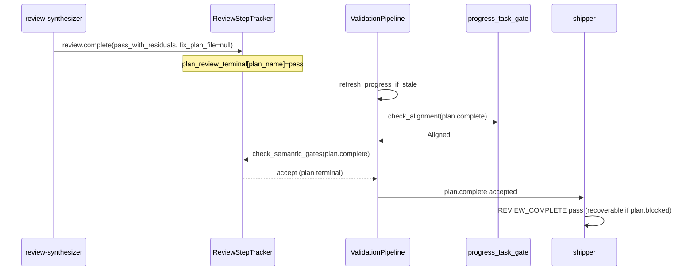

# fix: ce-executor-serial 终态路径 P0/P1 机制缝（串行 TDD v2）

## Summary

修复 `140149` / `175407` 复发的终态收口失败，使 run 在 `pass_with_residuals` 或 fix-unit 链结束后能走 **`plan.complete` → shipper → `report.done` → `LOOP_COMPLETE`（各一次）**。

v2 相对初稿的变更（对抗性审查收口）：

1. **强制 Runtime 接线 Unit**（U5/U6），不再把接线推到可选 Final Verification。
2. **U2 改为 plan 级 review 终态**，覆盖 `task_id` 不一致、多 step 单次 `review.complete` 的 140149 形状。
3. **纳入 shipper 可恢复白名单**（140149 P1-2 / 2026-06-30-001 P0-2 未闭环项）。
4. **纳入 snapshot/file stale 与 completion guard**（175407 P0）。
5. **成功标准升级为 LOOP 级**，不单测 gate 放行。

仍采用 **U1→U12 严格串行 + 单元内原子 TDD**；BDD 放在 Final Verification。

**进度（2026-07-02）：** U11（BP1-3 / R10）已通过 P0-2 提前闭合（`5a58b8ac`，显式 `--policy-check` dry-run）；U1–U10、U12 与 Final Verification 仍待实施。

---

## 现网基线 vs 仍失败缺口

| 区域 | 已有 patch（勿重复造轮） | `140149`/`175407` 仍失败原因 |
|------|--------------------------|--------------------------------|
| `progress_task_gate` | 2026-07-01：`Current Step=None` 且 **单 step** ∈ Completed → 放行 | `plan.complete` 的 step / `completed_steps` 与 snapshot 不对齐；或 gate 读 **stale snapshot** |
| `coordinator_decision_gate` | 2026-07-01-001 U3：`work.ready`→`plan.complete` payload 填充 | `pass_with_residuals` 路径 coordinator **直接** emit `plan.complete`，不经过 rewrite |
| `review_step_state` | per-step `synth_terminal`；`fix-*` 放行 | **plan 级** `review.complete` 只更新一个 `StepKey`；`plan.complete` 的 `task_id` 对不上 → `matching.is_empty()` |
| `event_policy` | `review_start_seen_keys` 已有 | `175407` 错位 `review.start` **payload 不同**（`triggered` 变），字节 dedup 拦不住 |
| shipper preset | strict-match 白名单 3 项 + stall_recovery 扩展 | `recovery_exhausted` / `review_failed` / `progress_missing_current_step` **仍 hard-fail** → recovery 螺旋 |
| `completion_honored` | 部分逻辑在 `loop_state` / `mod.rs` | 175407：`LOOP_COMPLETE` 后仍发 `report.done` / 二次 `LOOP_COMPLETE` |

---

## Problem Frame

### 业务 P0（必须在本 plan 闭合）

| ID | 现象 | 机制根因 |
|----|------|----------|
| **BP0-1** | `plan.complete` 四次被拒，loop 无 `LOOP_COMPLETE` | `plan_gate_review_not_terminal` + `progress_missing_current_step` 双卡 |
| **BP0-2** | gate 拒后 `task.resume` → 再 `review.start`，仍无法收口 | recovery 路径未修复 progress；shipper 对 recovery reason **hard-fail** |
| **BP0-3** | fix-02 后 `plan.blocked(progress_md_validation_stale)` | 内存 `LedgerSnapshot.progress` 与磁盘 `progress.md` 分裂 |
| **BP0-4** | 假成功 + 终态风暴 | `completion_after_terminal` 未拦 post-`LOOP_COMPLETE` 业务事件 |

### 业务 P1（纳入 scope）

| ID | 现象 |
|----|------|
| **BP1-1** | shipper 三次 `REVIEW_COMPLETE(fail)`（`recovery_exhausted` / `review_failed` 白名单外） |
| **BP1-2** | 错位第二次 `review.start`（非字节重复） |
| **BP1-3** | `ralph emit` 探测写盘污染事件流 | **已闭合**（U11，`5a58b8ac`：`--policy-check` dry-run 不写盘） |

**非目标**：全开 LLM precheck；重写 EventBus；executor task_key 双发治理（140149 P1-1，另开编排强化）。

---

## Requirements

| ID | 要求 |
|----|------|
| R1 | `pass`/`pass_with_residuals` + 全 unit 已在 progress 时，`plan.complete` 不得因 `progress_missing_current_step` 被拒。 |
| R2 | `review.complete`（终态 verdict，`fix_plan_file` 为 null/空）后，**plan 级** `plan.complete` 不得因 `plan_gate_review_not_terminal` 被拒（**允许 task_id 与 review.complete 不同**）。 |
| R3 | `mark_step_completed` 维护 `current_step` 指针，禁止 heading-only 空 `progress.md`。 |
| R4 | step_handoff 校验 task 前，内存缺行则从磁盘 `tasks.jsonl` reload 一次。 |
| R5 | **Runtime 接线**：U1–U4 的函数在 ValidationPipeline / EventLoop **生产路径**被调用（非仅单测）。 |
| R6 | gate 前若 snapshot.progress 与磁盘 `progress.md` 不一致，reload 后再判（消除 `progress_md_validation_stale` 误杀）。 |
| R7 | shipper strict-match 白名单扩展：`recovery_exhausted`、`review_failed`（及 schema `plan.blocked.reason` 同步）。 |
| R8 | 同 plan 同 review round 内第二次 `review.start` 被拒（语义键，非仅字节相等）。 |
| R9 | `hat=ralph` 不得发 `work.ready`。 |
| R10 | 显式 `ralph emit --policy-check`（dry-run 预检）校验通过不写盘；正式 `ralph emit`（含 Enforce 模式）校验通过后写盘。 |
| R11 | `LOOP_COMPLETE` honored 后，同 run 不再入账第二次 `LOOP_COMPLETE` / 业务 `report.done`。 |
| R12 | 每个 Unit 遵守 **Execution Protocol**；**模块完成 ≠ 目标完成**，仅 Final Verification 通过算闭环。 |

---

## Key Technical Decisions

| ID | 决策 | 理由 |
|----|------|------|
| KTD-1 | **U1–U4 交付纯函数；U5/U6 强制接线** | 审查 P0：无接线 = 线上零变化 |
| KTD-2 | `ReviewStepTracker` 增加 **`plan_review_terminal: HashMap<plan_name, PlanReviewTerminal>`** | 140149：`review.complete` 是 plan 级事件，per-step matching 必然漏 |
| KTD-3 | U1 用 **`plan.complete` + payload `completed_steps` 数组** 与 snapshot 交集判定，不解析 plan 文件 | Open Question 关闭；与 coordinator payload 契约对齐 |
| KTD-4 | U6 stale 修复：**PreCommit 前** `refresh_progress_snapshot_if_stale(path)` | 175407：`progress_md_validation_stale` |
| KTD-5 | U7 只扩 **exact-match** 白名单，禁止 substring promote | 2026-06-30-001 P0-2 教训 |
| KTD-6 | U8 `review.start` dedup 键 = `plan_name` + `fix_round` + `total_units`（忽略 `triggered`） | 175407 错位 review.start |
| KTD-7 | 成功标准 = **BDD 断言 `LOOP_COMPLETE` 恰好 1 次** | 对齐用户核心目标 |

---

## High-Level Technical Design

---

## Execution Protocol（强制）

1. **严格串行**：U1→U12；前一 Unit 测试全绿方可进入下一 Unit。
2. **模块所有权**：各 Unit **Files** 为编辑边界；**U5/U6 为唯一允许跨 2–3 个文件的接线 Unit**，且仅允许列出的调用点。
3. **零前向依赖**：Unit *N* 测试不得依赖 Unit *N+1* 符号。
4. **原子 TDD**：先 RED（仅本 Unit API）→ 实现 → 重构。
5. **接线 Unit 测试**：U5/U6 使用 **ValidationPipeline / ReviewStepTracker 的 characterization 测试**（合成 Event + Snapshot），仍禁止完整 BDD scenario。
6. **目标完成**：仅 **Final Verification** 的 BDD + `./scripts/run-tests.sh` 算 BP0 闭合。

---

## Scope Boundaries

### In scope

- U1–U12 与 Final Verification。
- `presets/en/ce-executor-serial.yml` + `presets/schemas/ce-executor-serial.yml`（U7）。
- `crates/ralph-core/data/ralph-tools-emit.md`（U11）。

### Deferred to Follow-Up Work

- preset 级 LLM `event_loop.precheck`。
- executor 同 step 双 `work.done` / task_key 漂移（140149 P1-1）。
- progress-steward preset 文案与 reason enum 全量 SSOT（140149 P1-4）。
- `review.start` 的 `triggered` 链审计（若 U8 后仍复发）。

### Outside scope

- 全开 precheck；重写 coordinator/isolated 模式。

---

## Implementation Units

### U1. Progress gate：加固 `plan.complete` 对齐（EXTEND）

**Kind:** EXTEND（基线已有 per-step Completed fallback）

**Goal:** 对 `plan.complete`，当 `Current Step=None` 时，若 payload `completed_steps` 中**每一项**均在 snapshot.completed，或 event `step` ∈ snapshot.completed → `Aligned`。

**Requirements:** R1, R12

**Dependencies:** 无

**Files:**
- `crates/ralph-core/src/step_handoff/progress_task_gate.rs`

**Approach:**
- 仅对 topic `plan.complete` 解析 payload `completed_steps: string[]`（缺省则退化为单 `step` 字段）。
- 不解析 plan 文件；不读 EventLoop。

**Execution note:** 先 RED：140149 fixture（`current_step=None`，completed 含 step-01/02，`plan.complete(step=step-02)`）。

**Test scenarios:**
- Happy：`plan.complete` + step ∈ completed → `Aligned`。
- Happy：`completed_steps=[step-01,step-02]` 全在 snapshot → `Aligned`（即使 `step` 字段为最后一步）。
- Edge：completed 少一项 → 仍 `progress_missing_current_step`。
- Edge：`queue.advance` 行为与改前一致（不退化）。
- 不涉及 tracker / wiring。

**Verification:** 本文件 `#[cfg(test)]` 全绿。

---

### U2. ReviewStepTracker：plan 级 review 终态（REWRITE）

**Kind:** NEW（plan 级状态机）

**Goal:** `observe_accepted(review.complete)` 且 `verdict ∈ {pass, pass_with_residuals}` 且 `fix_plan_file` 为 null/空 → 设置 `plan_review_terminal[plan_name]`；`check_semantic_gates(plan.complete)` 查此标志放行非 `fix-*` step，**不依赖** `plan_name+task_id` 全 step matching。

**Requirements:** R2, R12

**Dependencies:** U1

**Files:**
- `crates/ralph-core/src/event_loop/review_step_state.rs`
- `crates/ralph-core/src/event_loop/tests/review_step_gate.rs`

**Approach:**
- 新增 `PlanReviewTerminal { verdict, fix_plan_file_seen }`。
- `review.complete` + `fix_plan_file` 非空且非 `"null"` → 仍走现有 `prefill_fix_steps`；**不**设 plan terminal（fix 链）。
- `plan.complete` gate：若 `plan_review_terminal` 为 pass 类 → `None`；否则保留现有 per-step 检查。

**Test scenarios:**
- Happy：observe `review.complete(pass_with_residuals, fix_plan_file=null)` → check `plan.complete`（**不同 task_id**）→ `None`。
- Edge：`verdict=fail` → 仍拦。
- Edge：未 observe → 仍 `plan_gate_review_not_terminal`。
- Edge：`fix-01` plan.complete 仍走 fix 放行路径。
- Edge：`review.complete` + 非空 fix_plan_file → plan terminal **未**置位。

**Verification:** `review_step_gate` 测试全绿。

---

### U3. Projector：`mark_step_completed` 维护 `current_step`（EXTEND）

**Goal:** 同 v1 U3；`push_completed` 后更新 `progress_cache.current_step` 或写 `(none)` 占位。

**Requirements:** R3, R12

**Dependencies:** U2

**Files:**
- `crates/ralph-core/src/state_projector/progress.rs`
- `crates/ralph-core/src/state_projector/tests.rs`

**Test scenarios:** 同 v1（happy / 连续 mark / 缺 pointer Err）。

**Verification:** projector 相关测试绿。

---

### U4. Task ledger：reload 辅助函数（NEW）

**Goal:** `resolve_task_for_gate(tasks: &[Task], path, task_id) -> Result<Option<Task>, Error>`：内存无则 `TaskStore::load(path)` 再查。

**Requirements:** R4, R12

**Dependencies:** U3

**Files:**
- `crates/ralph-core/src/task_store.rs`（或 `step_handoff/task_resolve.rs`）

**Test scenarios:** 磁盘有/无/坏 JSON；不启动 EventLoop。

**Verification:** 本模块单测绿。

---

### U5. Runtime 接线 A：step_handoff + task reload（WIRE）

**Kind:** WIRE（审查强制）

**Goal:** 生产路径 `StepHandoffRule` 在 `check_alignment_with_snapshot` 前对 `task_id` 调用 U4；U1 逻辑自动生效（同一函数）。

**Requirements:** R5, R12

**Dependencies:** U4

**Files:**
- `crates/ralph-core/src/validation/rules_step_handoff.rs`
- `crates/ralph-core/src/validation/tests.rs`（characterization）

**Approach:**
- 从 `ValidationContext` 取 `tasks_path`（或 snapshot 元数据）；调用 U4。
- 测试：合成 `ValidationContext` + temp `tasks.jsonl`，内存 tasks 空、磁盘有行 → `plan.complete` **accept**。

**Test scenarios:**
- Happy：磁盘有 task、内存无 → StepHandoff accept。
- Edge：磁盘也无 → `task_not_found` reject（code 含 reason）。
- 不启动完整 EventLoop。

**Verification:** `rules_step_handoff` / validation tests 绿。

---

### U6. Runtime 接线 B：tracker observe + progress stale refresh（WIRE）

**Kind:** WIRE

**Goal:** (a) EventLoop 在 policy 通过后对 `review.complete` / `plan.complete` 调用 `observe_accepted` / `check_semantic_gates`（确认生产路径已接通 U2）；(b) PreCommit 前若 snapshot.progress 与磁盘 `progress.md` 解析结果不一致，用磁盘覆盖 snapshot.progress。

**Requirements:** R5, R6, R12

**Dependencies:** U5

**Files:**
- `crates/ralph-core/src/validation/pipeline.rs` 或 `validation/context.rs`（stale refresh）
- `crates/ralph-core/src/event_loop/mod.rs`（仅 tracker 调用点，若 characterization 证明已接通则 **VERIFY-only 补测试**）
- `crates/ralph-core/src/event_loop/tests/`（新 characterization 文件）

**Approach:**
- `refresh_progress_snapshot_if_stale(workspace, &mut snapshot.progress)` 纯函数 + 单测。
- Pipeline 在 StepHandoff 前调用。
- 补测试：`review.complete` 后 `plan.complete` 在 **mock pipeline** 中不被 `plan_gate_review_not_terminal` 拒。

**Test scenarios:**
- Stale：内存 progress 空、磁盘含 completed → refresh 后 gate accept。
- Tracker：observe review.complete → check plan.complete accept（pipeline 级，非 BDD）。

**Verification:** 新 characterization 测试绿；不跑 scenarios。

---

### U7. Shipper 可恢复白名单 + schema 同步（PRESET）

**Goal:** shipper 对 `plan.blocked` 的 strict-match 白名单增加（exact，trim+lowercase）：
`recovery_exhausted`、`review_failed`；schema `plan.blocked.reason` allowed_values 同步。

**Requirements:** R7, BP1-1, R12

**Dependencies:** U6

**Files:**
- `presets/en/ce-executor-serial.yml`（shipper STRICT-MATCH 段）
- `presets/schemas/ce-executor-serial.yml`
- `crates/ralph-cli/src/presets.rs`（静态断言，若已有 SSOT 测试）
- `crates/ralph-core/src/preset_lint/`（若 parity 失败则最小修）

**Test scenarios:**
- `cargo nextest run -p ralph-cli --bin ralph -- preset_lint`
- `cargo nextest run -p ralph-core -- preset_lint`
- `cargo nextest run -p ralph-cli --bin ralph -- test_ce_executor_root_preset_matches_embedded`

**Verification:** preset_lint + SSOT byte equality 绿。

---

### U8. Event policy：`review.start` 语义 dedup（EXTEND）

**Goal:** 同 `plan_name` + `fix_round` + `total_units` 第二次 `review.start` → duplicate/deny（**忽略** `triggered` 差异）。

**Requirements:** R8, R12

**Dependencies:** U7

**Files:**
- `crates/ralph-core/src/event_policy.rs`

**Test scenarios:**
- 175407 形：`triggered=ralph` 与 `triggered=review-coordinator`，其余相同 → 第二次拒。
- 不同 `total_units` → 允许。

**Verification:** event_policy 单测绿。

---

### U9. Event policy：`review.dimension.ready` dedup（VERIFY/EXTEND）

**Goal:** 同 v1 U6；巩固 `review_dimension_ready_seen_keys`。

**Requirements:** R12

**Dependencies:** U8

**Files:** `crates/ralph-core/src/event_policy.rs`

**Verification:** 相关单测绿。

---

### U10. Event origin：`ralph` + `work.ready`（VERIFY）

**Goal:** 回归锁 `ralph_control_only`。

**Requirements:** R9, R12

**Dependencies:** U9

**Files:** `crates/ralph-core/src/event_origin.rs`

**Verification:** 单测绿；若已覆盖则 **VERIFY-only** 补 083222 形用例。

---

### U11. CLI：显式 `--policy-check` dry-run（**DONE** — `5a58b8ac`）

**Kind:** DONE（初稿称 `--dry-run`；落地为既有 `--policy-check` 显式模式，语义等价）

**Goal:** 显式 `--policy-check` 仅做 schema/策略/step-handoff 预检，**校验通过不写盘**；agent 去掉该 flag 再正式 emit 才落盘。配置 `require_policy_check_for_cli_emit: true` 的 **Enforce** 路径不变（校验通过后仍写盘）。

**Requirements:** R10, R12, BP1-3

**Dependencies:** 无（相对 U1–U10 串行顺序**提前落地**，P0-2 热修；不阻塞 U12）

**Delivered in:** `5a58b8ac` + skill 文档同步（`ralph-tools-emit.md` / `ralph-tools.md` / `ralph-tools-precheck.md`）

**Files:**
- `crates/ralph-cli/src/commands/emit.rs`（`PolicyCheckMode::ExplicitCheck` 校验后 `return`，不写 JSONL）
- `crates/ralph-core/data/ralph-tools-emit.md`
- `crates/ralph-core/data/ralph-tools.md`
- `crates/ralph-core/data/ralph-tools-precheck.md`

**Not delivered:** 独立 `--dry-run` flag（与 `--policy-check` 重复；未新增别名）

**Verification:** ✅ `cargo nextest run -p ralph-cli --bin ralph -- test_emit_policy_check`；`./scripts/check-cli-doc-drift.sh`

---

### U12. Completion guard：终态后拒收（EXTEND）

**Goal:** `completion_honored` 后拒收第二次 `LOOP_COMPLETE` 与条件外 `report.done`（对齐 preset `completion_after_terminal`）。

**Requirements:** R11, BP0-4, R12

**Dependencies:** U11

**Files:**
- `crates/ralph-core/src/event_loop/loop_state.rs`
- `crates/ralph-core/src/event_loop/mod.rs`（gate 分支）
- `crates/ralph-core/src/event_loop/tests/completion_honored.rs`（或同类）

**Test scenarios:**
- Happy：首次 `LOOP_COMPLETE` → honored。
- Edge：honored 后 `report.done` → reject/drop。
- Edge：honored 后第二次 `LOOP_COMPLETE` → duplicate reject。

**Verification:** completion 相关测试绿。

---

## Final Verification

**前置：** U1–U12 全部完成。

| 项 | 内容 |
|----|------|
| BDD-1 | **新建** `crates/ralph-core/tests/scenarios/ce_executor_serial_pass_with_residuals_terminal.yml`：2 unit + `review.complete(pass_with_residuals, fix_plan_file=null)` → `plan.complete` → `REVIEW_COMPLETE` → `LOOP_COMPLETE` **×1** |
| BDD-2 | **新建/扩展** `crates/ralph-core/tests/scenarios/ce_executor_serial_fix_unit_terminal.yml`：fix-02 `test.passed` 后 `plan.complete`（非 `work.ready`）入账 |
| 回归 | `review_step_gate`、`progress_task_gate`、`event_policy`、`completion_honored`、`scenarios` |
| 基线 | `./scripts/run-tests.sh` |

**成功标准（LOOP 级）：**

- AE1–AE2：`plan.complete` 双卡消失。
- AE3：`LOOP_COMPLETE` 恰好 1 次；`REVIEW_COMPLETE` fail 风暴 ≤ 诊断阈值。
- AE4：显式 `ralph emit --policy-check` 不写盘（**已验**，U11）。
- AE5：同 plan 第二次 `review.start` 被拒或 drop。

---

## Risks & Dependencies

| 风险 | 缓解 |
|------|------|
| U2 plan terminal 误放行未 review 的 plan | fail verdict / 无 observe 仍 fail-closed；BDD-1 |
| U7 白名单过宽 | 仅 exact match；禁止 substring |
| U6 磁盘 reload 性能 | 仅 stale 或 task miss 时 reload |
| preset 改动 | U7 必须跑 preset_lint 四件套 |

---

## Acceptance Examples

| ID | 场景 | 期望 |
|----|------|------|
| AE1 | 140149 形：2 unit 完成 + `pass_with_residuals` | `plan.complete` 入账 |
| AE2 | `plan.complete` 的 task_id ≠ `review.complete` 的 task_id | 仍入账（plan terminal） |
| AE3 | 正常收口 | `LOOP_COMPLETE` ×1 |
| AE4 | `ralph emit <topic> --policy-check ...`（显式 dry-run） | events 行数不变；正式 emit 才追加 |
| AE5 | 同 plan 第二次 `review.start`（triggered 不同） | policy deny/duplicate |

---

## Sources & Research

- `docs/report/2026-07-01-ce-executor-serial-primary-20260701-140149-diagnosis.md`
- `docs/report/2026-07-01-ce-executor-serial-primary-20260630-175407-diagnosis.md`
- `docs/achieved/plan/2026-06-30-001-fix-ce-executor-serial-fix-unit-terminal-p0-plan.md`
- `docs/achieved/plan/2026-07-01-001-fix-ce-executor-serial-p0-terminal-storm-plan.md`
- `docs/solutions/logic-errors/ce-executor-p0-event-policy-and-projector-fanout.md`

---

## Revision Log

| 日期 | 变更 |
|------|------|
| 2026-07-02 v1 | 初稿 U1–U8 + 可选 FV 接线 |
| 2026-07-02 v2 | 对抗性审查收口：U5/U6 强制接线、U2 plan 级终端、U7 shipper、U6 stale、U8 语义 dedup、U12 completion guard、LOOP 级成功标准 |
| 2026-07-02 v2.1 | Plan Reviewer 就地修补：Final Verification BDD-1/BDD-2 路径标注 "新建/扩展"（磁盘校验时两文件尚不存在,避免执行方误读为已落地）；其他 17 处引用文件均存在 |
| 2026-07-02 v2.2 | **U11 标 DONE**：P0-2 已用显式 `--policy-check`（非独立 `--dry-run` flag）实现 dry-run 不写盘（`5a58b8ac`）；R10/AE4/BP1-3 措辞与实现对齐；注明 U11 相对 U1–U10 提前落地、不阻塞 U12 |
